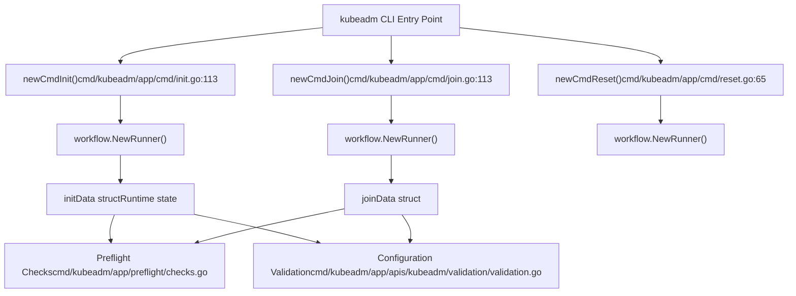
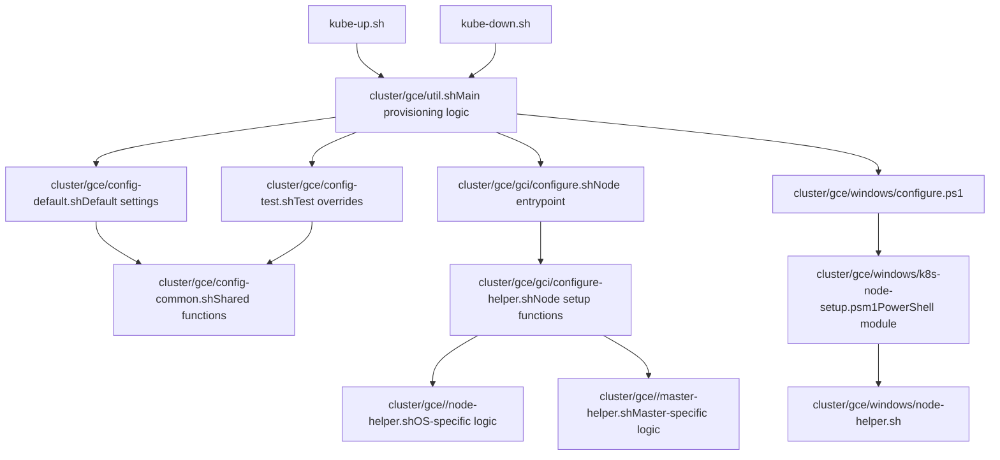
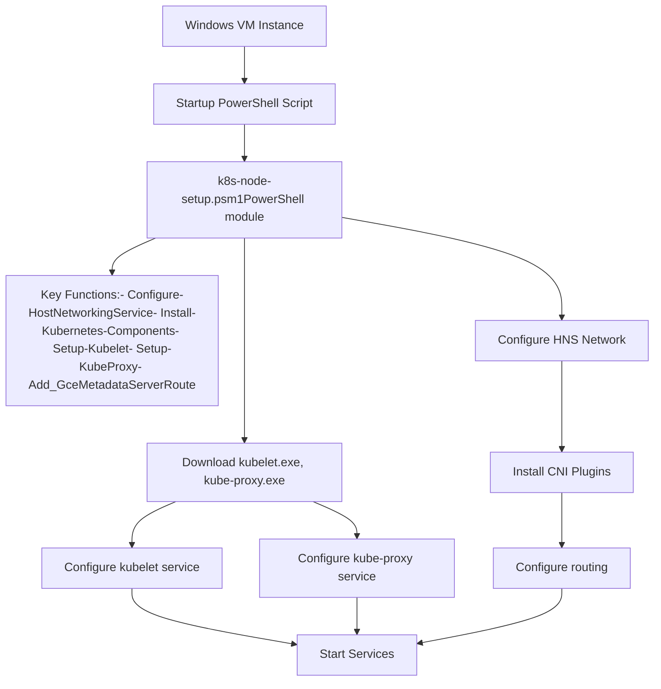

# Cluster Bootstrap and Management

Relevant source files

-   [build/root/Makefile](https://github.com/kubernetes/kubernetes/blob/2757a872/build/root/Makefile)
-   [cluster/common.sh](https://github.com/kubernetes/kubernetes/blob/2757a872/cluster/common.sh)
-   [cluster/gce/config-common.sh](https://github.com/kubernetes/kubernetes/blob/2757a872/cluster/gce/config-common.sh)
-   [cluster/gce/config-default.sh](https://github.com/kubernetes/kubernetes/blob/2757a872/cluster/gce/config-default.sh)
-   [cluster/gce/config-test.sh](https://github.com/kubernetes/kubernetes/blob/2757a872/cluster/gce/config-test.sh)
-   [cluster/gce/gci/configure-helper.sh](https://github.com/kubernetes/kubernetes/blob/2757a872/cluster/gce/gci/configure-helper.sh)
-   [cluster/gce/gci/configure.sh](https://github.com/kubernetes/kubernetes/blob/2757a872/cluster/gce/gci/configure.sh)
-   [cluster/gce/util.sh](https://github.com/kubernetes/kubernetes/blob/2757a872/cluster/gce/util.sh)
-   [cluster/gce/windows/README-GCE-Windows-kube-up.md](https://github.com/kubernetes/kubernetes/blob/2757a872/cluster/gce/windows/README-GCE-Windows-kube-up.md?plain=1)
-   [cluster/gce/windows/common.psm1](https://github.com/kubernetes/kubernetes/blob/2757a872/cluster/gce/windows/common.psm1)
-   [cluster/gce/windows/configure.ps1](https://github.com/kubernetes/kubernetes/blob/2757a872/cluster/gce/windows/configure.ps1)
-   [cluster/gce/windows/k8s-node-setup.psm1](https://github.com/kubernetes/kubernetes/blob/2757a872/cluster/gce/windows/k8s-node-setup.psm1)
-   [cluster/gce/windows/node-helper.sh](https://github.com/kubernetes/kubernetes/blob/2757a872/cluster/gce/windows/node-helper.sh)
-   [cluster/gce/windows/smoke-test.sh](https://github.com/kubernetes/kubernetes/blob/2757a872/cluster/gce/windows/smoke-test.sh)
-   [cluster/gce/windows/testonly/install-ssh.psm1](https://github.com/kubernetes/kubernetes/blob/2757a872/cluster/gce/windows/testonly/install-ssh.psm1)
-   [cluster/gce/windows/testonly/user-profile.psm1](https://github.com/kubernetes/kubernetes/blob/2757a872/cluster/gce/windows/testonly/user-profile.psm1)
-   [cmd/kubeadm/app/apis/kubeadm/fuzzer/fuzzer.go](https://github.com/kubernetes/kubernetes/blob/2757a872/cmd/kubeadm/app/apis/kubeadm/fuzzer/fuzzer.go)
-   [cmd/kubeadm/app/apis/kubeadm/timeoututils.go](https://github.com/kubernetes/kubernetes/blob/2757a872/cmd/kubeadm/app/apis/kubeadm/timeoututils.go)
-   [cmd/kubeadm/app/apis/kubeadm/types.go](https://github.com/kubernetes/kubernetes/blob/2757a872/cmd/kubeadm/app/apis/kubeadm/types.go)
-   [cmd/kubeadm/app/apis/kubeadm/v1beta3/conversion.go](https://github.com/kubernetes/kubernetes/blob/2757a872/cmd/kubeadm/app/apis/kubeadm/v1beta3/conversion.go)
-   [cmd/kubeadm/app/apis/kubeadm/v1beta3/zz\_generated.conversion.go](https://github.com/kubernetes/kubernetes/blob/2757a872/cmd/kubeadm/app/apis/kubeadm/v1beta3/zz_generated.conversion.go)
-   [cmd/kubeadm/app/apis/kubeadm/v1beta4/conversion.go](https://github.com/kubernetes/kubernetes/blob/2757a872/cmd/kubeadm/app/apis/kubeadm/v1beta4/conversion.go)
-   [cmd/kubeadm/app/apis/kubeadm/v1beta4/defaults.go](https://github.com/kubernetes/kubernetes/blob/2757a872/cmd/kubeadm/app/apis/kubeadm/v1beta4/defaults.go)
-   [cmd/kubeadm/app/apis/kubeadm/v1beta4/doc.go](https://github.com/kubernetes/kubernetes/blob/2757a872/cmd/kubeadm/app/apis/kubeadm/v1beta4/doc.go)
-   [cmd/kubeadm/app/apis/kubeadm/v1beta4/types.go](https://github.com/kubernetes/kubernetes/blob/2757a872/cmd/kubeadm/app/apis/kubeadm/v1beta4/types.go)
-   [cmd/kubeadm/app/apis/kubeadm/v1beta4/zz\_generated.conversion.go](https://github.com/kubernetes/kubernetes/blob/2757a872/cmd/kubeadm/app/apis/kubeadm/v1beta4/zz_generated.conversion.go)
-   [cmd/kubeadm/app/apis/kubeadm/v1beta4/zz\_generated.deepcopy.go](https://github.com/kubernetes/kubernetes/blob/2757a872/cmd/kubeadm/app/apis/kubeadm/v1beta4/zz_generated.deepcopy.go)
-   [cmd/kubeadm/app/apis/kubeadm/v1beta4/zz\_generated.defaults.go](https://github.com/kubernetes/kubernetes/blob/2757a872/cmd/kubeadm/app/apis/kubeadm/v1beta4/zz_generated.defaults.go)
-   [cmd/kubeadm/app/apis/kubeadm/validation/validation.go](https://github.com/kubernetes/kubernetes/blob/2757a872/cmd/kubeadm/app/apis/kubeadm/validation/validation.go)
-   [cmd/kubeadm/app/apis/kubeadm/validation/validation\_test.go](https://github.com/kubernetes/kubernetes/blob/2757a872/cmd/kubeadm/app/apis/kubeadm/validation/validation_test.go)
-   [cmd/kubeadm/app/apis/kubeadm/zz\_generated.deepcopy.go](https://github.com/kubernetes/kubernetes/blob/2757a872/cmd/kubeadm/app/apis/kubeadm/zz_generated.deepcopy.go)
-   [cmd/kubeadm/app/cmd/config.go](https://github.com/kubernetes/kubernetes/blob/2757a872/cmd/kubeadm/app/cmd/config.go)
-   [cmd/kubeadm/app/cmd/config\_test.go](https://github.com/kubernetes/kubernetes/blob/2757a872/cmd/kubeadm/app/cmd/config_test.go)
-   [cmd/kubeadm/app/cmd/init.go](https://github.com/kubernetes/kubernetes/blob/2757a872/cmd/kubeadm/app/cmd/init.go)
-   [cmd/kubeadm/app/cmd/init\_test.go](https://github.com/kubernetes/kubernetes/blob/2757a872/cmd/kubeadm/app/cmd/init_test.go)
-   [cmd/kubeadm/app/cmd/join.go](https://github.com/kubernetes/kubernetes/blob/2757a872/cmd/kubeadm/app/cmd/join.go)
-   [cmd/kubeadm/app/cmd/join\_test.go](https://github.com/kubernetes/kubernetes/blob/2757a872/cmd/kubeadm/app/cmd/join_test.go)
-   [cmd/kubeadm/app/cmd/reset.go](https://github.com/kubernetes/kubernetes/blob/2757a872/cmd/kubeadm/app/cmd/reset.go)
-   [cmd/kubeadm/app/cmd/reset\_test.go](https://github.com/kubernetes/kubernetes/blob/2757a872/cmd/kubeadm/app/cmd/reset_test.go)
-   [cmd/kubeadm/app/cmd/token.go](https://github.com/kubernetes/kubernetes/blob/2757a872/cmd/kubeadm/app/cmd/token.go)
-   [cmd/kubeadm/app/cmd/token\_test.go](https://github.com/kubernetes/kubernetes/blob/2757a872/cmd/kubeadm/app/cmd/token_test.go)
-   [cmd/kubeadm/app/cmd/util/cmdutil.go](https://github.com/kubernetes/kubernetes/blob/2757a872/cmd/kubeadm/app/cmd/util/cmdutil.go)
-   [cmd/kubeadm/app/preflight/checks.go](https://github.com/kubernetes/kubernetes/blob/2757a872/cmd/kubeadm/app/preflight/checks.go)
-   [cmd/kubeadm/app/preflight/checks\_test.go](https://github.com/kubernetes/kubernetes/blob/2757a872/cmd/kubeadm/app/preflight/checks_test.go)
-   [cmd/kubeadm/app/util/config/common.go](https://github.com/kubernetes/kubernetes/blob/2757a872/cmd/kubeadm/app/util/config/common.go)
-   [cmd/kubeadm/app/util/config/common\_test.go](https://github.com/kubernetes/kubernetes/blob/2757a872/cmd/kubeadm/app/util/config/common_test.go)
-   [cmd/kubeadm/app/util/config/initconfiguration.go](https://github.com/kubernetes/kubernetes/blob/2757a872/cmd/kubeadm/app/util/config/initconfiguration.go)
-   [cmd/kubeadm/app/util/config/initconfiguration\_test.go](https://github.com/kubernetes/kubernetes/blob/2757a872/cmd/kubeadm/app/util/config/initconfiguration_test.go)
-   [cmd/kubeadm/app/util/config/joinconfiguration.go](https://github.com/kubernetes/kubernetes/blob/2757a872/cmd/kubeadm/app/util/config/joinconfiguration.go)
-   [cmd/kubeadm/app/util/config/joinconfiguration\_test.go](https://github.com/kubernetes/kubernetes/blob/2757a872/cmd/kubeadm/app/util/config/joinconfiguration_test.go)
-   [cmd/kubeadm/app/util/config/resetconfiguration.go](https://github.com/kubernetes/kubernetes/blob/2757a872/cmd/kubeadm/app/util/config/resetconfiguration.go)
-   [cmd/kubeadm/app/util/config/resetconfiguration\_test.go](https://github.com/kubernetes/kubernetes/blob/2757a872/cmd/kubeadm/app/util/config/resetconfiguration_test.go)
-   [cmd/kubeadm/app/util/config/upgradeconfiguration.go](https://github.com/kubernetes/kubernetes/blob/2757a872/cmd/kubeadm/app/util/config/upgradeconfiguration.go)
-   [cmd/kubeadm/app/util/config/upgradeconfiguration\_test.go](https://github.com/kubernetes/kubernetes/blob/2757a872/cmd/kubeadm/app/util/config/upgradeconfiguration_test.go)
-   [hack/ginkgo-e2e.sh](https://github.com/kubernetes/kubernetes/blob/2757a872/hack/ginkgo-e2e.sh)
-   [hack/lib/init.sh](https://github.com/kubernetes/kubernetes/blob/2757a872/hack/lib/init.sh)
-   [hack/local-up-cluster.sh](https://github.com/kubernetes/kubernetes/blob/2757a872/hack/local-up-cluster.sh)
-   [hack/make-rules/test-e2e-node.sh](https://github.com/kubernetes/kubernetes/blob/2757a872/hack/make-rules/test-e2e-node.sh)
-   [test/e2e/chaosmonkey/chaosmonkey.go](https://github.com/kubernetes/kubernetes/blob/2757a872/test/e2e/chaosmonkey/chaosmonkey.go)
-   [test/e2e/e2e.go](https://github.com/kubernetes/kubernetes/blob/2757a872/test/e2e/e2e.go)
-   [test/e2e/e2e\_test.go](https://github.com/kubernetes/kubernetes/blob/2757a872/test/e2e/e2e_test.go)
-   [test/e2e/framework/framework.go](https://github.com/kubernetes/kubernetes/blob/2757a872/test/e2e/framework/framework.go)
-   [test/e2e/framework/kubelet/kubelet\_pods.go](https://github.com/kubernetes/kubernetes/blob/2757a872/test/e2e/framework/kubelet/kubelet_pods.go)
-   [test/e2e/framework/kubelet/stats.go](https://github.com/kubernetes/kubernetes/blob/2757a872/test/e2e/framework/kubelet/stats.go)
-   [test/e2e/framework/test\_context.go](https://github.com/kubernetes/kubernetes/blob/2757a872/test/e2e/framework/test_context.go)
-   [test/e2e/framework/util.go](https://github.com/kubernetes/kubernetes/blob/2757a872/test/e2e/framework/util.go)
-   [test/e2e/reporters/progress.go](https://github.com/kubernetes/kubernetes/blob/2757a872/test/e2e/reporters/progress.go)
-   [test/e2e/scheduling/framework.go](https://github.com/kubernetes/kubernetes/blob/2757a872/test/e2e/scheduling/framework.go)
-   [test/e2e/scheduling/limit\_range.go](https://github.com/kubernetes/kubernetes/blob/2757a872/test/e2e/scheduling/limit_range.go)
-   [test/e2e/scheduling/predicates.go](https://github.com/kubernetes/kubernetes/blob/2757a872/test/e2e/scheduling/predicates.go)
-   [test/e2e/scheduling/preemption.go](https://github.com/kubernetes/kubernetes/blob/2757a872/test/e2e/scheduling/preemption.go)
-   [test/e2e/scheduling/priorities.go](https://github.com/kubernetes/kubernetes/blob/2757a872/test/e2e/scheduling/priorities.go)
-   [test/e2e/scheduling/ubernetes\_lite.go](https://github.com/kubernetes/kubernetes/blob/2757a872/test/e2e/scheduling/ubernetes_lite.go)
-   [test/e2e/suites.go](https://github.com/kubernetes/kubernetes/blob/2757a872/test/e2e/suites.go)
-   [test/e2e\_kubeadm/e2e\_kubeadm\_suite\_test.go](https://github.com/kubernetes/kubernetes/blob/2757a872/test/e2e_kubeadm/e2e_kubeadm_suite_test.go)
-   [test/e2e\_node/builder/build.go](https://github.com/kubernetes/kubernetes/blob/2757a872/test/e2e_node/builder/build.go)
-   [test/e2e\_node/conformance/run\_test.sh](https://github.com/kubernetes/kubernetes/blob/2757a872/test/e2e_node/conformance/run_test.sh)
-   [test/e2e\_node/e2e\_node\_suite\_test.go](https://github.com/kubernetes/kubernetes/blob/2757a872/test/e2e_node/e2e_node_suite_test.go)
-   [test/e2e\_node/kubeletconfig/kubeletconfig.go](https://github.com/kubernetes/kubernetes/blob/2757a872/test/e2e_node/kubeletconfig/kubeletconfig.go)
-   [test/e2e\_node/remote/cadvisor\_e2e.go](https://github.com/kubernetes/kubernetes/blob/2757a872/test/e2e_node/remote/cadvisor_e2e.go)
-   [test/e2e\_node/remote/node\_conformance.go](https://github.com/kubernetes/kubernetes/blob/2757a872/test/e2e_node/remote/node_conformance.go)
-   [test/e2e\_node/remote/node\_e2e.go](https://github.com/kubernetes/kubernetes/blob/2757a872/test/e2e_node/remote/node_e2e.go)
-   [test/e2e\_node/remote/remote.go](https://github.com/kubernetes/kubernetes/blob/2757a872/test/e2e_node/remote/remote.go)
-   [test/e2e\_node/remote/types.go](https://github.com/kubernetes/kubernetes/blob/2757a872/test/e2e_node/remote/types.go)
-   [test/e2e\_node/remote/utils.go](https://github.com/kubernetes/kubernetes/blob/2757a872/test/e2e_node/remote/utils.go)
-   [test/e2e\_node/runner/local/run\_local.go](https://github.com/kubernetes/kubernetes/blob/2757a872/test/e2e_node/runner/local/run_local.go)
-   [test/e2e\_node/runner/remote/run\_remote.go](https://github.com/kubernetes/kubernetes/blob/2757a872/test/e2e_node/runner/remote/run_remote.go)
-   [test/e2e\_node/services/kubelet.go](https://github.com/kubernetes/kubernetes/blob/2757a872/test/e2e_node/services/kubelet.go)
-   [test/e2e\_node/services/server.go](https://github.com/kubernetes/kubernetes/blob/2757a872/test/e2e_node/services/server.go)
-   [test/e2e\_node/services/services.go](https://github.com/kubernetes/kubernetes/blob/2757a872/test/e2e_node/services/services.go)
-   [test/e2e\_node/services/util.go](https://github.com/kubernetes/kubernetes/blob/2757a872/test/e2e_node/services/util.go)
-   [test/utils/paths.go](https://github.com/kubernetes/kubernetes/blob/2757a872/test/utils/paths.go)

## Purpose and Scope

This document covers the tools and processes for bootstrapping Kubernetes clusters and managing their initial setup. It encompasses three primary approaches: **kubeadm** for production cluster initialization, **GCE provisioning scripts** for Google Cloud deployments, and **local development environments** for testing and development.

For information about ongoing cluster operations after bootstrap, see the Control Plane Components documentation [3](https://github.com/kubernetes/kubernetes/blob/2757a872/3) For testing infrastructure that validates clusters, see [6](https://github.com/kubernetes/kubernetes/blob/2757a872/6)

**Key subsystems documented here:**

-   `kubeadm` CLI commands and workflow phases
-   GCE/GKE cluster provisioning automation
-   Local development cluster setup scripts
-   PKI certificate generation and distribution
-   Node configuration and registration

---

## Bootstrap Approaches Overview

Kubernetes clusters can be bootstrapped through different mechanisms depending on the deployment target:

| Approach | Primary Use Case | Entry Point | Configuration Method |
| --- | --- | --- | --- |
| **kubeadm** | Production clusters, manual setup | `kubeadm init/join` CLI | YAML config files + flags |
| **GCE Scripts** | Google Cloud deployments | `cluster/gce/util.sh` functions | Shell environment variables |
| **Local Cluster** | Development/testing | `hack/local-up-cluster.sh` | Shell environment variables |

All approaches share common goals:

1.  Generate and distribute PKI certificates
2.  Start control plane components (etcd, kube-apiserver, controller-manager, scheduler)
3.  Configure and start kubelet on nodes
4.  Set up networking (CNI, kube-proxy)
5.  Apply initial cluster configuration

**Sources:** [cluster/gce/util.sh1-600](https://github.com/kubernetes/kubernetes/blob/2757a872/cluster/gce/util.sh#L1-L600) [hack/local-up-cluster.sh1-200](https://github.com/kubernetes/kubernetes/blob/2757a872/hack/local-up-cluster.sh#L1-L200) [cmd/kubeadm/app/cmd/init.go1-100](https://github.com/kubernetes/kubernetes/blob/2757a872/cmd/kubeadm/app/cmd/init.go#L1-L100)

---

## kubeadm Architecture

### Command Structure


**kubeadm Init Phases Execution Order:**

> **[Mermaid sequence]**
> *(图表结构无法解析)*

**Sources:** [cmd/kubeadm/app/cmd/init.go113-200](https://github.com/kubernetes/kubernetes/blob/2757a872/cmd/kubeadm/app/cmd/init.go#L113-L200) [cmd/kubeadm/app/cmd/phases/init](https://github.com/kubernetes/kubernetes/blob/2757a872/cmd/kubeadm/app/cmd/phases/init)

---

### initData and Configuration

The `initData` struct maintains runtime state throughout the init workflow:

**Key Fields:**

-   `cfg *kubeadmapi.InitConfiguration` - Parsed and validated cluster configuration
-   `client clientset.Interface` - Kubernetes API client
-   `certificatesDir string` - Location for PKI materials (default: `/etc/kubernetes/pki`)
-   `kubeconfigDir string` - Location for kubeconfig files (default: `/etc/kubernetes`)
-   `dryRun bool` - When true, prints actions without executing
-   `ignorePreflightErrors sets.Set[string]` - Preflight checks to skip
-   `uploadCerts bool` - Whether to upload control plane certificates to cluster

**Configuration Sources:**

1.  YAML file specified with `--config` flag
2.  Command-line flags (e.g., `--apiserver-advertise-address`)
3.  Auto-detected values (node IP, CRI socket)
4.  Defaults from [cmd/kubeadm/app/apis/kubeadm/types.go](https://github.com/kubernetes/kubernetes/blob/2757a872/cmd/kubeadm/app/apis/kubeadm/types.go)

**Sources:** [cmd/kubeadm/app/cmd/init.go89-108](https://github.com/kubernetes/kubernetes/blob/2757a872/cmd/kubeadm/app/cmd/init.go#L89-L108) [cmd/kubeadm/app/apis/kubeadm/types.go1-200](https://github.com/kubernetes/kubernetes/blob/2757a872/cmd/kubeadm/app/apis/kubeadm/types.go#L1-L200)

---

### Preflight Checks

Preflight validation ensures the system meets requirements before bootstrapping:

```mermaid
flowchart TD
    SysCheck["System Checks"]
    NetCheck["Network Checks"]
    RTCheck["Container Runtime Checks"]
    PortCheck["Port Availability Checks"]
    FileCheck["File/Directory Checks"]
    IsPriv["IsPrivilegedUser"]
    NumCPU["NumCPU (min 2)"]
    Mem["Mem (min 1700MB)"]
    Kernel["KernelVersion"]
    Hostname["Hostname"]
    Swap["Swap (should be off)"]
    IPForward["IPv4/IPv6 Forwarding"]
    BridgeNF["Bridge Netfilter"]
    CRICheck["ContainerRuntimeCheckchecks.go:88"]
    CRIVersion["ContainerRuntimeVersionCheckchecks.go:119"]
    CRISocket["Socket connectivity"]
    Port6443["API Server :6443"]
    Port10259["Scheduler :10259"]
    Port10257["Controller Manager :10257"]
    Port2379["etcd :2379-2380"]
    Port10250["kubelet :10250"]
    KubeConfig["FileExisting /etc/kubernetes/manifests"]
    PKIDir["DirAvailable /etc/kubernetes/pki"]
    EtcdDir["DirAvailable /var/lib/etcd"]

    SysCheck --> IsPriv
    SysCheck --> NumCPU
    SysCheck --> Mem
    SysCheck --> Kernel
    SysCheck --> Hostname
    SysCheck --> Swap
    NetCheck --> IPForward
    NetCheck --> BridgeNF
    RTCheck --> CRICheck
    RTCheck --> CRIVersion
    RTCheck --> CRISocket
    PortCheck --> Port6443
    PortCheck --> Port10259
    PortCheck --> Port10257
    PortCheck --> Port2379
    PortCheck --> Port10250
    FileCheck --> KubeConfig
    FileCheck --> PKIDir
    FileCheck --> EtcdDir
```


**Check Implementation:**

Each check implements the `Checker` interface:

```
type Checker interface {    Check() (warnings, errorList []error)    Name() string}
```
**Error Handling:**

-   Errors cause init to fail unless ignored via `--ignore-preflight-errors`
-   Warnings are displayed but don't block execution
-   Special value `--ignore-preflight-errors=all` bypasses all checks

**Sources:** [cmd/kubeadm/app/preflight/checks.go69-220](https://github.com/kubernetes/kubernetes/blob/2757a872/cmd/kubeadm/app/preflight/checks.go#L69-L220) [cmd/kubeadm/app/preflight/checks.go88-103](https://github.com/kubernetes/kubernetes/blob/2757a872/cmd/kubeadm/app/preflight/checks.go#L88-L103)

---

### Join Workflow

Node joining involves discovery, TLS bootstrap, and configuration:

> **[Mermaid sequence]**
> *(图表结构无法解析)*

**Discovery Methods:**

| Method | Security | Use Case |
| --- | --- | --- |
| **Token + CA Hash** | Token validates cluster identity, hash validates CA cert | Default, automated joins |
| **Token + --discovery-token-unsafe-skip-ca-verification** | Token only (MITM vulnerable) | Testing only |
| **File** | Kubeconfig with embedded CA | Pre-configured nodes |
| **HTTPS URL** | Download kubeconfig over TLS | Automated provisioning |

**Sources:** [cmd/kubeadm/app/cmd/join.go1-400](https://github.com/kubernetes/kubernetes/blob/2757a872/cmd/kubeadm/app/cmd/join.go#L1-L400) [cmd/kubeadm/app/discovery/token](https://github.com/kubernetes/kubernetes/blob/2757a872/cmd/kubeadm/app/discovery/token)

---

## GCE Cluster Provisioning

### Provisioning Architecture

GCE cluster setup uses shell scripts that orchestrate VM creation, configuration, and cluster initialization:


**Sources:** [cluster/gce/util.sh1-100](https://github.com/kubernetes/kubernetes/blob/2757a872/cluster/gce/util.sh#L1-L100) [cluster/gce/gci/configure.sh1-50](https://github.com/kubernetes/kubernetes/blob/2757a872/cluster/gce/gci/configure.sh#L1-L50) [cluster/gce/gci/configure-helper.sh1-50](https://github.com/kubernetes/kubernetes/blob/2757a872/cluster/gce/gci/configure-helper.sh#L1-L50)

---

### Configuration Variables

GCE provisioning is controlled through environment variables set in config files:

**Essential Variables:**

| Variable | Default | Purpose |
| --- | --- | --- |
| `PROJECT` | Auto-detected from gcloud | GCP project ID |
| `ZONE` | `us-central1-b` | GCP zone for resources |
| `CLUSTER_NAME` | `${INSTANCE_PREFIX}` | Cluster identifier |
| `NUM_NODES` | 3 | Number of worker nodes |
| `MASTER_SIZE` | `e2-standard-$(get-master-size)` | Master VM machine type |
| `NODE_SIZE` | `e2-standard-2` | Node VM machine type |
| `MASTER_DISK_SIZE` | Calculated | Master persistent disk size |
| `NODE_DISK_SIZE` | `100GB` | Node persistent disk size |
| `NETWORK` | `default` | VPC network name |
| `KUBE_VERSION` | Latest | Kubernetes version to deploy |
| `MASTER_OS_DISTRIBUTION` | `gci` | Master OS (gci/ubuntu) |
| `NODE_OS_DISTRIBUTION` | `gci` | Node OS (gci/ubuntu) |
| `CONTAINER_RUNTIME_ENDPOINT` | `unix:///run/containerd/containerd.sock` | CRI socket path |

**Advanced Variables:**

| Variable | Purpose |
| --- | --- |
| `ENABLE_CLUSTER_DNS` | Enable CoreDNS (default: true) |
| `ENABLE_NODE_LOGGING` | Enable node log collection (default: true) |
| `ENABLE_CLUSTER_LOGGING` | Enable centralized logging (default: true) |
| `ENABLE_METADATA_CONCEALMENT` | Firewall metadata server access (default: varies) |
| `ENABLE_NETD` | Deploy netd DaemonSet for networking |
| `NETWORK_POLICY_PROVIDER` | Network policy implementation (calico/none) |
| `NODE_ACCELERATORS` | GPU configuration string |
| `NODE_LOCAL_SSDS` | Number of local SSDs to attach |
| `PREEMPTIBLE_NODE` | Use preemptible VMs for cost savings |

**Sources:** [cluster/gce/config-default.sh1-300](https://github.com/kubernetes/kubernetes/blob/2757a872/cluster/gce/config-default.sh#L1-L300) [cluster/gce/config-test.sh1-300](https://github.com/kubernetes/kubernetes/blob/2757a872/cluster/gce/config-test.sh#L1-L300)

---

### Provisioning Flow

**Master Creation and Initialization:**

> **[Mermaid sequence]**
> *(图表结构无法解析)*

**Worker Node Creation:**

> **[Mermaid sequence]**
> *(图表结构无法解析)*

**Sources:** [cluster/gce/util.sh500-800](https://github.com/kubernetes/kubernetes/blob/2757a872/cluster/gce/util.sh#L500-L800) [cluster/gce/gci/configure-helper.sh1-1000](https://github.com/kubernetes/kubernetes/blob/2757a872/cluster/gce/gci/configure-helper.sh#L1-L1000)

---

### Binary and Image Distribution

GCE provisioning distributes Kubernetes binaries and container images through Google Cloud Storage:

**Binary Distribution Process:**

1.  **Local Build or Version Selection:**

    -   `tars_from_version()` determines binary source [cluster/gce/util.sh512-547](https://github.com/kubernetes/kubernetes/blob/2757a872/cluster/gce/util.sh#L512-L547)
    -   If `KUBE_VERSION` unset: builds locally via `find-release-tars()`
    -   If version matches release regex: downloads from `dl.k8s.io`
    -   If version matches CI regex: downloads from `k8s-release-dev` bucket
2.  **Upload to GCS:**

    -   `upload-tars()` stages binaries to regional GCS buckets [cluster/gce/util.sh296-375](https://github.com/kubernetes/kubernetes/blob/2757a872/cluster/gce/util.sh#L296-L375)
    -   Creates staging buckets per-project: `gs://kubernetes-staging-${project_hash}-${region}`
    -   Uploads server binary tar, manifests tar with SHA512 verification
    -   Generates CSV list of URLs for regional fallback
3.  **Node Download:**

    -   `download-or-bust()` on nodes fetches binaries with retry [cluster/gce/gci/configure.sh177-226](https://github.com/kubernetes/kubernetes/blob/2757a872/cluster/gce/gci/configure.sh#L177-L226)
    -   Tries regional URLs in preference order (based on zone)
    -   Uses service account credentials for private buckets
    -   Validates SHA512 hash before extraction

**Image Distribution:**

Container images are either:

-   Pre-pulled on base VM images (GCI/COS)
-   Pulled on-demand by containerd from public registries
-   Pulled from private GCR using VM service account

**Sources:** [cluster/gce/util.sh296-547](https://github.com/kubernetes/kubernetes/blob/2757a872/cluster/gce/util.sh#L296-L547) [cluster/gce/gci/configure.sh177-226](https://github.com/kubernetes/kubernetes/blob/2757a872/cluster/gce/gci/configure.sh#L177-L226)

---

### PKI Setup on GCE

GCE provisioning generates and distributes PKI materials differently from kubeadm:

**Certificate Generation (Master):**

The master generates certificates in `create-master-pki()` [cluster/gce/gci/configure-helper.sh704-814](https://github.com/kubernetes/kubernetes/blob/2757a872/cluster/gce/gci/configure-helper.sh#L704-L814):

```
/etc/srv/kubernetes/pki/
├── ca.crt                          # Cluster CA certificate
├── ca.key                          # Cluster CA private key
├── apiserver.crt                   # API server serving cert
├── apiserver.key                   # API server serving key
├── apiserver-client.crt            # API server client cert (for extensions)
├── apiserver-client.key
├── serviceaccount.crt              # Service account signing cert
├── serviceaccount.key              # Service account signing key
├── aggr_ca.crt                     # Aggregation layer CA (if enabled)
├── proxy_client.crt                # Aggregation layer proxy client
├── proxy_client.key
├── konnectivity-server/            # Konnectivity (if enabled)
│   ├── ca.crt
│   ├── server.crt
│   └── server.key
└── konnectivity-agent/
    ├── ca.crt
    ├── client.crt
    └── client.key
```
**Certificate Distribution (Nodes):**

Nodes receive certificates via GCE metadata [cluster/gce/gci/configure-helper.sh672-702](https://github.com/kubernetes/kubernetes/blob/2757a872/cluster/gce/gci/configure-helper.sh#L672-L702):

```
/etc/srv/kubernetes/pki/
├── ca-certificates.crt              # CA bundle for validating API server
├── kubelet.crt                      # Kubelet client cert (if static certs used)
├── kubelet.key
└── konnectivity-agent/              # Konnectivity agent certs (if enabled)
    ├── ca.crt
    ├── client.crt
    └── client.key
```
**Certificate Metadata Encoding:**

Certificates are base64-encoded and passed via GCE instance metadata attributes:

-   Master: `kube-master-certs` metadata attribute
-   Nodes: `kube-env` metadata attribute includes `CA_CERT_BUNDLE`, `KUBELET_CERT`, `KUBELET_KEY`

**Sources:** [cluster/gce/gci/configure-helper.sh658-814](https://github.com/kubernetes/kubernetes/blob/2757a872/cluster/gce/gci/configure-helper.sh#L658-L814) [cluster/gce/gci/configure-helper.sh704-814](https://github.com/kubernetes/kubernetes/blob/2757a872/cluster/gce/gci/configure-helper.sh#L704-L814)

---

### Windows Node Bootstrap

Windows nodes follow a different provisioning path due to platform differences:


**Key Differences from Linux:**

| Aspect | Linux | Windows |
| --- | --- | --- |
| **Container Runtime** | containerd via CRI | containerd via CRI (Windows mode) |
| **Networking** | CNI plugins + iptables/IPVS | HNS (Host Networking Service) + Windows CNI |
| **Service Management** | systemd | Windows Service Manager |
| **Configuration Script** | Bash (configure-helper.sh) | PowerShell (k8s-node-setup.psm1) |
| **Kubelet Process Isolation** | Host OS | Windows Server container |

**Windows-Specific Functions:**

-   `Configure-HostNetworkingService()` - Sets up HNS overlay network [cluster/gce/windows/k8s-node-setup.psm1200-400](https://github.com/kubernetes/kubernetes/blob/2757a872/cluster/gce/windows/k8s-node-setup.psm1#L200-L400)
-   `Add_GceMetadataServerRoute()` - Ensures metadata server route exists on all interfaces [cluster/gce/windows/k8s-node-setup.psm1120-140](https://github.com/kubernetes/kubernetes/blob/2757a872/cluster/gce/windows/k8s-node-setup.psm1#L120-L140)
-   `Install-Kubernetes-Components()` - Downloads and installs Windows binaries [cluster/gce/windows/k8s-node-setup.psm1400-600](https://github.com/kubernetes/kubernetes/blob/2757a872/cluster/gce/windows/k8s-node-setup.psm1#L400-L600)
-   `Setup-Kubelet()` - Configures and starts kubelet Windows service [cluster/gce/windows/k8s-node-setup.psm1600-800](https://github.com/kubernetes/kubernetes/blob/2757a872/cluster/gce/windows/k8s-node-setup.psm1#L600-L800)

**Sources:** [cluster/gce/windows/k8s-node-setup.psm11-200](https://github.com/kubernetes/kubernetes/blob/2757a872/cluster/gce/windows/k8s-node-setup.psm1#L1-L200) [cluster/gce/windows/node-helper.sh1-100](https://github.com/kubernetes/kubernetes/blob/2757a872/cluster/gce/windows/node-helper.sh#L1-L100)

---

## Local Development Cluster

### local-up-cluster.sh Overview

The `hack/local-up-cluster.sh` script creates a single-node Kubernetes cluster for development and testing:

**Features:**

-   Runs control plane components as host processes (not containers)
-   Uses local etcd instance
-   Single node acts as both master and worker
-   Fast iteration during development
-   No cloud provider dependencies

**Execution Modes (START\_MODE):**

| Mode | Components Started |
| --- | --- |
| `all` | etcd, API server, controller-manager, scheduler, kubelet, kube-proxy |
| `kubeletonly` | Only kubelet (assumes control plane running) |
| `nokubelet` | Control plane only (no node components) |
| `nokubeproxy` | All except kube-proxy |
| `nokubelet,nokubeproxy` | Control plane only |

**Sources:** [hack/local-up-cluster.sh1-200](https://github.com/kubernetes/kubernetes/blob/2757a872/hack/local-up-cluster.sh#L1-L200)

---

### Local Cluster Startup Sequence

> **[Mermaid sequence]**
> *(图表结构无法解析)*

**Sources:** [hack/local-up-cluster.sh434-800](https://github.com/kubernetes/kubernetes/blob/2757a872/hack/local-up-cluster.sh#L434-L800)

---

### Component Configuration

**API Server Configuration:**

Key flags set in `start_apiserver()` [hack/local-up-cluster.sh594-700](https://github.com/kubernetes/kubernetes/blob/2757a872/hack/local-up-cluster.sh#L594-L700):

```
--authorization-mode=${AUTHORIZATION_MODE:-Node,RBAC}--etcd-servers=http://127.0.0.1:2379--service-cluster-ip-range=${SERVICE_CLUSTER_IP_RANGE:-10.0.0.0/24}--client-ca-file=${CERT_DIR}/client-ca.crt--tls-cert-file=${CERT_DIR}/kube-apiserver.crt--tls-private-key-file=${CERT_DIR}/kube-apiserver.key--service-account-key-file=${SERVICE_ACCOUNT_KEY}--service-account-signing-key-file=${SERVICE_ACCOUNT_KEY}--service-account-issuer=https://kubernetes.default.svc--runtime-config=${RUNTIME_CONFIG}--feature-gates=${FEATURE_GATES}
```
**Kubelet Configuration:**

Key flags set in `start_kubelet()` [hack/local-up-cluster.sh900-1100](https://github.com/kubernetes/kubernetes/blob/2757a872/hack/local-up-cluster.sh#L900-L1100):

```
--container-runtime-endpoint=${CONTAINER_RUNTIME_ENDPOINT:-unix:///run/containerd/containerd.sock}--hostname-override=${HOSTNAME_OVERRIDE:-127.0.0.1}--kubeconfig=${CERT_DIR}/kubelet.kubeconfig--pod-manifest-path=${POD_MANIFEST_PATH:-/var/run/kubernetes/static-pods}--cgroup-driver=${CGROUP_DRIVER}--fail-swap-on=${FAIL_SWAP_ON:-false}--feature-gates=${FEATURE_GATES}--eviction-hard=${EVICTION_HARD}
```
**Environment Variable Overrides:**

| Variable | Default | Purpose |
| --- | --- | --- |
| `API_HOST_IP` | `127.0.0.1` | API server bind IP |
| `API_SECURE_PORT` | `6443` | API server secure port |
| `SERVICE_CLUSTER_IP_RANGE` | `10.0.0.0/24` | Service CIDR |
| `CLUSTER_CIDR` | `10.1.0.0/16` | Pod CIDR |
| `ENABLE_CLUSTER_DNS` | `true` | Deploy CoreDNS |
| `DNS_SERVER_IP` | `10.0.0.10` | DNS service ClusterIP |
| `FEATURE_GATES` | `AllAlpha=false` | Feature gate configuration |
| `LOG_LEVEL` | `3` | Verbosity level for all components |

**Sources:** [hack/local-up-cluster.sh35-165](https://github.com/kubernetes/kubernetes/blob/2757a872/hack/local-up-cluster.sh#L35-L165) [hack/local-up-cluster.sh594-1100](https://github.com/kubernetes/kubernetes/blob/2757a872/hack/local-up-cluster.sh#L594-L1100)

---

### Cleanup and Lifecycle

**Cleanup Function:**

The `cleanup()` function [hack/local-up-cluster.sh434-486](https://github.com/kubernetes/kubernetes/blob/2757a872/hack/local-up-cluster.sh#L434-L486) handles graceful shutdown:

1.  Capture CoreDNS logs if cluster DNS enabled
2.  Kill component processes:
    -   API server (APISERVER\_PID)
    -   Controller manager (CTLRMGR\_PID)
    -   Scheduler (SCHEDULER\_PID)
    -   kubelet (KUBELET\_PID)
    -   kube-proxy (PROXY\_PID)
    -   etcd (ETCD\_PID)
3.  Clean etcd data directory (unless `PRESERVE_ETCD=true`)
4.  Kill dmesg background process

**Health Check Loop:**

The `healthcheck()` function [hack/local-up-cluster.sh490-520](https://github.com/kubernetes/kubernetes/blob/2757a872/hack/local-up-cluster.sh#L490-L520) runs periodically:

-   Checks if each component process is still alive
-   Prints warnings if components terminated unexpectedly
-   Logs point to component log files in `${LOG_DIR}`

**Reusable Setup:**

To preserve cluster state between runs:

```
PRESERVE_ETCD=true REUSE_CERTS=true ./hack/local-up-cluster.sh
```
This avoids regenerating certificates and recreating service account secrets.

**Sources:** [hack/local-up-cluster.sh434-520](https://github.com/kubernetes/kubernetes/blob/2757a872/hack/local-up-cluster.sh#L434-L520)

---

## Testing and Validation

### E2E Framework Integration

Cluster bootstrap tools integrate with the E2E testing framework for validation:

**TestContext Configuration:**

[test/e2e/framework/test\_context.go99-170](https://github.com/kubernetes/kubernetes/blob/2757a872/test/e2e/framework/test_context.go#L99-L170) defines cluster access:

```
type TestContextType struct {    KubeConfig             string  // Path to kubeconfig    KubeContext            string  // Context name to use    Host                   string  // API server URL    Provider               string  // Infrastructure provider (gce, local, etc.)    KubectlPath            string  // Path to kubectl binary    ReportDir              string  // Directory for test reports    OutputDir              string  // Directory for test output        // Provider-specific config    CloudConfig            CloudConfig        // Node configuration    MasterOSDistro         string    NodeOSDistro           string    NodeOSArch             string        // Bootstrap validation    DeleteNamespace        bool    AllowedNotReadyNodes   int    MinStartupPods         int}
```
**Framework Initialization:**

[test/e2e/framework/framework.go140-250](https://github.com/kubernetes/kubernetes/blob/2757a872/test/e2e/framework/framework.go#L140-L250) sets up test environments:

1.  **LoadConfig()** - Loads kubeconfig from `TestContext.KubeConfig`
2.  **LoadClientset()** - Creates Kubernetes client
3.  **CreateTestingNS()** - Creates isolated test namespace
4.  **WaitForDefaultServiceAccountInNamespace()** - Ensures cluster is ready

**Cluster Detection:**

Tests detect cluster configuration:

-   `ProviderIs("gce", "local")` - Check provider type
-   `NodeOSDistroIs("gci", "ubuntu")` - Check node OS
-   `GetControlPlaneNodes()` - Find master nodes by label/taint

**Sources:** [test/e2e/framework/test\_context.go99-170](https://github.com/kubernetes/kubernetes/blob/2757a872/test/e2e/framework/test_context.go#L99-L170) [test/e2e/framework/framework.go140-250](https://github.com/kubernetes/kubernetes/blob/2757a872/test/e2e/framework/framework.go#L140-L250) [test/e2e/framework/util.go148-176](https://github.com/kubernetes/kubernetes/blob/2757a872/test/e2e/framework/util.go#L148-L176)

---

### Node E2E Testing

Remote node testing validates bootstrap on actual VMs:

**Remote Test Execution:**

[test/e2e\_node/runner/remote/run\_remote.go](https://github.com/kubernetes/kubernetes/blob/2757a872/test/e2e_node/runner/remote/run_remote.go) orchestrates remote tests:

1.  **Provision Test Nodes:**

    -   Create GCE VMs with specified image
    -   Configure SSH access
    -   Install container runtime
2.  **Deploy Test Framework:**

    -   Copy test binaries to nodes
    -   Set up test environment
    -   Configure kubelet with test flags
3.  **Execute Tests:**

    -   Run node E2E test suite
    -   Collect logs and results
    -   Validate node behavior
4.  **Cleanup:**

    -   Collect diagnostic data
    -   Delete test VMs
    -   Archive results

**Test Validation:**

Node tests verify bootstrap correctness:

-   Container runtime functioning
-   Kubelet starts and registers node
-   Pod lifecycle operations work
-   Volume mounting succeeds
-   Network connectivity established

**Sources:** [test/e2e\_node/runner/remote/run\_remote.go1-100](https://github.com/kubernetes/kubernetes/blob/2757a872/test/e2e_node/runner/remote/run_remote.go#L1-L100)

---

## Cross-Cutting Concerns

### Certificate Management

All bootstrap approaches must handle PKI certificates:

**Certificate Types:**

| Certificate | Purpose | Signed By |
| --- | --- | --- |
| **ca.crt** | Cluster CA root | Self-signed |
| **apiserver.crt** | API server serving cert | ca.crt |
| **apiserver-kubelet-client.crt** | API server client to kubelet | ca.crt |
| **controller-manager.crt** | Controller manager client | ca.crt |
| **scheduler.crt** | Scheduler client | ca.crt |
| **admin.crt** | Admin user client | ca.crt |
| **kubelet.crt** | Kubelet client (if static) | ca.crt |
| **front-proxy-ca.crt** | Aggregation layer CA | Self-signed |
| **front-proxy-client.crt** | Aggregation proxy client | front-proxy-ca.crt |
| **service-account.key** | Service account token signing key | N/A (symmetric key) |

**Certificate Lifespan:**

-   kubeadm: 1 year default (renewable via `kubeadm certs renew`)
-   GCE: Varies by certificate type, managed by scripts
-   Local: Not rotated, persisted in `${CERT_DIR}`

**Sources:** [cmd/kubeadm/app/phases/certs](https://github.com/kubernetes/kubernetes/blob/2757a872/cmd/kubeadm/app/phases/certs) [cluster/gce/gci/configure-helper.sh704-814](https://github.com/kubernetes/kubernetes/blob/2757a872/cluster/gce/gci/configure-helper.sh#L704-L814)

---

### Component Version Management

Bootstrap systems must coordinate component versions:

**Version Compatibility:**

| Component | Skew Policy |
| --- | --- |
| **kube-apiserver** | Reference version (N) |
| **kube-controller-manager** | N or N-1 |
| **kube-scheduler** | N or N-1 |
| **kubelet** | N, N-1, or N-2 |
| **kube-proxy** | N, N-1, or N-2 |
| **kubectl** | N+1, N, or N-1 |

**Version Detection:**

-   kubeadm: Validates version compatibility in preflight checks
-   GCE: `KUBE_VERSION` environment variable
-   Local: Uses locally built binaries (version from `git describe`)

**Upgrade Considerations:**

Bootstrap tools must support version upgrades:

-   kubeadm: `kubeadm upgrade` command
-   GCE: Rolling update of managed instance groups
-   Local: Rebuild binaries and restart components

**Sources:** [cmd/kubeadm/app/preflight/checks.go1-100](https://github.com/kubernetes/kubernetes/blob/2757a872/cmd/kubeadm/app/preflight/checks.go#L1-L100) [cluster/gce/util.sh512-547](https://github.com/kubernetes/kubernetes/blob/2757a872/cluster/gce/util.sh#L512-L547)

---

### Logging and Debugging

**kubeadm Logs:**

-   Component logs: `/var/log/pods/` for control plane containers
-   kubelet logs: `journalctl -u kubelet`
-   kubeadm execution logs: stdout/stderr during init/join

**GCE Logs:**

-   Startup script logs: Serial console output (`gcloud compute instances get-serial-port-output`)
-   Component logs: Stackdriver Logging (if enabled)
-   Node configuration: `/var/log/startupscript.log`, `/var/log/configure.log`

**Local Cluster Logs:**

-   Component logs: Files in `${LOG_DIR}` (default `/tmp`)
-   Example: `/tmp/kube-apiserver.log`, `/tmp/kubelet.log`
-   Console output: Script prints component startup messages

**Debugging Commands:**

```
# kubeadm troubleshootingkubeadm init phase --helpkubeadm init phase certs all --config=config.yaml --dry-run # GCE troubleshootinggcloud compute ssh ${MASTER_NAME} --command="sudo systemctl status kubelet"gcloud compute instances get-serial-port-output ${NODE_NAME} # Local cluster troubleshootingps aux | grep kubecurl -k https://localhost:6443/healthzkubectl --kubeconfig=/var/run/kubernetes/admin.kubeconfig get nodes
```
**Sources:** [hack/local-up-cluster.sh490-520](https://github.com/kubernetes/kubernetes/blob/2757a872/hack/local-up-cluster.sh#L490-L520) [cluster/gce/gci/configure-helper.sh1-100](https://github.com/kubernetes/kubernetes/blob/2757a872/cluster/gce/gci/configure-helper.sh#L1-L100)
