# kubeadm CLI

Relevant source files

-   [cmd/kubeadm/app/apis/kubeadm/fuzzer/fuzzer.go](https://github.com/kubernetes/kubernetes/blob/2757a872/cmd/kubeadm/app/apis/kubeadm/fuzzer/fuzzer.go)
-   [cmd/kubeadm/app/apis/kubeadm/timeoututils.go](https://github.com/kubernetes/kubernetes/blob/2757a872/cmd/kubeadm/app/apis/kubeadm/timeoututils.go)
-   [cmd/kubeadm/app/apis/kubeadm/types.go](https://github.com/kubernetes/kubernetes/blob/2757a872/cmd/kubeadm/app/apis/kubeadm/types.go)
-   [cmd/kubeadm/app/apis/kubeadm/v1beta3/conversion.go](https://github.com/kubernetes/kubernetes/blob/2757a872/cmd/kubeadm/app/apis/kubeadm/v1beta3/conversion.go)
-   [cmd/kubeadm/app/apis/kubeadm/v1beta3/zz\_generated.conversion.go](https://github.com/kubernetes/kubernetes/blob/2757a872/cmd/kubeadm/app/apis/kubeadm/v1beta3/zz_generated.conversion.go)
-   [cmd/kubeadm/app/apis/kubeadm/v1beta4/conversion.go](https://github.com/kubernetes/kubernetes/blob/2757a872/cmd/kubeadm/app/apis/kubeadm/v1beta4/conversion.go)
-   [cmd/kubeadm/app/apis/kubeadm/v1beta4/defaults.go](https://github.com/kubernetes/kubernetes/blob/2757a872/cmd/kubeadm/app/apis/kubeadm/v1beta4/defaults.go)
-   [cmd/kubeadm/app/apis/kubeadm/v1beta4/doc.go](https://github.com/kubernetes/kubernetes/blob/2757a872/cmd/kubeadm/app/apis/kubeadm/v1beta4/doc.go)
-   [cmd/kubeadm/app/apis/kubeadm/v1beta4/types.go](https://github.com/kubernetes/kubernetes/blob/2757a872/cmd/kubeadm/app/apis/kubeadm/v1beta4/types.go)
-   [cmd/kubeadm/app/apis/kubeadm/v1beta4/zz\_generated.conversion.go](https://github.com/kubernetes/kubernetes/blob/2757a872/cmd/kubeadm/app/apis/kubeadm/v1beta4/zz_generated.conversion.go)
-   [cmd/kubeadm/app/apis/kubeadm/v1beta4/zz\_generated.deepcopy.go](https://github.com/kubernetes/kubernetes/blob/2757a872/cmd/kubeadm/app/apis/kubeadm/v1beta4/zz_generated.deepcopy.go)
-   [cmd/kubeadm/app/apis/kubeadm/v1beta4/zz\_generated.defaults.go](https://github.com/kubernetes/kubernetes/blob/2757a872/cmd/kubeadm/app/apis/kubeadm/v1beta4/zz_generated.defaults.go)
-   [cmd/kubeadm/app/apis/kubeadm/validation/validation.go](https://github.com/kubernetes/kubernetes/blob/2757a872/cmd/kubeadm/app/apis/kubeadm/validation/validation.go)
-   [cmd/kubeadm/app/apis/kubeadm/validation/validation\_test.go](https://github.com/kubernetes/kubernetes/blob/2757a872/cmd/kubeadm/app/apis/kubeadm/validation/validation_test.go)
-   [cmd/kubeadm/app/apis/kubeadm/zz\_generated.deepcopy.go](https://github.com/kubernetes/kubernetes/blob/2757a872/cmd/kubeadm/app/apis/kubeadm/zz_generated.deepcopy.go)
-   [cmd/kubeadm/app/cmd/config.go](https://github.com/kubernetes/kubernetes/blob/2757a872/cmd/kubeadm/app/cmd/config.go)
-   [cmd/kubeadm/app/cmd/config\_test.go](https://github.com/kubernetes/kubernetes/blob/2757a872/cmd/kubeadm/app/cmd/config_test.go)
-   [cmd/kubeadm/app/cmd/init.go](https://github.com/kubernetes/kubernetes/blob/2757a872/cmd/kubeadm/app/cmd/init.go)
-   [cmd/kubeadm/app/cmd/init\_test.go](https://github.com/kubernetes/kubernetes/blob/2757a872/cmd/kubeadm/app/cmd/init_test.go)
-   [cmd/kubeadm/app/cmd/join.go](https://github.com/kubernetes/kubernetes/blob/2757a872/cmd/kubeadm/app/cmd/join.go)
-   [cmd/kubeadm/app/cmd/join\_test.go](https://github.com/kubernetes/kubernetes/blob/2757a872/cmd/kubeadm/app/cmd/join_test.go)
-   [cmd/kubeadm/app/cmd/reset.go](https://github.com/kubernetes/kubernetes/blob/2757a872/cmd/kubeadm/app/cmd/reset.go)
-   [cmd/kubeadm/app/cmd/reset\_test.go](https://github.com/kubernetes/kubernetes/blob/2757a872/cmd/kubeadm/app/cmd/reset_test.go)
-   [cmd/kubeadm/app/cmd/token.go](https://github.com/kubernetes/kubernetes/blob/2757a872/cmd/kubeadm/app/cmd/token.go)
-   [cmd/kubeadm/app/cmd/token\_test.go](https://github.com/kubernetes/kubernetes/blob/2757a872/cmd/kubeadm/app/cmd/token_test.go)
-   [cmd/kubeadm/app/cmd/util/cmdutil.go](https://github.com/kubernetes/kubernetes/blob/2757a872/cmd/kubeadm/app/cmd/util/cmdutil.go)
-   [cmd/kubeadm/app/preflight/checks.go](https://github.com/kubernetes/kubernetes/blob/2757a872/cmd/kubeadm/app/preflight/checks.go)
-   [cmd/kubeadm/app/preflight/checks\_test.go](https://github.com/kubernetes/kubernetes/blob/2757a872/cmd/kubeadm/app/preflight/checks_test.go)
-   [cmd/kubeadm/app/util/config/common.go](https://github.com/kubernetes/kubernetes/blob/2757a872/cmd/kubeadm/app/util/config/common.go)
-   [cmd/kubeadm/app/util/config/common\_test.go](https://github.com/kubernetes/kubernetes/blob/2757a872/cmd/kubeadm/app/util/config/common_test.go)
-   [cmd/kubeadm/app/util/config/initconfiguration.go](https://github.com/kubernetes/kubernetes/blob/2757a872/cmd/kubeadm/app/util/config/initconfiguration.go)
-   [cmd/kubeadm/app/util/config/initconfiguration\_test.go](https://github.com/kubernetes/kubernetes/blob/2757a872/cmd/kubeadm/app/util/config/initconfiguration_test.go)
-   [cmd/kubeadm/app/util/config/joinconfiguration.go](https://github.com/kubernetes/kubernetes/blob/2757a872/cmd/kubeadm/app/util/config/joinconfiguration.go)
-   [cmd/kubeadm/app/util/config/joinconfiguration\_test.go](https://github.com/kubernetes/kubernetes/blob/2757a872/cmd/kubeadm/app/util/config/joinconfiguration_test.go)
-   [cmd/kubeadm/app/util/config/resetconfiguration.go](https://github.com/kubernetes/kubernetes/blob/2757a872/cmd/kubeadm/app/util/config/resetconfiguration.go)
-   [cmd/kubeadm/app/util/config/resetconfiguration\_test.go](https://github.com/kubernetes/kubernetes/blob/2757a872/cmd/kubeadm/app/util/config/resetconfiguration_test.go)
-   [cmd/kubeadm/app/util/config/upgradeconfiguration.go](https://github.com/kubernetes/kubernetes/blob/2757a872/cmd/kubeadm/app/util/config/upgradeconfiguration.go)
-   [cmd/kubeadm/app/util/config/upgradeconfiguration\_test.go](https://github.com/kubernetes/kubernetes/blob/2757a872/cmd/kubeadm/app/util/config/upgradeconfiguration_test.go)

## Purpose and Scope

This document describes the `kubeadm` command-line interface, which provides a set of commands for bootstrapping and managing Kubernetes clusters. kubeadm handles cluster initialization (`init`), node joining (`join`), cluster teardown (`reset`), bootstrap token management (`token`), and configuration manipulation (`config`).

For information about the actual cluster provisioning scripts that use kubeadm, see [GCE Cluster Provisioning](/kubernetes/kubernetes/5.2-gce-cluster-provisioning). For local development cluster setup, see [Local Development Environment](/kubernetes/kubernetes/5.3-local-development-environment).

**Sources:** [cmd/kubeadm/app/cmd/init.go1-199](https://github.com/kubernetes/kubernetes/blob/2757a872/cmd/kubeadm/app/cmd/init.go#L1-L199) [cmd/kubeadm/app/cmd/join.go1-255](https://github.com/kubernetes/kubernetes/blob/2757a872/cmd/kubeadm/app/cmd/join.go#L1-L255) [cmd/kubeadm/app/cmd/reset.go1-270](https://github.com/kubernetes/kubernetes/blob/2757a872/cmd/kubeadm/app/cmd/reset.go#L1-L270)

---

## Command Architecture

kubeadm is structured around a workflow-based execution system where each major command (`init`, `join`, `reset`) is composed of multiple sequential phases. All commands share a common pattern:

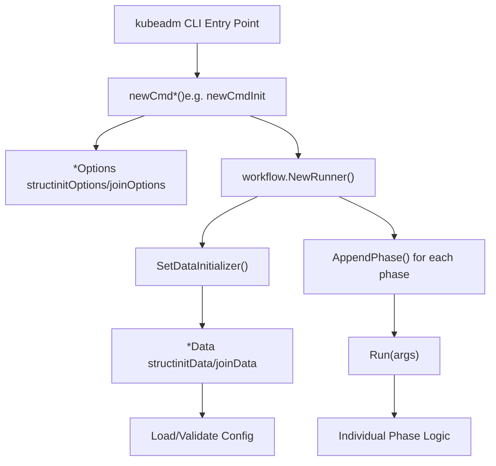
**Diagram: Command Execution Architecture**

Each command follows this pattern:

1.  **Options parsing**: Command-line flags are parsed into an `*Options` struct
2.  **Workflow creation**: A `workflow.Runner` manages phase execution
3.  **Data initialization**: Configuration is loaded and validated into a `*Data` struct
4.  **Phase execution**: Sequential phases execute the actual work

**Sources:** [cmd/kubeadm/app/cmd/init.go110-199](https://github.com/kubernetes/kubernetes/blob/2757a872/cmd/kubeadm/app/cmd/init.go#L110-L199) [cmd/kubeadm/app/cmd/join.go162-255](https://github.com/kubernetes/kubernetes/blob/2757a872/cmd/kubeadm/app/cmd/join.go#L162-L255) [cmd/kubeadm/app/cmd/reset.go213-270](https://github.com/kubernetes/kubernetes/blob/2757a872/cmd/kubeadm/app/cmd/reset.go#L213-L270)

---

## Configuration API Objects

kubeadm uses strongly-typed configuration objects defined in the `kubeadm.k8s.io` API group. The primary configuration types are:

| API Object | Purpose | Used By |
| --- | --- | --- |
| `InitConfiguration` | Control plane initialization settings | `kubeadm init` |
| `ClusterConfiguration` | Cluster-wide configuration | `kubeadm init` (embedded) |
| `JoinConfiguration` | Node joining settings | `kubeadm join` |
| `ResetConfiguration` | Cluster teardown settings | `kubeadm reset` |
| `UpgradeConfiguration` | Cluster upgrade settings | `kubeadm upgrade` |

```mermaid
flowchart TD
    ResetCfg["ResetConfiguration"]
    CertDir["CertificatesDir"]
    Force["Force"]
    CleanupTmp["CleanupTmpDir"]
    JoinCfg["JoinConfiguration"]
    Discovery["DiscoveryBootstrapToken/File"]
    NodeReg2["NodeRegistration"]
    ControlPlane["ControlPlane(optional)"]
    InitCfg["InitConfiguration"]
    ClusterCfg["ClusterConfiguration(embedded)"]
    BootstrapTokens["BootstrapTokens[]"]
    NodeReg1["NodeRegistration"]
    LocalAPI["LocalAPIEndpoint"]
    KubeVer["KubernetesVersion"]
    Networking["NetworkingServiceSubnetPodSubnetDNSDomain"]
    Etcd["EtcdLocal/External"]
    APIServer["APIServer"]
    ControllerMgr["ControllerManager"]
    Scheduler["Scheduler"]
    DNS["DNS"]
    Proxy["Proxy"]

    InitCfg --> ClusterCfg
    InitCfg --> BootstrapTokens
    InitCfg --> NodeReg1
    InitCfg --> LocalAPI
    ClusterCfg --> KubeVer
    ClusterCfg --> Networking
    ClusterCfg --> Etcd
    ClusterCfg --> APIServer
    ClusterCfg --> ControllerMgr
    ClusterCfg --> Scheduler
    ClusterCfg --> DNS
    ClusterCfg --> Proxy
    ResetCfg --> CertDir
    ResetCfg --> Force
    ResetCfg --> CleanupTmp
    JoinCfg --> Discovery
    JoinCfg --> NodeReg2
    JoinCfg --> ControlPlane
```
**Diagram: Configuration API Object Hierarchy**

**Sources:** [cmd/kubeadm/app/apis/kubeadm/types.go28-162](https://github.com/kubernetes/kubernetes/blob/2757a872/cmd/kubeadm/app/apis/kubeadm/types.go#L28-L162) [cmd/kubeadm/app/apis/kubeadm/v1beta4/types.go1-500](https://github.com/kubernetes/kubernetes/blob/2757a872/cmd/kubeadm/app/apis/kubeadm/v1beta4/types.go#L1-L500)

---

## kubeadm init Command

The `kubeadm init` command bootstraps a Kubernetes control plane node. It executes a series of phases to set up certificates, static pod manifests, etcd, and cluster add-ons.

### Init Command Structure

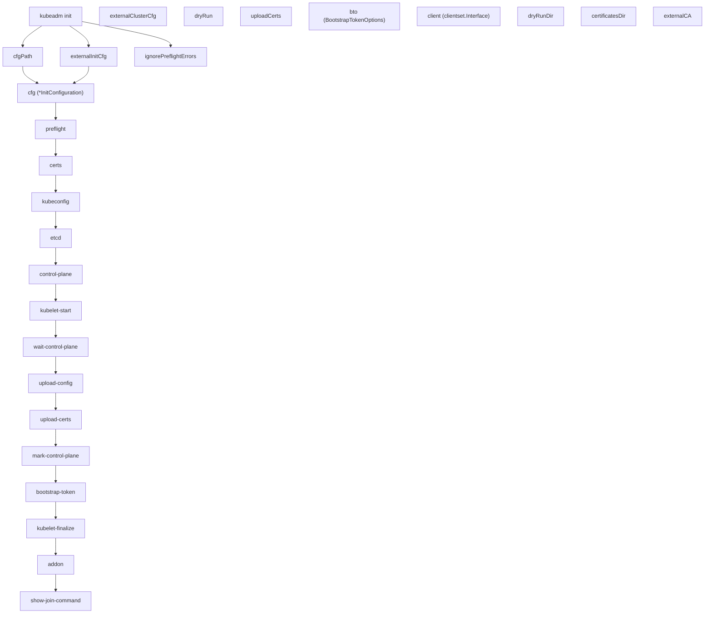
**Diagram: kubeadm init Command Flow**

### Init Phases

The init workflow consists of these phases (in order):

1.  **preflight**: Runs validation checks before modifying the system
2.  **certs**: Generates Kubernetes certificates and keys
3.  **kubeconfig**: Generates kubeconfig files for control plane components
4.  **etcd**: Sets up etcd (local or validates external)
5.  **control-plane**: Creates static pod manifests for API server, controller-manager, scheduler
6.  **kubelet-start**: Writes kubelet configuration and starts the kubelet
7.  **wait-control-plane**: Waits for control plane to be ready
8.  **upload-config**: Uploads kubeadm and kubelet configuration to ConfigMaps
9.  **upload-certs**: (Optional) Uploads control plane certificates to a Secret
10.  **mark-control-plane**: Labels and taints the control plane node
11.  **bootstrap-token**: Creates bootstrap tokens for node joining
12.  **kubelet-finalize**: Updates kubelet settings post-bootstrap
13.  **addon**: Installs DNS and kube-proxy addons
14.  **show-join-command**: Displays the join command for worker nodes

**Sources:** [cmd/kubeadm/app/cmd/init.go158-172](https://github.com/kubernetes/kubernetes/blob/2757a872/cmd/kubeadm/app/cmd/init.go#L158-L172) [cmd/kubeadm/app/cmd/init.go75-84](https://github.com/kubernetes/kubernetes/blob/2757a872/cmd/kubeadm/app/cmd/init.go#L75-L84)

### Init Configuration Loading

> **[Mermaid sequence]**
> *(图表结构无法解析)*

**Diagram: Init Configuration Loading and Validation**

**Sources:** [cmd/kubeadm/app/cmd/init.go305-410](https://github.com/kubernetes/kubernetes/blob/2757a872/cmd/kubeadm/app/cmd/init.go#L305-L410) [cmd/kubeadm/app/util/config/initconfiguration.go59-71](https://github.com/kubernetes/kubernetes/blob/2757a872/cmd/kubeadm/app/util/config/initconfiguration.go#L59-L71)

### Flags and Options

Key flags for `kubeadm init`:

| Flag | Type | Description | Config Field |
| --- | --- | --- | --- |
| `--config` | string | Path to kubeadm config file | \- |
| `--kubernetes-version` | string | Kubernetes version to use | `ClusterConfiguration.KubernetesVersion` |
| `--pod-network-cidr` | string | Pod network CIDR | `ClusterConfiguration.Networking.PodSubnet` |
| `--service-cidr` | string | Service CIDR | `ClusterConfiguration.Networking.ServiceSubnet` |
| `--apiserver-advertise-address` | string | API server advertise address | `LocalAPIEndpoint.AdvertiseAddress` |
| `--apiserver-bind-port` | int32 | API server bind port | `LocalAPIEndpoint.BindPort` |
| `--cert-dir` | string | Certificate directory | `ClusterConfiguration.CertificatesDir` |
| `--cri-socket` | string | CRI socket path | `NodeRegistration.CRISocket` |
| `--dry-run` | bool | Don't apply changes | `InitConfiguration.DryRun` |
| `--ignore-preflight-errors` | \[\]string | Preflight errors to ignore | `NodeRegistration.IgnorePreflightErrors` |
| `--upload-certs` | bool | Upload control plane certs | \- |
| `--skip-phases` | \[\]string | Skip specific phases | `InitConfiguration.SkipPhases` |

**Sources:** [cmd/kubeadm/app/cmd/init.go201-253](https://github.com/kubernetes/kubernetes/blob/2757a872/cmd/kubeadm/app/cmd/init.go#L201-L253) [cmd/kubeadm/app/cmd/init.go255-280](https://github.com/kubernetes/kubernetes/blob/2757a872/cmd/kubeadm/app/cmd/init.go#L255-L280)

---

## kubeadm join Command

The `kubeadm join` command joins a node (worker or control plane) to an existing cluster.

### Join Command Structure

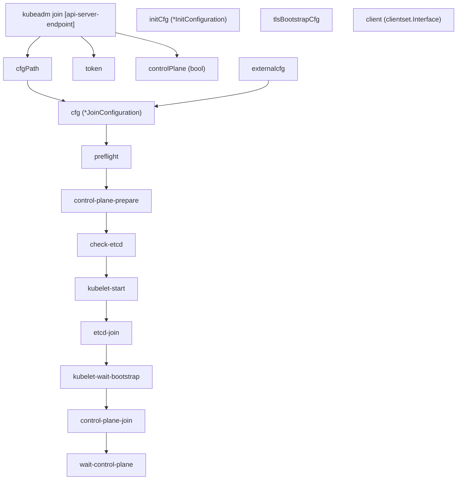
**Diagram: kubeadm join Command Flow**

### Discovery Mechanisms

The join command supports two discovery mechanisms:

1.  **Bootstrap Token Discovery**: Uses a token and CA cert hash
2.  **File Discovery**: Uses a kubeconfig file

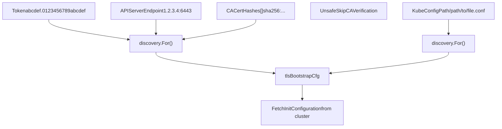
**Diagram: Join Discovery Mechanisms**

**Sources:** [cmd/kubeadm/app/cmd/join.go147-172](https://github.com/kubernetes/kubernetes/blob/2757a872/cmd/kubeadm/app/cmd/join.go#L147-L172) [cmd/kubeadm/app/apis/kubeadm/types.go403-437](https://github.com/kubernetes/kubernetes/blob/2757a872/cmd/kubeadm/app/apis/kubeadm/types.go#L403-L437)

### Join Configuration Example

```
apiVersion: kubeadm.k8s.io/v1beta4kind: JoinConfigurationdiscovery:  bootstrapToken:    apiServerEndpoint: "192.168.1.100:6443"    token: "abcdef.0123456789abcdef"    caCertHashes:      - "sha256:1234567890abcdef..."nodeRegistration:  name: "worker-1"  criSocket: "unix:///var/run/containerd/containerd.sock"# For control plane nodes:controlPlane:  localAPIEndpoint:    advertiseAddress: "192.168.1.101"    bindPort: 6443  certificateKey: "1234567890abcdef..."
```
**Sources:** [cmd/kubeadm/app/apis/kubeadm/v1beta4/types.go150-250](https://github.com/kubernetes/kubernetes/blob/2757a872/cmd/kubeadm/app/apis/kubeadm/v1beta4/types.go#L150-L250)

---

## kubeadm reset Command

The `kubeadm reset` command performs a best-effort cleanup of changes made by `kubeadm init` or `kubeadm join`.

### Reset Command Structure

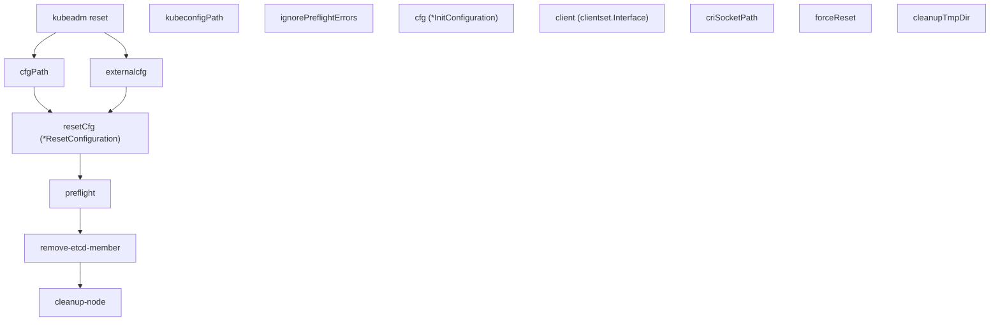
**Diagram: kubeadm reset Command Flow**

### What Reset Cleans Up

The reset command removes:

-   Container runtime artifacts (containers, images in certain cases)
-   Kubernetes configuration files (`/etc/kubernetes/`)
-   Static pod manifests
-   etcd data (if local etcd)
-   Kubelet configuration
-   iptables/IPVS rules (kube-proxy artifacts)

**Important**: Reset does NOT clean up:

-   CNI plugin configuration
-   Network filtering rules (non-kube-proxy)
-   Kubeconfig files in user directories

**Sources:** [cmd/kubeadm/app/cmd/reset.go50-58](https://github.com/kubernetes/kubernetes/blob/2757a872/cmd/kubeadm/app/cmd/reset.go#L50-L58) [cmd/kubeadm/app/cmd/reset.go213-270](https://github.com/kubernetes/kubernetes/blob/2757a872/cmd/kubeadm/app/cmd/reset.go#L213-L270)

---

## kubeadm token Command

The `kubeadm token` command manages bootstrap tokens used for node joining and TLS bootstrapping.

### Token Subcommands

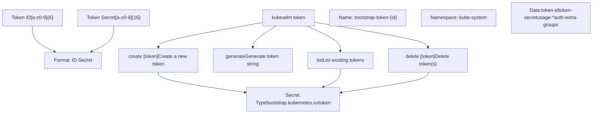
**Diagram: kubeadm token Command Structure**

### Token Usages

Bootstrap tokens can have the following usages:

-   `signing`: For signing cluster-info ConfigMap
-   `authentication`: For authenticating with the API server

**Sources:** [cmd/kubeadm/app/cmd/token.go58-204](https://github.com/kubernetes/kubernetes/blob/2757a872/cmd/kubeadm/app/cmd/token.go#L58-L204) [cmd/kubeadm/app/apis/kubeadm/validation/validation.go234-292](https://github.com/kubernetes/kubernetes/blob/2757a872/cmd/kubeadm/app/apis/kubeadm/validation/validation.go#L234-L292)

---

## kubeadm config Command

The `kubeadm config` command manages kubeadm configuration, providing utilities for printing defaults, migrating configurations, and validating configuration files.

### Config Subcommands

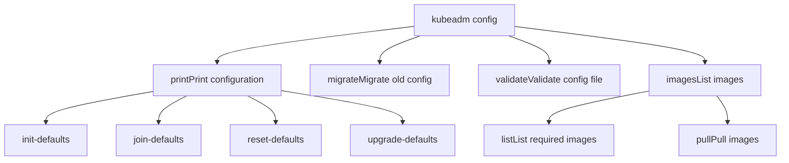
**Diagram: kubeadm config Command Structure**

**Sources:** [cmd/kubeadm/app/cmd/config.go52-76](https://github.com/kubernetes/kubernetes/blob/2757a872/cmd/kubeadm/app/cmd/config.go#L52-L76) [cmd/kubeadm/app/cmd/config.go78-140](https://github.com/kubernetes/kubernetes/blob/2757a872/cmd/kubeadm/app/cmd/config.go#L78-L140)

---

## Workflow and Phase System

All major kubeadm commands use a workflow system that breaks operations into discrete phases that can be executed individually or as a complete sequence.

### Workflow Runner Architecture

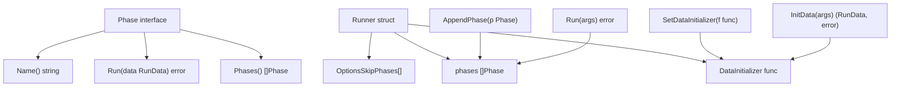
**Diagram: Workflow Phase System Architecture**

### Phase Execution Flow

> **[Mermaid sequence]**
> *(图表结构无法解析)*

**Diagram: Phase Execution Sequence**

### Skip Phases

Phases can be skipped in two ways:

1.  Using the `--skip-phases` command-line flag
2.  Setting `SkipPhases` in the configuration file

```
// Example: Skipping phasesskipPhases := []string{"addon/coredns", "addon/kube-proxy"}
```
**Sources:** [cmd/kubeadm/app/cmd/init.go158-172](https://github.com/kubernetes/kubernetes/blob/2757a872/cmd/kubeadm/app/cmd/init.go#L158-L172) [cmd/kubeadm/app/cmd/init.go620-652](https://github.com/kubernetes/kubernetes/blob/2757a872/cmd/kubeadm/app/cmd/init.go#L620-L652)

---

## Preflight Checks System

Preflight checks validate system requirements before making any changes. The system is extensible with a `Checker` interface.

### Checker Interface

```mermaid
flowchart TD
    CheckerIface["Checker interface"]
    CheckMethod["Check() (warnings, errors []error)"]
    NameMethod["Name() string"]
    CRI["ContainerRuntimeCheck"]
    Service["ServiceCheck"]
    Port["PortOpenCheck"]
    Priv["IsPrivilegedUserCheck"]
    Dir["DirAvailableCheck"]
    File["FileAvailableCheck"]
    Hostname["HostnameCheck"]
    Swap["SwapCheck"]
    NumCPU["NumCPUCheck"]
    Mem["MemCheck"]
    Etcd["ExternalEtcdVersionCheck"]
    ImagePull["ImagePullCheck"]
    K8sVer["KubernetesVersionCheck"]
    KubeletVer["KubeletVersionCheck"]

    CheckerIface --> CheckMethod
    CheckerIface --> NameMethod
    CheckerIface --> CRI
    CheckerIface --> Service
    CheckerIface --> Port
    CheckerIface --> Priv
    CheckerIface --> Dir
    CheckerIface --> File
    CheckerIface --> Hostname
    CheckerIface --> Swap
    CheckerIface --> NumCPU
    CheckerIface --> Mem
    CheckerIface --> Etcd
    CheckerIface --> ImagePull
    CheckerIface --> K8sVer
    CheckerIface --> KubeletVer
```
**Diagram: Preflight Checker System**

### Init-Specific Preflight Checks

For `kubeadm init`, the following checks are performed:

| Checker | Validates | Failure Impact |
| --- | --- | --- |
| `IsPrivilegedUserCheck` | Running as root | Error |
| `NumCPUCheck` | At least 2 CPUs for control plane | Error |
| `FileAvailableCheck` | Key files don't exist (e.g., `/etc/kubernetes/manifests/*`) | Error |
| `PortOpenCheck` | Ports 6443, 10259, 10257, 2379, 2380 available | Error |
| `ContainerRuntimeCheck` | CRI socket accessible and running | Error |
| `KubeletVersionCheck` | Kubelet version compatible | Error |
| `KubernetesVersionCheck` | kubeadm/Kubernetes version compatible | Warning |
| `SwapCheck` | Swap configuration appropriate | Warning |
| `ExternalEtcdVersionCheck` | External etcd version supported | Error |
| `ImagePullCheck` | Can pull required container images | Error |

**Sources:** [cmd/kubeadm/app/preflight/checks.go967-1036](https://github.com/kubernetes/kubernetes/blob/2757a872/cmd/kubeadm/app/preflight/checks.go#L967-L1036)

### Ignoring Preflight Errors

Specific checks can be ignored using `--ignore-preflight-errors`:

```
kubeadm init --ignore-preflight-errors=NumCPU,Swap# or ignore all checks (not recommended):kubeadm init --ignore-preflight-errors=all
```
**Sources:** [cmd/kubeadm/app/apis/kubeadm/validation/validation.go1195-1240](https://github.com/kubernetes/kubernetes/blob/2757a872/cmd/kubeadm/app/apis/kubeadm/validation/validation.go#L1195-L1240)

---

## Validation System

kubeadm performs extensive validation on configuration objects before executing any operations.

### Validation Architecture

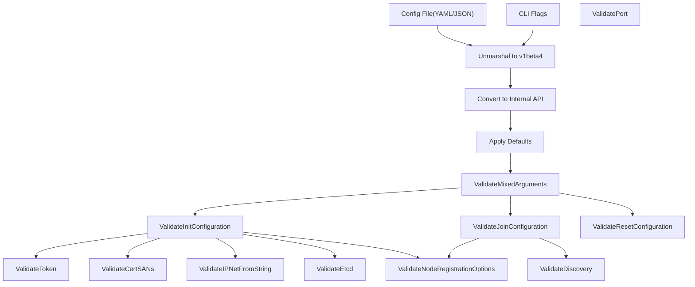
**Diagram: Configuration Validation Pipeline**

### Key Validation Functions

| Function | Purpose | Returns |
| --- | --- | --- |
| `ValidateInitConfiguration` | Validates InitConfiguration | `field.ErrorList` |
| `ValidateJoinConfiguration` | Validates JoinConfiguration | `field.ErrorList` |
| `ValidateClusterConfiguration` | Validates ClusterConfiguration | `field.ErrorList` |
| `ValidateToken` | Validates bootstrap token format | `field.ErrorList` |
| `ValidateDiscovery` | Validates discovery configuration | `field.ErrorList` |
| `ValidateNodeRegistrationOptions` | Validates node registration | `field.ErrorList` |
| `ValidateIPNetFromString` | Validates CIDR notation | `field.ErrorList` |
| `ValidateCertSANs` | Validates certificate SANs | `field.ErrorList` |
| `ValidateEtcd` | Validates etcd configuration | `field.ErrorList` |
| `ValidateMixedArguments` | Validates CLI flag combinations | `error` |

**Sources:** [cmd/kubeadm/app/apis/kubeadm/validation/validation.go51-117](https://github.com/kubernetes/kubernetes/blob/2757a872/cmd/kubeadm/app/apis/kubeadm/validation/validation.go#L51-L117)

### Mixed Argument Validation

The `ValidateMixedArguments` function prevents invalid combinations of `--config` flag with other flags:

```
// Flags that cannot be used with --configincompatibleFlags := []string{    "kubernetes-version",    "pod-network-cidr",    "service-cidr",    "apiserver-advertise-address",    "apiserver-bind-port",    "cert-dir",    "cri-socket",    "node-name",    // ... etc}
```
**Sources:** [cmd/kubeadm/app/apis/kubeadm/validation/validation.go1079-1140](https://github.com/kubernetes/kubernetes/blob/2757a872/cmd/kubeadm/app/apis/kubeadm/validation/validation.go#L1079-L1140)

---

## Configuration Loading and Defaults

Configuration loading follows a consistent pattern across all commands with support for multiple sources and dynamic defaults.

### Configuration Loading Process

> **[Mermaid sequence]**
> *(图表结构无法解析)*

**Diagram: Configuration Loading Sequence**

### Dynamic Defaults

Several configuration values are detected at runtime if not explicitly set:

| Field | Detection Method | Source |
| --- | --- | --- |
| `NodeRegistration.Name` | Hostname lookup | `os.Hostname()` |
| `NodeRegistration.CRISocket` | CRI socket detection | Checks containerd, CRI-O, Docker sockets |
| `LocalAPIEndpoint.AdvertiseAddress` | Default route interface IP | `netutil.ChooseHostInterface()` |
| `BootstrapTokens` | Random generation | `bootstraputil.GenerateBootstrapToken()` |
| `ClusterConfiguration.KubernetesVersion` | Latest stable | Queries dl.k8s.io or uses compiled version |

**Sources:** [cmd/kubeadm/app/util/config/initconfiguration.go59-238](https://github.com/kubernetes/kubernetes/blob/2757a872/cmd/kubeadm/app/util/config/initconfiguration.go#L59-L238) [cmd/kubeadm/app/util/config/common.go163-248](https://github.com/kubernetes/kubernetes/blob/2757a872/cmd/kubeadm/app/util/config/common.go#L163-L248)

### Configuration Marshaling

kubeadm can marshal configurations back to YAML for inspection or migration:

```
// MarshalKubeadmConfigObject marshals to specific API versionbytes, err := configutil.MarshalKubeadmConfigObject(cfg, kubeadmapiv1.SchemeGroupVersion)
```
**Sources:** [cmd/kubeadm/app/util/config/common.go54-62](https://github.com/kubernetes/kubernetes/blob/2757a872/cmd/kubeadm/app/util/config/common.go#L54-L62)

---

## Dry-Run Mode

All major commands support `--dry-run` mode, which simulates the operation without making changes.

### Dry-Run Client Architecture

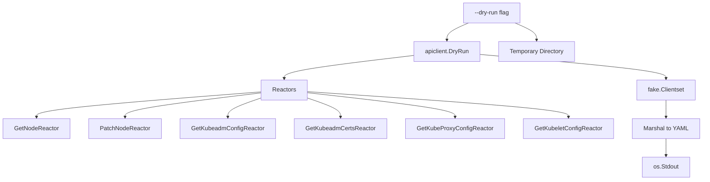
**Diagram: Dry-Run Client Architecture**

### Dry-Run Behavior

In dry-run mode:

-   Configuration is validated normally
-   Preflight checks are executed
-   No actual system changes are made
-   API server interactions use a fake client
-   Generated files are written to a temporary directory
-   Actions are printed to stdout in YAML format

**Sources:** [cmd/kubeadm/app/cmd/init.go522-534](https://github.com/kubernetes/kubernetes/blob/2757a872/cmd/kubeadm/app/cmd/init.go#L522-L534) [cmd/kubeadm/app/cmd/join.go585-620](https://github.com/kubernetes/kubernetes/blob/2757a872/cmd/kubeadm/app/cmd/join.go#L585-L620) [cmd/kubeadm/app/cmd/reset.go119-133](https://github.com/kubernetes/kubernetes/blob/2757a872/cmd/kubeadm/app/cmd/reset.go#L119-L133)

---

## Command Data Structures

Each command uses specific data structures to pass information between phases.

### Init Data Structure

```
type initData struct {    cfg                         *kubeadmapi.InitConfiguration    skipTokenPrint              bool    dryRun                      bool    kubeconfig                  *clientcmdapi.Config    kubeconfigDir               string    kubeconfigPath              string    ignorePreflightErrors       sets.Set[string]    certificatesDir             string    dryRunDir                   string    externalCA                  bool    client                      clientset.Interface    outputWriter                io.Writer    uploadCerts                 bool    skipCertificateKeyPrint     bool    patchesDir                  string    adminKubeConfigBootstrapped bool}
```
Key methods on `initData`:

-   `Cfg()`: Returns InitConfiguration
-   `Client()`: Returns Kubernetes client (real or dry-run)
-   `CertificateWriteDir()`: Returns directory for certificates
-   `ManifestDir()`: Returns directory for static pod manifests
-   `KubeConfigDir()`: Returns directory for kubeconfig files

**Sources:** [cmd/kubeadm/app/cmd/init.go89-108](https://github.com/kubernetes/kubernetes/blob/2757a872/cmd/kubeadm/app/cmd/init.go#L89-L108) [cmd/kubeadm/app/cmd/init.go432-617](https://github.com/kubernetes/kubernetes/blob/2757a872/cmd/kubeadm/app/cmd/init.go#L432-L617)

### Join Data Structure

```
type joinData struct {    cfg                   *kubeadmapi.JoinConfiguration    initCfg               *kubeadmapi.InitConfiguration    tlsBootstrapCfg       *clientcmdapi.Config    client                clientset.Interface    ignorePreflightErrors sets.Set[string]    outputWriter          io.Writer    patchesDir            string    dryRun                bool    dryRunDir             string}
```
Key methods on `joinData`:

-   `Cfg()`: Returns JoinConfiguration
-   `InitCfg()`: Returns InitConfiguration fetched from cluster
-   `TLSBootstrapCfg()`: Returns bootstrap kubeconfig via discovery
-   `Client()`: Returns Kubernetes client

**Sources:** [cmd/kubeadm/app/cmd/join.go148-160](https://github.com/kubernetes/kubernetes/blob/2757a872/cmd/kubeadm/app/cmd/join.go#L148-L160) [cmd/kubeadm/app/cmd/join.go476-628](https://github.com/kubernetes/kubernetes/blob/2757a872/cmd/kubeadm/app/cmd/join.go#L476-L628)

### Reset Data Structure

```
type resetData struct {    certificatesDir       string    client                clientset.Interface    criSocketPath         string    forceReset            bool    ignorePreflightErrors sets.Set[string]    inputReader           io.Reader    outputWriter          io.Writer    cfg                   *kubeadmapi.InitConfiguration    resetCfg              *kubeadmapi.ResetConfiguration    dryRun                bool    cleanupTmpDir         bool}
```
**Sources:** [cmd/kubeadm/app/cmd/reset.go70-84](https://github.com/kubernetes/kubernetes/blob/2757a872/cmd/kubeadm/app/cmd/reset.go#L70-L84)

---

## Summary

The kubeadm CLI provides a comprehensive toolset for Kubernetes cluster lifecycle management:

1.  **Command Structure**: All major commands (`init`, `join`, `reset`) use a workflow-based phase execution system that allows granular control and extensibility.

2.  **Configuration API**: Strongly-typed configuration objects (`InitConfiguration`, `JoinConfiguration`, etc.) with validation and versioning support.

3.  **Preflight Checks**: Extensible validation system that checks system requirements before making changes.

4.  **Validation**: Multi-layered validation of configuration objects with field-level error reporting.

5.  **Discovery**: Flexible node joining with bootstrap token or file-based discovery mechanisms.

6.  **Dry-Run Support**: All commands support simulation mode with fake API clients and temporary output directories.

7.  **Token Management**: Built-in utilities for managing bootstrap tokens used in cluster joining.

8.  **Configuration Management**: Tools for printing defaults, migrating old configurations, and validating config files.


The architecture emphasizes validation, safety (preflight checks), and flexibility (phase system, multiple configuration sources) to provide a robust cluster bootstrapping experience.

**Sources:** [cmd/kubeadm/app/cmd/init.go1-653](https://github.com/kubernetes/kubernetes/blob/2757a872/cmd/kubeadm/app/cmd/init.go#L1-L653) [cmd/kubeadm/app/cmd/join.go1-692](https://github.com/kubernetes/kubernetes/blob/2757a872/cmd/kubeadm/app/cmd/join.go#L1-L692) [cmd/kubeadm/app/cmd/reset.go1-333](https://github.com/kubernetes/kubernetes/blob/2757a872/cmd/kubeadm/app/cmd/reset.go#L1-L333) [cmd/kubeadm/app/cmd/token.go1-430](https://github.com/kubernetes/kubernetes/blob/2757a872/cmd/kubeadm/app/cmd/token.go#L1-L430) [cmd/kubeadm/app/cmd/config.go1-500](https://github.com/kubernetes/kubernetes/blob/2757a872/cmd/kubeadm/app/cmd/config.go#L1-L500)
