# GCE Cluster Provisioning

Relevant source files

-   [cluster/common.sh](https://github.com/kubernetes/kubernetes/blob/2757a872/cluster/common.sh)
-   [cluster/gce/config-common.sh](https://github.com/kubernetes/kubernetes/blob/2757a872/cluster/gce/config-common.sh)
-   [cluster/gce/config-default.sh](https://github.com/kubernetes/kubernetes/blob/2757a872/cluster/gce/config-default.sh)
-   [cluster/gce/config-test.sh](https://github.com/kubernetes/kubernetes/blob/2757a872/cluster/gce/config-test.sh)
-   [cluster/gce/gci/configure-helper.sh](https://github.com/kubernetes/kubernetes/blob/2757a872/cluster/gce/gci/configure-helper.sh)
-   [cluster/gce/gci/configure.sh](https://github.com/kubernetes/kubernetes/blob/2757a872/cluster/gce/gci/configure.sh)
-   [cluster/gce/util.sh](https://github.com/kubernetes/kubernetes/blob/2757a872/cluster/gce/util.sh)
-   [cluster/gce/windows/README-GCE-Windows-kube-up.md](https://github.com/kubernetes/kubernetes/blob/2757a872/cluster/gce/windows/README-GCE-Windows-kube-up.md?plain=1)
-   [cluster/gce/windows/common.psm1](https://github.com/kubernetes/kubernetes/blob/2757a872/cluster/gce/windows/common.psm1)
-   [cluster/gce/windows/configure.ps1](https://github.com/kubernetes/kubernetes/blob/2757a872/cluster/gce/windows/configure.ps1)
-   [cluster/gce/windows/k8s-node-setup.psm1](https://github.com/kubernetes/kubernetes/blob/2757a872/cluster/gce/windows/k8s-node-setup.psm1)
-   [cluster/gce/windows/node-helper.sh](https://github.com/kubernetes/kubernetes/blob/2757a872/cluster/gce/windows/node-helper.sh)
-   [cluster/gce/windows/smoke-test.sh](https://github.com/kubernetes/kubernetes/blob/2757a872/cluster/gce/windows/smoke-test.sh)
-   [cluster/gce/windows/testonly/install-ssh.psm1](https://github.com/kubernetes/kubernetes/blob/2757a872/cluster/gce/windows/testonly/install-ssh.psm1)
-   [cluster/gce/windows/testonly/user-profile.psm1](https://github.com/kubernetes/kubernetes/blob/2757a872/cluster/gce/windows/testonly/user-profile.psm1)

## Purpose and Scope

This document describes the Google Compute Engine (GCE) cluster provisioning system in the Kubernetes repository. This system is responsible for creating, configuring, and bootstrapping Kubernetes clusters on GCE infrastructure, including master nodes, Linux worker nodes, and Windows worker nodes.

The provisioning system handles:

-   Configuration management and environment variable processing
-   Binary distribution via Google Cloud Storage
-   Master node initialization with etcd and control plane components
-   Worker node configuration for both Linux (GCI/Ubuntu) and Windows
-   PKI certificate generation and distribution
-   Network setup including IP aliases, firewall rules, and routing

For information about local development clusters, see [Local Development Environment](/kubernetes/kubernetes/5.2-gce-cluster-provisioning).

## Architecture Overview

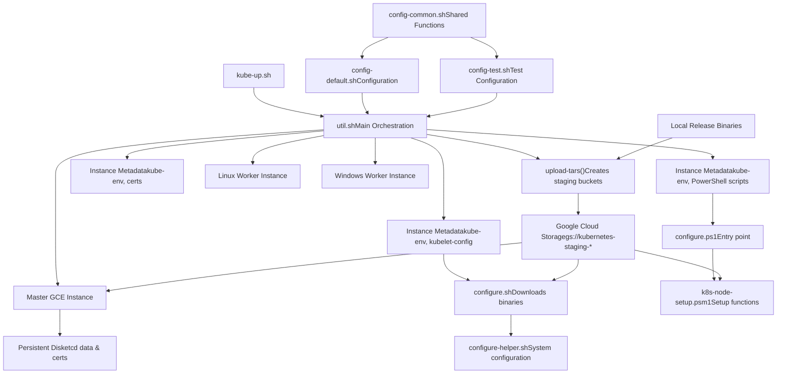
```mermaid
flowchart TD
    KubeUp["kube-up.sh"]
    UtilSh["util.shMain Orchestration"]
    ConfigDefault["config-default.shConfiguration"]
    ConfigTest["config-test.shTest Configuration"]
    ConfigCommon["config-common.shShared Functions"]
    LocalBinaries["Local Release Binaries"]
    GCS["Google Cloud Storagegs://kubernetes-staging-*"]
    TarUpload["upload-tars()Creates staging buckets"]
    MasterInstance["Master GCE Instance"]
    MasterPD["Persistent Disketcd data & certs"]
    MasterMetadata["Instance Metadatakube-env, certs"]
    LinuxInstance["Linux Worker Instance"]
    LinuxMetadata["Instance Metadatakube-env, kubelet-config"]
    ConfigureSh["configure.shDownloads binaries"]
    ConfigureHelper["configure-helper.shSystem configuration"]
    WindowsInstance["Windows Worker Instance"]
    WindowsMetadata["Instance Metadatakube-env, PowerShell scripts"]
    ConfigurePS["configure.ps1Entry point"]
    K8sNodeSetup["k8s-node-setup.psm1Setup functions"]

    KubeUp --> UtilSh
    ConfigDefault --> UtilSh
    ConfigTest --> UtilSh
    ConfigCommon --> ConfigDefault
    ConfigCommon --> ConfigTest
    UtilSh --> TarUpload
    LocalBinaries --> TarUpload
    TarUpload --> GCS
    UtilSh --> MasterInstance
    MasterInstance --> MasterPD
    UtilSh --> MasterMetadata
    GCS --> MasterInstance
    UtilSh --> LinuxInstance
    UtilSh --> LinuxMetadata
    LinuxMetadata --> ConfigureSh
    ConfigureSh --> ConfigureHelper
    GCS --> ConfigureSh
    UtilSh --> WindowsInstance
    UtilSh --> WindowsMetadata
    WindowsMetadata --> ConfigurePS
    ConfigurePS --> K8sNodeSetup
    GCS --> K8sNodeSetup
```
Sources: [cluster/gce/util.sh](https://github.com/kubernetes/kubernetes/blob/2757a872/cluster/gce/util.sh) [cluster/gce/config-default.sh](https://github.com/kubernetes/kubernetes/blob/2757a872/cluster/gce/config-default.sh) [cluster/gce/config-test.sh](https://github.com/kubernetes/kubernetes/blob/2757a872/cluster/gce/config-test.sh) [cluster/gce/config-common.sh](https://github.com/kubernetes/kubernetes/blob/2757a872/cluster/gce/config-common.sh)

## Configuration System

The GCE provisioning system uses a hierarchical configuration approach with shell scripts that set environment variables consumed by provisioning logic.

### Configuration Files

| File | Purpose | Key Responsibilities |
| --- | --- | --- |
| `config-common.sh` | Shared utilities | Node count calculations, disk sizing, IP range calculations |
| `config-default.sh` | Production defaults | Standard cluster configuration, resource sizing |
| `config-test.sh` | Testing configuration | E2E test settings, debug features, higher resource limits |

### Key Configuration Variables

The configuration system exposes numerous environment variables. Key categories include:

**Cluster Topology:**

-   `NUM_NODES`: Number of Linux worker nodes
-   `NUM_WINDOWS_NODES`: Number of Windows worker nodes
-   `MASTER_SIZE`, `NODE_SIZE`: GCE machine types
-   `MASTER_DISK_SIZE`, `NODE_DISK_SIZE`: Disk sizes

**Networking:**

-   `ENABLE_IP_ALIASES`: Enable IP aliasing for pod IPs
-   `NODE_IPAM_MODE`: IP allocation mode (`RangeAllocator` or `CloudAllocator`)
-   `CLUSTER_IP_RANGE`: Pod CIDR range
-   `SERVICE_CLUSTER_IP_RANGE`: Service IP range
-   `NETWORK`, `SUBNETWORK`: GCE network configuration

**Images:**

-   `MASTER_IMAGE_FAMILY`, `MASTER_IMAGE_PROJECT`: Master node OS image
-   `NODE_IMAGE_FAMILY`, `NODE_IMAGE_PROJECT`: Linux worker node OS image
-   `WINDOWS_NODE_OS_DISTRIBUTION`: Windows version (e.g., `win2019`)

**Runtime:**

-   `CONTAINER_RUNTIME_ENDPOINT`: CRI endpoint path
-   `CONTAINER_RUNTIME_NAME`: Runtime name (e.g., `containerd`)

Sources: [cluster/gce/config-default.sh1-178](https://github.com/kubernetes/kubernetes/blob/2757a872/cluster/gce/config-default.sh#L1-L178) [cluster/gce/config-test.sh1-320](https://github.com/kubernetes/kubernetes/blob/2757a872/cluster/gce/config-test.sh#L1-L320) [cluster/gce/config-common.sh17-118](https://github.com/kubernetes/kubernetes/blob/2757a872/cluster/gce/config-common.sh#L17-L118)

### Dynamic Sizing Functions

The configuration system includes functions that calculate resource requirements based on cluster size:

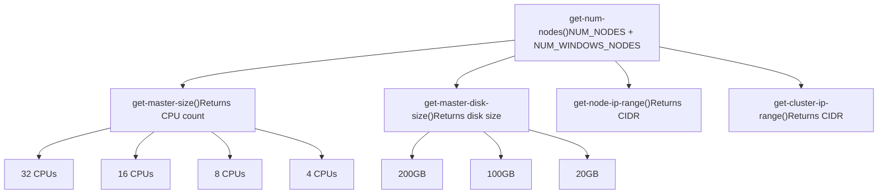
```mermaid
flowchart TD
    GetNumNodes["get-num-nodes()NUM_NODES + NUM_WINDOWS_NODES"]
    GetMasterSize["get-master-size()Returns CPU count"]
    GetMasterDiskSize["get-master-disk-size()Returns disk size"]
    GetNodeIpRange["get-node-ip-range()Returns CIDR"]
    GetClusterIpRange["get-cluster-ip-range()Returns CIDR"]
    Size32["32 CPUs"]
    Size16["16 CPUs"]
    Size8["8 CPUs"]
    Size4["4 CPUs"]
    Disk200["200GB"]
    Disk100["100GB"]
    Disk20["20GB"]

    GetNumNodes --> GetMasterSize
    GetNumNodes --> GetMasterDiskSize
    GetNumNodes --> GetNodeIpRange
    GetNumNodes --> GetClusterIpRange
    GetMasterSize --> Size32
    GetMasterSize --> Size16
    GetMasterSize --> Size8
    GetMasterSize --> Size4
    GetMasterDiskSize --> Disk200
    GetMasterDiskSize --> Disk100
    GetMasterDiskSize --> Disk20
```
Sources: [cluster/gce/config-common.sh29-104](https://github.com/kubernetes/kubernetes/blob/2757a872/cluster/gce/config-common.sh#L29-L104)

## Cluster Creation Flow

The main orchestration happens in `util.sh`, which provides functions called by `kube-up.sh`:

### High-Level Provisioning Sequence

> **[Mermaid sequence]**
> *(图表结构无法解析)*

Sources: [cluster/gce/util.sh296-375](https://github.com/kubernetes/kubernetes/blob/2757a872/cluster/gce/util.sh#L296-L375) [cluster/gce/util.sh512-547](https://github.com/kubernetes/kubernetes/blob/2757a872/cluster/gce/util.sh#L512-L547)

### Project Detection and Setup

The `detect-project()` function establishes the GCP project context:

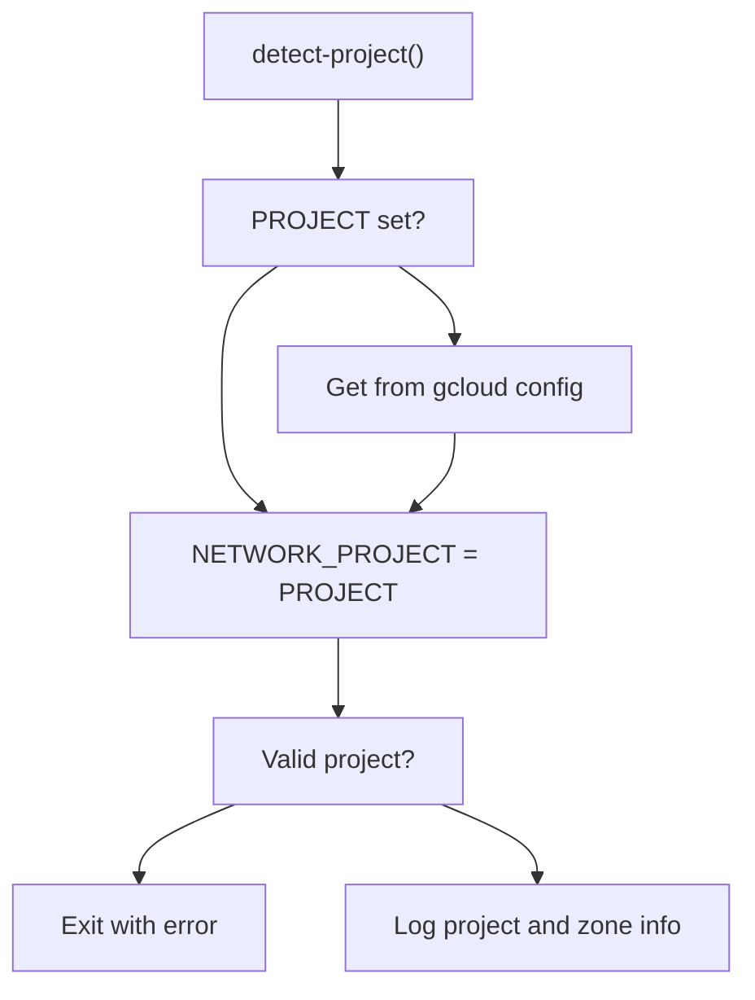
```mermaid
flowchart TD
    Start["detect-project()"]
    CheckProject["PROJECT set?"]
    GetFromGcloud["Get from gcloud config"]
    SetNetworkProject["NETWORK_PROJECT = PROJECT"]
    Validate["Valid project?"]
    Error["Exit with error"]
    Log["Log project and zone info"]

    Start --> CheckProject
    CheckProject --> GetFromGcloud
    CheckProject --> SetNetworkProject
    GetFromGcloud --> SetNetworkProject
    SetNetworkProject --> Validate
    Validate --> Error
    Validate --> Log
```
Sources: [cluster/gce/util.sh189-207](https://github.com/kubernetes/kubernetes/blob/2757a872/cluster/gce/util.sh#L189-L207)

## Binary Distribution System

The provisioning system distributes Kubernetes binaries through Google Cloud Storage, with regional optimization for faster downloads.

### Upload and Staging Process

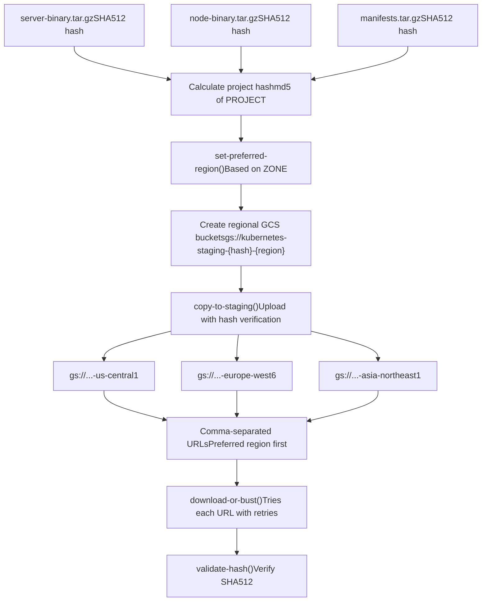
```mermaid
flowchart TD
    ServerBinary["server-binary.tar.gzSHA512 hash"]
    NodeBinary["node-binary.tar.gzSHA512 hash"]
    Manifests["manifests.tar.gzSHA512 hash"]
    ProjectHash["Calculate project hashmd5 of PROJECT"]
    DetermineRegions["set-preferred-region()Based on ZONE"]
    CreateBuckets["Create regional GCS bucketsgs://kubernetes-staging-{hash}-{region}"]
    CopyToStaging["copy-to-staging()Upload with hash verification"]
    USBucket["gs://...-us-central1"]
    EUBucket["gs://...-europe-west6"]
    ASIABucket["gs://...-asia-northeast1"]
    PreferredURLs["Comma-separated URLsPreferred region first"]
    DownloadOrBust["download-or-bust()Tries each URL with retries"]
    ValidateHash["validate-hash()Verify SHA512"]

    ServerBinary --> ProjectHash
    NodeBinary --> ProjectHash
    Manifests --> ProjectHash
    ProjectHash --> DetermineRegions
    DetermineRegions --> CreateBuckets
    CreateBuckets --> CopyToStaging
    CopyToStaging --> USBucket
    CopyToStaging --> EUBucket
    CopyToStaging --> ASIABucket
    USBucket --> PreferredURLs
    EUBucket --> PreferredURLs
    ASIABucket --> PreferredURLs
    PreferredURLs --> DownloadOrBust
    DownloadOrBust --> ValidateHash
```
The system includes optimizations like:

-   **MD5-based deduplication**: Checks if tarball already exists in GCS with same hash before uploading ([cluster/gce/util.sh229-244](https://github.com/kubernetes/kubernetes/blob/2757a872/cluster/gce/util.sh#L229-L244))
-   **Regional preference**: Selects closest GCS bucket based on cluster zone ([cluster/gce/util.sh263-279](https://github.com/kubernetes/kubernetes/blob/2757a872/cluster/gce/util.sh#L263-L279))
-   **Fallback URLs**: Provides multiple regional URLs in preference order ([cluster/gce/util.sh334-366](https://github.com/kubernetes/kubernetes/blob/2757a872/cluster/gce/util.sh#L334-L366))

Sources: [cluster/gce/util.sh296-375](https://github.com/kubernetes/kubernetes/blob/2757a872/cluster/gce/util.sh#L296-L375) [cluster/gce/gci/configure.sh173-226](https://github.com/kubernetes/kubernetes/blob/2757a872/cluster/gce/gci/configure.sh#L173-L226)

## Master Node Provisioning

The master node hosts the Kubernetes control plane components and requires special initialization.

### Master Instance Metadata Structure

The master receives configuration through GCE instance metadata:

| Metadata Key | Content | Purpose |
| --- | --- | --- |
| `kube-env` | YAML key-value pairs | Cluster configuration variables |
| `kube-master-certs` | YAML with base64 certs | PKI materials for control plane |
| `user-data` or startup script | Shell script | Cloud-init or startup script |

### Master Persistent Disk Layout

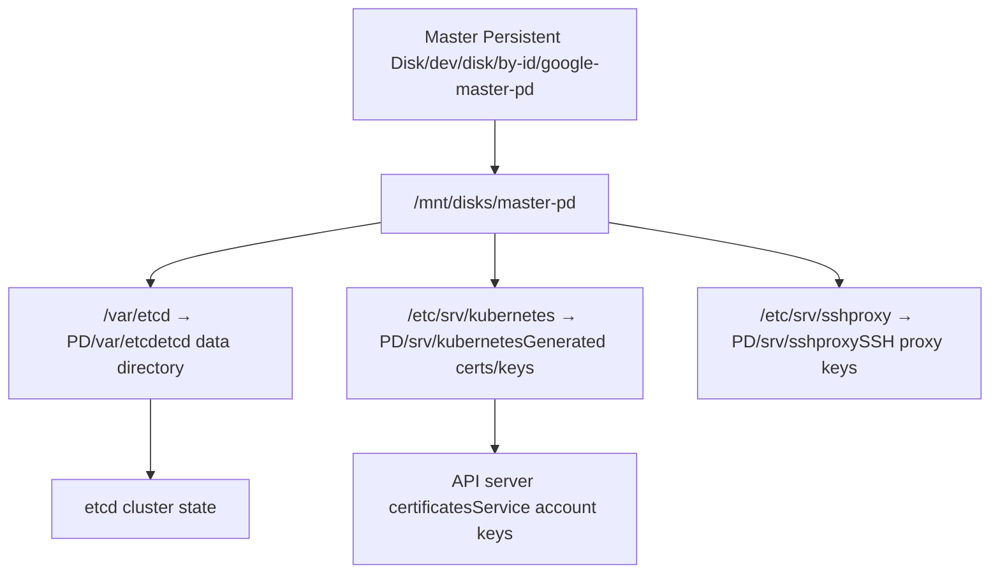
```mermaid
flowchart TD
    MasterPD["Master Persistent Disk/dev/disk/by-id/google-master-pd"]
    MountPoint["/mnt/disks/master-pd"]
    VarEtcd["/var/etcd → PD/var/etcdetcd data directory"]
    SrvK8s["/etc/srv/kubernetes → PD/srv/kubernetesGenerated certs/keys"]
    SrvSSH["/etc/srv/sshproxy → PD/srv/sshproxySSH proxy keys"]
    EtcdData["etcd cluster state"]
    Certs["API server certificatesService account keys"]

    MasterPD --> MountPoint
    MountPoint --> VarEtcd
    MountPoint --> SrvK8s
    MountPoint --> SrvSSH
    VarEtcd --> EtcdData
    SrvK8s --> Certs
```
The `mount-master-pd()` function ([cluster/gce/gci/configure-helper.sh605-639](https://github.com/kubernetes/kubernetes/blob/2757a872/cluster/gce/gci/configure-helper.sh#L605-L639)) handles this setup:

1.  Finds the persistent disk device
2.  Formats if unformatted (using `safe-format-and-mount`)
3.  Creates directory structure
4.  Creates symlinks from expected locations to PD paths
5.  Sets proper ownership for etcd directories

Sources: [cluster/gce/gci/configure-helper.sh590-639](https://github.com/kubernetes/kubernetes/blob/2757a872/cluster/gce/gci/configure-helper.sh#L590-L639)

### Master PKI Creation

The `create-master-pki()` function ([cluster/gce/gci/configure-helper.sh704-814](https://github.com/kubernetes/kubernetes/blob/2757a872/cluster/gce/gci/configure-helper.sh#L704-L814)) writes PKI materials to `/etc/srv/kubernetes/pki/`:

```mermaid
flowchart TD
    CA_CERT["CA_CERT"]
    CA_KEY["CA_KEY"]
    APISERVER_CERT["APISERVER_SERVER_CERT"]
    APISERVER_KEY["APISERVER_SERVER_KEY"]
    APISERVER_CLIENT_CERT["APISERVER_CLIENT_CERT"]
    APISERVER_CLIENT_KEY["APISERVER_CLIENT_KEY"]
    SA_CERT["SERVICEACCOUNT_CERT"]
    SA_KEY["SERVICEACCOUNT_KEY"]
    AGGREGATOR_CA["REQUESTHEADER_CA_CERT"]
    PROXY_CLIENT["PROXY_CLIENT_CERT/KEY"]
    KONNECTIVITY["KONNECTIVITY_* certs"]
    CaCrt["ca.crt"]
    CaKey["ca.key"]
    ApiserverCrt["apiserver.crt"]
    ApiserverKey["apiserver.key"]
    ApiserverClientCrt["apiserver-client.crt"]
    ApiserverClientKey["apiserver-client.key"]
    SaCrt["serviceaccount.crt"]
    SaKey["serviceaccount.key"]
    AggrCa["aggr_ca.crt"]
    ProxyClient["proxy_client.crt/key"]
    KonnectivityDir["konnectivity-server/"]

    CA --> CERT_CaCrt
    CA --> KEY_CaKey
    APISERVER --> CERT_ApiserverCrt
    APISERVER --> KEY_ApiserverKey
    APISERVER --> CLIENT_CERT_ApiserverClientCrt
    APISERVER --> CLIENT_KEY_ApiserverClientKey
    SA --> CERT_SaCrt
    SA --> KEY_SaKey
    AGGREGATOR --> CA_AggrCa
    PROXY --> CLIENT_ProxyClient
    KONNECTIVITY --> KonnectivityDir
```
The `write-pki-data()` helper ([cluster/gce/gci/configure-helper.sh658-670](https://github.com/kubernetes/kubernetes/blob/2757a872/cluster/gce/gci/configure-helper.sh#L658-L670)) handles base64 decoding and proper file permissions, with optional group-readable mode controlled by `KUBE_PKI_READERS_GROUP`.

Sources: [cluster/gce/gci/configure-helper.sh704-814](https://github.com/kubernetes/kubernetes/blob/2757a872/cluster/gce/gci/configure-helper.sh#L704-L814)

### Master Authentication Tokens

The `create-master-auth()` function ([cluster/gce/gci/configure-helper.sh820-874](https://github.com/kubernetes/kubernetes/blob/2757a872/cluster/gce/gci/configure-helper.sh#L820-L874)) manages static tokens in `/etc/srv/kubernetes/known_tokens.csv`:

| Token Variable | User Identity | Purpose |
| --- | --- | --- |
| `KUBE_BEARER_TOKEN` | `admin` | Cluster admin access |
| `KUBE_BOOTSTRAP_TOKEN` | `gcp:kube-bootstrap` | Node bootstrapping |
| `CLOUD_CONTROLLER_MANAGER_TOKEN` | `system:cloud-controller-manager` | CCM authentication |
| `KUBE_CONTROLLER_MANAGER_TOKEN` | `system:kube-controller-manager` | KCM authentication |
| `KUBE_SCHEDULER_TOKEN` | `system:kube-scheduler` | Scheduler authentication |
| `KUBE_PROXY_TOKEN` | `system:kube-proxy` | Kube-proxy authentication |
| `KONNECTIVITY_SERVER_TOKEN` | `system:konnectivity-server` | Konnectivity authentication |

The function uses `append_or_replace_prefixed_line()` ([cluster/gce/gci/configure-helper.sh645-656](https://github.com/kubernetes/kubernetes/blob/2757a872/cluster/gce/gci/configure-helper.sh#L645-L656)) to ensure idempotency across reboots when `METADATA_CLOBBERS_CONFIG` is set.

Sources: [cluster/gce/gci/configure-helper.sh820-874](https://github.com/kubernetes/kubernetes/blob/2757a872/cluster/gce/gci/configure-helper.sh#L820-L874)

## Linux Node Provisioning

Linux nodes (GCI/Ubuntu) use a two-script initialization system uploaded as instance metadata.

### Initialization Script Workflow

> **[Mermaid sequence]**
> *(图表结构无法解析)*

Sources: [cluster/gce/gci/configure.sh84-103](https://github.com/kubernetes/kubernetes/blob/2757a872/cluster/gce/gci/configure.sh#L84-L103) [cluster/gce/gci/configure-helper.sh216-223](https://github.com/kubernetes/kubernetes/blob/2757a872/cluster/gce/gci/configure-helper.sh#L216-L223)

### Binary Installation Process

The `install-kube-binary-config()` function downloads Kubernetes binaries:

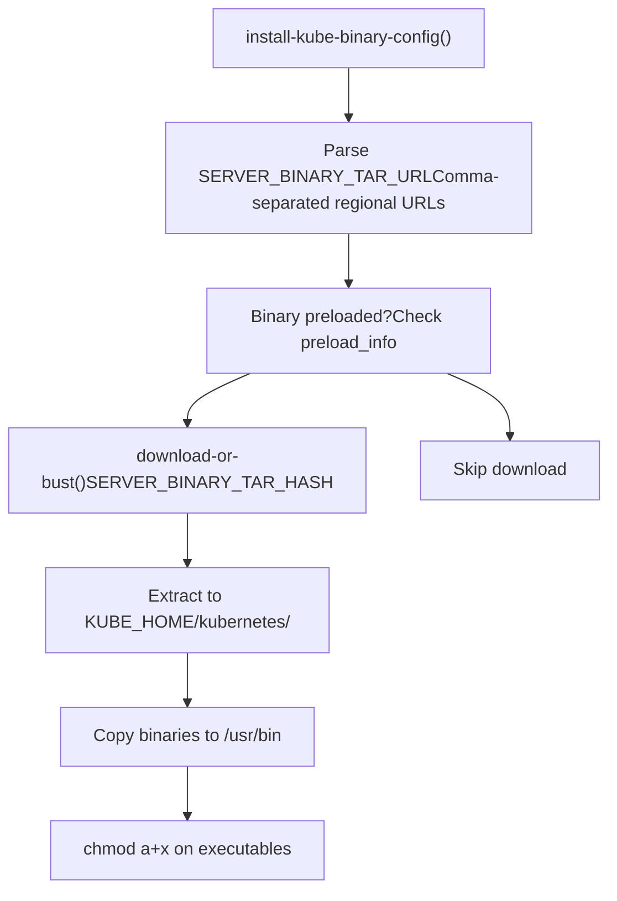
```mermaid
flowchart TD
    Start["install-kube-binary-config()"]
    ParseURLs["Parse SERVER_BINARY_TAR_URLComma-separated regional URLs"]
    CheckPreload["Binary preloaded?Check preload_info"]
    DownloadBinary["download-or-bust()SERVER_BINARY_TAR_HASH"]
    ExtractBinary["Extract to KUBE_HOME/kubernetes/"]
    CopyToBin["Copy binaries to /usr/bin"]
    SetPermissions["chmod a+x on executables"]
    End["Skip download"]

    Start --> ParseURLs
    ParseURLs --> CheckPreload
    CheckPreload --> End
    CheckPreload --> DownloadBinary
    DownloadBinary --> ExtractBinary
    ExtractBinary --> CopyToBin
    CopyToBin --> SetPermissions
```
The download includes validation:

-   SHA512 hash verification ([cluster/gce/gci/configure.sh143-153](https://github.com/kubernetes/kubernetes/blob/2757a872/cluster/gce/gci/configure.sh#L143-L153))
-   Retry logic with exponential backoff
-   Multi-region fallback for reliability

Sources: [cluster/gce/gci/configure.sh485-545](https://github.com/kubernetes/kubernetes/blob/2757a872/cluster/gce/gci/configure.sh#L485-L545)

### Node PKI Setup

The `create-node-pki()` function ([cluster/gce/gci/configure-helper.sh672-702](https://github.com/kubernetes/kubernetes/blob/2757a872/cluster/gce/gci/configure-helper.sh#L672-L702)) creates `/etc/srv/kubernetes/pki/`:

| File | Source Variable | Purpose |
| --- | --- | --- |
| `ca-certificates.crt` | `CA_CERT_BUNDLE` or `CA_CERT` | Cluster CA for API server validation |
| `kubelet.crt` | `KUBELET_CERT` | Kubelet server certificate (if static) |
| `kubelet.key` | `KUBELET_KEY` | Kubelet server key (if static) |
| `konnectivity-agent/*` | `KONNECTIVITY_AGENT_*` | Konnectivity agent certs (if enabled) |

The function respects `KUBE_PKI_READERS_GROUP` for setting group-readable permissions on certificates.

Sources: [cluster/gce/gci/configure-helper.sh672-702](https://github.com/kubernetes/kubernetes/blob/2757a872/cluster/gce/gci/configure-helper.sh#L672-L702)

### Container Runtime Configuration

Container runtime setup depends on `CONTAINER_RUNTIME_NAME` (typically `containerd`):

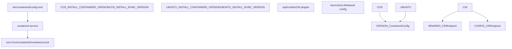
```mermaid
flowchart TD
    ContainerdConfig["/etc/containerd/config.toml"]
    SystemdUnit["containerd.service"]
    CRIEndpoint["unix:///run/containerd/containerd.sock"]
    COS_VERSION["COS_INSTALL_CONTAINERD_VERSIONCOS_INSTALL_RUNC_VERSION"]
    UBUNTU_VERSION["UBUNTU_INSTALL_CONTAINERD_VERSIONUBUNTU_INSTALL_RUNC_VERSION"]
    CNI_BINARIES["/opt/cni/bin/CNI plugins"]
    CNI_CONFIG["/etc/cni/net.d/Network config"]

    COS --> VERSION_ContainerdConfig
    UBUNTU --> VERSION_ContainerdConfig
    ContainerdConfig --> SystemdUnit
    SystemdUnit --> CRIEndpoint
    CNI --> BINARIES_CRIEndpoint
    CNI --> CONFIG_CRIEndpoint
```
The configuration includes:

-   Custom containerd versions for COS ([cluster/gce/config-test.sh133-134](https://github.com/kubernetes/kubernetes/blob/2757a872/cluster/gce/config-test.sh#L133-L134))
-   Custom containerd versions for Ubuntu ([cluster/gce/config-test.sh126-127](https://github.com/kubernetes/kubernetes/blob/2757a872/cluster/gce/config-test.sh#L126-L127))
-   CNI plugin installation ([cluster/gce/gci/configure.sh346-370](https://github.com/kubernetes/kubernetes/blob/2757a872/cluster/gce/gci/configure.sh#L346-L370))
-   crictl configuration ([cluster/gce/gci/configure.sh396-412](https://github.com/kubernetes/kubernetes/blob/2757a872/cluster/gce/gci/configure.sh#L396-L412))

Sources: [cluster/gce/config-test.sh104-135](https://github.com/kubernetes/kubernetes/blob/2757a872/cluster/gce/config-test.sh#L104-L135) [cluster/gce/gci/configure.sh346-412](https://github.com/kubernetes/kubernetes/blob/2757a872/cluster/gce/gci/configure.sh#L346-L412)

### Kubelet Configuration

Kubelet configuration uses both flags and config files. The `construct-linux-kubelet-flags()` function ([cluster/gce/util.sh751-809](https://github.com/kubernetes/kubernetes/blob/2757a872/cluster/gce/util.sh#L751-L809)) builds command-line flags:

**Key Kubelet Flags:**

-   `--cloud-provider=external`: Use external cloud controller
-   `--experimental-mounter-path=/home/kubernetes/containerized_mounter/mounter`: Custom mount helper
-   `--cert-dir=/var/lib/kubelet/pki/`: Certificate directory
-   `--bootstrap-kubeconfig=/var/lib/kubelet/bootstrap-kubeconfig`: Bootstrap credentials
-   `--kubeconfig=/var/lib/kubelet/kubeconfig`: Final kubeconfig after bootstrap
-   `--register-with-taints=node-role.kubernetes.io/control-plane=:NoSchedule`: Master node taint (if `REGISTER_MASTER_KUBELET=true`)

The system also generates a kubelet config file via `build-kubelet-config()` ([cluster/gce/util.sh1229-1429](https://github.com/kubernetes/kubernetes/blob/2757a872/cluster/gce/util.sh#L1229-L1429)) uploaded as metadata.

Sources: [cluster/gce/util.sh751-809](https://github.com/kubernetes/kubernetes/blob/2757a872/cluster/gce/util.sh#L751-L809) [cluster/gce/util.sh1229-1429](https://github.com/kubernetes/kubernetes/blob/2757a872/cluster/gce/util.sh#L1229-L1429)

### Local SSD Management

The `ensure-local-ssds()` function ([cluster/gce/gci/configure-helper.sh414-468](https://github.com/kubernetes/kubernetes/blob/2757a872/cluster/gce/gci/configure-helper.sh#L414-L468)) handles local SSD configuration:

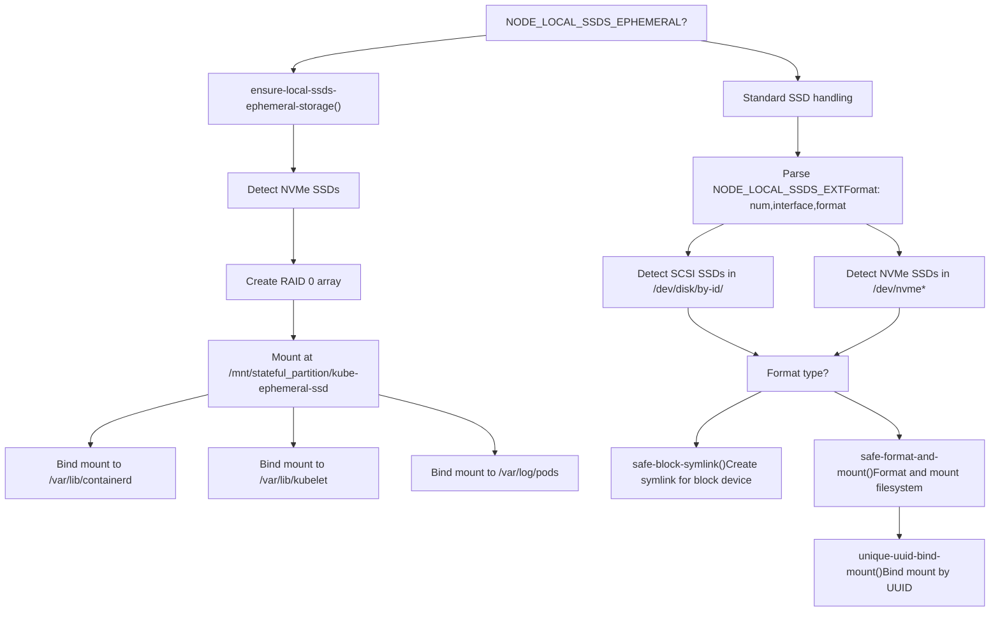
```mermaid
flowchart TD
    CheckMode["NODE_LOCAL_SSDS_EPHEMERAL?"]
    EphemeralMode["ensure-local-ssds-ephemeral-storage()"]
    StandardMode["Standard SSD handling"]
    DetectNVMe["Detect NVMe SSDs"]
    CreateRAID["Create RAID 0 array"]
    MountRAID["Mount at /mnt/stateful_partition/kube-ephemeral-ssd"]
    BindContainerd["Bind mount to /var/lib/containerd"]
    BindKubelet["Bind mount to /var/lib/kubelet"]
    BindLogs["Bind mount to /var/log/pods"]
    ParseConfig["Parse NODE_LOCAL_SSDS_EXTFormat: num,interface,format"]
    DetectSCSI["Detect SCSI SSDs in /dev/disk/by-id/"]
    DetectNVMeStd["Detect NVMe SSDs in /dev/nvme*"]
    FormatCheck["Format type?"]
    BlockDevice["safe-block-symlink()Create symlink for block device"]
    FSDevice["safe-format-and-mount()Format and mount filesystem"]
    UUIDMount["unique-uuid-bind-mount()Bind mount by UUID"]

    CheckMode --> EphemeralMode
    CheckMode --> StandardMode
    EphemeralMode --> DetectNVMe
    DetectNVMe --> CreateRAID
    CreateRAID --> MountRAID
    MountRAID --> BindContainerd
    MountRAID --> BindKubelet
    MountRAID --> BindLogs
    StandardMode --> ParseConfig
    ParseConfig --> DetectSCSI
    ParseConfig --> DetectNVMeStd
    DetectSCSI --> FormatCheck
    DetectNVMeStd --> FormatCheck
    FormatCheck --> BlockDevice
    FormatCheck --> FSDevice
    FSDevice --> UUIDMount
```
The `NODE_LOCAL_SSDS_EXT` format allows fine-grained control: `"2,scsi,fs;1,nvme,block"` means 2 SCSI SSDs with filesystem and 1 NVMe as block device.

Sources: [cluster/gce/gci/configure-helper.sh414-524](https://github.com/kubernetes/kubernetes/blob/2757a872/cluster/gce/gci/configure-helper.sh#L414-L524)

### Network Firewall Configuration

The `config-ip-firewall()` function ([cluster/gce/gci/configure-helper.sh150-214](https://github.com/kubernetes/kubernetes/blob/2757a872/cluster/gce/gci/configure-helper.sh#L150-L214)) sets up iptables rules:

1.  **Enable loopback routing**: `sysctl -w net.ipv4.conf.all.route_localnet=1`
2.  **Accept inbound traffic**: Add ACCEPT rules for TCP/UDP/ICMP/SCTP
3.  **IP masquerading** (if `NON_MASQUERADE_CIDR=0.0.0.0/0`):
    -   Create `IP-MASQ` chain
    -   Exclude RFC 1918 and other reserved ranges
    -   MASQUERADE all other outbound traffic
4.  **Metadata concealment** (if `ENABLE_METADATA_CONCEALMENT=true`):
    -   Add local IP `169.254.169.252` for metadata proxy
    -   DNAT metadata server traffic to proxy on port 988/987
5.  **Metadata firewall** (if `METADATA_SERVER_FIREWALL_MODE=log`):
    -   Log metadata access from unapproved UIDs

Sources: [cluster/gce/gci/configure-helper.sh150-214](https://github.com/kubernetes/kubernetes/blob/2757a872/cluster/gce/gci/configure-helper.sh#L150-L214)

## Windows Node Provisioning

Windows nodes use PowerShell modules for configuration, with a different architecture than Linux nodes.

### PowerShell Module Architecture

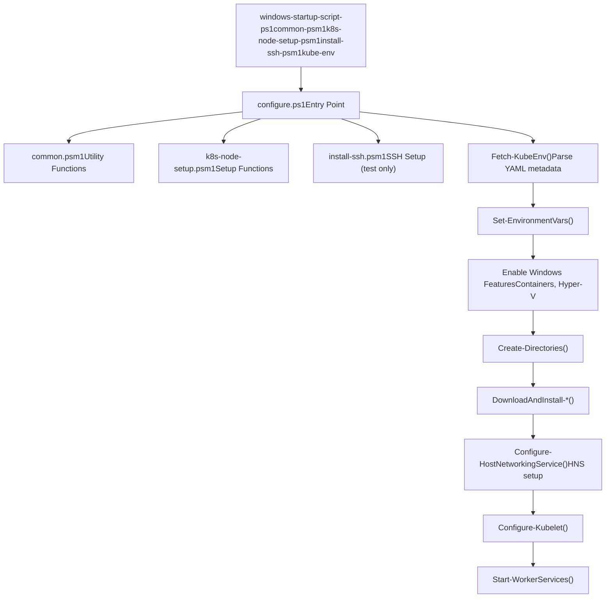
```mermaid
flowchart TD
    WinMetadata["windows-startup-script-ps1common-psm1k8s-node-setup-psm1install-ssh-psm1kube-env"]
    ConfigurePS1["configure.ps1Entry Point"]
    CommonPSM1["common.psm1Utility Functions"]
    K8sNodeSetupPSM1["k8s-node-setup.psm1Setup Functions"]
    InstallSSHPSM1["install-ssh.psm1SSH Setup (test only)"]
    FetchKubeEnv["Fetch-KubeEnv()Parse YAML metadata"]
    SetEnvVars["Set-EnvironmentVars()"]
    EnableFeatures["Enable Windows FeaturesContainers, Hyper-V"]
    CreateDirs["Create-Directories()"]
    DownloadBinaries["DownloadAndInstall-*()"]
    ConfigureNetworking["Configure-HostNetworkingService()HNS setup"]
    ConfigureKubelet["Configure-Kubelet()"]
    StartServices["Start-WorkerServices()"]

    WinMetadata --> ConfigurePS1
    ConfigurePS1 --> CommonPSM1
    ConfigurePS1 --> K8sNodeSetupPSM1
    ConfigurePS1 --> InstallSSHPSM1
    ConfigurePS1 --> FetchKubeEnv
    FetchKubeEnv --> SetEnvVars
    SetEnvVars --> EnableFeatures
    EnableFeatures --> CreateDirs
    CreateDirs --> DownloadBinaries
    DownloadBinaries --> ConfigureNetworking
    ConfigureNetworking --> ConfigureKubelet
    ConfigureKubelet --> StartServices
```
Sources: [cluster/gce/windows/configure.ps1106-196](https://github.com/kubernetes/kubernetes/blob/2757a872/cluster/gce/windows/configure.ps1#L106-L196) [cluster/gce/windows/k8s-node-setup.psm11-317](https://github.com/kubernetes/kubernetes/blob/2757a872/cluster/gce/windows/k8s-node-setup.psm1#L1-L317)

### Windows Environment Variables

The `Set-EnvironmentVars()` function ([cluster/gce/windows/k8s-node-setup.psm1264-316](https://github.com/kubernetes/kubernetes/blob/2757a872/cluster/gce/windows/k8s-node-setup.psm1#L264-L316)) establishes Windows-specific paths:

| Environment Variable | Default Value | Purpose |
| --- | --- | --- |
| `K8S_DIR` | `C:\etc\kubernetes` | Root Kubernetes directory |
| `NODE_DIR` | `C:\etc\kubernetes\node\bin` | Binary directory (on PATH) |
| `CNI_DIR` | `C:\etc\kubernetes\cni` | CNI plugin binaries |
| `CNI_CONFIG_DIR` | `C:\etc\kubernetes\cni\config` | CNI configuration |
| `PKI_DIR` | `C:\etc\kubernetes\pki` | Certificate storage |
| `LOGS_DIR` | `C:\etc\kubernetes\logs` | Log files |
| `MANIFESTS_DIR` | `C:\etc\kubernetes\manifests` | Static pod manifests |
| `CONTAINER_RUNTIME_ENDPOINT` | From `WINDOWS_CONTAINER_RUNTIME_ENDPOINT` or `CONTAINER_RUNTIME_ENDPOINT` | CRI endpoint |
| `KUBE_NETWORK` | `l2bridge` | Windows CNI network type |
| `INFRA_CONTAINER` | From `WINDOWS_INFRA_CONTAINER` | Pause container image |

Sources: [cluster/gce/windows/k8s-node-setup.psm1264-316](https://github.com/kubernetes/kubernetes/blob/2757a872/cluster/gce/windows/k8s-node-setup.psm1#L264-L316) [cluster/gce/config-common.sh127-158](https://github.com/kubernetes/kubernetes/blob/2757a872/cluster/gce/config-common.sh#L127-L158)

### Windows Binary Download

Windows nodes download binaries from the same GCS buckets but use PowerShell functions:

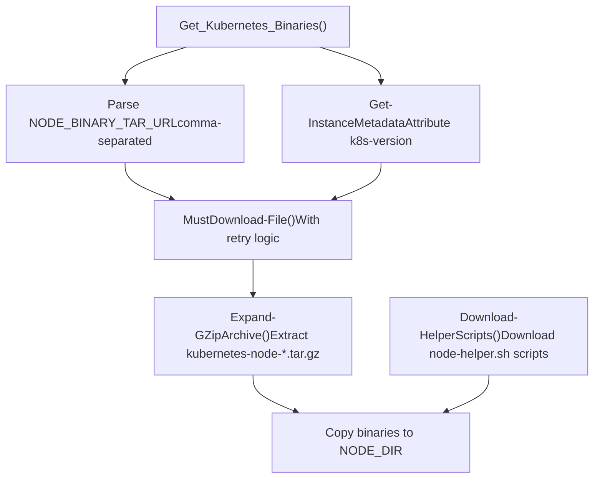
```mermaid
flowchart TD
    GetBinaries["Get_Kubernetes_Binaries()"]
    ParseURLs["Parse NODE_BINARY_TAR_URLcomma-separated"]
    FetchKubeVersion["Get-InstanceMetadataAttribute k8s-version"]
    DownloadNodeBinaries["Download-HelperScripts()Download node-helper.sh scripts"]
    DownloadKubeBinaries["MustDownload-File()With retry logic"]
    ExtractTar["Expand-GZipArchive()Extract kubernetes-node-*.tar.gz"]
    CopyBinaries["Copy binaries to NODE_DIR"]

    GetBinaries --> ParseURLs
    GetBinaries --> FetchKubeVersion
    ParseURLs --> DownloadKubeBinaries
    FetchKubeVersion --> DownloadKubeBinaries
    DownloadKubeBinaries --> ExtractTar
    ExtractTar --> CopyBinaries
    DownloadNodeBinaries --> CopyBinaries
```
The `MustDownload-File()` function ([cluster/gce/windows/common.psm1130-195](https://github.com/kubernetes/kubernetes/blob/2757a872/cluster/gce/windows/common.psm1#L130-L195)) includes:

-   SHA validation using `Validate-SHA`
-   Automatic retry with exponential backoff
-   Support for `.gz` extraction
-   Progress reporting

Sources: [cluster/gce/windows/k8s-node-setup.psm1773-870](https://github.com/kubernetes/kubernetes/blob/2757a872/cluster/gce/windows/k8s-node-setup.psm1#L773-L870) [cluster/gce/windows/common.psm1130-195](https://github.com/kubernetes/kubernetes/blob/2757a872/cluster/gce/windows/common.psm1#L130-L195)

### Windows Feature Installation

Windows nodes require specific OS features:

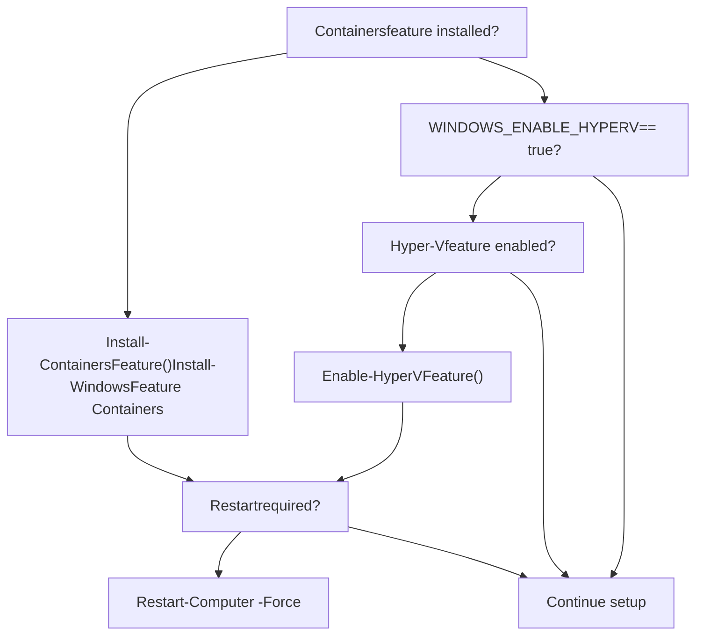
```mermaid
flowchart TD
    CheckContainers["Containersfeature installed?"]
    InstallContainers["Install-ContainersFeature()Install-WindowsFeature Containers"]
    CheckHyperV["WINDOWS_ENABLE_HYPERV== true?"]
    CheckHyperVInstalled["Hyper-Vfeature enabled?"]
    EnableHyperV["Enable-HyperVFeature()"]
    NeedReboot["Restartrequired?"]
    Reboot["Restart-Computer -Force"]
    Continue["Continue setup"]

    CheckContainers --> InstallContainers
    CheckContainers --> CheckHyperV
    InstallContainers --> NeedReboot
    CheckHyperV --> CheckHyperVInstalled
    CheckHyperV --> Continue
    CheckHyperVInstalled --> EnableHyperV
    CheckHyperVInstalled --> Continue
    EnableHyperV --> NeedReboot
    NeedReboot --> Reboot
    NeedReboot --> Continue
```
The Containers feature is required for Windows container support. Hyper-V isolation is optional and controlled by `WINDOWS_ENABLE_HYPERV` ([cluster/gce/windows/k8s-node-setup.psm1344-383](https://github.com/kubernetes/kubernetes/blob/2757a872/cluster/gce/windows/k8s-node-setup.psm1#L344-L383)).

Sources: [cluster/gce/windows/configure.ps1125-145](https://github.com/kubernetes/kubernetes/blob/2757a872/cluster/gce/windows/configure.ps1#L125-L145) [cluster/gce/windows/k8s-node-setup.psm1344-394](https://github.com/kubernetes/kubernetes/blob/2757a872/cluster/gce/windows/k8s-node-setup.psm1#L344-L394)

### Windows Networking Configuration

Windows networking uses Host Network Service (HNS):

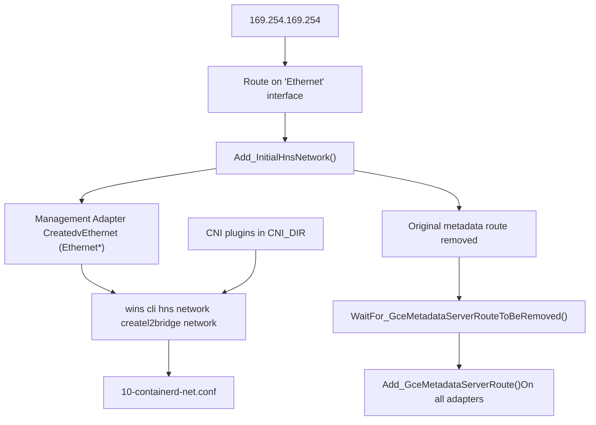
```mermaid
flowchart TD
    MetadataIP["169.254.169.254"]
    MetadataRoute["Route on 'Ethernet' interface"]
    CreateHNS["Add_InitialHnsNetwork()"]
    MgmtAdapter["Management Adapter CreatedvEthernet (Ethernet*)"]
    RouteRemoved["Original metadata route removed"]
    WaitForRemoval["WaitFor_GceMetadataServerRouteToBeRemoved()"]
    AddRouteBack["Add_GceMetadataServerRoute()On all adapters"]
    CNIConfig["wins cli hns network createl2bridge network"]
    CNIBinaries["CNI plugins in CNI_DIR"]
    ConfigFile["10-containerd-net.conf"]

    MetadataIP --> MetadataRoute
    MetadataRoute --> CreateHNS
    CreateHNS --> MgmtAdapter
    CreateHNS --> RouteRemoved
    RouteRemoved --> WaitForRemoval
    WaitForRemoval --> AddRouteBack
    MgmtAdapter --> CNIConfig
    CNIBinaries --> CNIConfig
    CNIConfig --> ConfigFile
```
The `Add_InitialHnsNetwork()` function ([cluster/gce/windows/k8s-node-setup.psm1546-583](https://github.com/kubernetes/kubernetes/blob/2757a872/cluster/gce/windows/k8s-node-setup.psm1#L546-L583)) creates the initial HNS network which enables pod networking. The metadata server route must be re-added after HNS initialization because HNS modifies network configuration.

Sources: [cluster/gce/windows/k8s-node-setup.psm184-136](https://github.com/kubernetes/kubernetes/blob/2757a872/cluster/gce/windows/k8s-node-setup.psm1#L84-L136) [cluster/gce/windows/k8s-node-setup.psm1546-683](https://github.com/kubernetes/kubernetes/blob/2757a872/cluster/gce/windows/k8s-node-setup.psm1#L546-L683)

### Windows Kubelet Configuration

Windows kubelet configuration parallels Linux but with Windows-specific paths:

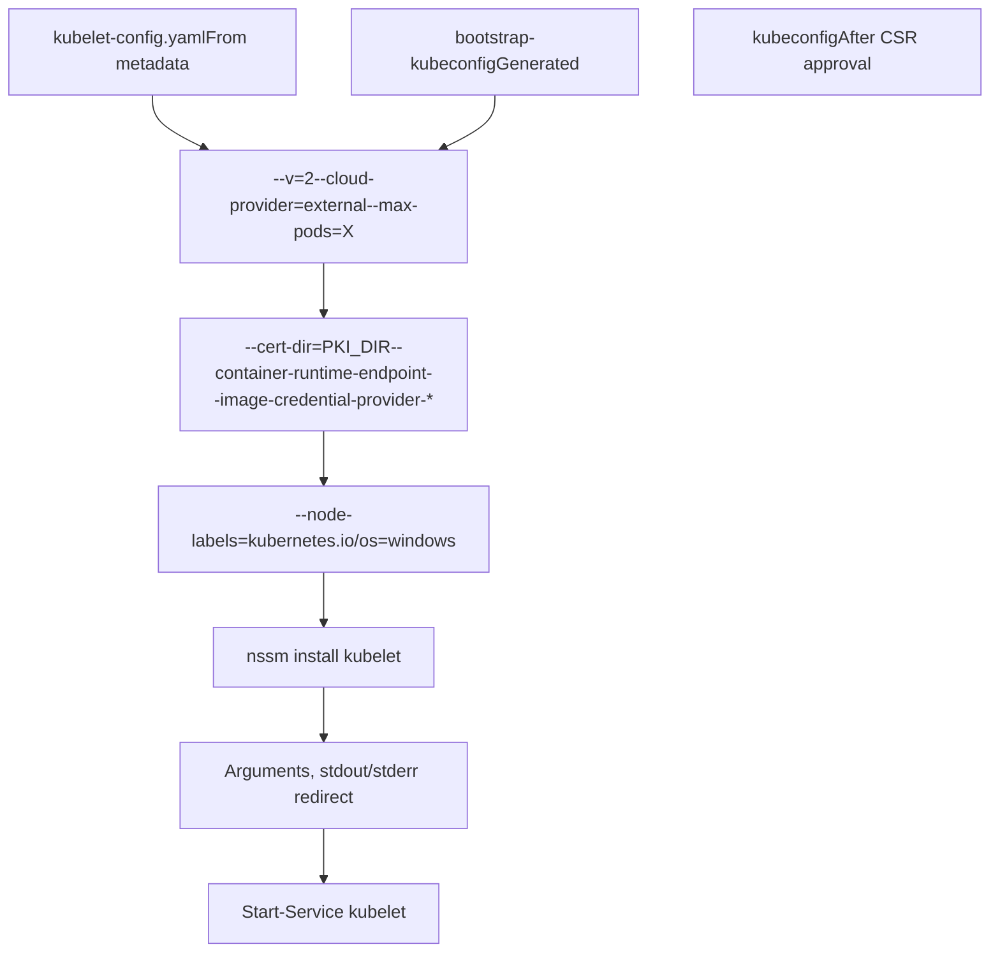
```mermaid
flowchart TD
    KubeletConfig["kubelet-config.yamlFrom metadata"]
    BootstrapKubeconfig["bootstrap-kubeconfigGenerated"]
    Kubeconfig["kubeconfigAfter CSR approval"]
    CommonFlags["--v=2--cloud-provider=external--max-pods=X"]
    WindowsFlags["--cert-dir=PKI_DIR--container-runtime-endpoint--image-credential-provider-*"]
    NodeLabels["--node-labels=kubernetes.io/os=windows"]
    ServiceDef["nssm install kubelet"]
    ServiceParams["Arguments, stdout/stderr redirect"]
    ServiceStart["Start-Service kubelet"]

    KubeletConfig --> CommonFlags
    BootstrapKubeconfig --> CommonFlags
    CommonFlags --> WindowsFlags
    WindowsFlags --> NodeLabels
    NodeLabels --> ServiceDef
    ServiceDef --> ServiceParams
    ServiceParams --> ServiceStart
```
The `Configure-Kubelet()` function ([cluster/gce/windows/k8s-node-setup.psm11420-1492](https://github.com/kubernetes/kubernetes/blob/2757a872/cluster/gce/windows/k8s-node-setup.psm1#L1420-L1492)) uses `nssm` (Non-Sucking Service Manager) to install kubelet as a Windows service with proper environment variables and output redirection.

Sources: [cluster/gce/windows/k8s-node-setup.psm11420-1492](https://github.com/kubernetes/kubernetes/blob/2757a872/cluster/gce/windows/k8s-node-setup.psm1#L1420-L1492)

### Windows-Specific Components

Windows nodes require additional components not present on Linux:

**CSI Proxy:**

-   Enables CSI drivers to perform privileged operations
-   Installed by `DownloadAndInstall-CSIProxyBinaries()` ([cluster/gce/windows/k8s-node-setup.psm1908-944](https://github.com/kubernetes/kubernetes/blob/2757a872/cluster/gce/windows/k8s-node-setup.psm1#L908-L944))
-   Run as a service via `nssm`
-   Configured via `CSI_PROXY_VERSION` and `CSI_PROXY_FLAGS`

**Auth Provider GCP:**

-   Image credential provider for pulling from GCR/Artifact Registry
-   Controlled by `ENABLE_AUTH_PROVIDER_GCP` (default: true)
-   Binary: `auth-provider-gcp.exe`
-   Config: `cri-auth-config.yaml` in `K8S_DIR`
-   Kubelet flag: `--image-credential-provider-config` and `--image-credential-provider-bin-dir`

**Node Problem Detector:**

-   Optional Windows implementation
-   Configured via `ENABLE_NODE_PROBLEM_DETECTOR`
-   Uses separate kubeconfig at `NODEPROBLEMDETECTOR_KUBECONFIG_FILE`

Sources: [cluster/gce/windows/k8s-node-setup.psm1908-944](https://github.com/kubernetes/kubernetes/blob/2757a872/cluster/gce/windows/k8s-node-setup.psm1#L908-L944) [cluster/gce/windows/k8s-node-setup.psm11048-1097](https://github.com/kubernetes/kubernetes/blob/2757a872/cluster/gce/windows/k8s-node-setup.psm1#L1048-L1097) [cluster/gce/windows/k8s-node-setup.psm11524-1584](https://github.com/kubernetes/kubernetes/blob/2757a872/cluster/gce/windows/k8s-node-setup.psm1#L1524-L1584)

## Network Configuration

GCE cluster networking involves IP aliasing, firewall rules, and service routing.

### IP Aliasing Architecture

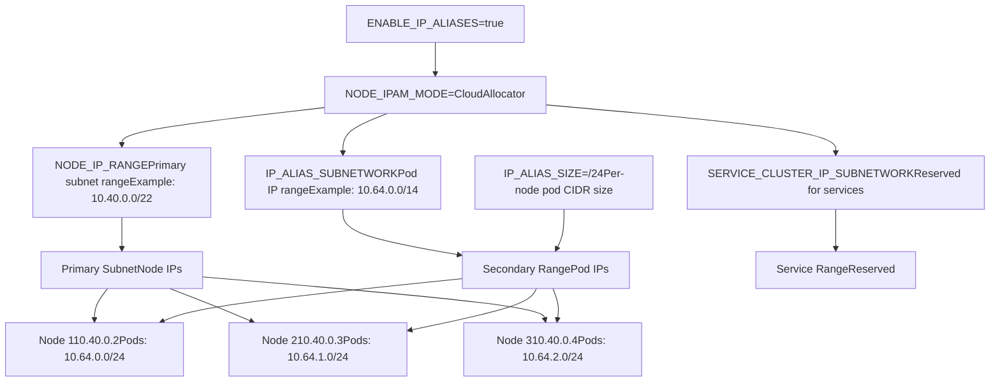
```mermaid
flowchart TD
    EnableIPAliases["ENABLE_IP_ALIASES=true"]
    NodeIPAMMode["NODE_IPAM_MODE=CloudAllocator"]
    PrimaryRange["NODE_IP_RANGEPrimary subnet rangeExample: 10.40.0.0/22"]
    SecondaryRange["IP_ALIAS_SUBNETWORKPod IP rangeExample: 10.64.0.0/14"]
    ServiceRange["SERVICE_CLUSTER_IP_SUBNETWORKReserved for services"]
    AliasSize["IP_ALIAS_SIZE=/24Per-node pod CIDR size"]
    PrimarySubnet["Primary SubnetNode IPs"]
    SecondarySubnet["Secondary RangePod IPs"]
    ServiceSubnet["Service RangeReserved"]
    Node1["Node 110.40.0.2Pods: 10.64.0.0/24"]
    Node2["Node 210.40.0.3Pods: 10.64.1.0/24"]
    Node3["Node 310.40.0.4Pods: 10.64.2.0/24"]

    EnableIPAliases --> NodeIPAMMode
    NodeIPAMMode --> PrimaryRange
    NodeIPAMMode --> SecondaryRange
    NodeIPAMMode --> ServiceRange
    PrimaryRange --> PrimarySubnet
    SecondaryRange --> SecondarySubnet
    ServiceRange --> ServiceSubnet
    AliasSize --> SecondarySubnet
    PrimarySubnet --> Node1
    PrimarySubnet --> Node2
    PrimarySubnet --> Node3
    SecondarySubnet --> Node1
    SecondarySubnet --> Node2
    SecondarySubnet --> Node3
```
When `ENABLE_IP_ALIASES=true`:

-   `NODE_IPAM_MODE` switches to `CloudAllocator` (uses GCE API to allocate pod CIDRs)
-   Each node receives a `/24` pod CIDR from the secondary range
-   No routes are created in the GCE route table (traffic routed via alias IPs)
-   Supports more than 100 nodes per cluster

The `get-alias-range-size()` function ([cluster/gce/config-common.sh111-118](https://github.com/kubernetes/kubernetes/blob/2757a872/cluster/gce/config-common.sh#L111-L118)) calculates the alias size based on `MAX_PODS_PER_NODE` (default: 110 pods = /24 CIDR).

Sources: [cluster/gce/config-default.sh322-352](https://github.com/kubernetes/kubernetes/blob/2757a872/cluster/gce/config-default.sh#L322-L352) [cluster/gce/config-common.sh111-118](https://github.com/kubernetes/kubernetes/blob/2757a872/cluster/gce/config-common.sh#L111-L118)

### Firewall Rules

The provisioning system creates firewall rules for cluster communication:

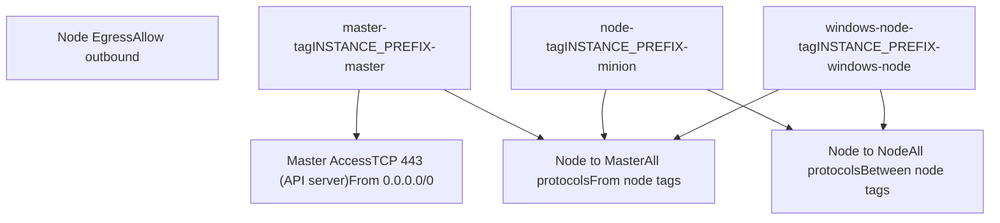
```mermaid
flowchart TD
    MasterAccess["Master AccessTCP 443 (API server)From 0.0.0.0/0"]
    NodeToMaster["Node to MasterAll protocolsFrom node tags"]
    NodeToNode["Node to NodeAll protocolsBetween node tags"]
    NodeEgress["Node EgressAllow outbound"]
    MasterTag["master-tagINSTANCE_PREFIX-master"]
    NodeTag["node-tagINSTANCE_PREFIX-minion"]
    WindowsNodeTag["windows-node-tagINSTANCE_PREFIX-windows-node"]

    MasterTag --> MasterAccess
    MasterTag --> NodeToMaster
    NodeTag --> NodeToMaster
    WindowsNodeTag --> NodeToMaster
    NodeTag --> NodeToNode
    WindowsNodeTag --> NodeToNode
```
Firewall rules use network tags for selection:

-   Master instances tagged with `${INSTANCE_PREFIX}-master`
-   Linux nodes tagged with `${INSTANCE_PREFIX}-minion`
-   Windows nodes tagged with `${INSTANCE_PREFIX}-windows-node`

Sources: [cluster/gce/util.sh129-134](https://github.com/kubernetes/kubernetes/blob/2757a872/cluster/gce/util.sh#L129-L134) [cluster/gce/config-test.sh141-151](https://github.com/kubernetes/kubernetes/blob/2757a872/cluster/gce/config-test.sh#L141-L151)

### Custom Network Creation

When `CREATE_CUSTOM_NETWORK=true`, the system creates a dedicated VPC:

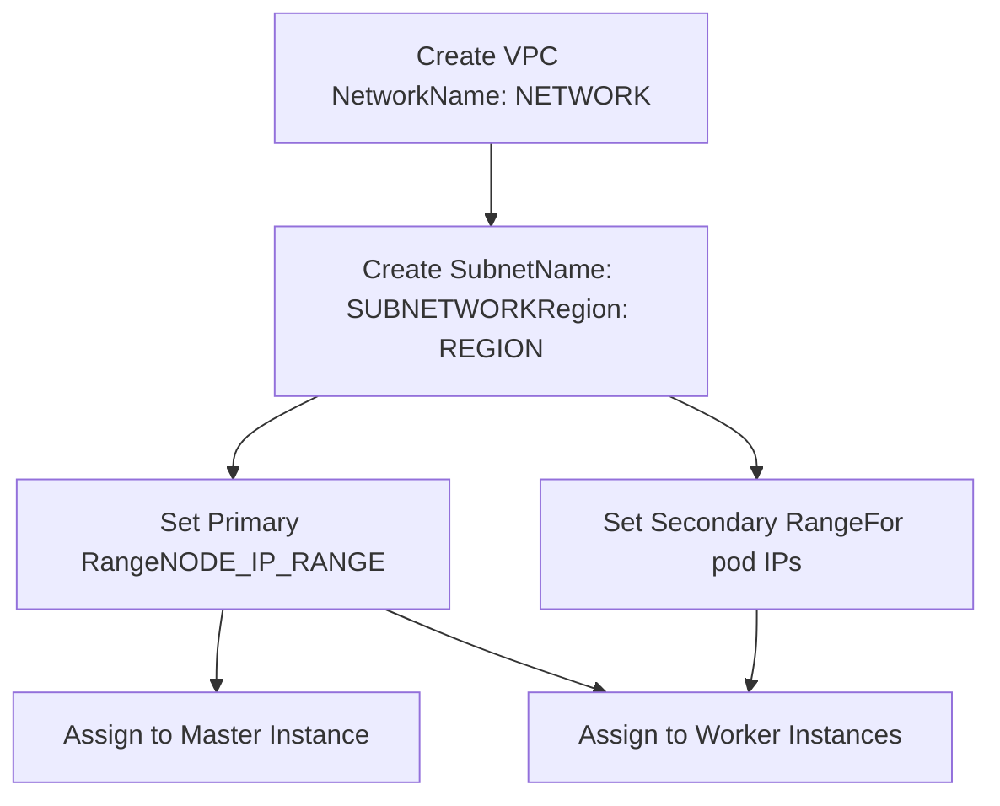
```mermaid
flowchart TD
    CreateNetwork["Create VPC NetworkName: NETWORK"]
    CreateSubnet["Create SubnetName: SUBNETWORKRegion: REGION"]
    SetPrimaryRange["Set Primary RangeNODE_IP_RANGE"]
    SetSecondaryRange["Set Secondary RangeFor pod IPs"]
    AssignToMaster["Assign to Master Instance"]
    AssignToNodes["Assign to Worker Instances"]

    CreateNetwork --> CreateSubnet
    CreateSubnet --> SetPrimaryRange
    CreateSubnet --> SetSecondaryRange
    SetPrimaryRange --> AssignToMaster
    SetPrimaryRange --> AssignToNodes
    SetSecondaryRange --> AssignToNodes
```
Custom networks allow:

-   Isolation from other clusters
-   Custom IP ranges
-   Control over subnet configuration
-   Testing network policies

Sources: [cluster/gce/config-default.sh62](https://github.com/kubernetes/kubernetes/blob/2757a872/cluster/gce/config-default.sh#L62-L62) [cluster/gce/config-default.sh135-137](https://github.com/kubernetes/kubernetes/blob/2757a872/cluster/gce/config-default.sh#L135-L137)

## kube-env Metadata Format

The `kube-env` metadata key uses YAML format for configuration distribution:

### kube-env Structure

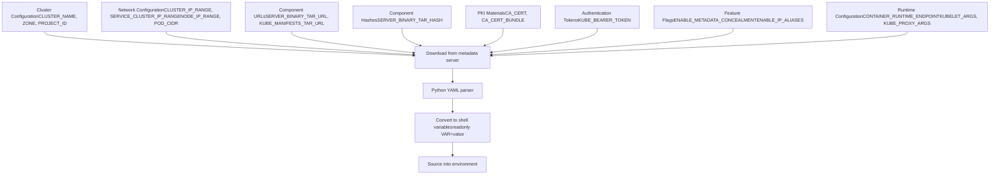
```mermaid
flowchart TD
    ClusterConfig["Cluster ConfigurationCLUSTER_NAME, ZONE, PROJECT_ID"]
    NetworkConfig["Network ConfigurationCLUSTER_IP_RANGE, SERVICE_CLUSTER_IP_RANGENODE_IP_RANGE, POD_CIDR"]
    ComponentURLs["Component URLsSERVER_BINARY_TAR_URL, KUBE_MANIFESTS_TAR_URL"]
    ComponentHashes["Component HashesSERVER_BINARY_TAR_HASH"]
    Certificates["PKI MaterialsCA_CERT, CA_CERT_BUNDLE"]
    Tokens["Authentication TokensKUBE_BEARER_TOKEN"]
    FeatureFlags["Feature FlagsENABLE_METADATA_CONCEALMENTENABLE_IP_ALIASES"]
    RuntimeConfig["Runtime ConfigurationCONTAINER_RUNTIME_ENDPOINTKUBELET_ARGS, KUBE_PROXY_ARGS"]
    DownloadYAML["Download from metadata server"]
    ParsePython["Python YAML parser"]
    ShellVars["Convert to shell variablesreadonly VAR=value"]
    LoadIntoEnv["Source into environment"]

    ClusterConfig --> DownloadYAML
    NetworkConfig --> DownloadYAML
    ComponentURLs --> DownloadYAML
    ComponentHashes --> DownloadYAML
    Certificates --> DownloadYAML
    Tokens --> DownloadYAML
    FeatureFlags --> DownloadYAML
    RuntimeConfig --> DownloadYAML
    DownloadYAML --> ParsePython
    ParsePython --> ShellVars
    ShellVars --> LoadIntoEnv
```
The `download-kube-env()` function ([cluster/gce/gci/configure.sh84-103](https://github.com/kubernetes/kubernetes/blob/2757a872/cluster/gce/gci/configure.sh#L84-L103)) fetches and parses this YAML:

1.  Download from `http://metadata.google.internal/computeMetadata/v1/instance/attributes/kube-env`
2.  Parse using Python's `yaml.load()` with `BaseLoader`
3.  Generate shell variable assignments with proper quoting via `pipes.quote()`
4.  Write to `/home/kubernetes/kube-env` and source it

On Windows, `ConvertFrom_Yaml_KubeEnv()` ([cluster/gce/windows/k8s-node-setup.psm1182-213](https://github.com/kubernetes/kubernetes/blob/2757a872/cluster/gce/windows/k8s-node-setup.psm1#L182-L213)) parses the YAML into a PowerShell HashTable.

Sources: [cluster/gce/gci/configure.sh84-103](https://github.com/kubernetes/kubernetes/blob/2757a872/cluster/gce/gci/configure.sh#L84-L103) [cluster/gce/windows/k8s-node-setup.psm1182-213](https://github.com/kubernetes/kubernetes/blob/2757a872/cluster/gce/windows/k8s-node-setup.psm1#L182-L213)

### build-linux-kube-env Function

The `build-linux-kube-env()` function ([cluster/gce/util.sh1010-1228](https://github.com/kubernetes/kubernetes/blob/2757a872/cluster/gce/util.sh#L1010-L1228)) generates the kube-env YAML from environment variables. Key variable categories include:

**Cluster Identity:**

-   `CLUSTER_NAME`, `INSTANCE_PREFIX`
-   `PROJECT_ID`, `NETWORK_PROJECT_ID`
-   `ZONE`, `REGION`

**Networking:**

-   `CLUSTER_IP_RANGE`, `SERVICE_CLUSTER_IP_RANGE`
-   `NODE_IP_RANGE`, `SECONDARY_RANGE_NAME`
-   `ENABLE_IP_ALIASES`, `NODE_IPAM_MODE`
-   `NETWORK_PROVIDER`, `NETWORK_POLICY_PROVIDER`

**Component Configuration:**

-   `SERVER_BINARY_TAR_URL`, `SERVER_BINARY_TAR_HASH`
-   `KUBE_MANIFESTS_TAR_URL`, `KUBE_MANIFESTS_TAR_HASH`
-   `KUBELET_ARGS`, `KUBE_PROXY_ARGS`
-   `CONTAINER_RUNTIME_ENDPOINT`, `CONTAINER_RUNTIME_NAME`

**Feature Flags:**

-   `ENABLE_METADATA_CONCEALMENT`
-   `ENABLE_NODE_PROBLEM_DETECTOR`
-   `ENABLE_CSI_PROXY` (Windows)

Sources: [cluster/gce/util.sh1010-1228](https://github.com/kubernetes/kubernetes/blob/2757a872/cluster/gce/util.sh#L1010-L1228)

## Cluster Add-ons and Manifests

GCE clusters install add-ons during provisioning.

### Add-on Distribution

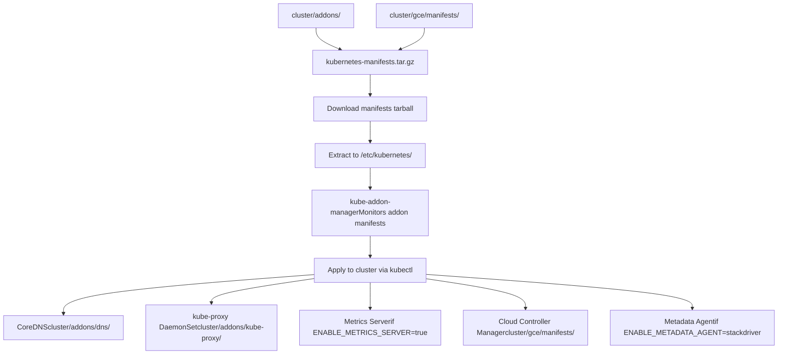
```mermaid
flowchart TD
    ManifestsTar["kubernetes-manifests.tar.gz"]
    AddonsDir["cluster/addons/"]
    GCEManifestsDir["cluster/gce/manifests/"]
    DownloadManifests["Download manifests tarball"]
    ExtractManifests["Extract to /etc/kubernetes/"]
    AddonManager["kube-addon-managerMonitors addon manifests"]
    ApplyAddons["Apply to cluster via kubectl"]
    CoreDNS["CoreDNScluster/addons/dns/"]
    KubeProxy["kube-proxy DaemonSetcluster/addons/kube-proxy/"]
    MetricsServer["Metrics Serverif ENABLE_METRICS_SERVER=true"]
    CCM["Cloud Controller Managercluster/gce/manifests/"]
    Metadata["Metadata Agentif ENABLE_METADATA_AGENT=stackdriver"]

    ManifestsTar --> DownloadManifests
    AddonsDir --> ManifestsTar
    GCEManifestsDir --> ManifestsTar
    DownloadManifests --> ExtractManifests
    ExtractManifests --> AddonManager
    AddonManager --> ApplyAddons
    ApplyAddons --> CoreDNS
    ApplyAddons --> KubeProxy
    ApplyAddons --> MetricsServer
    ApplyAddons --> CCM
    ApplyAddons --> Metadata
```
Sources: [cluster/gce/gci/configure.sh414-439](https://github.com/kubernetes/kubernetes/blob/2757a872/cluster/gce/gci/configure.sh#L414-L439) [cluster/addons/kube-proxy/kube-proxy-ds.yaml](https://github.com/kubernetes/kubernetes/blob/2757a872/cluster/addons/kube-proxy/kube-proxy-ds.yaml)

### Cloud Controller Manager Configuration

The cloud controller manager runs as a static pod on the master:

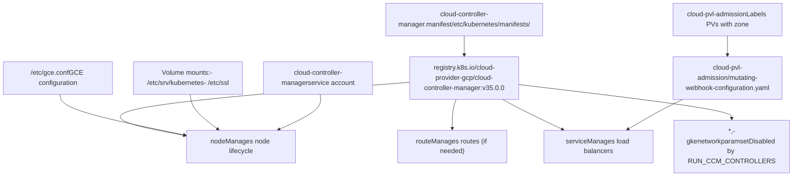
```mermaid
flowchart TD
    Manifest["cloud-controller-manager.manifest/etc/kubernetes/manifests/"]
    Image["registry.k8s.io/cloud-provider-gcp/cloud-controller-manager:v35.0.0"]
    NodeController["nodeManages node lifecycle"]
    RouteController["routeManages routes (if needed)"]
    ServiceController["serviceManages load balancers"]
    SkipGKE["*,-gkenetworkparamsetDisabled by RUN_CCM_CONTROLLERS"]
    CloudConfig["/etc/gce.confGCE configuration"]
    PKIMounts["Volume mounts:- /etc/srv/kubernetes- /etc/ssl"]
    ServiceAccount["cloud-controller-managerservice account"]
    CloudPVLAdmission["cloud-pvl-admissionLabels PVs with zone"]
    WebhookConfig["cloud-pvl-admission/mutating-webhook-configuration.yaml"]

    Manifest --> Image
    Image --> NodeController
    Image --> RouteController
    Image --> ServiceController
    Image --> SkipGKE
    CloudConfig --> NodeController
    PKIMounts --> NodeController
    ServiceAccount --> NodeController
    CloudPVLAdmission --> WebhookConfig
    WebhookConfig --> ServiceController
```
The CCM is configured via the `create-master-gce-conf` function which writes `/etc/gce.conf` with:

-   `api-endpoint`: Custom GCE API endpoint (if `GCE_API_ENDPOINT` set)
-   `project-id`: GCP project
-   `network-project-id`: Network host project (for shared VPC)
-   `network-name`, `subnetwork-name`: VPC configuration
-   `node-instance-prefix`, `node-tags`: Node identification
-   `multizone`, `regional`: Multi-zone/regional cluster flags

The cloud-pvl-admission sidecar container automatically labels GCE Persistent Disks with zone information during PV creation.

Sources: [cluster/gce/gci/configure-helper.sh875-1028](https://github.com/kubernetes/kubernetes/blob/2757a872/cluster/gce/gci/configure-helper.sh#L875-L1028) [cluster/gce/manifests/cloud-controller-manager.manifest1-130](https://github.com/kubernetes/kubernetes/blob/2757a872/cluster/gce/manifests/cloud-controller-manager.manifest#L1-L130) [cluster/gce/addons/cloud-pvl-admission/mutating-webhook-configuration.yaml](https://github.com/kubernetes/kubernetes/blob/2757a872/cluster/gce/addons/cloud-pvl-admission/mutating-webhook-configuration.yaml)

### kube-proxy DaemonSet Configuration

When `KUBE_PROXY_DAEMONSET=true`, kube-proxy runs as a DaemonSet instead of a static pod:

**DaemonSet Configuration:**

-   Node selector: `node.kubernetes.io/kube-proxy-ds-ready=true` (set during node provisioning)
-   Node selector: `kubernetes.io/os=linux` (Linux nodes only)
-   Tolerations: Runs on all nodes including masters
-   Resources: Configurable via `cpurequest` and `memoryrequest`
-   Volume mounts: `/var/log`, `/run/xtables.lock`, `/lib/modules`

The label `node.kubernetes.io/kube-proxy-ds-ready=true` is added to nodes by `build-linux-node-labels()` ([cluster/gce/util.sh630-634](https://github.com/kubernetes/kubernetes/blob/2757a872/cluster/gce/util.sh#L630-L634)) to prevent two kube-proxy instances during cluster upgrades.

Sources: [cluster/addons/kube-proxy/kube-proxy-ds.yaml](https://github.com/kubernetes/kubernetes/blob/2757a872/cluster/addons/kube-proxy/kube-proxy-ds.yaml) [cluster/gce/util.sh627-645](https://github.com/kubernetes/kubernetes/blob/2757a872/cluster/gce/util.sh#L627-L645)
