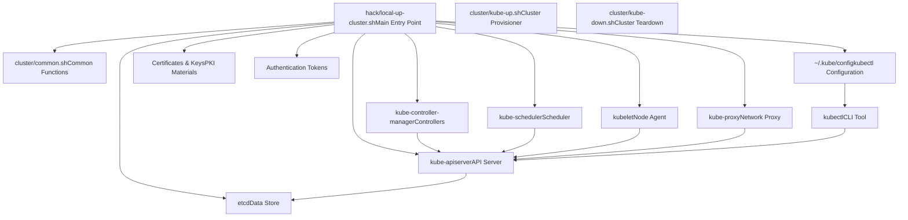
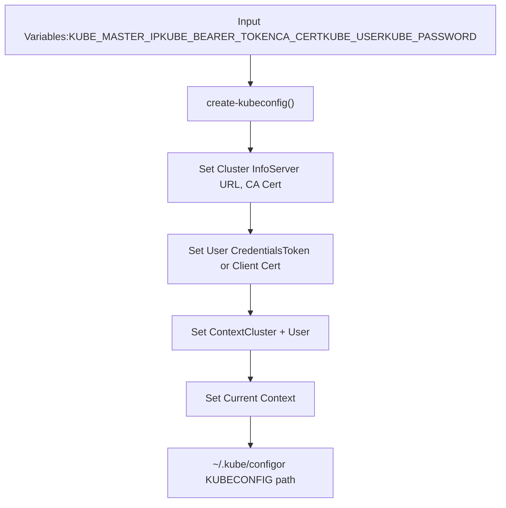
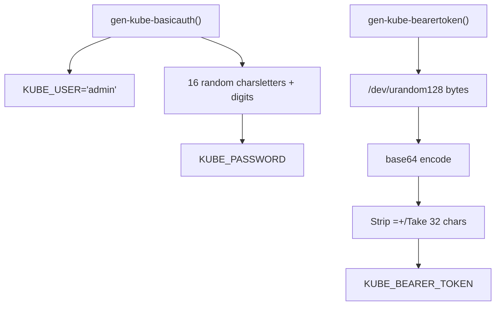
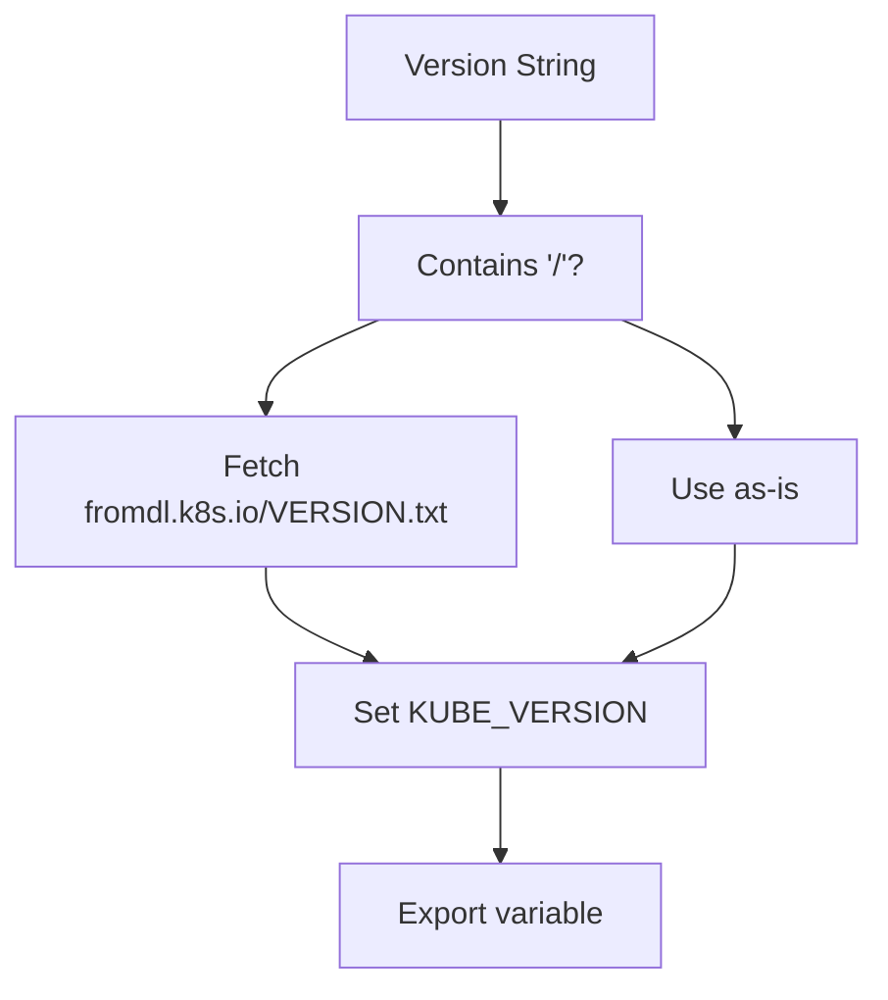
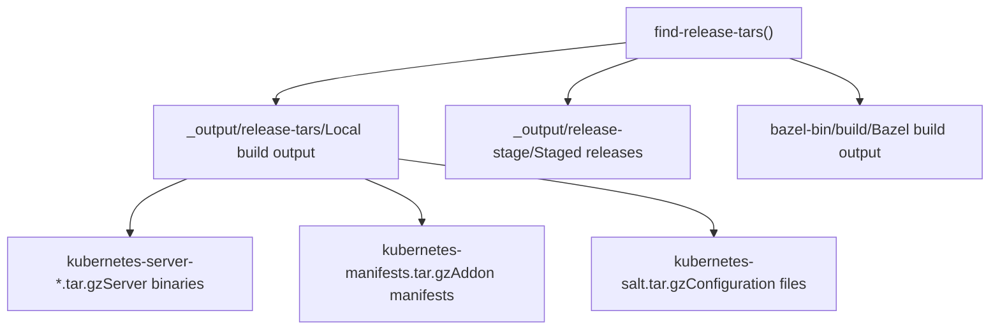
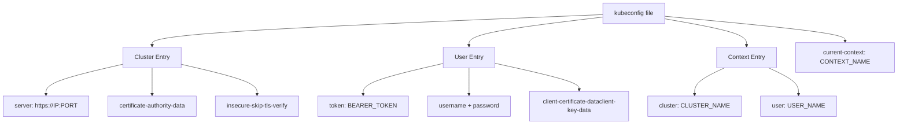
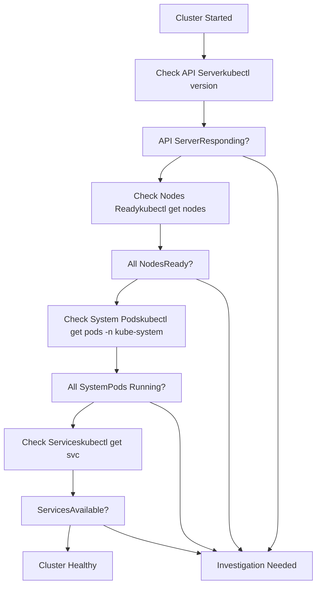

# Local Development Environment

Relevant source files

-   [.go-version](https://github.com/kubernetes/kubernetes/blob/2757a872/.go-version)
-   [build/build-image/cross/VERSION](https://github.com/kubernetes/kubernetes/blob/2757a872/build/build-image/cross/VERSION)
-   [build/common.sh](https://github.com/kubernetes/kubernetes/blob/2757a872/build/common.sh)
-   [build/dependencies.yaml](https://github.com/kubernetes/kubernetes/blob/2757a872/build/dependencies.yaml)
-   [build/root/Makefile](https://github.com/kubernetes/kubernetes/blob/2757a872/build/root/Makefile)
-   [cluster/gce/manifests/etcd.manifest](https://github.com/kubernetes/kubernetes/blob/2757a872/cluster/gce/manifests/etcd.manifest)
-   [cluster/gce/upgrade-aliases.sh](https://github.com/kubernetes/kubernetes/blob/2757a872/cluster/gce/upgrade-aliases.sh)
-   [cmd/kubeadm/app/constants/constants.go](https://github.com/kubernetes/kubernetes/blob/2757a872/cmd/kubeadm/app/constants/constants.go)
-   [cmd/kubeadm/app/constants/constants\_test.go](https://github.com/kubernetes/kubernetes/blob/2757a872/cmd/kubeadm/app/constants/constants_test.go)
-   [cmd/kubeadm/app/constants/constants\_unix.go](https://github.com/kubernetes/kubernetes/blob/2757a872/cmd/kubeadm/app/constants/constants_unix.go)
-   [cmd/kubeadm/app/constants/constants\_windows.go](https://github.com/kubernetes/kubernetes/blob/2757a872/cmd/kubeadm/app/constants/constants_windows.go)
-   [cmd/kubeadm/app/images/images.go](https://github.com/kubernetes/kubernetes/blob/2757a872/cmd/kubeadm/app/images/images.go)
-   [cmd/kubeadm/app/images/images\_test.go](https://github.com/kubernetes/kubernetes/blob/2757a872/cmd/kubeadm/app/images/images_test.go)
-   [cmd/kubeadm/app/phases/patchnode/patchnode\_test.go](https://github.com/kubernetes/kubernetes/blob/2757a872/cmd/kubeadm/app/phases/patchnode/patchnode_test.go)
-   [go.work](https://github.com/kubernetes/kubernetes/blob/2757a872/go.work)
-   [hack/ginkgo-e2e.sh](https://github.com/kubernetes/kubernetes/blob/2757a872/hack/ginkgo-e2e.sh)
-   [hack/lib/etcd.sh](https://github.com/kubernetes/kubernetes/blob/2757a872/hack/lib/etcd.sh)
-   [hack/lib/golang.sh](https://github.com/kubernetes/kubernetes/blob/2757a872/hack/lib/golang.sh)
-   [hack/lib/init.sh](https://github.com/kubernetes/kubernetes/blob/2757a872/hack/lib/init.sh)
-   [hack/local-up-cluster.sh](https://github.com/kubernetes/kubernetes/blob/2757a872/hack/local-up-cluster.sh)
-   [hack/make-rules/test-e2e-node.sh](https://github.com/kubernetes/kubernetes/blob/2757a872/hack/make-rules/test-e2e-node.sh)
-   [staging/README.md](https://github.com/kubernetes/kubernetes/blob/2757a872/staging/README.md?plain=1)
-   [staging/publishing/import-restrictions.yaml](https://github.com/kubernetes/kubernetes/blob/2757a872/staging/publishing/import-restrictions.yaml)
-   [staging/publishing/rules.yaml](https://github.com/kubernetes/kubernetes/blob/2757a872/staging/publishing/rules.yaml)
-   [staging/src/k8s.io/sample-apiserver/artifacts/example/deployment.yaml](https://github.com/kubernetes/kubernetes/blob/2757a872/staging/src/k8s.io/sample-apiserver/artifacts/example/deployment.yaml)
-   [test/e2e/chaosmonkey/chaosmonkey.go](https://github.com/kubernetes/kubernetes/blob/2757a872/test/e2e/chaosmonkey/chaosmonkey.go)
-   [test/e2e/e2e.go](https://github.com/kubernetes/kubernetes/blob/2757a872/test/e2e/e2e.go)
-   [test/e2e/e2e\_test.go](https://github.com/kubernetes/kubernetes/blob/2757a872/test/e2e/e2e_test.go)
-   [test/e2e/framework/framework.go](https://github.com/kubernetes/kubernetes/blob/2757a872/test/e2e/framework/framework.go)
-   [test/e2e/framework/kubelet/kubelet\_pods.go](https://github.com/kubernetes/kubernetes/blob/2757a872/test/e2e/framework/kubelet/kubelet_pods.go)
-   [test/e2e/framework/kubelet/stats.go](https://github.com/kubernetes/kubernetes/blob/2757a872/test/e2e/framework/kubelet/stats.go)
-   [test/e2e/framework/nodes\_util.go](https://github.com/kubernetes/kubernetes/blob/2757a872/test/e2e/framework/nodes_util.go)
-   [test/e2e/framework/providers/gcp.go](https://github.com/kubernetes/kubernetes/blob/2757a872/test/e2e/framework/providers/gcp.go)
-   [test/e2e/framework/test\_context.go](https://github.com/kubernetes/kubernetes/blob/2757a872/test/e2e/framework/test_context.go)
-   [test/e2e/framework/util.go](https://github.com/kubernetes/kubernetes/blob/2757a872/test/e2e/framework/util.go)
-   [test/e2e/reporters/progress.go](https://github.com/kubernetes/kubernetes/blob/2757a872/test/e2e/reporters/progress.go)
-   [test/e2e/scheduling/framework.go](https://github.com/kubernetes/kubernetes/blob/2757a872/test/e2e/scheduling/framework.go)
-   [test/e2e/scheduling/limit\_range.go](https://github.com/kubernetes/kubernetes/blob/2757a872/test/e2e/scheduling/limit_range.go)
-   [test/e2e/scheduling/predicates.go](https://github.com/kubernetes/kubernetes/blob/2757a872/test/e2e/scheduling/predicates.go)
-   [test/e2e/scheduling/preemption.go](https://github.com/kubernetes/kubernetes/blob/2757a872/test/e2e/scheduling/preemption.go)
-   [test/e2e/scheduling/priorities.go](https://github.com/kubernetes/kubernetes/blob/2757a872/test/e2e/scheduling/priorities.go)
-   [test/e2e/scheduling/ubernetes\_lite.go](https://github.com/kubernetes/kubernetes/blob/2757a872/test/e2e/scheduling/ubernetes_lite.go)
-   [test/e2e/suites.go](https://github.com/kubernetes/kubernetes/blob/2757a872/test/e2e/suites.go)
-   [test/e2e/upgrades/network/kube\_proxy\_migration.go](https://github.com/kubernetes/kubernetes/blob/2757a872/test/e2e/upgrades/network/kube_proxy_migration.go)
-   [test/e2e/windows/device\_plugin.go](https://github.com/kubernetes/kubernetes/blob/2757a872/test/e2e/windows/device_plugin.go)
-   [test/e2e\_kubeadm/e2e\_kubeadm\_suite\_test.go](https://github.com/kubernetes/kubernetes/blob/2757a872/test/e2e_kubeadm/e2e_kubeadm_suite_test.go)
-   [test/e2e\_node/builder/build.go](https://github.com/kubernetes/kubernetes/blob/2757a872/test/e2e_node/builder/build.go)
-   [test/e2e\_node/conformance/run\_test.sh](https://github.com/kubernetes/kubernetes/blob/2757a872/test/e2e_node/conformance/run_test.sh)
-   [test/e2e\_node/e2e\_node\_suite\_test.go](https://github.com/kubernetes/kubernetes/blob/2757a872/test/e2e_node/e2e_node_suite_test.go)
-   [test/e2e\_node/kubeletconfig/kubeletconfig.go](https://github.com/kubernetes/kubernetes/blob/2757a872/test/e2e_node/kubeletconfig/kubeletconfig.go)
-   [test/e2e\_node/remote/cadvisor\_e2e.go](https://github.com/kubernetes/kubernetes/blob/2757a872/test/e2e_node/remote/cadvisor_e2e.go)
-   [test/e2e\_node/remote/node\_conformance.go](https://github.com/kubernetes/kubernetes/blob/2757a872/test/e2e_node/remote/node_conformance.go)
-   [test/e2e\_node/remote/node\_e2e.go](https://github.com/kubernetes/kubernetes/blob/2757a872/test/e2e_node/remote/node_e2e.go)
-   [test/e2e\_node/remote/remote.go](https://github.com/kubernetes/kubernetes/blob/2757a872/test/e2e_node/remote/remote.go)
-   [test/e2e\_node/remote/types.go](https://github.com/kubernetes/kubernetes/blob/2757a872/test/e2e_node/remote/types.go)
-   [test/e2e\_node/remote/utils.go](https://github.com/kubernetes/kubernetes/blob/2757a872/test/e2e_node/remote/utils.go)
-   [test/e2e\_node/runner/local/run\_local.go](https://github.com/kubernetes/kubernetes/blob/2757a872/test/e2e_node/runner/local/run_local.go)
-   [test/e2e\_node/runner/remote/run\_remote.go](https://github.com/kubernetes/kubernetes/blob/2757a872/test/e2e_node/runner/remote/run_remote.go)
-   [test/e2e\_node/services/kubelet.go](https://github.com/kubernetes/kubernetes/blob/2757a872/test/e2e_node/services/kubelet.go)
-   [test/e2e\_node/services/server.go](https://github.com/kubernetes/kubernetes/blob/2757a872/test/e2e_node/services/server.go)
-   [test/e2e\_node/services/services.go](https://github.com/kubernetes/kubernetes/blob/2757a872/test/e2e_node/services/services.go)
-   [test/e2e\_node/services/util.go](https://github.com/kubernetes/kubernetes/blob/2757a872/test/e2e_node/services/util.go)
-   [test/images/Makefile](https://github.com/kubernetes/kubernetes/blob/2757a872/test/images/Makefile)
-   [test/utils/image/manifest.go](https://github.com/kubernetes/kubernetes/blob/2757a872/test/utils/image/manifest.go)
-   [test/utils/image/manifest\_test.go](https://github.com/kubernetes/kubernetes/blob/2757a872/test/utils/image/manifest_test.go)
-   [test/utils/paths.go](https://github.com/kubernetes/kubernetes/blob/2757a872/test/utils/paths.go)

## Purpose and Scope

This page explains how to set up a local Kubernetes cluster for development and testing purposes. It covers the scripts, utilities, and configuration patterns used to bring up a development cluster on a local machine. For information about provisioning production-ready clusters on GCE, see [GCE Cluster Provisioning](/kubernetes/kubernetes/5.1-kubeadm-cli).

The local development environment allows developers to:

-   Test code changes without deploying to a cloud provider
-   Rapidly iterate on Kubernetes components
-   Debug control plane and node components
-   Run end-to-end tests locally

## Local Cluster Architecture

The local development setup creates a minimal Kubernetes cluster suitable for development:


Sources: [cluster/common.sh1-550](https://github.com/kubernetes/kubernetes/blob/2757a872/cluster/common.sh#L1-L550) [cluster/gce/windows/README-GCE-Windows-kube-up.md1-60](https://github.com/kubernetes/kubernetes/blob/2757a872/cluster/gce/windows/README-GCE-Windows-kube-up.md?plain=1#L1-L60)

## Environment Variables and Configuration

Local cluster setup relies on environment variables to control cluster behavior. The common configuration pattern is shared across local and cloud-based clusters:

| Variable | Purpose | Default |
| --- | --- | --- |
| `KUBE_VERSION` | Kubernetes version to deploy | Latest from build |
| `NUM_NODES` | Number of worker nodes | 3 |
| `CLUSTER_IP_RANGE` | Pod CIDR range | Auto-calculated |
| `SERVICE_CLUSTER_IP_RANGE` | Service CIDR range | `10.0.0.0/16` |
| `KUBELET_TEST_ARGS` | Extra kubelet arguments | Empty |
| `APISERVER_TEST_ARGS` | Extra API server arguments | Empty |
| `ENABLE_CLUSTER_DNS` | Enable DNS addon | true |
| `ENABLE_CLUSTER_LOGGING` | Enable logging addon | true |

Sources: [cluster/gce/config-default.sh1-160](https://github.com/kubernetes/kubernetes/blob/2757a872/cluster/gce/config-default.sh#L1-L160) [cluster/gce/config-test.sh1-260](https://github.com/kubernetes/kubernetes/blob/2757a872/cluster/gce/config-test.sh#L1-L260) [cluster/gce/config-common.sh1-120](https://github.com/kubernetes/kubernetes/blob/2757a872/cluster/gce/config-common.sh#L1-L120)

## Common Setup Utilities

### Kubeconfig Generation

The `create-kubeconfig` function generates kubectl configuration files with appropriate authentication:


The function handles multiple authentication methods:

-   Bearer token authentication via `KUBE_BEARER_TOKEN`
-   Basic authentication via `KUBE_USER` and `KUBE_PASSWORD`
-   Client certificate authentication via `KUBE_CERT` and `KUBE_KEY`

Sources: [cluster/common.sh68-138](https://github.com/kubernetes/kubernetes/blob/2757a872/cluster/common.sh#L68-L138)

### Authentication Generation

Authentication credentials are generated using secure random functions:


The `gen-kube-bearertoken` function at [cluster/common.sh254-256](https://github.com/kubernetes/kubernetes/blob/2757a872/cluster/common.sh#L254-L256) uses `/dev/urandom` to generate cryptographically secure tokens. The `gen-kube-basicauth` function at [cluster/common.sh222-225](https://github.com/kubernetes/kubernetes/blob/2757a872/cluster/common.sh#L222-L225) creates a default admin user with a random password.

Sources: [cluster/common.sh218-276](https://github.com/kubernetes/kubernetes/blob/2757a872/cluster/common.sh#L218-L276)

## Binary Version Management

The `set_binary_version` function determines which Kubernetes binaries to use:


Version strings can be:

-   Full version: `v1.28.0`
-   Version publication: `release/stable` (fetches latest stable)
-   CI version publication: `ci/latest-1` (fetches latest from CI)

Sources: [cluster/common.sh289-296](https://github.com/kubernetes/kubernetes/blob/2757a872/cluster/common.sh#L289-L296)

## Release Tarball Management

The `find-release-tars` function locates Kubernetes release tarballs for deployment:


The function searches multiple locations in order of preference and sets environment variables pointing to the found tarballs:

-   `SERVER_BINARY_TAR` - Server-side binaries
-   `KUBE_MANIFESTS_TAR` - YAML manifests for addons
-   `SALT_TAR` - Salt configuration (legacy)

Sources: [cluster/common.sh306-387](https://github.com/kubernetes/kubernetes/blob/2757a872/cluster/common.sh#L306-L387)

## Local Development Workflow

### Starting a Local Cluster

The typical workflow for starting a local development cluster:

> **[Mermaid sequence]**
> *(图表结构无法解析)*

Sources: [cluster/common.sh1-550](https://github.com/kubernetes/kubernetes/blob/2757a872/cluster/common.sh#L1-L550) [cluster/gce/windows/README-GCE-Windows-kube-up.md48-96](https://github.com/kubernetes/kubernetes/blob/2757a872/cluster/gce/windows/README-GCE-Windows-kube-up.md?plain=1#L48-L96)

### Environment Preparation

Before starting a local cluster, the environment is prepared by:

1.  **Cleaning previous state** (optional):

```
rm -rf ./kubernetes/rm -f kubernetes.tar.gzrm -f ~/.kube/config
```
2.  **Setting up credentials** for cloud testing:

```
gcloud auth application-default login
```
3.  **Building binaries** for the local platform:

```
KUBE_BUILD_PLATFORMS="linux/amd64" make quick-release
```
Sources: [cluster/gce/windows/README-GCE-Windows-kube-up.md14-46](https://github.com/kubernetes/kubernetes/blob/2757a872/cluster/gce/windows/README-GCE-Windows-kube-up.md?plain=1#L14-L46)

## Configuration File Structure

### Kubeconfig File Format

The generated `~/.kube/config` file follows this structure:


The `create-kubeconfig` function at [cluster/common.sh68-138](https://github.com/kubernetes/kubernetes/blob/2757a872/cluster/common.sh#L68-L138) creates this structure using the `kubectl config` commands:

-   `kubectl config set-cluster` - Adds cluster information
-   `kubectl config set-credentials` - Adds user credentials
-   `kubectl config set-context` - Associates cluster with user
-   `kubectl config use-context` - Sets active context

Sources: [cluster/common.sh68-138](https://github.com/kubernetes/kubernetes/blob/2757a872/cluster/common.sh#L68-L138)

## Testing and Validation

### Cluster Health Checks

After starting a local cluster, basic validation ensures components are running:


Sources: [cluster/gce/windows/smoke-test.sh46-59](https://github.com/kubernetes/kubernetes/blob/2757a872/cluster/gce/windows/smoke-test.sh#L46-L59)

### Component Log Locations

Local cluster components typically write logs to standard locations:

| Component | Log Location |
| --- | --- |
| etcd | `/tmp/etcd.log` or stdout |
| kube-apiserver | `/tmp/kube-apiserver.log` or stdout |
| kube-controller-manager | `/tmp/kube-controller-manager.log` or stdout |
| kube-scheduler | `/tmp/kube-scheduler.log` or stdout |
| kubelet | `/tmp/kubelet.log` or stdout |
| kube-proxy | `/tmp/kube-proxy.log` or stdout |

Sources: [cluster/gce/config-test.sh220-227](https://github.com/kubernetes/kubernetes/blob/2757a872/cluster/gce/config-test.sh#L220-L227)

## Comparison with Cloud Provisioning

While local development environments and cloud clusters serve different purposes, they share common infrastructure:

| Aspect | Local Development | GCE Provisioning |
| --- | --- | --- |
| **Setup Script** | `hack/local-up-cluster.sh` | `cluster/kube-up.sh` |
| **Common Utilities** | `cluster/common.sh` | `cluster/common.sh` |
| **Binary Source** | Local build or download | Uploaded to GCS |
| **Node Count** | 1 (single machine) | Configurable via `NUM_NODES` |
| **Network Setup** | Local networking | GCE VPC and subnets |
| **Storage** | Local directories | Persistent disks |
| **Authentication** | Generated tokens | GCE metadata + tokens |
| **Configuration** | Environment variables | GCE metadata + env vars |

Both environments use:

-   The same `create-kubeconfig` function for kubectl configuration
-   The same authentication generation functions (`gen-kube-bearertoken`, `gen-kube-basicauth`)
-   The same version management via `set_binary_version`
-   The same tarball search logic via `find-release-tars`

Sources: [cluster/common.sh1-550](https://github.com/kubernetes/kubernetes/blob/2757a872/cluster/common.sh#L1-L550) [cluster/gce/util.sh1-300](https://github.com/kubernetes/kubernetes/blob/2757a872/cluster/gce/util.sh#L1-L300) [cluster/gce/config-default.sh1-160](https://github.com/kubernetes/kubernetes/blob/2757a872/cluster/gce/config-default.sh#L1-L160)

## Advanced Configuration Options

### Custom Feature Gates

Enable alpha/beta features using the `FEATURE_GATES` environment variable:

```
export FEATURE_GATES="FeatureName1=true,FeatureName2=false"
```
Sources: [cluster/gce/config-test.sh169-171](https://github.com/kubernetes/kubernetes/blob/2757a872/cluster/gce/config-test.sh#L169-L171) [cluster/gce/config-default.sh271-273](https://github.com/kubernetes/kubernetes/blob/2757a872/cluster/gce/config-default.sh#L271-L273)

### Runtime Configuration

Control API versions and features via `RUNTIME_CONFIG`:

```
export RUNTIME_CONFIG="api/all=true"
```
This enables all API versions including alpha versions.

Sources: [cluster/gce/config-test.sh160-164](https://github.com/kubernetes/kubernetes/blob/2757a872/cluster/gce/config-test.sh#L160-L164) [cluster/gce/config-default.sh259-263](https://github.com/kubernetes/kubernetes/blob/2757a872/cluster/gce/config-default.sh#L259-L263)

### Component Logging Levels

Control log verbosity for debugging:

```
export KUBELET_TEST_LOG_LEVEL="--v=4"export API_SERVER_TEST_LOG_LEVEL="--v=6"
```
Higher values (up to `--v=10`) provide more detailed logging.

Sources: [cluster/gce/config-test.sh221-227](https://github.com/kubernetes/kubernetes/blob/2757a872/cluster/gce/config-test.sh#L221-L227)

## Cleanup and Teardown

Stopping a local cluster typically involves:

1.  Stopping all Kubernetes processes
2.  Cleaning up network configuration
3.  Removing temporary files
4.  Optionally preserving logs for debugging

The `cluster/kube-down.sh` script handles teardown for cloud clusters, and similar cleanup is performed for local clusters.

Sources: [cluster/gce/windows/README-GCE-Windows-kube-up.md101-105](https://github.com/kubernetes/kubernetes/blob/2757a872/cluster/gce/windows/README-GCE-Windows-kube-up.md?plain=1#L101-L105)
