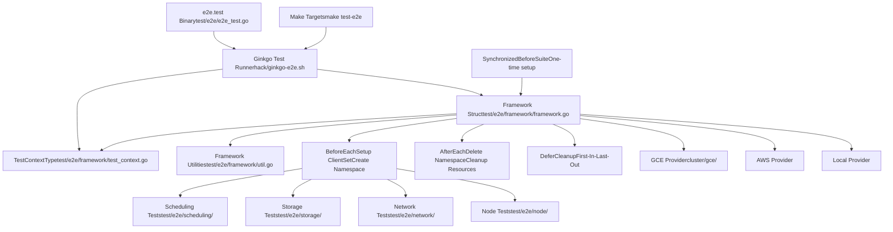
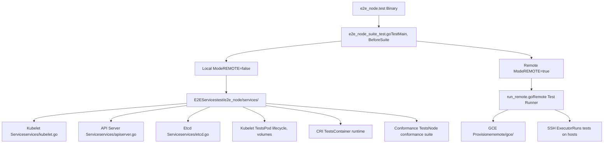
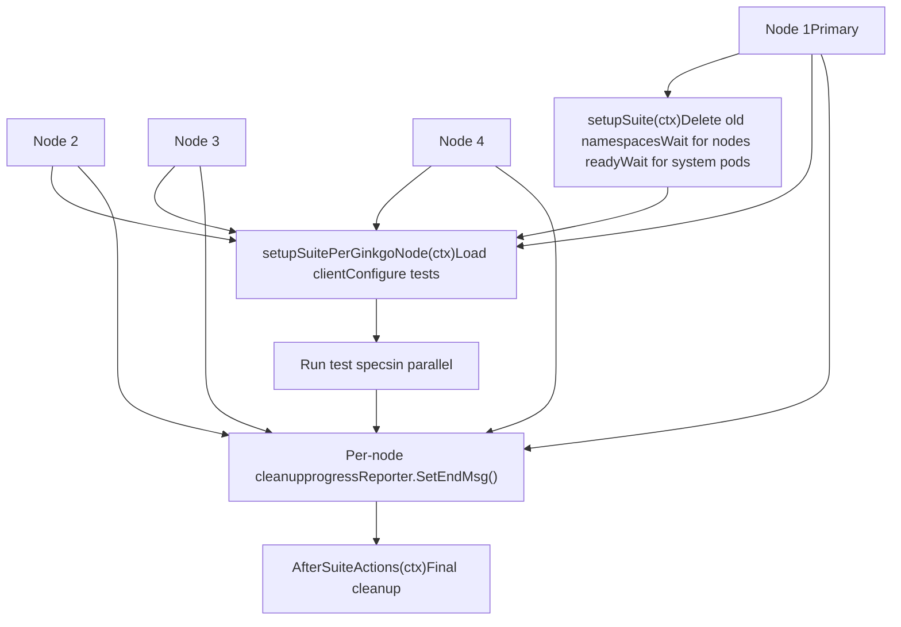

# Testing Infrastructure

Relevant source files

-   [build/root/Makefile](https://github.com/kubernetes/kubernetes/blob/2757a872/build/root/Makefile)
-   [hack/ginkgo-e2e.sh](https://github.com/kubernetes/kubernetes/blob/2757a872/hack/ginkgo-e2e.sh)
-   [hack/lib/init.sh](https://github.com/kubernetes/kubernetes/blob/2757a872/hack/lib/init.sh)
-   [hack/local-up-cluster.sh](https://github.com/kubernetes/kubernetes/blob/2757a872/hack/local-up-cluster.sh)
-   [hack/make-rules/test-e2e-node.sh](https://github.com/kubernetes/kubernetes/blob/2757a872/hack/make-rules/test-e2e-node.sh)
-   [test/e2e/chaosmonkey/chaosmonkey.go](https://github.com/kubernetes/kubernetes/blob/2757a872/test/e2e/chaosmonkey/chaosmonkey.go)
-   [test/e2e/e2e.go](https://github.com/kubernetes/kubernetes/blob/2757a872/test/e2e/e2e.go)
-   [test/e2e/e2e\_test.go](https://github.com/kubernetes/kubernetes/blob/2757a872/test/e2e/e2e_test.go)
-   [test/e2e/framework/framework.go](https://github.com/kubernetes/kubernetes/blob/2757a872/test/e2e/framework/framework.go)
-   [test/e2e/framework/kubelet/kubelet\_pods.go](https://github.com/kubernetes/kubernetes/blob/2757a872/test/e2e/framework/kubelet/kubelet_pods.go)
-   [test/e2e/framework/kubelet/stats.go](https://github.com/kubernetes/kubernetes/blob/2757a872/test/e2e/framework/kubelet/stats.go)
-   [test/e2e/framework/test\_context.go](https://github.com/kubernetes/kubernetes/blob/2757a872/test/e2e/framework/test_context.go)
-   [test/e2e/framework/util.go](https://github.com/kubernetes/kubernetes/blob/2757a872/test/e2e/framework/util.go)
-   [test/e2e/reporters/progress.go](https://github.com/kubernetes/kubernetes/blob/2757a872/test/e2e/reporters/progress.go)
-   [test/e2e/scheduling/framework.go](https://github.com/kubernetes/kubernetes/blob/2757a872/test/e2e/scheduling/framework.go)
-   [test/e2e/scheduling/limit\_range.go](https://github.com/kubernetes/kubernetes/blob/2757a872/test/e2e/scheduling/limit_range.go)
-   [test/e2e/scheduling/predicates.go](https://github.com/kubernetes/kubernetes/blob/2757a872/test/e2e/scheduling/predicates.go)
-   [test/e2e/scheduling/preemption.go](https://github.com/kubernetes/kubernetes/blob/2757a872/test/e2e/scheduling/preemption.go)
-   [test/e2e/scheduling/priorities.go](https://github.com/kubernetes/kubernetes/blob/2757a872/test/e2e/scheduling/priorities.go)
-   [test/e2e/scheduling/ubernetes\_lite.go](https://github.com/kubernetes/kubernetes/blob/2757a872/test/e2e/scheduling/ubernetes_lite.go)
-   [test/e2e/suites.go](https://github.com/kubernetes/kubernetes/blob/2757a872/test/e2e/suites.go)
-   [test/e2e\_kubeadm/e2e\_kubeadm\_suite\_test.go](https://github.com/kubernetes/kubernetes/blob/2757a872/test/e2e_kubeadm/e2e_kubeadm_suite_test.go)
-   [test/e2e\_node/builder/build.go](https://github.com/kubernetes/kubernetes/blob/2757a872/test/e2e_node/builder/build.go)
-   [test/e2e\_node/conformance/run\_test.sh](https://github.com/kubernetes/kubernetes/blob/2757a872/test/e2e_node/conformance/run_test.sh)
-   [test/e2e\_node/e2e\_node\_suite\_test.go](https://github.com/kubernetes/kubernetes/blob/2757a872/test/e2e_node/e2e_node_suite_test.go)
-   [test/e2e\_node/kubeletconfig/kubeletconfig.go](https://github.com/kubernetes/kubernetes/blob/2757a872/test/e2e_node/kubeletconfig/kubeletconfig.go)
-   [test/e2e\_node/remote/cadvisor\_e2e.go](https://github.com/kubernetes/kubernetes/blob/2757a872/test/e2e_node/remote/cadvisor_e2e.go)
-   [test/e2e\_node/remote/node\_conformance.go](https://github.com/kubernetes/kubernetes/blob/2757a872/test/e2e_node/remote/node_conformance.go)
-   [test/e2e\_node/remote/node\_e2e.go](https://github.com/kubernetes/kubernetes/blob/2757a872/test/e2e_node/remote/node_e2e.go)
-   [test/e2e\_node/remote/remote.go](https://github.com/kubernetes/kubernetes/blob/2757a872/test/e2e_node/remote/remote.go)
-   [test/e2e\_node/remote/types.go](https://github.com/kubernetes/kubernetes/blob/2757a872/test/e2e_node/remote/types.go)
-   [test/e2e\_node/remote/utils.go](https://github.com/kubernetes/kubernetes/blob/2757a872/test/e2e_node/remote/utils.go)
-   [test/e2e\_node/runner/local/run\_local.go](https://github.com/kubernetes/kubernetes/blob/2757a872/test/e2e_node/runner/local/run_local.go)
-   [test/e2e\_node/runner/remote/run\_remote.go](https://github.com/kubernetes/kubernetes/blob/2757a872/test/e2e_node/runner/remote/run_remote.go)
-   [test/e2e\_node/services/kubelet.go](https://github.com/kubernetes/kubernetes/blob/2757a872/test/e2e_node/services/kubelet.go)
-   [test/e2e\_node/services/server.go](https://github.com/kubernetes/kubernetes/blob/2757a872/test/e2e_node/services/server.go)
-   [test/e2e\_node/services/services.go](https://github.com/kubernetes/kubernetes/blob/2757a872/test/e2e_node/services/services.go)
-   [test/e2e\_node/services/util.go](https://github.com/kubernetes/kubernetes/blob/2757a872/test/e2e_node/services/util.go)
-   [test/utils/paths.go](https://github.com/kubernetes/kubernetes/blob/2757a872/test/utils/paths.go)

## Purpose and Scope

This document describes the testing infrastructure used to validate Kubernetes functionality through end-to-end (E2E) tests and node-level tests. The testing infrastructure provides frameworks, utilities, and execution modes for running tests against Kubernetes clusters, both locally and remotely.

For information about the build system that compiles test binaries, see [Build and Release Process](/kubernetes/kubernetes/7.2-build-and-release-process). For cluster provisioning used during testing, see [Local Development Environment](/kubernetes/kubernetes/5.3-local-development-environment) and [GCE Cluster Provisioning](/kubernetes/kubernetes/5.2-gce-cluster-provisioning).

---

## E2E Testing Framework Overview

The E2E testing infrastructure is built on top of the [Ginkgo](https://onsi.github.io/ginkgo/) testing framework and provides a comprehensive suite of tests that validate Kubernetes functionality across all major components. The framework includes test lifecycle management, configuration handling, resource cleanup, and integration with various cloud providers.

### Architecture


**Sources:** [test/e2e/e2e.go1-257](https://github.com/kubernetes/kubernetes/blob/2757a872/test/e2e/e2e.go#L1-L257) [test/e2e/framework/framework.go1-153](https://github.com/kubernetes/kubernetes/blob/2757a872/test/e2e/framework/framework.go#L1-L153) [test/e2e/framework/test\_context.go1-99](https://github.com/kubernetes/kubernetes/blob/2757a872/test/e2e/framework/test_context.go#L1-L99)

---

## Framework Struct and Test Lifecycle

### Framework Struct

The `Framework` struct is the central component that provides test infrastructure. Each test suite creates a `Framework` instance that manages the test's lifecycle, resources, and cleanup.

| Field | Type | Purpose |
| --- | --- | --- |
| `BaseName` | `string` | Base name for generated resources |
| `UniqueName` | `string` | Unique identifier for test run |
| `ClientSet` | `clientset.Interface` | Kubernetes API client |
| `DynamicClient` | `dynamic.Interface` | Dynamic resource client |
| `Namespace` | `*v1.Namespace` | Test namespace |
| `namespacesToDelete` | `[]*v1.Namespace` | Namespaces to clean up |
| `Timeouts` | `*TimeoutContext` | Configurable test timeouts |
| `SkipNamespaceCreation` | `bool` | Whether to skip namespace creation |

**Sources:** [test/e2e/framework/framework.go92-153](https://github.com/kubernetes/kubernetes/blob/2757a872/test/e2e/framework/framework.go#L92-L153)

### Test Lifecycle Execution Flow

> **[Mermaid sequence]**
> *(图表结构无法解析)*

**Sources:** [test/e2e/framework/framework.go310-394](https://github.com/kubernetes/kubernetes/blob/2757a872/test/e2e/framework/framework.go#L310-L394) [test/e2e/framework/framework.go452-519](https://github.com/kubernetes/kubernetes/blob/2757a872/test/e2e/framework/framework.go#L452-L519)

### Framework Initialization

The framework initialization process creates clients and prepares the test environment:

**NewDefaultFramework:**

-   Creates a `Framework` instance with default settings (QPS=20, Burst=50)
-   Registers `BeforeEach` hook for setup
-   Calls `NewFrameworkExtensions` to allow customization
-   Returns framework instance

**BeforeEach (per test):**

1.  Set `f.TB = ginkgo.GinkgoT()` to enable test context
2.  Register `DeferCleanup` for `AfterEach` (runs last)
3.  Register `DeferCleanup` for `dumpNamespaceInfo` (runs before AfterEach)
4.  Load kubeconfig via `LoadConfig()` [test/e2e/framework/util.go432-474](https://github.com/kubernetes/kubernetes/blob/2757a872/test/e2e/framework/util.go#L432-L474)
5.  Create `ClientSet` from config
6.  Create `DynamicClient` and `ScalesGetter`
7.  Call provider-specific setup: `TestContext.CloudConfig.Provider.FrameworkBeforeEach(f)`
8.  Create namespace if `!SkipNamespaceCreation`
9.  Wait for default service account and kube-root-ca ConfigMap

**Sources:** [test/e2e/framework/framework.go289-308](https://github.com/kubernetes/kubernetes/blob/2757a872/test/e2e/framework/framework.go#L289-L308) [test/e2e/framework/framework.go310-394](https://github.com/kubernetes/kubernetes/blob/2757a872/test/e2e/framework/framework.go#L310-L394)

---

## TestContext Configuration

The `TestContext` global variable holds all test configuration, including cluster connection details, provider settings, and test behavior flags.

### TestContextType Structure

```mermaid
flowchart TD
    KC["KubeConfigPath to kubeconfig"]
    Host["HostAPI server address"]
    BT["BearerTokenAuth token"]
    Provider["Providergce, gke, aws, local"]
    CloudConfig["CloudConfigProvider-specific settings"]
    DeleteNS["DeleteNamespaceCleanup after test"]
    DumpLogs["DumpLogsOnFailureGather logs on failure"]
    Timeouts["timeoutsOperation timeouts"]
    NodeE2E["NodeE2ERunning node tests"]
    NodeName["NodeNameTarget node"]
    NodeConformance["NodeConformanceConformance mode"]
    ReportDir["ReportDirTest results location"]
    OutputDir["OutputDirArtifacts location"]
    TestContext["TestContextTypeGlobal Configuration"]

    TestContext --> KC
    TestContext --> Host
    TestContext --> BT
    TestContext --> Provider
    TestContext --> CloudConfig
    TestContext --> DeleteNS
    TestContext --> DumpLogs
    TestContext --> Timeouts
    TestContext --> NodeE2E
    TestContext --> NodeName
    TestContext --> NodeConformance
    TestContext --> ReportDir
    TestContext --> OutputDir
```


**Sources:** [test/e2e/framework/test\_context.go71-225](https://github.com/kubernetes/kubernetes/blob/2757a872/test/e2e/framework/test_context.go#L71-L225)

### Key Configuration Fields

| Category | Field | Default | Purpose |
| --- | --- | --- | --- |
| **Connection** | `KubeConfig` | `$KUBECONFIG` | Path to kubeconfig file |
|  | `Host` | `https://127.0.0.1:6443` | API server URL |
| **Provider** | `Provider` | `""` | Cloud provider (gce, gke, aws, local) |
|  | `CloudConfig.NumNodes` | `-1` (auto-detect) | Number of cluster nodes |
| **Cleanup** | `DeleteNamespace` | `true` | Delete test namespaces after tests |
|  | `DeleteNamespaceOnFailure` | `true` | Delete namespaces even on failure |
| **Logging** | `DumpLogsOnFailure` | `true` | Collect logs when tests fail |
|  | `DisableLogDump` | `false` | Disable log collection entirely |
| **Node E2E** | `NodeE2E` | `false` | Running node E2E tests |
|  | `NodeConformance` | `false` | Node conformance test mode |
|  | `ContainerRuntimeEndpoint` | `unix:///run/containerd/containerd.sock` | CRI endpoint |

**Sources:** [test/e2e/framework/test\_context.go99-225](https://github.com/kubernetes/kubernetes/blob/2757a872/test/e2e/framework/test_context.go#L99-L225) [test/e2e/framework/test\_context.go320-367](https://github.com/kubernetes/kubernetes/blob/2757a872/test/e2e/framework/test_context.go#L320-L367)

### Flag Registration

Tests register flags in two phases:

1.  **Common flags** (all tests): [test/e2e/framework/test\_context.go320-367](https://github.com/kubernetes/kubernetes/blob/2757a872/test/e2e/framework/test_context.go#L320-L367)

    -   `--kubeconfig`, `--host`, `--report-dir`
    -   `--delete-namespace`, `--dump-logs-on-failure`
    -   `--max-nodes-to-gather-from`, `--gather-resource-usage`
2.  **Cluster flags** (cluster E2E): [test/e2e/framework/test\_context.go382-432](https://github.com/kubernetes/kubernetes/blob/2757a872/test/e2e/framework/test_context.go#L382-L432)

    -   `--provider`, `--gce-project`, `--gce-zone`
    -   `--num-nodes`, `--node-os-distro`
3.  **Node flags** (node E2E): [test/e2e\_node/e2e\_node\_suite\_test.go88-109](https://github.com/kubernetes/kubernetes/blob/2757a872/test/e2e_node/e2e_node_suite_test.go#L88-L109)

    -   `--node-name`, `--bearer-token`
    -   `--conformance`, `--restart-kubelet`

**Sources:** [test/e2e/framework/test\_context.go320-432](https://github.com/kubernetes/kubernetes/blob/2757a872/test/e2e/framework/test_context.go#L320-L432) [test/e2e\_node/e2e\_node\_suite\_test.go88-109](https://github.com/kubernetes/kubernetes/blob/2757a872/test/e2e_node/e2e_node_suite_test.go#L88-L109)

---

## Node E2E Testing

Node E2E tests validate kubelet and container runtime behavior on individual nodes. These tests can run locally on a single node or remotely on provisioned instances.

### Node Test Architecture


**Sources:** [test/e2e\_node/e2e\_node\_suite\_test.go1-70](https://github.com/kubernetes/kubernetes/blob/2757a872/test/e2e_node/e2e_node_suite_test.go#L1-L70) [test/e2e\_node/services/services.go1-200](https://github.com/kubernetes/kubernetes/blob/2757a872/test/e2e_node/services/services.go#L1-L200)

### Local Execution Mode

In local mode, the test framework starts kubelet and required services (etcd, API server) directly on the test machine.

**Process:**

1.  **BeforeSuite** sets `runServicesMode` or `runKubeletMode` flags
2.  `E2EServices` struct manages service lifecycle [test/e2e\_node/services/services.go42-91](https://github.com/kubernetes/kubernetes/blob/2757a872/test/e2e_node/services/services.go#L42-L91)
3.  Services started in order:
    -   Etcd via `startEtcd()` [test/e2e\_node/services/etcd.go](https://github.com/kubernetes/kubernetes/blob/2757a872/test/e2e_node/services/etcd.go)
    -   API Server via `startAPIServer()` [test/e2e\_node/services/apiserver.go](https://github.com/kubernetes/kubernetes/blob/2757a872/test/e2e_node/services/apiserver.go)
    -   Kubelet via `startKubelet()` [test/e2e\_node/services/kubelet.go78-90](https://github.com/kubernetes/kubernetes/blob/2757a872/test/e2e_node/services/kubelet.go#L78-L90)
4.  Tests execute against local services
5.  **AfterSuite** stops services via `e2es.Stop()`

**Kubelet Startup:**

```
Command: ${KUBE_ROOT}/_output/bin/kubelet
Args:
  --root-dir=/var/lib/kubelet
  --v=4
  --container-runtime-endpoint=${CONTAINER_RUNTIME_ENDPOINT}
  --kubeconfig=${KUBECONFIG}
  --config=${KUBELET_CONFIG_FILE}
  --feature-gates=${FEATURE_GATES}
  [additional flags from --kubelet-flags]
```
**Sources:** [test/e2e\_node/services/kubelet.go92-280](https://github.com/kubernetes/kubernetes/blob/2757a872/test/e2e_node/services/kubelet.go#L92-L280) [test/e2e\_node/services/services.go42-91](https://github.com/kubernetes/kubernetes/blob/2757a872/test/e2e_node/services/services.go#L42-L91) [test/e2e\_node/e2e\_node\_suite\_test.go180-334](https://github.com/kubernetes/kubernetes/blob/2757a872/test/e2e_node/e2e_node_suite_test.go#L180-L334)

### Remote Execution Mode

Remote mode provisions test instances on cloud providers (GCE, AWS) or connects to existing hosts via SSH, then runs tests on those remote nodes.

**Execution Flow:**

> **[Mermaid sequence]**
> *(图表结构无法解析)*

**Sources:** [test/e2e\_node/remote/remote.go1-400](https://github.com/kubernetes/kubernetes/blob/2757a872/test/e2e_node/remote/remote.go#L1-L400) [hack/make-rules/test-e2e-node.sh1-270](https://github.com/kubernetes/kubernetes/blob/2757a872/hack/make-rules/test-e2e-node.sh#L1-L270)

### Remote Test Runner Implementation

The remote runner coordinates test execution across multiple hosts in parallel:

**Key Components:**

1.  **RemoteRunner** interface [test/e2e\_node/remote/remote.go33-46](https://github.com/kubernetes/kubernetes/blob/2757a872/test/e2e_node/remote/remote.go#L33-L46)

    -   `Validate()` - Check prerequisites
    -   `StartTests(suite TestSuite, ...)` - Execute tests
    -   `Cleanup()` - Remove artifacts
2.  **Test Suite Types** [test/e2e\_node/remote/node\_e2e.go35-37](https://github.com/kubernetes/kubernetes/blob/2757a872/test/e2e_node/remote/node_e2e.go#L35-L37)

    -   `NodeE2ERemote` - Standard node E2E tests
    -   `NodeConformanceRemote` - Conformance tests
    -   `NodeSoakRemote` - Long-running stability tests
3.  **Archive Creation** [test/e2e\_node/remote/remote.go111-167](https://github.com/kubernetes/kubernetes/blob/2757a872/test/e2e_node/remote/remote.go#L111-L167)

    -   Builds `e2e_node_test.tar.gz` containing:
        -   `e2e_node.test` binary
        -   `ginkgo` test runner
        -   CNI plugins
        -   Test configuration files

**Parallelization:** The runner executes tests on multiple hosts concurrently using goroutines [test/e2e\_node/remote/remote.go200-350](https://github.com/kubernetes/kubernetes/blob/2757a872/test/e2e_node/remote/remote.go#L200-L350):

```
for each host:
  goroutine:
    1. SSH connect
    2. SCP test archive
    3. Extract archive
    4. Run ginkgo e2e_node.test
    5. Collect results
    6. SCP results back
    7. Cleanup (if enabled)
```
**Sources:** [test/e2e\_node/remote/remote.go33-400](https://github.com/kubernetes/kubernetes/blob/2757a872/test/e2e_node/remote/remote.go#L33-L400) [test/e2e\_node/remote/node\_e2e.go35-180](https://github.com/kubernetes/kubernetes/blob/2757a872/test/e2e_node/remote/node_e2e.go#L35-L180) [hack/make-rules/test-e2e-node.sh217-223](https://github.com/kubernetes/kubernetes/blob/2757a872/hack/make-rules/test-e2e-node.sh#L217-L223)

---

## Test Execution and Build Integration

### Make Targets for Testing

The root Makefile provides several targets for running tests:

| Target | Purpose | Implementation |
| --- | --- | --- |
| `test` / `check` | Run unit tests | [build/root/Makefile186-193](https://github.com/kubernetes/kubernetes/blob/2757a872/build/root/Makefile#L186-L193) |
| `test-integration` | Run integration tests | [build/root/Makefile208-216](https://github.com/kubernetes/kubernetes/blob/2757a872/build/root/Makefile#L208-L216) |
| `test-e2e-node` | Run node E2E tests | [build/root/Makefile286-293](https://github.com/kubernetes/kubernetes/blob/2757a872/build/root/Makefile#L286-L293) |
| `test-cmd` | Run kubectl command tests | [build/root/Makefile305-312](https://github.com/kubernetes/kubernetes/blob/2757a872/build/root/Makefile#L305-L312) |
| `ginkgo` | Build ginkgo binary | [build/root/Makefile106-113](https://github.com/kubernetes/kubernetes/blob/2757a872/build/root/Makefile#L106-L113) |

**Sources:** [build/root/Makefile1-517](https://github.com/kubernetes/kubernetes/blob/2757a872/build/root/Makefile#L1-L517)

### E2E Test Execution Scripts

**hack/ginkgo-e2e.sh** - Main E2E test runner:

```
# Usage: hack/ginkgo-e2e.sh# Key steps:1. Find ginkgo and e2e.test binaries2. Load cluster configuration (kube-util.sh)3. Detect Kubernetes master from kubeconfig4. Set up authentication (--kubeconfig)5. Configure provider-specific settings6. Build ginkgo command with flags:   --focus="${GINKGO_FOCUS}"   --skip="${GINKGO_SKIP}"   --nodes="${GINKGO_PARALLEL_NODES}"7. Execute: ${ginkgo} ${ginkgoflags} ${e2e_test} -- ${test_args}
```
**Environment Variables:**

-   `GINKGO_PARALLEL=y` - Run tests in parallel
-   `GINKGO_FOCUS` - Regex to select tests
-   `GINKGO_SKIP` - Regex to skip tests
-   `KUBERNETES_PROVIDER` - Cloud provider (gce, aws, local)

**Sources:** [hack/ginkgo-e2e.sh1-200](https://github.com/kubernetes/kubernetes/blob/2757a872/hack/ginkgo-e2e.sh#L1-L200)

**hack/make-rules/test-e2e-node.sh** - Node E2E test runner:

```
# Usage: hack/make-rules/test-e2e-node.sh# Execution modes:1. Local mode (REMOTE=false):   - Build e2e_node.test binary   - Run directly: ${e2e_node_test} --ginkgo.focus="${focus}" 2. Remote mode (REMOTE=true, REMOTE_MODE=gce):   - Build test archive   - Provision GCE instances or use existing hosts   - Run via: go run test/e2e_node/runner/remote/run_remote.go   3. Remote mode (REMOTE=true, REMOTE_MODE=ssh):   - Use provided SSH hosts   - Execute tests over SSH
```
**Key Parameters:**

-   `FOCUS` - Test focus regex (default: "")
-   `SKIP` - Test skip regex (default: "\[Flaky\]|\[Slow\]|\[Serial\]")
-   `PARALLELISM` - Number of parallel test nodes (default: 8)
-   `REMOTE` - Run on remote hosts (default: false)
-   `IMAGES` - GCE images to provision
-   `HOSTS` - Existing hosts to test

**Sources:** [hack/make-rules/test-e2e-node.sh1-270](https://github.com/kubernetes/kubernetes/blob/2757a872/hack/make-rules/test-e2e-node.sh#L1-L270)

### Test Binary Compilation

E2E tests are compiled into standalone test binaries:

**e2e.test** - Cluster E2E tests:

```
# Build command:make WHAT=test/e2e/e2e.test # Binary location:_output/bin/e2e.test # Entry point:test/e2e/e2e_test.go - TestE2E(t *testing.T)
```
**e2e\_node.test** - Node E2E tests:

```
# Build command:make WHAT=test/e2e_node/e2e_node.test # Binary location:_output/bin/e2e_node.test # Entry point:test/e2e_node/e2e_node_suite_test.go - TestE2eNode(t *testing.T)
```
The test binaries include:

1.  Ginkgo test specs (It, Describe blocks)
2.  Framework initialization code
3.  Test utilities and helpers
4.  Provider integration code

**Sources:** [test/e2e/e2e\_test.go1-150](https://github.com/kubernetes/kubernetes/blob/2757a872/test/e2e/e2e_test.go#L1-L150) [test/e2e\_node/e2e\_node\_suite\_test.go1-300](https://github.com/kubernetes/kubernetes/blob/2757a872/test/e2e_node/e2e_node_suite_test.go#L1-L300)

---

## Suite Setup and Teardown

### SynchronizedBeforeSuite and SynchronizedAfterSuite

E2E tests use Ginkgo's synchronized suite setup to perform one-time initialization:


**Sources:** [test/e2e/e2e.go69-84](https://github.com/kubernetes/kubernetes/blob/2757a872/test/e2e/e2e.go#L69-L84)

### setupSuite Implementation

The `setupSuite` function runs once on the first Ginkgo node:

**Steps:**

1.  **Log cluster image sources** (GCE only) [test/e2e/e2e.go258-278](https://github.com/kubernetes/kubernetes/blob/2757a872/test/e2e/e2e.go#L258-L278)
2.  **Load client**: `framework.LoadClientset()`
3.  **Delete orphaned namespaces** if `CleanStart=true` [test/e2e/e2e.go190-204](https://github.com/kubernetes/kubernetes/blob/2757a872/test/e2e/e2e.go#L190-L204)
    -   Deletes all namespaces except: `kube-system`, `default`, `kube-public`, `kube-node-lease`
    -   Waits up to 15 minutes for deletion
4.  **Wait for nodes schedulable**: `e2enode.WaitForAllNodesSchedulable()` [test/e2e/e2e.go211](https://github.com/kubernetes/kubernetes/blob/2757a872/test/e2e/e2e.go#L211-L211)
5.  **Auto-detect node count** if not specified [test/e2e/e2e.go214-218](https://github.com/kubernetes/kubernetes/blob/2757a872/test/e2e/e2e.go#L214-L218)
6.  **Wait for system pods ready**: `e2epod.WaitForAlmostAllPodsReady()` [test/e2e/e2e.go229-233](https://github.com/kubernetes/kubernetes/blob/2757a872/test/e2e/e2e.go#L229-L233)
    -   Allows for `AllowedNotReadyNodes` to be not ready
    -   Timeout: `SystemPodsStartup` (default: 10 minutes)
7.  **Wait for DaemonSets ready**: `waitForDaemonSets()` [test/e2e/e2e.go235-237](https://github.com/kubernetes/kubernetes/blob/2757a872/test/e2e/e2e.go#L235-L237)
8.  **Prepull images** if `PrepullImages=true` [test/e2e/e2e.go239-242](https://github.com/kubernetes/kubernetes/blob/2757a872/test/e2e/e2e.go#L239-L242)
9.  **Log server version** [test/e2e/e2e.go245-255](https://github.com/kubernetes/kubernetes/blob/2757a872/test/e2e/e2e.go#L245-L255)

**Sources:** [test/e2e/e2e.go177-256](https://github.com/kubernetes/kubernetes/blob/2757a872/test/e2e/e2e.go#L177-L256)

---

## Framework Utilities and Helpers

The framework provides numerous utility functions for common test operations:

### Namespace Management

| Function | Purpose | Location |
| --- | --- | --- |
| `CreateTestingNS()` | Create namespace with e2e-run label | [test/e2e/framework/util.go323-371](https://github.com/kubernetes/kubernetes/blob/2757a872/test/e2e/framework/util.go#L323-L371) |
| `DeleteNamespaces()` | Delete namespaces matching filter | [test/e2e/framework/util.go191-227](https://github.com/kubernetes/kubernetes/blob/2757a872/test/e2e/framework/util.go#L191-L227) |
| `WaitForNamespacesDeleted()` | Wait for namespace deletion | [test/e2e/framework/util.go230-250](https://github.com/kubernetes/kubernetes/blob/2757a872/test/e2e/framework/util.go#L230-L250) |
| `CheckTestingNSDeletedExcept()` | Verify old test namespaces deleted | [test/e2e/framework/util.go375-410](https://github.com/kubernetes/kubernetes/blob/2757a872/test/e2e/framework/util.go#L375-L410) |

### Client and Config Loading

| Function | Purpose | Location |
| --- | --- | --- |
| `LoadConfig()` | Load REST config from kubeconfig | [test/e2e/framework/util.go433-474](https://github.com/kubernetes/kubernetes/blob/2757a872/test/e2e/framework/util.go#L433-L474) |
| `LoadClientset()` | Create clientset from config | [test/e2e/framework/util.go477-483](https://github.com/kubernetes/kubernetes/blob/2757a872/test/e2e/framework/util.go#L477-L483) |
| `restclientConfig()` | Parse kubeconfig file | [test/e2e/framework/util.go413-427](https://github.com/kubernetes/kubernetes/blob/2757a872/test/e2e/framework/util.go#L413-L427) |

**LoadConfig() behavior:**

-   Uses `TestContext.KubeConfig` path (default: `$KUBECONFIG`)
-   Falls back to `InClusterConfig()` if no kubeconfig specified
-   Sets `UserAgent` to include current test name from Ginkgo
-   For node E2E: uses `TestContext.Host` and `BearerToken` directly

**Sources:** [test/e2e/framework/util.go433-483](https://github.com/kubernetes/kubernetes/blob/2757a872/test/e2e/framework/util.go#L433-L483)

### Command Execution

| Function | Purpose | Location |
| --- | --- | --- |
| `RunCmd()` | Execute command and return stdout/stderr | [test/e2e/framework/util.go554-580](https://github.com/kubernetes/kubernetes/blob/2757a872/test/e2e/framework/util.go#L554-L580) |
| `RunCmdEnv()` | Execute command with custom environment | [test/e2e/framework/util.go561-580](https://github.com/kubernetes/kubernetes/blob/2757a872/test/e2e/framework/util.go#L561-L580) |
| `StartCmdAndStreamOutput()` | Start command asynchronously | [test/e2e/framework/util.go491-505](https://github.com/kubernetes/kubernetes/blob/2757a872/test/e2e/framework/util.go#L491-L505) |
| `TryKill()` | Send kill signal to process | [test/e2e/framework/util.go508-512](https://github.com/kubernetes/kubernetes/blob/2757a872/test/e2e/framework/util.go#L508-L512) |

### Log Collection

**CoreDump()** - Collect cluster logs after test failure [test/e2e/framework/util.go522-545](https://github.com/kubernetes/kubernetes/blob/2757a872/test/e2e/framework/util.go#L522-L545):

```
# Executes: cluster/log-dump/log-dump.sh# Collects:- Kubelet logs- Container runtime logs- Kernel logs (dmesg)- Systemd journal (if enabled) # Upload to GCS if LogexporterGCSPath set
```
**Environment variables:**

-   `LOG_DUMP_SYSTEMD_SERVICES` - Services to dump logs from
-   `LOG_DUMP_SYSTEMD_JOURNAL` - Whether to dump full journal

**Sources:** [test/e2e/framework/util.go522-550](https://github.com/kubernetes/kubernetes/blob/2757a872/test/e2e/framework/util.go#L522-L550)

---

## Test Selection and Filtering

Tests can be filtered using multiple mechanisms:

### Ginkgo Focus and Skip

**Via command line:**

```
# Run only tests matching patternginkgo --focus="Scheduler.*preemption" e2e.test # Skip tests matching patternginkgo --skip="\[Slow\]|\[Flaky\]" e2e.test # Combine focus and skipginkgo --focus="Scheduling" --skip="\[Serial\]" e2e.test
```
**Via environment variables:**

```
GINKGO_FOCUS="Scheduler" make test-e2eGINKGO_SKIP="\[Flaky\]" make test-e2e
```
**Sources:** [hack/ginkgo-e2e.sh34-36](https://github.com/kubernetes/kubernetes/blob/2757a872/hack/ginkgo-e2e.sh#L34-L36) [hack/make-rules/test-e2e-node.sh30-36](https://github.com/kubernetes/kubernetes/blob/2757a872/hack/make-rules/test-e2e-node.sh#L30-L36)

### Label Filters

Ginkgo v2 supports label-based filtering:

```
# Run conformance tests onlyginkgo --label-filter="Conformance" e2e.test # Run non-slow testsginkgo --label-filter="!Slow" e2e.test # Complex expressionsginkgo --label-filter="(Feature:Storage || Feature:Network) && !Flaky" e2e.test
```
**Common labels in Kubernetes tests:**

-   `Conformance` - Tests that must pass for conformance certification
-   `Flaky` - Tests with known reliability issues
-   `Slow` - Tests that take significant time
-   `Serial` - Tests that cannot run in parallel
-   `Feature:<name>` - Tests for specific features

**Sources:** [test/e2e/framework/test\_context.go352-353](https://github.com/kubernetes/kubernetes/blob/2757a872/test/e2e/framework/test_context.go#L352-L353) [hack/make-rules/test-e2e-node.sh31-33](https://github.com/kubernetes/kubernetes/blob/2757a872/hack/make-rules/test-e2e-node.sh#L31-L33)

### Default Filters

When no filter is specified, E2E tests apply default skips [test/e2e/framework/test\_context.go369-378](https://github.com/kubernetes/kubernetes/blob/2757a872/test/e2e/framework/test_context.go#L369-L378):

```
if len(suiteConfig.FocusStrings) == 0 &&    len(suiteConfig.SkipStrings) == 0 &&    suiteConfig.LabelFilter == "" {    // Skip flaky and feature-gated tests by default    suiteConfig.SkipStrings = []string{`\[Flaky\]|\[Feature:.+\]`}}
```
**Sources:** [test/e2e/framework/test\_context.go369-378](https://github.com/kubernetes/kubernetes/blob/2757a872/test/e2e/framework/test_context.go#L369-L378)

---

## Integration with Local Development

The testing infrastructure integrates with local cluster setup for development testing:

**local-up-cluster.sh** provides a local Kubernetes cluster:

-   Starts etcd, API server, controller-manager, scheduler
-   Optionally starts kubelet and kube-proxy
-   Configures networking (DNS, CNI)
-   Creates admin kubeconfig at `${CERT_DIR}/admin.kubeconfig`

**Running E2E tests against local cluster:**

```
# Start local clusterhack/local-up-cluster.sh # In another terminal, run E2E testsexport KUBECONFIG=/var/run/kubernetes/admin.kubeconfigexport KUBERNETES_PROVIDER=localhack/ginkgo-e2e.sh --ginkgo.focus="Scheduler"
```
**Sources:** [hack/local-up-cluster.sh1-1200](https://github.com/kubernetes/kubernetes/blob/2757a872/hack/local-up-cluster.sh#L1-L1200)

---

## Summary of Key Components

| Component | File Path | Purpose |
| --- | --- | --- |
| **Framework** | `test/e2e/framework/framework.go` | Core test framework, lifecycle management |
| **TestContext** | `test/e2e/framework/test_context.go` | Global configuration, flags |
| **Utilities** | `test/e2e/framework/util.go` | Helper functions (namespace, client, commands) |
| **E2E Suite** | `test/e2e/e2e.go` | Cluster E2E test setup and teardown |
| **Node Suite** | `test/e2e_node/e2e_node_suite_test.go` | Node E2E test setup |
| **E2E Runner** | `hack/ginkgo-e2e.sh` | Script to execute cluster E2E tests |
| **Node Runner** | `hack/make-rules/test-e2e-node.sh` | Script to execute node E2E tests |
| **Remote Runner** | `test/e2e_node/runner/remote/run_remote.go` | Remote test execution coordinator |
| **Kubelet Service** | `test/e2e_node/services/kubelet.go` | Kubelet startup for local node tests |
| **Build Targets** | `build/root/Makefile` | Make targets for building and running tests |

**Sources:** All files listed in table above
