# E2E Testing Framework

Relevant source files

-   [build/root/Makefile](https://github.com/kubernetes/kubernetes/blob/2757a872/build/root/Makefile)
-   [hack/ginkgo-e2e.sh](https://github.com/kubernetes/kubernetes/blob/2757a872/hack/ginkgo-e2e.sh)
-   [hack/lib/init.sh](https://github.com/kubernetes/kubernetes/blob/2757a872/hack/lib/init.sh)
-   [hack/local-up-cluster.sh](https://github.com/kubernetes/kubernetes/blob/2757a872/hack/local-up-cluster.sh)
-   [hack/make-rules/test-e2e-node.sh](https://github.com/kubernetes/kubernetes/blob/2757a872/hack/make-rules/test-e2e-node.sh)
-   [test/e2e/chaosmonkey/chaosmonkey.go](https://github.com/kubernetes/kubernetes/blob/2757a872/test/e2e/chaosmonkey/chaosmonkey.go)
-   [test/e2e/e2e.go](https://github.com/kubernetes/kubernetes/blob/2757a872/test/e2e/e2e.go)
-   [test/e2e/e2e\_test.go](https://github.com/kubernetes/kubernetes/blob/2757a872/test/e2e/e2e_test.go)
-   [test/e2e/framework/framework.go](https://github.com/kubernetes/kubernetes/blob/2757a872/test/e2e/framework/framework.go)
-   [test/e2e/framework/kubelet/kubelet\_pods.go](https://github.com/kubernetes/kubernetes/blob/2757a872/test/e2e/framework/kubelet/kubelet_pods.go)
-   [test/e2e/framework/kubelet/stats.go](https://github.com/kubernetes/kubernetes/blob/2757a872/test/e2e/framework/kubelet/stats.go)
-   [test/e2e/framework/test\_context.go](https://github.com/kubernetes/kubernetes/blob/2757a872/test/e2e/framework/test_context.go)
-   [test/e2e/framework/util.go](https://github.com/kubernetes/kubernetes/blob/2757a872/test/e2e/framework/util.go)
-   [test/e2e/reporters/progress.go](https://github.com/kubernetes/kubernetes/blob/2757a872/test/e2e/reporters/progress.go)
-   [test/e2e/scheduling/framework.go](https://github.com/kubernetes/kubernetes/blob/2757a872/test/e2e/scheduling/framework.go)
-   [test/e2e/scheduling/limit\_range.go](https://github.com/kubernetes/kubernetes/blob/2757a872/test/e2e/scheduling/limit_range.go)
-   [test/e2e/scheduling/predicates.go](https://github.com/kubernetes/kubernetes/blob/2757a872/test/e2e/scheduling/predicates.go)
-   [test/e2e/scheduling/preemption.go](https://github.com/kubernetes/kubernetes/blob/2757a872/test/e2e/scheduling/preemption.go)
-   [test/e2e/scheduling/priorities.go](https://github.com/kubernetes/kubernetes/blob/2757a872/test/e2e/scheduling/priorities.go)
-   [test/e2e/scheduling/ubernetes\_lite.go](https://github.com/kubernetes/kubernetes/blob/2757a872/test/e2e/scheduling/ubernetes_lite.go)
-   [test/e2e/suites.go](https://github.com/kubernetes/kubernetes/blob/2757a872/test/e2e/suites.go)
-   [test/e2e\_kubeadm/e2e\_kubeadm\_suite\_test.go](https://github.com/kubernetes/kubernetes/blob/2757a872/test/e2e_kubeadm/e2e_kubeadm_suite_test.go)
-   [test/e2e\_node/builder/build.go](https://github.com/kubernetes/kubernetes/blob/2757a872/test/e2e_node/builder/build.go)
-   [test/e2e\_node/conformance/run\_test.sh](https://github.com/kubernetes/kubernetes/blob/2757a872/test/e2e_node/conformance/run_test.sh)
-   [test/e2e\_node/e2e\_node\_suite\_test.go](https://github.com/kubernetes/kubernetes/blob/2757a872/test/e2e_node/e2e_node_suite_test.go)
-   [test/e2e\_node/kubeletconfig/kubeletconfig.go](https://github.com/kubernetes/kubernetes/blob/2757a872/test/e2e_node/kubeletconfig/kubeletconfig.go)
-   [test/e2e\_node/remote/cadvisor\_e2e.go](https://github.com/kubernetes/kubernetes/blob/2757a872/test/e2e_node/remote/cadvisor_e2e.go)
-   [test/e2e\_node/remote/node\_conformance.go](https://github.com/kubernetes/kubernetes/blob/2757a872/test/e2e_node/remote/node_conformance.go)
-   [test/e2e\_node/remote/node\_e2e.go](https://github.com/kubernetes/kubernetes/blob/2757a872/test/e2e_node/remote/node_e2e.go)
-   [test/e2e\_node/remote/remote.go](https://github.com/kubernetes/kubernetes/blob/2757a872/test/e2e_node/remote/remote.go)
-   [test/e2e\_node/remote/types.go](https://github.com/kubernetes/kubernetes/blob/2757a872/test/e2e_node/remote/types.go)
-   [test/e2e\_node/remote/utils.go](https://github.com/kubernetes/kubernetes/blob/2757a872/test/e2e_node/remote/utils.go)
-   [test/e2e\_node/runner/local/run\_local.go](https://github.com/kubernetes/kubernetes/blob/2757a872/test/e2e_node/runner/local/run_local.go)
-   [test/e2e\_node/runner/remote/run\_remote.go](https://github.com/kubernetes/kubernetes/blob/2757a872/test/e2e_node/runner/remote/run_remote.go)
-   [test/e2e\_node/services/kubelet.go](https://github.com/kubernetes/kubernetes/blob/2757a872/test/e2e_node/services/kubelet.go)
-   [test/e2e\_node/services/server.go](https://github.com/kubernetes/kubernetes/blob/2757a872/test/e2e_node/services/server.go)
-   [test/e2e\_node/services/services.go](https://github.com/kubernetes/kubernetes/blob/2757a872/test/e2e_node/services/services.go)
-   [test/e2e\_node/services/util.go](https://github.com/kubernetes/kubernetes/blob/2757a872/test/e2e_node/services/util.go)
-   [test/utils/paths.go](https://github.com/kubernetes/kubernetes/blob/2757a872/test/utils/paths.go)

## Purpose and Scope

The E2E Testing Framework provides infrastructure for running end-to-end integration tests against Kubernetes clusters. It is built on top of Ginkgo v2 and provides lifecycle management, test isolation via namespaces, client configuration, resource cleanup, and utilities for validating cluster behavior.

This document covers the cluster E2E testing framework located in `test/e2e/framework/`. For node-specific E2E tests that validate kubelet and container runtime behavior on individual nodes, see the Node E2E framework (referenced in test files under `test/e2e_node/`).

## Architecture Overview

The E2E Testing Framework consists of three primary components:

| Component | Purpose | Key Files |
| --- | --- | --- |
| **Framework** | Per-test instance managing namespaces, clients, and lifecycle | `test/e2e/framework/framework.go` |
| **TestContext** | Global configuration for test execution | `test/e2e/framework/test_context.go` |
| **Utilities** | Shared helper functions for common operations | `test/e2e/framework/util.go` |

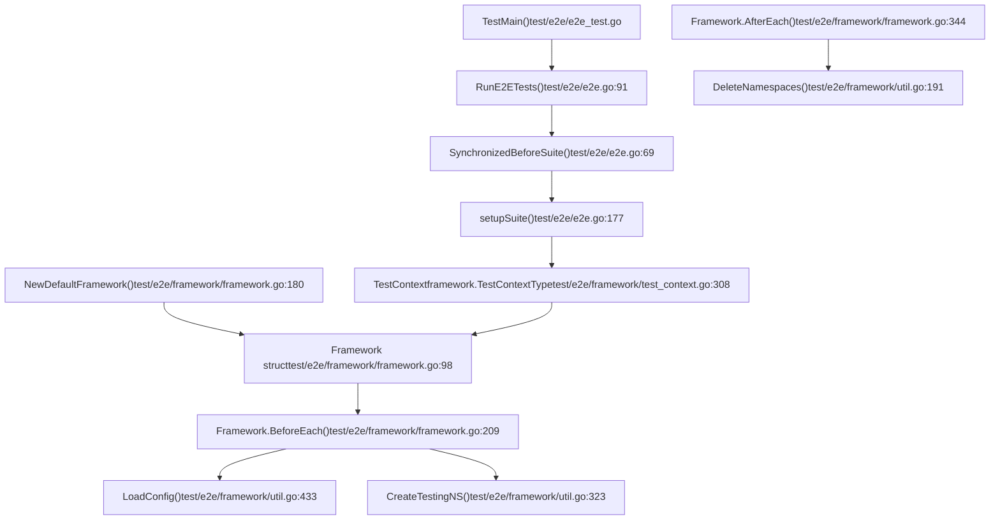
**Diagram: E2E Framework Component Relationships**

The framework follows a hierarchical initialization pattern where global setup occurs once across all tests, while per-test setup creates isolated environments.

Sources: [test/e2e/e2e.go1-262](https://github.com/kubernetes/kubernetes/blob/2757a872/test/e2e/e2e.go#L1-L262) [test/e2e/framework/framework.go1-206](https://github.com/kubernetes/kubernetes/blob/2757a872/test/e2e/framework/framework.go#L1-L206) [test/e2e/framework/test\_context.go1-310](https://github.com/kubernetes/kubernetes/blob/2757a872/test/e2e/framework/test_context.go#L1-L310)

## Framework Lifecycle

### Framework Instance Creation and Lifecycle Hooks

Each test creates a `Framework` instance that manages its lifecycle through Ginkgo hooks:

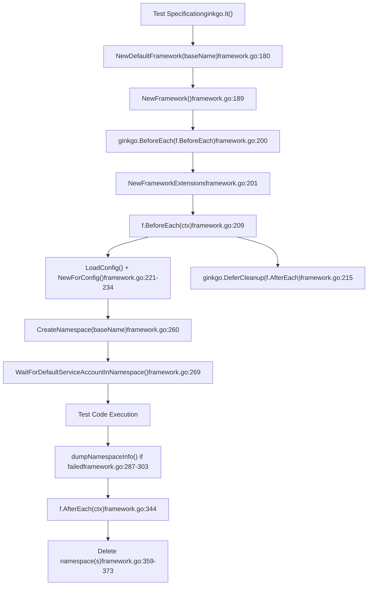
**Diagram: Framework Lifecycle Flow**

The `Framework` struct contains per-test state:

| Field | Type | Purpose | Populated When |
| --- | --- | --- | --- |
| `BaseName` | `string` | Test identifier | Initialization |
| `UniqueName` | `string` | Globally unique name | `BeforeEach` after namespace creation |
| `ClientSet` | `clientset.Interface` | Kubernetes API client | `BeforeEach` |
| `Namespace` | `*v1.Namespace` | Primary test namespace | `BeforeEach` |
| `namespacesToDelete` | `[]*v1.Namespace` | All namespaces to clean up | Accumulated during test |
| `Timeouts` | `*TimeoutContext` | Custom timeout values | Initialization |

Sources: [test/e2e/framework/framework.go88-141](https://github.com/kubernetes/kubernetes/blob/2757a872/test/e2e/framework/framework.go#L88-L141) [test/e2e/framework/framework.go176-206](https://github.com/kubernetes/kubernetes/blob/2757a872/test/e2e/framework/framework.go#L176-L206) [test/e2e/framework/framework.go208-285](https://github.com/kubernetes/kubernetes/blob/2757a872/test/e2e/framework/framework.go#L208-L285)

### Namespace Creation and Isolation

Namespaces provide resource isolation between tests:

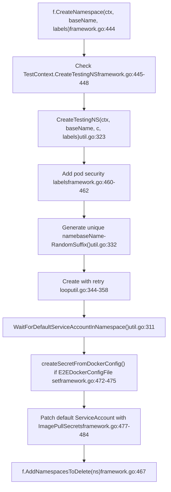
**Diagram: Namespace Creation Process**

Key aspects of namespace management:

-   **Unique naming**: Uses `RunID` (UUID) and `RandomSuffix()` to ensure uniqueness [test/e2e/framework/util.go332-333](https://github.com/kubernetes/kubernetes/blob/2757a872/test/e2e/framework/util.go#L332-L333)
-   **Labels**: Automatically adds `e2e-run` label with `RunID` and pod security labels [test/e2e/framework/util.go327](https://github.com/kubernetes/kubernetes/blob/2757a872/test/e2e/framework/util.go#L327-L327) [test/e2e/framework/framework.go460-462](https://github.com/kubernetes/kubernetes/blob/2757a872/test/e2e/framework/framework.go#L460-L462)
-   **Retry logic**: Handles `AlreadyExists` errors by regenerating names [test/e2e/framework/util.go348-351](https://github.com/kubernetes/kubernetes/blob/2757a872/test/e2e/framework/util.go#L348-L351)
-   **Service account wait**: Ensures default service account is provisioned before test proceeds [test/e2e/framework/util.go311-312](https://github.com/kubernetes/kubernetes/blob/2757a872/test/e2e/framework/util.go#L311-L312)

Sources: [test/e2e/framework/framework.go443-489](https://github.com/kubernetes/kubernetes/blob/2757a872/test/e2e/framework/framework.go#L443-L489) [test/e2e/framework/util.go321-371](https://github.com/kubernetes/kubernetes/blob/2757a872/test/e2e/framework/util.go#L321-L371)

### Cleanup and Teardown

Cleanup occurs in reverse order of creation using `ginkgo.DeferCleanup`:

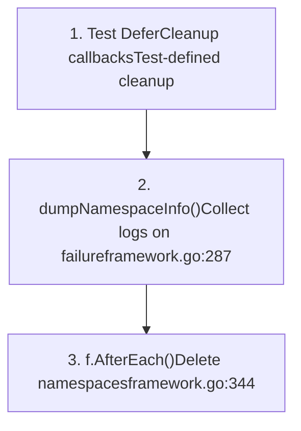
**Diagram: Cleanup Execution Order**

The `AfterEach` method handles namespace deletion:

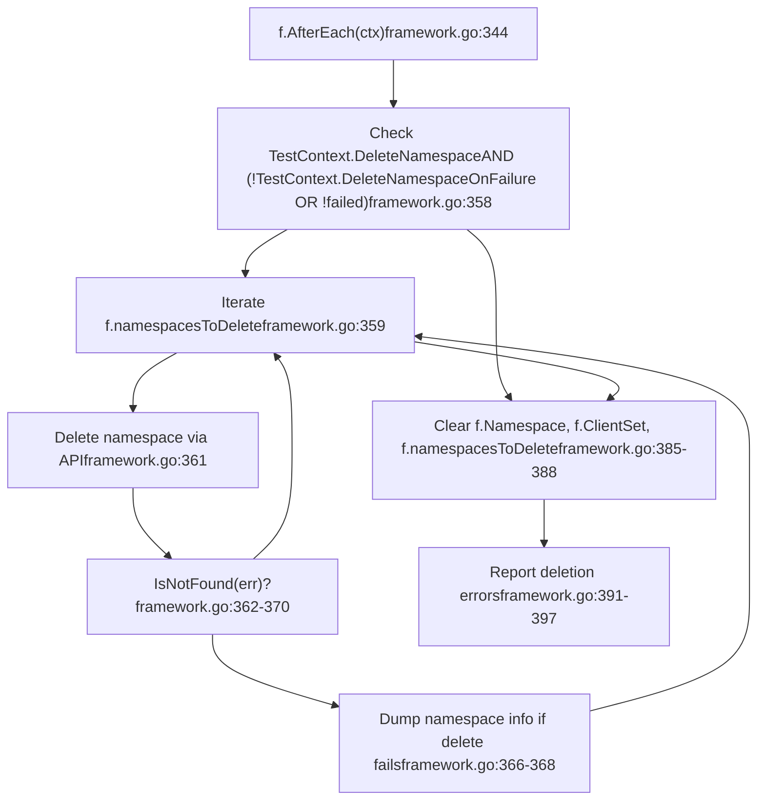
**Diagram: Namespace Cleanup Logic**

Sources: [test/e2e/framework/framework.go343-409](https://github.com/kubernetes/kubernetes/blob/2757a872/test/e2e/framework/framework.go#L343-L409) [test/e2e/framework/framework.go287-304](https://github.com/kubernetes/kubernetes/blob/2757a872/test/e2e/framework/framework.go#L287-L304)

## TestContext Configuration

The `TestContext` global variable provides configuration for all tests:

### Core Configuration Fields

**Diagram: TestContext Configuration Structure**

### Flag Registration and Configuration

The framework registers flags in multiple phases:

| Function | Purpose | Key Flags | File |
| --- | --- | --- | --- |
| `RegisterCommonFlags()` | Flags common to all E2E tests | `--gather-resource-usage`, `--dump-logs-on-failure`, `--delete-namespace` | `test_context.go:349-396` |
| `RegisterClusterFlags()` | Cluster-specific flags | `--kubeconfig`, `--provider`, `--node-os-distro` | `test_context.go:411-467` |
| `RegisterNodeFlags()` | Node E2E specific flags | `--node-name`, `--conformance`, `--prepull-images` | `e2e_node_suite_test.go:88-115` |

Configuration loading flow:

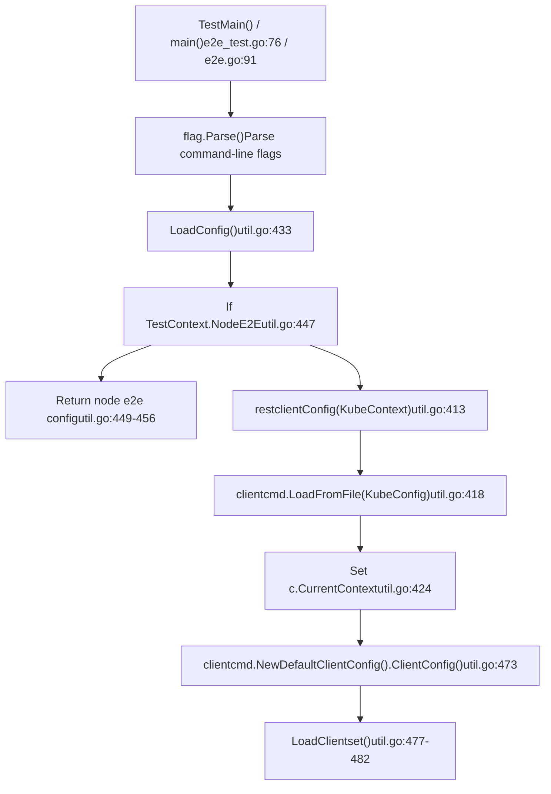
**Diagram: Configuration Loading Flow**

Sources: [test/e2e/framework/test\_context.go101-230](https://github.com/kubernetes/kubernetes/blob/2757a872/test/e2e/framework/test_context.go#L101-L230) [test/e2e/framework/test\_context.go338-467](https://github.com/kubernetes/kubernetes/blob/2757a872/test/e2e/framework/test_context.go#L338-L467) [test/e2e/framework/util.go432-483](https://github.com/kubernetes/kubernetes/blob/2757a872/test/e2e/framework/util.go#L432-L483)

## Client Management

### Client Initialization

The framework creates multiple client types:

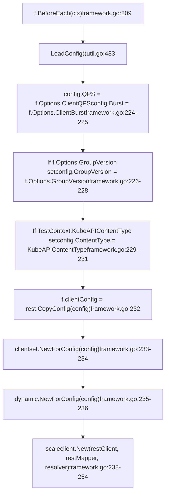
**Diagram: Client Creation in BeforeEach**

The `Framework` struct maintains these clients:

| Field | Type | Purpose | Created |
| --- | --- | --- | --- |
| `clientConfig` | `*rest.Config` | Base REST config | Line 232 |
| `ClientSet` | `clientset.Interface` | Standard typed client | Line 233 |
| `DynamicClient` | `dynamic.Interface` | Dynamic untyped client | Line 235 |
| `ScalesGetter` | `scaleclient.ScalesGetter` | Scale subresource client | Line 254 |

### Client Options

The `Options` struct configures client behavior:

```
// Framework Options from framework.go:154-158type Options struct {    ClientQPS    float32              // Default: 20    ClientBurst  int                  // Default: 50    GroupVersion *schema.GroupVersion // Optional API version override}
```
Sources: [test/e2e/framework/framework.go208-254](https://github.com/kubernetes/kubernetes/blob/2757a872/test/e2e/framework/framework.go#L208-L254) [test/e2e/framework/framework.go154-158](https://github.com/kubernetes/kubernetes/blob/2757a872/test/e2e/framework/framework.go#L154-L158) [test/e2e/framework/util.go432-474](https://github.com/kubernetes/kubernetes/blob/2757a872/test/e2e/framework/util.go#L432-L474)

## Utility Functions

The framework provides extensive utility functions for common operations:

### Waiting and Polling Utilities

| Function | Purpose | Default Timeout | File:Lines |
| --- | --- | --- | --- |
| `WaitForNamespacesDeleted()` | Wait for namespace deletion | Passed as parameter | `util.go:230-250` |
| `WaitForDefaultServiceAccountInNamespace()` | Wait for default SA | `ServiceAccountProvisionTimeout` (2m) | `util.go:310-312` |
| `WaitForKubeRootCAInNamespace()` | Wait for CA ConfigMap | `ServiceAccountProvisionTimeout` (2m) | `util.go:317-319` |
| `CheckTestingNSDeletedExcept()` | Verify old namespaces deleted | 60 minutes | `util.go:375-410` |

Common timeout constants (deprecated, use `Framework.Timeouts` instead):

```
// Constants from util.go:58-127const (    PodStartTimeout             = 5 * time.Minute    PodDeleteTimeout            = 5 * time.Minute    ServiceStartTimeout         = 3 * time.Minute    ServiceAccountProvisionTimeout = 2 * time.Minute    SingleCallTimeout           = 5 * time.Minute    Poll                        = 2 * time.Second)
```
### Watch Event Verification

`WatchEventSequenceVerifier()` validates that watch events occur in the expected order:

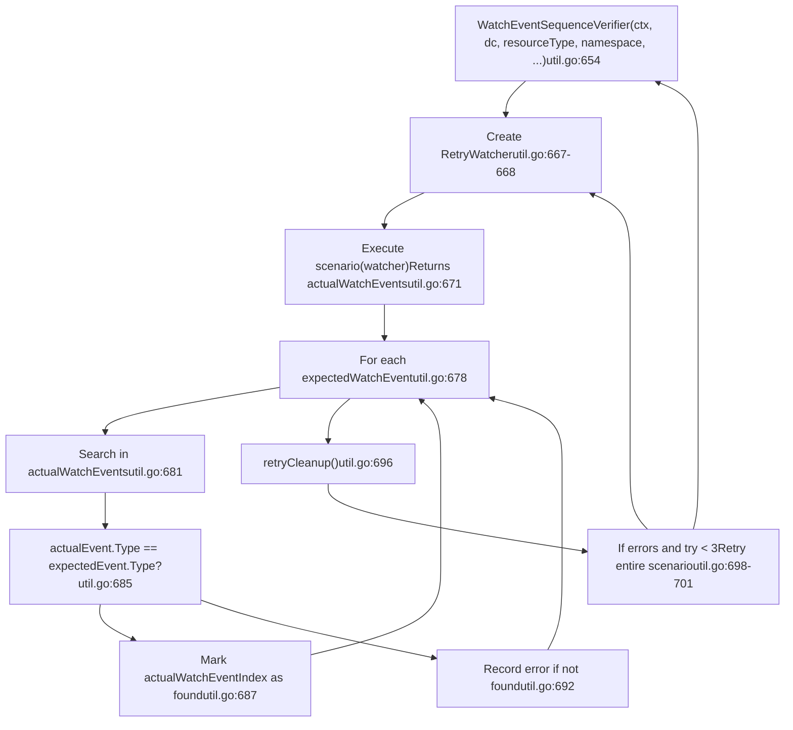
**Diagram: Watch Event Sequence Verification**

Sources: [test/e2e/framework/util.go58-127](https://github.com/kubernetes/kubernetes/blob/2757a872/test/e2e/framework/util.go#L58-L127) [test/e2e/framework/util.go230-319](https://github.com/kubernetes/kubernetes/blob/2757a872/test/e2e/framework/util.go#L230-L319) [test/e2e/framework/util.go654-708](https://github.com/kubernetes/kubernetes/blob/2757a872/test/e2e/framework/util.go#L654-L708)

### Command Execution Utilities

| Function | Purpose | File:Lines |
| --- | --- | --- |
| `RunCmd(command, args...)` | Execute command, return stdout/stderr | `util.go:554-556` |
| `RunCmdEnv(env, command, args...)` | Execute with custom environment | `util.go:561-580` |
| `StartCmdAndStreamOutput(cmd)` | Start command asynchronously | `util.go:491-505` |
| `TryKill(cmd)` | Kill process (for cleanup) | `util.go:508-512` |
| `CoreDump(dir)` | SSH to nodes and dump logs | `util.go:522-545` |

### Resource Management Utilities

| Function | Purpose | File:Lines |
| --- | --- | --- |
| `DeleteNamespaces(ctx, c, deleteFilter, skipFilter)` | Delete matching namespaces | `util.go:191-227` |
| `GetControlPlaneNodes(ctx, c)` | List control plane nodes | `util.go:594-618` |
| `GetNodeExternalIPs(node)` | Extract node external IPs | `util.go:583-591` |

Sources: [test/e2e/framework/util.go491-545](https://github.com/kubernetes/kubernetes/blob/2757a872/test/e2e/framework/util.go#L491-L545) [test/e2e/framework/util.go554-592](https://github.com/kubernetes/kubernetes/blob/2757a872/test/e2e/framework/util.go#L554-L592) [test/e2e/framework/util.go191-227](https://github.com/kubernetes/kubernetes/blob/2757a872/test/e2e/framework/util.go#L191-L227)

## Test Execution Flow

### Suite Initialization

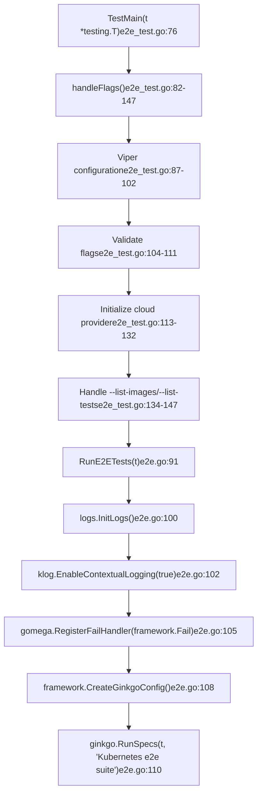
**Diagram: Test Suite Entry and Initialization**

### Synchronized Suite Hooks

Ginkgo's `SynchronizedBeforeSuite` ensures one-time setup across parallel test nodes:

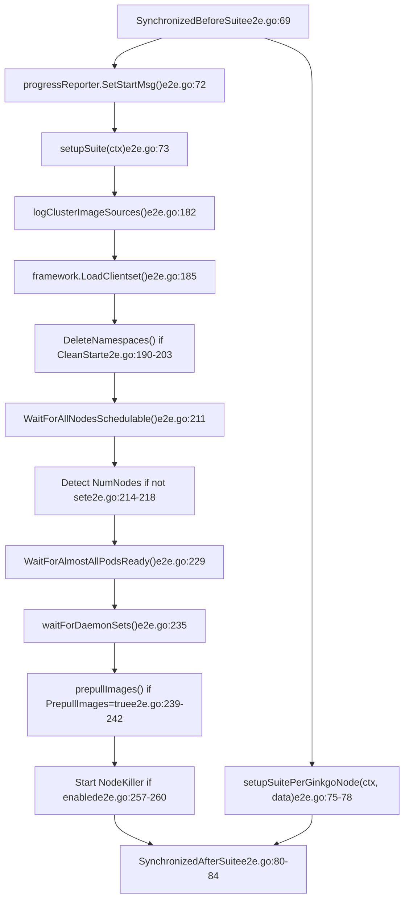
**Diagram: Synchronized Suite Lifecycle**

Sources: [test/e2e/e2e.go69-84](https://github.com/kubernetes/kubernetes/blob/2757a872/test/e2e/e2e.go#L69-L84) [test/e2e/e2e.go168-261](https://github.com/kubernetes/kubernetes/blob/2757a872/test/e2e/e2e.go#L168-L261) [test/e2e/e2e\_test.go76-150](https://github.com/kubernetes/kubernetes/blob/2757a872/test/e2e/e2e_test.go#L76-L150)

## Node E2E Remote Execution

For node-specific tests, the framework supports remote execution on provisioned VMs:

### Remote Test Architecture

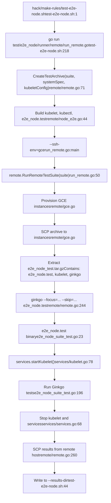
**Diagram: Remote Node E2E Test Execution Flow**

### Test Suite Configuration

Node E2E tests are organized into test suites:

| Suite | Purpose | File |
| --- | --- | --- |
| `default` | Standard node e2e tests | `remote/node_e2e.go:40` |
| `conformance` | Node conformance tests | `remote/node_conformance.go` |
| `cadvisor` | cAdvisor-specific tests | `remote/node_e2e.go` |

Each suite implements the `TestSuite` interface:

```
// From remote/remote.gotype TestSuite interface {    SetupTestPackage(tardir, systemSpecName, kubeletConfigFile string) error    RunTest(host, workspace, results, imageDesc, junitFileName string, ...) (string, error)}
```
### Archive Contents

`CreateTestArchive()` packages required binaries and configurations:

```
e2e_node_test.tar.gz
├── e2e_node.test          # Test binary
├── ginkgo                 # Test runner
├── kubelet                # Kubelet binary
├── kubectl                # kubectl binary
├── cni/                   # CNI plugins
├── kubeletconfig.yaml     # Kubelet configuration
└── system-specs/          # System validation specs
```
Sources: [hack/make-rules/test-e2e-node.sh1-293](https://github.com/kubernetes/kubernetes/blob/2757a872/hack/make-rules/test-e2e-node.sh#L1-L293) [test/e2e\_node/runner/remote/run\_remote.go1-52](https://github.com/kubernetes/kubernetes/blob/2757a872/test/e2e_node/runner/remote/run_remote.go#L1-L52) [test/e2e\_node/remote/remote.go70-138](https://github.com/kubernetes/kubernetes/blob/2757a872/test/e2e_node/remote/remote.go#L70-L138) [test/e2e\_node/remote/node\_e2e.go35-170](https://github.com/kubernetes/kubernetes/blob/2757a872/test/e2e_node/remote/node_e2e.go#L35-L170)

## Timeout Configuration

The framework provides two ways to configure timeouts:

### TimeoutContext Structure

```mermaid
flowchart TD
    TC["TimeoutContextframework/timeouts.go"]
    SystemPods["SystemPodsStartup: 10mWait for system pods"]
    SystemDaemonset["SystemDaemonsetStartup: 5mWait for daemonsets"]
    NodeSchedulable["NodeSchedulable: 30mWait for nodes schedulable"]
    PodStart["PodStart: 5mWait for pod running"]
    PodStartShort["PodStartShort: 2mShort pod start wait"]
    PodStartSlow["PodStartSlow: 15mSlow pod start wait"]
    PodDelete["PodDelete: 5mWait for pod deletion"]
    ClaimProvision["ClaimProvision: 5mWait for PVC provision"]
    PVReclaim["PVReclaim: 5mWait for PV reclaim"]
    PVBound["PVBound: 3mWait for PV bound"]
    PVCreate["PVCreate: 3mWait for PV creation"]

    TC --> SystemPods
    TC --> SystemDaemonset
    TC --> NodeSchedulable
    TC --> PodStart
    TC --> PodStartShort
    TC --> PodStartSlow
    TC --> PodDelete
    TC --> ClaimProvision
    TC --> PVReclaim
    TC --> PVBound
    TC --> PVCreate
```
**Diagram: TimeoutContext Configuration**

### Using Custom Timeouts

Tests can override default timeouts:

```
// From framework/framework.go:163-174func NewFrameworkWithCustomTimeouts(baseName string, timeouts *TimeoutContext) *Framework {    f := NewDefaultFramework(baseName)    // Copy non-zero timeout values    in := reflect.ValueOf(timeouts).Elem()    out := reflect.ValueOf(f.Timeouts).Elem()    for i := 0; i < in.NumField(); i++ {        value := in.Field(i)        if !value.IsZero() {            out.Field(i).Set(value)        }    }    return f}
```
Global timeout configuration via flags:

| Flag | Environment Variable | Default | Purpose |
| --- | --- | --- | --- |
| `--system-pods-startup-timeout` | \- | 10m | System pod startup |
| `--node-schedulable-timeout` | \- | 30m | Node readiness |
| `--pod-start-timeout` | \- | 5m | Pod startup |

Sources: [test/e2e/framework/timeouts.go](https://github.com/kubernetes/kubernetes/blob/2757a872/test/e2e/framework/timeouts.go) [test/e2e/framework/framework.go160-174](https://github.com/kubernetes/kubernetes/blob/2757a872/test/e2e/framework/framework.go#L160-L174) [test/e2e/framework/test\_context.go460-465](https://github.com/kubernetes/kubernetes/blob/2757a872/test/e2e/framework/test_context.go#L460-L465)

## Test Helpers and Patterns

### Common Test Patterns

The framework encourages specific patterns for test structure:

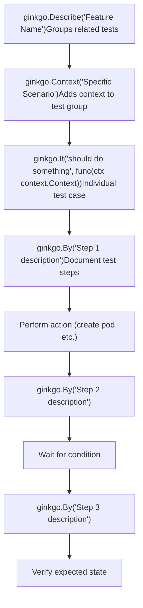
**Diagram: Recommended Test Structure Pattern**

Example test structure from scheduling tests:

```
// Pattern from test/e2e/scheduling/predicates.govar _ = SIGDescribe("SchedulerPredicates", framework.WithSerial(), func() {    f := framework.NewDefaultFramework("sched-pred")        ginkgo.BeforeEach(func(ctx context.Context) {        // Per-test setup    })        ginkgo.AfterEach(func(ctx context.Context) {        // Per-test cleanup    })        f.It("validates resource limits", func(ctx context.Context) {        ginkgo.By("Creating pods that consume resources")        // Test implementation                ginkgo.By("Verifying scheduler behavior")        // Verification    })})
```
### Assertion Helpers

The framework provides wrapped assertion functions:

| Function | Purpose | File:Lines |
| --- | --- | --- |
| `ExpectNoError(err, ...explain)` | Assert no error occurred | `framework/util.go` via `framework/log.go` |
| `ExpectNoErrorWithOffset(offset int, err, ...explain)` | Assert with custom stack offset | `framework/log.go` |
| `Failf(format, args...)` | Fail test with formatted message | `framework/log.go` |
| `Logf(format, args...)` | Log formatted message | `framework/log.go` |

Sources: [test/e2e/scheduling/predicates.go82-203](https://github.com/kubernetes/kubernetes/blob/2757a872/test/e2e/scheduling/predicates.go#L82-L203) [test/e2e/framework/framework.go176-206](https://github.com/kubernetes/kubernetes/blob/2757a872/test/e2e/framework/framework.go#L176-L206)

## Provider Integration

The framework integrates with cloud providers through the `ProviderInterface`:

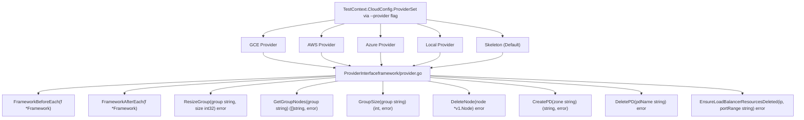
**Diagram: Provider Interface and Implementations**

Provider selection occurs during flag processing:

```
// From test/e2e/e2e_test.go:113-132func handleFlags() {    // ... flag parsing ...        framework.TestContext.CloudConfig.Provider =         framework.SetupProviderConfig(framework.TestContext.Provider)}
```
The provider's lifecycle hooks are called by the Framework:

-   `FrameworkBeforeEach(f)` - Called in `Framework.BeforeEach()` at [framework.go256](https://github.com/kubernetes/kubernetes/blob/2757a872/framework.go#L256-L256)
-   `FrameworkAfterEach(f)` - Called in `Framework.AfterEach()` at [framework.go400](https://github.com/kubernetes/kubernetes/blob/2757a872/framework.go#L400-L400)

Sources: [test/e2e/framework/test\_context.go284-305](https://github.com/kubernetes/kubernetes/blob/2757a872/test/e2e/framework/test_context.go#L284-L305) [test/e2e/e2e\_test.go113-132](https://github.com/kubernetes/kubernetes/blob/2757a872/test/e2e/e2e_test.go#L113-L132) [test/e2e/framework/framework.go256](https://github.com/kubernetes/kubernetes/blob/2757a872/test/e2e/framework/framework.go#L256-L256) [test/e2e/framework/framework.go400](https://github.com/kubernetes/kubernetes/blob/2757a872/test/e2e/framework/framework.go#L400-L400)
