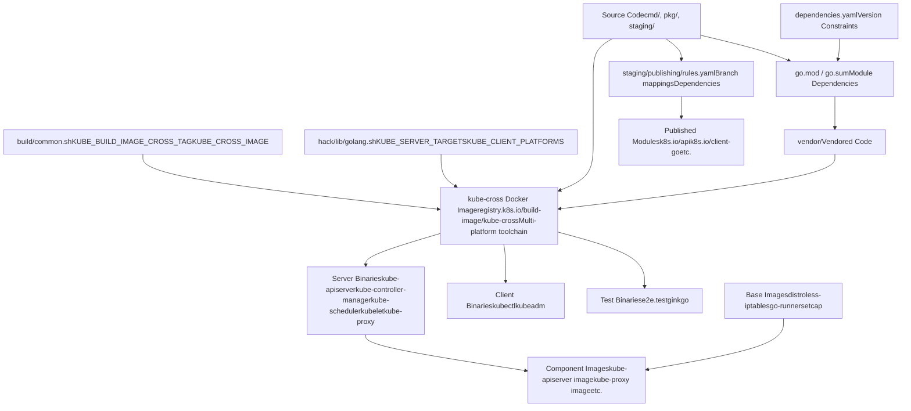
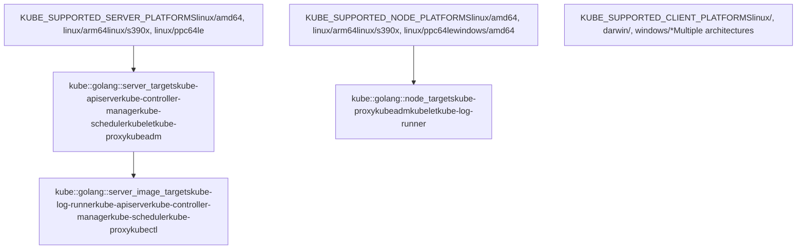
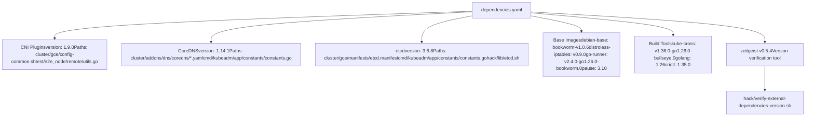
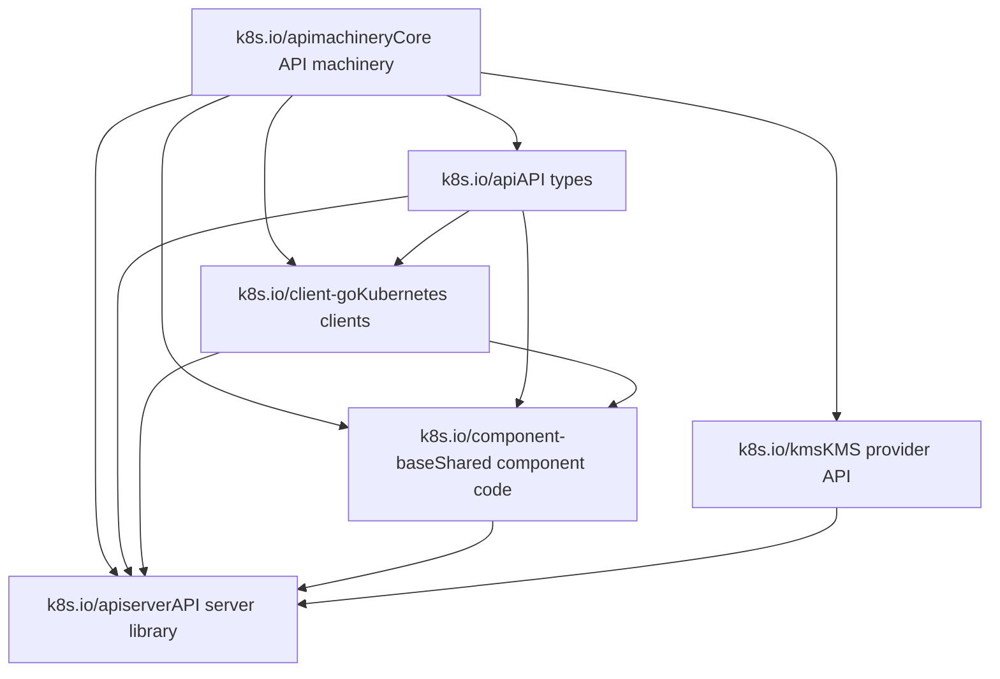

# Build System and Dependencies

Relevant source files

-   [.go-version](https://github.com/kubernetes/kubernetes/blob/2757a872/.go-version)
-   [build/build-image/cross/VERSION](https://github.com/kubernetes/kubernetes/blob/2757a872/build/build-image/cross/VERSION)
-   [build/common.sh](https://github.com/kubernetes/kubernetes/blob/2757a872/build/common.sh)
-   [build/dependencies.yaml](https://github.com/kubernetes/kubernetes/blob/2757a872/build/dependencies.yaml)
-   [cluster/gce/manifests/etcd.manifest](https://github.com/kubernetes/kubernetes/blob/2757a872/cluster/gce/manifests/etcd.manifest)
-   [cluster/gce/upgrade-aliases.sh](https://github.com/kubernetes/kubernetes/blob/2757a872/cluster/gce/upgrade-aliases.sh)
-   [cmd/kubeadm/app/constants/constants.go](https://github.com/kubernetes/kubernetes/blob/2757a872/cmd/kubeadm/app/constants/constants.go)
-   [cmd/kubeadm/app/constants/constants\_test.go](https://github.com/kubernetes/kubernetes/blob/2757a872/cmd/kubeadm/app/constants/constants_test.go)
-   [cmd/kubeadm/app/constants/constants\_unix.go](https://github.com/kubernetes/kubernetes/blob/2757a872/cmd/kubeadm/app/constants/constants_unix.go)
-   [cmd/kubeadm/app/constants/constants\_windows.go](https://github.com/kubernetes/kubernetes/blob/2757a872/cmd/kubeadm/app/constants/constants_windows.go)
-   [cmd/kubeadm/app/images/images.go](https://github.com/kubernetes/kubernetes/blob/2757a872/cmd/kubeadm/app/images/images.go)
-   [cmd/kubeadm/app/images/images\_test.go](https://github.com/kubernetes/kubernetes/blob/2757a872/cmd/kubeadm/app/images/images_test.go)
-   [cmd/kubeadm/app/phases/patchnode/patchnode\_test.go](https://github.com/kubernetes/kubernetes/blob/2757a872/cmd/kubeadm/app/phases/patchnode/patchnode_test.go)
-   [go.mod](https://github.com/kubernetes/kubernetes/blob/2757a872/go.mod)
-   [go.sum](https://github.com/kubernetes/kubernetes/blob/2757a872/go.sum)
-   [go.work](https://github.com/kubernetes/kubernetes/blob/2757a872/go.work)
-   [hack/lib/etcd.sh](https://github.com/kubernetes/kubernetes/blob/2757a872/hack/lib/etcd.sh)
-   [hack/lib/golang.sh](https://github.com/kubernetes/kubernetes/blob/2757a872/hack/lib/golang.sh)
-   [staging/README.md](https://github.com/kubernetes/kubernetes/blob/2757a872/staging/README.md?plain=1)
-   [staging/publishing/import-restrictions.yaml](https://github.com/kubernetes/kubernetes/blob/2757a872/staging/publishing/import-restrictions.yaml)
-   [staging/publishing/rules.yaml](https://github.com/kubernetes/kubernetes/blob/2757a872/staging/publishing/rules.yaml)
-   [staging/src/k8s.io/apiextensions-apiserver/go.mod](https://github.com/kubernetes/kubernetes/blob/2757a872/staging/src/k8s.io/apiextensions-apiserver/go.mod)
-   [staging/src/k8s.io/apiextensions-apiserver/go.sum](https://github.com/kubernetes/kubernetes/blob/2757a872/staging/src/k8s.io/apiextensions-apiserver/go.sum)
-   [staging/src/k8s.io/apiserver/go.mod](https://github.com/kubernetes/kubernetes/blob/2757a872/staging/src/k8s.io/apiserver/go.mod)
-   [staging/src/k8s.io/apiserver/go.sum](https://github.com/kubernetes/kubernetes/blob/2757a872/staging/src/k8s.io/apiserver/go.sum)
-   [staging/src/k8s.io/cloud-provider/go.sum](https://github.com/kubernetes/kubernetes/blob/2757a872/staging/src/k8s.io/cloud-provider/go.sum)
-   [staging/src/k8s.io/component-base/go.sum](https://github.com/kubernetes/kubernetes/blob/2757a872/staging/src/k8s.io/component-base/go.sum)
-   [staging/src/k8s.io/controller-manager/go.sum](https://github.com/kubernetes/kubernetes/blob/2757a872/staging/src/k8s.io/controller-manager/go.sum)
-   [staging/src/k8s.io/kube-aggregator/go.mod](https://github.com/kubernetes/kubernetes/blob/2757a872/staging/src/k8s.io/kube-aggregator/go.mod)
-   [staging/src/k8s.io/kube-aggregator/go.sum](https://github.com/kubernetes/kubernetes/blob/2757a872/staging/src/k8s.io/kube-aggregator/go.sum)
-   [staging/src/k8s.io/kube-controller-manager/go.sum](https://github.com/kubernetes/kubernetes/blob/2757a872/staging/src/k8s.io/kube-controller-manager/go.sum)
-   [staging/src/k8s.io/kube-proxy/go.sum](https://github.com/kubernetes/kubernetes/blob/2757a872/staging/src/k8s.io/kube-proxy/go.sum)
-   [staging/src/k8s.io/kube-scheduler/go.sum](https://github.com/kubernetes/kubernetes/blob/2757a872/staging/src/k8s.io/kube-scheduler/go.sum)
-   [staging/src/k8s.io/pod-security-admission/go.sum](https://github.com/kubernetes/kubernetes/blob/2757a872/staging/src/k8s.io/pod-security-admission/go.sum)
-   [staging/src/k8s.io/sample-apiserver/artifacts/example/deployment.yaml](https://github.com/kubernetes/kubernetes/blob/2757a872/staging/src/k8s.io/sample-apiserver/artifacts/example/deployment.yaml)
-   [staging/src/k8s.io/sample-apiserver/go.mod](https://github.com/kubernetes/kubernetes/blob/2757a872/staging/src/k8s.io/sample-apiserver/go.mod)
-   [staging/src/k8s.io/sample-apiserver/go.sum](https://github.com/kubernetes/kubernetes/blob/2757a872/staging/src/k8s.io/sample-apiserver/go.sum)
-   [test/e2e/framework/nodes\_util.go](https://github.com/kubernetes/kubernetes/blob/2757a872/test/e2e/framework/nodes_util.go)
-   [test/e2e/framework/providers/gcp.go](https://github.com/kubernetes/kubernetes/blob/2757a872/test/e2e/framework/providers/gcp.go)
-   [test/e2e/upgrades/network/kube\_proxy\_migration.go](https://github.com/kubernetes/kubernetes/blob/2757a872/test/e2e/upgrades/network/kube_proxy_migration.go)
-   [test/e2e/windows/device\_plugin.go](https://github.com/kubernetes/kubernetes/blob/2757a872/test/e2e/windows/device_plugin.go)
-   [test/images/Makefile](https://github.com/kubernetes/kubernetes/blob/2757a872/test/images/Makefile)
-   [test/utils/image/manifest.go](https://github.com/kubernetes/kubernetes/blob/2757a872/test/utils/image/manifest.go)
-   [test/utils/image/manifest\_test.go](https://github.com/kubernetes/kubernetes/blob/2757a872/test/utils/image/manifest_test.go)
-   [vendor/modules.txt](https://github.com/kubernetes/kubernetes/blob/2757a872/vendor/modules.txt)

## Purpose and Scope

This document provides an overview of the Kubernetes build system, dependency management infrastructure, and release artifact generation. It covers how source code is compiled into binaries and container images, how external and internal dependencies are tracked and managed, and how the monorepo's staging modules are published as independent packages.

For specific details on dependency version tracking and verification with zeitgeist, see [Dependency Management](/kubernetes/kubernetes/7.1-dependency-management). For build process details including cross-compilation and Docker image creation, see [Build and Release Process](/kubernetes/kubernetes/7.2-build-and-release-process). For information about the staging directory structure and module publishing, see [Go Modules and Staging](/kubernetes/kubernetes/7.3-go-modules-and-staging).

## Build System Architecture

The Kubernetes build system transforms source code into deployable artifacts through a series of well-defined stages. The system supports cross-platform compilation, dependency management, and multi-stage Docker image builds.


**Sources**: [build/common.sh1-247](https://github.com/kubernetes/kubernetes/blob/2757a872/build/common.sh#L1-L247) [hack/lib/golang.sh1-400](https://github.com/kubernetes/kubernetes/blob/2757a872/hack/lib/golang.sh#L1-L400) [build/dependencies.yaml1-268](https://github.com/kubernetes/kubernetes/blob/2757a872/build/dependencies.yaml#L1-L268) [staging/publishing/rules.yaml1-100](https://github.com/kubernetes/kubernetes/blob/2757a872/staging/publishing/rules.yaml#L1-L100)

## Core Build System Components

### Build Configuration and Environment

The build system is orchestrated by shell scripts that configure build environments, manage Docker containers, and define compilation targets.

| Component | Location | Purpose |
| --- | --- | --- |
| `build/common.sh` | [build/common.sh1-247](https://github.com/kubernetes/kubernetes/blob/2757a872/build/common.sh#L1-L247) | Core build configuration, Docker image versions, build container management |
| `hack/lib/golang.sh` | [hack/lib/golang.sh1-900](https://github.com/kubernetes/kubernetes/blob/2757a872/hack/lib/golang.sh#L1-L900) | Go build targets, platform definitions, compilation functions |
| `build/build-image/cross/VERSION` | [build/build-image/cross/VERSION1](https://github.com/kubernetes/kubernetes/blob/2757a872/build/build-image/cross/VERSION#L1-L1) | Cross-compilation Docker image version |
| `KUBE_CROSS_IMAGE` | [build/common.sh46-47](https://github.com/kubernetes/kubernetes/blob/2757a872/build/common.sh#L46-L47) | Fully qualified cross-compilation image name |
| `KUBE_BUILD_IMAGE_CROSS_TAG` | [build/common.sh38-39](https://github.com/kubernetes/kubernetes/blob/2757a872/build/common.sh#L38-L39) | Current cross-compilation image tag |

The build system defines several key environment variables:

-   `KUBE_ROOT`: Repository root directory
-   `LOCAL_OUTPUT_ROOT`: Local build output directory (`_output/`)
-   `LOCAL_OUTPUT_BINPATH`: Compiled binary output (`_output/dockerized/bin/`)
-   `KUBE_GOPATH`: Go workspace path for builds
-   `KUBE_CROSS_IMAGE`: Cross-compilation Docker image reference

**Sources**: [build/common.sh32-77](https://github.com/kubernetes/kubernetes/blob/2757a872/build/common.sh#L32-L77) [hack/lib/golang.sh19-20](https://github.com/kubernetes/kubernetes/blob/2757a872/hack/lib/golang.sh#L19-L20)

### Build Targets and Platforms

Kubernetes supports building for multiple platforms with different sets of targets for each platform type.


**Sources**: [hack/lib/golang.sh23-139](https://github.com/kubernetes/kubernetes/blob/2757a872/hack/lib/golang.sh#L23-L139)

### Base Image Configuration

Container images are built using specific base images that provide minimal runtime dependencies.

| Base Image Variable | Default Value | Purpose |
| --- | --- | --- |
| `__default_distroless_iptables_version` | `v0.9.0` | Dynamically linked binaries (includes iptables) |
| `__default_go_runner_version` | `v2.4.0-go1.26.0-bookworm.0` | Statically linked binaries |
| `__default_setcap_version` | `bookworm-v1.0.6` | Multi-stage build for setting capabilities |
| `KUBE_APISERVER_BASE_IMAGE` | Conditionally selected | API server container base |
| `KUBE_PROXY_BASE_IMAGE` | `distroless-iptables` | Proxy container base (requires iptables) |

The base image selection uses the `__default_base_image()` function which determines whether a binary is statically or dynamically linked:

**Sources**: [build/common.sh79-116](https://github.com/kubernetes/kubernetes/blob/2757a872/build/common.sh#L79-L116)

## Dependency Management Overview

Kubernetes manages dependencies at multiple levels: Go module dependencies, external component versions, and container image versions.

### Go Modules

The main `go.mod` file declares all direct dependencies for the entire repository, including both external packages and internal staging modules.

Key dependency categories in [go.mod13-122](https://github.com/kubernetes/kubernetes/blob/2757a872/go.mod#L13-L122):

-   **Core Kubernetes Libraries**: Internal staging modules like `k8s.io/api`, `k8s.io/client-go`, `k8s.io/apiserver`
-   **etcd**: Client and server libraries (`go.etcd.io/etcd/client/v3`, `go.etcd.io/etcd/server/v3`)
-   **Container Runtime**: CRI, containerd, and CRI-O integration libraries
-   **Networking**: gRPC, HTTP/2, WebSocket, and proxy libraries
-   **Observability**: OpenTelemetry, Prometheus client libraries
-   **Utilities**: Command-line parsing, logging, serialization libraries

The repository uses workspace mode and replace directives to point internal modules to their locations in the `staging/` directory:

```
replace (
    k8s.io/api => ./staging/src/k8s.io/api
    k8s.io/apiserver => ./staging/src/k8s.io/apiserver
    k8s.io/client-go => ./staging/src/k8s.io/client-go
    ...
)
```
**Sources**: [go.mod1-252](https://github.com/kubernetes/kubernetes/blob/2757a872/go.mod#L1-L252) [vendor/modules.txt1-1500](https://github.com/kubernetes/kubernetes/blob/2757a872/vendor/modules.txt#L1-L1500)

### Version Tracking with dependencies.yaml

The `dependencies.yaml` file provides an additional layer of version verification using zeitgeist. This file tracks versions of external components that must remain synchronized across multiple locations in the codebase.


**Sources**: [build/dependencies.yaml1-268](https://github.com/kubernetes/kubernetes/blob/2757a872/build/dependencies.yaml#L1-L268)

### Component Version Constants

Component versions are also defined in code constants for runtime use, particularly in kubeadm which needs to know what versions to deploy:

```
// From cmd/kubeadm/app/constants/constants.goconst (    DefaultEtcdVersion  = "3.6.8"    CoreDNSVersion      = "1.14.1"    PauseVersion        = "3.10")
```
**Sources**: [cmd/kubeadm/app/constants/constants.go66-207](https://github.com/kubernetes/kubernetes/blob/2757a872/cmd/kubeadm/app/constants/constants.go#L66-L207)

## Staging Directory and Module Publishing

The Kubernetes repository uses a monorepo structure with a `staging/` directory containing submodules that are published as independent Go modules.

### Staging Module Structure

The staging directory at [staging/src/k8s.io/](https://github.com/kubernetes/kubernetes/blob/2757a872/staging/src/k8s.io/) contains over 20 separate modules:

-   `api`: Kubernetes API types
-   `apimachinery`: Generic API machinery
-   `apiserver`: API server library
-   `client-go`: Kubernetes client library
-   `kubectl`: kubectl command implementation
-   `kubelet`: Kubelet as a library
-   And many more...

Each staging module has its own `go.mod` file that declares dependencies on other staging modules and external packages. For example, [staging/src/k8s.io/apiserver/go.mod9-64](https://github.com/kubernetes/kubernetes/blob/2757a872/staging/src/k8s.io/apiserver/go.mod#L9-L64) shows apiserver depending on `k8s.io/api`, `k8s.io/client-go`, `k8s.io/component-base`, etc.

### Publishing Rules

The `staging/publishing/rules.yaml` file defines how staging modules are published to their respective GitHub repositories. Each rule specifies:

-   **destination**: Target repository name (e.g., `client-go`, `apiserver`)
-   **branches**: Which source branches map to which destination branches
-   **dependencies**: Inter-module dependencies with branch mappings
-   **library**: Whether the module is a library (vs. a binary)
-   **smoke-test**: Optional build/test commands to verify the published module

Example rule structure:

```
- destination: client-go  branches:  - name: master    dependencies:    - repository: apimachinery      branch: master    - repository: api      branch: master    source:      branch: master      dirs:      - staging/src/k8s.io/client-go    smoke-test: |      go build -mod=mod ./...      go test -mod=mod ./...  library: true
```
**Sources**: [staging/publishing/rules.yaml1-812](https://github.com/kubernetes/kubernetes/blob/2757a872/staging/publishing/rules.yaml#L1-L812)

### Dependency Graph Between Staging Modules


**Sources**: [staging/publishing/rules.yaml2-439](https://github.com/kubernetes/kubernetes/blob/2757a872/staging/publishing/rules.yaml#L2-L439) [staging/src/k8s.io/apiserver/go.mod51-59](https://github.com/kubernetes/kubernetes/blob/2757a872/staging/src/k8s.io/apiserver/go.mod#L51-L59)

## Build Artifacts and Output Structure

The build system produces several categories of artifacts organized in a structured output directory.

### Output Directory Layout

```
_output/
├── dockerized/
│   ├── bin/
│   │   ├── linux/
│   │   │   ├── amd64/
│   │   │   │   ├── kube-apiserver
│   │   │   │   ├── kube-controller-manager
│   │   │   │   ├── kube-scheduler
│   │   │   │   ├── kubelet
│   │   │   │   ├── kube-proxy
│   │   │   │   └── kubectl
│   │   │   ├── arm64/
│   │   │   └── ...
│   │   ├── darwin/
│   │   │   ├── amd64/
│   │   │   └── arm64/
│   │   └── windows/
│   │       └── amd64/
│   └── go/
│       └── (Go build cache)
└── bin -> dockerized/bin/(host-platform)/
```
Key constants defining this structure:

-   `LOCAL_OUTPUT_ROOT`: `${KUBE_ROOT}/_output`
-   `LOCAL_OUTPUT_BINPATH`: `${LOCAL_OUTPUT_ROOT}/dockerized/bin`
-   `LOCAL_OUTPUT_GOPATH`: `${LOCAL_OUTPUT_ROOT}/dockerized/go`
-   `THIS_PLATFORM_BIN`: `${LOCAL_OUTPUT_ROOT}/bin` (symlink to host platform binaries)

**Sources**: [build/common.sh53-70](https://github.com/kubernetes/kubernetes/blob/2757a872/build/common.sh#L53-L70)

### Container Image Artifacts

The build produces Docker images for core components using multi-stage builds. The `kube::build::get_docker_wrapped_binaries()` function defines which binaries get containerized:

| Binary | Base Image Variable | Default Base |
| --- | --- | --- |
| `kube-apiserver` | `KUBE_APISERVER_BASE_IMAGE` | go-runner (if static) or distroless-iptables (if dynamic) |
| `kube-controller-manager` | `KUBE_CONTROLLER_MANAGER_BASE_IMAGE` | go-runner (if static) or distroless-iptables (if dynamic) |
| `kube-scheduler` | `KUBE_SCHEDULER_BASE_IMAGE` | go-runner (if static) or distroless-iptables (if dynamic) |
| `kube-proxy` | `KUBE_PROXY_BASE_IMAGE` | distroless-iptables (always dynamic, needs iptables) |
| `kubectl` | `KUBECTL_BASE_IMAGE` | go-runner (if static) or distroless-iptables (if dynamic) |

**Sources**: [build/common.sh108-137](https://github.com/kubernetes/kubernetes/blob/2757a872/build/common.sh#L108-L137)

## Test Image Management

Test images used in E2E testing are tracked in a central manifest with version control.

### Test Image Registry

The `test/utils/image/manifest.go` file defines a registry of test images with their versions:

```
type RegistryList struct {    PromoterE2eRegistry      string  // registry.k8s.io/e2e-test-images    BuildImageRegistry       string  // registry.k8s.io/build-image    GcEtcdRegistry           string  // registry.k8s.io (for etcd)    GcRegistry               string  // registry.k8s.io (for pause)    // ...} // Image IDsconst (    Agnhost ImageID = iota    BusyBox    Etcd    Nginx    Pause    // ...)
```
Test images can be overridden via environment variables:

-   `KUBE_TEST_REPO_LIST`: URL or path to custom registry list YAML
-   `KUBE_TEST_REPO`: Alternative image repository for mapping all test images

**Sources**: [test/utils/image/manifest.go34-323](https://github.com/kubernetes/kubernetes/blob/2757a872/test/utils/image/manifest.go#L34-L323)

### Image Version Examples

| Image | Version | Location in Code |
| --- | --- | --- |
| Agnhost | 2.63.0 | [test/utils/image/manifest.go212](https://github.com/kubernetes/kubernetes/blob/2757a872/test/utils/image/manifest.go#L212-L212) |
| Etcd | 3.6.8-0 | [test/utils/image/manifest.go218](https://github.com/kubernetes/kubernetes/blob/2757a872/test/utils/image/manifest.go#L218-L218) |
| Pause | 3.10.1 | [test/utils/image/manifest.go233](https://github.com/kubernetes/kubernetes/blob/2757a872/test/utils/image/manifest.go#L233-L233) |
| BusyBox | 1.37.0-1 | [test/utils/image/manifest.go216](https://github.com/kubernetes/kubernetes/blob/2757a872/test/utils/image/manifest.go#L216-L216) |
| DistrolessIptables | v0.9.0 | [test/utils/image/manifest.go217](https://github.com/kubernetes/kubernetes/blob/2757a872/test/utils/image/manifest.go#L217-L217) |

**Sources**: [test/utils/image/manifest.go209-238](https://github.com/kubernetes/kubernetes/blob/2757a872/test/utils/image/manifest.go#L209-L238) [build/dependencies.yaml85-243](https://github.com/kubernetes/kubernetes/blob/2757a872/build/dependencies.yaml#L85-L243)

## Cross-Platform Compilation

The build system uses Docker containers for cross-platform compilation to ensure consistent build environments across different host operating systems.

### kube-cross Docker Image

The cross-compilation environment is provided by the `kube-cross` Docker image, which includes:

-   Go toolchain for the version specified in `.go-version`
-   Cross-compilation support for all supported platforms
-   Build tools and dependencies
-   Standard library pre-compiled for target platforms

The image version is tracked in [build/build-image/cross/VERSION1](https://github.com/kubernetes/kubernetes/blob/2757a872/build/build-image/cross/VERSION#L1-L1): `v1.36.0-go1.26.0-bullseye.0`

This version string encodes:

-   `v1.36.0`: kube-cross image version
-   `go1.26.0`: Go compiler version
-   `bullseye.0`: Debian base image version

**Sources**: [build/build-image/cross/VERSION1](https://github.com/kubernetes/kubernetes/blob/2757a872/build/build-image/cross/VERSION#L1-L1) [build/common.sh38-51](https://github.com/kubernetes/kubernetes/blob/2757a872/build/common.sh#L38-L51)

### Platform Support Matrix

| Platform Category | Supported Platforms | Use Cases |
| --- | --- | --- |
| Server | `linux/amd64`, `linux/arm64`, `linux/s390x`, `linux/ppc64le` | Control plane and node components |
| Node | Server platforms + `windows/amd64` | Worker node components (kubelet, kube-proxy) |
| Client | Server platforms + `darwin/amd64`, `darwin/arm64`, `windows/386`, `windows/arm64`, `linux/386`, `linux/arm` | kubectl and kubeadm |
| Test | Subset of client platforms | E2E test binaries |

**Sources**: [hack/lib/golang.sh23-66](https://github.com/kubernetes/kubernetes/blob/2757a872/hack/lib/golang.sh#L23-L66)

### Build Container Management

The build system manages long-running Docker containers for incremental builds. Container naming includes a hash of the repository location to allow multiple checkout builds:

```
KUBE_ROOT_HASH = hash(HOSTNAME:KUBE_ROOT:GIT_BRANCH)
KUBE_BUILD_CONTAINER_NAME = "kube-build-${KUBE_ROOT_HASH}-6"
```
This ensures that different repository checkouts or branches don't interfere with each other's build containers.

**Sources**: [build/common.sh149-157](https://github.com/kubernetes/kubernetes/blob/2757a872/build/common.sh#L149-L157)

## Integration with Verification Tools

The build and dependency system integrates with several verification tools to ensure consistency:

| Tool | Purpose | Invocation |
| --- | --- | --- |
| zeitgeist | Verify dependency versions match across multiple files | `hack/verify-external-dependencies-version.sh` |
| go mod | Verify go.mod and go.sum consistency | `hack/update-vendor.sh`, `hack/pin-dependency.sh` |
| Import restrictions | Verify staging module dependencies | Checked via `staging/publishing/import-restrictions.yaml` |

**Sources**: [build/dependencies.yaml2-17](https://github.com/kubernetes/kubernetes/blob/2757a872/build/dependencies.yaml#L2-L17) [go.mod1-5](https://github.com/kubernetes/kubernetes/blob/2757a872/go.mod#L1-L5) [staging/publishing/import-restrictions.yaml1-50](https://github.com/kubernetes/kubernetes/blob/2757a872/staging/publishing/import-restrictions.yaml#L1-L50)

---

This document provides an overview of the build system architecture and dependency management. For detailed information about specific subsystems:

-   **Dependency version tracking and zeitgeist**: See [Dependency Management](/kubernetes/kubernetes/7.1-dependency-management)
-   **Build scripts, cross-compilation, and image creation**: See [Build and Release Process](/kubernetes/kubernetes/7.2-build-and-release-process)
-   **Staging module structure and publishing workflow**: See [Go Modules and Staging](/kubernetes/kubernetes/7.3-go-modules-and-staging)
