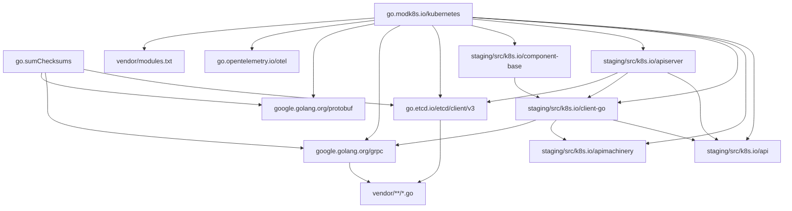
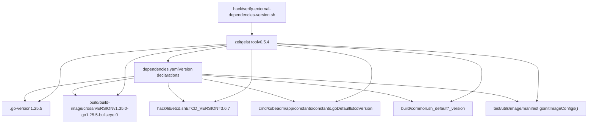
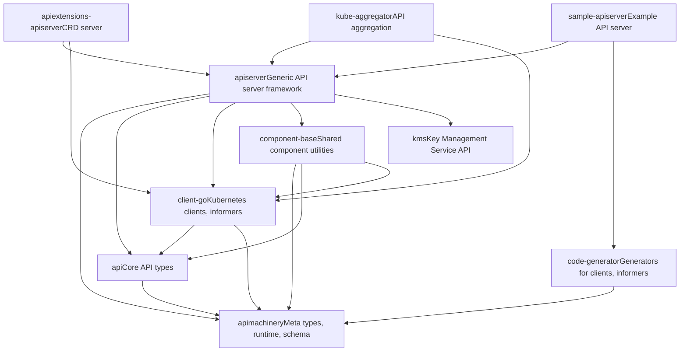
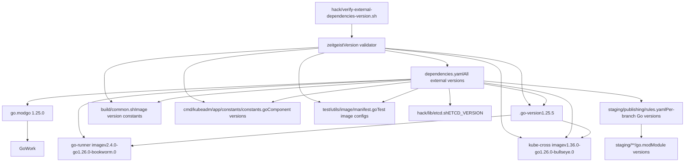

# Dependency Management

Relevant source files

-   [.go-version](https://github.com/kubernetes/kubernetes/blob/2757a872/.go-version)
-   [build/build-image/cross/VERSION](https://github.com/kubernetes/kubernetes/blob/2757a872/build/build-image/cross/VERSION)
-   [build/common.sh](https://github.com/kubernetes/kubernetes/blob/2757a872/build/common.sh)
-   [build/dependencies.yaml](https://github.com/kubernetes/kubernetes/blob/2757a872/build/dependencies.yaml)
-   [cluster/gce/manifests/etcd.manifest](https://github.com/kubernetes/kubernetes/blob/2757a872/cluster/gce/manifests/etcd.manifest)
-   [cluster/gce/upgrade-aliases.sh](https://github.com/kubernetes/kubernetes/blob/2757a872/cluster/gce/upgrade-aliases.sh)
-   [cmd/kubeadm/app/constants/constants.go](https://github.com/kubernetes/kubernetes/blob/2757a872/cmd/kubeadm/app/constants/constants.go)
-   [cmd/kubeadm/app/constants/constants\_test.go](https://github.com/kubernetes/kubernetes/blob/2757a872/cmd/kubeadm/app/constants/constants_test.go)
-   [cmd/kubeadm/app/constants/constants\_unix.go](https://github.com/kubernetes/kubernetes/blob/2757a872/cmd/kubeadm/app/constants/constants_unix.go)
-   [cmd/kubeadm/app/constants/constants\_windows.go](https://github.com/kubernetes/kubernetes/blob/2757a872/cmd/kubeadm/app/constants/constants_windows.go)
-   [cmd/kubeadm/app/images/images.go](https://github.com/kubernetes/kubernetes/blob/2757a872/cmd/kubeadm/app/images/images.go)
-   [cmd/kubeadm/app/images/images\_test.go](https://github.com/kubernetes/kubernetes/blob/2757a872/cmd/kubeadm/app/images/images_test.go)
-   [cmd/kubeadm/app/phases/patchnode/patchnode\_test.go](https://github.com/kubernetes/kubernetes/blob/2757a872/cmd/kubeadm/app/phases/patchnode/patchnode_test.go)
-   [go.work](https://github.com/kubernetes/kubernetes/blob/2757a872/go.work)
-   [hack/lib/etcd.sh](https://github.com/kubernetes/kubernetes/blob/2757a872/hack/lib/etcd.sh)
-   [hack/lib/golang.sh](https://github.com/kubernetes/kubernetes/blob/2757a872/hack/lib/golang.sh)
-   [staging/README.md](https://github.com/kubernetes/kubernetes/blob/2757a872/staging/README.md?plain=1)
-   [staging/publishing/import-restrictions.yaml](https://github.com/kubernetes/kubernetes/blob/2757a872/staging/publishing/import-restrictions.yaml)
-   [staging/publishing/rules.yaml](https://github.com/kubernetes/kubernetes/blob/2757a872/staging/publishing/rules.yaml)
-   [staging/src/k8s.io/sample-apiserver/artifacts/example/deployment.yaml](https://github.com/kubernetes/kubernetes/blob/2757a872/staging/src/k8s.io/sample-apiserver/artifacts/example/deployment.yaml)
-   [test/e2e/framework/nodes\_util.go](https://github.com/kubernetes/kubernetes/blob/2757a872/test/e2e/framework/nodes_util.go)
-   [test/e2e/framework/providers/gcp.go](https://github.com/kubernetes/kubernetes/blob/2757a872/test/e2e/framework/providers/gcp.go)
-   [test/e2e/upgrades/network/kube\_proxy\_migration.go](https://github.com/kubernetes/kubernetes/blob/2757a872/test/e2e/upgrades/network/kube_proxy_migration.go)
-   [test/e2e/windows/device\_plugin.go](https://github.com/kubernetes/kubernetes/blob/2757a872/test/e2e/windows/device_plugin.go)
-   [test/images/Makefile](https://github.com/kubernetes/kubernetes/blob/2757a872/test/images/Makefile)
-   [test/utils/image/manifest.go](https://github.com/kubernetes/kubernetes/blob/2757a872/test/utils/image/manifest.go)
-   [test/utils/image/manifest\_test.go](https://github.com/kubernetes/kubernetes/blob/2757a872/test/utils/image/manifest_test.go)

## Purpose and Scope

This document describes how the Kubernetes repository manages its dependencies, including Go module dependencies, external tool versions, vendored code, and the staging module architecture. It covers the mechanisms for version tracking, dependency resolution, and the publishing workflow for Kubernetes client libraries.

For information about the build system that uses these dependencies, see [Build and Release Process](/kubernetes/kubernetes/7.2-build-and-release-process).

---

## Go Module System

Kubernetes uses Go modules for dependency management, with the main module defined at [go.mod1-253](https://github.com/kubernetes/kubernetes/blob/2757a872/go.mod#L1-L253)

### Module Declaration and Go Version

The repository requires Go 1.26.0 and sets the default godebug mode:

```
module k8s.io/kubernetes go 1.26.0 godebug default=go1.26
```
**Sources:** [go.mod7-11](https://github.com/kubernetes/kubernetes/blob/2757a872/go.mod#L7-L11) [.go-version1](https://github.com/kubernetes/kubernetes/blob/2757a872/.go-version#L1-L1)

### Direct Dependencies

The main `go.mod` file declares approximately 120 direct dependencies in the `require` block, spanning:

-   **Core infrastructure**: etcd client libraries, gRPC, Protocol Buffers
-   **Observability**: OpenTelemetry instrumentation and exporters
-   **Authentication**: OAuth2, OIDC, JWT libraries
-   **Container runtimes**: CRI API, containerd types
-   **Utilities**: CLI frameworks (cobra, pflag), testing (ginkgo, gomega), YAML parsers

Key direct dependencies include:

| Dependency | Version | Purpose |
| --- | --- | --- |
| `go.etcd.io/etcd/client/v3` | v3.6.6 | etcd client for cluster state storage |
| `google.golang.org/grpc` | v1.75.0 | RPC framework for inter-component communication |
| `github.com/onsi/ginkgo/v2` | v2.27.4 | BDD testing framework for E2E tests |
| `github.com/spf13/cobra` | v1.10.0 | CLI command framework |
| `github.com/prometheus/client_golang` | v1.23.2 | Metrics instrumentation |

These versions are specified in the `require` block at [go.mod13-123](https://github.com/kubernetes/kubernetes/blob/2757a872/go.mod#L13-L123)

**Sources:** [go.mod13-123](https://github.com/kubernetes/kubernetes/blob/2757a872/go.mod#L13-L123)

### Indirect Dependencies

The `require` section starting at line 125 declares ~100 indirect dependencies. These are transitive dependencies pulled in by direct dependencies but explicitly tracked to ensure reproducible builds.

**Sources:** [go.mod125-219](https://github.com/kubernetes/kubernetes/blob/2757a872/go.mod#L125-L219)

### Replace Directives for Staging Modules

A critical feature of the Kubernetes dependency structure is the use of `replace` directives to map staging modules to local filesystem paths:

```
replace (    k8s.io/api => ./staging/src/k8s.io/api    k8s.io/apiextensions-apiserver => ./staging/src/k8s.io/apiextensions-apiserver    k8s.io/apimachinery => ./staging/src/k8s.io/apimachinery    k8s.io/apiserver => ./staging/src/k8s.io/apiserver    k8s.io/client-go => ./staging/src/k8s.io/client-go    // ... 20+ more staging modules)
```
These directives allow the monorepo to reference staging modules that are published as independent repositories while developing them in-tree. During local development, Go resolves these imports to the `staging/src/k8s.io/*` directories.

**Sources:** [go.mod221-253](https://github.com/kubernetes/kubernetes/blob/2757a872/go.mod#L221-L253)

### Dependency Resolution Flow


**Dependency Resolution Flow Diagram**

**Sources:** [go.mod1-253](https://github.com/kubernetes/kubernetes/blob/2757a872/go.mod#L1-L253) [staging/src/k8s.io/apiserver/go.mod1-133](https://github.com/kubernetes/kubernetes/blob/2757a872/staging/src/k8s.io/apiserver/go.mod#L1-L133) [staging/src/k8s.io/client-go/go.mod1-133](https://github.com/kubernetes/kubernetes/blob/2757a872/staging/src/k8s.io/client-go/go.mod#L1-L133)

---

## External Dependencies Tracking

While Go modules manage Go dependencies, Kubernetes tracks external binary tools and container image versions in `build/dependencies.yaml`.

### Zeitgeist Tool

The dependencies are validated using the `zeitgeist` tool (v0.5.4), which verifies that version references in the codebase match the declared versions:

```
- name: "zeitgeist"  version: "v0.5.4"  refPaths:  - path: hack/verify-external-dependencies-version.sh    match: sigs.k8s.io/zeitgeist@v.*
```
**Sources:** [build/dependencies.yaml13-17](https://github.com/kubernetes/kubernetes/blob/2757a872/build/dependencies.yaml#L13-L17)

### Container Network Interface (CNI)

CNI plugins version 1.9.0 is referenced across multiple locations:

```
- name: "cni"  version: 1.9.0  refPaths:  - path: cluster/gce/config-common.sh    match: WINDOWS_CNI_VERSION=  - path: cluster/gce/gci/configure.sh    match: DEFAULT_CNI_VERSION=  - path: test/e2e_node/remote/utils.go    match: cniVersion[\t\n\f\r ]*=  - path: hack/local-up-cluster.sh    match: CNI_PLUGINS_VERSION=
```
**Sources:** [build/dependencies.yaml20-30](https://github.com/kubernetes/kubernetes/blob/2757a872/build/dependencies.yaml#L20-L30)

### CoreDNS Versions

CoreDNS is tracked separately for kube-up and kubeadm deployment methods:

```
- name: "coredns-kube-up"  version: 1.14.1  refPaths:  - path: cluster/addons/dns/coredns/coredns.yaml.base    match: registry.k8s.io/coredns    - name: "coredns-kubeadm"  version: 1.14.1  refPaths:  - path: cmd/kubeadm/app/constants/constants.go    match: CoreDNSVersion =
```
The kubeadm reference points to the `CoreDNSVersion` constant at [cmd/kubeadm/app/constants/constants.go367](https://github.com/kubernetes/kubernetes/blob/2757a872/cmd/kubeadm/app/constants/constants.go#L367-L367)

**Sources:** [build/dependencies.yaml33-47](https://github.com/kubernetes/kubernetes/blob/2757a872/build/dependencies.yaml#L33-L47) [cmd/kubeadm/app/constants/constants.go367](https://github.com/kubernetes/kubernetes/blob/2757a872/cmd/kubeadm/app/constants/constants.go#L367-L367)

### etcd Version

The etcd version (3.6.8) is referenced across the codebase:

```
- name: "etcd"  version: 3.6.8  refPaths:  - path: cluster/gce/manifests/etcd.manifest    match: etcd_docker_tag|etcd_version  - path: cluster/gce/upgrade-aliases.sh    match: ETCD_IMAGE|ETCD_VERSION  - path: cmd/kubeadm/app/constants/constants.go    match: DefaultEtcdVersion =  - path: hack/lib/etcd.sh    match: ETCD_VERSION=  - path: staging/src/k8s.io/sample-apiserver/artifacts/example/deployment.yaml    match: registry.k8s.io/etcd  - path: test/utils/image/manifest.go    match: configs\[Etcd\] = Config{list\.GcEtcdRegistry, "etcd", "\d+\.\d+.\d+(-(alpha|beta|rc).\d+)?(-\d+)?"}
```
The constant `DefaultEtcdVersion` is defined at [cmd/kubeadm/app/constants/constants.go329](https://github.com/kubernetes/kubernetes/blob/2757a872/cmd/kubeadm/app/constants/constants.go#L329-L329) with the value `"3.6.8-0"`. The version used by `hack/lib/etcd.sh` is specified at [hack/lib/etcd.sh19](https://github.com/kubernetes/kubernetes/blob/2757a872/hack/lib/etcd.sh#L19-L19) as `ETCD_VERSION=${ETCD_VERSION:-3.6.8}`.

**Sources:** [build/dependencies.yaml66-82](https://github.com/kubernetes/kubernetes/blob/2757a872/build/dependencies.yaml#L66-L82) [cmd/kubeadm/app/constants/constants.go329](https://github.com/kubernetes/kubernetes/blob/2757a872/cmd/kubeadm/app/constants/constants.go#L329-L329) [hack/lib/etcd.sh19](https://github.com/kubernetes/kubernetes/blob/2757a872/hack/lib/etcd.sh#L19-L19) [cluster/gce/upgrade-aliases.sh173-174](https://github.com/kubernetes/kubernetes/blob/2757a872/cluster/gce/upgrade-aliases.sh#L173-L174)

### Golang Version Management

The Go toolchain version is tracked in multiple places to ensure consistency:

```
- name: "golang: 1.<major>"  version: 1.26  refPaths:  - path: build/build-image/cross/VERSION  - path: hack/lib/golang.sh    match: minimum_go_version=go([0-9]+\.[0-9]+)
```
The canonical Go version is stored in [.go-version1](https://github.com/kubernetes/kubernetes/blob/2757a872/.go-version#L1-L1) as `1.26.1`. This version is embedded in the kube-cross container image:

```
- name: "registry.k8s.io/kube-cross: dependents"  version: v1.36.0-go1.26.0-bullseye.0  refPaths:  - path: build/build-image/cross/VERSION
```
The `minimum_go_version` variable in [hack/lib/golang.sh154](https://github.com/kubernetes/kubernetes/blob/2757a872/hack/lib/golang.sh#L154-L154) ensures builds fail if an older Go version is used.

**Sources:** [build/dependencies.yaml144-154](https://github.com/kubernetes/kubernetes/blob/2757a872/build/dependencies.yaml#L144-L154) [build/build-image/cross/VERSION1](https://github.com/kubernetes/kubernetes/blob/2757a872/build/build-image/cross/VERSION#L1-L1) [.go-version1](https://github.com/kubernetes/kubernetes/blob/2757a872/.go-version#L1-L1) [hack/lib/golang.sh154](https://github.com/kubernetes/kubernetes/blob/2757a872/hack/lib/golang.sh#L154-L154)

### Base Images

Several base container images are tracked for building Kubernetes components:

| Image | Version | Purpose |
| --- | --- | --- |
| `debian-base` | bookworm-v1.0.6 | Base for dynamically linked binaries |
| `distroless-iptables` | v0.9.0 | Base for kube-proxy with iptables |
| `go-runner` | v2.4.0-go1.26.0-bookworm.0 | Base for statically linked binaries |
| `setcap` | bookworm-v1.0.6 | Multi-stage build image for setting capabilities |
| `pause` | 3.10 | Minimal pause container for pods |

These versions are referenced in build scripts. The default base images are defined in [build/common.sh80-116](https://github.com/kubernetes/kubernetes/blob/2757a872/build/common.sh#L80-L116):

-   `__default_distroless_iptables_version` at line 80
-   `__default_go_runner_version` at line 81
-   `__default_setcap_version` at line 82
-   `KUBE_GORUNNER_IMAGE` at line 95
-   `__default_dynamic_base_image` at line 88
-   `KUBE_BUILD_SETCAP_IMAGE` at line 116

**Sources:** [build/dependencies.yaml157-249](https://github.com/kubernetes/kubernetes/blob/2757a872/build/dependencies.yaml#L157-L249) [build/common.sh80-116](https://github.com/kubernetes/kubernetes/blob/2757a872/build/common.sh#L80-L116)

### External Dependency Tracking Flow


**External Dependency Tracking Diagram**

**Sources:** [build/dependencies.yaml1-248](https://github.com/kubernetes/kubernetes/blob/2757a872/build/dependencies.yaml#L1-L248) [hack/verify-external-dependencies-version.sh16-17](https://github.com/kubernetes/kubernetes/blob/2757a872/hack/verify-external-dependencies-version.sh#L16-L17)

---

## Vendoring Strategy

Kubernetes vendors all external Go dependencies into the `vendor/` directory for reproducible builds and to ensure the repository can be built without network access.

### Vendor Directory Structure

The `vendor/modules.txt` file serves as a manifest of all vendored modules:

```
## workspace
# bitbucket.org/bertimus9/systemstat v0.5.0
## explicit; go 1.17
bitbucket.org/bertimus9/systemstat
# cel.dev/expr v0.24.0
## explicit; go 1.22.0
cel.dev/expr
# github.com/Azure/go-ansiterm v0.0.0-20230124172434-306776ec8161
## explicit; go 1.16
github.com/Azure/go-ansiterm
github.com/Azure/go-ansiterm/winterm
```
Each entry includes:

-   The module path and version
-   Whether it's an explicit or implicit dependency
-   The minimum Go version required by the module
-   The list of packages provided by the module

**Sources:** [vendor/modules.txt1-1828](https://github.com/kubernetes/kubernetes/blob/2757a872/vendor/modules.txt#L1-L1828)

### Vendoring Workflow

The vendoring process is managed by scripts in the `hack/` directory:

1.  **Update vendor directory**: `hack/update-vendor.sh` runs `go mod vendor` to populate the `vendor/` directory
2.  **Pin dependency**: `hack/pin-dependency.sh` updates a specific dependency version in `go.mod`

The build system references vendored dependencies through the `-mod=vendor` flag, ensuring builds use the vendored code rather than fetching from the network.

**Sources:** [go.mod1-6](https://github.com/kubernetes/kubernetes/blob/2757a872/go.mod#L1-L6)

### Why Vendoring?

The comments in `go.mod` explain the rationale:

```
// This is a generated file. Do not edit directly.// Ensure you've carefully read// https://git.k8s.io/community/contributors/devel/sig-architecture/vendor.md// Run hack/pin-dependency.sh to change pinned dependency versions.// Run hack/update-vendor.sh to update go.mod files and the vendor directory.
```
Vendoring provides:

-   **Reproducibility**: Exact dependency code is checked in
-   **Offline builds**: No network required during builds
-   **Auditing**: All dependency code is visible in the repository
-   **Stability**: Protection against upstream changes or disappearances

**Sources:** [go.mod1-6](https://github.com/kubernetes/kubernetes/blob/2757a872/go.mod#L1-L6)

---

## Staging Module Architecture

Staging modules are a key architectural pattern in Kubernetes, allowing client libraries and shared components to be developed in the monorepo but published as independent Go modules.

### Staging Module Layout

The `staging/src/k8s.io/` directory contains ~20 modules that are published independently:

```
staging/src/k8s.io/
├── api/                          # API types
├── apimachinery/                 # API machinery (meta types, runtime)
├── client-go/                    # Client library
├── apiserver/                    # API server framework
├── apiextensions-apiserver/      # CRD server
├── kube-aggregator/              # API aggregation
├── component-base/               # Shared components
├── kubectl/                      # kubectl library
├── kubelet/                      # Kubelet API
├── ... (15+ more)
```
Each staging module has its own `go.mod` file with dependencies on other staging modules.

**Sources:** [staging/src/k8s.io/apiserver/go.mod1-133](https://github.com/kubernetes/kubernetes/blob/2757a872/staging/src/k8s.io/apiserver/go.mod#L1-L133) [staging/src/k8s.io/client-go/go.mod1-133](https://github.com/kubernetes/kubernetes/blob/2757a872/staging/src/k8s.io/client-go/go.mod#L1-L133)

### Dependency Relationships

Staging modules form a dependency graph. For example, `client-go` depends on `api` and `apimachinery`:

```
// staging/src/k8s.io/client-go/go.modmodule k8s.io/client-go require (    k8s.io/api v0.0.0    k8s.io/apimachinery v0.0.0    // ...) replace (    k8s.io/api => ../api    k8s.io/apimachinery => ../apimachinery)
```
The `v0.0.0` versions are placeholders; replace directives point to sibling directories during development.

**Sources:** [staging/src/k8s.io/client-go/go.mod1-133](https://github.com/kubernetes/kubernetes/blob/2757a872/staging/src/k8s.io/client-go/go.mod#L1-L133)

### Publishing Rules

The `staging/publishing/rules.yaml` file defines how staging modules are published to their respective repositories:

```
rules:- destination: apimachinery  branches:  - name: master    source:      branch: master      dirs:      - staging/src/k8s.io/apimachinery  - name: release-1.35    go: 1.25.5    source:      branch: release-1.35      dirs:      - staging/src/k8s.io/apimachinery  library: true
```
Each rule specifies:

-   **destination**: Target repository name (e.g., `apimachinery` publishes to `k8s.io/apimachinery`)
-   **branches**: Which kubernetes branches map to which published branches
-   **go**: Required Go version for that branch
-   **dependencies**: Other staging modules this module depends on
-   **library**: Whether it's a library module (vs. a command)

**Sources:** [staging/publishing/rules.yaml1-33](https://github.com/kubernetes/kubernetes/blob/2757a872/staging/publishing/rules.yaml#L1-L33)

### Publishing Workflow for client-go

The `client-go` module has dependencies on `api` and `apimachinery`:

```
- destination: client-go  branches:  - name: master    dependencies:    - repository: apimachinery      branch: master    - repository: api      branch: master    source:      branch: master      dirs:      - staging/src/k8s.io/client-go    smoke-test: |      go build -mod=mod ./...      go test -mod=mod ./...
```
The publishing automation:

1.  Syncs code from `staging/src/k8s.io/client-go` to the `client-go` repository
2.  Updates `go.mod` to reference published versions of dependencies
3.  Runs smoke tests to verify the published module builds
4.  Tags the release

**Sources:** [staging/publishing/rules.yaml81-157](https://github.com/kubernetes/kubernetes/blob/2757a872/staging/publishing/rules.yaml#L81-L157)

### Staging Module Dependency Graph


**Staging Module Dependency Graph**

**Sources:** [staging/publishing/rules.yaml1-810](https://github.com/kubernetes/kubernetes/blob/2757a872/staging/publishing/rules.yaml#L1-L810) [staging/src/k8s.io/apiserver/go.mod1-133](https://github.com/kubernetes/kubernetes/blob/2757a872/staging/src/k8s.io/apiserver/go.mod#L1-L133) [staging/src/k8s.io/client-go/go.mod1-133](https://github.com/kubernetes/kubernetes/blob/2757a872/staging/src/k8s.io/client-go/go.mod#L1-L133)

---

## Version Management and Consistency

Maintaining version consistency across the Kubernetes codebase involves several mechanisms.

### Go Version Requirements

The Go version requirement appears in multiple files and must be kept in sync:

| File | Location | Format |
| --- | --- | --- |
| `.go-version` | Root | `1.26.1` |
| `go.mod` | Line 9 | `go 1.26.0` (minor version) |
| `go.work` | Line 3 | `go 1.26.0` (workspace) |
| `build/build-image/cross/VERSION` | Line 1 | `v1.36.0-go1.26.0-bullseye.0` |
| `build/common.sh` | Line 81 | `__default_go_runner_version=v2.4.0-go1.26.0-bookworm.0` |
| `hack/lib/golang.sh` | Line 154 | `minimum_go_version=go([0-9]+\.[0-9]+)` pattern |

The `dependencies.yaml` file tracks references to ensure they stay in sync through the `golang: 1.<major>` entry at [build/dependencies.yaml149-154](https://github.com/kubernetes/kubernetes/blob/2757a872/build/dependencies.yaml#L149-L154)

**Sources:** [build/dependencies.yaml149-154](https://github.com/kubernetes/kubernetes/blob/2757a872/build/dependencies.yaml#L149-L154) [.go-version1](https://github.com/kubernetes/kubernetes/blob/2757a872/.go-version#L1-L1) [go.mod9](https://github.com/kubernetes/kubernetes/blob/2757a872/go.mod#L9-L9) [go.work3](https://github.com/kubernetes/kubernetes/blob/2757a872/go.work#L3-L3) [build/build-image/cross/VERSION1](https://github.com/kubernetes/kubernetes/blob/2757a872/build/build-image/cross/VERSION#L1-L1) [build/common.sh81](https://github.com/kubernetes/kubernetes/blob/2757a872/build/common.sh#L81-L81) [hack/lib/golang.sh154](https://github.com/kubernetes/kubernetes/blob/2757a872/hack/lib/golang.sh#L154-L154)

### Image Manifest Version Management

Test images are tracked in `test/utils/image/manifest.go` using the `initImageConfigs()` function at [test/utils/image/manifest.go209-252](https://github.com/kubernetes/kubernetes/blob/2757a872/test/utils/image/manifest.go#L209-L252) The function creates a map from `ImageID` constants to `Config` structs:

```
func initImageConfigs(list RegistryList) (map[ImageID]Config, map[ImageID]Config) {    configs := map[ImageID]Config{}    configs[Etcd] = Config{list.GcEtcdRegistry, "etcd", "3.6.8-0"}    configs[Pause] = Config{list.GcRegistry, "pause", "3.10.1"}    configs[DistrolessIptables] = Config{list.BuildImageRegistry, "distroless-iptables", "v0.9.0"}    configs[Agnhost] = Config{list.PromoterE2eRegistry, "agnhost", "2.63.0"}    // ...}
```
These versions are cross-referenced in `dependencies.yaml`. For example, the pause image:

```
- name: "registry.k8s.io/pause: dependents"  version: 3.10  refPaths:  - path: cluster/gce/config-common.sh    match: registry.k8s.io\/pause:\d+\.\d+  - path: cmd/kubeadm/app/constants/constants.go    match: PauseVersion\s+=  - path: test/utils/image/manifest.go    match: configs\[Pause\] = Config{list\.GcRegistry, "pause", "\d+\.\d+(.\d+)?"}
```
The `PauseVersion` constant is defined at [cmd/kubeadm/app/constants/constants.go192](https://github.com/kubernetes/kubernetes/blob/2757a872/cmd/kubeadm/app/constants/constants.go#L192-L192)

**Sources:** [test/utils/image/manifest.go209-252](https://github.com/kubernetes/kubernetes/blob/2757a872/test/utils/image/manifest.go#L209-L252) [build/dependencies.yaml197-243](https://github.com/kubernetes/kubernetes/blob/2757a872/build/dependencies.yaml#L197-L243) [cmd/kubeadm/app/constants/constants.go192](https://github.com/kubernetes/kubernetes/blob/2757a872/cmd/kubeadm/app/constants/constants.go#L192-L192)

### Dependency Update Process

The typical workflow for updating a dependency:

1.  **Pin new version**: Run `hack/pin-dependency.sh <module> <version>`

    -   Updates `go.mod` with the new version
2.  **Update vendor**: Run `hack/update-vendor.sh`

    -   Runs `go mod tidy`
    -   Runs `go mod vendor`
    -   Updates all `go.mod` files in staging modules
    -   Updates `vendor/` directory
3.  **Update external dependencies**: Edit `build/dependencies.yaml`

    -   Update version number
    -   Ensure all `refPaths` are current
4.  **Verify consistency**: Run `hack/verify-external-dependencies-version.sh`

    -   Runs zeitgeist to validate all references match
5.  **Test**: Run relevant test suites to ensure compatibility


**Sources:** [go.mod1-6](https://github.com/kubernetes/kubernetes/blob/2757a872/go.mod#L1-L6) [build/dependencies.yaml1-17](https://github.com/kubernetes/kubernetes/blob/2757a872/build/dependencies.yaml#L1-L17)

### Version Synchronization Architecture


**Version Synchronization Mechanism Diagram**

**Sources:** [build/dependencies.yaml1-248](https://github.com/kubernetes/kubernetes/blob/2757a872/build/dependencies.yaml#L1-L248) [staging/publishing/rules.yaml1-810](https://github.com/kubernetes/kubernetes/blob/2757a872/staging/publishing/rules.yaml#L1-L810) [build/common.sh83-97](https://github.com/kubernetes/kubernetes/blob/2757a872/build/common.sh#L83-L97)

---

## Summary

Kubernetes dependency management involves multiple coordinated systems:

1.  **Go Modules** (`go.mod`, `go.sum`) manage Go library dependencies with replace directives for staging modules
2.  **External Dependencies** (`dependencies.yaml`) track binary tools, container images, and their versions across the codebase
3.  **Vendoring** ensures reproducible, offline builds with all dependencies checked into `vendor/`
4.  **Staging Modules** allow client libraries to be developed in-tree but published independently with `staging/publishing/rules.yaml` defining the publishing workflow
5.  **Version Consistency** is maintained through zeitgeist validation and careful tracking of Go versions, image tags, and tool versions across multiple files

The system balances the needs of monorepo development with the requirement to publish stable, versioned client libraries that external consumers can depend on.

**Sources:** [go.mod1-253](https://github.com/kubernetes/kubernetes/blob/2757a872/go.mod#L1-L253) [build/dependencies.yaml1-248](https://github.com/kubernetes/kubernetes/blob/2757a872/build/dependencies.yaml#L1-L248) [vendor/modules.txt1-1828](https://github.com/kubernetes/kubernetes/blob/2757a872/vendor/modules.txt#L1-L1828) [staging/publishing/rules.yaml1-810](https://github.com/kubernetes/kubernetes/blob/2757a872/staging/publishing/rules.yaml#L1-L810)
