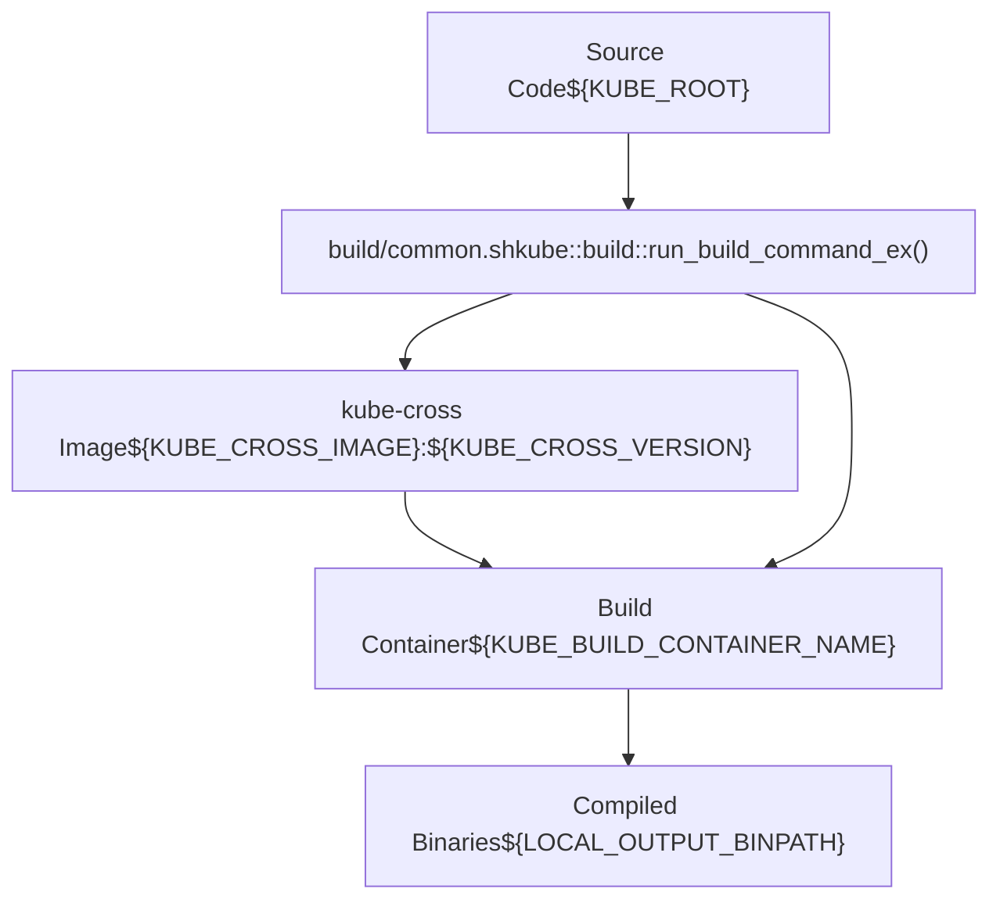
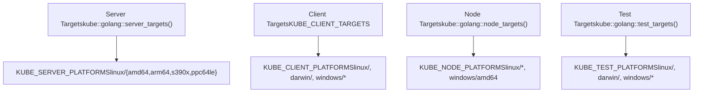
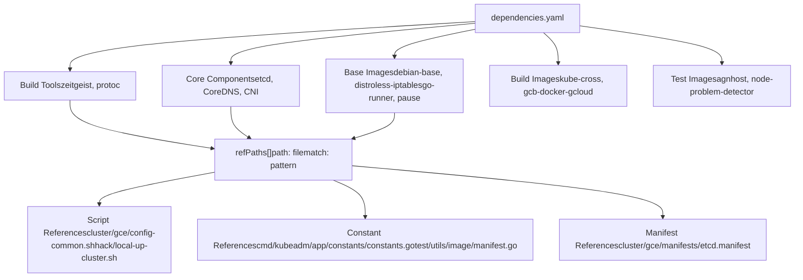
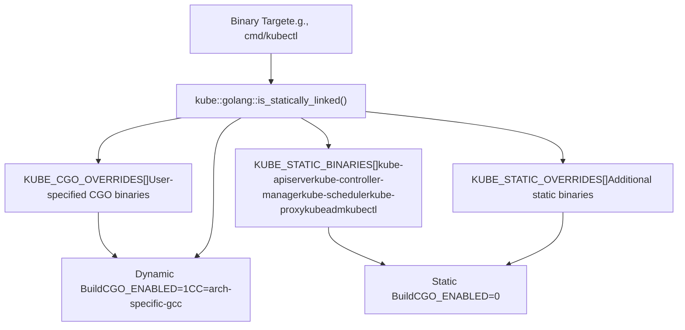
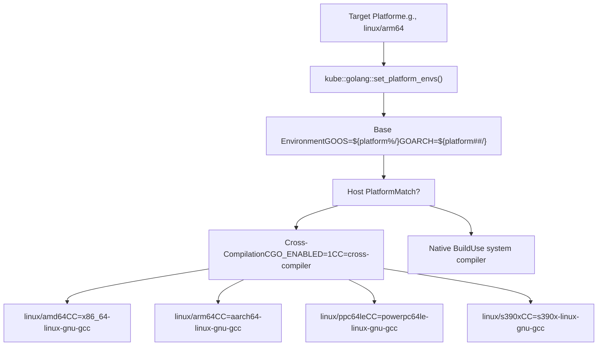
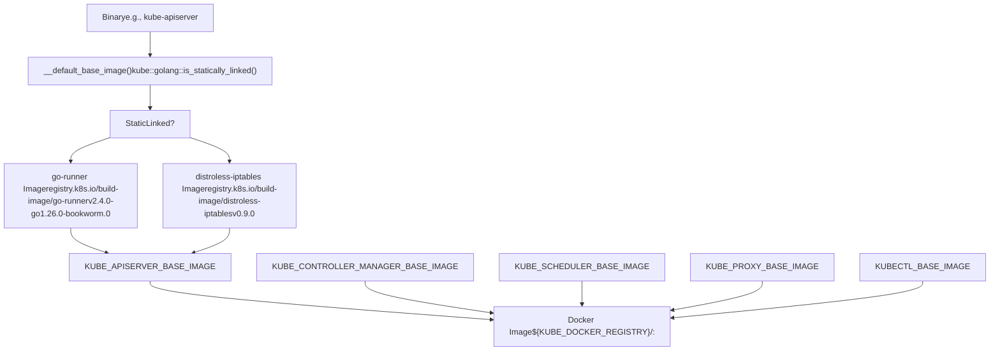
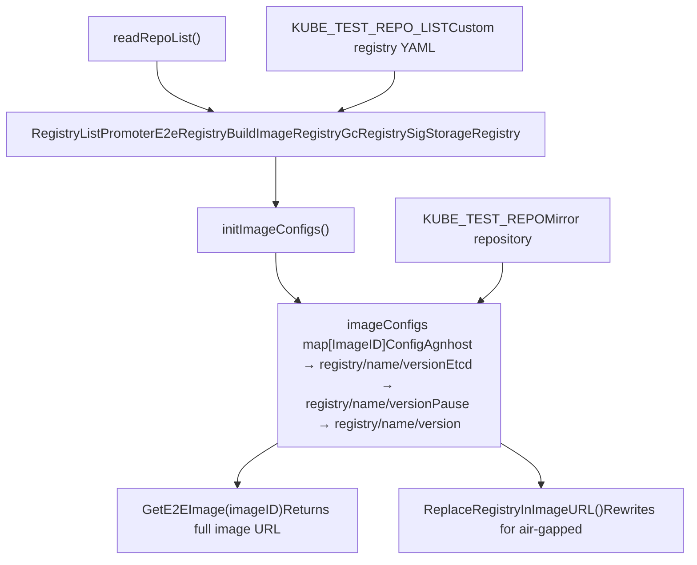
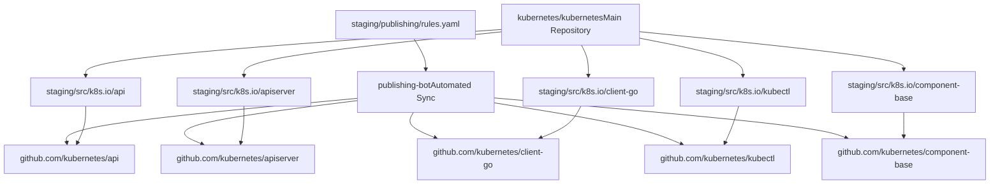
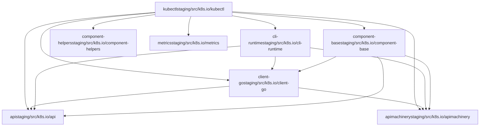
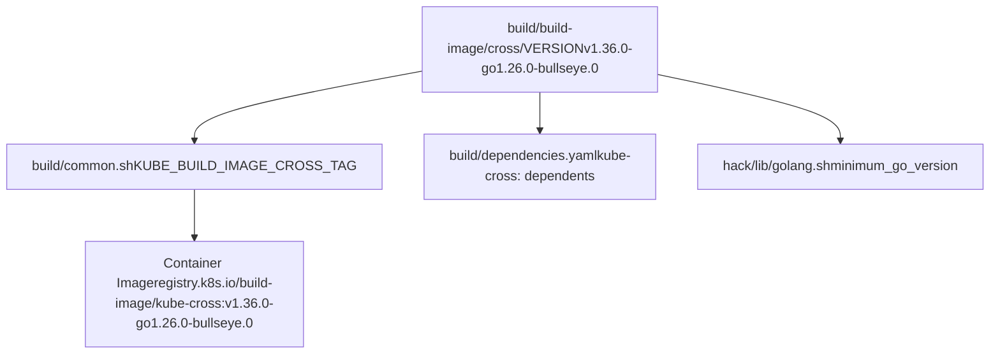

# Build and Release Process

Relevant source files

-   [.go-version](https://github.com/kubernetes/kubernetes/blob/2757a872/.go-version)
-   [build/build-image/cross/VERSION](https://github.com/kubernetes/kubernetes/blob/2757a872/build/build-image/cross/VERSION)
-   [build/common.sh](https://github.com/kubernetes/kubernetes/blob/2757a872/build/common.sh)
-   [build/dependencies.yaml](https://github.com/kubernetes/kubernetes/blob/2757a872/build/dependencies.yaml)
-   [cluster/gce/manifests/etcd.manifest](https://github.com/kubernetes/kubernetes/blob/2757a872/cluster/gce/manifests/etcd.manifest)
-   [cluster/gce/upgrade-aliases.sh](https://github.com/kubernetes/kubernetes/blob/2757a872/cluster/gce/upgrade-aliases.sh)
-   [cmd/kubeadm/app/constants/constants.go](https://github.com/kubernetes/kubernetes/blob/2757a872/cmd/kubeadm/app/constants/constants.go)
-   [cmd/kubeadm/app/constants/constants\_test.go](https://github.com/kubernetes/kubernetes/blob/2757a872/cmd/kubeadm/app/constants/constants_test.go)
-   [cmd/kubeadm/app/constants/constants\_unix.go](https://github.com/kubernetes/kubernetes/blob/2757a872/cmd/kubeadm/app/constants/constants_unix.go)
-   [cmd/kubeadm/app/constants/constants\_windows.go](https://github.com/kubernetes/kubernetes/blob/2757a872/cmd/kubeadm/app/constants/constants_windows.go)
-   [cmd/kubeadm/app/images/images.go](https://github.com/kubernetes/kubernetes/blob/2757a872/cmd/kubeadm/app/images/images.go)
-   [cmd/kubeadm/app/images/images\_test.go](https://github.com/kubernetes/kubernetes/blob/2757a872/cmd/kubeadm/app/images/images_test.go)
-   [cmd/kubeadm/app/phases/patchnode/patchnode\_test.go](https://github.com/kubernetes/kubernetes/blob/2757a872/cmd/kubeadm/app/phases/patchnode/patchnode_test.go)
-   [go.work](https://github.com/kubernetes/kubernetes/blob/2757a872/go.work)
-   [hack/lib/etcd.sh](https://github.com/kubernetes/kubernetes/blob/2757a872/hack/lib/etcd.sh)
-   [hack/lib/golang.sh](https://github.com/kubernetes/kubernetes/blob/2757a872/hack/lib/golang.sh)
-   [staging/README.md](https://github.com/kubernetes/kubernetes/blob/2757a872/staging/README.md?plain=1)
-   [staging/publishing/import-restrictions.yaml](https://github.com/kubernetes/kubernetes/blob/2757a872/staging/publishing/import-restrictions.yaml)
-   [staging/publishing/rules.yaml](https://github.com/kubernetes/kubernetes/blob/2757a872/staging/publishing/rules.yaml)
-   [staging/src/k8s.io/sample-apiserver/artifacts/example/deployment.yaml](https://github.com/kubernetes/kubernetes/blob/2757a872/staging/src/k8s.io/sample-apiserver/artifacts/example/deployment.yaml)
-   [test/e2e/framework/nodes\_util.go](https://github.com/kubernetes/kubernetes/blob/2757a872/test/e2e/framework/nodes_util.go)
-   [test/e2e/framework/providers/gcp.go](https://github.com/kubernetes/kubernetes/blob/2757a872/test/e2e/framework/providers/gcp.go)
-   [test/e2e/upgrades/network/kube\_proxy\_migration.go](https://github.com/kubernetes/kubernetes/blob/2757a872/test/e2e/upgrades/network/kube_proxy_migration.go)
-   [test/e2e/windows/device\_plugin.go](https://github.com/kubernetes/kubernetes/blob/2757a872/test/e2e/windows/device_plugin.go)
-   [test/images/Makefile](https://github.com/kubernetes/kubernetes/blob/2757a872/test/images/Makefile)
-   [test/utils/image/manifest.go](https://github.com/kubernetes/kubernetes/blob/2757a872/test/utils/image/manifest.go)
-   [test/utils/image/manifest\_test.go](https://github.com/kubernetes/kubernetes/blob/2757a872/test/utils/image/manifest_test.go)

This document describes the Kubernetes build system architecture, including cross-compilation, dependency management, binary generation, and container image creation. It covers the mechanisms for building Kubernetes components for multiple platforms, managing external dependencies, and publishing staging repositories.

For information about dependency management via Go modules, see [Go Modules and Staging](/kubernetes/kubernetes/7.3-go-modules-and-staging). For cluster deployment tools, see [Cluster Bootstrap and Management](/kubernetes/kubernetes/5-cluster-bootstrap-and-management).

---

## Build System Architecture

The Kubernetes build system uses Docker-based cross-compilation to produce binaries and container images for multiple platforms. The core build infrastructure is implemented in shell scripts that orchestrate Docker containers, Go toolchain configuration, and artifact generation.

### Build Environment Setup

The build system initializes through [build/common.sh1-193](https://github.com/kubernetes/kubernetes/blob/2757a872/build/common.sh#L1-L193) which establishes build constants and environment variables. Key configuration includes:

| Configuration | Variable | Default Value |
| --- | --- | --- |
| Build Image | `KUBE_CROSS_IMAGE` | `registry.k8s.io/build-image/kube-cross` |
| Build Image Tag | `KUBE_BUILD_IMAGE_CROSS_TAG` | From [build/build-image/cross/VERSION1](https://github.com/kubernetes/kubernetes/blob/2757a872/build/build-image/cross/VERSION#L1-L1) |
| Output Root | `LOCAL_OUTPUT_ROOT` | `_output` |
| Output Binaries | `LOCAL_OUTPUT_BINPATH` | `_output/dockerized/bin` |
| Go Package | `KUBE_GO_PACKAGE` | `k8s.io/kubernetes` |

The build container is named using a hash of the hostname, repository root, and git branch: `KUBE_BUILD_CONTAINER_NAME_BASE="kube-build-${KUBE_ROOT_HASH}"` [build/common.sh150-156](https://github.com/kubernetes/kubernetes/blob/2757a872/build/common.sh#L150-L156)

### Cross-Compilation with kube-cross

The `kube-cross` Docker image provides a complete cross-compilation toolchain. The build system mounts the source tree into the container and executes compilation commands:


**Sources:** [build/common.sh358-473](https://github.com/kubernetes/kubernetes/blob/2757a872/build/common.sh#L358-L473) [build/build-image/cross/VERSION1](https://github.com/kubernetes/kubernetes/blob/2757a872/build/build-image/cross/VERSION#L1-L1)

The build container is configured with environment variables for build control [build/common.sh405-427](https://github.com/kubernetes/kubernetes/blob/2757a872/build/common.sh#L405-L427):

-   `KUBE_BUILD_PLATFORMS` - target platforms (e.g., `linux/amd64`, `linux/arm64`)
-   `KUBE_FASTBUILD` - build only for host architecture
-   `KUBE_STATIC_OVERRIDES` - binaries to build statically
-   `KUBE_CGO_OVERRIDES` - binaries to build with CGO

### Build Targets and Platform Matrix

The build system defines multiple categories of build targets based on their purpose:


**Sources:** [hack/lib/golang.sh22-66](https://github.com/kubernetes/kubernetes/blob/2757a872/hack/lib/golang.sh#L22-L66) [hack/lib/golang.sh69-138](https://github.com/kubernetes/kubernetes/blob/2757a872/hack/lib/golang.sh#L69-L138) [hack/lib/golang.sh175-253](https://github.com/kubernetes/kubernetes/blob/2757a872/hack/lib/golang.sh#L175-L253)

Server targets [hack/lib/golang.sh69-83](https://github.com/kubernetes/kubernetes/blob/2757a872/hack/lib/golang.sh#L69-L83) include:

-   `cmd/kube-proxy`
-   `cmd/kube-apiserver`
-   `cmd/kube-controller-manager`
-   `cmd/kubelet`
-   `cmd/kubeadm`
-   `cmd/kube-scheduler`

Node targets [hack/lib/golang.sh126-134](https://github.com/kubernetes/kubernetes/blob/2757a872/hack/lib/golang.sh#L126-L134) are a subset for worker nodes:

-   `cmd/kube-proxy`
-   `cmd/kubeadm`
-   `cmd/kubelet`
-   `staging/src/k8s.io/component-base/logs/kube-log-runner`

Client targets [hack/lib/golang.sh258-262](https://github.com/kubernetes/kubernetes/blob/2757a872/hack/lib/golang.sh#L258-L262) include:

-   `cmd/kubectl`
-   `cmd/kubectl-convert`

---

## Dependency Management

The Kubernetes build system tracks external dependencies through a centralized YAML file and verification tooling.

### dependencies.yaml Structure

[build/dependencies.yaml1-268](https://github.com/kubernetes/kubernetes/blob/2757a872/build/dependencies.yaml#L1-L268) defines all external dependencies with their versions and usage locations:


**Sources:** [build/dependencies.yaml1-268](https://github.com/kubernetes/kubernetes/blob/2757a872/build/dependencies.yaml#L1-L268)

Each dependency entry contains:

-   `name` - dependency identifier
-   `version` - semantic version or tag
-   `refPaths[]` - list of file references with regex patterns

### Version Tracking with Zeitgeist

The `zeitgeist` tool [build/dependencies.yaml12-17](https://github.com/kubernetes/kubernetes/blob/2757a872/build/dependencies.yaml#L12-L17) verifies that all referenced versions match the declared versions in `dependencies.yaml`. This prevents version drift across the codebase.

Key component versions [build/dependencies.yaml19-329](https://github.com/kubernetes/kubernetes/blob/2757a872/build/dependencies.yaml#L19-L329):

| Component | Version | Primary Reference |
| --- | --- | --- |
| CNI | 1.9.0 | [cluster/gce/config-common.sh](https://github.com/kubernetes/kubernetes/blob/2757a872/cluster/gce/config-common.sh) |
| CoreDNS (kube-up) | 1.14.1 | [cluster/addons/dns/coredns/](https://github.com/kubernetes/kubernetes/blob/2757a872/cluster/addons/dns/coredns/) |
| CoreDNS (kubeadm) | 1.14.1 | [cmd/kubeadm/app/constants/constants.go367](https://github.com/kubernetes/kubernetes/blob/2757a872/cmd/kubeadm/app/constants/constants.go#L367-L367) |
| crictl | 1.35.0 | [cluster/gce/gci/configure.sh](https://github.com/kubernetes/kubernetes/blob/2757a872/cluster/gce/gci/configure.sh) |
| etcd | 3.6.8 | [cluster/gce/manifests/etcd.manifest21](https://github.com/kubernetes/kubernetes/blob/2757a872/cluster/gce/manifests/etcd.manifest#L21-L21) |
| agnhost (test) | 2.63.0 | [test/utils/image/manifest.go212](https://github.com/kubernetes/kubernetes/blob/2757a872/test/utils/image/manifest.go#L212-L212) |
| pause | 3.10.2 | [build/pause/Makefile195](https://github.com/kubernetes/kubernetes/blob/2757a872/build/pause/Makefile#L195-L195) |

### Component Version Constants

Component versions are defined as constants for use throughout the codebase:

**kubeadm constants** [cmd/kubeadm/app/constants/constants.go325-367](https://github.com/kubernetes/kubernetes/blob/2757a872/cmd/kubeadm/app/constants/constants.go#L325-L367):

```
MinExternalEtcdVersion = "3.5.24-0"DefaultEtcdVersion = "3.6.8-0"CoreDNSVersion = "v1.14.1"PauseVersion = "3.10"
```
**Base image versions** [build/common.sh79-82](https://github.com/kubernetes/kubernetes/blob/2757a872/build/common.sh#L79-L82):

```
__default_distroless_iptables_version=v0.9.0__default_go_runner_version=v2.4.0-go1.26.0-bookworm.0__default_setcap_version=bookworm-v1.0.6
```
**Test image manifest** [test/utils/image/manifest.go209-238](https://github.com/kubernetes/kubernetes/blob/2757a872/test/utils/image/manifest.go#L209-L238):

```
configs[Etcd] = Config{list.GcEtcdRegistry, "etcd", "3.6.8-0"}configs[Pause] = Config{list.GcRegistry, "pause", "3.10.1"}configs[Agnhost] = Config{list.PromoterE2eRegistry, "agnhost", "2.63.0"}
```
**Sources:** [cmd/kubeadm/app/constants/constants.go325-367](https://github.com/kubernetes/kubernetes/blob/2757a872/cmd/kubeadm/app/constants/constants.go#L325-L367) [build/common.sh79-116](https://github.com/kubernetes/kubernetes/blob/2757a872/build/common.sh#L79-L116) [test/utils/image/manifest.go209-251](https://github.com/kubernetes/kubernetes/blob/2757a872/test/utils/image/manifest.go#L209-L251)

---

## Binary Compilation

The build system compiles Go binaries with platform-specific configurations and linking strategies.

### Static vs Dynamic Linking

Binaries are compiled either statically or dynamically based on their requirements. Static binaries are preferred for portability:


**Sources:** [hack/lib/golang.sh323-371](https://github.com/kubernetes/kubernetes/blob/2757a872/hack/lib/golang.sh#L323-L371) [hack/lib/golang.sh358-371](https://github.com/kubernetes/kubernetes/blob/2757a872/hack/lib/golang.sh#L358-L371)

Static binaries list [hack/lib/golang.sh323-336](https://github.com/kubernetes/kubernetes/blob/2757a872/hack/lib/golang.sh#L323-L336):

-   Core control plane: `kube-apiserver`, `kube-controller-manager`, `kube-scheduler`
-   Network: `kube-proxy`
-   Node: `kubeadm`, `kubelet` components
-   Client: `kubectl`, `kubectl-convert`
-   Support: `kube-log-runner`, `kubemark`, `mounter`

### Platform-Specific Build Configuration

Cross-compilation requires setting platform-specific environment variables [hack/lib/golang.sh477-519](https://github.com/kubernetes/kubernetes/blob/2757a872/hack/lib/golang.sh#L477-L519):


**Sources:** [hack/lib/golang.sh477-519](https://github.com/kubernetes/kubernetes/blob/2757a872/hack/lib/golang.sh#L477-L519)

Platform matrix [hack/lib/golang.sh22-66](https://github.com/kubernetes/kubernetes/blob/2757a872/hack/lib/golang.sh#L22-L66):

| Platform Category | Supported Platforms |
| --- | --- |
| Server | `linux/amd64`, `linux/arm64`, `linux/s390x`, `linux/ppc64le` |
| Node | Server platforms + `windows/amd64` |
| Client | Server + Node + `linux/386`, `linux/arm`, `darwin/amd64`, `darwin/arm64`, `windows/386`, `windows/arm64` |
| Test | `linux/amd64`, `linux/arm64`, `linux/s390x`, `linux/ppc64le`, `darwin/amd64`, `darwin/arm64`, `windows/amd64`, `windows/arm64` |

### Go Version Management

The build system controls the Go toolchain version through multiple mechanisms [hack/lib/golang.sh522-608](https://github.com/kubernetes/kubernetes/blob/2757a872/hack/lib/golang.sh#L522-L608):

1.  **Base version**: Read from [.go-version1](https://github.com/kubernetes/kubernetes/blob/2757a872/.go-version#L1-L1) → `1.26.1`
2.  **Toolchain selection**: Controlled by `GOTOOLCHAIN` environment variable
3.  **Automatic download**: If required version not available, `kube::golang::internal::verify_go_version()` downloads it

**Sources:** [.go-version1](https://github.com/kubernetes/kubernetes/blob/2757a872/.go-version#L1-L1) [hack/lib/golang.sh522-608](https://github.com/kubernetes/kubernetes/blob/2757a872/hack/lib/golang.sh#L522-L608)

---

## Container Image Creation

Kubernetes components are packaged as container images using multi-stage Docker builds with minimal base images.

### Base Images and Selection

The build system uses different base images depending on whether binaries are statically or dynamically linked:


**Sources:** [build/common.sh79-116](https://github.com/kubernetes/kubernetes/blob/2757a872/build/common.sh#L79-L116)

Base image selection [build/common.sh97-114](https://github.com/kubernetes/kubernetes/blob/2757a872/build/common.sh#L97-L114):

-   **Static binaries**: Use `KUBE_GORUNNER_IMAGE` (go-runner base)
-   **Dynamic binaries**: Use `__default_dynamic_base_image` (distroless-iptables)
-   **kube-proxy**: Always uses distroless-iptables (requires iptables tools)
-   **kubectl (darwin)**: Uses CGO for native builds

### Docker-Wrapped Binaries

The build system creates container images for specific components [build/common.sh125-137](https://github.com/kubernetes/kubernetes/blob/2757a872/build/common.sh#L125-L137):

```
kube::build::get_docker_wrapped_binaries() {  local targets=(    "kube-apiserver,${KUBE_APISERVER_BASE_IMAGE}"    "kube-controller-manager,${KUBE_CONTROLLER_MANAGER_BASE_IMAGE}"    "kube-scheduler,${KUBE_SCHEDULER_BASE_IMAGE}"    "kube-proxy,${KUBE_PROXY_BASE_IMAGE}"    "kubectl,${KUBECTL_BASE_IMAGE}"  )  echo "${targets[@]}"}
```
Multi-stage build uses `setcap` image [build/common.sh116](https://github.com/kubernetes/kubernetes/blob/2757a872/build/common.sh#L116-L116) for capability management:

-   `KUBE_BUILD_SETCAP_IMAGE` = `registry.k8s.io/build-image/setcap:bookworm-v1.0.6`

**Sources:** [build/common.sh107-137](https://github.com/kubernetes/kubernetes/blob/2757a872/build/common.sh#L107-L137)

### Test Image Management

Test images are managed through a separate registry configuration system [test/utils/image/manifest.go34-145](https://github.com/kubernetes/kubernetes/blob/2757a872/test/utils/image/manifest.go#L34-L145):


**Sources:** [test/utils/image/manifest.go69-145](https://github.com/kubernetes/kubernetes/blob/2757a872/test/utils/image/manifest.go#L69-L145) [test/utils/image/manifest.go209-252](https://github.com/kubernetes/kubernetes/blob/2757a872/test/utils/image/manifest.go#L209-L252)

Default registries [test/utils/image/manifest.go130-142](https://github.com/kubernetes/kubernetes/blob/2757a872/test/utils/image/manifest.go#L130-L142):

-   `PromoterE2eRegistry` = `registry.k8s.io/e2e-test-images`
-   `BuildImageRegistry` = `registry.k8s.io/build-image`
-   `GcEtcdRegistry` = `registry.k8s.io`
-   `GcRegistry` = `registry.k8s.io`
-   `SigStorageRegistry` = `registry.k8s.io/sig-storage`

Test images are built using [test/images/Makefile1-46](https://github.com/kubernetes/kubernetes/blob/2757a872/test/images/Makefile#L1-L46) with the `image-util.sh` script.

---

## Staging Repository Publishing

The Kubernetes monorepo publishes staging directories to individual repositories for external consumption.

### Staging Directory Structure

Staging repositories are located in [staging/src/k8s.io/](https://github.com/kubernetes/kubernetes/blob/2757a872/staging/src/k8s.io/) and published to separate GitHub repositories under the `kubernetes` organization. Each staging repository is a Go module with its own dependencies [staging/README.md1-120](https://github.com/kubernetes/kubernetes/blob/2757a872/staging/README.md?plain=1#L1-L120)


**Sources:** [staging/README.md1-120](https://github.com/kubernetes/kubernetes/blob/2757a872/staging/README.md?plain=1#L1-L120) [staging/publishing/rules.yaml1-100](https://github.com/kubernetes/kubernetes/blob/2757a872/staging/publishing/rules.yaml#L1-L100)

### Publishing Rules and Dependencies

The [staging/publishing/rules.yaml1-2000](https://github.com/kubernetes/kubernetes/blob/2757a872/staging/publishing/rules.yaml#L1-L2000) file defines publishing configuration for each staging repository:

**Rule structure for client-go** [staging/publishing/rules.yaml73-144](https://github.com/kubernetes/kubernetes/blob/2757a872/staging/publishing/rules.yaml#L73-L144):

```
- destination: client-go  branches:  - name: master    dependencies:    - repository: apimachinery      branch: master    - repository: api      branch: master    source:      branch: master      dirs:      - staging/src/k8s.io/client-go    smoke-test: |      go build -mod=mod ./...      go test -mod=mod ./...
```
Each rule specifies:

-   `destination` - target repository name
-   `branches[]` - branch mappings (master, release-1.32, etc.)
-   `dependencies[]` - other staging repos required
-   `source.dirs[]` - source directories in monorepo
-   `smoke-test` - validation commands (optional)
-   `library` - whether it's a library (vs. binary) project

**Sources:** [staging/publishing/rules.yaml73-145](https://github.com/kubernetes/kubernetes/blob/2757a872/staging/publishing/rules.yaml#L73-L145)

### Dependency Graph Example

The staging repositories have a dependency hierarchy. For example, `kubectl` depends on multiple other staging repos [staging/publishing/rules.yaml145-158](https://github.com/kubernetes/kubernetes/blob/2757a872/staging/publishing/rules.yaml#L145-L158):


**Sources:** [staging/publishing/rules.yaml145-158](https://github.com/kubernetes/kubernetes/blob/2757a872/staging/publishing/rules.yaml#L145-L158)

The Go workspace [go.work1-41](https://github.com/kubernetes/kubernetes/blob/2757a872/go.work#L1-L41) manages all staging modules:

```
use (  .  ./staging/src/k8s.io/api  ./staging/src/k8s.io/apiextensions-apiserver  ./staging/src/k8s.io/apimachinery  // ... 30+ staging modules)
```
**Sources:** [go.work1-41](https://github.com/kubernetes/kubernetes/blob/2757a872/go.work#L1-L41)

---

## Version Management

### Component Version Tracking

Component versions are tracked in multiple locations for different purposes:

**Build/test dependencies** [build/dependencies.yaml66-83](https://github.com/kubernetes/kubernetes/blob/2757a872/build/dependencies.yaml#L66-L83):

```
- name: "etcd"  version: 3.6.8  refPaths:  - path: cluster/gce/manifests/etcd.manifest    match: etcd_docker_tag|etcd_version  - path: cmd/kubeadm/app/constants/constants.go    match: DefaultEtcdVersion =  - path: hack/lib/etcd.sh    match: ETCD_VERSION=
```
**Runtime constants** [cmd/kubeadm/app/constants/constants.go325-367](https://github.com/kubernetes/kubernetes/blob/2757a872/cmd/kubeadm/app/constants/constants.go#L325-L367):

```
const (    MinExternalEtcdVersion = "3.5.24-0"    DefaultEtcdVersion = "3.6.8-0"    CoreDNSVersion = "v1.14.1"    PauseVersion = "3.10")
```
**GCE cluster manifests** [cluster/gce/manifests/etcd.manifest21](https://github.com/kubernetes/kubernetes/blob/2757a872/cluster/gce/manifests/etcd.manifest#L21-L21):

```
"image": "{{ pillar.get('etcd_docker_repository', 'registry.k8s.io/etcd') }}:{{ pillar.get('etcd_docker_tag', '3.6.8-0') }}"
```
**Upgrade scripts** [cluster/gce/upgrade-aliases.sh173-174](https://github.com/kubernetes/kubernetes/blob/2757a872/cluster/gce/upgrade-aliases.sh#L173-L174):

```
export ETCD_IMAGE=3.6.8-0export ETCD_VERSION=3.6.8
```
**Sources:** [build/dependencies.yaml66-83](https://github.com/kubernetes/kubernetes/blob/2757a872/build/dependencies.yaml#L66-L83) [cmd/kubeadm/app/constants/constants.go325-367](https://github.com/kubernetes/kubernetes/blob/2757a872/cmd/kubeadm/app/constants/constants.go#L325-L367) [cluster/gce/manifests/etcd.manifest21](https://github.com/kubernetes/kubernetes/blob/2757a872/cluster/gce/manifests/etcd.manifest#L21-L21) [cluster/gce/upgrade-aliases.sh173-174](https://github.com/kubernetes/kubernetes/blob/2757a872/cluster/gce/upgrade-aliases.sh#L173-L174)

### Build Image Versioning

The kube-cross build image version is tracked in [build/build-image/cross/VERSION1](https://github.com/kubernetes/kubernetes/blob/2757a872/build/build-image/cross/VERSION#L1-L1) and referenced throughout the build system:


**Sources:** [build/build-image/cross/VERSION1](https://github.com/kubernetes/kubernetes/blob/2757a872/build/build-image/cross/VERSION#L1-L1) [build/common.sh38-49](https://github.com/kubernetes/kubernetes/blob/2757a872/build/common.sh#L38-L49) [build/dependencies.yaml139-143](https://github.com/kubernetes/kubernetes/blob/2757a872/build/dependencies.yaml#L139-L143)

The version format encodes:

-   Build system version: `v1.36.0`
-   Go version: `go1.26.0`
-   Base OS: `bullseye` (Debian 11)
-   Revision: `.0`

This ensures reproducible builds by pinning the exact toolchain and dependencies used for compilation.
