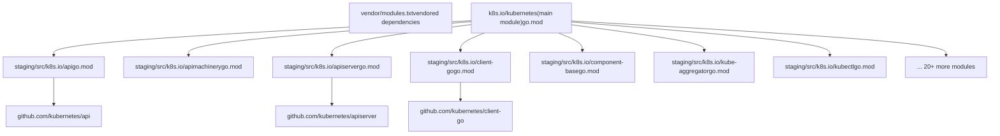
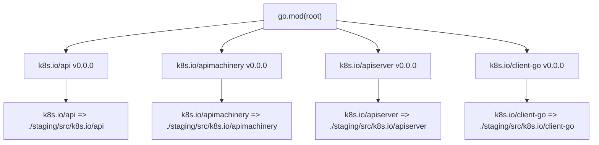
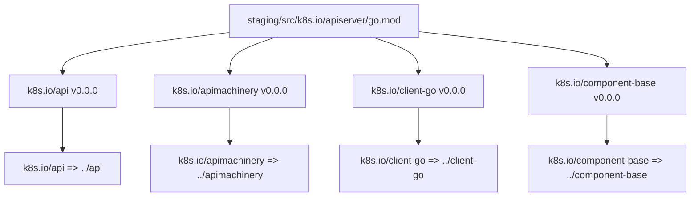
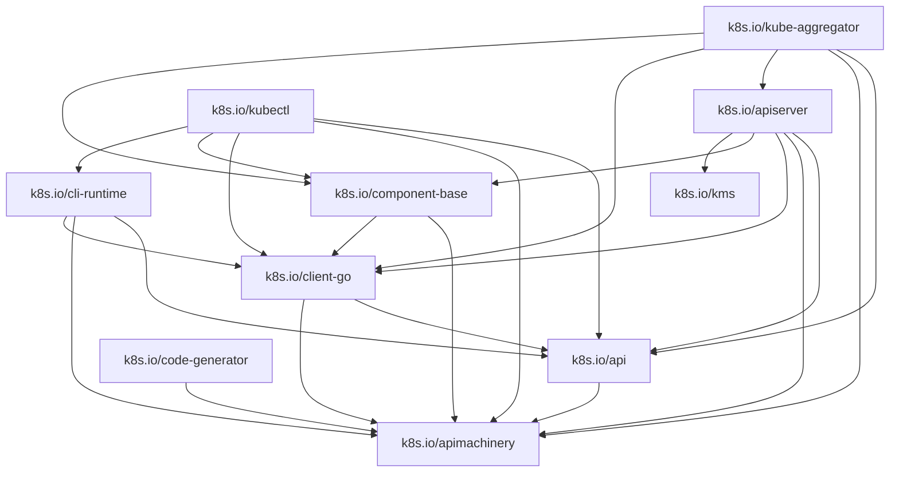
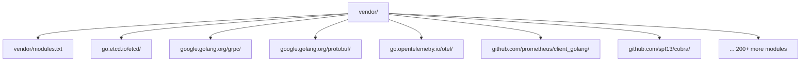
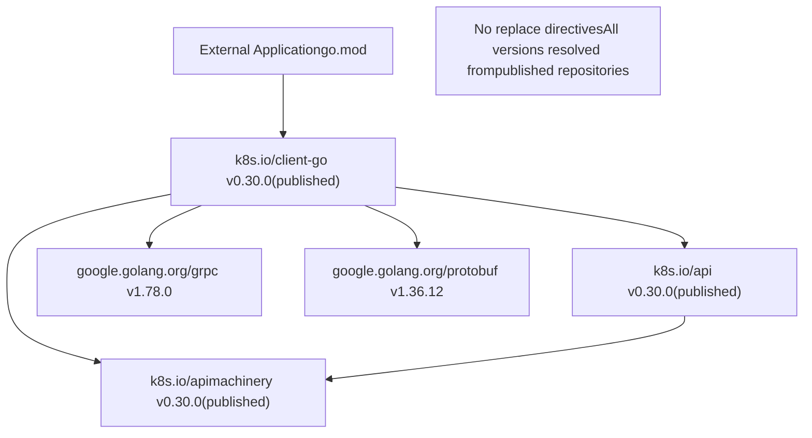
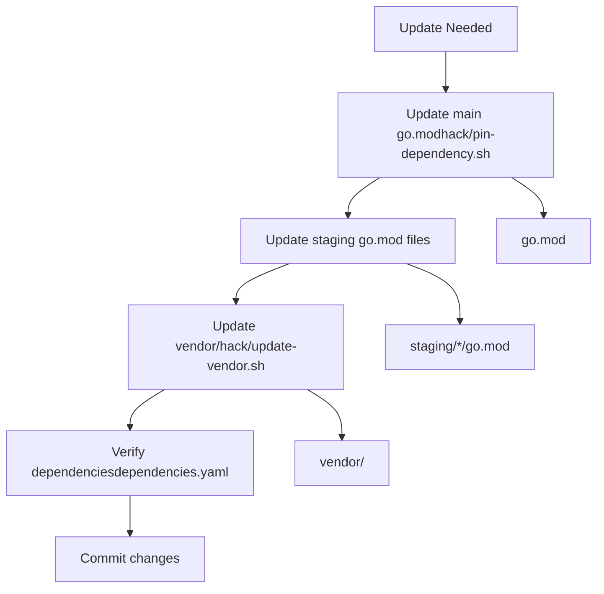

# Go Modules and Staging

Relevant source files

-   [go.mod](https://github.com/kubernetes/kubernetes/blob/2757a872/go.mod)
-   [go.sum](https://github.com/kubernetes/kubernetes/blob/2757a872/go.sum)
-   [staging/src/k8s.io/apiextensions-apiserver/go.mod](https://github.com/kubernetes/kubernetes/blob/2757a872/staging/src/k8s.io/apiextensions-apiserver/go.mod)
-   [staging/src/k8s.io/apiextensions-apiserver/go.sum](https://github.com/kubernetes/kubernetes/blob/2757a872/staging/src/k8s.io/apiextensions-apiserver/go.sum)
-   [staging/src/k8s.io/apiserver/go.mod](https://github.com/kubernetes/kubernetes/blob/2757a872/staging/src/k8s.io/apiserver/go.mod)
-   [staging/src/k8s.io/apiserver/go.sum](https://github.com/kubernetes/kubernetes/blob/2757a872/staging/src/k8s.io/apiserver/go.sum)
-   [staging/src/k8s.io/cloud-provider/go.sum](https://github.com/kubernetes/kubernetes/blob/2757a872/staging/src/k8s.io/cloud-provider/go.sum)
-   [staging/src/k8s.io/component-base/go.sum](https://github.com/kubernetes/kubernetes/blob/2757a872/staging/src/k8s.io/component-base/go.sum)
-   [staging/src/k8s.io/controller-manager/go.sum](https://github.com/kubernetes/kubernetes/blob/2757a872/staging/src/k8s.io/controller-manager/go.sum)
-   [staging/src/k8s.io/kube-aggregator/go.mod](https://github.com/kubernetes/kubernetes/blob/2757a872/staging/src/k8s.io/kube-aggregator/go.mod)
-   [staging/src/k8s.io/kube-aggregator/go.sum](https://github.com/kubernetes/kubernetes/blob/2757a872/staging/src/k8s.io/kube-aggregator/go.sum)
-   [staging/src/k8s.io/kube-controller-manager/go.sum](https://github.com/kubernetes/kubernetes/blob/2757a872/staging/src/k8s.io/kube-controller-manager/go.sum)
-   [staging/src/k8s.io/kube-proxy/go.sum](https://github.com/kubernetes/kubernetes/blob/2757a872/staging/src/k8s.io/kube-proxy/go.sum)
-   [staging/src/k8s.io/kube-scheduler/go.sum](https://github.com/kubernetes/kubernetes/blob/2757a872/staging/src/k8s.io/kube-scheduler/go.sum)
-   [staging/src/k8s.io/pod-security-admission/go.sum](https://github.com/kubernetes/kubernetes/blob/2757a872/staging/src/k8s.io/pod-security-admission/go.sum)
-   [staging/src/k8s.io/sample-apiserver/go.mod](https://github.com/kubernetes/kubernetes/blob/2757a872/staging/src/k8s.io/sample-apiserver/go.mod)
-   [staging/src/k8s.io/sample-apiserver/go.sum](https://github.com/kubernetes/kubernetes/blob/2757a872/staging/src/k8s.io/sample-apiserver/go.sum)
-   [vendor/modules.txt](https://github.com/kubernetes/kubernetes/blob/2757a872/vendor/modules.txt)

## Purpose and Scope

This document explains the Go module structure of the Kubernetes repository, specifically the staging subdirectories and how they function as independently publishable Go modules within a monorepo. It covers the use of `replace` directives, dependency relationships between staging modules, and the publishing mechanism that allows external consumers to import Kubernetes components as standard Go modules.

For information about external dependency version management, see [Dependency Management](/kubernetes/kubernetes/7.1-dependency-management). For details on the build process that produces binaries from these modules, see [Build and Release Process](/kubernetes/kubernetes/7.2-build-and-release-process).

---

## Monorepo Structure with Staging

The Kubernetes repository is organized as a monorepo containing a main module and multiple sub-modules in the `staging/src/k8s.io/` directory. Each staging module is a separate Go module with its own `go.mod` and `go.sum` files, but they are developed in the main repository and published to separate Git repositories.

### Repository Layout


**Sources:** [go.mod1-251](https://github.com/kubernetes/kubernetes/blob/2757a872/go.mod#L1-L251) [staging/src/k8s.io/apiserver/go.mod1-133](https://github.com/kubernetes/kubernetes/blob/2757a872/staging/src/k8s.io/apiserver/go.mod#L1-L133) [staging/src/k8s.io/api/go.mod1-50](https://github.com/kubernetes/kubernetes/blob/2757a872/staging/src/k8s.io/api/go.mod#L1-L50)

---

## Staging Modules Organization

Staging modules are located in `staging/src/k8s.io/` and each represents a logically separate component that can be consumed independently by external projects.

### Complete List of Staging Modules

| Module Path | Purpose |
| --- | --- |
| `k8s.io/api` | API type definitions for Kubernetes resources |
| `k8s.io/apiextensions-apiserver` | CustomResourceDefinition API server implementation |
| `k8s.io/apimachinery` | Machinery for API type metadata, conversion, and serialization |
| `k8s.io/apiserver` | Generic API server library |
| `k8s.io/cli-runtime` | Runtime components for kubectl commands |
| `k8s.io/client-go` | Go client library for Kubernetes API |
| `k8s.io/cloud-provider` | Cloud provider integration interfaces |
| `k8s.io/cluster-bootstrap` | Bootstrap token management |
| `k8s.io/code-generator` | Code generation tools for API types |
| `k8s.io/component-base` | Base components shared across Kubernetes binaries |
| `k8s.io/component-helpers` | Helper functions for component implementations |
| `k8s.io/controller-manager` | Controller manager framework |
| `k8s.io/cri-api` | Container Runtime Interface API definitions |
| `k8s.io/cri-client` | CRI client implementation |
| `k8s.io/csi-translation-lib` | CSI volume plugin translation |
| `k8s.io/dynamic-resource-allocation` | Dynamic Resource Allocation API |
| `k8s.io/endpointslice` | EndpointSlice controller |
| `k8s.io/externaljwt` | External JWT authentication |
| `k8s.io/kms` | Key Management Service integration |
| `k8s.io/kube-aggregator` | API aggregation layer |
| `k8s.io/kube-controller-manager` | Controller manager types |
| `k8s.io/kube-proxy` | Proxy types and interfaces |
| `k8s.io/kube-scheduler` | Scheduler types and interfaces |
| `k8s.io/kubectl` | kubectl implementation |
| `k8s.io/kubelet` | Kubelet types and interfaces |
| `k8s.io/metrics` | Metrics API types |
| `k8s.io/mount-utils` | Mount utility functions |
| `k8s.io/pod-security-admission` | Pod Security Admission plugin |
| `k8s.io/sample-apiserver` | Sample API server for learning |
| `k8s.io/sample-cli-plugin` | Sample kubectl plugin |
| `k8s.io/sample-controller` | Sample controller implementation |

**Sources:** [go.mod84-121](https://github.com/kubernetes/kubernetes/blob/2757a872/go.mod#L84-L121) [go.mod220-251](https://github.com/kubernetes/kubernetes/blob/2757a872/go.mod#L220-L251)

---

## Replace Directives Mechanism

The main module and staging modules use `replace` directives to redirect imports to local paths during development while allowing external consumers to use published versions.

### Main Module Replace Directives

The main `go.mod` file contains replace directives that point to staging subdirectories:


**Example from main go.mod:**

```
require (
    ...
    k8s.io/api v0.0.0
    k8s.io/apimachinery v0.0.0
    k8s.io/apiserver v0.0.0
    k8s.io/client-go v0.0.0
    ...
)

replace (
    k8s.io/api => ./staging/src/k8s.io/api
    k8s.io/apimachinery => ./staging/src/k8s.io/apimachinery
    k8s.io/apiserver => ./staging/src/k8s.io/apiserver
    k8s.io/client-go => ./staging/src/k8s.io/client-go
    ...
)
```
**Sources:** [go.mod84-121](https://github.com/kubernetes/kubernetes/blob/2757a872/go.mod#L84-L121) [go.mod219-251](https://github.com/kubernetes/kubernetes/blob/2757a872/go.mod#L219-L251)

### Staging Module Replace Directives

Each staging module also contains replace directives to point to sibling staging modules:


**Example from apiserver go.mod:**

```
require (
    ...
    k8s.io/api v0.0.0
    k8s.io/apimachinery v0.0.0
    k8s.io/client-go v0.0.0
    k8s.io/component-base v0.0.0
    ...
)

replace (
    k8s.io/api => ../api
    k8s.io/apimachinery => ../apimachinery
    k8s.io/client-go => ../client-go
    k8s.io/component-base => ../component-base
    k8s.io/kms => ../kms
)
```
**Sources:** [staging/src/k8s.io/apiserver/go.mod51-64](https://github.com/kubernetes/kubernetes/blob/2757a872/staging/src/k8s.io/apiserver/go.mod#L51-L64) [staging/src/k8s.io/apiserver/go.mod126-132](https://github.com/kubernetes/kubernetes/blob/2757a872/staging/src/k8s.io/apiserver/go.mod#L126-L132)

---

## Dependency Relationships

Staging modules have dependencies on each other, forming a directed acyclic graph (DAG). Lower-level modules like `apimachinery` are imported by higher-level modules like `client-go` and `apiserver`.

### Staging Module Dependency Graph


**Sources:** [staging/src/k8s.io/apiserver/go.mod51-64](https://github.com/kubernetes/kubernetes/blob/2757a872/staging/src/k8s.io/apiserver/go.mod#L51-L64) [staging/src/k8s.io/kube-aggregator/go.mod19-28](https://github.com/kubernetes/kubernetes/blob/2757a872/staging/src/k8s.io/kube-aggregator/go.mod#L19-L28) [staging/src/k8s.io/client-go/go.mod1-50](https://github.com/kubernetes/kubernetes/blob/2757a872/staging/src/k8s.io/client-go/go.mod#L1-L50)

### Version Resolution

All internal dependencies between staging modules use version `v0.0.0`:

```
require (
    k8s.io/api v0.0.0
    k8s.io/apimachinery v0.0.0
    k8s.io/client-go v0.0.0
    ...
)
```
This special version is resolved to local paths via `replace` directives during development. When published, these are replaced with actual semantic versions.

**Sources:** [staging/src/k8s.io/apiserver/go.mod51-58](https://github.com/kubernetes/kubernetes/blob/2757a872/staging/src/k8s.io/apiserver/go.mod#L51-L58) [go.mod84-121](https://github.com/kubernetes/kubernetes/blob/2757a872/go.mod#L84-L121)

---

## Vendor Directory

The main repository includes a `vendor/` directory containing all external dependencies. The `vendor/modules.txt` file lists all vendored modules with their versions and the packages they provide.

### Vendor Directory Structure


### modules.txt Format

The `vendor/modules.txt` file documents each vendored module:

```
## explicit; go 1.26.0
cel.dev/expr
# github.com/emicklei/go-restful/v3 v3.13.0
## explicit; go 1.13
github.com/emicklei/go-restful/v3
github.com/emicklei/go-restful/v3/log
# go.etcd.io/etcd/api/v3 v3.6.8
## explicit; go 1.24.0
go.etcd.io/etcd/api/v3/authpb
go.etcd.io/etcd/api/v3/etcdserverpb
go.etcd.io/etcd/api/v3/mvccpb
...
```
Each entry includes:

-   Module path and version
-   Go version requirement
-   List of packages provided

**Sources:** [vendor/modules.txt1-50](https://github.com/kubernetes/kubernetes/blob/2757a872/vendor/modules.txt#L1-L50) [vendor/modules.txt583-592](https://github.com/kubernetes/kubernetes/blob/2757a872/vendor/modules.txt#L583-L592)

---

## Publishing Mechanism

Staging modules are automatically published to separate Git repositories under the `github.com/kubernetes/` organization. External consumers import these published versions without needing the entire Kubernetes repository.

### Publishing Flow

> **[Mermaid sequence]**
> *(图表结构无法解析)*

### Version Mapping

Kubernetes releases use a different versioning scheme than the published staging modules:

| Kubernetes Release | Staging Module Version | Example |
| --- | --- | --- |
| v1.30.0 | v0.30.0 | `k8s.io/api v0.30.0` |
| v1.29.3 | v0.29.3 | `k8s.io/client-go v0.29.3` |
| v1.28.1 | v0.28.1 | `k8s.io/apimachinery v0.28.1` |

The major version of staging modules is always 0 to maintain compatibility with Go module semantics.

**Sources:** [go.mod7](https://github.com/kubernetes/kubernetes/blob/2757a872/go.mod#L7-L7) [staging/src/k8s.io/api/go.mod3](https://github.com/kubernetes/kubernetes/blob/2757a872/staging/src/k8s.io/api/go.mod#L3-L3)

---

## External Consumption

External projects can import staging modules as regular Go dependencies without replace directives. The published versions resolve dependencies to other published staging modules automatically.

### Example: External Project Using client-go

```
// External project's go.mod
module example.com/my-k8s-app

go 1.26

require (
    k8s.io/api v0.30.0
    k8s.io/apimachinery v0.30.0
    k8s.io/client-go v0.30.0
)
```
When the external project runs `go mod download`, the Go toolchain:

1.  Downloads `k8s.io/client-go` from the published repository
2.  Resolves its dependencies to the correct published versions
3.  Does not apply any replace directives (those only exist in the development repo)

### Dependency Resolution for External Consumers


**Sources:** [staging/src/k8s.io/client-go/go.mod1-50](https://github.com/kubernetes/kubernetes/blob/2757a872/staging/src/k8s.io/client-go/go.mod#L1-L50)

---

## Update and Sync Process

When dependencies need to be updated across the monorepo, the process involves updating multiple go.mod files:

### Update Flow


### Update Scripts

-   `hack/pin-dependency.sh` - Pins a specific dependency to a version
-   `hack/update-vendor.sh` - Updates `go.mod`, `go.sum`, and `vendor/` directory
-   `dependencies.yaml` verification - Ensures consistent versions across modules (see [Dependency Management](/kubernetes/kubernetes/7.1-dependency-management))

**Sources:** [go.mod1-6](https://github.com/kubernetes/kubernetes/blob/2757a872/go.mod#L1-L6)

---

## Module Metadata

Each staging module contains standard Go module files with specific conventions:

### go.mod Structure

```
// This is a generated file. Do not edit directly.

module k8s.io/apiserver

go 1.26.0

godebug default=go1.26

require (
    // Direct dependencies
    k8s.io/api v0.0.0
    k8s.io/apimachinery v0.0.0
    ...
)

require (
    // Indirect dependencies
    cel.dev/expr v0.24.0 // indirect
    github.com/golang/protobuf v1.5.4 // indirect
    ...
)

replace (
    k8s.io/api => ../api
    k8s.io/apimachinery => ../apimachinery
    ...
)
```
**Key Elements:**

-   **Header comment**: Indicates the file is generated
-   **Module declaration**: Module path
-   **Go version**: Minimum Go version requirement
-   **godebug**: Go debugging flags
-   **require blocks**: Direct and indirect dependencies
-   **replace directives**: Local path overrides

**Sources:** [staging/src/k8s.io/apiserver/go.mod1-133](https://github.com/kubernetes/kubernetes/blob/2757a872/staging/src/k8s.io/apiserver/go.mod#L1-L133)

### go.sum Files

Each module maintains a `go.sum` file containing cryptographic checksums for all dependencies:

```
cel.dev/expr v0.24.0 h1:56OvJKSH3hDGL0ml5uSxZmz3/3Pq4tJ+fb1unVLAFcY=
cel.dev/expr v0.24.0/go.mod h1:hLPLo1W4QUmuYdA72RBX06QTs6MXw941piREPl3Yfiw=
github.com/google/uuid v1.6.0 h1:NIvaJDMOsjHA8n1jAhLSgzrAzy1Hgr+hNrb57e+94F0=
github.com/google/uuid v1.6.0/go.mod h1:TIyPZe4MgqvfeYDBFedMoGGpEw/LqOeaOT+nhxU+yHo=
```
Each entry includes:

-   Module path and version
-   Hash of the module content (h1: prefix)
-   Hash of the go.mod file

**Sources:** [staging/src/k8s.io/apiserver/go.sum1-300](https://github.com/kubernetes/kubernetes/blob/2757a872/staging/src/k8s.io/apiserver/go.sum#L1-L300) [go.sum1-300](https://github.com/kubernetes/kubernetes/blob/2757a872/go.sum#L1-L300)

---

## Benefits of the Staging Architecture

The staging module architecture provides several advantages:

| Benefit | Description |
| --- | --- |
| **Independent Consumption** | External projects can import only needed components without the entire Kubernetes codebase |
| **Versioned APIs** | Each module can be versioned independently based on API stability |
| **Reduced Build Time** | Smaller modules mean faster compilation for external consumers |
| **Clear Dependencies** | Explicit dependency relationships between components |
| **Easier Testing** | Individual modules can be tested in isolation |
| **Gradual Migration** | External projects can upgrade modules incrementally |

**Sources:** [go.mod84-121](https://github.com/kubernetes/kubernetes/blob/2757a872/go.mod#L84-L121) [go.mod219-251](https://github.com/kubernetes/kubernetes/blob/2757a872/go.mod#L219-L251)
