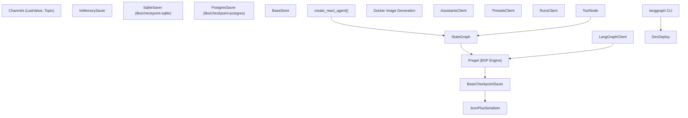
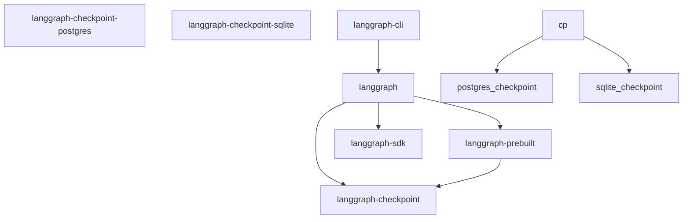
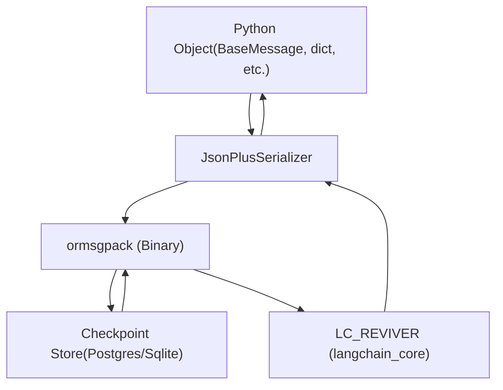

# Overview

Relevant source files

-   [Makefile](https://github.com/langchain-ai/langgraph/blob/1fd51e8f/Makefile)
-   [README.md](https://github.com/langchain-ai/langgraph/blob/1fd51e8f/README.md?plain=1)
-   [examples/react-agent-structured-output.ipynb](https://github.com/langchain-ai/langgraph/blob/1fd51e8f/examples/react-agent-structured-output.ipynb)
-   [libs/checkpoint-postgres/uv.lock](https://github.com/langchain-ai/langgraph/blob/1fd51e8f/libs/checkpoint-postgres/uv.lock)
-   [libs/checkpoint-sqlite/uv.lock](https://github.com/langchain-ai/langgraph/blob/1fd51e8f/libs/checkpoint-sqlite/uv.lock)
-   [libs/checkpoint/langgraph/checkpoint/serde/jsonplus.py](https://github.com/langchain-ai/langgraph/blob/1fd51e8f/libs/checkpoint/langgraph/checkpoint/serde/jsonplus.py)
-   [libs/checkpoint/pyproject.toml](https://github.com/langchain-ai/langgraph/blob/1fd51e8f/libs/checkpoint/pyproject.toml)
-   [libs/checkpoint/tests/test\_jsonplus.py](https://github.com/langchain-ai/langgraph/blob/1fd51e8f/libs/checkpoint/tests/test_jsonplus.py)
-   [libs/checkpoint/uv.lock](https://github.com/langchain-ai/langgraph/blob/1fd51e8f/libs/checkpoint/uv.lock)
-   [libs/langgraph/README.md](https://github.com/langchain-ai/langgraph/blob/1fd51e8f/libs/langgraph/README.md?plain=1)
-   [libs/langgraph/pyproject.toml](https://github.com/langchain-ai/langgraph/blob/1fd51e8f/libs/langgraph/pyproject.toml)
-   [libs/langgraph/tests/\_\_snapshots\_\_/test\_pregel.ambr](https://github.com/langchain-ai/langgraph/blob/1fd51e8f/libs/langgraph/tests/__snapshots__/test_pregel.ambr)
-   [libs/langgraph/tests/\_\_snapshots\_\_/test\_pregel\_async.ambr](https://github.com/langchain-ai/langgraph/blob/1fd51e8f/libs/langgraph/tests/__snapshots__/test_pregel_async.ambr)
-   [libs/langgraph/uv.lock](https://github.com/langchain-ai/langgraph/blob/1fd51e8f/libs/langgraph/uv.lock)
-   [libs/prebuilt/pyproject.toml](https://github.com/langchain-ai/langgraph/blob/1fd51e8f/libs/prebuilt/pyproject.toml)
-   [libs/prebuilt/uv.lock](https://github.com/langchain-ai/langgraph/blob/1fd51e8f/libs/prebuilt/uv.lock)
-   [libs/sdk-py/uv.lock](https://github.com/langchain-ai/langgraph/blob/1fd51e8f/libs/sdk-py/uv.lock)

## Purpose and Scope

LangGraph is a low-level orchestration framework for building stateful, multi-actor applications with Large Language Models (LLMs). Unlike high-level abstractions, LangGraph provides infrastructure without abstracting prompts or architecture, giving developers full control over their application logic [libs/langgraph/pyproject.toml8](https://github.com/langchain-ai/langgraph/blob/1fd51e8f/libs/langgraph/pyproject.toml#L8-L8)

### Core Capabilities

LangGraph provides foundational capabilities for building production-grade agents:

| Capability | Description | Implementation |
| --- | --- | --- |
| **Durable Execution** | Agents persist through failures and resume from exact state | `BaseCheckpointSaver` persists `Checkpoint` objects containing channel values and versions after each execution step [README.md39](https://github.com/langchain-ai/langgraph/blob/1fd51e8f/README.md?plain=1#L39-L39) |
| **Human-in-the-Loop** | Inspect and modify agent state at any execution point | Interrupt system allowing state modification via `update_state()` and resumption [README.md40](https://github.com/langchain-ai/langgraph/blob/1fd51e8f/README.md?plain=1#L40-L40) |
| **Comprehensive Memory** | Short-term working memory and long-term persistent storage | Channel system for step-level state + `BaseStore` for cross-thread persistent memory [README.md41](https://github.com/langchain-ai/langgraph/blob/1fd51e8f/README.md?plain=1#L41-L41) |

The framework is built on a Bulk Synchronous Parallel (BSP) execution model inspired by Google's Pregel paper [README.md82](https://github.com/langchain-ai/langgraph/blob/1fd51e8f/README.md?plain=1#L82-L82)

Sources: [README.md12-43](https://github.com/langchain-ai/langgraph/blob/1fd51e8f/README.md?plain=1#L12-L43) [libs/langgraph/pyproject.toml5-8](https://github.com/langchain-ai/langgraph/blob/1fd51e8f/libs/langgraph/pyproject.toml#L5-L8) [README.md80-83](https://github.com/langchain-ai/langgraph/blob/1fd51e8f/README.md?plain=1#L80-L83)

## Core Concepts

LangGraph implements a **Bulk Synchronous Parallel (BSP)** execution model. The framework centers on four foundational abstractions:

### Core Abstractions

| Concept | Description | Primary Implementation |
| --- | --- | --- |
| **Graph** | Computational DAG with nodes (functions) and edges (control flow) | `StateGraph` class [libs/langgraph/README.md29](https://github.com/langchain-ai/langgraph/blob/1fd51e8f/libs/langgraph/README.md?plain=1#L29-L29) |
| **State** | Shared data structure managed through typed channels | `TypedDict` schemas [libs/langgraph/README.md33-35](https://github.com/langchain-ai/langgraph/blob/1fd51e8f/libs/langgraph/README.md?plain=1#L33-L35) |
| **Channels** | Typed state containers with merge semantics | `LastValue`, `Topic`, `BinaryOperatorAggregate` |
| **Checkpoint** | Serialized snapshot containing channel values and execution metadata | `BaseCheckpointSaver` interface [libs/checkpoint/pyproject.toml8](https://github.com/langchain-ai/langgraph/blob/1fd51e8f/libs/checkpoint/pyproject.toml#L8-L8) |

### Graph Definition Approaches

**Declarative API** (StateGraph):

```
from langgraph.graph import START, StateGraphfrom typing_extensions import TypedDict class State(TypedDict):    text: str def node_a(state: State) -> dict:    return {"text": state["text"] + "a"} graph = StateGraph(State)graph.add_node("node_a", node_a)graph.add_edge(START, "node_a")
```
### Execution Model

At runtime, the execution engine orchestrates execution in discrete supersteps:

1.  **Plan**: Determine which nodes to execute based on channel state.
2.  **Execute**: Run nodes in parallel.
3.  **Update**: Apply writes to channels using reducers.
4.  **Checkpoint**: Persist state via a `BaseCheckpointSaver`.

Sources: [libs/langgraph/README.md26-53](https://github.com/langchain-ai/langgraph/blob/1fd51e8f/libs/langgraph/README.md?plain=1#L26-L53) [libs/checkpoint/pyproject.toml5-17](https://github.com/langchain-ai/langgraph/blob/1fd51e8f/libs/checkpoint/pyproject.toml#L5-L17) [README.md80-83](https://github.com/langchain-ai/langgraph/blob/1fd51e8f/README.md?plain=1#L80-L83)

## Architectural Components

The LangGraph system comprises major subsystems organized as a monorepo.

### High-Level System Architecture


**Code Entity Mapping:**

1.  **Core Execution Engine**:

    -   `StateGraph` at [libs/langgraph/README.md29-45](https://github.com/langchain-ai/langgraph/blob/1fd51e8f/libs/langgraph/README.md?plain=1#L29-L45): Declarative API for graph construction.
    -   `Pregel`: The underlying engine implementing the BSP model inspired by Google Pregel [README.md82](https://github.com/langchain-ai/langgraph/blob/1fd51e8f/README.md?plain=1#L82-L82)
2.  **Persistence Layer**:

    -   `BaseCheckpointSaver` at [libs/checkpoint/pyproject.toml8](https://github.com/langchain-ai/langgraph/blob/1fd51e8f/libs/checkpoint/pyproject.toml#L8-L8): Base interface for checkpointing.
    -   `PostgresSaver` at [libs/langgraph/pyproject.toml60](https://github.com/langchain-ai/langgraph/blob/1fd51e8f/libs/langgraph/pyproject.toml#L60-L60): Production-grade PostgreSQL persistence.
    -   `SqliteSaver` at [libs/langgraph/pyproject.toml59](https://github.com/langchain-ai/langgraph/blob/1fd51e8f/libs/langgraph/pyproject.toml#L59-L59): Local SQLite persistence.
    -   `JsonPlusSerializer` at [libs/checkpoint/langgraph/checkpoint/serde/jsonplus.py50](https://github.com/langchain-ai/langgraph/blob/1fd51e8f/libs/checkpoint/langgraph/checkpoint/serde/jsonplus.py#L50-L50): Advanced serializer supporting `ormsgpack` and `langchain-core` revivers [libs/checkpoint/langgraph/checkpoint/serde/jsonplus.py30-45](https://github.com/langchain-ai/langgraph/blob/1fd51e8f/libs/checkpoint/langgraph/checkpoint/serde/jsonplus.py#L30-L45)
3.  **Client SDKs**:

    -   `LangGraphClient` at [libs/langgraph/pyproject.toml29](https://github.com/langchain-ai/langgraph/blob/1fd51e8f/libs/langgraph/pyproject.toml#L29-L29): Python client for interacting with deployed graphs.
4.  **Prebuilt Components**:

    -   `create_react_agent()`: Factory for ReAct-style agents [libs/langgraph/pyproject.toml30](https://github.com/langchain-ai/langgraph/blob/1fd51e8f/libs/langgraph/pyproject.toml#L30-L30)
    -   `ToolNode`: Standard node for executing LangChain tools.

Sources: [libs/langgraph/pyproject.toml26-33](https://github.com/langchain-ai/langgraph/blob/1fd51e8f/libs/langgraph/pyproject.toml#L26-L33) [libs/checkpoint/pyproject.toml5-17](https://github.com/langchain-ai/langgraph/blob/1fd51e8f/libs/checkpoint/pyproject.toml#L5-L17) [libs/checkpoint/langgraph/checkpoint/serde/jsonplus.py50-100](https://github.com/langchain-ai/langgraph/blob/1fd51e8f/libs/checkpoint/langgraph/checkpoint/serde/jsonplus.py#L50-L100) [README.md80-83](https://github.com/langchain-ai/langgraph/blob/1fd51e8f/README.md?plain=1#L80-L83)

## Package Ecosystem

LangGraph is distributed as multiple packages with explicit dependency relationships managed via `uv` [libs/langgraph/pyproject.toml83-90](https://github.com/langchain-ai/langgraph/blob/1fd51e8f/libs/langgraph/pyproject.toml#L83-L90)


**Package Descriptions:**

| Package | Purpose | Key Dependencies |
| --- | --- | --- |
| `langgraph` | Core framework with graph building and execution | `langgraph-checkpoint`, `langchain-core` [libs/langgraph/pyproject.toml26-28](https://github.com/langchain-ai/langgraph/blob/1fd51e8f/libs/langgraph/pyproject.toml#L26-L28) |
| `langgraph-checkpoint` | Base interfaces for checkpoint savers | `ormsgpack`, `langchain-core` [libs/checkpoint/pyproject.toml14-17](https://github.com/langchain-ai/langgraph/blob/1fd51e8f/libs/checkpoint/pyproject.toml#L14-L17) |
| `langgraph-prebuilt` | High-level agent and tool abstractions | `langgraph-checkpoint`, `langchain-core` [libs/prebuilt/pyproject.toml26-29](https://github.com/langchain-ai/langgraph/blob/1fd51e8f/libs/prebuilt/pyproject.toml#L26-L29) |

Sources: [libs/langgraph/pyproject.toml26-33](https://github.com/langchain-ai/langgraph/blob/1fd51e8f/libs/langgraph/pyproject.toml#L26-L33) [libs/checkpoint/pyproject.toml14-17](https://github.com/langchain-ai/langgraph/blob/1fd51e8f/libs/checkpoint/pyproject.toml#L14-L17) [libs/prebuilt/pyproject.toml26-29](https://github.com/langchain-ai/langgraph/blob/1fd51e8f/libs/prebuilt/pyproject.toml#L26-L29) [libs/langgraph/pyproject.toml83-90](https://github.com/langchain-ai/langgraph/blob/1fd51e8f/libs/langgraph/pyproject.toml#L83-L90)

## Execution and Serialization

### Serialization Flow

The `JsonPlusSerializer` handles the conversion of complex Python objects (like LangChain messages) into storable formats.


1.  **Encoding**: `JsonPlusSerializer` uses `ormsgpack` for high-performance binary serialization [libs/checkpoint/langgraph/checkpoint/serde/jsonplus.py30-50](https://github.com/langchain-ai/langgraph/blob/1fd51e8f/libs/checkpoint/langgraph/checkpoint/serde/jsonplus.py#L30-L50)
2.  **Revival**: It integrates with `langchain_core.load.load.Reviver` to reconstruct LangChain objects correctly during deserialization [libs/checkpoint/langgraph/checkpoint/serde/jsonplus.py45-50](https://github.com/langchain-ai/langgraph/blob/1fd51e8f/libs/checkpoint/langgraph/checkpoint/serde/jsonplus.py#L45-L50)
3.  **Security**: It includes an allowlist mechanism for modules to prevent arbitrary code execution during revival [libs/checkpoint/langgraph/checkpoint/serde/jsonplus.py65-80](https://github.com/langchain-ai/langgraph/blob/1fd51e8f/libs/checkpoint/langgraph/checkpoint/serde/jsonplus.py#L65-L80)

Sources: [libs/checkpoint/langgraph/checkpoint/serde/jsonplus.py1-87](https://github.com/langchain-ai/langgraph/blob/1fd51e8f/libs/checkpoint/langgraph/checkpoint/serde/jsonplus.py#L1-L87) [libs/checkpoint/pyproject.toml16](https://github.com/langchain-ai/langgraph/blob/1fd51e8f/libs/checkpoint/pyproject.toml#L16-L16)

## Integration with LangChain Ecosystem

LangGraph is designed to work standalone but provides deep integration with LangChain:

| Component | Role |
| --- | --- |
| **LangChain Core** | Base interfaces for models and messages [libs/langgraph/pyproject.toml27](https://github.com/langchain-ai/langgraph/blob/1fd51e8f/libs/langgraph/pyproject.toml#L27-L27) |
| **LangSmith** | Debugging, tracing, and observability [README.md42](https://github.com/langchain-ai/langgraph/blob/1fd51e8f/README.md?plain=1#L42-L42) |
| **LangGraph Studio** | Visual prototyping and debugging [libs/langgraph/README.md74](https://github.com/langchain-ai/langgraph/blob/1fd51e8f/libs/langgraph/README.md?plain=1#L74-L74) |

Sources: [README.md42-57](https://github.com/langchain-ai/langgraph/blob/1fd51e8f/README.md?plain=1#L42-L57) [libs/langgraph/README.md69-76](https://github.com/langchain-ai/langgraph/blob/1fd51e8f/libs/langgraph/README.md?plain=1#L69-L76)

## System Requirements

**Python Version**: `>=3.10` [libs/langgraph/pyproject.toml10](https://github.com/langchain-ai/langgraph/blob/1fd51e8f/libs/langgraph/pyproject.toml#L10-L10)

**Core Dependencies**:

-   `langchain-core>=0.1` [libs/langgraph/pyproject.toml27](https://github.com/langchain-ai/langgraph/blob/1fd51e8f/libs/langgraph/pyproject.toml#L27-L27)
-   `langgraph-checkpoint>=2.1.0` [libs/langgraph/pyproject.toml28](https://github.com/langchain-ai/langgraph/blob/1fd51e8f/libs/langgraph/pyproject.toml#L28-L28)
-   `pydantic>=2.7.4` [libs/langgraph/pyproject.toml32](https://github.com/langchain-ai/langgraph/blob/1fd51e8f/libs/langgraph/pyproject.toml#L32-L32)
-   `ormsgpack>=1.12.0` [libs/checkpoint/pyproject.toml16](https://github.com/langchain-ai/langgraph/blob/1fd51e8f/libs/checkpoint/pyproject.toml#L16-L16)

Sources: [libs/langgraph/pyproject.toml10-33](https://github.com/langchain-ai/langgraph/blob/1fd51e8f/libs/langgraph/pyproject.toml#L10-L33) [libs/checkpoint/pyproject.toml10-17](https://github.com/langchain-ai/langgraph/blob/1fd51e8f/libs/checkpoint/pyproject.toml#L10-L17)
