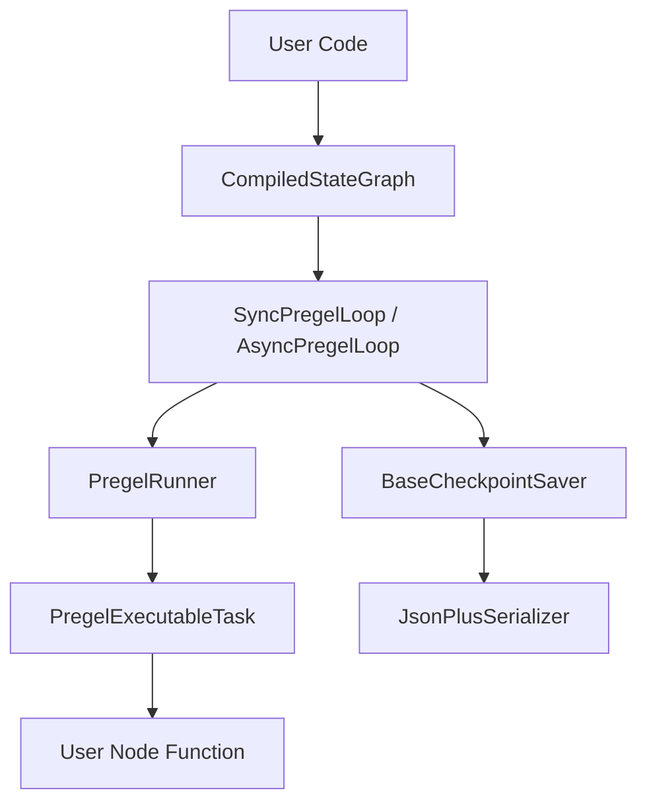
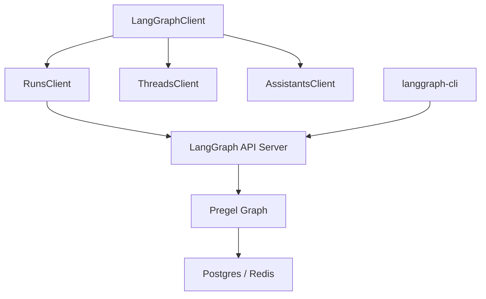

# Glossary

Relevant source files

-   [libs/checkpoint-postgres/langgraph/checkpoint/postgres/\_\_init\_\_.py](https://github.com/langchain-ai/langgraph/blob/1fd51e8f/libs/checkpoint-postgres/langgraph/checkpoint/postgres/__init__.py)
-   [libs/checkpoint-postgres/langgraph/checkpoint/postgres/aio.py](https://github.com/langchain-ai/langgraph/blob/1fd51e8f/libs/checkpoint-postgres/langgraph/checkpoint/postgres/aio.py)
-   [libs/checkpoint-postgres/langgraph/checkpoint/postgres/base.py](https://github.com/langchain-ai/langgraph/blob/1fd51e8f/libs/checkpoint-postgres/langgraph/checkpoint/postgres/base.py)
-   [libs/checkpoint-postgres/langgraph/checkpoint/postgres/shallow.py](https://github.com/langchain-ai/langgraph/blob/1fd51e8f/libs/checkpoint-postgres/langgraph/checkpoint/postgres/shallow.py)
-   [libs/checkpoint-postgres/tests/test\_async.py](https://github.com/langchain-ai/langgraph/blob/1fd51e8f/libs/checkpoint-postgres/tests/test_async.py)
-   [libs/checkpoint-postgres/tests/test\_sync.py](https://github.com/langchain-ai/langgraph/blob/1fd51e8f/libs/checkpoint-postgres/tests/test_sync.py)
-   [libs/checkpoint-postgres/uv.lock](https://github.com/langchain-ai/langgraph/blob/1fd51e8f/libs/checkpoint-postgres/uv.lock)
-   [libs/checkpoint-sqlite/langgraph/checkpoint/sqlite/\_\_init\_\_.py](https://github.com/langchain-ai/langgraph/blob/1fd51e8f/libs/checkpoint-sqlite/langgraph/checkpoint/sqlite/__init__.py)
-   [libs/checkpoint-sqlite/langgraph/checkpoint/sqlite/aio.py](https://github.com/langchain-ai/langgraph/blob/1fd51e8f/libs/checkpoint-sqlite/langgraph/checkpoint/sqlite/aio.py)
-   [libs/checkpoint-sqlite/langgraph/checkpoint/sqlite/utils.py](https://github.com/langchain-ai/langgraph/blob/1fd51e8f/libs/checkpoint-sqlite/langgraph/checkpoint/sqlite/utils.py)
-   [libs/checkpoint-sqlite/tests/test\_aiosqlite.py](https://github.com/langchain-ai/langgraph/blob/1fd51e8f/libs/checkpoint-sqlite/tests/test_aiosqlite.py)
-   [libs/checkpoint-sqlite/tests/test\_sqlite.py](https://github.com/langchain-ai/langgraph/blob/1fd51e8f/libs/checkpoint-sqlite/tests/test_sqlite.py)
-   [libs/checkpoint-sqlite/uv.lock](https://github.com/langchain-ai/langgraph/blob/1fd51e8f/libs/checkpoint-sqlite/uv.lock)
-   [libs/checkpoint/langgraph/checkpoint/base/\_\_init\_\_.py](https://github.com/langchain-ai/langgraph/blob/1fd51e8f/libs/checkpoint/langgraph/checkpoint/base/__init__.py)
-   [libs/checkpoint/langgraph/checkpoint/memory/\_\_init\_\_.py](https://github.com/langchain-ai/langgraph/blob/1fd51e8f/libs/checkpoint/langgraph/checkpoint/memory/__init__.py)
-   [libs/checkpoint/langgraph/checkpoint/serde/jsonplus.py](https://github.com/langchain-ai/langgraph/blob/1fd51e8f/libs/checkpoint/langgraph/checkpoint/serde/jsonplus.py)
-   [libs/checkpoint/langgraph/checkpoint/serde/types.py](https://github.com/langchain-ai/langgraph/blob/1fd51e8f/libs/checkpoint/langgraph/checkpoint/serde/types.py)
-   [libs/checkpoint/pyproject.toml](https://github.com/langchain-ai/langgraph/blob/1fd51e8f/libs/checkpoint/pyproject.toml)
-   [libs/checkpoint/tests/test\_jsonplus.py](https://github.com/langchain-ai/langgraph/blob/1fd51e8f/libs/checkpoint/tests/test_jsonplus.py)
-   [libs/checkpoint/tests/test\_memory.py](https://github.com/langchain-ai/langgraph/blob/1fd51e8f/libs/checkpoint/tests/test_memory.py)
-   [libs/checkpoint/uv.lock](https://github.com/langchain-ai/langgraph/blob/1fd51e8f/libs/checkpoint/uv.lock)
-   [libs/cli/README.md](https://github.com/langchain-ai/langgraph/blob/1fd51e8f/libs/cli/README.md?plain=1)
-   [libs/cli/langgraph\_cli/\_\_init\_\_.py](https://github.com/langchain-ai/langgraph/blob/1fd51e8f/libs/cli/langgraph_cli/__init__.py)
-   [libs/cli/langgraph\_cli/cli.py](https://github.com/langchain-ai/langgraph/blob/1fd51e8f/libs/cli/langgraph_cli/cli.py)
-   [libs/cli/langgraph\_cli/config.py](https://github.com/langchain-ai/langgraph/blob/1fd51e8f/libs/cli/langgraph_cli/config.py)
-   [libs/cli/langgraph\_cli/helpers.py](https://github.com/langchain-ai/langgraph/blob/1fd51e8f/libs/cli/langgraph_cli/helpers.py)
-   [libs/cli/langgraph\_cli/host\_backend.py](https://github.com/langchain-ai/langgraph/blob/1fd51e8f/libs/cli/langgraph_cli/host_backend.py)
-   [libs/cli/langgraph\_cli/progress.py](https://github.com/langchain-ai/langgraph/blob/1fd51e8f/libs/cli/langgraph_cli/progress.py)
-   [libs/cli/langgraph\_cli/util.py](https://github.com/langchain-ai/langgraph/blob/1fd51e8f/libs/cli/langgraph_cli/util.py)
-   [libs/cli/pyproject.toml](https://github.com/langchain-ai/langgraph/blob/1fd51e8f/libs/cli/pyproject.toml)
-   [libs/cli/tests/unit\_tests/cli/test\_cli.py](https://github.com/langchain-ai/langgraph/blob/1fd51e8f/libs/cli/tests/unit_tests/cli/test_cli.py)
-   [libs/cli/tests/unit\_tests/test\_config.py](https://github.com/langchain-ai/langgraph/blob/1fd51e8f/libs/cli/tests/unit_tests/test_config.py)
-   [libs/cli/tests/unit\_tests/test\_deploy\_helpers.py](https://github.com/langchain-ai/langgraph/blob/1fd51e8f/libs/cli/tests/unit_tests/test_deploy_helpers.py)
-   [libs/cli/tests/unit\_tests/test\_host\_backend.py](https://github.com/langchain-ai/langgraph/blob/1fd51e8f/libs/cli/tests/unit_tests/test_host_backend.py)
-   [libs/cli/tests/unit\_tests/test\_logs\_helpers.py](https://github.com/langchain-ai/langgraph/blob/1fd51e8f/libs/cli/tests/unit_tests/test_logs_helpers.py)
-   [libs/cli/tests/unit\_tests/test\_util.py](https://github.com/langchain-ai/langgraph/blob/1fd51e8f/libs/cli/tests/unit_tests/test_util.py)
-   [libs/cli/uv.lock](https://github.com/langchain-ai/langgraph/blob/1fd51e8f/libs/cli/uv.lock)
-   [libs/langgraph/langgraph/constants.py](https://github.com/langchain-ai/langgraph/blob/1fd51e8f/libs/langgraph/langgraph/constants.py)
-   [libs/langgraph/langgraph/errors.py](https://github.com/langchain-ai/langgraph/blob/1fd51e8f/libs/langgraph/langgraph/errors.py)
-   [libs/langgraph/langgraph/func/\_\_init\_\_.py](https://github.com/langchain-ai/langgraph/blob/1fd51e8f/libs/langgraph/langgraph/func/__init__.py)
-   [libs/langgraph/langgraph/graph/\_\_init\_\_.py](https://github.com/langchain-ai/langgraph/blob/1fd51e8f/libs/langgraph/langgraph/graph/__init__.py)
-   [libs/langgraph/langgraph/graph/state.py](https://github.com/langchain-ai/langgraph/blob/1fd51e8f/libs/langgraph/langgraph/graph/state.py)
-   [libs/langgraph/langgraph/pregel/\_\_init\_\_.py](https://github.com/langchain-ai/langgraph/blob/1fd51e8f/libs/langgraph/langgraph/pregel/__init__.py)
-   [libs/langgraph/langgraph/pregel/debug.py](https://github.com/langchain-ai/langgraph/blob/1fd51e8f/libs/langgraph/langgraph/pregel/debug.py)
-   [libs/langgraph/langgraph/pregel/types.py](https://github.com/langchain-ai/langgraph/blob/1fd51e8f/libs/langgraph/langgraph/pregel/types.py)
-   [libs/langgraph/langgraph/types.py](https://github.com/langchain-ai/langgraph/blob/1fd51e8f/libs/langgraph/langgraph/types.py)
-   [libs/langgraph/pyproject.toml](https://github.com/langchain-ai/langgraph/blob/1fd51e8f/libs/langgraph/pyproject.toml)
-   [libs/langgraph/tests/\_\_snapshots\_\_/test\_large\_cases.ambr](https://github.com/langchain-ai/langgraph/blob/1fd51e8f/libs/langgraph/tests/__snapshots__/test_large_cases.ambr)
-   [libs/langgraph/tests/\_\_snapshots\_\_/test\_pregel.ambr](https://github.com/langchain-ai/langgraph/blob/1fd51e8f/libs/langgraph/tests/__snapshots__/test_pregel.ambr)
-   [libs/langgraph/tests/\_\_snapshots\_\_/test\_pregel\_async.ambr](https://github.com/langchain-ai/langgraph/blob/1fd51e8f/libs/langgraph/tests/__snapshots__/test_pregel_async.ambr)
-   [libs/langgraph/tests/test\_checkpoint\_migration.py](https://github.com/langchain-ai/langgraph/blob/1fd51e8f/libs/langgraph/tests/test_checkpoint_migration.py)
-   [libs/langgraph/tests/test\_large\_cases.py](https://github.com/langchain-ai/langgraph/blob/1fd51e8f/libs/langgraph/tests/test_large_cases.py)
-   [libs/langgraph/tests/test\_large\_cases\_async.py](https://github.com/langchain-ai/langgraph/blob/1fd51e8f/libs/langgraph/tests/test_large_cases_async.py)
-   [libs/langgraph/tests/test\_pregel.py](https://github.com/langchain-ai/langgraph/blob/1fd51e8f/libs/langgraph/tests/test_pregel.py)
-   [libs/langgraph/tests/test\_pregel\_async.py](https://github.com/langchain-ai/langgraph/blob/1fd51e8f/libs/langgraph/tests/test_pregel_async.py)
-   [libs/langgraph/uv.lock](https://github.com/langchain-ai/langgraph/blob/1fd51e8f/libs/langgraph/uv.lock)
-   [libs/prebuilt/langgraph/prebuilt/\_\_init\_\_.py](https://github.com/langchain-ai/langgraph/blob/1fd51e8f/libs/prebuilt/langgraph/prebuilt/__init__.py)
-   [libs/prebuilt/langgraph/prebuilt/chat\_agent\_executor.py](https://github.com/langchain-ai/langgraph/blob/1fd51e8f/libs/prebuilt/langgraph/prebuilt/chat_agent_executor.py)
-   [libs/prebuilt/langgraph/prebuilt/tool\_node.py](https://github.com/langchain-ai/langgraph/blob/1fd51e8f/libs/prebuilt/langgraph/prebuilt/tool_node.py)
-   [libs/prebuilt/langgraph/prebuilt/tool\_validator.py](https://github.com/langchain-ai/langgraph/blob/1fd51e8f/libs/prebuilt/langgraph/prebuilt/tool_validator.py)
-   [libs/prebuilt/pyproject.toml](https://github.com/langchain-ai/langgraph/blob/1fd51e8f/libs/prebuilt/pyproject.toml)
-   [libs/prebuilt/tests/test\_deprecation.py](https://github.com/langchain-ai/langgraph/blob/1fd51e8f/libs/prebuilt/tests/test_deprecation.py)
-   [libs/prebuilt/tests/test\_on\_tool\_call.py](https://github.com/langchain-ai/langgraph/blob/1fd51e8f/libs/prebuilt/tests/test_on_tool_call.py)
-   [libs/prebuilt/tests/test\_react\_agent.py](https://github.com/langchain-ai/langgraph/blob/1fd51e8f/libs/prebuilt/tests/test_react_agent.py)
-   [libs/prebuilt/tests/test\_tool\_node.py](https://github.com/langchain-ai/langgraph/blob/1fd51e8f/libs/prebuilt/tests/test_tool_node.py)
-   [libs/prebuilt/tests/test\_tool\_node\_interceptor\_unregistered.py](https://github.com/langchain-ai/langgraph/blob/1fd51e8f/libs/prebuilt/tests/test_tool_node_interceptor_unregistered.py)
-   [libs/prebuilt/tests/test\_tool\_node\_validation\_error\_filtering.py](https://github.com/langchain-ai/langgraph/blob/1fd51e8f/libs/prebuilt/tests/test_tool_node_validation_error_filtering.py)
-   [libs/prebuilt/uv.lock](https://github.com/langchain-ai/langgraph/blob/1fd51e8f/libs/prebuilt/uv.lock)
-   [libs/sdk-py/langgraph\_sdk/\_\_init\_\_.py](https://github.com/langchain-ai/langgraph/blob/1fd51e8f/libs/sdk-py/langgraph_sdk/__init__.py)
-   [libs/sdk-py/langgraph\_sdk/cache.py](https://github.com/langchain-ai/langgraph/blob/1fd51e8f/libs/sdk-py/langgraph_sdk/cache.py)
-   [libs/sdk-py/langgraph\_sdk/client.py](https://github.com/langchain-ai/langgraph/blob/1fd51e8f/libs/sdk-py/langgraph_sdk/client.py)
-   [libs/sdk-py/langgraph\_sdk/schema.py](https://github.com/langchain-ai/langgraph/blob/1fd51e8f/libs/sdk-py/langgraph_sdk/schema.py)
-   [libs/sdk-py/pyproject.toml](https://github.com/langchain-ai/langgraph/blob/1fd51e8f/libs/sdk-py/pyproject.toml)
-   [libs/sdk-py/tests/test\_cache.py](https://github.com/langchain-ai/langgraph/blob/1fd51e8f/libs/sdk-py/tests/test_cache.py)
-   [libs/sdk-py/tests/test\_crons\_client.py](https://github.com/langchain-ai/langgraph/blob/1fd51e8f/libs/sdk-py/tests/test_crons_client.py)
-   [libs/sdk-py/uv.lock](https://github.com/langchain-ai/langgraph/blob/1fd51e8f/libs/sdk-py/uv.lock)

This glossary defines codebase-specific terms, jargon, and domain concepts used throughout the LangGraph repository. It serves as a technical reference for onboarding engineers to understand the implementation details and data flow of the framework.

## Core Concepts

### Pregel

The underlying execution engine for LangGraph. It is based on the Pregel graph processing model, where nodes execute in "supersteps." In each step, nodes that have received updates (triggers) execute in parallel and write updates to shared state (channels), which then trigger subsequent nodes.

-   **Implementation**: The main loop is managed by `SyncPregelLoop` and `AsyncPregelLoop` in [libs/langgraph/langgraph/pregel/\_loop.py](https://github.com/langchain-ai/langgraph/blob/1fd51e8f/libs/langgraph/langgraph/pregel/_loop.py)
-   **Task Orchestration**: `PregelRunner` handles the actual execution of node logic [libs/langgraph/langgraph/pregel/\_runner.py](https://github.com/langchain-ai/langgraph/blob/1fd51e8f/libs/langgraph/langgraph/pregel/_runner.py)
-   **Entry Point**: The `Pregel` class is the compiled executable form of a graph [libs/langgraph/langgraph/pregel/main.py](https://github.com/langchain-ai/langgraph/blob/1fd51e8f/libs/langgraph/langgraph/pregel/main.py)

### Channel

A state container within a graph. Channels are not just variables; they have specific behaviors for how they handle updates (e.g., overwriting, appending, or aggregating).

| Channel Type | Code Entity | Description |
| --- | --- | --- |
| **LastValue** | `LastValue` [libs/langgraph/langgraph/channels/last\_value.py](https://github.com/langchain-ai/langgraph/blob/1fd51e8f/libs/langgraph/langgraph/channels/last_value.py) | Stores only the most recent value written to it. |
| **Topic** | `Topic` [libs/langgraph/langgraph/channels/topic.py](https://github.com/langchain-ai/langgraph/blob/1fd51e8f/libs/langgraph/langgraph/channels/topic.py) | A queue-like channel that accumulates values until they are consumed. |
| **BinaryOperatorAggregate** | `BinaryOperatorAggregate` [libs/langgraph/langgraph/channels/binop.py](https://github.com/langchain-ai/langgraph/blob/1fd51e8f/libs/langgraph/langgraph/channels/binop.py) | Applies a reducer function (e.g., `operator.add`) to aggregate new values with existing ones. |
| **EphemeralValue** | `EphemeralValue` [libs/langgraph/langgraph/channels/ephemeral\_value.py](https://github.com/langchain-ai/langgraph/blob/1fd51e8f/libs/langgraph/langgraph/channels/ephemeral_value.py) | Values that exist only for the duration of a single step. |

### Checkpoint

A persisted snapshot of the graph's state at a specific point in time (a "thread"). Checkpoints allow for "Time Travel," error recovery, and human-in-the-loop interactions.

-   **Data Model**: Defined by the `Checkpoint` TypedDict [libs/checkpoint/langgraph/checkpoint/base/\_\_init\_\_.py47-84](https://github.com/langchain-ai/langgraph/blob/1fd51e8f/libs/checkpoint/langgraph/checkpoint/base/__init__.py#L47-L84)
-   **Interface**: All savers must implement `BaseCheckpointSaver` [libs/checkpoint/langgraph/checkpoint/base/\_\_init\_\_.py186-210](https://github.com/langchain-ai/langgraph/blob/1fd51e8f/libs/checkpoint/langgraph/checkpoint/base/__init__.py#L186-L210)
-   **Metadata**: `CheckpointMetadata` tracks the step number, source, and writes that created the checkpoint [libs/checkpoint/langgraph/checkpoint/base/\_\_init\_\_.py110-135](https://github.com/langchain-ai/langgraph/blob/1fd51e8f/libs/checkpoint/langgraph/checkpoint/base/__init__.py#L110-L135)

### Thread

A unique identifier for a specific instance of a graph execution. All checkpoints within the same `thread_id` share a history.

### Reducer

A function used by a `BinaryOperatorAggregate` channel to combine a new update with the current state.

-   **Signature**: `(current_state, update) -> new_state`.
-   **Usage**: Defined via `Annotated[Type, reducer_function]` in a `TypedDict` state schema [libs/langgraph/langgraph/graph/state.py152-159](https://github.com/langchain-ai/langgraph/blob/1fd51e8f/libs/langgraph/langgraph/graph/state.py#L152-L159)

---

## Control Flow Primitives

### Command

A control object returned by a node to dynamically influence graph execution. It can update state, route to a specific node, or trigger an interrupt.

-   **Definition**: `Command` dataclass [libs/langgraph/langgraph/types.py465-490](https://github.com/langchain-ai/langgraph/blob/1fd51e8f/libs/langgraph/langgraph/types.py#L465-L490)
-   **Properties**:
    -   `goto`: Target node(s) for the next step.
    -   `update`: State updates to apply.
    -   `resume`: Value to provide to an `interrupt`.

### Send

A primitive used for dynamic fan-out (map-reduce patterns). It allows a node to schedule multiple instances of another node with different inputs.

-   **Definition**: `Send` named tuple [libs/langgraph/langgraph/types.py448-462](https://github.com/langchain-ai/langgraph/blob/1fd51e8f/libs/langgraph/langgraph/types.py#L448-L462)
-   **Usage**: `return [Send("node_name", arg1), Send("node_name", arg2)]`.

### Interrupt

A mechanism to pause graph execution and wait for external input.

-   **Function**: `interrupt()` used within a node to halt and return a value to the caller [libs/langgraph/langgraph/types.py530-570](https://github.com/langchain-ai/langgraph/blob/1fd51e8f/libs/langgraph/langgraph/types.py#L530-L570)
-   **Configuration**: `interrupt_before` and `interrupt_after` settings in `graph.compile()`.

---

## Code Mapping Diagrams

### Execution Flow: From User Call to Pregel Loop

This diagram maps the high-level API calls to the internal classes that handle the Pregel execution loop.

**Sources**: [libs/langgraph/langgraph/pregel/\_loop.py](https://github.com/langchain-ai/langgraph/blob/1fd51e8f/libs/langgraph/langgraph/pregel/_loop.py) [libs/langgraph/langgraph/pregel/\_runner.py](https://github.com/langchain-ai/langgraph/blob/1fd51e8f/libs/langgraph/langgraph/pregel/_runner.py) [libs/langgraph/langgraph/graph/state.py](https://github.com/langchain-ai/langgraph/blob/1fd51e8f/libs/langgraph/langgraph/graph/state.py)

### Remote Execution: SDK to API Server

This diagram shows how the `LangGraphClient` interacts with the remote API server and how resources are mapped in code.

**Sources**: [libs/sdk-py/langgraph\_sdk/client.py](https://github.com/langchain-ai/langgraph/blob/1fd51e8f/libs/sdk-py/langgraph_sdk/client.py) [libs/cli/langgraph\_cli/cli.py](https://github.com/langchain-ai/langgraph/blob/1fd51e8f/libs/cli/langgraph_cli/cli.py)

---

## Technical Abbreviations & Jargon

| Term | Full Name | Context |
| --- | --- | --- |
| **SSE** | Server-Sent Events | The protocol used for streaming graph outputs [libs/sdk-py/langgraph\_sdk/\_async/http.py](https://github.com/langchain-ai/langgraph/blob/1fd51e8f/libs/sdk-py/langgraph_sdk/_async/http.py) |
| **HIL** | Human-in-the-Loop | Patterns involving `interrupt` and `Command(resume=...)`. |
| **Serde** | Serialization/Deserialization | Refers to the `JsonPlusSerializer` which handles complex types like `UUID` and `BaseMessage` [libs/checkpoint/langgraph/checkpoint/serde/jsonplus.py](https://github.com/langchain-ai/langgraph/blob/1fd51e8f/libs/checkpoint/langgraph/checkpoint/serde/jsonplus.py) |
| **Managed Value** | Managed Value | State components that are managed by the framework rather than the user, such as `BaseStore` or `BaseCache` [libs/langgraph/langgraph/managed/base.py](https://github.com/langchain-ai/langgraph/blob/1fd51e8f/libs/langgraph/langgraph/managed/base.py) |
| **Configurable** | Configurable Field | Fields in `RunnableConfig` that allow runtime customization (e.g., `thread_id`) [libs/langgraph/langgraph/types.py228-250](https://github.com/langchain-ai/langgraph/blob/1fd51e8f/libs/langgraph/langgraph/types.py#L228-L250) |

## Persistence Implementations

The repository provides several production-ready implementations of the checkpointing interface:

1.  **Memory**: `InMemorySaver` [libs/checkpoint/langgraph/checkpoint/memory/\_\_init\_\_.py](https://github.com/langchain-ai/langgraph/blob/1fd51e8f/libs/checkpoint/langgraph/checkpoint/memory/__init__.py) Used for testing and ephemeral sessions.
2.  **SQLite**: `SqliteSaver` [libs/checkpoint-sqlite/langgraph/checkpoint/sqlite/\_\_init\_\_.py](https://github.com/langchain-ai/langgraph/blob/1fd51e8f/libs/checkpoint-sqlite/langgraph/checkpoint/sqlite/__init__.py) Local persistent storage.
3.  **PostgreSQL**: `PostgresSaver` [libs/checkpoint-postgres/langgraph/checkpoint/postgres/\_\_init\_\_.py](https://github.com/langchain-ai/langgraph/blob/1fd51e8f/libs/checkpoint-postgres/langgraph/checkpoint/postgres/__init__.py) Production-grade storage with support for `ShallowPostgresSaver` for optimized performance [libs/checkpoint-postgres/langgraph/checkpoint/postgres/shallow.py](https://github.com/langchain-ai/langgraph/blob/1fd51e8f/libs/checkpoint-postgres/langgraph/checkpoint/postgres/shallow.py)

**Sources**:

-   `Pregel` definition: [libs/langgraph/langgraph/pregel/main.py112-115](https://github.com/langchain-ai/langgraph/blob/1fd51e8f/libs/langgraph/langgraph/pregel/main.py#L112-L115)
-   `Checkpoint` structure: [libs/checkpoint/langgraph/checkpoint/base/\_\_init\_\_.py47-84](https://github.com/langchain-ai/langgraph/blob/1fd51e8f/libs/checkpoint/langgraph/checkpoint/base/__init__.py#L47-L84)
-   `Command` definition: [libs/langgraph/langgraph/types.py465-490](https://github.com/langchain-ai/langgraph/blob/1fd51e8f/libs/langgraph/langgraph/types.py#L465-L490)
-   `Send` definition: [libs/langgraph/langgraph/types.py448-462](https://github.com/langchain-ai/langgraph/blob/1fd51e8f/libs/langgraph/langgraph/types.py#L448-L462)
-   `StateGraph` logic: [libs/langgraph/langgraph/graph/state.py115-184](https://github.com/langchain-ai/langgraph/blob/1fd51e8f/libs/langgraph/langgraph/graph/state.py#L115-L184)
-   `LangGraphClient` exports: [libs/sdk-py/langgraph\_sdk/client.py12-55](https://github.com/langchain-ai/langgraph/blob/1fd51e8f/libs/sdk-py/langgraph_sdk/client.py#L12-L55)
