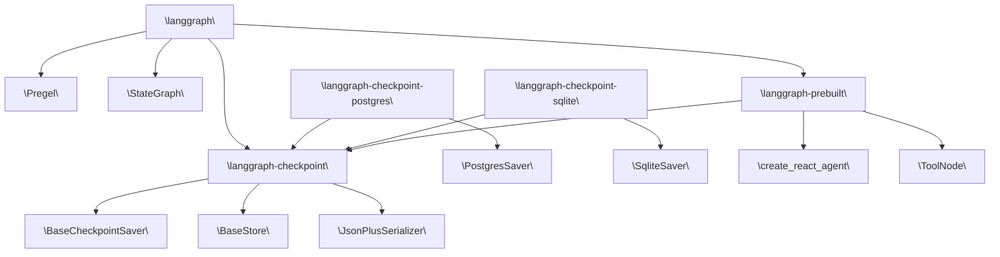

# Package Structure and Dependencies

Relevant source files

-   [Makefile](https://github.com/langchain-ai/langgraph/blob/1fd51e8f/Makefile)
-   [README.md](https://github.com/langchain-ai/langgraph/blob/1fd51e8f/README.md?plain=1)
-   [libs/checkpoint-postgres/Makefile](https://github.com/langchain-ai/langgraph/blob/1fd51e8f/libs/checkpoint-postgres/Makefile)
-   [libs/checkpoint-postgres/pyproject.toml](https://github.com/langchain-ai/langgraph/blob/1fd51e8f/libs/checkpoint-postgres/pyproject.toml)
-   [libs/checkpoint-postgres/tests/compose-postgres.yml](https://github.com/langchain-ai/langgraph/blob/1fd51e8f/libs/checkpoint-postgres/tests/compose-postgres.yml)
-   [libs/checkpoint-postgres/uv.lock](https://github.com/langchain-ai/langgraph/blob/1fd51e8f/libs/checkpoint-postgres/uv.lock)
-   [libs/checkpoint-sqlite/Makefile](https://github.com/langchain-ai/langgraph/blob/1fd51e8f/libs/checkpoint-sqlite/Makefile)
-   [libs/checkpoint-sqlite/pyproject.toml](https://github.com/langchain-ai/langgraph/blob/1fd51e8f/libs/checkpoint-sqlite/pyproject.toml)
-   [libs/checkpoint-sqlite/uv.lock](https://github.com/langchain-ai/langgraph/blob/1fd51e8f/libs/checkpoint-sqlite/uv.lock)
-   [libs/checkpoint/Makefile](https://github.com/langchain-ai/langgraph/blob/1fd51e8f/libs/checkpoint/Makefile)
-   [libs/checkpoint/langgraph/checkpoint/serde/jsonplus.py](https://github.com/langchain-ai/langgraph/blob/1fd51e8f/libs/checkpoint/langgraph/checkpoint/serde/jsonplus.py)
-   [libs/checkpoint/pyproject.toml](https://github.com/langchain-ai/langgraph/blob/1fd51e8f/libs/checkpoint/pyproject.toml)
-   [libs/checkpoint/tests/test\_jsonplus.py](https://github.com/langchain-ai/langgraph/blob/1fd51e8f/libs/checkpoint/tests/test_jsonplus.py)
-   [libs/checkpoint/uv.lock](https://github.com/langchain-ai/langgraph/blob/1fd51e8f/libs/checkpoint/uv.lock)
-   [libs/cli/Makefile](https://github.com/langchain-ai/langgraph/blob/1fd51e8f/libs/cli/Makefile)
-   [libs/langgraph/Makefile](https://github.com/langchain-ai/langgraph/blob/1fd51e8f/libs/langgraph/Makefile)
-   [libs/langgraph/README.md](https://github.com/langchain-ai/langgraph/blob/1fd51e8f/libs/langgraph/README.md?plain=1)
-   [libs/langgraph/pyproject.toml](https://github.com/langchain-ai/langgraph/blob/1fd51e8f/libs/langgraph/pyproject.toml)
-   [libs/langgraph/tests/\_\_snapshots\_\_/test\_pregel.ambr](https://github.com/langchain-ai/langgraph/blob/1fd51e8f/libs/langgraph/tests/__snapshots__/test_pregel.ambr)
-   [libs/langgraph/tests/\_\_snapshots\_\_/test\_pregel\_async.ambr](https://github.com/langchain-ai/langgraph/blob/1fd51e8f/libs/langgraph/tests/__snapshots__/test_pregel_async.ambr)
-   [libs/langgraph/tests/conftest.py](https://github.com/langchain-ai/langgraph/blob/1fd51e8f/libs/langgraph/tests/conftest.py)
-   [libs/langgraph/uv.lock](https://github.com/langchain-ai/langgraph/blob/1fd51e8f/libs/langgraph/uv.lock)
-   [libs/prebuilt/Makefile](https://github.com/langchain-ai/langgraph/blob/1fd51e8f/libs/prebuilt/Makefile)
-   [libs/prebuilt/pyproject.toml](https://github.com/langchain-ai/langgraph/blob/1fd51e8f/libs/prebuilt/pyproject.toml)
-   [libs/prebuilt/tests/any\_str.py](https://github.com/langchain-ai/langgraph/blob/1fd51e8f/libs/prebuilt/tests/any_str.py)
-   [libs/prebuilt/tests/memory\_assert.py](https://github.com/langchain-ai/langgraph/blob/1fd51e8f/libs/prebuilt/tests/memory_assert.py)
-   [libs/prebuilt/tests/messages.py](https://github.com/langchain-ai/langgraph/blob/1fd51e8f/libs/prebuilt/tests/messages.py)
-   [libs/prebuilt/uv.lock](https://github.com/langchain-ai/langgraph/blob/1fd51e8f/libs/prebuilt/uv.lock)
-   [libs/sdk-py/Makefile](https://github.com/langchain-ai/langgraph/blob/1fd51e8f/libs/sdk-py/Makefile)
-   [libs/sdk-py/uv.lock](https://github.com/langchain-ai/langgraph/blob/1fd51e8f/libs/sdk-py/uv.lock)

This page enumerates every package in the LangGraph monorepo, describes what each package is responsible for, and documents the inter-package dependency graph. It covers the source layout under `libs/` and the declared runtime dependencies of each package.

For details on the monorepo's build and dependency management system, see [Monorepo Structure and Build System](/langchain-ai/langgraph/2.1-monorepo-structure-and-build-system). For details on the persistence interfaces, see [Persistence and Memory](/langchain-ai/langgraph/4-persistence-and-memory). For CLI and deployment specifics, see [CLI and Deployment](/langchain-ai/langgraph/6-cli-and-deployment).

---

## Repository Layout

The monorepo organizes all Python packages under the `libs/` directory. Each subdirectory is an independently installable Python package with its own `pyproject.toml` and `uv.lock` file.

```
libs/
├── langgraph/              # Core graph execution library
├── checkpoint/             # Base persistence interfaces
├── checkpoint-postgres/    # PostgreSQL checkpoint/store implementations
├── checkpoint-sqlite/      # SQLite checkpoint implementation
├── prebuilt/               # High-level agent APIs
├── sdk-py/                 # Python client SDK
├── cli/                    # langgraph CLI tool
└── scheduler-kafka/        # Distributed Kafka-based scheduler
```
The root `Makefile` provides targets to orchestrate tasks across all packages, such as `lint`, `format`, and `test`.

Sources: [libs/langgraph/pyproject.toml83-89](https://github.com/langchain-ai/langgraph/blob/1fd51e8f/libs/langgraph/pyproject.toml#L83-L89) [libs/checkpoint/pyproject.toml1-17](https://github.com/langchain-ai/langgraph/blob/1fd51e8f/libs/checkpoint/pyproject.toml#L1-L17) [libs/prebuilt/pyproject.toml64-68](https://github.com/langchain-ai/langgraph/blob/1fd51e8f/libs/prebuilt/pyproject.toml#L64-L68)

---

## Package Inventory

| Package Name | Directory | Current Version | Primary Role |
| --- | --- | --- | --- |
| `langgraph` | `libs/langgraph/` | 1.1.3 | Core graph construction and execution |
| `langgraph-checkpoint` | `libs/checkpoint/` | 4.0.1 | Abstract checkpoint and store interfaces |
| `langgraph-checkpoint-postgres` | `libs/checkpoint-postgres/` | 3.0.5 | PostgreSQL-backed checkpoint and store |
| `langgraph-checkpoint-sqlite` | `libs/checkpoint-sqlite/` | 3.0.4 | SQLite-backed checkpoint implementation |
| `langgraph-prebuilt` | `libs/prebuilt/` | 1.0.8 | Pre-built agent graphs (`create_react_agent`, `ToolNode`) |
| `langgraph-sdk` | `libs/sdk-py/` | ≥0.3.0,<0.4.0 | Python client for the LangGraph API server |
| `langgraph-cli` | `libs/cli/` | — | `langgraph` CLI command group |

Sources: [libs/langgraph/pyproject.toml6-33](https://github.com/langchain-ai/langgraph/blob/1fd51e8f/libs/langgraph/pyproject.toml#L6-L33) [libs/checkpoint/pyproject.toml6-17](https://github.com/langchain-ai/langgraph/blob/1fd51e8f/libs/checkpoint/pyproject.toml#L6-L17) [libs/checkpoint-postgres/pyproject.toml6-19](https://github.com/langchain-ai/langgraph/blob/1fd51e8f/libs/checkpoint-postgres/pyproject.toml#L6-L19) [libs/prebuilt/pyproject.toml6-29](https://github.com/langchain-ai/langgraph/blob/1fd51e8f/libs/prebuilt/pyproject.toml#L6-L29)

---

## Package Descriptions

### `langgraph`

The central user-facing library. It provides the `StateGraph` builder, the functional API (`@task`, `@entrypoint`), and the `Pregel` execution engine. It pulls in the SDK and prebuilt components as transitive dependencies to ensure a complete runtime environment.

**Runtime dependencies** declared in [libs/langgraph/pyproject.toml26-33](https://github.com/langchain-ai/langgraph/blob/1fd51e8f/libs/langgraph/pyproject.toml#L26-L33):

-   `langchain-core>=0.1`
-   `langgraph-checkpoint>=2.1.0,<5.0.0`
-   `langgraph-sdk>=0.3.0,<0.4.0`
-   `langgraph-prebuilt>=1.0.8,<1.1.0`
-   `xxhash>=3.5.0`
-   `pydantic>=2.7.4`

---

### `langgraph-checkpoint`

The abstract persistence layer. It defines the base interfaces that all checkpointers must implement, such as `BaseCheckpointSaver`. It is kept minimal to avoid forcing specific database drivers on users.

**Runtime dependencies** declared in [libs/checkpoint/pyproject.toml14-17](https://github.com/langchain-ai/langgraph/blob/1fd51e8f/libs/checkpoint/pyproject.toml#L14-L17):

-   `langchain-core>=0.2.38`
-   `ormsgpack>=1.12.0` (Used for binary serialization via `JsonPlusSerializer`)

---

### `langgraph-checkpoint-postgres`

Implements persistence against PostgreSQL. It provides `PostgresSaver` and `PostgresStore` for state and cross-thread memory.

**Runtime dependencies** declared in [libs/checkpoint-postgres/pyproject.toml14-19](https://github.com/langchain-ai/langgraph/blob/1fd51e8f/libs/checkpoint-postgres/pyproject.toml#L14-L19):

-   `langgraph-checkpoint>=2.1.2,<5.0.0`
-   `orjson>=3.11.5`
-   `psycopg>=3.2.0` (Async-capable PostgreSQL driver)
-   `psycopg-pool>=3.2.0`

---

### `langgraph-checkpoint-sqlite`

Implements persistence against SQLite. It provides `SqliteSaver` for local development and lightweight production use cases.

**Runtime dependencies** declared in [libs/checkpoint-sqlite/pyproject.toml14-18](https://github.com/langchain-ai/langgraph/blob/1fd51e8f/libs/checkpoint-sqlite/pyproject.toml#L14-L18):

-   `langgraph-checkpoint>=3,<5.0.0`
-   `aiosqlite>=0.20`
-   `sqlite-vec>=0.1.6` (Enables vector search capabilities within SQLite)

---

### `langgraph-prebuilt`

Contains high-level agentic patterns like `create_react_agent` and infrastructure components like `ToolNode`.

**Runtime dependencies** declared in [libs/prebuilt/pyproject.toml26-29](https://github.com/langchain-ai/langgraph/blob/1fd51e8f/libs/prebuilt/pyproject.toml#L26-L29):

-   `langgraph-checkpoint>=2.1.0,<5.0.0`
-   `langchain-core>=1.0.0`

Note: `langgraph-prebuilt` does **not** depend on `langgraph` at runtime to avoid circularity. `langgraph` depends on `prebuilt`.

---

## Dependency Graph

The following diagram illustrates how core packages and their corresponding code entities relate to one another.

**Diagram: System Components to Code Entities**


Sources: [libs/langgraph/pyproject.toml26-33](https://github.com/langchain-ai/langgraph/blob/1fd51e8f/libs/langgraph/pyproject.toml#L26-L33) [libs/checkpoint/pyproject.toml14-17](https://github.com/langchain-ai/langgraph/blob/1fd51e8f/libs/checkpoint/pyproject.toml#L14-L17) [libs/prebuilt/pyproject.toml26-29](https://github.com/langchain-ai/langgraph/blob/1fd51e8f/libs/prebuilt/pyproject.toml#L26-L29)

---

## Development Dependency Management

During development, the monorepo uses `uv` workspace features to resolve internal dependencies to local file paths rather than PyPI versions.

**Diagram: Local Path Resolution**

Sources: [libs/langgraph/pyproject.toml83-89](https://github.com/langchain-ai/langgraph/blob/1fd51e8f/libs/langgraph/pyproject.toml#L83-L89) [libs/prebuilt/pyproject.toml64-68](https://github.com/langchain-ai/langgraph/blob/1fd51e8f/libs/prebuilt/pyproject.toml#L64-L68)

---

## Python Version Support

All packages in the monorepo target Python `>=3.10`. The project is tested against CPython 3.10 through 3.13 and PyPy.

Sources: [libs/langgraph/pyproject.toml10-25](https://github.com/langchain-ai/langgraph/blob/1fd51e8f/libs/langgraph/pyproject.toml#L10-L25) [libs/prebuilt/pyproject.toml10-25](https://github.com/langchain-ai/langgraph/blob/1fd51e8f/libs/prebuilt/pyproject.toml#L10-L25)

---

## Key External Dependencies

| Package | Used By | Role |
| --- | --- | --- |
| `langchain-core` | Most packages | Message types and Runnable protocol |
| `ormsgpack` | `langgraph-checkpoint` | High-performance binary serialization |
| `psycopg` | `langgraph-checkpoint-postgres` | Non-blocking PostgreSQL communication |
| `aiosqlite` | `langgraph-checkpoint-sqlite` | Async wrapper for SQLite |
| `pydantic` | `langgraph` | Data validation and settings management |
| `xxhash` | `langgraph` | Fast non-cryptographic hashing for state tracking |

Sources: [libs/langgraph/pyproject.toml26-33](https://github.com/langchain-ai/langgraph/blob/1fd51e8f/libs/langgraph/pyproject.toml#L26-L33) [libs/checkpoint/pyproject.toml14-17](https://github.com/langchain-ai/langgraph/blob/1fd51e8f/libs/checkpoint/pyproject.toml#L14-L17) [libs/checkpoint-postgres/pyproject.toml14-19](https://github.com/langchain-ai/langgraph/blob/1fd51e8f/libs/checkpoint-postgres/pyproject.toml#L14-L19)
