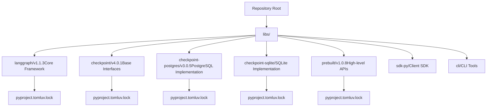
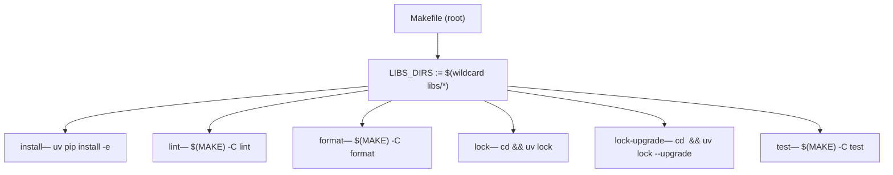
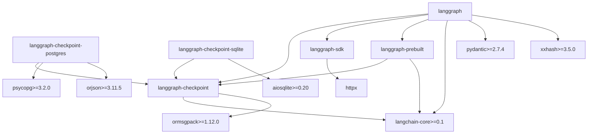
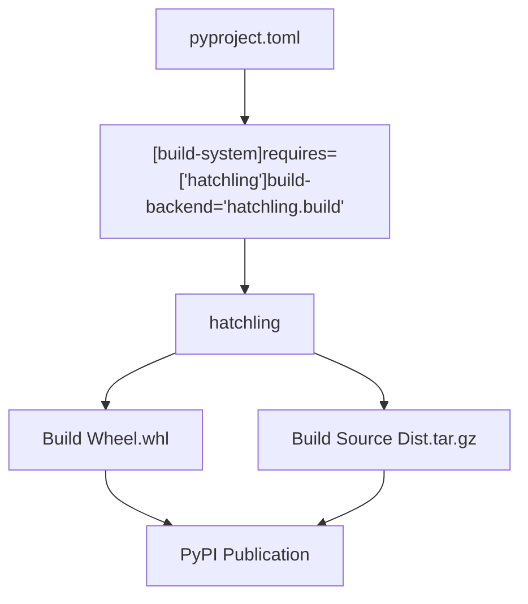

# Monorepo Structure and Build System

Relevant source files

-   [libs/checkpoint-postgres/Makefile](https://github.com/langchain-ai/langgraph/blob/1fd51e8f/libs/checkpoint-postgres/Makefile)
-   [libs/checkpoint-postgres/pyproject.toml](https://github.com/langchain-ai/langgraph/blob/1fd51e8f/libs/checkpoint-postgres/pyproject.toml)
-   [libs/checkpoint-postgres/tests/compose-postgres.yml](https://github.com/langchain-ai/langgraph/blob/1fd51e8f/libs/checkpoint-postgres/tests/compose-postgres.yml)
-   [libs/checkpoint-postgres/uv.lock](https://github.com/langchain-ai/langgraph/blob/1fd51e8f/libs/checkpoint-postgres/uv.lock)
-   [libs/checkpoint-sqlite/Makefile](https://github.com/langchain-ai/langgraph/blob/1fd51e8f/libs/checkpoint-sqlite/Makefile)
-   [libs/checkpoint-sqlite/pyproject.toml](https://github.com/langchain-ai/langgraph/blob/1fd51e8f/libs/checkpoint-sqlite/pyproject.toml)
-   [libs/checkpoint-sqlite/uv.lock](https://github.com/langchain-ai/langgraph/blob/1fd51e8f/libs/checkpoint-sqlite/uv.lock)
-   [libs/checkpoint/Makefile](https://github.com/langchain-ai/langgraph/blob/1fd51e8f/libs/checkpoint/Makefile)
-   [libs/checkpoint/langgraph/checkpoint/serde/jsonplus.py](https://github.com/langchain-ai/langgraph/blob/1fd51e8f/libs/checkpoint/langgraph/checkpoint/serde/jsonplus.py)
-   [libs/checkpoint/pyproject.toml](https://github.com/langchain-ai/langgraph/blob/1fd51e8f/libs/checkpoint/pyproject.toml)
-   [libs/checkpoint/tests/test\_jsonplus.py](https://github.com/langchain-ai/langgraph/blob/1fd51e8f/libs/checkpoint/tests/test_jsonplus.py)
-   [libs/checkpoint/uv.lock](https://github.com/langchain-ai/langgraph/blob/1fd51e8f/libs/checkpoint/uv.lock)
-   [libs/cli/Makefile](https://github.com/langchain-ai/langgraph/blob/1fd51e8f/libs/cli/Makefile)
-   [libs/langgraph/Makefile](https://github.com/langchain-ai/langgraph/blob/1fd51e8f/libs/langgraph/Makefile)
-   [libs/langgraph/pyproject.toml](https://github.com/langchain-ai/langgraph/blob/1fd51e8f/libs/langgraph/pyproject.toml)
-   [libs/langgraph/tests/\_\_snapshots\_\_/test\_pregel.ambr](https://github.com/langchain-ai/langgraph/blob/1fd51e8f/libs/langgraph/tests/__snapshots__/test_pregel.ambr)
-   [libs/langgraph/tests/\_\_snapshots\_\_/test\_pregel\_async.ambr](https://github.com/langchain-ai/langgraph/blob/1fd51e8f/libs/langgraph/tests/__snapshots__/test_pregel_async.ambr)
-   [libs/langgraph/tests/conftest.py](https://github.com/langchain-ai/langgraph/blob/1fd51e8f/libs/langgraph/tests/conftest.py)
-   [libs/langgraph/uv.lock](https://github.com/langchain-ai/langgraph/blob/1fd51e8f/libs/langgraph/uv.lock)
-   [libs/prebuilt/Makefile](https://github.com/langchain-ai/langgraph/blob/1fd51e8f/libs/prebuilt/Makefile)
-   [libs/prebuilt/pyproject.toml](https://github.com/langchain-ai/langgraph/blob/1fd51e8f/libs/prebuilt/pyproject.toml)
-   [libs/prebuilt/tests/any\_str.py](https://github.com/langchain-ai/langgraph/blob/1fd51e8f/libs/prebuilt/tests/any_str.py)
-   [libs/prebuilt/tests/memory\_assert.py](https://github.com/langchain-ai/langgraph/blob/1fd51e8f/libs/prebuilt/tests/memory_assert.py)
-   [libs/prebuilt/tests/messages.py](https://github.com/langchain-ai/langgraph/blob/1fd51e8f/libs/prebuilt/tests/messages.py)
-   [libs/prebuilt/uv.lock](https://github.com/langchain-ai/langgraph/blob/1fd51e8f/libs/prebuilt/uv.lock)
-   [libs/sdk-py/Makefile](https://github.com/langchain-ai/langgraph/blob/1fd51e8f/libs/sdk-py/Makefile)
-   [libs/sdk-py/uv.lock](https://github.com/langchain-ai/langgraph/blob/1fd51e8f/libs/sdk-py/uv.lock)

This document describes the organization of the LangGraph repository as a Python monorepo, including the package structure, build system configuration, workspace dependency management, and the role of the `uv` package manager.

---

## Overview

The LangGraph repository is structured as a **monorepo** with multiple independent but related Python packages located in the `libs/` directory. Each package is independently versioned and published to PyPI, but they share a common development environment and build infrastructure. The monorepo uses `uv` as the package manager and supports editable workspace dependencies for efficient local development.

---

## Directory Structure

The repository organizes packages in a flat hierarchy under `libs/`:


**Sources:** [libs/langgraph/pyproject.toml1-129](https://github.com/langchain-ai/langgraph/blob/1fd51e8f/libs/langgraph/pyproject.toml#L1-L129) [libs/checkpoint/pyproject.toml1-82](https://github.com/langchain-ai/langgraph/blob/1fd51e8f/libs/checkpoint/pyproject.toml#L1-L82) [libs/checkpoint-postgres/pyproject.toml1-87](https://github.com/langchain-ai/langgraph/blob/1fd51e8f/libs/checkpoint-postgres/pyproject.toml#L1-L87) [libs/prebuilt/pyproject.toml1-97](https://github.com/langchain-ai/langgraph/blob/1fd51e8f/libs/prebuilt/pyproject.toml#L1-L97)

Each package directory contains:

-   `pyproject.toml` - Package metadata, dependencies, and build configuration.
-   `uv.lock` - Locked dependency versions (in packages with dev dependencies).
-   Package source code in a subdirectory matching the package name (e.g., `libs/langgraph/langgraph`).
-   `README.md` - Package-specific documentation.

---

## Makefile Build System

Each package ships a `Makefile` with a consistent set of targets. The repository root also has a `Makefile` that orchestrates targets across all packages.

### Root Makefile Orchestration

The root `Makefile` discovers all packages by globbing `libs/*` and delegates to each package's own `Makefile`.

**Root Makefile target dispatch — `Makefile`**


-   `install` — iterates every `libs/*/pyproject.toml` and runs `uv pip install -e <dir>` to create editable installs in the root virtual environment.
-   `lock` — runs `uv lock` in each package directory to regenerate `uv.lock` against current constraints.
-   `lock-upgrade` — same as `lock` but passes `--upgrade` to pull latest compatible versions.
-   `lint`, `format`, `test` — delegates to each package's own `Makefile` via `$(MAKE) -C <dir> <target>`.

### Per-Package Makefiles

Standard targets are maintained across per-package Makefiles to ensure a uniform developer experience.

| Target | What it runs | Notes |
| --- | --- | --- |
| `lint` | `ruff check .`, `ruff format --diff`, `mypy` | Fails on any issue. |
| `format` | `ruff format`, `ruff check --select I --fix` | Modifies files in-place. |
| `type` | `mypy <package>` | Standalone type check. |
| `test` | `uv run pytest` | May start Docker services first. |
| `test_watch` | `uv run ptw` | Re-runs tests on file save. |
| `integration_tests` | `uv run pytest integration_tests` | Long-running / external deps. |
| `coverage` | `pytest --cov` | Generates XML + terminal report. |
| `spell_check` / `spell_fix` | `codespell --toml pyproject.toml` | Typo detection. |

**Sources:** [libs/langgraph/Makefile1-160](https://github.com/langchain-ai/langgraph/blob/1fd51e8f/libs/langgraph/Makefile#L1-L160) [libs/checkpoint/Makefile1-41](https://github.com/langchain-ai/langgraph/blob/1fd51e8f/libs/checkpoint/Makefile#L1-L41) [libs/checkpoint-postgres/Makefile1-70](https://github.com/langchain-ai/langgraph/blob/1fd51e8f/libs/checkpoint-postgres/Makefile#L1-L70) [libs/prebuilt/Makefile1-86](https://github.com/langchain-ai/langgraph/blob/1fd51e8f/libs/prebuilt/Makefile#L1-L86) [libs/cli/Makefile1-44](https://github.com/langchain-ai/langgraph/blob/1fd51e8f/libs/cli/Makefile#L1-L44) [libs/sdk-py/Makefile1-28](https://github.com/langchain-ai/langgraph/blob/1fd51e8f/libs/sdk-py/Makefile#L1-L28)

### Service Management for Tests

Packages whose tests require PostgreSQL or Redis include `start-services` and `stop-services` targets backed by Docker Compose files.

**Service lifecycle in `test` targets**

> **[Mermaid sequence]**
> *(图表结构无法解析)*

**Sources:** [libs/langgraph/Makefile40-73](https://github.com/langchain-ai/langgraph/blob/1fd51e8f/libs/langgraph/Makefile#L40-L73) [libs/prebuilt/Makefile10-25](https://github.com/langchain-ai/langgraph/blob/1fd51e8f/libs/prebuilt/Makefile#L10-L25) [libs/checkpoint-postgres/Makefile7-33](https://github.com/langchain-ai/langgraph/blob/1fd51e8f/libs/checkpoint-postgres/Makefile#L7-L33)

The `langgraph` package's `test` target also manages a local `langgraph dev` server during execution [libs/langgraph/Makefile46-56](https://github.com/langchain-ai/langgraph/blob/1fd51e8f/libs/langgraph/Makefile#L46-L56) The `NO_DOCKER` environment variable allows skipping external services when Docker is unavailable [libs/langgraph/Makefile59-74](https://github.com/langchain-ai/langgraph/blob/1fd51e8f/libs/langgraph/Makefile#L59-L74)

---

## Package Dependency Graph

The packages have a clear dependency hierarchy designed to minimize coupling:


**Sources:** [libs/langgraph/pyproject.toml26-33](https://github.com/langchain-ai/langgraph/blob/1fd51e8f/libs/langgraph/pyproject.toml#L26-L33) [libs/checkpoint/pyproject.toml14-17](https://github.com/langchain-ai/langgraph/blob/1fd51e8f/libs/checkpoint/pyproject.toml#L14-L17) [libs/checkpoint-postgres/pyproject.toml14-19](https://github.com/langchain-ai/langgraph/blob/1fd51e8f/libs/checkpoint-postgres/pyproject.toml#L14-L19) [libs/prebuilt/pyproject.toml26-29](https://github.com/langchain-ai/langgraph/blob/1fd51e8f/libs/prebuilt/pyproject.toml#L26-L29)

### Dependency Constraints

Internal package dependencies use version ranges to allow flexibility:

| Package | Checkpoint Version | SDK Version | Prebuilt Version |
| --- | --- | --- | --- |
| `langgraph` | `>=2.1.0,<5.0.0` | `>=0.3.0,<0.4.0` | `>=1.0.8,<1.1.0` |
| `langgraph-prebuilt` | `>=2.1.0,<5.0.0` | \- | \- |
| `langgraph-checkpoint-postgres` | `>=2.1.2,<5.0.0` | \- | \- |

**Sources:** [libs/langgraph/pyproject.toml28-30](https://github.com/langchain-ai/langgraph/blob/1fd51e8f/libs/langgraph/pyproject.toml#L28-L30) [libs/prebuilt/pyproject.toml27](https://github.com/langchain-ai/langgraph/blob/1fd51e8f/libs/prebuilt/pyproject.toml#L27-L27) [libs/checkpoint-postgres/pyproject.toml15](https://github.com/langchain-ai/langgraph/blob/1fd51e8f/libs/checkpoint-postgres/pyproject.toml#L15-L15)

---

## Build System Architecture

### Build Backend: Hatchling

All packages use `hatchling` as their build backend, configured via `pyproject.toml`:


**Sources:** [libs/langgraph/pyproject.toml1-3](https://github.com/langchain-ai/langgraph/blob/1fd51e8f/libs/langgraph/pyproject.toml#L1-L3) [libs/checkpoint/pyproject.toml1-3](https://github.com/langchain-ai/langgraph/blob/1fd51e8f/libs/checkpoint/pyproject.toml#L1-L3) [libs/checkpoint-postgres/pyproject.toml1-3](https://github.com/langchain-ai/langgraph/blob/1fd51e8f/libs/checkpoint-postgres/pyproject.toml#L1-L3)

### Wheel Configuration

Each package specifies which directories to include in the built wheel. For example, `langgraph` includes only the source package [libs/langgraph/pyproject.toml120-121](https://github.com/langchain-ai/langgraph/blob/1fd51e8f/libs/langgraph/pyproject.toml#L120-L121) while checkpoint packages use the `include` key [libs/checkpoint/pyproject.toml48-49](https://github.com/langchain-ai/langgraph/blob/1fd51e8f/libs/checkpoint/pyproject.toml#L48-L49)

---

## Package Manager: uv

The repository uses `uv` for fast dependency resolution and cross-platform lock files.

### UV Lock Files

Each package maintains a `uv.lock` file that pins exact versions of all transitive dependencies. These lock files include SHA256 hashes and platform-specific wheels to ensure reproducible environments.

**Sources:** [libs/langgraph/uv.lock1-17](https://github.com/langchain-ai/langgraph/blob/1fd51e8f/libs/langgraph/uv.lock#L1-L17) [libs/checkpoint/uv.lock1-30](https://github.com/langchain-ai/langgraph/blob/1fd51e8f/libs/checkpoint/uv.lock#L1-L30) [libs/checkpoint-postgres/uv.lock1-25](https://github.com/langchain-ai/langgraph/blob/1fd51e8f/libs/checkpoint-postgres/uv.lock#L1-L25)

---

## Workspace Dependencies and Editable Installs

### Workspace Sources Configuration

For local development, packages reference each other as editable workspace dependencies using `[tool.uv.sources]`. This allows changes in a dependency (like `langgraph-checkpoint`) to be immediately reflected in a dependent package (like `langgraph`) without a re-install.

```
[tool.uv.sources]langgraph-prebuilt = { path = "../prebuilt", editable = true }langgraph-checkpoint = { path = "../checkpoint", editable = true }langgraph-checkpoint-sqlite = { path = "../checkpoint-sqlite", editable = true }langgraph-checkpoint-postgres = { path = "../checkpoint-postgres", editable = true }langgraph-sdk = { path = "../sdk-py", editable = true }langgraph-cli = { path = "../cli", editable = true }
```
**Sources:** [libs/langgraph/pyproject.toml83-89](https://github.com/langchain-ai/langgraph/blob/1fd51e8f/libs/langgraph/pyproject.toml#L83-L89) [libs/prebuilt/pyproject.toml64-68](https://github.com/langchain-ai/langgraph/blob/1fd51e8f/libs/prebuilt/pyproject.toml#L64-L68) [libs/checkpoint-postgres/pyproject.toml50-51](https://github.com/langchain-ai/langgraph/blob/1fd51e8f/libs/checkpoint-postgres/pyproject.toml#L50-L51)

---

## Dependency Groups

Packages define sets of dependencies for various purposes using `[dependency-groups]`.

| Group | Purpose | Key Dependencies |
| --- | --- | --- |
| `test` | Testing infrastructure | `pytest`, `pytest-asyncio`, `syrupy`, `httpx` |
| `lint` | Code quality | `mypy`, `ruff`, `codespell` |
| `dev` | Complete environment | Includes `test` and `lint` groups |

**Sources:** [libs/langgraph/pyproject.toml45-80](https://github.com/langchain-ai/langgraph/blob/1fd51e8f/libs/langgraph/pyproject.toml#L45-L80) [libs/checkpoint/pyproject.toml25-46](https://github.com/langchain-ai/langgraph/blob/1fd51e8f/libs/checkpoint/pyproject.toml#L25-L46) [libs/prebuilt/pyproject.toml37-59](https://github.com/langchain-ai/langgraph/blob/1fd51e8f/libs/prebuilt/pyproject.toml#L37-L59)

---

## Development Tools Configuration

### Ruff (Linting and Formatting)

Linting rules are standardized across packages, selecting for errors (`E`), pyflakes (`F`), isort (`I`), and pyupgrade (`UP`).

**Sources:** [libs/langgraph/pyproject.toml91-97](https://github.com/langchain-ai/langgraph/blob/1fd51e8f/libs/langgraph/pyproject.toml#L91-L97) [libs/checkpoint/pyproject.toml55-65](https://github.com/langchain-ai/langgraph/blob/1fd51e8f/libs/checkpoint/pyproject.toml#L55-L65) [libs/prebuilt/pyproject.toml77-80](https://github.com/langchain-ai/langgraph/blob/1fd51e8f/libs/prebuilt/pyproject.toml#L77-L80)

### Mypy (Type Checking)

Strict type checking is enforced with `disallow_untyped_defs = "True"` and `explicit_package_bases = "True"`.

**Sources:** [libs/langgraph/pyproject.toml102-110](https://github.com/langchain-ai/langgraph/blob/1fd51e8f/libs/langgraph/pyproject.toml#L102-L110) [libs/checkpoint/pyproject.toml73-81](https://github.com/langchain-ai/langgraph/blob/1fd51e8f/libs/checkpoint/pyproject.toml#L73-L81) [libs/prebuilt/pyproject.toml88-96](https://github.com/langchain-ai/langgraph/blob/1fd51e8f/libs/prebuilt/pyproject.toml#L88-L96)

### Pytest Configuration

Test execution settings emphasize strict configuration and timing.

**Sources:** [libs/langgraph/pyproject.toml123-124](https://github.com/langchain-ai/langgraph/blob/1fd51e8f/libs/langgraph/pyproject.toml#L123-L124) [libs/checkpoint/pyproject.toml51-53](https://github.com/langchain-ai/langgraph/blob/1fd51e8f/libs/checkpoint/pyproject.toml#L51-L53) [libs/checkpoint-postgres/pyproject.toml56-58](https://github.com/langchain-ai/langgraph/blob/1fd51e8f/libs/checkpoint-postgres/pyproject.toml#L56-L58)

---

## Python Version Support

All packages require Python 3.10 or higher and explicitly support Python 3.10 through 3.13.

**Sources:** [libs/langgraph/pyproject.toml10-24](https://github.com/langchain-ai/langgraph/blob/1fd51e8f/libs/langgraph/pyproject.toml#L10-L24) [libs/prebuilt/pyproject.toml10-24](https://github.com/langchain-ai/langgraph/blob/1fd51e8f/libs/prebuilt/pyproject.toml#L10-L24)
