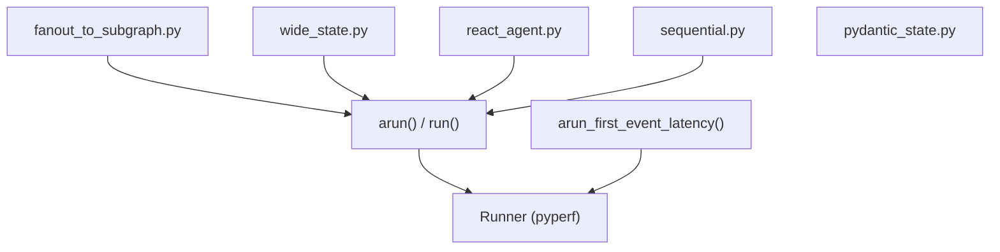

# Testing Infrastructure

Relevant source files

-   [libs/checkpoint-conformance/langgraph/checkpoint/conformance/test\_utils.py](https://github.com/langchain-ai/langgraph/blob/1fd51e8f/libs/checkpoint-conformance/langgraph/checkpoint/conformance/test_utils.py)
-   [libs/checkpoint-conformance/uv.lock](https://github.com/langchain-ai/langgraph/blob/1fd51e8f/libs/checkpoint-conformance/uv.lock)
-   [libs/checkpoint-postgres/Makefile](https://github.com/langchain-ai/langgraph/blob/1fd51e8f/libs/checkpoint-postgres/Makefile)
-   [libs/checkpoint-postgres/tests/compose-postgres.yml](https://github.com/langchain-ai/langgraph/blob/1fd51e8f/libs/checkpoint-postgres/tests/compose-postgres.yml)
-   [libs/checkpoint-sqlite/Makefile](https://github.com/langchain-ai/langgraph/blob/1fd51e8f/libs/checkpoint-sqlite/Makefile)
-   [libs/checkpoint/Makefile](https://github.com/langchain-ai/langgraph/blob/1fd51e8f/libs/checkpoint/Makefile)
-   [libs/cli/Makefile](https://github.com/langchain-ai/langgraph/blob/1fd51e8f/libs/cli/Makefile)
-   [libs/langgraph/Makefile](https://github.com/langchain-ai/langgraph/blob/1fd51e8f/libs/langgraph/Makefile)
-   [libs/langgraph/bench/\_\_main\_\_.py](https://github.com/langchain-ai/langgraph/blob/1fd51e8f/libs/langgraph/bench/__main__.py)
-   [libs/langgraph/bench/fanout\_to\_subgraph.py](https://github.com/langchain-ai/langgraph/blob/1fd51e8f/libs/langgraph/bench/fanout_to_subgraph.py)
-   [libs/langgraph/bench/pydantic\_state.py](https://github.com/langchain-ai/langgraph/blob/1fd51e8f/libs/langgraph/bench/pydantic_state.py)
-   [libs/langgraph/bench/react\_agent.py](https://github.com/langchain-ai/langgraph/blob/1fd51e8f/libs/langgraph/bench/react_agent.py)
-   [libs/langgraph/bench/sequential.py](https://github.com/langchain-ai/langgraph/blob/1fd51e8f/libs/langgraph/bench/sequential.py)
-   [libs/langgraph/bench/wide\_dict.py](https://github.com/langchain-ai/langgraph/blob/1fd51e8f/libs/langgraph/bench/wide_dict.py)
-   [libs/langgraph/bench/wide\_state.py](https://github.com/langchain-ai/langgraph/blob/1fd51e8f/libs/langgraph/bench/wide_state.py)
-   [libs/langgraph/tests/conftest.py](https://github.com/langchain-ai/langgraph/blob/1fd51e8f/libs/langgraph/tests/conftest.py)
-   [libs/prebuilt/Makefile](https://github.com/langchain-ai/langgraph/blob/1fd51e8f/libs/prebuilt/Makefile)
-   [libs/prebuilt/tests/any\_str.py](https://github.com/langchain-ai/langgraph/blob/1fd51e8f/libs/prebuilt/tests/any_str.py)
-   [libs/prebuilt/tests/memory\_assert.py](https://github.com/langchain-ai/langgraph/blob/1fd51e8f/libs/prebuilt/tests/memory_assert.py)
-   [libs/prebuilt/tests/messages.py](https://github.com/langchain-ai/langgraph/blob/1fd51e8f/libs/prebuilt/tests/messages.py)
-   [libs/sdk-py/Makefile](https://github.com/langchain-ai/langgraph/blob/1fd51e8f/libs/sdk-py/Makefile)

This page documents the testing setup, pytest configuration, test matrices, integration tests, benchmarking, and test helper utilities used across the LangGraph monorepo. The infrastructure is designed to validate the core graph engine, persistence layers, and prebuilt components across multiple Python versions and database backends.

---

## Overview

The test suite is built around a parameterized pytest fixture system that runs the same test against multiple backend implementations (in-memory, SQLite, PostgreSQL). Fixtures are conditionally parameterized at collection time based on the `NO_DOCKER` environment variable, which determines whether Docker-dependent backends like PostgreSQL and Redis are included in the test matrix.

The central configuration resides in `libs/langgraph/tests/conftest.py`, which wires together checkpointer, store, and cache fixtures.

---

## Fixture Architecture

The testing infrastructure uses a layered fixture approach to provide interchangeable components for graphs.

**Fixture Dependency and Data Flow**

```mermaid
flowchart TD
    SC["sync_checkpointer"]
    AC["async_checkpointer"]
    SS["sync_store"]
    AS["async_store"]
    CF["cache"]
    DU["durability"]
    DUUID["deterministic_uuids"]
    CM["_checkpointer_memory()"]
    CMS["_checkpointer_memory_migrate_sends()"]
    CS["_checkpointer_sqlite()"]
    CSA["_checkpointer_sqlite_aes()"]
    CSAI["_checkpointer_sqlite_aio()"]
    CP["_checkpointer_postgres()"]
    CPP["_checkpointer_postgres_pipe()"]
    CPAIO["_checkpointer_postgres_aio()"]
    SM["_store_memory()"]
    SP["_store_postgres()"]
    SPAIO["_store_postgres_aio()"]

    SC --> CM
    SC --> CMS
    SC --> CS
    SC --> CP
    AC --> CM
    AC --> CSAI
    AC --> CPAIO
    SS --> SM
    SS --> SP
    AS --> SM
    AS --> SPAIO
```


Sources: [libs/langgraph/tests/conftest.py1-227](https://github.com/langchain-ai/langgraph/blob/1fd51e8f/libs/langgraph/tests/conftest.py#L1-L227) [libs/langgraph/tests/conftest.py42-141](https://github.com/langchain-ai/langgraph/blob/1fd51e8f/libs/langgraph/tests/conftest.py#L42-L141)

---

## The `NO_DOCKER` Environment Variable

A critical control for the testing environment is the `NO_DOCKER` flag. It determines if the test runner expects external services (Postgres, Redis) to be available via Docker.

[libs/langgraph/tests/conftest.py39](https://github.com/langchain-ai/langgraph/blob/1fd51e8f/libs/langgraph/tests/conftest.py#L39-L39) defines:

```
NO_DOCKER = os.getenv("NO_DOCKER", "false") == "true"
```
When `NO_DOCKER=true`, fixtures fall back to in-process or file-based backends (SQLite/Memory) to allow testing in restricted environments or for fast local iterations.

**Fixture Parameterization Matrix**

| Fixture | `NO_DOCKER=false` (Default) | `NO_DOCKER=true` |
| --- | --- | --- |
| `sync_checkpointer` | memory, memory\_migrate\_sends, sqlite, sqlite\_aes, postgres, postgres\_pipe, postgres\_pool | memory, sqlite, sqlite\_aes |
| `async_checkpointer` | memory, sqlite\_aio, postgres\_aio, postgres\_aio\_pipe, postgres\_aio\_pool | memory, sqlite\_aio |
| `sync_store` | in\_memory, postgres, postgres\_pipe, postgres\_pool | in\_memory |
| `async_store` | in\_memory, postgres\_aio, postgres\_aio\_pipe, postgres\_aio\_pool | in\_memory |
| `cache` | sqlite, memory, redis | sqlite, memory |

Sources: [libs/langgraph/tests/conftest.py60-63](https://github.com/langchain-ai/langgraph/blob/1fd51e8f/libs/langgraph/tests/conftest.py#L60-L63) [libs/langgraph/tests/conftest.py92-96](https://github.com/langchain-ai/langgraph/blob/1fd51e8f/libs/langgraph/tests/conftest.py#L92-L96) [libs/langgraph/tests/conftest.py144-161](https://github.com/langchain-ai/langgraph/blob/1fd51e8f/libs/langgraph/tests/conftest.py#L144-L161)

---

## Checkpointer and Store Fixtures

### Checkpointer Implementation Testing

The `sync_checkpointer` and `async_checkpointer` fixtures ensure that `StateGraph` persistence works identically across all supported `BaseCheckpointSaver` implementations.

-   **Sync variants**: Include `SqliteSaver`, `PostgresSaver` (with pipeline and pool variants), and `InMemorySaver` [libs/langgraph/tests/conftest.py165-186](https://github.com/langchain-ai/langgraph/blob/1fd51e8f/libs/langgraph/tests/conftest.py#L165-L186)
-   **Async variants**: Include `AsyncSqliteSaver` and `AsyncPostgresSaver` [libs/langgraph/tests/conftest.py209-225](https://github.com/langchain-ai/langgraph/blob/1fd51e8f/libs/langgraph/tests/conftest.py#L209-L225)

### Store Implementation Testing

The `sync_store` and `async_store` fixtures provide instances of `BaseStore` (e.g., `InMemoryStore`, `PostgresStore`) to test cross-thread memory and semantic search capabilities [libs/langgraph/tests/conftest.py98-141](https://github.com/langchain-ai/langgraph/blob/1fd51e8f/libs/langgraph/tests/conftest.py#L98-L141)

---

## Cache Fixture and Parallelism

The `cache` fixture [libs/langgraph/tests/conftest.py60-89](https://github.com/langchain-ai/langgraph/blob/1fd51e8f/libs/langgraph/tests/conftest.py#L60-L89) yields `BaseCache` implementations. For `RedisCache`, the infrastructure handles parallel test isolation using `pytest-xdist`.

-   **Isolation**: It retrieves the `workerid` from the pytest config [libs/langgraph/tests/conftest.py71](https://github.com/langchain-ai/langgraph/blob/1fd51e8f/libs/langgraph/tests/conftest.py#L71-L71)
-   **Prefixing**: It applies a worker-specific prefix `test:cache:{worker_id}:` to avoid key collisions between parallel processes [libs/langgraph/tests/conftest.py77](https://github.com/langchain-ai/langgraph/blob/1fd51e8f/libs/langgraph/tests/conftest.py#L77-L77)
-   **Cleanup**: Teardown logic ensures only keys with the worker's specific prefix are deleted [libs/langgraph/tests/conftest.py81-87](https://github.com/langchain-ai/langgraph/blob/1fd51e8f/libs/langgraph/tests/conftest.py#L81-L87)

---

## Benchmarking Infrastructure

LangGraph includes a dedicated benchmarking suite in `libs/langgraph/bench/` to track execution performance, latency, and serialization overhead.

**Benchmarking Components**


### Key Benchmarks

-   **Fanout to Subgraph**: Measures performance of `Send` operations and nested graph execution [libs/langgraph/bench/fanout\_to\_subgraph.py11-58](https://github.com/langchain-ai/langgraph/blob/1fd51e8f/libs/langgraph/bench/fanout_to_subgraph.py#L11-L58)
-   **Wide State**: Tests overhead of managing large state objects with many fields and frequent updates [libs/langgraph/bench/wide\_state.py12-135](https://github.com/langchain-ai/langgraph/blob/1fd51e8f/libs/langgraph/bench/wide_state.py#L12-L135)
-   **Sequential**: Measures the overhead of a graph with thousands of no-op nodes [libs/langgraph/bench/sequential.py7-28](https://github.com/langchain-ai/langgraph/blob/1fd51e8f/libs/langgraph/bench/sequential.py#L7-L28)
-   **Latency**: Measures "Time to First Event" using `arun_first_event_latency` [libs/langgraph/bench/\_\_main\_\_.py36-55](https://github.com/langchain-ai/langgraph/blob/1fd51e8f/libs/langgraph/bench/__main__.py#L36-L55)

### Running Benchmarks

Benchmarks are executed via the `Makefile`:

-   `make benchmark`: Runs the suite rigorously using `pyperf` [libs/langgraph/Makefile17-20](https://github.com/langchain-ai/langgraph/blob/1fd51e8f/libs/langgraph/Makefile#L17-L20)
-   `make profile`: Generates a flamegraph using `py-spy` for a specific graph [libs/langgraph/Makefile29-31](https://github.com/langchain-ai/langgraph/blob/1fd51e8f/libs/langgraph/Makefile#L29-L31)

Sources: [libs/langgraph/bench/\_\_main\_\_.py99-238](https://github.com/langchain-ai/langgraph/blob/1fd51e8f/libs/langgraph/bench/__main__.py#L99-L238) [libs/langgraph/Makefile10-31](https://github.com/langchain-ai/langgraph/blob/1fd51e8f/libs/langgraph/Makefile#L10-L31)

---

## Test Utilities and Helpers

### Matchers for Non-Deterministic Data

Because graph execution involves generated IDs and timestamps, the suite uses custom matchers in `tests/any_str.py`.

-   `AnyStr`: Matches any string or strings with specific prefixes [libs/prebuilt/tests/any\_str.py4-17](https://github.com/langchain-ai/langgraph/blob/1fd51e8f/libs/prebuilt/tests/any_str.py#L4-L17)
-   `_AnyIdHumanMessage`: Creates messages where the `id` field is automatically matched as any string [libs/prebuilt/tests/messages.py11-14](https://github.com/langchain-ai/langgraph/blob/1fd51e8f/libs/prebuilt/tests/messages.py#L11-L14)

### Deterministic UUIDs

The `deterministic_uuids` fixture [libs/langgraph/tests/conftest.py47-52](https://github.com/langchain-ai/langgraph/blob/1fd51e8f/libs/langgraph/tests/conftest.py#L47-L52) patches `uuid.uuid4` to return a predictable sequence. This is essential for tests that compare full state snapshots where internal task IDs must be stable.

### Memory Assertion

`MemorySaverAssertImmutable` [libs/prebuilt/tests/memory\_assert.py16-58](https://github.com/langchain-ai/langgraph/blob/1fd51e8f/libs/prebuilt/tests/memory_assert.py#L16-L58) is used to ensure that the execution engine does not mutate state objects stored in the checkpointer, enforcing the framework's immutability guarantees.

---

## Service Management (Docker)

External services required for integration tests (Postgres, Redis) are managed via Docker Compose.

**Service Topology**

| Service | Image | Port | Configuration File |
| --- | --- | --- | --- |
| PostgreSQL | `pgvector/pgvector:pg16` | 5441 | `tests/compose-postgres.yml` |
| Redis | `redis:alpine` | 6379 | `tests/compose-redis.yml` |

The `Makefile` provides targets to orchestrate these:

-   `make start-services`: Starts Postgres and Redis with `--wait` to ensure they are ready [libs/langgraph/Makefile40-41](https://github.com/langchain-ai/langgraph/blob/1fd51e8f/libs/langgraph/Makefile#L40-L41)
-   `make test_pg_version`: Specifically tests against multiple Postgres versions (e.g., 15, 16) by cycling the `POSTGRES_VERSION` env var [libs/checkpoint-postgres/Makefile18-33](https://github.com/langchain-ai/langgraph/blob/1fd51e8f/libs/checkpoint-postgres/Makefile#L18-L33)

Sources: [libs/langgraph/Makefile40-45](https://github.com/langchain-ai/langgraph/blob/1fd51e8f/libs/langgraph/Makefile#L40-L45) [libs/checkpoint-postgres/Makefile7-15](https://github.com/langchain-ai/langgraph/blob/1fd51e8f/libs/checkpoint-postgres/Makefile#L7-L15)

---

## Test Execution Summary

| Command | Scope | Features |
| --- | --- | --- |
| `uv run pytest` | Unit Tests | Core logic, Pregel algo, StateGraph builder |
| `make integration_tests` | Integration | End-to-end flows, external service connectivity [libs/langgraph/Makefile85-86](https://github.com/langchain-ai/langgraph/blob/1fd51e8f/libs/langgraph/Makefile#L85-L86) |
| `make test_parallel` | All | Uses `pytest-xdist` with `worksteal` distribution [libs/langgraph/Makefile76-83](https://github.com/langchain-ai/langgraph/blob/1fd51e8f/libs/langgraph/Makefile#L76-L83) |
| `make coverage` | Unit/Int | Generates XML reports for CI and terminal summaries [libs/langgraph/Makefile34-38](https://github.com/langchain-ai/langgraph/blob/1fd51e8f/libs/langgraph/Makefile#L34-L38) |

Sources: [libs/langgraph/Makefile61-106](https://github.com/langchain-ai/langgraph/blob/1fd51e8f/libs/langgraph/Makefile#L61-L106) [libs/cli/Makefile8-11](https://github.com/langchain-ai/langgraph/blob/1fd51e8f/libs/cli/Makefile#L8-L11) [libs/sdk-py/Makefile3-4](https://github.com/langchain-ai/langgraph/blob/1fd51e8f/libs/sdk-py/Makefile#L3-L4)
