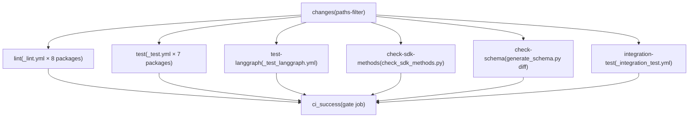
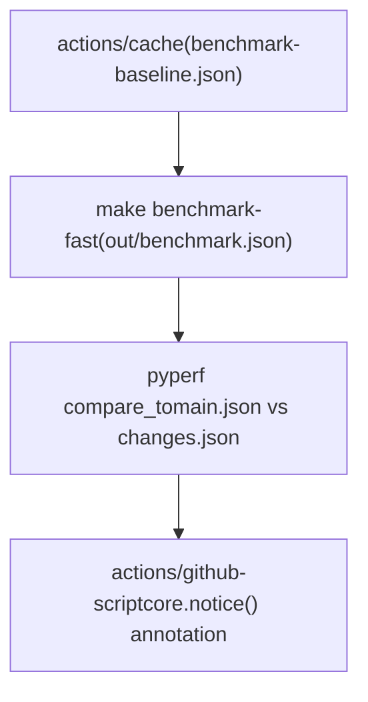
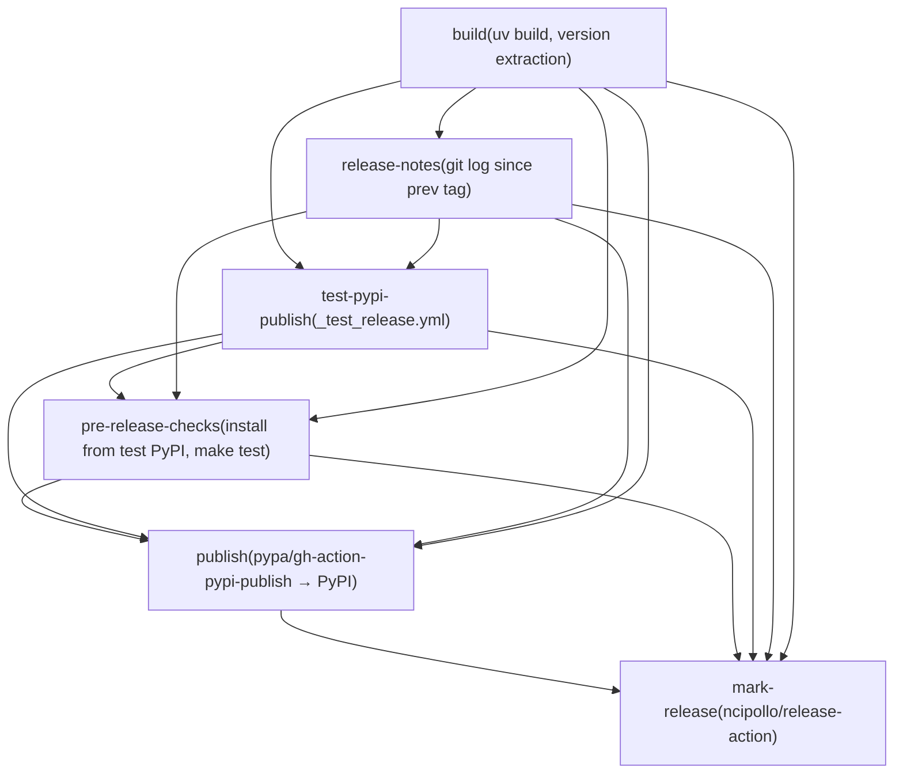
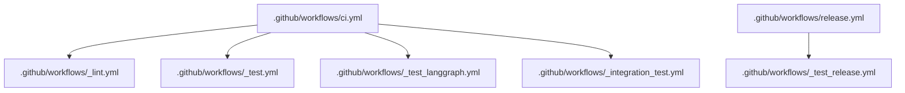

# CI/CD Workflows

Relevant source files

-   [.github/ISSUE\_TEMPLATE/bug-report.yml](https://github.com/langchain-ai/langgraph/blob/1fd51e8f/.github/ISSUE_TEMPLATE/bug-report.yml)
-   [.github/ISSUE\_TEMPLATE/config.yml](https://github.com/langchain-ai/langgraph/blob/1fd51e8f/.github/ISSUE_TEMPLATE/config.yml)
-   [.github/ISSUE\_TEMPLATE/privileged.yml](https://github.com/langchain-ai/langgraph/blob/1fd51e8f/.github/ISSUE_TEMPLATE/privileged.yml)
-   [.github/PULL\_REQUEST\_TEMPLATE.md](https://github.com/langchain-ai/langgraph/blob/1fd51e8f/.github/PULL_REQUEST_TEMPLATE.md?plain=1)
-   [.github/actions/uv\_setup/action.yml](https://github.com/langchain-ai/langgraph/blob/1fd51e8f/.github/actions/uv_setup/action.yml)
-   [.github/workflows/\_integration\_test.yml](https://github.com/langchain-ai/langgraph/blob/1fd51e8f/.github/workflows/_integration_test.yml)
-   [.github/workflows/\_lint.yml](https://github.com/langchain-ai/langgraph/blob/1fd51e8f/.github/workflows/_lint.yml)
-   [.github/workflows/\_test.yml](https://github.com/langchain-ai/langgraph/blob/1fd51e8f/.github/workflows/_test.yml)
-   [.github/workflows/\_test\_langgraph.yml](https://github.com/langchain-ai/langgraph/blob/1fd51e8f/.github/workflows/_test_langgraph.yml)
-   [.github/workflows/\_test\_release.yml](https://github.com/langchain-ai/langgraph/blob/1fd51e8f/.github/workflows/_test_release.yml)
-   [.github/workflows/baseline.yml](https://github.com/langchain-ai/langgraph/blob/1fd51e8f/.github/workflows/baseline.yml)
-   [.github/workflows/bench.yml](https://github.com/langchain-ai/langgraph/blob/1fd51e8f/.github/workflows/bench.yml)
-   [.github/workflows/ci.yml](https://github.com/langchain-ai/langgraph/blob/1fd51e8f/.github/workflows/ci.yml)
-   [.github/workflows/release.yml](https://github.com/langchain-ai/langgraph/blob/1fd51e8f/.github/workflows/release.yml)
-   [.github/workflows/uv\_lock\_ugprade.yml](https://github.com/langchain-ai/langgraph/blob/1fd51e8f/.github/workflows/uv_lock_ugprade.yml)
-   [AGENTS.md](https://github.com/langchain-ai/langgraph/blob/1fd51e8f/AGENTS.md?plain=1)
-   [CLAUDE.md](https://github.com/langchain-ai/langgraph/blob/1fd51e8f/CLAUDE.md?plain=1)

This page documents all GitHub Actions workflows in the LangGraph monorepo: the main CI pipeline, reusable job workflows, benchmarking pipelines, the weekly dependency lock upgrade, and the release workflow. For the release process itself (PyPI publishing, tagging, and release notes), see [9.4](https://github.com/langchain-ai/langgraph/blob/1fd51e8f/9.4) For test infrastructure details (fixtures, Docker services, conftest setup), see [9.2](https://github.com/langchain-ai/langgraph/blob/1fd51e8f/9.2) For the monorepo build system and `make` targets that these workflows invoke, see [9.1](https://github.com/langchain-ai/langgraph/blob/1fd51e8f/9.1)

---

## Workflow Inventory

All workflow files live under `.github/workflows/`. Filenames prefixed with `_` are reusable workflows, invoked via `workflow_call` from other workflows.

| File | Name | Trigger | Purpose |
| --- | --- | --- | --- |
| `ci.yml` | CI | `push` to `main`, `pull_request` | Orchestrates lint, test, schema and integration checks |
| `_lint.yml` | lint | `workflow_call` | Runs ruff and mypy per package |
| `_test.yml` | test | `workflow_call` | Runs `make test` per package across Python versions |
| `_test_langgraph.yml` | test | `workflow_call` | Runs `make test_parallel` for `libs/langgraph` specifically |
| `_integration_test.yml` | CLI integration test | `workflow_call` | Builds and smoke-tests Docker images via `langgraph build` |
| `bench.yml` | bench | `pull_request` on `libs/**` | Runs benchmarks and compares to baseline |
| `baseline.yml` | baseline | `push` to `main`, `workflow_dispatch` | Saves benchmark baseline to cache |
| `uv_lock_ugprade.yml` | UV Lock Upgrade | Weekly cron, `workflow_dispatch` | Runs `make lock-upgrade` and opens a PR |
| `release.yml` | release | `workflow_dispatch` | Full release pipeline (build → test PyPI → pre-check → publish → tag) |
| `_test_release.yml` | test-release | `workflow_call` | Builds and publishes to test PyPI |

Sources: [.github/workflows/ci.yml1-10](https://github.com/langchain-ai/langgraph/blob/1fd51e8f/.github/workflows/ci.yml#L1-L10) [.github/workflows/\_lint.yml1-10](https://github.com/langchain-ai/langgraph/blob/1fd51e8f/.github/workflows/_lint.yml#L1-L10) [.github/workflows/\_test.yml1-10](https://github.com/langchain-ai/langgraph/blob/1fd51e8f/.github/workflows/_test.yml#L1-L10) [.github/workflows/\_test\_langgraph.yml1-10](https://github.com/langchain-ai/langgraph/blob/1fd51e8f/.github/workflows/_test_langgraph.yml#L1-L10) [.github/workflows/\_integration\_test.yml1-10](https://github.com/langchain-ai/langgraph/blob/1fd51e8f/.github/workflows/_integration_test.yml#L1-L10) [.github/workflows/bench.yml1-10](https://github.com/langchain-ai/langgraph/blob/1fd51e8f/.github/workflows/bench.yml#L1-L10) [.github/workflows/baseline.yml1-10](https://github.com/langchain-ai/langgraph/blob/1fd51e8f/.github/workflows/baseline.yml#L1-L10) [.github/workflows/uv\_lock\_ugprade.yml1-10](https://github.com/langchain-ai/langgraph/blob/1fd51e8f/.github/workflows/uv_lock_ugprade.yml#L1-L10) [.github/workflows/release.yml1-10](https://github.com/langchain-ai/langgraph/blob/1fd51e8f/.github/workflows/release.yml#L1-L10)

---

## Main CI Pipeline (`ci.yml`)

The CI workflow is the primary gate on all pull requests and pushes to `main`.

### Concurrency

A concurrency group keyed on `${{ github.workflow }}-${{ github.ref }}` ensures that if a new push arrives while CI is still running for the same branch, the older run is cancelled [.github/workflows/ci.yml21-23](https://github.com/langchain-ai/langgraph/blob/1fd51e8f/.github/workflows/ci.yml#L21-L23)

### Path Filtering (`changes` job)

The first job uses the `dorny/paths-filter` action to determine which areas of the repository changed [.github/workflows/ci.yml26-50](https://github.com/langchain-ai/langgraph/blob/1fd51e8f/.github/workflows/ci.yml#L26-L50) Two output flags control downstream jobs:

| Flag | Paths Watched |
| --- | --- |
| `python` | `libs/langgraph/**`, `libs/sdk-py/**`, `libs/cli/**`, `libs/checkpoint/**`, `libs/checkpoint-sqlite/**`, `libs/checkpoint-postgres/**`, `libs/checkpoint-conformance/**`, `libs/prebuilt/**` |
| `deps` | `**/pyproject.toml`, `**/uv.lock` |

Downstream jobs only run if `python == 'true'` or `deps == 'true'`, which prevents unnecessary work on documentation-only changes [.github/workflows/ci.yml67](https://github.com/langchain-ai/langgraph/blob/1fd51e8f/.github/workflows/ci.yml#L67-L67)

### Job Graph

**CI pipeline job dependency diagram:**

Sources: [.github/workflows/ci.yml25-169](https://github.com/langchain-ai/langgraph/blob/1fd51e8f/.github/workflows/ci.yml#L25-L169)

### `ci_success` Gate Job

The final `ci_success` job [.github/workflows/ci.yml159-184](https://github.com/langchain-ai/langgraph/blob/1fd51e8f/.github/workflows/ci.yml#L159-L184) always runs (via `if: always()`) and exits non-zero if any upstream job resulted in `failure` or `cancelled`. This provides a single required status check that branch protection rules can target, regardless of which jobs were skipped due to path filtering.

---

## Reusable Workflows

### `_lint.yml` — Per-Package Linting

Triggered via `workflow_call` with a `working-directory` input. Runs on Python 3.12 only (chosen to represent both min and max supported, balancing coverage with CI speed) [.github/workflows/\_lint.yml19-32](https://github.com/langchain-ai/langgraph/blob/1fd51e8f/.github/workflows/_lint.yml#L19-L32)

Steps:

1.  **Changed-file detection** — uses `Ana06/get-changed-files` filtered to `${{ inputs.working-directory }}/**` [.github/workflows/\_lint.yml35-40](https://github.com/langchain-ai/langgraph/blob/1fd51e8f/.github/workflows/_lint.yml#L35-L40) Remaining steps are skipped if no files changed.
2.  **Install lint deps** — `uv sync --frozen --group lint` [.github/workflows/\_lint.yml52](https://github.com/langchain-ai/langgraph/blob/1fd51e8f/.github/workflows/_lint.yml#L52-L52)
3.  **mypy cache restore** — caches `.mypy_cache` keyed on `uv.lock` hash to speed up type checking [.github/workflows/\_lint.yml54-62](https://github.com/langchain-ai/langgraph/blob/1fd51e8f/.github/workflows/_lint.yml#L54-L62)
4.  **`lint_package`** — runs `make lint_package` (falls back to `make lint` if target absent) [.github/workflows/\_lint.yml64-73](https://github.com/langchain-ai/langgraph/blob/1fd51e8f/.github/workflows/_lint.yml#L64-L73)
5.  **Install test lint deps** — `uv sync --group lint` (adds test deps for type-checking test files) [.github/workflows/\_lint.yml78](https://github.com/langchain-ai/langgraph/blob/1fd51e8f/.github/workflows/_lint.yml#L78-L78)
6.  **mypy test cache restore** — separate `.mypy_cache_test` cache [.github/workflows/\_lint.yml80-88](https://github.com/langchain-ai/langgraph/blob/1fd51e8f/.github/workflows/_lint.yml#L80-L88)
7.  **`lint_tests`** — runs `make lint_tests` (skipped if target absent) [.github/workflows/\_lint.yml90-98](https://github.com/langchain-ai/langgraph/blob/1fd51e8f/.github/workflows/_lint.yml#L90-L98)

The `RUFF_OUTPUT_FORMAT: github` environment variable causes ruff to emit inline PR annotations [.github/workflows/\_lint.yml16](https://github.com/langchain-ai/langgraph/blob/1fd51e8f/.github/workflows/_lint.yml#L16-L16)

Sources: [.github/workflows/\_lint.yml1-99](https://github.com/langchain-ai/langgraph/blob/1fd51e8f/.github/workflows/_lint.yml#L1-L99)

### `_test.yml` — Per-Package Tests

Triggered via `workflow_call` with a `working-directory` input. Runs a matrix across **Python 3.10, 3.11, 3.12, 3.13, 3.14** [.github/workflows/\_test.yml17-24](https://github.com/langchain-ai/langgraph/blob/1fd51e8f/.github/workflows/_test.yml#L17-L24)

Steps:

1.  **Docker Hub login** — authenticates to avoid pull rate limits (skipped on fork PRs) [.github/workflows/\_test.yml35-40](https://github.com/langchain-ai/langgraph/blob/1fd51e8f/.github/workflows/_test.yml#L35-L40)
2.  **Install deps** — `uv sync --frozen --group test --no-dev` [.github/workflows/\_test.yml45](https://github.com/langchain-ai/langgraph/blob/1fd51e8f/.github/workflows/_test.yml#L45-L45)
3.  **Run tests** — `make test` [.github/workflows/\_test.yml50](https://github.com/langchain-ai/langgraph/blob/1fd51e8f/.github/workflows/_test.yml#L50-L50)
4.  **Clean working tree check** — fails if tests created untracked files [.github/workflows/\_test.yml52-63](https://github.com/langchain-ai/langgraph/blob/1fd51e8f/.github/workflows/_test.yml#L52-L63)

Sources: [.github/workflows/\_test.yml1-64](https://github.com/langchain-ai/langgraph/blob/1fd51e8f/.github/workflows/_test.yml#L1-L64)

### `_test_langgraph.yml` — LangGraph-Specific Tests

Nearly identical to `_test.yml` but hardcoded to `libs/langgraph` and invokes `make test_parallel` instead of `make test` [.github/workflows/\_test\_langgraph.yml46](https://github.com/langchain-ai/langgraph/blob/1fd51e8f/.github/workflows/_test_langgraph.yml#L46-L46) allowing parallelized pytest execution. It also includes a specific run for strict msgpack pregel tests on Python 3.13 [.github/workflows/\_test\_langgraph.yml48-53](https://github.com/langchain-ai/langgraph/blob/1fd51e8f/.github/workflows/_test_langgraph.yml#L48-L53)

Sources: [.github/workflows/\_test\_langgraph.yml1-66](https://github.com/langchain-ai/langgraph/blob/1fd51e8f/.github/workflows/_test_langgraph.yml#L1-L66)

---

## Schema and SDK Consistency Checks

### `check-sdk-methods`

Runs the script `.github/scripts/check_sdk_methods.py` [.github/workflows/ci.yml102-114](https://github.com/langchain-ai/langgraph/blob/1fd51e8f/.github/workflows/ci.yml#L102-L114) This verifies that methods defined in the SDK match those expected by the server API. It only runs if Python source files changed.

### `check-schema`

Generates the `langgraph.json` configuration schema via `uv run python generate_schema.py` inside `libs/cli`, then diffs the result against the committed `schemas/schema.json` [.github/workflows/ci.yml116-150](https://github.com/langchain-ai/langgraph/blob/1fd51e8f/.github/workflows/ci.yml#L116-L150) If the generated schema differs from the committed one, CI fails with instructions to regenerate and commit the file. Runs on Python 3.13.

Sources: [.github/workflows/ci.yml102-150](https://github.com/langchain-ai/langgraph/blob/1fd51e8f/.github/workflows/ci.yml#L102-L150)

---

## CLI Integration Tests (`_integration_test.yml`)

This reusable workflow builds real Docker images using `langgraph build` and, when a `LANGSMITH_API_KEY` is available, runs the built containers against the LangGraph server API.

### Matrix

The matrix is two-dimensional: Python versions (3.10, 3.14) × example directories [.github/workflows/\_integration\_test.yml13-33](https://github.com/langchain-ai/langgraph/blob/1fd51e8f/.github/workflows/_integration_test.yml#L13-L33):

| Example | Working Dir | Tag |
| --- | --- | --- |
| A | `libs/cli/examples` | `langgraph-test-a` |
| B | `libs/cli/examples/graphs` | `langgraph-test-b` |
| C | `libs/cli/examples/graphs_reqs_a` | `langgraph-test-c` |
| D | `libs/cli/examples/graphs_reqs_b` | `langgraph-test-d` |

### Additional Builds (Example A only)

When the matrix entry is Example A, the workflow also builds:

-   A JavaScript service from `libs/cli/js-examples` (tag `langgraph-test-e`) [.github/workflows/\_integration\_test.yml76-80](https://github.com/langchain-ai/langgraph/blob/1fd51e8f/.github/workflows/_integration_test.yml#L76-L80)
-   A JS monorepo service from `libs/cli/js-monorepo-example` with custom `--build-command` and `--install-command` (tag `langgraph-test-f`) [.github/workflows/\_integration\_test.yml82-86](https://github.com/langchain-ai/langgraph/blob/1fd51e8f/.github/workflows/_integration_test.yml#L82-L86)
-   A Python monorepo service from `libs/cli/python-monorepo-example` (tag `langgraph-test-g`) [.github/workflows/\_integration\_test.yml88-92](https://github.com/langchain-ai/langgraph/blob/1fd51e8f/.github/workflows/_integration_test.yml#L88-L92)
-   A pre-release requirements service from `libs/cli/examples/graph_prerelease_reqs` (tag `langgraph-test-h`) [.github/workflows/\_integration\_test.yml103-107](https://github.com/langchain-ai/langgraph/blob/1fd51e8f/.github/workflows/_integration_test.yml#L103-L107)
-   A pre-release failure scenario `libs/cli/examples/graph_prerelease_reqs_fail` expected to fail (tag `langgraph-test-i`) [.github/workflows/\_integration\_test.yml134-138](https://github.com/langchain-ai/langgraph/blob/1fd51e8f/.github/workflows/_integration_test.yml#L134-L138)

The test runner script is `.github/scripts/run_langgraph_cli_test.py`, wrapped in a 60-second timeout [.github/workflows/\_integration\_test.yml74](https://github.com/langchain-ai/langgraph/blob/1fd51e8f/.github/workflows/_integration_test.yml#L74-L74)

Sources: [.github/workflows/\_integration\_test.yml1-139](https://github.com/langchain-ai/langgraph/blob/1fd51e8f/.github/workflows/_integration_test.yml#L1-L139)

---

## Benchmarking Workflows

### `baseline.yml` — Save Baseline

**Trigger:** Push to `main` or `workflow_dispatch`, when `libs/**` changes [.github/workflows/baseline.yml1-8](https://github.com/langchain-ai/langgraph/blob/1fd51e8f/.github/workflows/baseline.yml#L1-L8)

Runs `make benchmark` in `libs/langgraph` and saves the output as `out/benchmark-baseline.json` to the Actions cache under a key of the form `${{ runner.os }}-benchmark-baseline-${{ env.SHA }}` [.github/workflows/baseline.yml31-37](https://github.com/langchain-ai/langgraph/blob/1fd51e8f/.github/workflows/baseline.yml#L31-L37) This gives each `main` commit its own cached baseline.

### `bench.yml` — PR Comparison

**Trigger:** Pull requests touching `libs/**` [.github/workflows/bench.yml4-6](https://github.com/langchain-ai/langgraph/blob/1fd51e8f/.github/workflows/bench.yml#L4-L6)

**Benchmark comparison diagram:**

Steps [.github/workflows/bench.yml17-71](https://github.com/langchain-ai/langgraph/blob/1fd51e8f/.github/workflows/bench.yml#L17-L71):

1.  Restore baseline from cache [.github/workflows/bench.yml32-40](https://github.com/langchain-ai/langgraph/blob/1fd51e8f/.github/workflows/bench.yml#L32-L40)
2.  Run `make benchmark-fast` → writes `out/benchmark.json` [.github/workflows/bench.yml41-48](https://github.com/langchain-ai/langgraph/blob/1fd51e8f/.github/workflows/bench.yml#L41-L48)
3.  Rename files and run `uv run pyperf compare_to out/main.json out/changes.json --table --group-by-speed` [.github/workflows/bench.yml49-58](https://github.com/langchain-ai/langgraph/blob/1fd51e8f/.github/workflows/bench.yml#L49-L58)
4.  Post both raw results and the comparison table as PR annotations via `core.notice()` [.github/workflows/bench.yml59-71](https://github.com/langchain-ai/langgraph/blob/1fd51e8f/.github/workflows/bench.yml#L59-L71)

Sources: [.github/workflows/bench.yml1-71](https://github.com/langchain-ai/langgraph/blob/1fd51e8f/.github/workflows/bench.yml#L1-L71) [.github/workflows/baseline.yml1-37](https://github.com/langchain-ai/langgraph/blob/1fd51e8f/.github/workflows/baseline.yml#L1-L37)

---

## Weekly Dependency Lock Upgrade (`uv_lock_ugprade.yml`)

**Trigger:** Cron at `0 0 * * 0` (midnight every Sunday UTC) or `workflow_dispatch` [.github/workflows/uv\_lock\_ugprade.yml4-8](https://github.com/langchain-ai/langgraph/blob/1fd51e8f/.github/workflows/uv_lock_ugprade.yml#L4-L8)

Runs `make lock-upgrade` at the repo root [.github/workflows/uv\_lock\_ugprade.yml28](https://github.com/langchain-ai/langgraph/blob/1fd51e8f/.github/workflows/uv_lock_ugprade.yml#L28-L28) which calls `uv lock --upgrade` across all Python packages. Then uses `peter-evans/create-pull-request` to open a PR on branch `deps/uv-lock-upgrade` with the label `dependencies` [.github/workflows/uv\_lock\_ugprade.yml30-46](https://github.com/langchain-ai/langgraph/blob/1fd51e8f/.github/workflows/uv_lock_ugprade.yml#L30-L46)

Sources: [.github/workflows/uv\_lock\_ugprade.yml1-46](https://github.com/langchain-ai/langgraph/blob/1fd51e8f/.github/workflows/uv_lock_ugprade.yml#L1-L46)

---

## Release Pipeline

The release workflow is documented in detail on page [9.4](https://github.com/langchain-ai/langgraph/blob/1fd51e8f/9.4) The section below covers only the structural relationship between workflow files and job sequencing.

### Job Sequence

**Release workflow job dependency diagram:**

### Permission Isolation

The `build` job runs with only `contents: read` [.github/workflows/release.yml11-12](https://github.com/langchain-ai/langgraph/blob/1fd51e8f/.github/workflows/release.yml#L11-L12) The `test-pypi-publish` job requires `id-token: write` (for PyPI trusted publishing) [.github/workflows/release.yml145-147](https://github.com/langchain-ai/langgraph/blob/1fd51e8f/.github/workflows/release.yml#L145-L147) These permissions are intentionally kept in separate jobs so that a compromised build step cannot access publishing credentials [.github/workflows/release.yml37-47](https://github.com/langchain-ai/langgraph/blob/1fd51e8f/.github/workflows/release.yml#L37-L47)

### `_test_release.yml` Reusable Workflow

Called by the `test-pypi-publish` job in `release.yml` [.github/workflows/release.yml148-151](https://github.com/langchain-ai/langgraph/blob/1fd51e8f/.github/workflows/release.yml#L148-L151) It builds the package with `uv build`, uploads to test PyPI using `pypa/gh-action-pypi-publish` with `repository-url: https://test.pypi.org/legacy/` [.github/workflows/\_test\_release.yml84-90](https://github.com/langchain-ai/langgraph/blob/1fd51e8f/.github/workflows/_test_release.yml#L84-L90)

Sources: [.github/workflows/release.yml1-157](https://github.com/langchain-ai/langgraph/blob/1fd51e8f/.github/workflows/release.yml#L1-L157) [.github/workflows/\_test\_release.yml1-98](https://github.com/langchain-ai/langgraph/blob/1fd51e8f/.github/workflows/_test_release.yml#L1-L98)

---

## Reusable Workflow Pattern

All reusable workflows use `on: workflow_call` and accept a `working-directory` input. The main `ci.yml` invokes them with a strategy matrix to fan out across all packages.

**Reusable workflow call structure:**

Secrets are forwarded with `secrets: inherit` in every caller [.github/workflows/ci.yml71](https://github.com/langchain-ai/langgraph/blob/1fd51e8f/.github/workflows/ci.yml#L71-L71) so repository secrets (e.g. `DOCKERHUB_USERNAME`, `LANGSMITH_API_KEY`) are available to reusable workflows.

Sources: [.github/workflows/ci.yml68-157](https://github.com/langchain-ai/langgraph/blob/1fd51e8f/.github/workflows/ci.yml#L68-L157) [.github/workflows/release.yml148-151](https://github.com/langchain-ai/langgraph/blob/1fd51e8f/.github/workflows/release.yml#L148-L151)

---

## Python Version Coverage Summary

| Workflow | Python Versions |
| --- | --- |
| `_lint.yml` | 3.12 only |
| `_test.yml` | 3.10, 3.11, 3.12, 3.13, 3.14 |
| `_test_langgraph.yml` | 3.10, 3.11, 3.12, 3.13, 3.14 |
| `_integration_test.yml` | 3.10, 3.14 |
| `bench.yml` | 3.11 |
| `baseline.yml` | 3.11 |
| `release.yml` | 3.11 |
| `_test_release.yml` | 3.10 |
| `uv_lock_ugprade.yml` | 3.10 |

Sources: [.github/workflows/\_lint.yml31](https://github.com/langchain-ai/langgraph/blob/1fd51e8f/.github/workflows/_lint.yml#L31-L31) [.github/workflows/\_test.yml20-24](https://github.com/langchain-ai/langgraph/blob/1fd51e8f/.github/workflows/_test.yml#L20-L24) [.github/workflows/\_test\_langgraph.yml15-19](https://github.com/langchain-ai/langgraph/blob/1fd51e8f/.github/workflows/_test_langgraph.yml#L15-L19) [.github/workflows/\_integration\_test.yml18-19](https://github.com/langchain-ai/langgraph/blob/1fd51e8f/.github/workflows/_integration_test.yml#L18-L19) [.github/workflows/bench.yml24](https://github.com/langchain-ai/langgraph/blob/1fd51e8f/.github/workflows/bench.yml#L24-L24) [.github/workflows/baseline.yml22](https://github.com/langchain-ai/langgraph/blob/1fd51e8f/.github/workflows/baseline.yml#L22-L22) [.github/workflows/release.yml15](https://github.com/langchain-ai/langgraph/blob/1fd51e8f/.github/workflows/release.yml#L15-L15) [.github/workflows/\_test\_release.yml12](https://github.com/langchain-ai/langgraph/blob/1fd51e8f/.github/workflows/_test_release.yml#L12-L12) [.github/workflows/uv\_lock\_ugprade.yml24](https://github.com/langchain-ai/langgraph/blob/1fd51e8f/.github/workflows/uv_lock_ugprade.yml#L24-L24)
