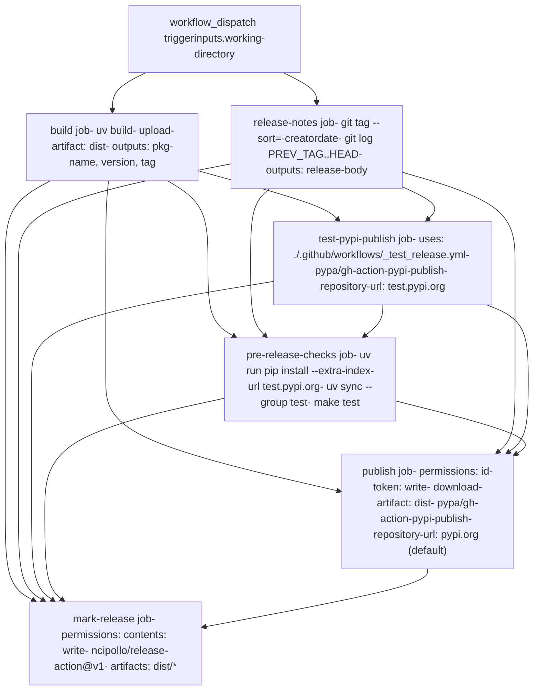
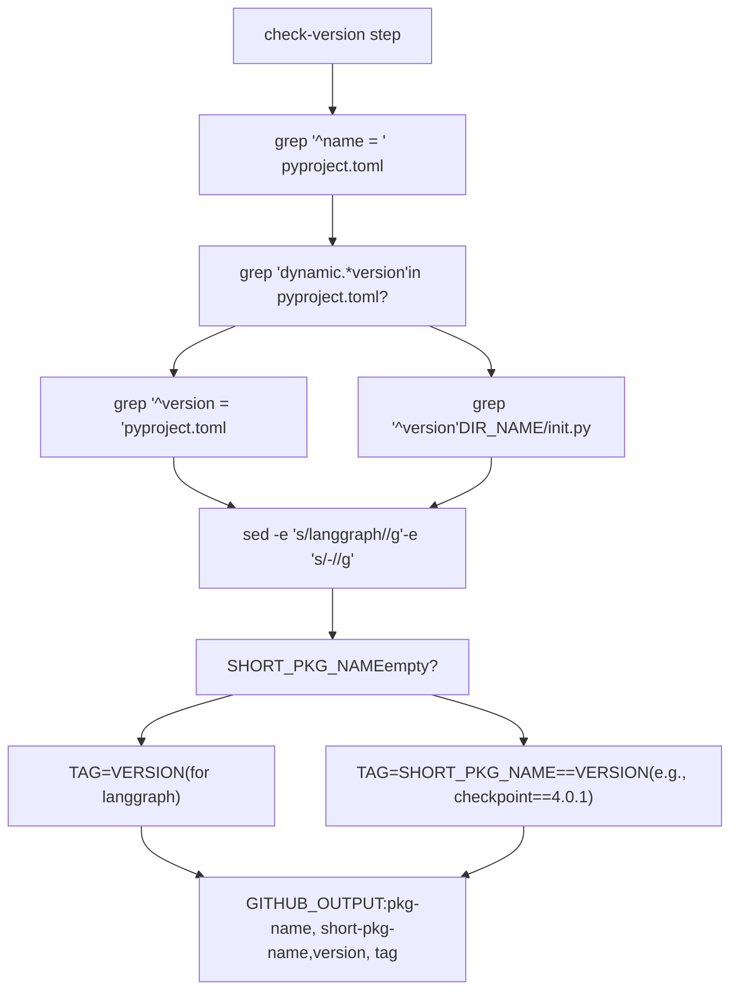
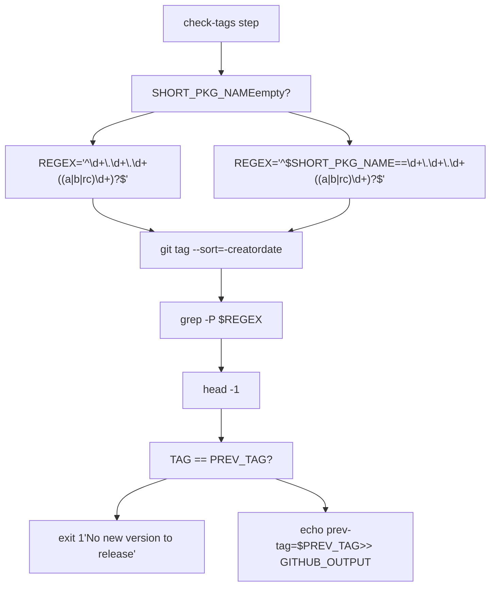
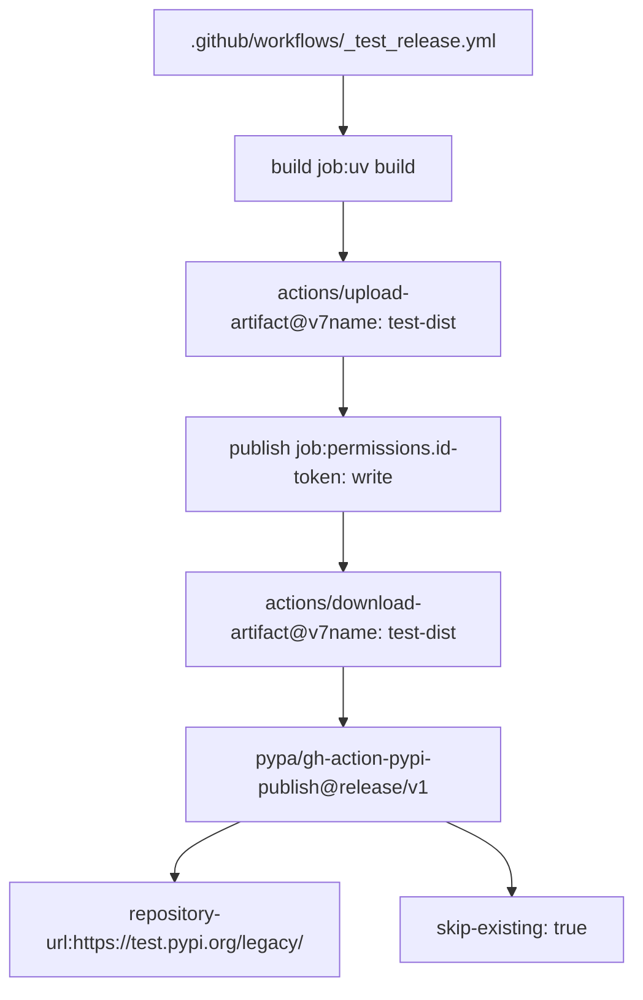
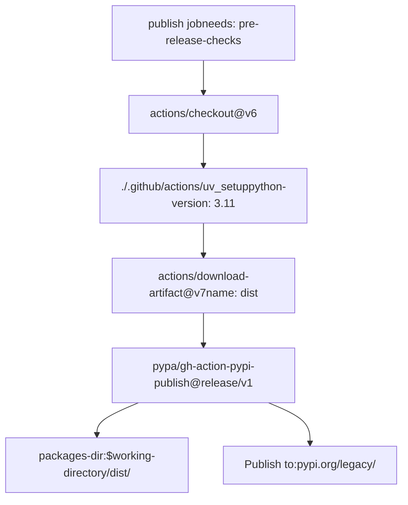
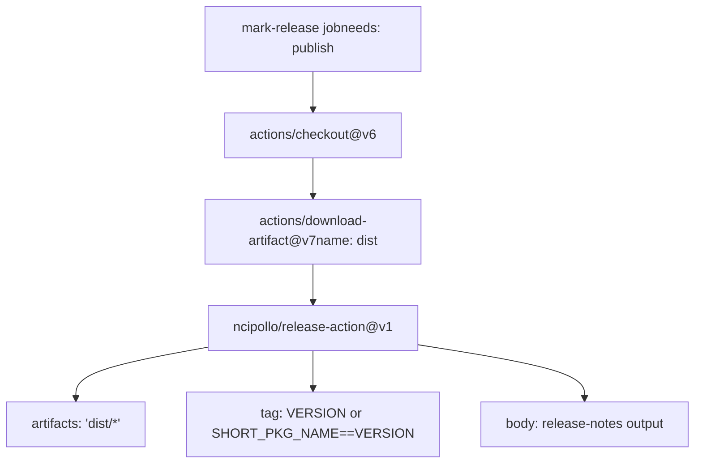

# Release Process

Relevant source files

-   [.github/workflows/\_integration\_test.yml](https://github.com/langchain-ai/langgraph/blob/1fd51e8f/.github/workflows/_integration_test.yml)
-   [.github/workflows/\_lint.yml](https://github.com/langchain-ai/langgraph/blob/1fd51e8f/.github/workflows/_lint.yml)
-   [.github/workflows/\_test.yml](https://github.com/langchain-ai/langgraph/blob/1fd51e8f/.github/workflows/_test.yml)
-   [.github/workflows/\_test\_langgraph.yml](https://github.com/langchain-ai/langgraph/blob/1fd51e8f/.github/workflows/_test_langgraph.yml)
-   [.github/workflows/\_test\_release.yml](https://github.com/langchain-ai/langgraph/blob/1fd51e8f/.github/workflows/_test_release.yml)
-   [.github/workflows/baseline.yml](https://github.com/langchain-ai/langgraph/blob/1fd51e8f/.github/workflows/baseline.yml)
-   [.github/workflows/bench.yml](https://github.com/langchain-ai/langgraph/blob/1fd51e8f/.github/workflows/bench.yml)
-   [.github/workflows/ci.yml](https://github.com/langchain-ai/langgraph/blob/1fd51e8f/.github/workflows/ci.yml)
-   [.github/workflows/release.yml](https://github.com/langchain-ai/langgraph/blob/1fd51e8f/.github/workflows/release.yml)
-   [.github/workflows/uv\_lock\_ugprade.yml](https://github.com/langchain-ai/langgraph/blob/1fd51e8f/.github/workflows/uv_lock_ugprade.yml)
-   [libs/checkpoint-postgres/uv.lock](https://github.com/langchain-ai/langgraph/blob/1fd51e8f/libs/checkpoint-postgres/uv.lock)
-   [libs/checkpoint-sqlite/uv.lock](https://github.com/langchain-ai/langgraph/blob/1fd51e8f/libs/checkpoint-sqlite/uv.lock)
-   [libs/checkpoint/langgraph/checkpoint/serde/jsonplus.py](https://github.com/langchain-ai/langgraph/blob/1fd51e8f/libs/checkpoint/langgraph/checkpoint/serde/jsonplus.py)
-   [libs/checkpoint/pyproject.toml](https://github.com/langchain-ai/langgraph/blob/1fd51e8f/libs/checkpoint/pyproject.toml)
-   [libs/checkpoint/tests/test\_jsonplus.py](https://github.com/langchain-ai/langgraph/blob/1fd51e8f/libs/checkpoint/tests/test_jsonplus.py)
-   [libs/checkpoint/uv.lock](https://github.com/langchain-ai/langgraph/blob/1fd51e8f/libs/checkpoint/uv.lock)
-   [libs/langgraph/pyproject.toml](https://github.com/langchain-ai/langgraph/blob/1fd51e8f/libs/langgraph/pyproject.toml)
-   [libs/langgraph/tests/\_\_snapshots\_\_/test\_pregel.ambr](https://github.com/langchain-ai/langgraph/blob/1fd51e8f/libs/langgraph/tests/__snapshots__/test_pregel.ambr)
-   [libs/langgraph/tests/\_\_snapshots\_\_/test\_pregel\_async.ambr](https://github.com/langchain-ai/langgraph/blob/1fd51e8f/libs/langgraph/tests/__snapshots__/test_pregel_async.ambr)
-   [libs/langgraph/uv.lock](https://github.com/langchain-ai/langgraph/blob/1fd51e8f/libs/langgraph/uv.lock)
-   [libs/prebuilt/pyproject.toml](https://github.com/langchain-ai/langgraph/blob/1fd51e8f/libs/prebuilt/pyproject.toml)
-   [libs/prebuilt/uv.lock](https://github.com/langchain-ai/langgraph/blob/1fd51e8f/libs/prebuilt/uv.lock)
-   [libs/sdk-py/uv.lock](https://github.com/langchain-ai/langgraph/blob/1fd51e8f/libs/sdk-py/uv.lock)

The LangGraph release process is implemented as a manually-triggered GitHub Actions workflow ([.github/workflows/release.yml1-328](https://github.com/langchain-ai/langgraph/blob/1fd51e8f/.github/workflows/release.yml#L1-L328)) that publishes packages to PyPI. The workflow enforces permission isolation between build and publish stages, validates packages on TestPyPI before production release, and creates GitHub releases with git-based changelogs.

## Workflow Jobs

The `release.yml` workflow executes six jobs with strict dependency ordering:

| Job Name | Depends On | Purpose |
| --- | --- | --- |
| `build` | \- | Execute `uv build` and extract `pkg-name`, `version`, `tag` outputs |
| `release-notes` | `build` | Compare git tags and generate changelog via `git log` |
| `test-pypi-publish` | `build`, `release-notes` | Invoke `.github/workflows/_test_release.yml` to publish to test.pypi.org |
| `pre-release-checks` | `build`, `release-notes`, `test-pypi-publish` | Install from TestPyPI with `--extra-index-url` and run `make test` |
| `publish` | `build`, `release-notes`, `test-pypi-publish`, `pre-release-checks` | Publish to pypi.org via `pypa/gh-action-pypi-publish@release/v1` |
| `mark-release` | `build`, `release-notes`, `test-pypi-publish`, `pre-release-checks`, `publish` | Create GitHub release via `ncipollo/release-action@v1` |

Sources: [.github/workflows/release.yml17-328](https://github.com/langchain-ai/langgraph/blob/1fd51e8f/.github/workflows/release.yml#L17-L328)

## Job Dependency Graph

**Purpose**: Maps GitHub Actions workflow job dependencies with key actions and permissions used in each job.

Sources: [.github/workflows/release.yml17-328](https://github.com/langchain-ai/langgraph/blob/1fd51e8f/.github/workflows/release.yml#L17-L328)

## Trigger and Inputs

The release workflow is triggered manually via `workflow_dispatch` with a single required input:

| Input | Type | Default | Description |
| --- | --- | --- | --- |
| `working-directory` | string | `libs/langgraph` | Package directory to release |

**Supported packages**:

| Package | Directory | Version File |
| --- | --- | --- |
| `langgraph` | `libs/langgraph` | [libs/langgraph/pyproject.toml7](https://github.com/langchain-ai/langgraph/blob/1fd51e8f/libs/langgraph/pyproject.toml#L7-L7) |
| `langgraph-checkpoint` | `libs/checkpoint` | [libs/checkpoint/pyproject.toml7](https://github.com/langchain-ai/langgraph/blob/1fd51e8f/libs/checkpoint/pyproject.toml#L7-L7) |
| `langgraph-prebuilt` | `libs/prebuilt` | [libs/prebuilt/pyproject.toml7](https://github.com/langchain-ai/langgraph/blob/1fd51e8f/libs/prebuilt/pyproject.toml#L7-L7) |

Sources: [.github/workflows/release.yml3-9](https://github.com/langchain-ai/langgraph/blob/1fd51e8f/.github/workflows/release.yml#L3-L9) [libs/langgraph/pyproject.toml5-7](https://github.com/langchain-ai/langgraph/blob/1fd51e8f/libs/langgraph/pyproject.toml#L5-L7) [libs/checkpoint/pyproject.toml5-7](https://github.com/langchain-ai/langgraph/blob/1fd51e8f/libs/checkpoint/pyproject.toml#L5-L7) [libs/prebuilt/pyproject.toml5-7](https://github.com/langchain-ai/langgraph/blob/1fd51e8f/libs/prebuilt/pyproject.toml#L5-L7)

## Build Stage

The `build` job extracts version information and creates distribution artifacts using `uv build` ([.github/workflows/release.yml49](https://github.com/langchain-ai/langgraph/blob/1fd51e8f/.github/workflows/release.yml#L49-L49)).

### Version Detection

**Purpose**: Shows bash script logic for extracting version information from `pyproject.toml` or `__init__.py`.

The version detection script performs the following ([.github/workflows/release.yml58-80](https://github.com/langchain-ai/langgraph/blob/1fd51e8f/.github/workflows/release.yml#L58-L80)):

1.  **Extract package name**: `PKG_NAME=$(grep -m 1 "^name = " pyproject.toml | cut -d '"' -f 2)`
2.  **Check for dynamic versioning**: `grep -q 'dynamic.*=.*\[.*"version".*\]' pyproject.toml`
3.  **Extract version**:
    -   **Static (e.g., langgraph)**: `VERSION=$(grep -m 1 "^version = " pyproject.toml | cut -d '"' -f 2)`
    -   **Dynamic**: `DIR_NAME=$(echo "$PKG_NAME" | tr '-' '_')` then `VERSION=$(grep -m 1 '^__version__' "${DIR_NAME}/__init__.py" | cut -d '"' -f 2)`
4.  **Generate short name**: `SHORT_PKG_NAME="$(echo "$PKG_NAME" | sed -e 's/langgraph//g' -e 's/-//g')"` → `checkpoint` for `langgraph-checkpoint`
5.  **Create tag**:
    -   **langgraph package**: `TAG="$VERSION"`
    -   **Other packages**: `TAG="${SHORT_PKG_NAME}==${VERSION}"` → `checkpoint==4.0.1`

### Build Artifacts

The build step uses `uv build` at [.github/workflows/release.yml49-50](https://github.com/langchain-ai/langgraph/blob/1fd51e8f/.github/workflows/release.yml#L49-L50) to create source and wheel distributions. Artifacts are uploaded via `actions/upload-artifact@v7` at [.github/workflows/release.yml52-56](https://github.com/langchain-ai/langgraph/blob/1fd51e8f/.github/workflows/release.yml#L52-L56) with artifact name `dist`.

Build output uses `hatchling` as the build backend, as specified in package configurations:

-   `langgraph`: [libs/langgraph/pyproject.toml1-3](https://github.com/langchain-ai/langgraph/blob/1fd51e8f/libs/langgraph/pyproject.toml#L1-L3)
-   `langgraph-checkpoint`: [libs/checkpoint/pyproject.toml1-3](https://github.com/langchain-ai/langgraph/blob/1fd51e8f/libs/checkpoint/pyproject.toml#L1-L3)
-   `langgraph-prebuilt`: [libs/prebuilt/pyproject.toml1-3](https://github.com/langchain-ai/langgraph/blob/1fd51e8f/libs/prebuilt/pyproject.toml#L1-L3)

## Release Notes Generation

The `release-notes` job creates a changelog by comparing the current version tag against the most recent previous tag using `git log` ([.github/workflows/release.yml136](https://github.com/langchain-ai/langgraph/blob/1fd51e8f/.github/workflows/release.yml#L136-L136)).

### Tag Comparison Logic

**Purpose**: Shows bash script logic for finding the previous version tag and validating the new release.

The tag comparison at [.github/workflows/release.yml97-119](https://github.com/langchain-ai/langgraph/blob/1fd51e8f/.github/workflows/release.yml#L97-L119) filters existing tags using regex patterns based on whether the package is the core `langgraph` package or a sub-package like `langgraph-checkpoint`.

### Changelog Generation

The `generate-release-body` step ([.github/workflows/release.yml120-139](https://github.com/langchain-ai/langgraph/blob/1fd51e8f/.github/workflows/release.yml#L120-L139)) creates release notes by extracting commit subjects since the last tag. If no previous tag is found, it defaults to "Initial release" ([.github/workflows/release.yml131-137](https://github.com/langchain-ai/langgraph/blob/1fd51e8f/.github/workflows/release.yml#L131-L137)).

## TestPyPI Publishing

The `test-pypi-publish` job ([.github/workflows/release.yml141-151](https://github.com/langchain-ai/langgraph/blob/1fd51e8f/.github/workflows/release.yml#L141-L151)) uses the reusable workflow `_test_release.yml` to publish the package to TestPyPI.

### TestPyPI Workflow

**Purpose**: Shows the TestPyPI release workflow structure and artifact flow.

The workflow uses Trusted Publishing with OIDC, requiring `id-token: write` permissions ([.github/workflows/release.yml147](https://github.com/langchain-ai/langgraph/blob/1fd51e8f/.github/workflows/release.yml#L147-L147)).

## Pre-Release Checks

The `pre-release-checks` job ([.github/workflows/release.yml153-242](https://github.com/langchain-ai/langgraph/blob/1fd51e8f/.github/workflows/release.yml#L153-L242)) verifies the published TestPyPI package by installing it in a fresh environment and running the test suite.

### Package Installation from TestPyPI

The installation logic at [.github/workflows/release.yml182-221](https://github.com/langchain-ai/langgraph/blob/1fd51e8f/.github/workflows/release.yml#L182-L221) performs a `pip install` using `test.pypi.org` as an extra index URL. It includes a retry mechanism with a 5-second sleep to account for TestPyPI indexing delays ([.github/workflows/release.yml188-200](https://github.com/langchain-ai/langgraph/blob/1fd51e8f/.github/workflows/release.yml#L188-L200)).

**Cache Exclusion**: Caching is explicitly disabled for this job ([.github/workflows/release.yml179](https://github.com/langchain-ai/langgraph/blob/1fd51e8f/.github/workflows/release.yml#L179-L179)) to ensure tests are sensitive to missing dependencies that might otherwise be satisfied by a cached environment ([.github/workflows/release.yml162-173](https://github.com/langchain-ai/langgraph/blob/1fd51e8f/.github/workflows/release.yml#L162-L173)).

## PyPI Publishing

The `publish` job ([.github/workflows/release.yml243-285](https://github.com/langchain-ai/langgraph/blob/1fd51e8f/.github/workflows/release.yml#L243-L285)) performs the final production release to PyPI.

### Production Publishing Workflow

**Purpose**: Shows the production publish job steps and `pypa/gh-action-pypi-publish` configuration.

The job uses Trusted Publishing via `id-token: write` permissions ([.github/workflows/release.yml256](https://github.com/langchain-ai/langgraph/blob/1fd51e8f/.github/workflows/release.yml#L256-L256)) and points to the `dist/` directory containing artifacts from the `build` job ([.github/workflows/release.yml280](https://github.com/langchain-ai/langgraph/blob/1fd51e8f/.github/workflows/release.yml#L280-L280)).

## GitHub Release Creation

The `mark-release` job ([.github/workflows/release.yml286-328](https://github.com/langchain-ai/langgraph/blob/1fd51e8f/.github/workflows/release.yml#L286-L328)) creates the final GitHub release.

### Release Creation Workflow

**Purpose**: Shows the `ncipollo/release-action` configuration for creating the GitHub Release.

The release is created using the `GITHUB_TOKEN` with `contents: write` permissions ([.github/workflows/release.yml297](https://github.com/langchain-ai/langgraph/blob/1fd51e8f/.github/workflows/release.yml#L297-L297)). It uploads all artifacts from the `dist/` directory ([.github/workflows/release.yml321](https://github.com/langchain-ai/langgraph/blob/1fd51e8f/.github/workflows/release.yml#L321-L321)) and uses the body generated by the `release-notes` job ([.github/workflows/release.yml326](https://github.com/langchain-ai/langgraph/blob/1fd51e8f/.github/workflows/release.yml#L326-L326)).

Sources: [.github/workflows/release.yml1-328](https://github.com/langchain-ai/langgraph/blob/1fd51e8f/.github/workflows/release.yml#L1-L328) [libs/langgraph/pyproject.toml1-33](https://github.com/langchain-ai/langgraph/blob/1fd51e8f/libs/langgraph/pyproject.toml#L1-L33) [libs/checkpoint/pyproject.toml1-17](https://github.com/langchain-ai/langgraph/blob/1fd51e8f/libs/checkpoint/pyproject.toml#L1-L17) [libs/prebuilt/pyproject.toml1-29](https://github.com/langchain-ai/langgraph/blob/1fd51e8f/libs/prebuilt/pyproject.toml#L1-L29)
