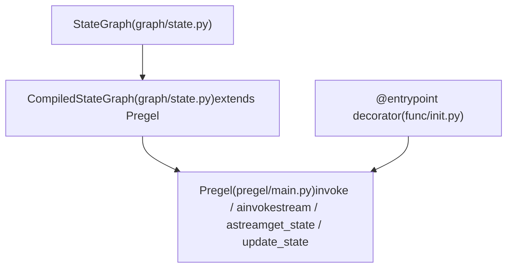
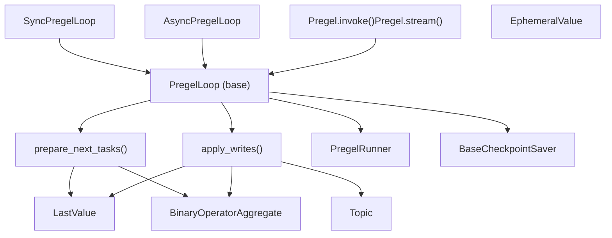
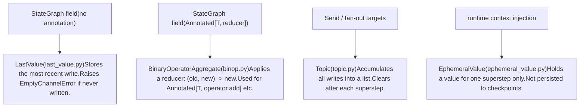

# Core Execution System

Relevant source files

-   [libs/langgraph/langgraph/channels/\_\_init\_\_.py](https://github.com/langchain-ai/langgraph/blob/1fd51e8f/libs/langgraph/langgraph/channels/__init__.py)
-   [libs/langgraph/langgraph/channels/any\_value.py](https://github.com/langchain-ai/langgraph/blob/1fd51e8f/libs/langgraph/langgraph/channels/any_value.py)
-   [libs/langgraph/langgraph/channels/base.py](https://github.com/langchain-ai/langgraph/blob/1fd51e8f/libs/langgraph/langgraph/channels/base.py)
-   [libs/langgraph/langgraph/channels/binop.py](https://github.com/langchain-ai/langgraph/blob/1fd51e8f/libs/langgraph/langgraph/channels/binop.py)
-   [libs/langgraph/langgraph/channels/ephemeral\_value.py](https://github.com/langchain-ai/langgraph/blob/1fd51e8f/libs/langgraph/langgraph/channels/ephemeral_value.py)
-   [libs/langgraph/langgraph/channels/last\_value.py](https://github.com/langchain-ai/langgraph/blob/1fd51e8f/libs/langgraph/langgraph/channels/last_value.py)
-   [libs/langgraph/langgraph/channels/named\_barrier\_value.py](https://github.com/langchain-ai/langgraph/blob/1fd51e8f/libs/langgraph/langgraph/channels/named_barrier_value.py)
-   [libs/langgraph/langgraph/channels/topic.py](https://github.com/langchain-ai/langgraph/blob/1fd51e8f/libs/langgraph/langgraph/channels/topic.py)
-   [libs/langgraph/langgraph/channels/untracked\_value.py](https://github.com/langchain-ai/langgraph/blob/1fd51e8f/libs/langgraph/langgraph/channels/untracked_value.py)
-   [libs/langgraph/langgraph/constants.py](https://github.com/langchain-ai/langgraph/blob/1fd51e8f/libs/langgraph/langgraph/constants.py)
-   [libs/langgraph/langgraph/errors.py](https://github.com/langchain-ai/langgraph/blob/1fd51e8f/libs/langgraph/langgraph/errors.py)
-   [libs/langgraph/langgraph/func/\_\_init\_\_.py](https://github.com/langchain-ai/langgraph/blob/1fd51e8f/libs/langgraph/langgraph/func/__init__.py)
-   [libs/langgraph/langgraph/graph/state.py](https://github.com/langchain-ai/langgraph/blob/1fd51e8f/libs/langgraph/langgraph/graph/state.py)
-   [libs/langgraph/langgraph/pregel/\_\_init\_\_.py](https://github.com/langchain-ai/langgraph/blob/1fd51e8f/libs/langgraph/langgraph/pregel/__init__.py)
-   [libs/langgraph/langgraph/pregel/debug.py](https://github.com/langchain-ai/langgraph/blob/1fd51e8f/libs/langgraph/langgraph/pregel/debug.py)
-   [libs/langgraph/langgraph/pregel/types.py](https://github.com/langchain-ai/langgraph/blob/1fd51e8f/libs/langgraph/langgraph/pregel/types.py)
-   [libs/langgraph/langgraph/types.py](https://github.com/langchain-ai/langgraph/blob/1fd51e8f/libs/langgraph/langgraph/types.py)
-   [libs/langgraph/langgraph/utils/\_\_init\_\_.py](https://github.com/langchain-ai/langgraph/blob/1fd51e8f/libs/langgraph/langgraph/utils/__init__.py)
-   [libs/langgraph/langgraph/utils/config.py](https://github.com/langchain-ai/langgraph/blob/1fd51e8f/libs/langgraph/langgraph/utils/config.py)
-   [libs/langgraph/langgraph/utils/runnable.py](https://github.com/langchain-ai/langgraph/blob/1fd51e8f/libs/langgraph/langgraph/utils/runnable.py)
-   [libs/langgraph/tests/\_\_snapshots\_\_/test\_large\_cases.ambr](https://github.com/langchain-ai/langgraph/blob/1fd51e8f/libs/langgraph/tests/__snapshots__/test_large_cases.ambr)
-   [libs/langgraph/tests/test\_checkpoint\_migration.py](https://github.com/langchain-ai/langgraph/blob/1fd51e8f/libs/langgraph/tests/test_checkpoint_migration.py)
-   [libs/langgraph/tests/test\_large\_cases.py](https://github.com/langchain-ai/langgraph/blob/1fd51e8f/libs/langgraph/tests/test_large_cases.py)
-   [libs/langgraph/tests/test\_large\_cases\_async.py](https://github.com/langchain-ai/langgraph/blob/1fd51e8f/libs/langgraph/tests/test_large_cases_async.py)
-   [libs/langgraph/tests/test\_pregel.py](https://github.com/langchain-ai/langgraph/blob/1fd51e8f/libs/langgraph/tests/test_pregel.py)
-   [libs/langgraph/tests/test\_pregel\_async.py](https://github.com/langchain-ai/langgraph/blob/1fd51e8f/libs/langgraph/tests/test_pregel_async.py)

This page describes the architecture of the LangGraph core execution engine: the Pregel computational model, the two user-facing graph definition APIs, and how each internal component participates in running a graph. It covers the **what** and **why** at the system level.

For full API details on each subsystem, see the child pages:

-   State schemas, `add_node`, `compile()` → [StateGraph API](/langchain-ai/langgraph/3.1-stategraph-api)
-   `@task` and `@entrypoint` → [Functional API (@task and @entrypoint)](/langchain-ai/langgraph/3.2-functional-api-(@task-and-@entrypoint))
-   Superstep cycle internals → [Pregel Execution Engine](/langchain-ai/langgraph/3.3-pregel-execution-engine)
-   Channel types and reducers → [State Management and Channels](/langchain-ai/langgraph/3.4-state-management-and-channels)
-   `Send`, `Command`, conditional edges → [Control Flow Primitives](/langchain-ai/langgraph/3.5-control-flow-primitives)
-   Graph composition and nested structures → [Graph Composition and Nested Graphs](/langchain-ai/langgraph/3.6-graph-composition-and-nested-graphs)
-   Interrupts and human-in-the-loop → [Human-in-the-Loop and Interrupts](/langchain-ai/langgraph/3.7-human-in-the-loop-and-interrupts)
-   `RetryPolicy`, `CachePolicy` → [Error Handling and Retry Policies](/langchain-ai/langgraph/3.8-error-handling-and-retry-policies), [Caching System](/langchain-ai/langgraph/3.10-caching-system)
-   Runtime and Dependency Injection → [Runtime and Dependency Injection](/langchain-ai/langgraph/3.9-runtime-and-dependency-injection)

---

## Computational Model

LangGraph's execution engine is an implementation of the **Pregel / Bulk Synchronous Parallel (BSP)** model. In this model, a graph is composed of **actors** (nodes) that communicate exclusively through **channels** (shared state slots). Execution is divided into discrete **supersteps**. Within each superstep, no actor can observe another actor's writes — all writes from one superstep become visible at the start of the next.

Each superstep runs three sequential phases:

| Phase | Description | Key code |
| --- | --- | --- |
| **Plan** | Determine which actors are eligible to run based on which channels were updated in the previous superstep. | `prepare_next_tasks()` in `pregel/_algo.py` |
| **Execute** | Run all selected actors concurrently. Each actor reads from its subscribed channels and writes its outputs. | `PregelRunner` in `pregel/_runner.py` |
| **Update** | Commit the actors' writes to channels, applying any reducers. | `apply_writes()` in `pregel/_algo.py` |

The loop continues until no actors are eligible (graph is done), a recursion limit is reached, or an interrupt occurs.

Sources: [libs/langgraph/langgraph/pregel/main.py324-360](https://github.com/langchain-ai/langgraph/blob/1fd51e8f/libs/langgraph/langgraph/pregel/main.py#L324-L360) [libs/langgraph/langgraph/pregel/\_loop.py140-200](https://github.com/langchain-ai/langgraph/blob/1fd51e8f/libs/langgraph/langgraph/pregel/_loop.py#L140-L200)

---

## Two Entry Points, One Runtime

Users can define graphs in two ways. Both ultimately produce a `Pregel` instance, which is the actual runtime object that supports `invoke`, `stream`, `ainvoke`, and `astream`.

**Diagram: Graph Definition APIs and Their Compiled Output**


Sources: [libs/langgraph/langgraph/graph/state.py115-184](https://github.com/langchain-ai/langgraph/blob/1fd51e8f/libs/langgraph/langgraph/graph/state.py#L115-L184) [libs/langgraph/langgraph/func/\_\_init\_\_.py238-300](https://github.com/langchain-ai/langgraph/blob/1fd51e8f/libs/langgraph/langgraph/func/__init__.py#L238-L300) [libs/langgraph/langgraph/pregel/main.py324-330](https://github.com/langchain-ai/langgraph/blob/1fd51e8f/libs/langgraph/langgraph/pregel/main.py#L324-L330)

### StateGraph Path

`StateGraph` is a **builder** — it holds node and edge declarations but cannot execute anything directly. Calling `.compile()` validates the graph structure and returns a `CompiledStateGraph`, which subclasses `Pregel`. During compilation, `StateGraph` converts its nodes and channels into the internal `PregelNode` and `BaseChannel` objects that `Pregel` uses at runtime.

```
# Example: StateGraph -> CompiledStateGraph (Pregel)builder = StateGraph(State)builder.add_node("my_node", my_func)builder.add_edge(START, "my_node")graph = builder.compile()        # returns CompiledStateGraphgraph.invoke({"key": "value"})   # runs via Pregel
```
Sources: [libs/langgraph/langgraph/graph/state.py197-250](https://github.com/langchain-ai/langgraph/blob/1fd51e8f/libs/langgraph/langgraph/graph/state.py#L197-L250) [libs/langgraph/tests/test\_pregel.py87-117](https://github.com/langchain-ai/langgraph/blob/1fd51e8f/libs/langgraph/tests/test_pregel.py#L87-L117)

### Functional API Path

The `@entrypoint` decorator wraps a Python function and directly constructs a `Pregel` instance. No explicit `StateGraph` construction is needed. Tasks declared with `@task` become `PregelNode` actors inside the Pregel graph created by `@entrypoint`.

```
# Example: @entrypoint -> Pregel@taskdef fetch_data(url: str) -> str: ... @entrypoint(checkpointer=InMemorySaver())def my_workflow(input: str) -> str:    result = fetch_data(input).result()    return result my_workflow.invoke("http://...")   # my_workflow IS a Pregel instance
```
The `entrypoint` decorator internally uses `get_runnable_for_entrypoint` to map the function to the underlying Pregel structure.

Sources: [libs/langgraph/langgraph/func/\_\_init\_\_.py127-190](https://github.com/langchain-ai/langgraph/blob/1fd51e8f/libs/langgraph/langgraph/func/__init__.py#L127-L190) [libs/langgraph/langgraph/func/\_\_init\_\_.py35-39](https://github.com/langchain-ai/langgraph/blob/1fd51e8f/libs/langgraph/langgraph/func/__init__.py#L35-L39)

---

## The Pregel Runtime

`Pregel` in [libs/langgraph/langgraph/pregel/main.py324](https://github.com/langchain-ai/langgraph/blob/1fd51e8f/libs/langgraph/langgraph/pregel/main.py#L324-L324) is the central runtime class. It holds:

| Attribute | Type | Purpose |
| --- | --- | --- |
| `nodes` | `Mapping[str, PregelNode]` | All actor definitions |
| `channels` | `Mapping[str, BaseChannel]` | All communication channels |
| `input_channels` | `str | Sequence[str]` | Which channels accept external input |
| `output_channels` | `str | Sequence[str]` | Which channels produce final output |
| `checkpointer` | `BaseCheckpointSaver | None` | Persistence layer |
| `interrupt_before` | `Sequence[str] | All` | Node names to interrupt before |
| `interrupt_after` | `Sequence[str] | All` | Node names to interrupt after |
| `retry_policy` | `RetryPolicy | None` | Default retry behavior |
| `cache_policy` | `CachePolicy | None` | Default caching behavior |

`Pregel` exposes the public execution interface: `invoke`, `ainvoke`, `stream`, `astream`, `batch`, `get_state`, `update_state`, `get_state_history`.

### NodeBuilder

`NodeBuilder` in [libs/langgraph/langgraph/pregel/main.py160-322](https://github.com/langchain-ai/langgraph/blob/1fd51e8f/libs/langgraph/langgraph/pregel/main.py#L160-L322) is a fluent builder for creating low-level `PregelNode` actors directly — used primarily in tests and advanced scenarios where a `StateGraph` is unnecessary.

```
node = (    NodeBuilder()    .subscribe_only("input")   # read from channel "input"    .do(my_func)               # run my_func    .write_to("output")        # write result to channel "output"    .build()                   # returns PregelNode)
```
`StateGraph` creates `PregelNode` instances internally during `compile()`, so most users never use `NodeBuilder` directly.

Sources: [libs/langgraph/langgraph/pregel/main.py160-322](https://github.com/langchain-ai/langgraph/blob/1fd51e8f/libs/langgraph/langgraph/pregel/main.py#L160-L322) [libs/langgraph/tests/test\_large\_cases.py55-70](https://github.com/langchain-ai/langgraph/blob/1fd51e8f/libs/langgraph/tests/test_large_cases.py#L55-L70)

---

## Internal Execution Components

**Diagram: Runtime Component Relationships**


Sources: [libs/langgraph/langgraph/pregel/\_loop.py57-58](https://github.com/langchain-ai/langgraph/blob/1fd51e8f/libs/langgraph/langgraph/pregel/_loop.py#L57-L58) [libs/langgraph/langgraph/pregel/\_runner.py57-58](https://github.com/langchain-ai/langgraph/blob/1fd51e8f/libs/langgraph/langgraph/pregel/_runner.py#L57-L58) [libs/langgraph/langgraph/pregel/main.py324-400](https://github.com/langchain-ai/langgraph/blob/1fd51e8f/libs/langgraph/langgraph/pregel/main.py#L324-L400)

### PregelLoop

`PregelLoop` is the superstep controller. There are two concrete subclasses:

-   `SyncPregelLoop` — used by `invoke` and `stream` [libs/langgraph/langgraph/pregel/\_loop.py57](https://github.com/langchain-ai/langgraph/blob/1fd51e8f/libs/langgraph/langgraph/pregel/_loop.py#L57-L57)
-   `AsyncPregelLoop` — used by `ainvoke` and `astream` [libs/langgraph/langgraph/pregel/\_loop.py56](https://github.com/langchain-ai/langgraph/blob/1fd51e8f/libs/langgraph/langgraph/pregel/_loop.py#L56-L56)

The loop tracks:

-   `step` — current superstep index
-   `stop` — maximum allowed step (recursion limit)
-   `tasks` — the set of `PregelExecutableTask` objects ready for the current superstep
-   checkpoint management (reading initial state, writing after each step)
-   interrupt handling (`interrupt_before`, `interrupt_after`)
-   stream output emission

Sources: [libs/langgraph/langgraph/pregel/\_loop.py56-58](https://github.com/langchain-ai/langgraph/blob/1fd51e8f/libs/langgraph/langgraph/pregel/_loop.py#L56-L58) [libs/langgraph/tests/test\_pregel.py57-58](https://github.com/langchain-ai/langgraph/blob/1fd51e8f/libs/langgraph/tests/test_pregel.py#L57-L58)

### prepare\_next\_tasks

`prepare_next_tasks()` is called at the start of each superstep (Plan phase). It inspects which channels were updated in the previous superstep and returns the set of `PregelExecutableTask` objects whose trigger conditions are satisfied.

A `PregelExecutableTask` carries:

-   `name` — node name
-   `input` — the channel values the node receives
-   `proc` — the `Runnable` to execute
-   `writes` — a `deque` for collecting outputs
-   `config` — `RunnableConfig` with injected context
-   `retry_policy`, `cache_key`, `id`, `path`

Sources: [libs/langgraph/langgraph/types.py74-80](https://github.com/langchain-ai/langgraph/blob/1fd51e8f/libs/langgraph/langgraph/types.py#L74-L80) [libs/langgraph/langgraph/pregel/debug.py37-49](https://github.com/langchain-ai/langgraph/blob/1fd51e8f/libs/langgraph/langgraph/pregel/debug.py#L37-L49)

### PregelRunner

`PregelRunner` executes a set of `PregelExecutableTask` objects concurrently (Execute phase). It:

-   Runs sync tasks in a thread pool
-   Runs async tasks with `asyncio`
-   Applies retry logic from each task's `retry_policy`
-   Checks the cache (via `CachePolicy`) before executing
-   Cancels all running tasks if any task raises an unrecoverable error

Sources: [libs/langgraph/langgraph/pregel/\_runner.py57-58](https://github.com/langchain-ai/langgraph/blob/1fd51e8f/libs/langgraph/langgraph/pregel/_runner.py#L57-L58) [libs/langgraph/tests/test\_pregel.py58](https://github.com/langchain-ai/langgraph/blob/1fd51e8f/libs/langgraph/tests/test_pregel.py#L58-L58)

### apply\_writes

`apply_writes()` processes all the writes accumulated in `PregelExecutableTask.writes` (Update phase). It calls each channel's `update()` method with the new values, applying reducers where applicable. Conflicts (e.g., two nodes writing to the same `LastValue` channel in one superstep without a reducer) raise `InvalidUpdateError`.

Sources: [libs/langgraph/langgraph/errors.py47-51](https://github.com/langchain-ai/langgraph/blob/1fd51e8f/libs/langgraph/langgraph/errors.py#L47-L51) [libs/langgraph/langgraph/pregel/debug.py60-80](https://github.com/langchain-ai/langgraph/blob/1fd51e8f/libs/langgraph/langgraph/pregel/debug.py#L60-L80)

---

## Channels

Channels are the shared state mechanism between nodes. Each state field maps to exactly one channel instance. Channels manage their own values across supersteps.

**Diagram: Channel Types and Their Semantics**


Sources: [libs/langgraph/langgraph/graph/state.py49-56](https://github.com/langchain-ai/langgraph/blob/1fd51e8f/libs/langgraph/langgraph/graph/state.py#L49-L56) [libs/langgraph/langgraph/channels/last\_value.py52-53](https://github.com/langchain-ai/langgraph/blob/1fd51e8f/libs/langgraph/langgraph/channels/last_value.py#L52-L53) [libs/langgraph/langgraph/channels/binop.py43-44](https://github.com/langchain-ai/langgraph/blob/1fd51e8f/libs/langgraph/langgraph/channels/binop.py#L43-L44) [libs/langgraph/langgraph/channels/topic.py46-47](https://github.com/langchain-ai/langgraph/blob/1fd51e8f/libs/langgraph/langgraph/channels/topic.py#L46-L47)

---

## Key Types

These types from [libs/langgraph/langgraph/types.py](https://github.com/langchain-ai/langgraph/blob/1fd51e8f/libs/langgraph/langgraph/types.py) appear throughout the execution system:

| Type | Purpose |
| --- | --- |
| `PregelExecutableTask` | Fully-constructed task ready for execution in one superstep. |
| `PregelTask` | Lightweight task info for state snapshots (`get_state()`). |
| `StateSnapshot` | The state of the graph at a given checkpoint (values, next nodes, tasks, interrupts). |
| `Send` | Routes to a node with custom input; enables dynamic fan-out. |
| `Command` | Combines a state update with a routing directive and/or an interrupt resume value. |
| `Interrupt` | Payload produced by the `interrupt()` function; surfaced to the caller. |
| `RetryPolicy` | Configures retry behavior: `max_attempts`, `backoff_factor`, `retry_on`. |
| `CachePolicy` | Configures result caching: `key_func`, `ttl`. |
| `StreamMode` | Selects what the stream emits: `"values"`, `"updates"`, `"messages"`, `"debug"`, `"custom"`, etc. |
| `Durability` | Controls when checkpoints are written: `"sync"`, `"async"`, or `"exit"`. |
| `StreamWriter` | Callable injected into nodes for `stream_mode="custom"` output. |

Sources: [libs/langgraph/langgraph/types.py51-83](https://github.com/langchain-ai/langgraph/blob/1fd51e8f/libs/langgraph/langgraph/types.py#L51-L83) [libs/langgraph/langgraph/types.py118-138](https://github.com/langchain-ai/langgraph/blob/1fd51e8f/libs/langgraph/langgraph/types.py#L118-L138)

---

## Constants

`START` and `END` are special sentinel node names defined in [libs/langgraph/langgraph/constants.py28-31](https://github.com/langchain-ai/langgraph/blob/1fd51e8f/libs/langgraph/langgraph/constants.py#L28-L31):

-   `START = "__start__"` — the virtual entry node. Edges from `START` specify which real nodes run first.
-   `END = "__end__"` — the virtual exit node. Edges to `END` mark a termination path.

Both are interned strings, safe to use in `add_edge(START, "my_node")` and `add_edge("my_node", END)`.

Sources: [libs/langgraph/langgraph/constants.py24-31](https://github.com/langchain-ai/langgraph/blob/1fd51e8f/libs/langgraph/langgraph/constants.py#L24-L31)

---

## Data Flow Through a Single Superstep

**Diagram: Data Flow in One Superstep**

> **[Mermaid sequence]**
> *(图表结构无法解析)*

Sources: [libs/langgraph/langgraph/pregel/\_loop.py56-58](https://github.com/langchain-ai/langgraph/blob/1fd51e8f/libs/langgraph/langgraph/pregel/_loop.py#L56-L58) [libs/langgraph/langgraph/pregel/\_runner.py57-58](https://github.com/langchain-ai/langgraph/blob/1fd51e8f/libs/langgraph/langgraph/pregel/_runner.py#L57-L58) [libs/langgraph/langgraph/pregel/debug.py121-183](https://github.com/langchain-ai/langgraph/blob/1fd51e8f/libs/langgraph/langgraph/pregel/debug.py#L121-L183)

---

## Relationship to the Persistence Layer

`Pregel` accepts an optional `checkpointer: BaseCheckpointSaver`. When present:

1.  At the start of `invoke`/`stream`, `PregelLoop` calls `checkpointer.get_tuple()` to restore previous state.
2.  After each superstep, the loop calls `checkpointer.put()` (for the full checkpoint) and `checkpointer.put_writes()` (for incremental task writes).
3.  The `durability` parameter on `invoke`/`stream` controls how eagerly checkpoints are flushed: `"sync"` (before next step), `"async"` (in background), or `"exit"` (only when the graph exits).

Sources: [libs/langgraph/langgraph/types.py85-91](https://github.com/langchain-ai/langgraph/blob/1fd51e8f/libs/langgraph/langgraph/types.py#L85-L91) [libs/langgraph/tests/test\_pregel.py158-210](https://github.com/langchain-ai/langgraph/blob/1fd51e8f/libs/langgraph/tests/test_pregel.py#L158-L210) [libs/langgraph/tests/test\_pregel\_async.py91-138](https://github.com/langchain-ai/langgraph/blob/1fd51e8f/libs/langgraph/tests/test_pregel_async.py#L91-L138)
