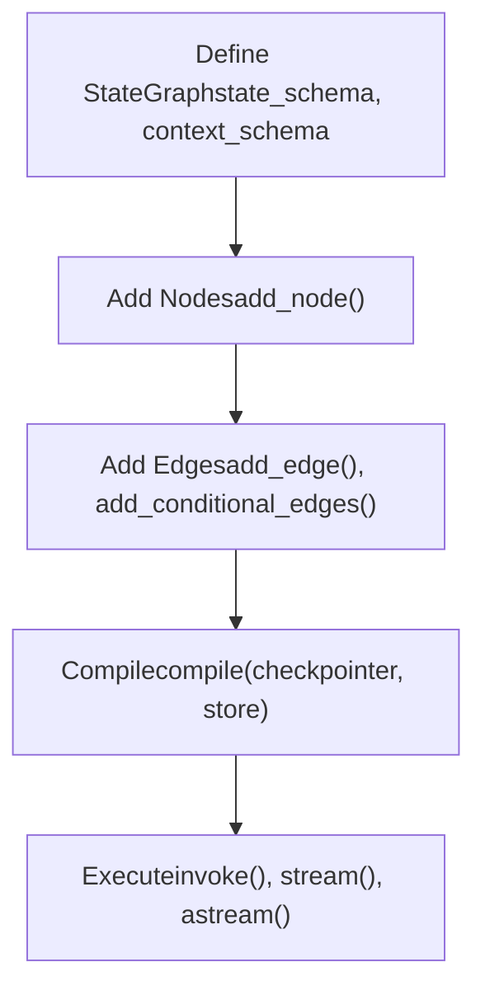
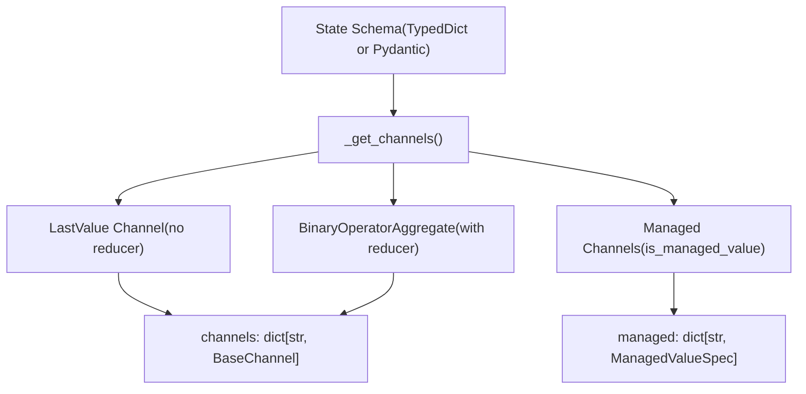
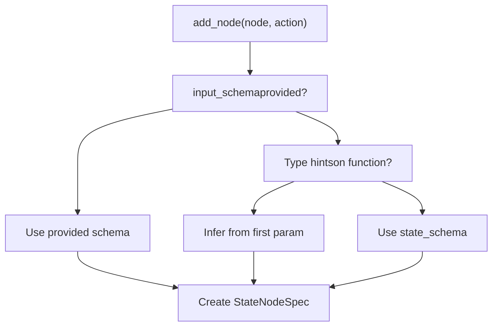
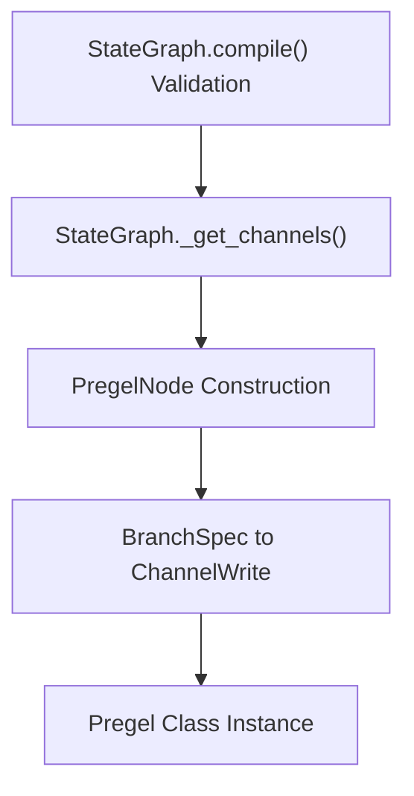
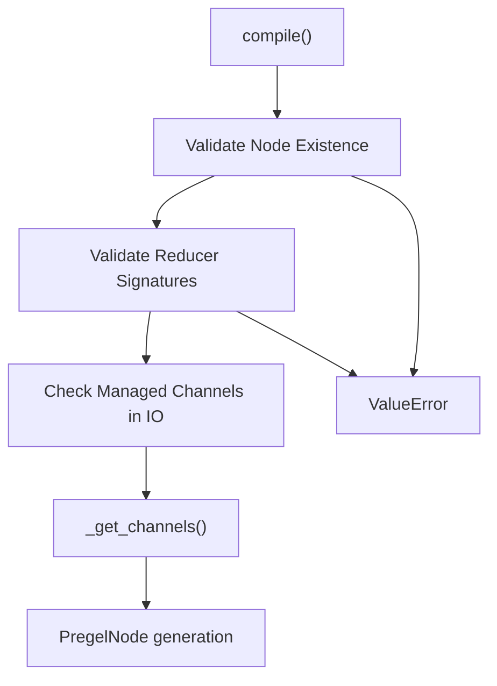

# StateGraph API

Relevant source files

-   [libs/langgraph/langgraph/constants.py](https://github.com/langchain-ai/langgraph/blob/1fd51e8f/libs/langgraph/langgraph/constants.py)
-   [libs/langgraph/langgraph/errors.py](https://github.com/langchain-ai/langgraph/blob/1fd51e8f/libs/langgraph/langgraph/errors.py)
-   [libs/langgraph/langgraph/func/\_\_init\_\_.py](https://github.com/langchain-ai/langgraph/blob/1fd51e8f/libs/langgraph/langgraph/func/__init__.py)
-   [libs/langgraph/langgraph/graph/state.py](https://github.com/langchain-ai/langgraph/blob/1fd51e8f/libs/langgraph/langgraph/graph/state.py)
-   [libs/langgraph/langgraph/pregel/\_\_init\_\_.py](https://github.com/langchain-ai/langgraph/blob/1fd51e8f/libs/langgraph/langgraph/pregel/__init__.py)
-   [libs/langgraph/langgraph/pregel/debug.py](https://github.com/langchain-ai/langgraph/blob/1fd51e8f/libs/langgraph/langgraph/pregel/debug.py)
-   [libs/langgraph/langgraph/pregel/types.py](https://github.com/langchain-ai/langgraph/blob/1fd51e8f/libs/langgraph/langgraph/pregel/types.py)
-   [libs/langgraph/langgraph/types.py](https://github.com/langchain-ai/langgraph/blob/1fd51e8f/libs/langgraph/langgraph/types.py)
-   [libs/langgraph/langgraph/utils/\_\_init\_\_.py](https://github.com/langchain-ai/langgraph/blob/1fd51e8f/libs/langgraph/langgraph/utils/__init__.py)
-   [libs/langgraph/langgraph/utils/config.py](https://github.com/langchain-ai/langgraph/blob/1fd51e8f/libs/langgraph/langgraph/utils/config.py)
-   [libs/langgraph/langgraph/utils/runnable.py](https://github.com/langchain-ai/langgraph/blob/1fd51e8f/libs/langgraph/langgraph/utils/runnable.py)
-   [libs/langgraph/tests/\_\_snapshots\_\_/test\_large\_cases.ambr](https://github.com/langchain-ai/langgraph/blob/1fd51e8f/libs/langgraph/tests/__snapshots__/test_large_cases.ambr)
-   [libs/langgraph/tests/test\_checkpoint\_migration.py](https://github.com/langchain-ai/langgraph/blob/1fd51e8f/libs/langgraph/tests/test_checkpoint_migration.py)
-   [libs/langgraph/tests/test\_large\_cases.py](https://github.com/langchain-ai/langgraph/blob/1fd51e8f/libs/langgraph/tests/test_large_cases.py)
-   [libs/langgraph/tests/test\_large\_cases\_async.py](https://github.com/langchain-ai/langgraph/blob/1fd51e8f/libs/langgraph/tests/test_large_cases_async.py)
-   [libs/langgraph/tests/test\_pregel.py](https://github.com/langchain-ai/langgraph/blob/1fd51e8f/libs/langgraph/tests/test_pregel.py)
-   [libs/langgraph/tests/test\_pregel\_async.py](https://github.com/langchain-ai/langgraph/blob/1fd51e8f/libs/langgraph/tests/test_pregel_async.py)

The `StateGraph` API provides a declarative interface for defining workflows where nodes communicate through a shared state. Each node reads from and writes to state channels, with optional reducer functions controlling how updates are aggregated. This API is the primary entry point for building LangGraph applications.

For information about the compiled graph execution, see [Pregel Execution Engine](/langchain-ai/langgraph/3.3-pregel-execution-engine). For control flow mechanisms like `Command` and `Send`, see [Control Flow Primitives](/langchain-ai/langgraph/3.5-control-flow-primitives). For the functional API alternative using `@task` and `@entrypoint` decorators, see [Functional API (@task and @entrypoint)](/langchain-ai/langgraph/3.2-functional-api-(@task-and-@entrypoint)).

## Overview

`StateGraph` is a builder class that constructs a graph by:

1.  Defining a state schema with optional reducer functions.
2.  Adding nodes (computation units) that transform state. [libs/langgraph/langgraph/graph/state.py359-572](https://github.com/langchain-ai/langgraph/blob/1fd51e8f/libs/langgraph/langgraph/graph/state.py#L359-L572)
3.  Adding edges (routing) between nodes. [libs/langgraph/langgraph/graph/state.py574-715](https://github.com/langchain-ai/langgraph/blob/1fd51e8f/libs/langgraph/langgraph/graph/state.py#L574-L715)
4.  Compiling to a `CompiledStateGraph` (a `Pregel` instance) for execution. [libs/langgraph/langgraph/graph/state.py782-1107](https://github.com/langchain-ai/langgraph/blob/1fd51e8f/libs/langgraph/langgraph/graph/state.py#L782-L1107)

The graph communicates through channels derived from the state schema, with each state key mapping to a `BaseChannel` implementation that handles value storage and updates. [libs/langgraph/langgraph/graph/state.py882-967](https://github.com/langchain-ai/langgraph/blob/1fd51e8f/libs/langgraph/langgraph/graph/state.py#L882-L967)

Sources: [libs/langgraph/langgraph/graph/state.py115-184](https://github.com/langchain-ai/langgraph/blob/1fd51e8f/libs/langgraph/langgraph/graph/state.py#L115-L184)

## StateGraph Lifecycle

The lifecycle involves transitioning from a builder state to an executable `Pregel` instance.

Title: StateGraph construction and execution flow


Sources: [libs/langgraph/langgraph/graph/state.py115-687](https://github.com/langchain-ai/langgraph/blob/1fd51e8f/libs/langgraph/langgraph/graph/state.py#L115-L687) [libs/langgraph/tests/test\_pregel.py87-121](https://github.com/langchain-ai/langgraph/blob/1fd51e8f/libs/langgraph/tests/test_pregel.py#L87-L121)

## State Schema and Channels

The state schema defines the structure of shared state and how updates are aggregated. Each key in the schema maps to a `BaseChannel` implementation:

| Channel Type | Usage | Reducer Behavior |
| --- | --- | --- |
| `LastValue` | Single value keys without reducers | Replaces previous value [libs/langgraph/langgraph/channels/last\_value.py1-53](https://github.com/langchain-ai/langgraph/blob/1fd51e8f/libs/langgraph/langgraph/channels/last_value.py#L1-L53) |
| `BinaryOperatorAggregate` | Keys with reducers (e.g., `operator.add`) | Aggregates values using reducer [libs/langgraph/langgraph/channels/binop.py1-46](https://github.com/langchain-ai/langgraph/blob/1fd51e8f/libs/langgraph/langgraph/channels/binop.py#L1-L46) |
| `Topic` | Multi-writer channels | Accumulates updates in sequence [libs/langgraph/langgraph/channels/topic.py1-50](https://github.com/langchain-ai/langgraph/blob/1fd51e8f/libs/langgraph/langgraph/channels/topic.py#L1-L50) |
| `EphemeralValue` | Temporary data | Not persisted to checkpoints [libs/langgraph/langgraph/channels/ephemeral\_value.py1-40](https://github.com/langchain-ai/langgraph/blob/1fd51e8f/libs/langgraph/langgraph/channels/ephemeral_value.py#L1-L40) |
| `UntrackedValue` | Non-snapshot data | Excluded from state snapshots [libs/langgraph/langgraph/channels/untracked\_value.py1-47](https://github.com/langchain-ai/langgraph/blob/1fd51e8f/libs/langgraph/langgraph/channels/untracked_value.py#L1-L47) |

Title: State schema to channel mapping


Sources: [libs/langgraph/langgraph/graph/state.py257-288](https://github.com/langchain-ai/langgraph/blob/1fd51e8f/libs/langgraph/langgraph/graph/state.py#L257-L288) [libs/langgraph/langgraph/graph/state.py882-967](https://github.com/langchain-ai/langgraph/blob/1fd51e8f/libs/langgraph/langgraph/graph/state.py#L882-L967)

## Class Definition

The `StateGraph` class maintains internal registries for nodes, edges, and branches before they are finalized during compilation.

```
class StateGraph(Generic[StateT, ContextT, InputT, OutputT]):    nodes: dict[str, StateNodeSpec[Any, ContextT]]    edges: set[tuple[str, str]]    branches: defaultdict[str, dict[str, BranchSpec]]    channels: dict[str, BaseChannel]    managed: dict[str, ManagedValueSpec]    waiting_edges: set[tuple[tuple[str, ...], str]]        def __init__(        self,        state_schema: type[StateT],        context_schema: type[ContextT] | None = None,        *,        input_schema: type[InputT] | None = None,        output_schema: type[OutputT] | None = None,    )
```
**Type Parameters:**

-   `StateT`: The state schema (TypedDict or Pydantic model) [libs/langgraph/langgraph/graph/state.py195](https://github.com/langchain-ai/langgraph/blob/1fd51e8f/libs/langgraph/langgraph/graph/state.py#L195-L195)
-   `ContextT`: Runtime context schema (immutable run-scoped data) [libs/langgraph/langgraph/graph/state.py196](https://github.com/langchain-ai/langgraph/blob/1fd51e8f/libs/langgraph/langgraph/graph/state.py#L196-L196)
-   `InputT`: Input schema (defaults to `StateT`) [libs/langgraph/langgraph/graph/state.py197](https://github.com/langchain-ai/langgraph/blob/1fd51e8f/libs/langgraph/langgraph/graph/state.py#L197-L197)
-   `OutputT`: Output schema (defaults to `StateT`) [libs/langgraph/langgraph/graph/state.py198](https://github.com/langchain-ai/langgraph/blob/1fd51e8f/libs/langgraph/langgraph/graph/state.py#L198-L198)

Sources: [libs/langgraph/langgraph/graph/state.py115-250](https://github.com/langchain-ai/langgraph/blob/1fd51e8f/libs/langgraph/langgraph/graph/state.py#L115-L250)

## Adding Nodes

Nodes are computation units that receive state as input and return partial state updates. The `add_node` method handles registration of functions or `Runnable` objects into the graph's `nodes` dictionary. [libs/langgraph/langgraph/graph/state.py359-572](https://github.com/langchain-ai/langgraph/blob/1fd51e8f/libs/langgraph/langgraph/graph/state.py#L359-L572)

**Input Schema Inference:** If a node function has type hints, `StateGraph` attempts to infer the input schema from the first parameter using `get_type_hints`. [libs/langgraph/langgraph/graph/state.py441-445](https://github.com/langchain-ai/langgraph/blob/1fd51e8f/libs/langgraph/langgraph/graph/state.py#L441-L445)

Title: Node input schema resolution


Sources: [libs/langgraph/langgraph/graph/state.py359-572](https://github.com/langchain-ai/langgraph/blob/1fd51e8f/libs/langgraph/langgraph/graph/state.py#L359-L572) [libs/langgraph/tests/test\_pregel.py255-309](https://github.com/langchain-ai/langgraph/blob/1fd51e8f/libs/langgraph/tests/test_pregel.py#L255-L309)

## Adding Edges

### Regular Edges

Regular edges define transitions between nodes. They are stored in the `edges` set or `waiting_edges` if multiple source nodes are provided. [libs/langgraph/langgraph/graph/state.py574-626](https://github.com/langchain-ai/langgraph/blob/1fd51e8f/libs/langgraph/langgraph/graph/state.py#L574-L626)

**Edge Constraints:**

-   `START` and `END` are virtual nodes used to mark boundaries. [libs/langgraph/langgraph/constants.py28-31](https://github.com/langchain-ai/langgraph/blob/1fd51e8f/libs/langgraph/langgraph/constants.py#L28-L31)
-   All referenced nodes must exist, which is validated during `compile()`. [libs/langgraph/langgraph/graph/state.py804-814](https://github.com/langchain-ai/langgraph/blob/1fd51e8f/libs/langgraph/langgraph/graph/state.py#L804-L814)

### Conditional Edges

Conditional edges enable dynamic routing based on state or node output. They use `BranchSpec` to manage routing logic. [libs/langgraph/langgraph/graph/state.py628-715](https://github.com/langchain-ai/langgraph/blob/1fd51e8f/libs/langgraph/langgraph/graph/state.py#L628-L715)

Sources: [libs/langgraph/langgraph/graph/state.py574-715](https://github.com/langchain-ai/langgraph/blob/1fd51e8f/libs/langgraph/langgraph/graph/state.py#L574-L715)

## Compilation

The `compile` method transforms the builder into a `CompiledStateGraph`, which inherits from `Pregel`. [libs/langgraph/langgraph/graph/state.py782-1107](https://github.com/langchain-ai/langgraph/blob/1fd51e8f/libs/langgraph/langgraph/graph/state.py#L782-L1107)

Title: Compilation stages in Code Entity Space


**Compilation Parameters:**

| Parameter | Type | Description |
| --- | --- | --- |
| `checkpointer` | `BaseCheckpointSaver` | Enables state persistence. [libs/langgraph/langgraph/graph/state.py793](https://github.com/langchain-ai/langgraph/blob/1fd51e8f/libs/langgraph/langgraph/graph/state.py#L793-L793) |
| `store` | `BaseStore` | Cross-thread persistent memory. [libs/langgraph/langgraph/graph/state.py794](https://github.com/langchain-ai/langgraph/blob/1fd51e8f/libs/langgraph/langgraph/graph/state.py#L794-L794) |
| `interrupt_before` | `list[str]` | Nodes to interrupt before execution. [libs/langgraph/langgraph/graph/state.py795](https://github.com/langchain-ai/langgraph/blob/1fd51e8f/libs/langgraph/langgraph/graph/state.py#L795-L795) |
| `interrupt_after` | `list[str]` | Nodes to interrupt after execution. [libs/langgraph/langgraph/graph/state.py796](https://github.com/langchain-ai/langgraph/blob/1fd51e8f/libs/langgraph/langgraph/graph/state.py#L796-L796) |

Sources: [libs/langgraph/langgraph/graph/state.py782-1107](https://github.com/langchain-ai/langgraph/blob/1fd51e8f/libs/langgraph/langgraph/graph/state.py#L782-L1107) [libs/langgraph/tests/test\_pregel.py87-121](https://github.com/langchain-ai/langgraph/blob/1fd51e8f/libs/langgraph/tests/test_pregel.py#L87-L121)

## State Reducers

Reducers control how multiple updates to the same state key are aggregated. If a key is `Annotated` with a function, `StateGraph` creates a `BinaryOperatorAggregate` channel. [libs/langgraph/langgraph/graph/state.py882-967](https://github.com/langchain-ai/langgraph/blob/1fd51e8f/libs/langgraph/langgraph/graph/state.py#L882-L967)

**Special Reducers:**

-   `add_messages`: Merges message lists, handling ID deduplication. [libs/langgraph/langgraph/graph/message.py52](https://github.com/langchain-ai/langgraph/blob/1fd51e8f/libs/langgraph/langgraph/graph/message.py#L52-L52)
-   `operator.add`: Used for simple accumulation. [libs/langgraph/tests/test\_pregel.py186](https://github.com/langchain-ai/langgraph/blob/1fd51e8f/libs/langgraph/tests/test_pregel.py#L186-L186)

Title: Channel selection logic in Code Entity Space

Sources: [libs/langgraph/langgraph/graph/state.py882-967](https://github.com/langchain-ai/langgraph/blob/1fd51e8f/libs/langgraph/langgraph/graph/state.py#L882-L967)

## Graph Validation

Validation occurs during `compile()` to ensure structural integrity. [libs/langgraph/langgraph/graph/state.py782-860](https://github.com/langchain-ai/langgraph/blob/1fd51e8f/libs/langgraph/langgraph/graph/state.py#L782-L860)

Title: Compilation validation flow


Sources: [libs/langgraph/langgraph/graph/state.py782-860](https://github.com/langchain-ai/langgraph/blob/1fd51e8f/libs/langgraph/langgraph/graph/state.py#L782-L860) [libs/langgraph/tests/test\_pregel.py87-121](https://github.com/langchain-ai/langgraph/blob/1fd51e8f/libs/langgraph/tests/test_pregel.py#L87-L121)

## Graph Visualization

`CompiledStateGraph` provides visualization through the `get_graph()` method, which returns a `langchain_core.runnables.graph.Graph` object. [libs/langgraph/langgraph/graph/state.py1109-1193](https://github.com/langchain-ai/langgraph/blob/1fd51e8f/libs/langgraph/langgraph/graph/state.py#L1109-L1193)

-   `draw_mermaid()`: Generates Mermaid string.
-   `to_json()`: Returns JSON representation.

Sources: [libs/langgraph/langgraph/graph/state.py1109-1193](https://github.com/langchain-ai/langgraph/blob/1fd51e8f/libs/langgraph/langgraph/graph/state.py#L1109-L1193) [libs/langgraph/tests/test\_pregel.py1105-1129](https://github.com/langchain-ai/langgraph/blob/1fd51e8f/libs/langgraph/tests/test_pregel.py#L1105-L1129)
