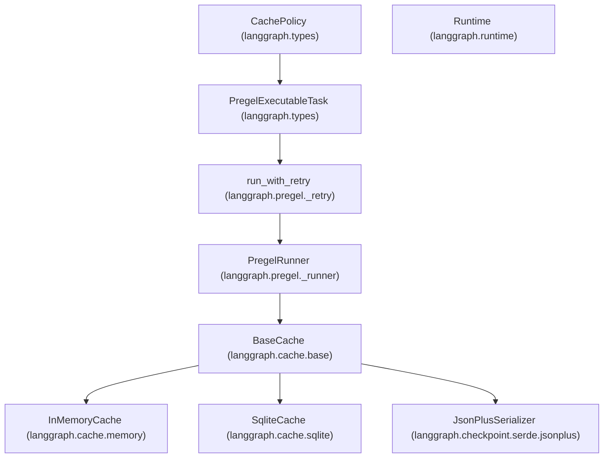

# Caching System

Relevant source files

-   [libs/checkpoint-sqlite/langgraph/cache/sqlite/\_\_init\_\_.py](https://github.com/langchain-ai/langgraph/blob/1fd51e8f/libs/checkpoint-sqlite/langgraph/cache/sqlite/__init__.py)
-   [libs/checkpoint/langgraph/cache/base/\_\_init\_\_.py](https://github.com/langchain-ai/langgraph/blob/1fd51e8f/libs/checkpoint/langgraph/cache/base/__init__.py)
-   [libs/checkpoint/langgraph/cache/base/py.typed](https://github.com/langchain-ai/langgraph/blob/1fd51e8f/libs/checkpoint/langgraph/cache/base/py.typed)
-   [libs/checkpoint/langgraph/cache/memory/\_\_init\_\_.py](https://github.com/langchain-ai/langgraph/blob/1fd51e8f/libs/checkpoint/langgraph/cache/memory/__init__.py)
-   [libs/langgraph/langgraph/\_internal/\_config.py](https://github.com/langchain-ai/langgraph/blob/1fd51e8f/libs/langgraph/langgraph/_internal/_config.py)
-   [libs/langgraph/langgraph/\_internal/\_runnable.py](https://github.com/langchain-ai/langgraph/blob/1fd51e8f/libs/langgraph/langgraph/_internal/_runnable.py)
-   [libs/langgraph/langgraph/\_internal/\_scratchpad.py](https://github.com/langchain-ai/langgraph/blob/1fd51e8f/libs/langgraph/langgraph/_internal/_scratchpad.py)
-   [libs/langgraph/langgraph/pregel/\_algo.py](https://github.com/langchain-ai/langgraph/blob/1fd51e8f/libs/langgraph/langgraph/pregel/_algo.py)
-   [libs/langgraph/langgraph/pregel/\_retry.py](https://github.com/langchain-ai/langgraph/blob/1fd51e8f/libs/langgraph/langgraph/pregel/_retry.py)
-   [libs/langgraph/langgraph/pregel/\_runner.py](https://github.com/langchain-ai/langgraph/blob/1fd51e8f/libs/langgraph/langgraph/pregel/_runner.py)
-   [libs/langgraph/langgraph/runtime.py](https://github.com/langchain-ai/langgraph/blob/1fd51e8f/libs/langgraph/langgraph/runtime.py)
-   [libs/langgraph/tests/test\_channels.py](https://github.com/langchain-ai/langgraph/blob/1fd51e8f/libs/langgraph/tests/test_channels.py)
-   [libs/langgraph/tests/test\_managed\_values.py](https://github.com/langchain-ai/langgraph/blob/1fd51e8f/libs/langgraph/tests/test_managed_values.py)
-   [libs/langgraph/tests/test\_parent\_command.py](https://github.com/langchain-ai/langgraph/blob/1fd51e8f/libs/langgraph/tests/test_parent_command.py)
-   [libs/langgraph/tests/test\_parent\_command\_async.py](https://github.com/langchain-ai/langgraph/blob/1fd51e8f/libs/langgraph/tests/test_parent_command_async.py)
-   [libs/langgraph/tests/test\_retry.py](https://github.com/langchain-ai/langgraph/blob/1fd51e8f/libs/langgraph/tests/test_retry.py)
-   [libs/langgraph/tests/test\_runnable.py](https://github.com/langchain-ai/langgraph/blob/1fd51e8f/libs/langgraph/tests/test_runnable.py)

This page documents the LangGraph caching system, which provides result memoization for nodes and tasks to avoid redundant re-execution. It covers the `CachePolicy` configuration, the `BaseCache` interface, specific backend implementations (Memory, SQLite), and how the system integrates with the Pregel execution loop.

---

## Overview

The caching system allows individual nodes in a `StateGraph` or tasks in the Functional API to skip execution if their inputs have been processed previously. This is distinct from checkpointing, which persists the entire graph state for recovery and time travel.

| Component | Responsibility |
| --- | --- |
| **`CachePolicy`** | Defines *how* a node should be cached (TTL, key generation function). |
| **`BaseCache`** | Abstract interface for cache storage backends. |
| **`CacheKey`** | A unique identifier for a specific execution attempt (namespace + hash). |
| **`PregelRunner`** | Orchestrates the lookup and storage of results during the execution tick. |

Sources: [libs/langgraph/langgraph/types.py74-82](https://github.com/langchain-ai/langgraph/blob/1fd51e8f/libs/langgraph/langgraph/types.py#L74-L82) [libs/checkpoint/langgraph/cache/base/\_\_init\_\_.py15-18](https://github.com/langchain-ai/langgraph/blob/1fd51e8f/libs/checkpoint/langgraph/cache/base/__init__.py#L15-L18)

---

## Cache Configuration

### CachePolicy

`CachePolicy` is a dataclass that configures caching behavior for a specific node or task.

| Field | Type | Description |
| --- | --- | --- |
| `key_func` | `Callable` | Function to generate a string/byte key from node inputs. |
| `ttl` | \`int | None\` |

Sources: [libs/langgraph/langgraph/types.py74-82](https://github.com/langchain-ai/langgraph/blob/1fd51e8f/libs/langgraph/langgraph/types.py#L74-L82) [libs/langgraph/langgraph/pregel/\_algo.py115-138](https://github.com/langchain-ai/langgraph/blob/1fd51e8f/libs/langgraph/langgraph/pregel/_algo.py#L115-L138)

### CacheKey

The execution engine uses `CacheKey` to perform lookups. It combines a namespace (to prevent collisions between different nodes) with the specific key generated by the policy.

Sources: [libs/langgraph/langgraph/pregel/\_algo.py71-72](https://github.com/langchain-ai/langgraph/blob/1fd51e8f/libs/langgraph/langgraph/pregel/_algo.py#L71-L72) [libs/langgraph/langgraph/types.py74-76](https://github.com/langchain-ai/langgraph/blob/1fd51e8f/libs/langgraph/langgraph/types.py#L74-L76)

---

## Cache Backend Interface

All caching backends must implement the `BaseCache` interface. This interface supports both synchronous and asynchronous operations and uses a `SerializerProtocol` (defaulting to `JsonPlusSerializer`) to handle data conversion.

**Core Interface Methods:**

-   `get(keys: Sequence[FullKey]) -> dict[FullKey, ValueT]` [libs/checkpoint/langgraph/cache/base/\_\_init\_\_.py25-27](https://github.com/langchain-ai/langgraph/blob/1fd51e8f/libs/checkpoint/langgraph/cache/base/__init__.py#L25-L27)
-   `set(pairs: Mapping[FullKey, tuple[ValueT, int | None]])` [libs/checkpoint/langgraph/cache/base/\_\_init\_\_.py33-35](https://github.com/langchain-ai/langgraph/blob/1fd51e8f/libs/checkpoint/langgraph/cache/base/__init__.py#L33-L35)
-   `clear(namespaces: Sequence[Namespace] | None)` [libs/checkpoint/langgraph/cache/base/\_\_init\_\_.py41-43](https://github.com/langchain-ai/langgraph/blob/1fd51e8f/libs/checkpoint/langgraph/cache/base/__init__.py#L41-L43)

### Implementations

#### 1\. InMemoryCache

A thread-safe, non-persistent cache stored in a Python dictionary. It uses `threading.RLock` to manage concurrent access.

-   **File:** `libs/checkpoint/langgraph/cache/memory/__init__.py` [libs/checkpoint/langgraph/cache/memory/\_\_init\_\_.py11-15](https://github.com/langchain-ai/langgraph/blob/1fd51e8f/libs/checkpoint/langgraph/cache/memory/__init__.py#L11-L15)
-   **Storage:** `dict[Namespace, dict[str, tuple[str, bytes, float | None]]]` [libs/checkpoint/langgraph/cache/memory/\_\_init\_\_.py14](https://github.com/langchain-ai/langgraph/blob/1fd51e8f/libs/checkpoint/langgraph/cache/memory/__init__.py#L14-L14)

#### 2\. SqliteCache

A persistent, file-based cache using SQLite. It enables WAL (Write-Ahead Logging) mode for improved concurrency.

-   **File:** `libs/checkpoint-sqlite/langgraph/cache/sqlite/__init__.py` [libs/checkpoint-sqlite/langgraph/cache/sqlite/\_\_init\_\_.py13-15](https://github.com/langchain-ai/langgraph/blob/1fd51e8f/libs/checkpoint-sqlite/langgraph/cache/sqlite/__init__.py#L13-L15)
-   **Schema:** A `cache` table with columns `ns`, `key`, `expiry`, `encoding`, and `val`. [libs/checkpoint-sqlite/langgraph/cache/sqlite/\_\_init\_\_.py35-42](https://github.com/langchain-ai/langgraph/blob/1fd51e8f/libs/checkpoint-sqlite/langgraph/cache/sqlite/__init__.py#L35-L42)

---

## Execution Integration

Caching is integrated directly into the `PregelRunner` and the retry logic. Before a task is executed, the runner checks for existing cached writes.

### Data Flow Diagram

The following diagram illustrates how the `PregelRunner` interacts with the `BaseCache` during a single execution "tick".

**Pregel Execution and Cache Lookup**

> **[Mermaid sequence]**
> *(图表结构无法解析)*

Sources: [libs/langgraph/langgraph/pregel/\_runner.py164-184](https://github.com/langchain-ai/langgraph/blob/1fd51e8f/libs/langgraph/langgraph/pregel/_runner.py#L164-L184) [libs/langgraph/langgraph/pregel/\_retry.py158-187](https://github.com/langchain-ai/langgraph/blob/1fd51e8f/libs/langgraph/langgraph/pregel/_retry.py#L158-L187) [libs/langgraph/langgraph/pregel/\_algo.py115-138](https://github.com/langchain-ai/langgraph/blob/1fd51e8f/libs/langgraph/langgraph/pregel/_algo.py#L115-L138)

---

## Code Entity Mapping

This diagram bridges the conceptual "Cache System" with the specific classes and files in the codebase.

**Caching System Code Map**

Sources: [libs/langgraph/langgraph/types.py74-82](https://github.com/langchain-ai/langgraph/blob/1fd51e8f/libs/langgraph/langgraph/types.py#L74-L82) [libs/langgraph/langgraph/pregel/\_runner.py122-140](https://github.com/langchain-ai/langgraph/blob/1fd51e8f/libs/langgraph/langgraph/pregel/_runner.py#L122-L140) [libs/langgraph/langgraph/pregel/\_retry.py57-61](https://github.com/langchain-ai/langgraph/blob/1fd51e8f/libs/langgraph/langgraph/pregel/_retry.py#L57-L61) [libs/checkpoint/langgraph/cache/base/\_\_init\_\_.py15-23](https://github.com/langchain-ai/langgraph/blob/1fd51e8f/libs/checkpoint/langgraph/cache/base/__init__.py#L15-L23)

---

## Key Functions and Classes

### `run_with_retry` and `arun_with_retry`

These functions wrap the execution of a `PregelExecutableTask`. They are responsible for checking the cache before calling the node's underlying procedure (`task.proc`). If a `cache_key` is present and a hit is found in the backend, the cached writes are applied directly to the task, bypassing the function call.

-   **File:** `libs/langgraph/langgraph/pregel/_retry.py` [libs/langgraph/langgraph/pregel/\_retry.py158-187](https://github.com/langchain-ai/langgraph/blob/1fd51e8f/libs/langgraph/langgraph/pregel/_retry.py#L158-L187)

### `BaseCache.get` / `BaseCache.set`

These methods handle the serialization and TTL logic.

-   In `SqliteCache.get`, expired entries are automatically purged if the current timestamp exceeds the `expiry` value stored in the database. [libs/checkpoint-sqlite/langgraph/cache/sqlite/\_\_init\_\_.py63-68](https://github.com/langchain-ai/langgraph/blob/1fd51e8f/libs/checkpoint-sqlite/langgraph/cache/sqlite/__init__.py#L63-L68)
-   In `InMemoryCache.get`, the lock ensures that reading and purging expired entries is atomic. [libs/checkpoint/langgraph/cache/memory/\_\_init\_\_.py19-31](https://github.com/langchain-ai/langgraph/blob/1fd51e8f/libs/checkpoint/langgraph/cache/memory/__init__.py#L19-L31)

### `Runtime` Integration

The `Runtime` object, injected into nodes, provides metadata like `node_attempt` and `node_first_attempt_time` via `ExecutionInfo`. While not the cache itself, this metadata is often used by custom `key_func` implementations to determine if a result should be cached or recomputed.

-   **File:** `libs/langgraph/langgraph/runtime.py` [libs/langgraph/langgraph/runtime.py17-25](https://github.com/langchain-ai/langgraph/blob/1fd51e8f/libs/langgraph/langgraph/runtime.py#L17-L25)

Sources: [libs/langgraph/langgraph/pregel/\_retry.py57-187](https://github.com/langchain-ai/langgraph/blob/1fd51e8f/libs/langgraph/langgraph/pregel/_retry.py#L57-L187) [libs/checkpoint-sqlite/langgraph/cache/sqlite/\_\_init\_\_.py46-72](https://github.com/langchain-ai/langgraph/blob/1fd51e8f/libs/checkpoint-sqlite/langgraph/cache/sqlite/__init__.py#L46-L72) [libs/langgraph/langgraph/runtime.py133-135](https://github.com/langchain-ai/langgraph/blob/1fd51e8f/libs/langgraph/langgraph/runtime.py#L133-L135)
