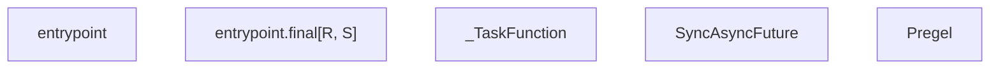
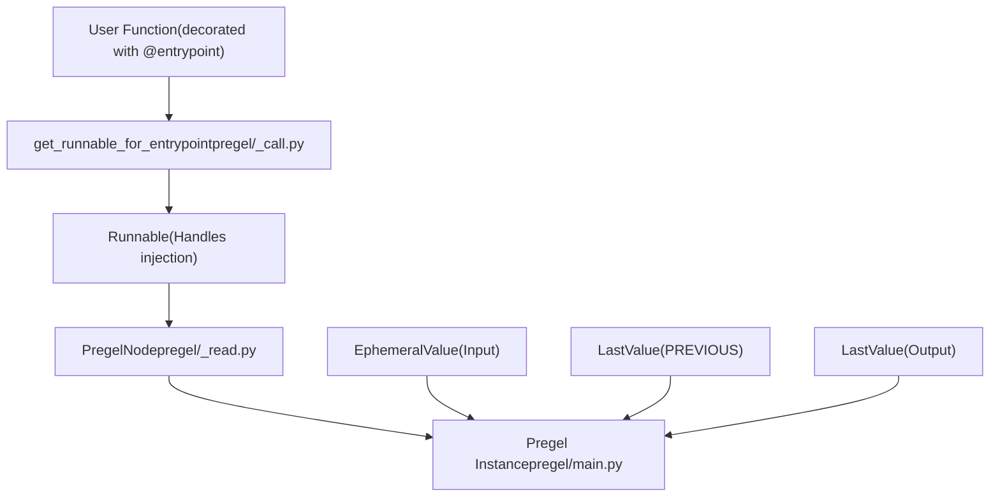

# Functional API (@task and @entrypoint)

Relevant source files

-   [libs/langgraph/langgraph/constants.py](https://github.com/langchain-ai/langgraph/blob/1fd51e8f/libs/langgraph/langgraph/constants.py)
-   [libs/langgraph/langgraph/errors.py](https://github.com/langchain-ai/langgraph/blob/1fd51e8f/libs/langgraph/langgraph/errors.py)
-   [libs/langgraph/langgraph/func/\_\_init\_\_.py](https://github.com/langchain-ai/langgraph/blob/1fd51e8f/libs/langgraph/langgraph/func/__init__.py)
-   [libs/langgraph/langgraph/graph/state.py](https://github.com/langchain-ai/langgraph/blob/1fd51e8f/libs/langgraph/langgraph/graph/state.py)
-   [libs/langgraph/langgraph/pregel/\_\_init\_\_.py](https://github.com/langchain-ai/langgraph/blob/1fd51e8f/libs/langgraph/langgraph/pregel/__init__.py)
-   [libs/langgraph/langgraph/pregel/debug.py](https://github.com/langchain-ai/langgraph/blob/1fd51e8f/libs/langgraph/langgraph/pregel/debug.py)
-   [libs/langgraph/langgraph/pregel/types.py](https://github.com/langchain-ai/langgraph/blob/1fd51e8f/libs/langgraph/langgraph/pregel/types.py)
-   [libs/langgraph/langgraph/types.py](https://github.com/langchain-ai/langgraph/blob/1fd51e8f/libs/langgraph/langgraph/types.py)
-   [libs/langgraph/tests/\_\_snapshots\_\_/test\_large\_cases.ambr](https://github.com/langchain-ai/langgraph/blob/1fd51e8f/libs/langgraph/tests/__snapshots__/test_large_cases.ambr)
-   [libs/langgraph/tests/test\_checkpoint\_migration.py](https://github.com/langchain-ai/langgraph/blob/1fd51e8f/libs/langgraph/tests/test_checkpoint_migration.py)
-   [libs/langgraph/tests/test\_large\_cases.py](https://github.com/langchain-ai/langgraph/blob/1fd51e8f/libs/langgraph/tests/test_large_cases.py)
-   [libs/langgraph/tests/test\_large\_cases\_async.py](https://github.com/langchain-ai/langgraph/blob/1fd51e8f/libs/langgraph/tests/test_large_cases_async.py)
-   [libs/langgraph/tests/test\_pregel.py](https://github.com/langchain-ai/langgraph/blob/1fd51e8f/libs/langgraph/tests/test_pregel.py)
-   [libs/langgraph/tests/test\_pregel\_async.py](https://github.com/langchain-ai/langgraph/blob/1fd51e8f/libs/langgraph/tests/test_pregel_async.py)

This page documents the `@task` and `@entrypoint` decorators from `langgraph.func`, which allow composing LangGraph workflows entirely in Python without explicitly constructing a `StateGraph`. Like `StateGraph`, both decorators ultimately compile down to a `Pregel` instance—the same core execution engine that powers all LangGraph graphs.

For the explicit graph builder pattern, see [StateGraph API](/langchain-ai/langgraph/3.1-stategraph-api). For the Pregel execution engine that runs both models, see [Pregel Execution Engine](/langchain-ai/langgraph/3.3-pregel-execution-engine).

---

## Overview

Both decorators are exported from `langgraph.func` [libs/langgraph/langgraph/func/\_\_init\_\_.py44](https://github.com/langchain-ai/langgraph/blob/1fd51e8f/libs/langgraph/langgraph/func/__init__.py#L44-L44) They provide a functional interface to the underlying Pregel orchestration system.

| Decorator | Role | Returns |
| --- | --- | --- |
| `@task` | Unit of work, schedulable as a concurrent future | `_TaskFunction[P, T]` wrapping a `SyncAsyncFuture[T]` |
| `@entrypoint` | Top-level workflow; the graph's entry and exit point | `Pregel` instance |

**Comparison with `StateGraph`:**

| Aspect | `StateGraph` | Functional API |
| --- | --- | --- |
| Structure definition | Explicit nodes + edges | Python control flow (loops, if/else) |
| State | Typed dict / schema channels | Function arguments and return values |
| Parallelism | Multiple nodes in same superstep | Multiple `@task` futures dispatched before `result()` |
| Default stream mode | `"updates"` | `"updates"` |
| Compilation | `builder.compile()` | Automatic via decorator |

Sources: [libs/langgraph/langgraph/func/\_\_init\_\_.py44-50](https://github.com/langchain-ai/langgraph/blob/1fd51e8f/libs/langgraph/langgraph/func/__init__.py#L44-L50) [libs/langgraph/langgraph/graph/state.py115-184](https://github.com/langchain-ai/langgraph/blob/1fd51e8f/libs/langgraph/langgraph/graph/state.py#L115-L184)

---

## Key Code Entities

The functional API maps Python functions to `Pregel` nodes and channels.

### Class Relationships


Sources: [libs/langgraph/langgraph/func/\_\_init\_\_.py47-80](https://github.com/langchain-ai/langgraph/blob/1fd51e8f/libs/langgraph/langgraph/func/__init__.py#L47-L80) [libs/langgraph/langgraph/pregel/main.py1-2](https://github.com/langchain-ai/langgraph/blob/1fd51e8f/libs/langgraph/langgraph/pregel/main.py#L1-L2)

---

## `@task` Decorator

**Source:** [libs/langgraph/langgraph/func/\_\_init\_\_.py116-217](https://github.com/langchain-ai/langgraph/blob/1fd51e8f/libs/langgraph/langgraph/func/__init__.py#L116-L217)

`@task` wraps a sync or async function in a `_TaskFunction`. Calling the wrapped function schedules execution within the current Pregel superstep and returns a `SyncAsyncFuture[T]`.

### Parameters

| Parameter | Type | Default | Description |
| --- | --- | --- | --- |
| `name` | `str | None` | `None` | Override task name; defaults to `func.__name__` [libs/langgraph/langgraph/func/\_\_init\_\_.py56-66](https://github.com/langchain-ai/langgraph/blob/1fd51e8f/libs/langgraph/langgraph/func/__init__.py#L56-L66) |
| `retry_policy` | `RetryPolicy | Sequence[RetryPolicy] | None` | `None` | Retry configuration on failure [libs/langgraph/langgraph/func/\_\_init\_\_.py143](https://github.com/langchain-ai/langgraph/blob/1fd51e8f/libs/langgraph/langgraph/func/__init__.py#L143-L143) |
| `cache_policy` | `CachePolicy | None` | `None` | Cache configuration for results [libs/langgraph/langgraph/func/\_\_init\_\_.py144](https://github.com/langchain-ai/langgraph/blob/1fd51e8f/libs/langgraph/langgraph/func/__init__.py#L144-L144) |

### Execution and Parallelism

Calling a task returns a future. To run tasks in parallel, dispatch them and then collect results:

```
# Dispatched in parallelfutures = [my_task(i) for i in range(3)]# Block/Await for resultsresults = [f.result() for f in futures]
```
Tasks can only be called from inside an `@entrypoint` or a `StateGraph` node [libs/langgraph/langgraph/func/\_\_init\_\_.py133-138](https://github.com/langchain-ai/langgraph/blob/1fd51e8f/libs/langgraph/langgraph/func/__init__.py#L133-L138)

---

## `@entrypoint` Decorator

**Source:** [libs/langgraph/langgraph/func/\_\_init\_\_.py228-492](https://github.com/langchain-ai/langgraph/blob/1fd51e8f/libs/langgraph/langgraph/func/__init__.py#L228-L492)

The `@entrypoint` decorator transforms a Python function into a `Pregel` instance. It manages the lifecycle of the workflow, including checkpointing and dependency injection.

### Parameters

| Parameter | Type | Description |
| --- | --- | --- |
| `checkpointer` | `Checkpointer` | Enables persistence across invocations [libs/langgraph/langgraph/func/\_\_init\_\_.py255](https://github.com/langchain-ai/langgraph/blob/1fd51e8f/libs/langgraph/langgraph/func/__init__.py#L255-L255) |
| `store` | `BaseStore | None` | Cross-thread key-value store [libs/langgraph/langgraph/func/\_\_init\_\_.py256](https://github.com/langchain-ai/langgraph/blob/1fd51e8f/libs/langgraph/langgraph/func/__init__.py#L256-L256) |
| `context_schema` | `type[ContextT] | None` | Schema for run-scoped context [libs/langgraph/langgraph/func/\_\_init\_\_.py258](https://github.com/langchain-ai/langgraph/blob/1fd51e8f/libs/langgraph/langgraph/func/__init__.py#L258-L258) |

### Runtime Injection

Entrypoints can receive injected parameters by including them in the function signature:

-   `config`: The `RunnableConfig` for the current run.
-   `previous`: The return value from the prior invocation (requires a checkpointer).
-   `runtime`: A `Runtime` object containing `context`, `store`, and `stream_writer`.

Sources: [libs/langgraph/langgraph/func/\_\_init\_\_.py278-310](https://github.com/langchain-ai/langgraph/blob/1fd51e8f/libs/langgraph/langgraph/func/__init__.py#L278-L310)

---

## Compilation to Pregel

When `@entrypoint` is applied to a function, it compiles it into a `Pregel` object by mapping the function logic to a `PregelNode` and setting up appropriate channels.

### Compilation Flow


Sources: [libs/langgraph/langgraph/func/\_\_init\_\_.py471-492](https://github.com/langchain-ai/langgraph/blob/1fd51e8f/libs/langgraph/langgraph/func/__init__.py#L471-L492) [libs/langgraph/langgraph/pregel/\_call.py35](https://github.com/langchain-ai/langgraph/blob/1fd51e8f/libs/langgraph/langgraph/pregel/_call.py#L35-L35)

### Task Scheduling Sequence

> **[Mermaid sequence]**
> *(图表结构无法解析)*

Sources: [libs/langgraph/langgraph/func/\_\_init\_\_.py72-79](https://github.com/langchain-ai/langgraph/blob/1fd51e8f/libs/langgraph/langgraph/func/__init__.py#L72-L79) [libs/langgraph/langgraph/pregel/\_runner.py57-58](https://github.com/langchain-ai/langgraph/blob/1fd51e8f/libs/langgraph/langgraph/pregel/_runner.py#L57-L58)

---

## State and Persistence

### `entrypoint.final`

To decouple the value returned to the user from the value saved for the next invocation (the `previous` parameter), use `entrypoint.final` [libs/langgraph/langgraph/func/\_\_init\_\_.py430-469](https://github.com/langchain-ai/langgraph/blob/1fd51e8f/libs/langgraph/langgraph/func/__init__.py#L430-L469)

| Field | Description |
| --- | --- |
| `value` | The result returned by `invoke()` or `stream()` |
| `save` | The value persisted to the checkpoint as `PREVIOUS` |

### Channel Layout

The functional API uses a specific channel layout to mimic standard function behavior:

| Channel | Type | Role |
| --- | --- | --- |
| Input | `EphemeralValue` | Holds the input for the current superstep [libs/langgraph/langgraph/func/\_\_init\_\_.py26](https://github.com/langchain-ai/langgraph/blob/1fd51e8f/libs/langgraph/langgraph/func/__init__.py#L26-L26) |
| `PREVIOUS` | `LastValue` | Persists state across threads/checkpoints [libs/langgraph/langgraph/func/\_\_init\_\_.py27](https://github.com/langchain-ai/langgraph/blob/1fd51e8f/libs/langgraph/langgraph/func/__init__.py#L27-L27) |
| Output | `LastValue` | Captures the final return value |

Sources: [libs/langgraph/langgraph/func/\_\_init\_\_.py23-28](https://github.com/langchain-ai/langgraph/blob/1fd51e8f/libs/langgraph/langgraph/func/__init__.py#L23-L28) [libs/langgraph/langgraph/channels/ephemeral\_value.py1-5](https://github.com/langchain-ai/langgraph/blob/1fd51e8f/libs/langgraph/langgraph/channels/ephemeral_value.py#L1-L5) [libs/langgraph/langgraph/channels/last\_value.py1-5](https://github.com/langchain-ai/langgraph/blob/1fd51e8f/libs/langgraph/langgraph/channels/last_value.py#L1-L5)

---

## Streaming and Interrupts

-   **Streaming**: Functional API supports all `StreamMode` values. `"values"` mode emits the final result, while `"updates"` emits individual task results [libs/langgraph/langgraph/types.py118-132](https://github.com/langchain-ai/langgraph/blob/1fd51e8f/libs/langgraph/langgraph/types.py#L118-L132)
-   **Interrupts**: The `interrupt()` function can be used within tasks or entrypoints to pause execution. Resuming triggers a replay of completed tasks from the checkpoint [libs/langgraph/langgraph/types.py79](https://github.com/langchain-ai/langgraph/blob/1fd51e8f/libs/langgraph/langgraph/types.py#L79-L79) [libs/langgraph/langgraph/func/\_\_init\_\_.py312-325](https://github.com/langchain-ai/langgraph/blob/1fd51e8f/libs/langgraph/langgraph/func/__init__.py#L312-L325)

Sources: [libs/langgraph/langgraph/types.py79-132](https://github.com/langchain-ai/langgraph/blob/1fd51e8f/libs/langgraph/langgraph/types.py#L79-L132) [libs/langgraph/langgraph/func/\_\_init\_\_.py312-325](https://github.com/langchain-ai/langgraph/blob/1fd51e8f/libs/langgraph/langgraph/func/__init__.py#L312-L325)
