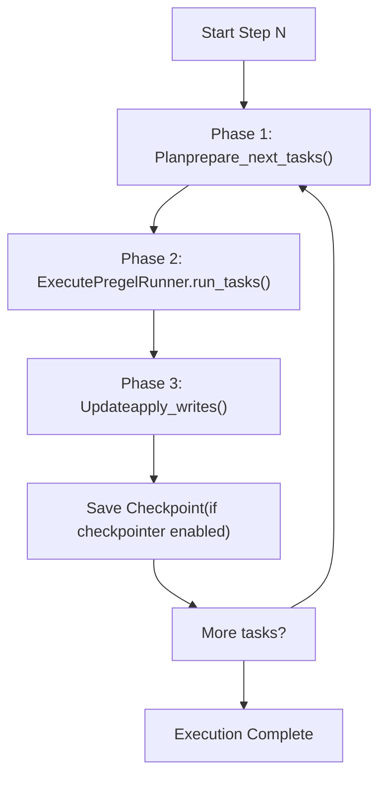
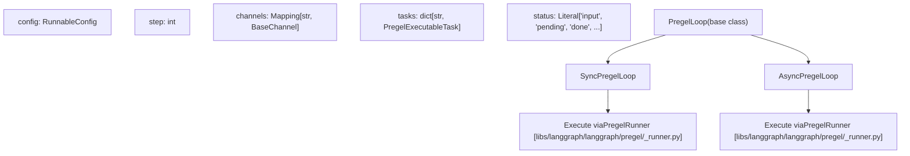
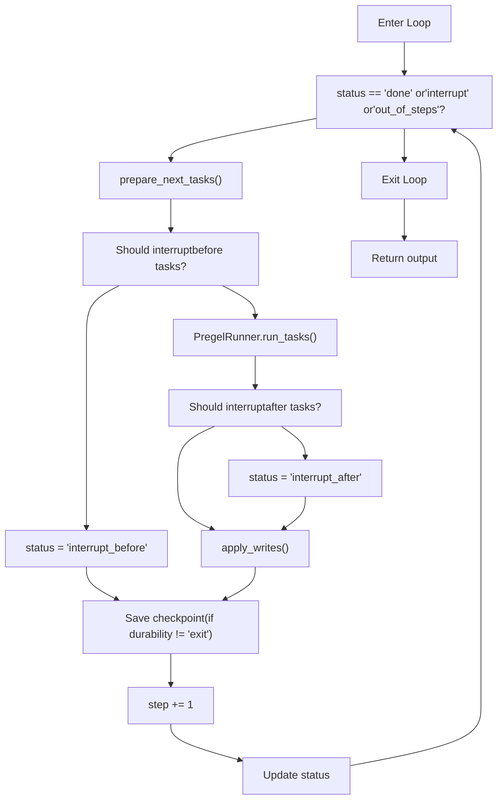
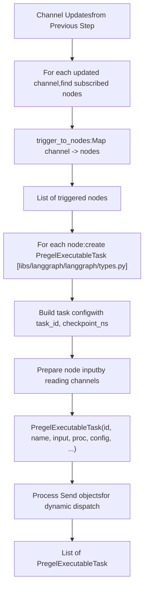
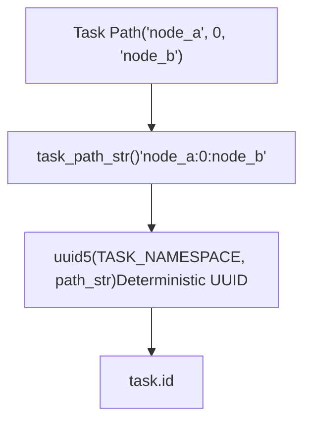
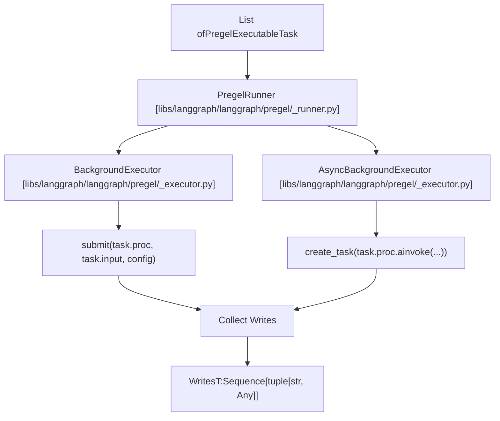
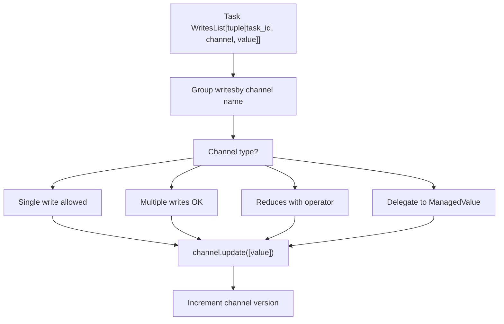

# Pregel Execution Engine

Relevant source files

-   [libs/langgraph/langgraph/\_internal/\_config.py](https://github.com/langchain-ai/langgraph/blob/1fd51e8f/libs/langgraph/langgraph/_internal/_config.py)
-   [libs/langgraph/langgraph/\_internal/\_runnable.py](https://github.com/langchain-ai/langgraph/blob/1fd51e8f/libs/langgraph/langgraph/_internal/_runnable.py)
-   [libs/langgraph/langgraph/\_internal/\_scratchpad.py](https://github.com/langchain-ai/langgraph/blob/1fd51e8f/libs/langgraph/langgraph/_internal/_scratchpad.py)
-   [libs/langgraph/langgraph/constants.py](https://github.com/langchain-ai/langgraph/blob/1fd51e8f/libs/langgraph/langgraph/constants.py)
-   [libs/langgraph/langgraph/errors.py](https://github.com/langchain-ai/langgraph/blob/1fd51e8f/libs/langgraph/langgraph/errors.py)
-   [libs/langgraph/langgraph/func/\_\_init\_\_.py](https://github.com/langchain-ai/langgraph/blob/1fd51e8f/libs/langgraph/langgraph/func/__init__.py)
-   [libs/langgraph/langgraph/graph/state.py](https://github.com/langchain-ai/langgraph/blob/1fd51e8f/libs/langgraph/langgraph/graph/state.py)
-   [libs/langgraph/langgraph/pregel/\_\_init\_\_.py](https://github.com/langchain-ai/langgraph/blob/1fd51e8f/libs/langgraph/langgraph/pregel/__init__.py)
-   [libs/langgraph/langgraph/pregel/\_algo.py](https://github.com/langchain-ai/langgraph/blob/1fd51e8f/libs/langgraph/langgraph/pregel/_algo.py)
-   [libs/langgraph/langgraph/pregel/\_retry.py](https://github.com/langchain-ai/langgraph/blob/1fd51e8f/libs/langgraph/langgraph/pregel/_retry.py)
-   [libs/langgraph/langgraph/pregel/\_runner.py](https://github.com/langchain-ai/langgraph/blob/1fd51e8f/libs/langgraph/langgraph/pregel/_runner.py)
-   [libs/langgraph/langgraph/pregel/debug.py](https://github.com/langchain-ai/langgraph/blob/1fd51e8f/libs/langgraph/langgraph/pregel/debug.py)
-   [libs/langgraph/langgraph/pregel/types.py](https://github.com/langchain-ai/langgraph/blob/1fd51e8f/libs/langgraph/langgraph/pregel/types.py)
-   [libs/langgraph/langgraph/runtime.py](https://github.com/langchain-ai/langgraph/blob/1fd51e8f/libs/langgraph/langgraph/runtime.py)
-   [libs/langgraph/langgraph/types.py](https://github.com/langchain-ai/langgraph/blob/1fd51e8f/libs/langgraph/langgraph/types.py)
-   [libs/langgraph/tests/\_\_snapshots\_\_/test\_large\_cases.ambr](https://github.com/langchain-ai/langgraph/blob/1fd51e8f/libs/langgraph/tests/__snapshots__/test_large_cases.ambr)
-   [libs/langgraph/tests/test\_channels.py](https://github.com/langchain-ai/langgraph/blob/1fd51e8f/libs/langgraph/tests/test_channels.py)
-   [libs/langgraph/tests/test\_checkpoint\_migration.py](https://github.com/langchain-ai/langgraph/blob/1fd51e8f/libs/langgraph/tests/test_checkpoint_migration.py)
-   [libs/langgraph/tests/test\_large\_cases.py](https://github.com/langchain-ai/langgraph/blob/1fd51e8f/libs/langgraph/tests/test_large_cases.py)
-   [libs/langgraph/tests/test\_large\_cases\_async.py](https://github.com/langchain-ai/langgraph/blob/1fd51e8f/libs/langgraph/tests/test_large_cases_async.py)
-   [libs/langgraph/tests/test\_managed\_values.py](https://github.com/langchain-ai/langgraph/blob/1fd51e8f/libs/langgraph/tests/test_managed_values.py)
-   [libs/langgraph/tests/test\_parent\_command.py](https://github.com/langchain-ai/langgraph/blob/1fd51e8f/libs/langgraph/tests/test_parent_command.py)
-   [libs/langgraph/tests/test\_parent\_command\_async.py](https://github.com/langchain-ai/langgraph/blob/1fd51e8f/libs/langgraph/tests/test_parent_command_async.py)
-   [libs/langgraph/tests/test\_pregel.py](https://github.com/langchain-ai/langgraph/blob/1fd51e8f/libs/langgraph/tests/test_pregel.py)
-   [libs/langgraph/tests/test\_pregel\_async.py](https://github.com/langchain-ai/langgraph/blob/1fd51e8f/libs/langgraph/tests/test_pregel_async.py)
-   [libs/langgraph/tests/test\_retry.py](https://github.com/langchain-ai/langgraph/blob/1fd51e8f/libs/langgraph/tests/test_retry.py)
-   [libs/langgraph/tests/test\_runnable.py](https://github.com/langchain-ai/langgraph/blob/1fd51e8f/libs/langgraph/tests/test_runnable.py)

The Pregel execution engine is the core runtime that orchestrates graph execution in LangGraph. It implements a **Bulk Synchronous Parallel (BSP)** model inspired by Google's Pregel algorithm, managing the step-by-step execution of nodes, task scheduling, parallel execution, and state synchronization through channels.

For information about building graphs using the StateGraph API, see [StateGraph API](/langchain-ai/langgraph/3.1-stategraph-api). For information about the functional API, see [Functional API (@task and @entrypoint)](/langchain-ai/langgraph/3.2-functional-api-(@task-and-@entrypoint)). For information about state management and channels, see [State Management and Channels](/langchain-ai/langgraph/3.4-state-management-and-channels).

## Purpose and Scope

This document covers the internal execution mechanics of the Pregel engine:

-   The Bulk Synchronous Parallel execution model
-   The `Pregel` class and `PregelLoop` execution lifecycle
-   Task scheduling and preparation (`prepare_next_tasks`)
-   Parallel task execution via `PregelRunner`
-   Channel updates and state synchronization
-   Integration with checkpointing and durability modes

This does not cover graph construction (see [StateGraph API](/langchain-ai/langgraph/3.1-stategraph-api)), control flow primitives (see [Control Flow Primitives](/langchain-ai/langgraph/3.5-control-flow-primitives)), or interrupt handling (see [Human-in-the-Loop and Interrupts](/langchain-ai/langgraph/3.7-human-in-the-loop-and-interrupts)).

## Execution Model Overview

The Pregel engine follows the **Bulk Synchronous Parallel (BSP)** model, where execution proceeds in discrete steps. Each step consists of three phases:

**Phase 1: Plan** — Determines which nodes to execute by examining channel updates from the previous step. The `prepare_next_tasks` function selects nodes whose trigger channels were updated.

**Phase 2: Execute** — Runs all selected tasks in parallel using `PregelRunner`. Tasks execute concurrently but cannot see each other's writes until the next step.

**Phase 3: Update** — Applies all writes from completed tasks to channels using `apply_writes`. Updates are atomic within a step.

### Pregel Execution Loop Diagram

Sources: [libs/langgraph/langgraph/pregel/main.py336-360](https://github.com/langchain-ai/langgraph/blob/1fd51e8f/libs/langgraph/langgraph/pregel/main.py#L336-L360) [libs/langgraph/langgraph/pregel/\_loop.py142-206](https://github.com/langchain-ai/langgraph/blob/1fd51e8f/libs/langgraph/langgraph/pregel/_loop.py#L142-L206)

## Core Components

### Pregel Class

The `Pregel` class is the main entry point for graph execution. It extends `PregelProtocol` and manages the overall execution lifecycle.

**Pregel System Components**

```mermaid
flowchart TD
    Nodes["nodes: dict[str, PregelNode]"]
    Channels["channels: dict[str, BaseChannel]"]
    Managed["managed: dict[str, ManagedValueSpec]"]
    InputKeys["input_channels: str | Sequence[str]"]
    OutputKeys["output_channels: str | Sequence[str]"]
    StreamKeys["stream_channels: str | Sequence[str]"]
    Invoke["invoke()"]
    Stream["stream()"]
    AInvoke["ainvoke()"]
    AStream["astream()"]
    GetState["get_state()"]
    UpdateState["update_state()"]
    GetHistory["get_state_history()"]
    Loop["SyncPregelLoop [libs/langgraph/langgraph/pregel/_loop.py]"]
    AsyncLoop["AsyncPregelLoop [libs/langgraph/langgraph/pregel/_loop.py]"]
    Checkpointer["BaseCheckpointSaver"]

    Invoke --> Loop
    Stream --> Loop
    AInvoke --> AsyncLoop
    AStream --> AsyncLoop
    GetState --> Checkpointer
    UpdateState --> Checkpointer
    GetHistory --> Checkpointer
```

Key attributes:

-   `nodes` — Map of node names to `PregelNode` instances [libs/langgraph/langgraph/pregel/main.py332-500](https://github.com/langchain-ai/langgraph/blob/1fd51e8f/libs/langgraph/langgraph/pregel/main.py#L332-L500)
-   `channels` — Map of channel names to `BaseChannel` instances [libs/langgraph/langgraph/pregel/main.py332-500](https://github.com/langchain-ai/langgraph/blob/1fd51e8f/libs/langgraph/langgraph/pregel/main.py#L332-L500)
-   `input_channels` / `output_channels` — Define graph input/output schema [libs/langgraph/langgraph/pregel/main.py332-500](https://github.com/langchain-ai/langgraph/blob/1fd51e8f/libs/langgraph/langgraph/pregel/main.py#L332-L500)
-   `stream_channels` — Channels to include in streaming output [libs/langgraph/langgraph/pregel/main.py332-500](https://github.com/langchain-ai/langgraph/blob/1fd51e8f/libs/langgraph/langgraph/pregel/main.py#L332-L500)
-   `checkpointer` — Optional checkpoint saver for persistence [libs/langgraph/langgraph/pregel/main.py332-500](https://github.com/langchain-ai/langgraph/blob/1fd51e8f/libs/langgraph/langgraph/pregel/main.py#L332-L500)
-   `interrupt_before` / `interrupt_after` — Node names for interruption [libs/langgraph/langgraph/pregel/main.py332-500](https://github.com/langchain-ai/langgraph/blob/1fd51e8f/libs/langgraph/langgraph/pregel/main.py#L332-L500)

Sources: [libs/langgraph/langgraph/pregel/main.py332-500](https://github.com/langchain-ai/langgraph/blob/1fd51e8f/libs/langgraph/langgraph/pregel/main.py#L332-L500)

### PregelLoop and Execution Variants

Execution is delegated to either `SyncPregelLoop` or `AsyncPregelLoop` depending on the invocation method.

The `PregelLoop` manages:

-   **Step tracking** — Current step number and maximum steps (`recursion_limit`) [libs/langgraph/langgraph/pregel/\_loop.py142-244](https://github.com/langchain-ai/langgraph/blob/1fd51e8f/libs/langgraph/langgraph/pregel/_loop.py#L142-L244)
-   **Channel state** — Current values in all channels [libs/langgraph/langgraph/pregel/\_loop.py142-244](https://github.com/langchain-ai/langgraph/blob/1fd51e8f/libs/langgraph/langgraph/pregel/_loop.py#L142-L244)
-   **Task queue** — Tasks scheduled for the current step [libs/langgraph/langgraph/pregel/\_loop.py142-244](https://github.com/langchain-ai/langgraph/blob/1fd51e8f/libs/langgraph/langgraph/pregel/_loop.py#L142-L244)
-   **Status** — Execution state (input, pending, done, interrupt, etc.) [libs/langgraph/langgraph/pregel/\_loop.py142-244](https://github.com/langchain-ai/langgraph/blob/1fd51e8f/libs/langgraph/langgraph/pregel/_loop.py#L142-L244)
-   **Checkpointing** — Loading/saving checkpoints between steps [libs/langgraph/langgraph/pregel/\_loop.py142-244](https://github.com/langchain-ai/langgraph/blob/1fd51e8f/libs/langgraph/langgraph/pregel/_loop.py#L142-L244)

Sources: [libs/langgraph/langgraph/pregel/\_loop.py142-244](https://github.com/langchain-ai/langgraph/blob/1fd51e8f/libs/langgraph/langgraph/pregel/_loop.py#L142-L244) [libs/langgraph/langgraph/pregel/\_loop.py697-894](https://github.com/langchain-ai/langgraph/blob/1fd51e8f/libs/langgraph/langgraph/pregel/_loop.py#L697-L894) [libs/langgraph/langgraph/pregel/\_loop.py897-1113](https://github.com/langchain-ai/langgraph/blob/1fd51e8f/libs/langgraph/langgraph/pregel/_loop.py#L897-L1113)

## Execution Lifecycle

### Initialization and Context Entry

When `invoke()` or `ainvoke()` is called, a `PregelLoop` instance is created and entered as a context manager:

During initialization:

1.  Load existing checkpoint (if available) via `checkpointer.get_tuple()` [libs/langgraph/langgraph/pregel/\_loop.py245-394](https://github.com/langchain-ai/langgraph/blob/1fd51e8f/libs/langgraph/langgraph/pregel/_loop.py#L245-L394)
2.  Restore channel state using `channels_from_checkpoint()` [libs/langgraph/langgraph/pregel/\_loop.py245-394](https://github.com/langchain-ai/langgraph/blob/1fd51e8f/libs/langgraph/langgraph/pregel/_loop.py#L245-L394)
3.  Apply input values to input channels via `map_input()` [libs/langgraph/langgraph/pregel/\_loop.py245-394](https://github.com/langchain-ai/langgraph/blob/1fd51e8f/libs/langgraph/langgraph/pregel/_loop.py#L245-L394)
4.  Initialize `step = 0` and `status = "input"` [libs/langgraph/langgraph/pregel/\_loop.py245-394](https://github.com/langchain-ai/langgraph/blob/1fd51e8f/libs/langgraph/langgraph/pregel/_loop.py#L245-L394)

Sources: [libs/langgraph/langgraph/pregel/\_loop.py245-394](https://github.com/langchain-ai/langgraph/blob/1fd51e8f/libs/langgraph/langgraph/pregel/_loop.py#L245-L394) [libs/langgraph/langgraph/pregel/\_checkpoint.py120-156](https://github.com/langchain-ai/langgraph/blob/1fd51e8f/libs/langgraph/langgraph/pregel/_checkpoint.py#L120-L156)

### Step Execution Loop

The main execution loop runs until completion, interruption, or step limit:

Sources: [libs/langgraph/langgraph/pregel/\_loop.py697-894](https://github.com/langchain-ai/langgraph/blob/1fd51e8f/libs/langgraph/langgraph/pregel/_loop.py#L697-L894) [libs/langgraph/langgraph/pregel/\_loop.py897-1113](https://github.com/langchain-ai/langgraph/blob/1fd51e8f/libs/langgraph/langgraph/pregel/_loop.py#L897-L1113)

## Task Preparation and Scheduling

### prepare\_next\_tasks Function

The `prepare_next_tasks` function determines which nodes to execute in the current step. It examines channel updates and node subscriptions to build a list of `PregelExecutableTask` objects.

Key steps:

1.  **Identify triggers** — Find which channels were updated in the previous step [libs/langgraph/langgraph/pregel/\_algo.py442-698](https://github.com/langchain-ai/langgraph/blob/1fd51e8f/libs/langgraph/langgraph/pregel/_algo.py#L442-L698)
2.  **Map to nodes** — Use `trigger_to_nodes` mapping to find subscribed nodes [libs/langgraph/langgraph/pregel/\_algo.py442-698](https://github.com/langchain-ai/langgraph/blob/1fd51e8f/libs/langgraph/langgraph/pregel/_algo.py#L442-L698)
3.  **Create tasks** — Build `PregelExecutableTask` for each triggered node [libs/langgraph/langgraph/pregel/\_algo.py442-698](https://github.com/langchain-ai/langgraph/blob/1fd51e8f/libs/langgraph/langgraph/pregel/_algo.py#L442-L698)
4.  **Prepare input** — Read channel values to construct node input [libs/langgraph/langgraph/pregel/\_algo.py442-698](https://github.com/langchain-ai/langgraph/blob/1fd51e8f/libs/langgraph/langgraph/pregel/_algo.py#L442-L698)
5.  **Handle Send** — Process dynamic `Send` objects for conditional branching [libs/langgraph/langgraph/pregel/\_algo.py442-698](https://github.com/langchain-ai/langgraph/blob/1fd51e8f/libs/langgraph/langgraph/pregel/_algo.py#L442-L698)

**PregelExecutableTask Structure:**

| Field | Type | Description |
| --- | --- | --- |
| `id` | `str` | Unique task identifier (UUIDv5 based on path) |
| `name` | `str` | Node name |
| `path` | `tuple` | Task path for nested graphs |
| `input` | `Any` | Input data for the node |
| `proc` | `Runnable` | The actual node to execute |
| `writes` | `deque` | Queue to collect writes |
| `config` | `RunnableConfig` | Configuration with task context |
| `triggers` | `Sequence[str]` | Channels that triggered this task |
| `retry_policy` | `Sequence[RetryPolicy]` | Retry configuration |
| `cache_key` | \`CacheKey | None\` |

Sources: [libs/langgraph/langgraph/pregel/\_algo.py442-698](https://github.com/langchain-ai/langgraph/blob/1fd51e8f/libs/langgraph/langgraph/pregel/_algo.py#L442-L698) [libs/langgraph/langgraph/types.py537-551](https://github.com/langchain-ai/langgraph/blob/1fd51e8f/libs/langgraph/langgraph/types.py#L537-L551)

### Task Path and ID Generation

Each task is assigned a unique ID based on its execution path. This enables tracking and resumption across checkpoints.

The path represents the call stack:

-   Root graph tasks: `('node_name',)` [libs/langgraph/langgraph/pregel/\_algo.py84-93](https://github.com/langchain-ai/langgraph/blob/1fd51e8f/libs/langgraph/langgraph/pregel/_algo.py#L84-L93)
-   Subgraph tasks: `('parent_node', task_index, 'child_node')` [libs/langgraph/langgraph/pregel/\_algo.py84-93](https://github.com/langchain-ai/langgraph/blob/1fd51e8f/libs/langgraph/langgraph/pregel/_algo.py#L84-L93)
-   Nested subgraphs: `('root', 0, 'sub1', 1, 'sub2')` [libs/langgraph/langgraph/pregel/\_algo.py84-93](https://github.com/langchain-ai/langgraph/blob/1fd51e8f/libs/langgraph/langgraph/pregel/_algo.py#L84-L93)

Sources: [libs/langgraph/langgraph/pregel/\_algo.py84-93](https://github.com/langchain-ai/langgraph/blob/1fd51e8f/libs/langgraph/langgraph/pregel/_algo.py#L84-L93) [libs/langgraph/langgraph/pregel/debug.py34](https://github.com/langchain-ai/langgraph/blob/1fd51e8f/libs/langgraph/langgraph/pregel/debug.py#L34-L34)

## Parallel Execution

### PregelRunner

The `PregelRunner` executes tasks in parallel using either a thread pool (`BackgroundExecutor`) or async concurrency (`AsyncBackgroundExecutor`).

**Execution Flow:**

1.  **Submit tasks** — All tasks are submitted to the executor simultaneously [libs/langgraph/langgraph/pregel/\_runner.py1-150](https://github.com/langchain-ai/langgraph/blob/1fd51e8f/libs/langgraph/langgraph/pregel/_runner.py#L1-L150)
2.  **Parallel execution** — Tasks run concurrently (threads or async) [libs/langgraph/langgraph/pregel/\_runner.py1-150](https://github.com/langchain-ai/langgraph/blob/1fd51e8f/libs/langgraph/langgraph/pregel/_runner.py#L1-L150)
3.  **Wait for completion** — Block until all tasks complete or one fails [libs/langgraph/langgraph/pregel/\_runner.py1-150](https://github.com/langchain-ai/langgraph/blob/1fd51e8f/libs/langgraph/langgraph/pregel/_runner.py#L1-L150)
4.  **Collect writes** — Gather channel writes from each task's write queue [libs/langgraph/langgraph/pregel/\_runner.py1-150](https://github.com/langchain-ai/langgraph/blob/1fd51e8f/libs/langgraph/langgraph/pregel/_runner.py#L1-L150)
5.  **Handle errors** — Tasks with errors produce `ERROR` writes [libs/langgraph/langgraph/pregel/\_runner.py1-150](https://github.com/langchain-ai/langgraph/blob/1fd51e8f/libs/langgraph/langgraph/pregel/_runner.py#L1-L150)

**Retry Logic:** Tasks with `retry_policy` automatically retry on matching exceptions using exponential backoff with jitter [libs/langgraph/langgraph/pregel/\_retry.py1-100](https://github.com/langchain-ai/langgraph/blob/1fd51e8f/libs/langgraph/langgraph/pregel/_retry.py#L1-L100)

Sources: [libs/langgraph/langgraph/pregel/\_runner.py1-150](https://github.com/langchain-ai/langgraph/blob/1fd51e8f/libs/langgraph/langgraph/pregel/_runner.py#L1-L150) [libs/langgraph/langgraph/pregel/\_executor.py1-200](https://github.com/langchain-ai/langgraph/blob/1fd51e8f/libs/langgraph/langgraph/pregel/_executor.py#L1-L200)

### Write Collection

During execution, nodes produce writes through the injected write function:

> **[Mermaid sequence]**
> *(图表结构无法解析)*

Reserved write keys:

-   `__input__` (`INPUT`) — Input to the graph [libs/langgraph/langgraph/\_internal/\_constants.py1-77](https://github.com/langchain-ai/langgraph/blob/1fd51e8f/libs/langgraph/langgraph/_internal/_constants.py#L1-L77)
-   `__interrupt__` (`INTERRUPT`) — Dynamic interrupts [libs/langgraph/langgraph/\_internal/\_constants.py1-77](https://github.com/langchain-ai/langgraph/blob/1fd51e8f/libs/langgraph/langgraph/_internal/_constants.py#L1-L77)
-   `__error__` (`ERROR`) — Task errors [libs/langgraph/langgraph/\_internal/\_constants.py1-77](https://github.com/langchain-ai/langgraph/blob/1fd51e8f/libs/langgraph/langgraph/_internal/_constants.py#L1-L77)
-   `__return__` (`RETURN`) — Explicit return values [libs/langgraph/langgraph/\_internal/\_constants.py1-77](https://github.com/langchain-ai/langgraph/blob/1fd51e8f/libs/langgraph/langgraph/_internal/_constants.py#L1-L77)
-   `__pregel_tasks` (`TASKS`) — Send objects for dynamic branching [libs/langgraph/langgraph/\_internal/\_constants.py1-77](https://github.com/langchain-ai/langgraph/blob/1fd51e8f/libs/langgraph/langgraph/_internal/_constants.py#L1-L77)

Sources: [libs/langgraph/langgraph/\_internal/\_constants.py1-77](https://github.com/langchain-ai/langgraph/blob/1fd51e8f/libs/langgraph/langgraph/_internal/_constants.py#L1-L77) [libs/langgraph/langgraph/pregel/\_write.py1-200](https://github.com/langchain-ai/langgraph/blob/1fd51e8f/libs/langgraph/langgraph/pregel/_write.py#L1-L200)

## State Updates and Channel Synchronization

### apply\_writes Function

After all tasks complete, `apply_writes` applies their writes to channels atomically:

**Write Application Rules:**

1.  **LastValue channels** — Only one write per channel per step [libs/langgraph/langgraph/channels/last\_value.py1-100](https://github.com/langchain-ai/langgraph/blob/1fd51e8f/libs/langgraph/langgraph/channels/last_value.py#L1-L100)
2.  **Topic channels** — Accumulates all writes into a sequence [libs/langgraph/langgraph/channels/topic.py1-100](https://github.com/langchain-ai/langgraph/blob/1fd51e8f/libs/langgraph/langgraph/channels/topic.py#L1-L100)
3.  **BinaryOperatorAggregate** — Reduces multiple writes using the configured operator [libs/langgraph/langgraph/channels/binop.py1-100](https://github.com/langchain-ai/langgraph/blob/1fd51e8f/libs/langgraph/langgraph/channels/binop.py#L1-L100)

Sources: [libs/langgraph/langgraph/pregel/\_algo.py324-440](https://github.com/langchain-ai/langgraph/blob/1fd51e8f/libs/langgraph/langgraph/pregel/_algo.py#L324-L440) [libs/langgraph/langgraph/channels/last\_value.py1-100](https://github.com/langchain-ai/langgraph/blob/1fd51e8f/libs/langgraph/langgraph/channels/last_value.py#L1-L100) [libs/langgraph/langgraph/channels/binop.py1-100](https://github.com/langchain-ai/langgraph/blob/1fd51e8f/libs/langgraph/langgraph/channels/binop.py#L1-L100)

### Checkpoint Saving

After writes are applied, a checkpoint is saved based on the `Durability` mode [libs/langgraph/langgraph/types.py85-91](https://github.com/langchain-ai/langgraph/blob/1fd51e8f/libs/langgraph/langgraph/types.py#L85-L91):

| Mode | Behavior | Use Case |
| --- | --- | --- |
| `sync` | Save full checkpoint after each step | Maximum safety, slower |
| `async` | Save writes asynchronously, checkpoint on completion | Balance safety/speed |
| `exit` | Save checkpoint only when graph exits | Maximum speed, less safety |

Sources: [libs/langgraph/langgraph/pregel/\_loop.py395-550](https://github.com/langchain-ai/langgraph/blob/1fd51e8f/libs/langgraph/langgraph/pregel/_loop.py#L395-L550) [libs/langgraph/langgraph/pregel/\_checkpoint.py1-156](https://github.com/langchain-ai/langgraph/blob/1fd51e8f/libs/langgraph/langgraph/pregel/_checkpoint.py#L1-L156) [libs/langgraph/langgraph/types.py85-91](https://github.com/langchain-ai/langgraph/blob/1fd51e8f/libs/langgraph/langgraph/types.py#L85-L91)

## Integration Points

### Interrupts and Human-in-the-Loop

The Pregel loop checks for interrupts before and after task execution [libs/langgraph/langgraph/pregel/\_loop.py750-850](https://github.com/langchain-ai/langgraph/blob/1fd51e8f/libs/langgraph/langgraph/pregel/_loop.py#L750-L850) When an interrupt occurs, execution pauses and the current state is saved via the checkpointer.

Sources: [libs/langgraph/langgraph/pregel/\_loop.py750-850](https://github.com/langchain-ai/langgraph/blob/1fd51e8f/libs/langgraph/langgraph/pregel/_loop.py#L750-L850) [libs/langgraph/langgraph/pregel/\_algo.py223-267](https://github.com/langchain-ai/langgraph/blob/1fd51e8f/libs/langgraph/langgraph/pregel/_algo.py#L223-L267)

### Subgraphs

When a node is a compiled graph (subgraph), the Pregel engine creates nested `checkpoint_ns` (e.g., `parent_node:0:child_node`) and passes the checkpointer to the child graph [libs/langgraph/langgraph/pregel/\_loop.py550-650](https://github.com/langchain-ai/langgraph/blob/1fd51e8f/libs/langgraph/langgraph/pregel/_loop.py#L550-L650)

Sources: [libs/langgraph/langgraph/pregel/\_loop.py550-650](https://github.com/langchain-ai/langgraph/blob/1fd51e8f/libs/langgraph/langgraph/pregel/_loop.py#L550-L650) [libs/langgraph/langgraph/\_internal/\_constants.py36-59](https://github.com/langchain-ai/langgraph/blob/1fd51e8f/libs/langgraph/langgraph/_internal/_constants.py#L36-L59)

### Streaming

The Pregel loop supports multiple streaming modes (`values`, `updates`, `tasks`, `checkpoints`, `debug`, `messages`, `custom`) by emitting events through the `StreamProtocol` [libs/langgraph/langgraph/types.py118-353](https://github.com/langchain-ai/langgraph/blob/1fd51e8f/libs/langgraph/langgraph/types.py#L118-L353)

Sources: [libs/langgraph/langgraph/pregel/\_loop.py650-750](https://github.com/langchain-ai/langgraph/blob/1fd51e8f/libs/langgraph/langgraph/pregel/_loop.py#L650-L750) [libs/langgraph/langgraph/types.py118-353](https://github.com/langchain-ai/langgraph/blob/1fd51e8f/libs/langgraph/langgraph/types.py#L118-L353)

## Configuration and Customization

### Runtime Configuration

Execution behavior is controlled through `RunnableConfig` keys such as `recursion_limit` and `configurable.thread_id` [libs/langgraph/langgraph/pregel/\_loop.py209-244](https://github.com/langchain-ai/langgraph/blob/1fd51e8f/libs/langgraph/langgraph/pregel/_loop.py#L209-L244)

### Node Configuration

Individual nodes are wrapped in `PregelNode` which defines their `channels`, `triggers`, and `retry_policy` [libs/langgraph/langgraph/pregel/main.py168-330](https://github.com/langchain-ai/langgraph/blob/1fd51e8f/libs/langgraph/langgraph/pregel/main.py#L168-L330)

Sources: [libs/langgraph/langgraph/pregel/main.py1-1500](https://github.com/langchain-ai/langgraph/blob/1fd51e8f/libs/langgraph/langgraph/pregel/main.py#L1-L1500) [libs/langgraph/langgraph/pregel/\_loop.py1-1113](https://github.com/langchain-ai/langgraph/blob/1fd51e8f/libs/langgraph/langgraph/pregel/_loop.py#L1-L1113) [libs/langgraph/langgraph/pregel/\_algo.py1-700](https://github.com/langchain-ai/langgraph/blob/1fd51e8f/libs/langgraph/langgraph/pregel/_algo.py#L1-L700)
