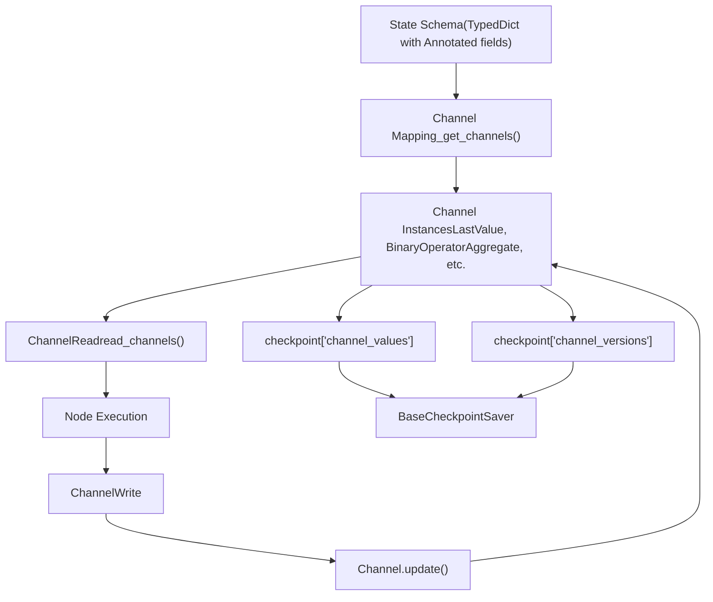
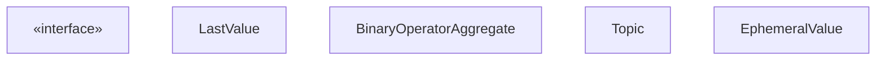
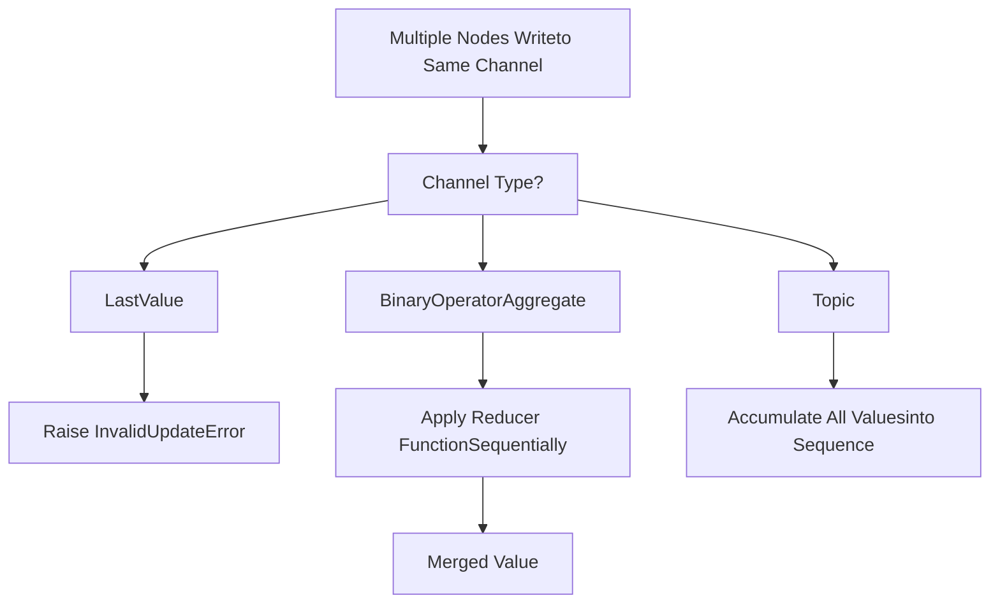

# State Management and Channels

Relevant source files

-   [libs/langgraph/langgraph/channels/\_\_init\_\_.py](https://github.com/langchain-ai/langgraph/blob/1fd51e8f/libs/langgraph/langgraph/channels/__init__.py)
-   [libs/langgraph/langgraph/channels/any\_value.py](https://github.com/langchain-ai/langgraph/blob/1fd51e8f/libs/langgraph/langgraph/channels/any_value.py)
-   [libs/langgraph/langgraph/channels/base.py](https://github.com/langchain-ai/langgraph/blob/1fd51e8f/libs/langgraph/langgraph/channels/base.py)
-   [libs/langgraph/langgraph/channels/binop.py](https://github.com/langchain-ai/langgraph/blob/1fd51e8f/libs/langgraph/langgraph/channels/binop.py)
-   [libs/langgraph/langgraph/channels/ephemeral\_value.py](https://github.com/langchain-ai/langgraph/blob/1fd51e8f/libs/langgraph/langgraph/channels/ephemeral_value.py)
-   [libs/langgraph/langgraph/channels/last\_value.py](https://github.com/langchain-ai/langgraph/blob/1fd51e8f/libs/langgraph/langgraph/channels/last_value.py)
-   [libs/langgraph/langgraph/channels/named\_barrier\_value.py](https://github.com/langchain-ai/langgraph/blob/1fd51e8f/libs/langgraph/langgraph/channels/named_barrier_value.py)
-   [libs/langgraph/langgraph/channels/topic.py](https://github.com/langchain-ai/langgraph/blob/1fd51e8f/libs/langgraph/langgraph/channels/topic.py)
-   [libs/langgraph/langgraph/channels/untracked\_value.py](https://github.com/langchain-ai/langgraph/blob/1fd51e8f/libs/langgraph/langgraph/channels/untracked_value.py)
-   [libs/langgraph/langgraph/constants.py](https://github.com/langchain-ai/langgraph/blob/1fd51e8f/libs/langgraph/langgraph/constants.py)
-   [libs/langgraph/langgraph/errors.py](https://github.com/langchain-ai/langgraph/blob/1fd51e8f/libs/langgraph/langgraph/errors.py)
-   [libs/langgraph/langgraph/func/\_\_init\_\_.py](https://github.com/langchain-ai/langgraph/blob/1fd51e8f/libs/langgraph/langgraph/func/__init__.py)
-   [libs/langgraph/langgraph/graph/state.py](https://github.com/langchain-ai/langgraph/blob/1fd51e8f/libs/langgraph/langgraph/graph/state.py)
-   [libs/langgraph/langgraph/pregel/\_\_init\_\_.py](https://github.com/langchain-ai/langgraph/blob/1fd51e8f/libs/langgraph/langgraph/pregel/__init__.py)
-   [libs/langgraph/langgraph/pregel/debug.py](https://github.com/langchain-ai/langgraph/blob/1fd51e8f/libs/langgraph/langgraph/pregel/debug.py)
-   [libs/langgraph/langgraph/pregel/types.py](https://github.com/langchain-ai/langgraph/blob/1fd51e8f/libs/langgraph/langgraph/pregel/types.py)
-   [libs/langgraph/langgraph/types.py](https://github.com/langchain-ai/langgraph/blob/1fd51e8f/libs/langgraph/langgraph/types.py)
-   [libs/langgraph/tests/\_\_snapshots\_\_/test\_large\_cases.ambr](https://github.com/langchain-ai/langgraph/blob/1fd51e8f/libs/langgraph/tests/__snapshots__/test_large_cases.ambr)
-   [libs/langgraph/tests/agents.py](https://github.com/langchain-ai/langgraph/blob/1fd51e8f/libs/langgraph/tests/agents.py)
-   [libs/langgraph/tests/test\_checkpoint\_migration.py](https://github.com/langchain-ai/langgraph/blob/1fd51e8f/libs/langgraph/tests/test_checkpoint_migration.py)
-   [libs/langgraph/tests/test\_large\_cases.py](https://github.com/langchain-ai/langgraph/blob/1fd51e8f/libs/langgraph/tests/test_large_cases.py)
-   [libs/langgraph/tests/test\_large\_cases\_async.py](https://github.com/langchain-ai/langgraph/blob/1fd51e8f/libs/langgraph/tests/test_large_cases_async.py)
-   [libs/langgraph/tests/test\_pregel.py](https://github.com/langchain-ai/langgraph/blob/1fd51e8f/libs/langgraph/tests/test_pregel.py)
-   [libs/langgraph/tests/test\_pregel\_async.py](https://github.com/langchain-ai/langgraph/blob/1fd51e8f/libs/langgraph/tests/test_pregel_async.py)
-   [libs/langgraph/tests/test\_pydantic.py](https://github.com/langchain-ai/langgraph/blob/1fd51e8f/libs/langgraph/tests/test_pydantic.py)
-   [libs/langgraph/tests/test\_state.py](https://github.com/langchain-ai/langgraph/blob/1fd51e8f/libs/langgraph/tests/test_state.py)
-   [libs/langgraph/tests/test\_utils.py](https://github.com/langchain-ai/langgraph/blob/1fd51e8f/libs/langgraph/tests/test_utils.py)

## Purpose and Scope

This document describes LangGraph's channel system, which provides the core state management primitives for graphs. Channels control how state flows between nodes, how concurrent updates are resolved, and how state persists across graph executions.

For information about the StateGraph API that uses channels, see [StateGraph API](/langchain-ai/langgraph/3.1-stategraph-api). For information about checkpointing and state persistence, see [Checkpointing Architecture](/langchain-ai/langgraph/4.1-checkpointing-architecture). For control flow primitives that interact with state, see [Control Flow Primitives](/langchain-ai/langgraph/3.5-control-flow-primitives).

## Channel System Overview

Channels are the fundamental abstraction for state management in LangGraph. Each key in a graph's state schema maps to a channel that governs how that key's value is read, updated, and persisted.

### Channels in the Execution Architecture

The diagram below illustrates how state defined in a schema is transformed into runtime `BaseChannel` instances and managed by the `Pregel` loop.


**Sources:** [libs/langgraph/langgraph/graph/state.py186-191](https://github.com/langchain-ai/langgraph/blob/1fd51e8f/libs/langgraph/langgraph/graph/state.py#L186-L191) [libs/langgraph/langgraph/pregel/debug.py24](https://github.com/langchain-ai/langgraph/blob/1fd51e8f/libs/langgraph/langgraph/pregel/debug.py#L24-L24) [libs/langgraph/langgraph/pregel/\_read.py1-200](https://github.com/langchain-ai/langgraph/blob/1fd51e8f/libs/langgraph/langgraph/pregel/_read.py#L1-L200) [libs/langgraph/langgraph/pregel/\_write.py1-200](https://github.com/langchain-ai/langgraph/blob/1fd51e8f/libs/langgraph/langgraph/pregel/_write.py#L1-L200)

### Channel Interface

All channels implement the `BaseChannel` interface, which defines the lifecycle of state within a single superstep and across checkpoints.

-   **`update(values)`**: Applies one or more updates to the channel [libs/langgraph/langgraph/channels/base.py1-50](https://github.com/langchain-ai/langgraph/blob/1fd51e8f/libs/langgraph/langgraph/channels/base.py#L1-L50)
-   **`get()`**: Retrieves the current channel value [libs/langgraph/langgraph/channels/base.py1-50](https://github.com/langchain-ai/langgraph/blob/1fd51e8f/libs/langgraph/langgraph/channels/base.py#L1-L50)
-   **`checkpoint()`**: Returns a serializable representation for persistence [libs/langgraph/langgraph/channels/base.py1-50](https://github.com/langchain-ai/langgraph/blob/1fd51e8f/libs/langgraph/langgraph/channels/base.py#L1-L50)
-   **`from_checkpoint(checkpoint)`**: Restores channel from a checkpoint [libs/langgraph/langgraph/channels/base.py1-50](https://github.com/langchain-ai/langgraph/blob/1fd51e8f/libs/langgraph/langgraph/channels/base.py#L1-L50)


**Sources:** [libs/langgraph/langgraph/channels/base.py1-50](https://github.com/langchain-ai/langgraph/blob/1fd51e8f/libs/langgraph/langgraph/channels/base.py#L1-L50) [libs/langgraph/langgraph/channels/last\_value.py1-100](https://github.com/langchain-ai/langgraph/blob/1fd51e8f/libs/langgraph/langgraph/channels/last_value.py#L1-L100) [libs/langgraph/langgraph/channels/binop.py1-150](https://github.com/langchain-ai/langgraph/blob/1fd51e8f/libs/langgraph/langgraph/channels/binop.py#L1-L150) [libs/langgraph/langgraph/channels/topic.py1-100](https://github.com/langchain-ai/langgraph/blob/1fd51e8f/libs/langgraph/langgraph/channels/topic.py#L1-L100) [libs/langgraph/langgraph/channels/ephemeral\_value.py1-80](https://github.com/langchain-ai/langgraph/blob/1fd51e8f/libs/langgraph/langgraph/channels/ephemeral_value.py#L1-L80)

## State Schema to Channel Mapping

`StateGraph` automatically converts state schemas into channels during the compilation process. It analyzes type hints to determine which channel type to use for each field [libs/langgraph/langgraph/graph/state.py1060-1130](https://github.com/langchain-ai/langgraph/blob/1fd51e8f/libs/langgraph/langgraph/graph/state.py#L1060-L1130)

### Mapping Rules

| State Schema Type | Channel Type | Behavior |
| --- | --- | --- |
| `str`, `int`, `SomeClass` | `LastValue` | Replaces value on each update. |
| `Annotated[T, reducer]` | `BinaryOperatorAggregate` | Applies reducer function to merge updates. |
| `list` without annotation | `LastValue` | Replaces entire list. |
| `Annotated[list, operator.add]` | `BinaryOperatorAggregate` | Appends to list. |
| `Annotated[dict, operator.or_]` | `BinaryOperatorAggregate` | Merges dictionaries. |

### Example: Schema to Channel Conversion

```
# State schema definitionclass State(TypedDict):    name: str                                    # → LastValue(str)    age: int                                     # → LastValue(int)    messages: Annotated[list, operator.add]      # → BinaryOperatorAggregate(list, operator.add)    metadata: Annotated[dict, operator.or_]      # → BinaryOperatorAggregate(dict, operator.or_)
```
This conversion logic resides in `_get_channels()` and `get_type_hints()` [libs/langgraph/langgraph/graph/state.py23](https://github.com/langchain-ai/langgraph/blob/1fd51e8f/libs/langgraph/langgraph/graph/state.py#L23-L23) [libs/langgraph/langgraph/graph/state.py1060-1130](https://github.com/langchain-ai/langgraph/blob/1fd51e8f/libs/langgraph/langgraph/graph/state.py#L1060-L1130)

**Sources:** [libs/langgraph/langgraph/graph/state.py1060-1130](https://github.com/langchain-ai/langgraph/blob/1fd51e8f/libs/langgraph/langgraph/graph/state.py#L1060-L1130) [libs/langgraph/tests/test\_pregel.py86-106](https://github.com/langchain-ai/langgraph/blob/1fd51e8f/libs/langgraph/tests/test_pregel.py#L86-L106) [libs/langgraph/tests/test\_state.py138-163](https://github.com/langchain-ai/langgraph/blob/1fd51e8f/libs/langgraph/tests/test_state.py#L138-L163)

## Channel Types

### LastValue

`LastValue` stores a single value and replaces it completely on each update [libs/langgraph/langgraph/channels/last\_value.py1-100](https://github.com/langchain-ai/langgraph/blob/1fd51e8f/libs/langgraph/langgraph/channels/last_value.py#L1-L100) It raises `InvalidUpdateError` if multiple nodes attempt to write to the same `LastValue` channel in a single step [libs/langgraph/tests/test\_pregel.py119-121](https://github.com/langchain-ai/langgraph/blob/1fd51e8f/libs/langgraph/tests/test_pregel.py#L119-L121)

**Sources:** [libs/langgraph/langgraph/channels/last\_value.py1-100](https://github.com/langchain-ai/langgraph/blob/1fd51e8f/libs/langgraph/langgraph/channels/last_value.py#L1-L100) [libs/langgraph/tests/test\_pregel.py725-755](https://github.com/langchain-ai/langgraph/blob/1fd51e8f/libs/langgraph/tests/test_pregel.py#L725-L755)

### BinaryOperatorAggregate (Reducers)

`BinaryOperatorAggregate` applies a reducer function to merge multiple updates. This is the primary mechanism for handling concurrent writes to the same channel [libs/langgraph/langgraph/channels/binop.py1-150](https://github.com/langchain-ai/langgraph/blob/1fd51e8f/libs/langgraph/langgraph/channels/binop.py#L1-L150)

Common reducers include `operator.add` for list concatenation and `add_messages` for message history management [libs/langgraph/langgraph/graph/message.py52](https://github.com/langchain-ai/langgraph/blob/1fd51e8f/libs/langgraph/langgraph/graph/message.py#L52-L52)

**Sources:** [libs/langgraph/langgraph/graph/state.py99-105](https://github.com/langchain-ai/langgraph/blob/1fd51e8f/libs/langgraph/langgraph/graph/state.py#L99-L105) [libs/langgraph/langgraph/channels/binop.py1-150](https://github.com/langchain-ai/langgraph/blob/1fd51e8f/libs/langgraph/langgraph/channels/binop.py#L1-L150) [libs/langgraph/tests/test\_pregel.py556-567](https://github.com/langchain-ai/langgraph/blob/1fd51e8f/libs/langgraph/tests/test_pregel.py#L556-L567)

### Topic

`Topic` accumulates values into a sequence without applying a reducer. Unlike `BinaryOperatorAggregate`, it stores each update as a separate item in a list [libs/langgraph/langgraph/channels/topic.py1-100](https://github.com/langchain-ai/langgraph/blob/1fd51e8f/libs/langgraph/langgraph/channels/topic.py#L1-L100)

**Sources:** [libs/langgraph/langgraph/channels/topic.py1-100](https://github.com/langchain-ai/langgraph/blob/1fd51e8f/libs/langgraph/langgraph/channels/topic.py#L1-L100) [libs/langgraph/tests/test\_pregel.py758-775](https://github.com/langchain-ai/langgraph/blob/1fd51e8f/libs/langgraph/tests/test_pregel.py#L758-L775)

### EphemeralValue

`EphemeralValue` creates step-scoped values that are cleared after each superstep. These values are not persisted in checkpoints [libs/langgraph/langgraph/channels/ephemeral\_value.py1-80](https://github.com/langchain-ai/langgraph/blob/1fd51e8f/libs/langgraph/langgraph/channels/ephemeral_value.py#L1-L80)

**Sources:** [libs/langgraph/langgraph/channels/ephemeral\_value.py1-80](https://github.com/langchain-ai/langgraph/blob/1fd51e8f/libs/langgraph/langgraph/channels/ephemeral_value.py#L1-L80) [libs/langgraph/tests/test\_pregel.py212-234](https://github.com/langchain-ai/langgraph/blob/1fd51e8f/libs/langgraph/tests/test_pregel.py#L212-L234)

### UntrackedValue

`UntrackedValue` stores values that are not saved to checkpoints. The channel persists during a single execution session but does not survive checkpoint restoration [libs/langgraph/langgraph/channels/untracked\_value.py1-80](https://github.com/langchain-ai/langgraph/blob/1fd51e8f/libs/langgraph/langgraph/channels/untracked_value.py#L1-L80)

**Sources:** [libs/langgraph/langgraph/channels/untracked\_value.py1-80](https://github.com/langchain-ai/langgraph/blob/1fd51e8f/libs/langgraph/langgraph/channels/untracked_value.py#L1-L80) [libs/langgraph/tests/test\_large\_cases.py22](https://github.com/langchain-ai/langgraph/blob/1fd51e8f/libs/langgraph/tests/test_large_cases.py#L22-L22)

### NamedBarrierValue

`NamedBarrierValue` coordinates synchronization points for waiting edges. It ensures that certain nodes wait for specific other nodes to complete before executing [libs/langgraph/langgraph/channels/named\_barrier\_value.py1-120](https://github.com/langchain-ai/langgraph/blob/1fd51e8f/libs/langgraph/langgraph/channels/named_barrier_value.py#L1-L120)

**Sources:** [libs/langgraph/langgraph/channels/named\_barrier\_value.py1-120](https://github.com/langchain-ai/langgraph/blob/1fd51e8f/libs/langgraph/langgraph/channels/named_barrier_value.py#L1-L120) [libs/langgraph/tests/test\_pregel.py1847-1932](https://github.com/langchain-ai/langgraph/blob/1fd51e8f/libs/langgraph/tests/test_pregel.py#L1847-L1932)

## Concurrent Updates and Reducers

Channels handle concurrent updates differently based on their type:


**Sources:** [libs/langgraph/langgraph/channels/last\_value.py1-100](https://github.com/langchain-ai/langgraph/blob/1fd51e8f/libs/langgraph/langgraph/channels/last_value.py#L1-L100) [libs/langgraph/langgraph/channels/binop.py1-150](https://github.com/langchain-ai/langgraph/blob/1fd51e8f/libs/langgraph/langgraph/channels/binop.py#L1-L150) [libs/langgraph/langgraph/errors.py68-78](https://github.com/langchain-ai/langgraph/blob/1fd51e8f/libs/langgraph/langgraph/errors.py#L68-L78)

## The Overwrite Primitive

The `Overwrite` type allows bypassing a reducer to directly replace a channel's value. This is useful when you need to reset state rather than merge it [libs/langgraph/langgraph/types.py80](https://github.com/langchain-ai/langgraph/blob/1fd51e8f/libs/langgraph/langgraph/types.py#L80-L80)

### Constraints

-   Only valid for `BinaryOperatorAggregate` channels [libs/langgraph/langgraph/channels/binop.py50-100](https://github.com/langchain-ai/langgraph/blob/1fd51e8f/libs/langgraph/langgraph/channels/binop.py#L50-L100)
-   Multiple `Overwrite` writes to the same channel in one step raise `InvalidUpdateError`.
-   Cannot mix `Overwrite` with normal writes to the same channel in one step.

**Sources:** [libs/langgraph/langgraph/types.py80](https://github.com/langchain-ai/langgraph/blob/1fd51e8f/libs/langgraph/langgraph/types.py#L80-L80) [libs/langgraph/langgraph/channels/binop.py50-100](https://github.com/langchain-ai/langgraph/blob/1fd51e8f/libs/langgraph/langgraph/channels/binop.py#L50-L100)

## Channel Versioning

Each channel maintains a version number that increments with each update. Versions enable concurrency control and efficient state diffing. Channel versions are stored in `checkpoint['channel_versions']` [libs/langgraph/langgraph/checkpoint/base.py28-32](https://github.com/langchain-ai/langgraph/blob/1fd51e8f/libs/langgraph/langgraph/checkpoint/base.py#L28-L32)

**Sources:** [libs/langgraph/langgraph/checkpoint/base.py1-200](https://github.com/langchain-ai/langgraph/blob/1fd51e8f/libs/langgraph/langgraph/checkpoint/base.py#L1-L200) [libs/langgraph/tests/test\_pregel.py849-920](https://github.com/langchain-ai/langgraph/blob/1fd51e8f/libs/langgraph/tests/test_pregel.py#L849-L920)

## Channel State Validation

`StateGraph` validates channel updates at runtime to ensure type safety:

1.  **Type checking**: Ensures updates match the channel's declared type.
2.  **Reducer validation**: Verifies reducer accepts exactly two parameters [libs/langgraph/langgraph/graph/state.py99-105](https://github.com/langchain-ai/langgraph/blob/1fd51e8f/libs/langgraph/langgraph/graph/state.py#L99-L105)
3.  **Concurrent write detection**: Identifies invalid concurrent writes to `LastValue` channels.

**Sources:** [libs/langgraph/langgraph/graph/state.py99-105](https://github.com/langchain-ai/langgraph/blob/1fd51e8f/libs/langgraph/langgraph/graph/state.py#L99-L105) [libs/langgraph/langgraph/errors.py68-78](https://github.com/langchain-ai/langgraph/blob/1fd51e8f/libs/langgraph/langgraph/errors.py#L68-L78) [libs/langgraph/tests/test\_pregel.py87-121](https://github.com/langchain-ai/langgraph/blob/1fd51e8f/libs/langgraph/tests/test_pregel.py#L87-L121)
