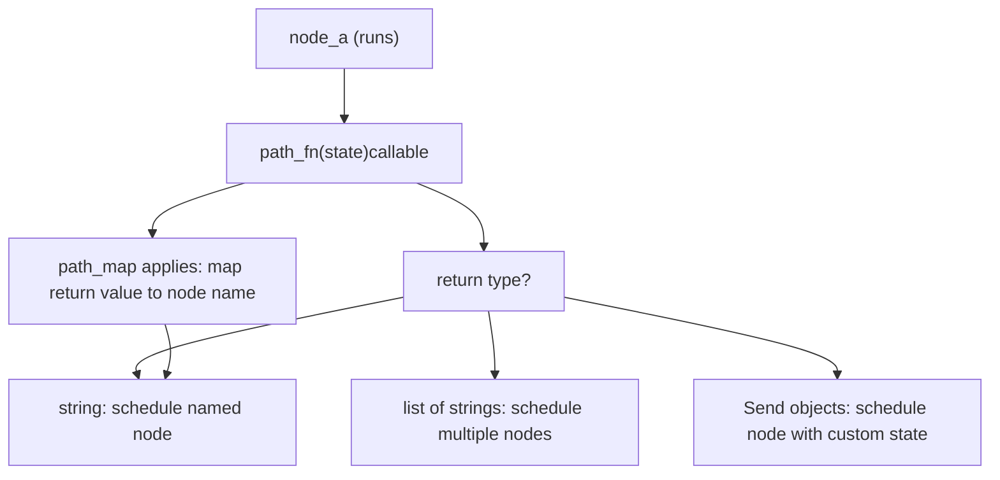
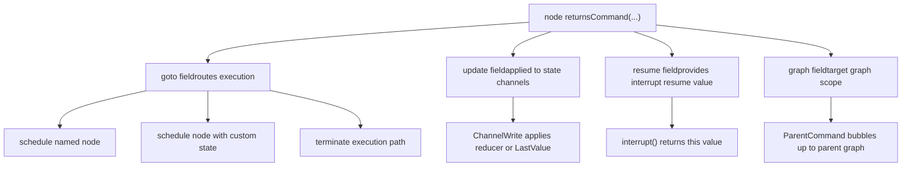
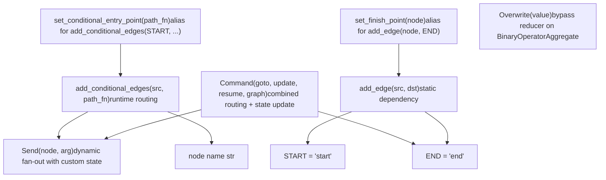

# Control Flow Primitives

Relevant source files

-   [libs/langgraph/langgraph/constants.py](https://github.com/langchain-ai/langgraph/blob/1fd51e8f/libs/langgraph/langgraph/constants.py)
-   [libs/langgraph/langgraph/errors.py](https://github.com/langchain-ai/langgraph/blob/1fd51e8f/libs/langgraph/langgraph/errors.py)
-   [libs/langgraph/langgraph/func/\_\_init\_\_.py](https://github.com/langchain-ai/langgraph/blob/1fd51e8f/libs/langgraph/langgraph/func/__init__.py)
-   [libs/langgraph/langgraph/graph/state.py](https://github.com/langchain-ai/langgraph/blob/1fd51e8f/libs/langgraph/langgraph/graph/state.py)
-   [libs/langgraph/langgraph/pregel/\_\_init\_\_.py](https://github.com/langchain-ai/langgraph/blob/1fd51e8f/libs/langgraph/langgraph/pregel/__init__.py)
-   [libs/langgraph/langgraph/pregel/debug.py](https://github.com/langchain-ai/langgraph/blob/1fd51e8f/libs/langgraph/langgraph/pregel/debug.py)
-   [libs/langgraph/langgraph/pregel/types.py](https://github.com/langchain-ai/langgraph/blob/1fd51e8f/libs/langgraph/langgraph/pregel/types.py)
-   [libs/langgraph/langgraph/types.py](https://github.com/langchain-ai/langgraph/blob/1fd51e8f/libs/langgraph/langgraph/types.py)
-   [libs/langgraph/tests/\_\_snapshots\_\_/test\_large\_cases.ambr](https://github.com/langchain-ai/langgraph/blob/1fd51e8f/libs/langgraph/tests/__snapshots__/test_large_cases.ambr)
-   [libs/langgraph/tests/test\_checkpoint\_migration.py](https://github.com/langchain-ai/langgraph/blob/1fd51e8f/libs/langgraph/tests/test_checkpoint_migration.py)
-   [libs/langgraph/tests/test\_large\_cases.py](https://github.com/langchain-ai/langgraph/blob/1fd51e8f/libs/langgraph/tests/test_large_cases.py)
-   [libs/langgraph/tests/test\_large\_cases\_async.py](https://github.com/langchain-ai/langgraph/blob/1fd51e8f/libs/langgraph/tests/test_large_cases_async.py)
-   [libs/langgraph/tests/test\_pregel.py](https://github.com/langchain-ai/langgraph/blob/1fd51e8f/libs/langgraph/tests/test_pregel.py)
-   [libs/langgraph/tests/test\_pregel\_async.py](https://github.com/langchain-ai/langgraph/blob/1fd51e8f/libs/langgraph/tests/test_pregel_async.py)

This page documents the mechanisms that control execution order in LangGraph graphs: the `START`/`END` constants, static and conditional edges, the `Send` API for dynamic fan-out, and the `Command` type for combined routing and state updates. For how nodes are executed once routing is resolved, see [3.3 Pregel Execution Engine](https://github.com/langchain-ai/langgraph/blob/1fd51e8f/3.3 Pregel Execution Engine) For human-in-the-loop patterns that use `interrupt()` and `Command(resume=...)`, see [3.7 Human-in-the-Loop and Interrupts](https://github.com/langchain-ai/langgraph/blob/1fd51e8f/3.7 Human-in-the-Loop and Interrupts)

---

## START and END Constants

`START` and `END` are interned string sentinels that represent the graph's virtual entry and exit points. They are never executed as nodes; they are only used as endpoints in edge declarations.

| Constant | Value | Purpose |
| --- | --- | --- |
| `START` | `"__start__"` | Virtual entry node; source of edges from the graph's input |
| `END` | `"__end__"` | Virtual exit node; any edge to `END` terminates that execution path |

**Source:** [libs/langgraph/langgraph/constants.py28-31](https://github.com/langchain-ai/langgraph/blob/1fd51e8f/libs/langgraph/langgraph/constants.py#L28-L31)

Nodes and edges are always declared relative to these sentinels:

```
from langgraph.graph import START, END, StateGraph builder = StateGraph(State)builder.add_edge(START, "my_node")builder.add_edge("my_node", END)
```
---

## Static Edges

`StateGraph.add_edge(source, dest)` declares an unconditional dependency: after `source` completes, `dest` is always scheduled. Multiple outgoing static edges from the same node cause the targets to run in the same superstep (in parallel).

```
builder.add_edge(START, "a")   # run "a" firstbuilder.add_edge("a", "b")     # run "b" after "a"builder.add_edge("a", "c")     # also run "c" after "a" (parallel with "b")
```
Running two nodes with a static edge from the same source means both will execute in the same superstep. If both write to the same `LastValue` channel, an `InvalidUpdateError` is raised [libs/langgraph/langgraph/graph/state.py119-120](https://github.com/langchain-ai/langgraph/blob/1fd51e8f/libs/langgraph/langgraph/graph/state.py#L119-L120) — use a `BinaryOperatorAggregate` channel or `Topic` channel if multiple writers are expected (see [3.4 State Management and Channels](https://github.com/langchain-ai/langgraph/blob/1fd51e8f/3.4 State Management and Channels)).

---

## Conditional Edges

`StateGraph.add_conditional_edges(source, path, path_map=None)` allows routing decisions to be made at runtime. The `path` argument is a callable that receives the current graph state and returns one of:

-   A single node name string
-   A list of node name strings (fan-out)
-   A `Send` object
-   A list of `Send` objects
-   A mixed list of strings and `Send` objects

**Source:** [libs/langgraph/langgraph/graph/state.py183-191](https://github.com/langchain-ai/langgraph/blob/1fd51e8f/libs/langgraph/langgraph/graph/state.py#L183-L191)

**Diagram: Conditional Edge Resolution**


**Sources:** [libs/langgraph/langgraph/graph/state.py183-191](https://github.com/langchain-ai/langgraph/blob/1fd51e8f/libs/langgraph/langgraph/graph/state.py#L183-L191) [libs/langgraph/langgraph/types.py289-361](https://github.com/langchain-ai/langgraph/blob/1fd51e8f/libs/langgraph/langgraph/types.py#L289-L361) [libs/langgraph/tests/test\_pregel.py1105-1128](https://github.com/langchain-ai/langgraph/blob/1fd51e8f/libs/langgraph/tests/test_pregel.py#L1105-L1128)

### Path Functions

The path function receives the full graph state and returns a routing decision. The return value is matched against node names registered in the graph.

```
def route(state: State) -> Literal["node_b", "node_c"]:    if state["condition"]:        return "node_b"    return "node_c" builder.add_conditional_edges("node_a", route)
```
### Path Maps (Labeled Edges)

`path_map` provides a mapping from the function's return values to actual node names. This is useful for labeled edges in graph visualizations, or when the return values are symbolic rather than exact node names.

```
builder.add_conditional_edges(    "agent",    route,    path_map={"continue": "tools", "exit": END})
```
In the rendered graph, the edge labels (`"continue"`, `"exit"`) appear as dashed arrow annotations.

**Source:** [libs/langgraph/tests/\_\_snapshots\_\_/test\_large\_cases.ambr55-88](https://github.com/langchain-ai/langgraph/blob/1fd51e8f/libs/langgraph/tests/__snapshots__/test_large_cases.ambr#L55-L88)

### Conditional Entry Point

`StateGraph.set_conditional_entry_point(path, path_map=None)` is equivalent to `add_conditional_edges(START, path, path_map)`. It defines routing from the graph's input to its first node(s).

```
builder.set_conditional_entry_point(lambda _: ["node_a", "node_b"])  # fan-out from input
```
**Source:** [libs/langgraph/tests/test\_pregel.py752-755](https://github.com/langchain-ai/langgraph/blob/1fd51e8f/libs/langgraph/tests/test_pregel.py#L752-L755) [libs/langgraph/tests/test\_pregel\_async.py534-535](https://github.com/langchain-ai/langgraph/blob/1fd51e8f/libs/langgraph/tests/test_pregel_async.py#L534-L535)

---

## The Send API

`Send` allows a conditional edge function to schedule a node with a *custom state* that differs from the current graph state. This is the primary mechanism for dynamic fan-out (the "map" step in map-reduce workflows).

**Class definition:** [libs/langgraph/langgraph/types.py289-361](https://github.com/langchain-ai/langgraph/blob/1fd51e8f/libs/langgraph/langgraph/types.py#L289-L361)

| Attribute | Type | Description |
| --- | --- | --- |
| `node` | `str` | Name of the target node to schedule |
| `arg` | `Any` | The state value to pass to that node invocation |

```
from langgraph.types import Send def fan_out(state: OverallState):    return [Send("worker", {"item": x}) for x in state["items"]] builder.add_conditional_edges(START, fan_out)
```
Each `Send` creates an independent task. Multiple `Send` objects returned from the same edge function execute concurrently in the next superstep.

**Diagram: Map-Reduce with Send API**

**Sources:** [libs/langgraph/langgraph/types.py289-361](https://github.com/langchain-ai/langgraph/blob/1fd51e8f/libs/langgraph/langgraph/types.py#L289-L361) [libs/langgraph/tests/test\_pregel.py1105-1128](https://github.com/langchain-ai/langgraph/blob/1fd51e8f/libs/langgraph/tests/test_pregel.py#L1105-L1128) [libs/langgraph/tests/test\_pregel\_async.py914-942](https://github.com/langchain-ai/langgraph/blob/1fd51e8f/libs/langgraph/tests/test_pregel_async.py#L914-L942)

### Send Inside Conditional Edge Functions

`Send` can be mixed with plain string node names in the same return value:

```
def start(state: State) -> list[Send | str]:    return ["tool_two", Send("tool_one", state)]
```
This schedules `tool_two` with the normal graph state and `tool_one` with the explicitly provided state.

**Source:** [libs/langgraph/tests/test\_pregel\_async.py915-916](https://github.com/langchain-ai/langgraph/blob/1fd51e8f/libs/langgraph/tests/test_pregel_async.py#L915-L916)

---

## The Command Type

`Command` is a dataclass that allows a node to simultaneously update graph state **and** specify the next node(s) to run. This eliminates the need for a separate conditional edge when the routing decision is made inside the node itself.

**Class definition:** [libs/langgraph/langgraph/types.py367-417](https://github.com/langchain-ai/langgraph/blob/1fd51e8f/libs/langgraph/langgraph/types.py#L367-L417)

| Field | Type | Description |
| --- | --- | --- |
| `goto` | `str | Send | Sequence[str | Send]` | Node(s) to route to next |
| `update` | `Any | None` | State update to apply (same format as a normal node return) |
| `resume` | `Any | None` | Value to inject when resuming a paused `interrupt()` |
| `graph` | `str | None` | Target graph (`None` = current, `Command.PARENT` = nearest parent) |

**Diagram: Command Type Fields and Their Effects**


**Sources:** [libs/langgraph/langgraph/types.py367-417](https://github.com/langchain-ai/langgraph/blob/1fd51e8f/libs/langgraph/langgraph/types.py#L367-L417) [libs/langgraph/langgraph/errors.py111-115](https://github.com/langchain-ai/langgraph/blob/1fd51e8f/libs/langgraph/langgraph/errors.py#L111-L115)

### goto: Routing

```
def node_a(state: State):    return Command(goto="b", update={"foo": "bar"}) def node_b(state: State):    return Command(goto=END, update={"bar": "baz"})
```
`goto` can also receive `Send` objects for dynamic fan-out:

```
def node_a(state: State):    return Command(goto=[Send("worker", {"item": x}) for x in state["items"]])
```
**Source:** [libs/langgraph/tests/test\_pregel.py139-155](https://github.com/langchain-ai/langgraph/blob/1fd51e8f/libs/langgraph/tests/test_pregel.py#L139-L155)

### update: State Updates

`update` supports the same formats as a regular node return value:

-   A `dict` keyed by state field names
-   A list of `(field_name, value)` tuples
-   A Pydantic or dataclass model instance (if the state schema uses one)

The update is processed by each field's reducer before the next superstep begins.

### resume: Resuming Interrupts

When `Command` is passed as the graph's *input* (rather than returned from a node), the `resume` field is used to provide values for pending `interrupt()` calls. The runtime matches resume values to interrupts by order.

```
# Graph was paused by an interrupt(); resume it:for chunk in graph.stream(Command(resume="user response"), config):    ...
```
**Source:** [libs/langgraph/tests/test\_pregel\_async.py632-636](https://github.com/langchain-ai/langgraph/blob/1fd51e8f/libs/langgraph/tests/test_pregel_async.py#L632-L636) [libs/langgraph/langgraph/types.py420-543](https://github.com/langchain-ai/langgraph/blob/1fd51e8f/libs/langgraph/langgraph/types.py#L420-L543)

### graph: Cross-Graph Routing

When a node inside a subgraph needs to update the *parent* graph's state or route within the parent, set `graph=Command.PARENT`.

| Value | Effect |
| --- | --- |
| `None` (default) | Command applies to current graph |
| `Command.PARENT` (`"__parent__"`) | Command bubbles up via `ParentCommand` exception to nearest parent graph |

Internally, `Command(graph=Command.PARENT, ...)` causes the subgraph to raise a `ParentCommand` exception (defined in [libs/langgraph/langgraph/errors.py111-115](https://github.com/langchain-ai/langgraph/blob/1fd51e8f/libs/langgraph/langgraph/errors.py#L111-L115)), which the parent's execution loop catches and processes.

**Source:** [libs/langgraph/langgraph/types.py417](https://github.com/langchain-ai/langgraph/blob/1fd51e8f/libs/langgraph/langgraph/types.py#L417-L417) [libs/langgraph/langgraph/errors.py111-115](https://github.com/langchain-ai/langgraph/blob/1fd51e8f/libs/langgraph/langgraph/errors.py#L111-L115)

---

## The Overwrite Type

`Overwrite` bypasses the reducer on a `BinaryOperatorAggregate` channel and replaces the channel value directly. Without `Overwrite`, returning a value for an annotated field always invokes its reducer (e.g. `operator.add`).

**Class definition:** [libs/langgraph/langgraph/types.py546-587](https://github.com/langchain-ai/langgraph/blob/1fd51e8f/libs/langgraph/langgraph/types.py#L546-L587)

```
from langgraph.types import Overwrite def node_b(state: State):    # Bypasses operator.add reducer; replaces list entirely    return {"messages": Overwrite(value=["b"])}
```
Receiving multiple `Overwrite` values for the same channel in a single superstep raises `InvalidUpdateError`.

---

## Common Routing Patterns

**Diagram: Control Flow Primitives and Code Entities**


**Sources:** [libs/langgraph/langgraph/constants.py28-31](https://github.com/langchain-ai/langgraph/blob/1fd51e8f/libs/langgraph/langgraph/constants.py#L28-L31) [libs/langgraph/langgraph/types.py289-417](https://github.com/langchain-ai/langgraph/blob/1fd51e8f/libs/langgraph/langgraph/types.py#L289-L417) [libs/langgraph/langgraph/graph/state.py183-191](https://github.com/langchain-ai/langgraph/blob/1fd51e8f/libs/langgraph/langgraph/graph/state.py#L183-L191)

### If-Else Branching

```
def route(state: State) -> Literal["tools", "__end__"]:    if state["needs_tool"]:        return "tools"    return END builder.add_conditional_edges("agent", route)
```
### Self-Loop (Agent Loop)

```
builder.add_conditional_edges(    "worker",    lambda state: "worker" if state["count"] < 6 else END)
```
**Source:** [libs/langgraph/tests/test\_large\_cases.py297-299](https://github.com/langchain-ai/langgraph/blob/1fd51e8f/libs/langgraph/tests/test_large_cases.py#L297-L299)

### Fan-out / Fan-in (Parallel Nodes)

```
builder.add_edge(START, "retriever_one")   # both start simultaneouslybuilder.add_edge(START, "retriever_two")builder.add_edge("retriever_one", "aggregate")builder.add_edge("retriever_two", "aggregate")
```
When both `retriever_one` and `retriever_two` complete, `aggregate` is scheduled. The state field written by both retrievers must use a reducer (e.g. `Annotated[list, operator.add]`).

### Map-Reduce with Send

```
class OverallState(TypedDict):    subjects: list[str]    jokes: Annotated[list[str], operator.add] def continue_to_jokes(state: OverallState):    return [Send("generate_joke", {"subject": s}) for s in state["subjects"]] builder.add_conditional_edges(START, continue_to_jokes)builder.add_edge("generate_joke", END)
```
Each `generate_joke` invocation receives its own isolated `{"subject": s}` dict. Results are merged into `jokes` by `operator.add`.

**Source:** [libs/langgraph/langgraph/types.py308-331](https://github.com/langchain-ai/langgraph/blob/1fd51e8f/libs/langgraph/langgraph/types.py#L308-L331)

### Nodes Using Command for Self-Routing

When routing is determined inside the node (e.g. based on an LLM output), returning `Command` removes the need for a separate `add_conditional_edges` call. The `destinations` parameter to `add_node` documents which nodes the `Command` can route to (for visualization only — it has no effect on execution):

```
builder.add_node(    "agent",    agent_fn,    destinations={"tools": "tools", END: END})# No add_conditional_edges needed if agent_fn returns Command(goto=...)
```
**Source:** [libs/langgraph/langgraph/graph/state.py295-325](https://github.com/langchain-ai/langgraph/blob/1fd51e8f/libs/langgraph/langgraph/graph/state.py#L295-L325)

---

## Interaction Summary

| Primitive | Defined in | When to use |
| --- | --- | --- |
| `START` | `langgraph.constants` | Source of all entry edges |
| `END` | `langgraph.constants` | Termination of any execution path |
| `add_edge` | `StateGraph` | Unconditional, always-on connection |
| `add_conditional_edges` | `StateGraph` | Runtime routing decided by a function |
| `Send` | `langgraph.types` | Fan-out with per-item custom state |
| `Command` | `langgraph.types` | Node controls both its update and next node |
| `Command.PARENT` | `langgraph.types` | Subgraph communicates with its parent graph |
| `Overwrite` | `langgraph.types` | Replace a reducer channel's value entirely |

**Sources:** [libs/langgraph/langgraph/constants.py28-31](https://github.com/langchain-ai/langgraph/blob/1fd51e8f/libs/langgraph/langgraph/constants.py#L28-L31) [libs/langgraph/langgraph/types.py289-587](https://github.com/langchain-ai/langgraph/blob/1fd51e8f/libs/langgraph/langgraph/types.py#L289-L587) [libs/langgraph/langgraph/graph/state.py183-191](https://github.com/langchain-ai/langgraph/blob/1fd51e8f/libs/langgraph/langgraph/graph/state.py#L183-L191) [libs/langgraph/langgraph/errors.py111-115](https://github.com/langchain-ai/langgraph/blob/1fd51e8f/libs/langgraph/langgraph/errors.py#L111-L115)
