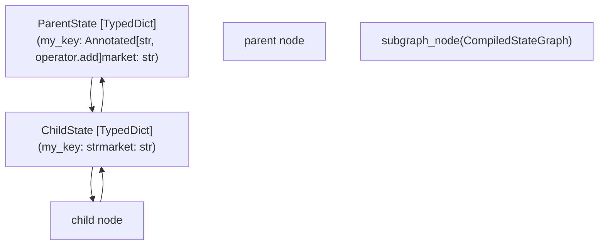
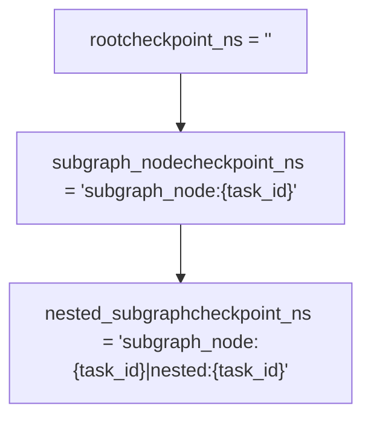
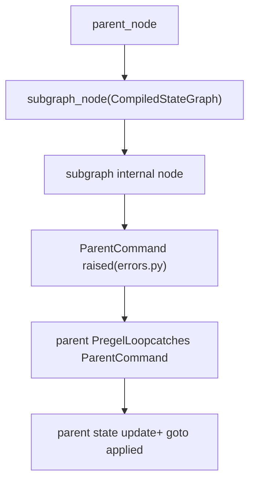

# Graph Composition and Nested Graphs

Relevant source files

-   [libs/langgraph/langgraph/\_internal/\_constants.py](https://github.com/langchain-ai/langgraph/blob/1fd51e8f/libs/langgraph/langgraph/_internal/_constants.py)
-   [libs/langgraph/langgraph/\_internal/\_replay.py](https://github.com/langchain-ai/langgraph/blob/1fd51e8f/libs/langgraph/langgraph/_internal/_replay.py)
-   [libs/langgraph/langgraph/constants.py](https://github.com/langchain-ai/langgraph/blob/1fd51e8f/libs/langgraph/langgraph/constants.py)
-   [libs/langgraph/langgraph/errors.py](https://github.com/langchain-ai/langgraph/blob/1fd51e8f/libs/langgraph/langgraph/errors.py)
-   [libs/langgraph/langgraph/func/\_\_init\_\_.py](https://github.com/langchain-ai/langgraph/blob/1fd51e8f/libs/langgraph/langgraph/func/__init__.py)
-   [libs/langgraph/langgraph/graph/state.py](https://github.com/langchain-ai/langgraph/blob/1fd51e8f/libs/langgraph/langgraph/graph/state.py)
-   [libs/langgraph/langgraph/pregel/\_\_init\_\_.py](https://github.com/langchain-ai/langgraph/blob/1fd51e8f/libs/langgraph/langgraph/pregel/__init__.py)
-   [libs/langgraph/langgraph/pregel/\_loop.py](https://github.com/langchain-ai/langgraph/blob/1fd51e8f/libs/langgraph/langgraph/pregel/_loop.py)
-   [libs/langgraph/langgraph/pregel/debug.py](https://github.com/langchain-ai/langgraph/blob/1fd51e8f/libs/langgraph/langgraph/pregel/debug.py)
-   [libs/langgraph/langgraph/pregel/main.py](https://github.com/langchain-ai/langgraph/blob/1fd51e8f/libs/langgraph/langgraph/pregel/main.py)
-   [libs/langgraph/langgraph/pregel/protocol.py](https://github.com/langchain-ai/langgraph/blob/1fd51e8f/libs/langgraph/langgraph/pregel/protocol.py)
-   [libs/langgraph/langgraph/pregel/remote.py](https://github.com/langchain-ai/langgraph/blob/1fd51e8f/libs/langgraph/langgraph/pregel/remote.py)
-   [libs/langgraph/langgraph/pregel/types.py](https://github.com/langchain-ai/langgraph/blob/1fd51e8f/libs/langgraph/langgraph/pregel/types.py)
-   [libs/langgraph/langgraph/types.py](https://github.com/langchain-ai/langgraph/blob/1fd51e8f/libs/langgraph/langgraph/types.py)
-   [libs/langgraph/langgraph/warnings.py](https://github.com/langchain-ai/langgraph/blob/1fd51e8f/libs/langgraph/langgraph/warnings.py)
-   [libs/langgraph/tests/\_\_snapshots\_\_/test\_large\_cases.ambr](https://github.com/langchain-ai/langgraph/blob/1fd51e8f/libs/langgraph/tests/__snapshots__/test_large_cases.ambr)
-   [libs/langgraph/tests/test\_checkpoint\_migration.py](https://github.com/langchain-ai/langgraph/blob/1fd51e8f/libs/langgraph/tests/test_checkpoint_migration.py)
-   [libs/langgraph/tests/test\_deprecation.py](https://github.com/langchain-ai/langgraph/blob/1fd51e8f/libs/langgraph/tests/test_deprecation.py)
-   [libs/langgraph/tests/test\_interruption.py](https://github.com/langchain-ai/langgraph/blob/1fd51e8f/libs/langgraph/tests/test_interruption.py)
-   [libs/langgraph/tests/test\_large\_cases.py](https://github.com/langchain-ai/langgraph/blob/1fd51e8f/libs/langgraph/tests/test_large_cases.py)
-   [libs/langgraph/tests/test\_large\_cases\_async.py](https://github.com/langchain-ai/langgraph/blob/1fd51e8f/libs/langgraph/tests/test_large_cases_async.py)
-   [libs/langgraph/tests/test\_pregel.py](https://github.com/langchain-ai/langgraph/blob/1fd51e8f/libs/langgraph/tests/test_pregel.py)
-   [libs/langgraph/tests/test\_pregel\_async.py](https://github.com/langchain-ai/langgraph/blob/1fd51e8f/libs/langgraph/tests/test_pregel_async.py)
-   [libs/langgraph/tests/test\_remote\_graph.py](https://github.com/langchain-ai/langgraph/blob/1fd51e8f/libs/langgraph/tests/test_remote_graph.py)
-   [libs/langgraph/tests/test\_stream\_v2.py](https://github.com/langchain-ai/langgraph/blob/1fd51e8f/libs/langgraph/tests/test_stream_v2.py)
-   [libs/langgraph/tests/test\_time\_travel.py](https://github.com/langchain-ai/langgraph/blob/1fd51e8f/libs/langgraph/tests/test_time_travel.py)
-   [libs/langgraph/tests/test\_time\_travel\_async.py](https://github.com/langchain-ai/langgraph/blob/1fd51e8f/libs/langgraph/tests/test_time_travel_async.py)

This page covers how compiled LangGraph graphs can be embedded as nodes inside other graphs, how state is transferred between parent and child scopes, how checkpointing is namespaced for nested execution, and how to inspect the hierarchical structure of composed graphs.

For background on how the Pregel execution engine works, see [Core Execution System](/langchain-ai/langgraph/3-core-execution-system). For the `StateGraph` API used to build individual graphs, see [StateGraph API](/langchain-ai/langgraph/3.1-stategraph-api). For human-in-the-loop interrupt handling within nested graphs, see [Human-in-the-Loop and Interrupts](/langchain-ai/langgraph/3.7-human-in-the-loop-and-interrupts).

---

## Subgraph Basics

A `CompiledStateGraph` produced by `StateGraph.compile()` implements the `PregelProtocol` and can be passed directly as a node to `StateGraph.add_node()`. The parent graph then treats the subgraph as an opaque node: it calls the subgraph's `invoke`/`ainvoke` during execution, and the subgraph runs its own full `Pregel` loop.

[libs/langgraph/langgraph/graph/state.py115-199](https://github.com/langchain-ai/langgraph/blob/1fd51e8f/libs/langgraph/langgraph/graph/state.py#L115-L199) [libs/langgraph/langgraph/pregel/main.py1-3](https://github.com/langchain-ai/langgraph/blob/1fd51e8f/libs/langgraph/langgraph/pregel/main.py#L1-L3)

**Basic pattern:**

```
# Define and compile the child graphchild_graph = StateGraph(ChildState)child_graph.add_node("child_node", ...)compiled_child = child_graph.compile() # Add it as a node in the parent graphparent_graph = StateGraph(ParentState)parent_graph.add_node("subgraph_node", compiled_child)parent_graph.add_edge(START, "subgraph_node")parent_graph.add_edge("subgraph_node", END)parent = parent_graph.compile()
```
The subgraph name used in `add_node` becomes its node identifier in the parent's graph topology.

**Subgraph node type in graph data:** When `get_graph()` is called on a parent, subgraph nodes are identified by their underlying `Pregel` implementation.

[libs/langgraph/langgraph/pregel/main.py42](https://github.com/langchain-ai/langgraph/blob/1fd51e8f/libs/langgraph/langgraph/pregel/main.py#L42-L42)

---

## State Mapping Between Parent and Child

When the parent invokes the subgraph node, state is not passed as a whole; it is projected through schema matching.

**Input projection (parent → child):** The parent passes a dict of all its current state keys that also appear in the subgraph's `input_schema` (or `state_schema` if no separate `input_schema` is defined).

**Output application (child → parent):** The subgraph returns values from its `output_schema`. Each returned key is written back into the parent state using **the parent's** channel reducers.

This means the parent and child can have different reducer annotations for the same key. For example:

| Field | Parent schema | Child schema |
| --- | --- | --- |
| `my_key` | `Annotated[str, operator.add]` | `str` |
| `market` | `str` | `str` |

If the child returns `{"my_key": " appended"}`, the parent reducer `operator.add` accumulates it: `"original" + " appended" = "original appended"`.

[libs/langgraph/tests/test\_pregel\_async.py123-182](https://github.com/langchain-ai/langgraph/blob/1fd51e8f/libs/langgraph/tests/test_pregel_async.py#L123-L182)

**State mapping diagram:**


Sources: [libs/langgraph/langgraph/pregel/\_io.py125](https://github.com/langchain-ai/langgraph/blob/1fd51e8f/libs/langgraph/langgraph/pregel/_io.py#L125-L125) [libs/langgraph/langgraph/pregel/\_algo.py113](https://github.com/langchain-ai/langgraph/blob/1fd51e8f/libs/langgraph/langgraph/pregel/_algo.py#L113-L113) [libs/langgraph/langgraph/graph/state.py115-184](https://github.com/langchain-ai/langgraph/blob/1fd51e8f/libs/langgraph/langgraph/graph/state.py#L115-L184)

---

## Checkpoint Namespacing

When a parent graph has a checkpointer enabled, each subgraph invocation gets its own checkpoint namespace (`checkpoint_ns`). This allows independent state history for each nested execution.

**Namespace format:**

```
{node_name}:{task_id}
```
For nested subgraphs (depth > 1):

```
{parent_node}:{parent_task_id}|{child_node}:{child_task_id}
```
The separator (`|`) is `NS_SEP` and the delimiter (`:`) is `NS_END`, both defined in `langgraph._internal._constants`.

[libs/langgraph/langgraph/\_internal/\_constants.py37-38](https://github.com/langchain-ai/langgraph/blob/1fd51e8f/libs/langgraph/langgraph/_internal/_constants.py#L37-L38) [libs/langgraph/langgraph/pregel/debug.py141-151](https://github.com/langchain-ai/langgraph/blob/1fd51e8f/libs/langgraph/langgraph/pregel/debug.py#L141-L151)

**How it is assembled:**

```
# From map_debug_checkpoint in debug.pytask_ns = f"{task.name}{NS_END}{task.id}"if parent_ns:    task_ns = f"{parent_ns}{NS_SEP}{task_ns}"
```
All checkpoints for both the parent and all subgraphs share the same `thread_id` but differ in `checkpoint_ns`.

**Namespace structure diagram:**


Sources: [libs/langgraph/langgraph/pregel/debug.py133-152](https://github.com/langchain-ai/langgraph/blob/1fd51e8f/libs/langgraph/langgraph/pregel/debug.py#L133-L152) [libs/langgraph/langgraph/\_internal/\_constants.py37-38](https://github.com/langchain-ai/langgraph/blob/1fd51e8f/libs/langgraph/langgraph/_internal/_constants.py#L37-L38)

---

## Subgraph Checkpointer Configuration

The `compile()` method accepts a `checkpointer` parameter of type `Checkpointer` (defined in `langgraph.types`):

[libs/langgraph/langgraph/types.py96-102](https://github.com/langchain-ai/langgraph/blob/1fd51e8f/libs/langgraph/langgraph/types.py#L96-L102)

| Value | Behavior |
| --- | --- |
| `None` (default) | Inherit the parent graph's checkpointer |
| `True` | Enable independent persistent checkpointing for this subgraph |
| `False` | Disable checkpointing for this subgraph even if parent has one |
| `BaseCheckpointSaver` instance | Use this specific saver for the subgraph |

```
# Child inherits parent's checkpointer (default)compiled_child = child_graph.compile() # Child is independently checkpointedcompiled_child = child_graph.compile(checkpointer=True) # Child has no checkpointing regardless of parentcompiled_child = child_graph.compile(checkpointer=False)
```
When `None`, the subgraph checkpoint writes go through the same `BaseCheckpointSaver` as the parent, distinguished by `checkpoint_ns`.

Sources: [libs/langgraph/langgraph/types.py96-115](https://github.com/langchain-ai/langgraph/blob/1fd51e8f/libs/langgraph/langgraph/types.py#L96-L115)

---

## Accessing Subgraph State

When a parent graph has checkpointing and a subgraph is interrupted or running, `get_state()` / `aget_state()` on the parent returns a `StateSnapshot` whose `tasks` field contains `PregelTask` instances.

For tasks that wrap a subgraph, `PregelTask.state` is set to a `RunnableConfig` pointing to the subgraph's checkpoint namespace:

[libs/langgraph/langgraph/types.py168-190](https://github.com/langchain-ai/langgraph/blob/1fd51e8f/libs/langgraph/langgraph/types.py#L168-L190)

```
parent_snapshot = parent.get_state(config)for task in parent_snapshot.tasks:    if task.state is not None:        # task.state is a RunnableConfig with checkpoint_ns set        subgraph_snapshot = parent.get_state(task.state)
```
The `task.state` field is populated in `tasks_w_writes()` and `map_debug_checkpoint()` when the underlying `PregelExecutableTask` indicates subgraph execution.

[libs/langgraph/langgraph/pregel/debug.py121-183](https://github.com/langchain-ai/langgraph/blob/1fd51e8f/libs/langgraph/langgraph/pregel/debug.py#L121-L183)

**Example `PregelTask` for a subgraph node:**

```
PregelTask(    id="abc123",    name="subgraph_node",            # node name in parent    path=(PULL, "subgraph_node"),    interrupts=(Interrupt(...),),    state={        "configurable": {            "thread_id": "1",            "checkpoint_ns": "subgraph_node:abc123",  # subgraph's checkpoint        }    })
```
[libs/langgraph/langgraph/types.py168-190](https://github.com/langchain-ai/langgraph/blob/1fd51e8f/libs/langgraph/langgraph/types.py#L168-L190)

**State access flow diagram:**

> **[Mermaid sequence]**
> *(图表结构无法解析)*

Sources: [libs/langgraph/langgraph/types.py168-190](https://github.com/langchain-ai/langgraph/blob/1fd51e8f/libs/langgraph/langgraph/types.py#L168-L190) [libs/langgraph/langgraph/pregel/debug.py121-183](https://github.com/langchain-ai/langgraph/blob/1fd51e8f/libs/langgraph/langgraph/pregel/debug.py#L121-L183) [libs/langgraph/langgraph/pregel/main.py149](https://github.com/langchain-ai/langgraph/blob/1fd51e8f/libs/langgraph/langgraph/pregel/main.py#L149-L149)

---

## Interrupt Propagation

Interrupts raised inside a subgraph via `interrupt()` bubble up to the parent graph. The parent captures them and surfaces them in its own `StateSnapshot.interrupts` and in the relevant `PregelTask.interrupts` list.

The parent does **not** need to know that the interrupt originated in a subgraph; it handles it identically to a top-level interrupt. Resumption is done by passing `Command(resume=value)` to the parent, which routes it down to the correct subgraph task via the checkpoint namespace.

[libs/langgraph/langgraph/errors.py57](https://github.com/langchain-ai/langgraph/blob/1fd51e8f/libs/langgraph/langgraph/errors.py#L57-L57) [libs/langgraph/langgraph/types.py71](https://github.com/langchain-ai/langgraph/blob/1fd51e8f/libs/langgraph/langgraph/types.py#L71-L71)

```
# Subgraph interrupt bubbles up to parentresult = parent.invoke({"input": "v"}, config)# result contains interrupts if subgraph called interrupt() # Resume by passing Command to parentresult = parent.invoke(Command(resume="my answer"), config)
```
Sources: [libs/langgraph/langgraph/types.py71](https://github.com/langchain-ai/langgraph/blob/1fd51e8f/libs/langgraph/langgraph/types.py#L71-L71) [libs/langgraph/langgraph/errors.py57](https://github.com/langchain-ai/langgraph/blob/1fd51e8f/libs/langgraph/langgraph/errors.py#L57-L57)

---

## Cross-Graph Commands: `Command.PARENT`

A subgraph node can direct updates and routing decisions to its **parent** graph by returning a `Command` with `graph=Command.PARENT`.

[libs/langgraph/langgraph/types.py367-417](https://github.com/langchain-ai/langgraph/blob/1fd51e8f/libs/langgraph/langgraph/types.py#L367-L417) (Note: Reference to generic Command behavior)

```
# Inside a node that is itself inside a subgraphdef my_subgraph_node(state: SubgraphState):    return Command(        graph="parent",  # Directing to parent        update={"parent_key": "new_value"},        goto="some_parent_node",    )
```
Internally, the subgraph node raises a `ParentCommand` exception which the parent execution loop catches and processes as a `Command` against its own state and routing table.

[libs/langgraph/langgraph/errors.py49-50](https://github.com/langchain-ai/langgraph/blob/1fd51e8f/libs/langgraph/langgraph/errors.py#L49-L50)

**Command routing diagram:**


Sources: [libs/langgraph/langgraph/types.py367-417](https://github.com/langchain-ai/langgraph/blob/1fd51e8f/libs/langgraph/langgraph/types.py#L367-L417) [libs/langgraph/langgraph/errors.py49-50](https://github.com/langchain-ai/langgraph/blob/1fd51e8f/libs/langgraph/langgraph/errors.py#L49-L50)

---

## Remote Subgraphs

The `RemoteGraph` class allows using a graph deployed on a LangGraph server as a node within a local graph. It implements the same `PregelProtocol` as local graphs, making the composition transparent.

[libs/langgraph/langgraph/pregel/remote.py112-121](https://github.com/langchain-ai/langgraph/blob/1fd51e8f/libs/langgraph/langgraph/pregel/remote.py#L112-L121)

```
from langgraph.pregel.remote import RemoteGraph remote_subgraph = RemoteGraph(assistant_id="my-deployed-graph", url="http://localhost:8123") builder = StateGraph(State)builder.add_node("remote", remote_subgraph)
```
When a `RemoteGraph` is invoked, it uses the `LangGraphClient` to trigger a run on the remote server and streams the results back into the local graph's state.

Sources: [libs/langgraph/langgraph/pregel/remote.py112-174](https://github.com/langchain-ai/langgraph/blob/1fd51e8f/libs/langgraph/langgraph/pregel/remote.py#L112-L174)

---

## Summary Reference

| Concept | Type / Symbol | Location |
| --- | --- | --- |
| Compiled subgraph type | `CompiledStateGraph` | `langgraph/graph/state.py` |
| Subgraph checkpointer config | `Checkpointer` | `langgraph/types.py` |
| Subgraph state in task | `PregelTask.state` | `langgraph/types.py` |
| Cross-graph command | `Command(graph='parent', ...)` | `langgraph/types.py` |
| Internal cross-graph exception | `ParentCommand` | `langgraph/errors.py` |
| Checkpoint namespace separator | `NS_SEP` (\` | \`) |
| Checkpoint namespace task delimiter | `NS_END` (`:`) | `langgraph/_internal/_constants.py` |
| Subgraph task detection | `PregelExecutableTask.subgraphs` | `langgraph/types.py` |
| Remote graph composition | `RemoteGraph` | `langgraph/pregel/remote.py` |

Sources: [libs/langgraph/langgraph/graph/state.py115](https://github.com/langchain-ai/langgraph/blob/1fd51e8f/libs/langgraph/langgraph/graph/state.py#L115-L115) [libs/langgraph/langgraph/types.py96](https://github.com/langchain-ai/langgraph/blob/1fd51e8f/libs/langgraph/langgraph/types.py#L96-L96) [libs/langgraph/langgraph/errors.py49](https://github.com/langchain-ai/langgraph/blob/1fd51e8f/libs/langgraph/langgraph/errors.py#L49-L49) [libs/langgraph/langgraph/\_internal/\_constants.py37-38](https://github.com/langchain-ai/langgraph/blob/1fd51e8f/libs/langgraph/langgraph/_internal/_constants.py#L37-L38) [libs/langgraph/langgraph/pregel/remote.py112](https://github.com/langchain-ai/langgraph/blob/1fd51e8f/libs/langgraph/langgraph/pregel/remote.py#L112-L112)
