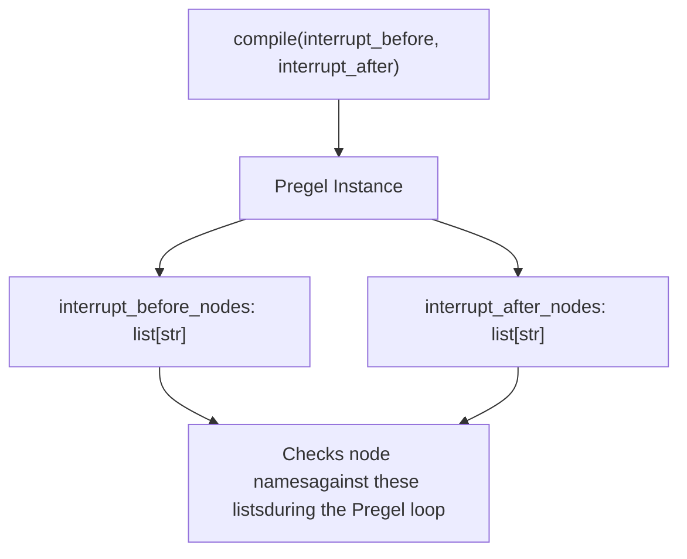
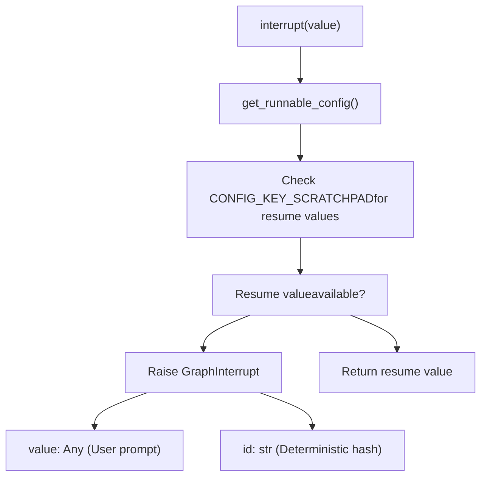
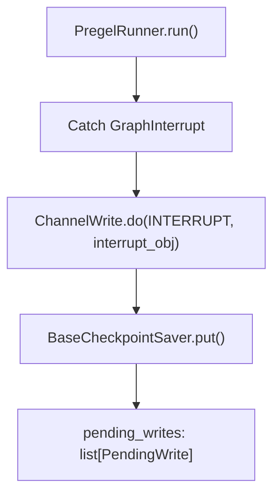
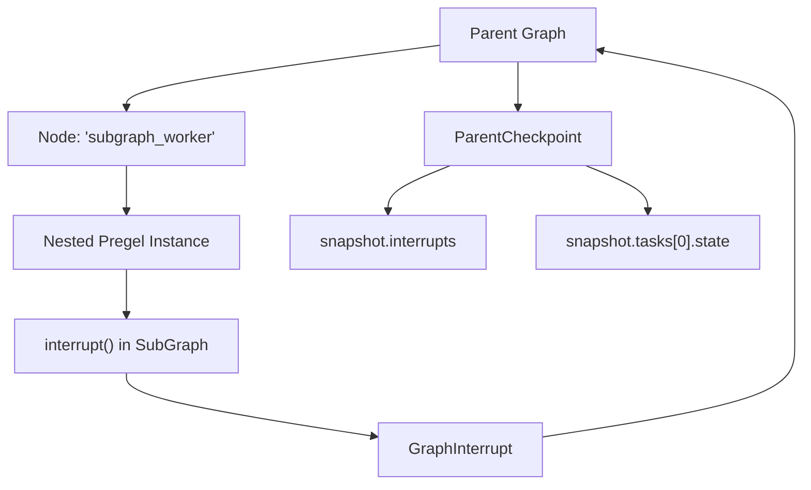

# Human-in-the-Loop and Interrupts

Relevant source files

-   [libs/langgraph/langgraph/constants.py](https://github.com/langchain-ai/langgraph/blob/1fd51e8f/libs/langgraph/langgraph/constants.py)
-   [libs/langgraph/langgraph/errors.py](https://github.com/langchain-ai/langgraph/blob/1fd51e8f/libs/langgraph/langgraph/errors.py)
-   [libs/langgraph/langgraph/func/\_\_init\_\_.py](https://github.com/langchain-ai/langgraph/blob/1fd51e8f/libs/langgraph/langgraph/func/__init__.py)
-   [libs/langgraph/langgraph/graph/state.py](https://github.com/langchain-ai/langgraph/blob/1fd51e8f/libs/langgraph/langgraph/graph/state.py)
-   [libs/langgraph/langgraph/pregel/\_\_init\_\_.py](https://github.com/langchain-ai/langgraph/blob/1fd51e8f/libs/langgraph/langgraph/pregel/__init__.py)
-   [libs/langgraph/langgraph/pregel/debug.py](https://github.com/langchain-ai/langgraph/blob/1fd51e8f/libs/langgraph/langgraph/pregel/debug.py)
-   [libs/langgraph/langgraph/pregel/types.py](https://github.com/langchain-ai/langgraph/blob/1fd51e8f/libs/langgraph/langgraph/pregel/types.py)
-   [libs/langgraph/langgraph/types.py](https://github.com/langchain-ai/langgraph/blob/1fd51e8f/libs/langgraph/langgraph/types.py)
-   [libs/langgraph/tests/\_\_snapshots\_\_/test\_large\_cases.ambr](https://github.com/langchain-ai/langgraph/blob/1fd51e8f/libs/langgraph/tests/__snapshots__/test_large_cases.ambr)
-   [libs/langgraph/tests/test\_checkpoint\_migration.py](https://github.com/langchain-ai/langgraph/blob/1fd51e8f/libs/langgraph/tests/test_checkpoint_migration.py)
-   [libs/langgraph/tests/test\_large\_cases.py](https://github.com/langchain-ai/langgraph/blob/1fd51e8f/libs/langgraph/tests/test_large_cases.py)
-   [libs/langgraph/tests/test\_large\_cases\_async.py](https://github.com/langchain-ai/langgraph/blob/1fd51e8f/libs/langgraph/tests/test_large_cases_async.py)
-   [libs/langgraph/tests/test\_pregel.py](https://github.com/langchain-ai/langgraph/blob/1fd51e8f/libs/langgraph/tests/test_pregel.py)
-   [libs/langgraph/tests/test\_pregel\_async.py](https://github.com/langchain-ai/langgraph/blob/1fd51e8f/libs/langgraph/tests/test_pregel_async.py)

**Purpose**: This document explains how to pause graph execution at specific points to enable human review, input, or decision-making. Interrupts allow graphs to stop at designated nodes or from within node logic, then resume with human-provided input or state modifications.

**Scope**: Covers static interrupts (configured at compile time), dynamic interrupts (triggered via the `interrupt()` function), resume mechanisms, and interrupt storage in checkpoints. For related topics on state persistence, see [Checkpointing Architecture](/langchain-ai/langgraph/4.1-checkpointing-architecture). For control flow without human interaction, see [Control Flow Primitives](/langchain-ai/langgraph/3.5-control-flow-primitives).

## Overview

Interrupts enable human-in-the-loop workflows by pausing graph execution and surfacing information to users. LangGraph supports two interrupt mechanisms:

| Interrupt Type | Configuration | Trigger Point | Resume Method |
| --- | --- | --- | --- |
| **Static** | `interrupt_before` / `interrupt_after` on `compile()` | Before or after specific nodes execute | Invoke with `None` or new input |
| **Dynamic** | `interrupt()` function call inside a node | Within node execution logic | `Command(resume=value)` |

Both mechanisms require a checkpointer to persist state across execution boundaries. When an interrupt occurs, the graph saves its current state and returns control to the caller. Execution resumes from the same checkpoint when invoked again.

Sources: [libs/langgraph/langgraph/types.py71-80](https://github.com/langchain-ai/langgraph/blob/1fd51e8f/libs/langgraph/langgraph/types.py#L71-L80) [libs/langgraph/langgraph/graph/state.py834-855](https://github.com/langchain-ai/langgraph/blob/1fd51e8f/libs/langgraph/langgraph/graph/state.py#L834-L855) [libs/langgraph/tests/test\_pregel\_async.py568-716](https://github.com/langchain-ai/langgraph/blob/1fd51e8f/libs/langgraph/tests/test_pregel_async.py#L568-L716)

---

## Static Interrupts

### Configuration at Compile Time

Static interrupts are configured when compiling a graph using the `interrupt_before` or `interrupt_after` parameters in `StateGraph.compile()` [libs/langgraph/langgraph/graph/state.py834-855](https://github.com/langchain-ai/langgraph/blob/1fd51e8f/libs/langgraph/langgraph/graph/state.py#L834-L855)

```
# Example configuration in StateGraphbuilder = StateGraph(State)builder.add_node("step_1", logic)# ...graph = builder.compile(    checkpointer=memory_saver,    interrupt_after=["step_1"]  # Pause after step_1 finishes)
```
The configuration maps to the underlying `Pregel` engine's `interrupt_before_nodes` and `interrupt_after_nodes` properties [libs/langgraph/langgraph/pregel/main.py175-180](https://github.com/langchain-ai/langgraph/blob/1fd51e8f/libs/langgraph/langgraph/pregel/main.py#L175-L180)

**Static Interrupt Configuration Model**


**Execution Flow with Static Interrupts**

Sources: [libs/langgraph/langgraph/graph/state.py834-855](https://github.com/langchain-ai/langgraph/blob/1fd51e8f/libs/langgraph/langgraph/graph/state.py#L834-L855) [libs/langgraph/tests/test\_large\_cases.py51-70](https://github.com/langchain-ai/langgraph/blob/1fd51e8f/libs/langgraph/tests/test_large_cases.py#L51-L70) [libs/langgraph/langgraph/pregel/main.py175-180](https://github.com/langchain-ai/langgraph/blob/1fd51e8f/libs/langgraph/langgraph/pregel/main.py#L175-L180)

### State Inspection at Interrupts

When a graph is interrupted, its state can be inspected using `get_state()` [libs/langgraph/langgraph/pregel/main.py480-500](https://github.com/langchain-ai/langgraph/blob/1fd51e8f/libs/langgraph/langgraph/pregel/main.py#L480-L500)

| StateSnapshot Field | Description | Code Entity |
| --- | --- | --- |
| `values` | Current channel values | `StateSnapshot.values` |
| `next` | Tuple of next node(s) to execute | `StateSnapshot.next` |
| `tasks` | Tasks pending execution | `StateSnapshot.tasks` |
| `interrupts` | Tuple of active dynamic interrupts | `StateSnapshot.interrupts` |

Static interrupts result in an empty `interrupts` tuple because the graph pauses at a boundary without an explicit `Interrupt` object being raised by a node.

Sources: [libs/langgraph/langgraph/types.py218-243](https://github.com/langchain-ai/langgraph/blob/1fd51e8f/libs/langgraph/langgraph/types.py#L218-L243) [libs/langgraph/tests/test\_large\_cases.py101-104](https://github.com/langchain-ai/langgraph/blob/1fd51e8f/libs/langgraph/tests/test_large_cases.py#L101-L104)

---

## Dynamic Interrupts

### The interrupt() Function

The `interrupt()` function allows nodes to pause execution from within their logic and request specific input from users [libs/langgraph/langgraph/types.py420-543](https://github.com/langchain-ai/langgraph/blob/1fd51e8f/libs/langgraph/langgraph/types.py#L420-L543)

```
from langgraph.types import interrupt def human_node(state: State):    # This call raises GraphInterrupt on first execution    user_provided = interrupt("Please approve the budget")    # This code only runs after the graph is resumed    return {"approval": user_provided}
```
**Internal Logic of interrupt()**


**Key Characteristics**:

1.  **First call raises exception**: On the first invocation within a task, `interrupt()` raises a `GraphInterrupt` exception [libs/langgraph/langgraph/types.py483-485](https://github.com/langchain-ai/langgraph/blob/1fd51e8f/libs/langgraph/langgraph/types.py#L483-L485)
2.  **Deterministic IDs**: Interrupt IDs are generated based on the checkpoint namespace and a counter to ensure consistency across retries [libs/langgraph/langgraph/types.py465-475](https://github.com/langchain-ai/langgraph/blob/1fd51e8f/libs/langgraph/langgraph/types.py#L465-L475)
3.  **Re-execution on resume**: When resumed, the node re-executes from the beginning. The `interrupt()` call then finds the resume value in the scratchpad and returns it instead of raising an exception [libs/langgraph/langgraph/types.py455-463](https://github.com/langchain-ai/langgraph/blob/1fd51e8f/libs/langgraph/langgraph/types.py#L455-L463)

Sources: [libs/langgraph/langgraph/types.py420-543](https://github.com/langchain-ai/langgraph/blob/1fd51e8f/libs/langgraph/langgraph/types.py#L420-L543) [libs/langgraph/tests/test\_pregel\_async.py568-716](https://github.com/langchain-ai/langgraph/blob/1fd51e8f/libs/langgraph/tests/test_pregel_async.py#L568-L716)

---

## The Interrupt Data Structure

### Interrupt Class

The `Interrupt` class represents a suspended execution point [libs/langgraph/langgraph/types.py159-214](https://github.com/langchain-ai/langgraph/blob/1fd51e8f/libs/langgraph/langgraph/types.py#L159-L214)

| Field | Type | Description |
| --- | --- | --- |
| `value` | `Any` | The information passed to `interrupt()`, typically a prompt or data for the user. |
| `id` | `str` | A unique identifier for this specific interrupt instance. |

**Sources**: [libs/langgraph/langgraph/types.py159-170](https://github.com/langchain-ai/langgraph/blob/1fd51e8f/libs/langgraph/langgraph/types.py#L159-L170)

### Storage in Checkpoints

Interrupts are stored as pending writes in the checkpoint under the special `INTERRUPT` channel [libs/langgraph/langgraph/pregel/debug.py99-104](https://github.com/langchain-ai/langgraph/blob/1fd51e8f/libs/langgraph/langgraph/pregel/debug.py#L99-L104)


Sources: [libs/langgraph/langgraph/pregel/debug.py99-104](https://github.com/langchain-ai/langgraph/blob/1fd51e8f/libs/langgraph/langgraph/pregel/debug.py#L99-L104) [libs/langgraph/langgraph/pregel/debug.py208-213](https://github.com/langchain-ai/langgraph/blob/1fd51e8f/libs/langgraph/langgraph/pregel/debug.py#L208-L213)

---

## Resuming Execution

### Resume Mechanisms

Interrupted graphs are resumed by providing a `Command` object with a `resume` value [libs/langgraph/langgraph/types.py289-323](https://github.com/langchain-ai/langgraph/blob/1fd51e8f/libs/langgraph/langgraph/types.py#L289-L323)

| Resume Method | Code Example |
| --- | --- |
| **Standard Resume** | `graph.invoke(Command(resume="approved"), config)` |
| **Dictionary Resume** | `graph.invoke(Command(resume={"id_1": "val1"}), config)` |
| **Static Resume** | `graph.invoke(None, config)` (for static interrupts) |

**Resume Data Flow**

Sources: [libs/langgraph/langgraph/types.py315-323](https://github.com/langchain-ai/langgraph/blob/1fd51e8f/libs/langgraph/langgraph/types.py#L315-L323) [libs/langgraph/tests/test\_pregel\_async.py616-636](https://github.com/langchain-ai/langgraph/blob/1fd51e8f/libs/langgraph/tests/test_pregel_async.py#L616-L636) [libs/langgraph/langgraph/pregel/\_runner.py](https://github.com/langchain-ai/langgraph/blob/1fd51e8f/libs/langgraph/langgraph/pregel/_runner.py)

### Clearing Interrupts

To clear interrupts without completing the logic that triggered them, a state update can be applied to the thread using `update_state` with `as_node="__end__"` or by providing a specific `checkpoint_id` [libs/langgraph/langgraph/graph/state.py1050-1070](https://github.com/langchain-ai/langgraph/blob/1fd51e8f/libs/langgraph/langgraph/graph/state.py#L1050-L1070)

Sources: [libs/langgraph/tests/test\_pregel\_async.py697-715](https://github.com/langchain-ai/langgraph/blob/1fd51e8f/libs/langgraph/tests/test_pregel_async.py#L697-L715) [libs/langgraph/langgraph/graph/state.py1050-1070](https://github.com/langchain-ai/langgraph/blob/1fd51e8f/libs/langgraph/langgraph/graph/state.py#L1050-L1070)

---

## Subgraph Interrupts

When a node is a subgraph (e.g., another compiled LangGraph), interrupts within the subgraph bubble up to the parent. The parent's `StateSnapshot` will contain the interrupt, and the `tasks` entry for the subgraph node will include a `state` field (a `RunnableConfig`) that points to the subgraph's specific checkpoint namespace [libs/langgraph/langgraph/pregel/debug.py136-152](https://github.com/langchain-ai/langgraph/blob/1fd51e8f/libs/langgraph/langgraph/pregel/debug.py#L136-L152)


Sources: [libs/langgraph/langgraph/pregel/debug.py136-152](https://github.com/langchain-ai/langgraph/blob/1fd51e8f/libs/langgraph/langgraph/pregel/debug.py#L136-L152) [libs/langgraph/tests/test\_pregel\_async.py718-890](https://github.com/langchain-ai/langgraph/blob/1fd51e8f/libs/langgraph/tests/test_pregel_async.py#L718-L890)
