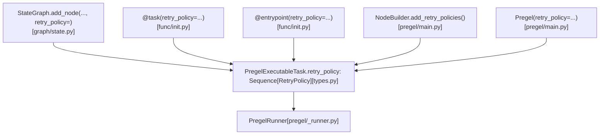
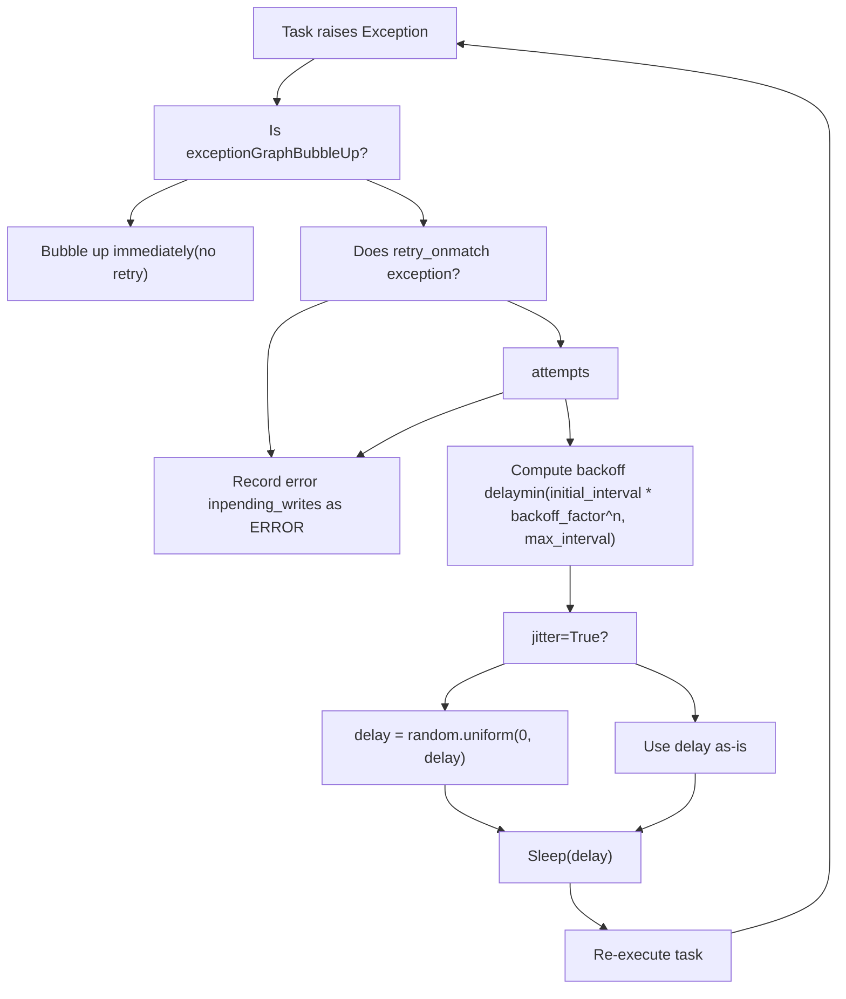
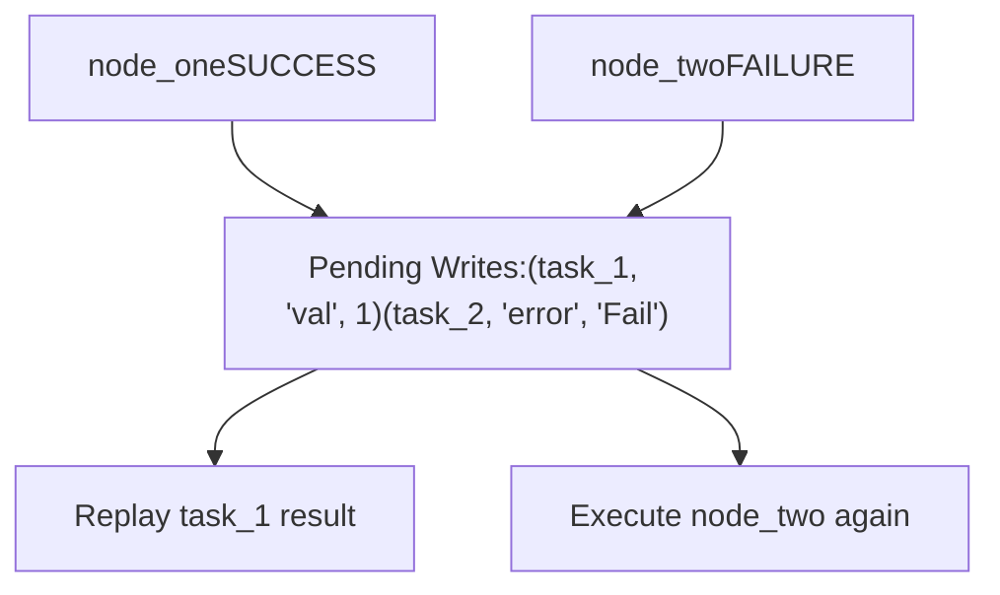
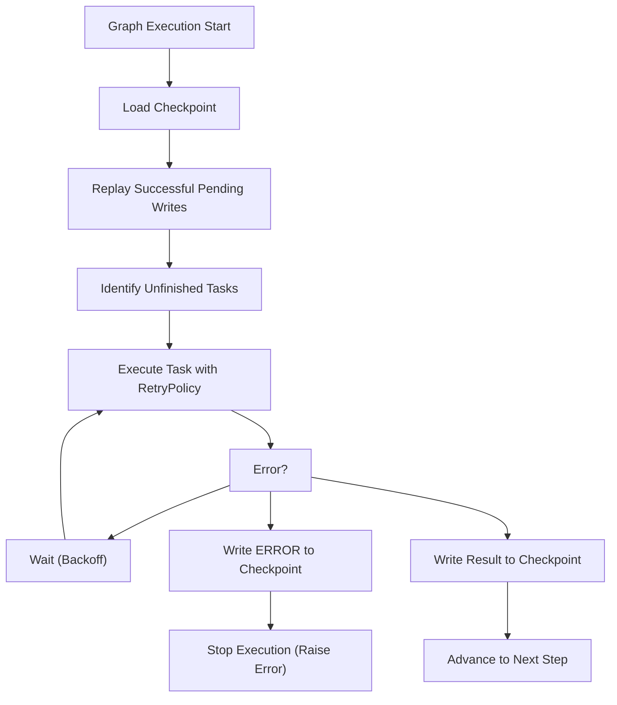

# Error Handling and Retry Policies

Relevant source files

-   [libs/langgraph/langgraph/\_internal/\_config.py](https://github.com/langchain-ai/langgraph/blob/1fd51e8f/libs/langgraph/langgraph/_internal/_config.py)
-   [libs/langgraph/langgraph/\_internal/\_runnable.py](https://github.com/langchain-ai/langgraph/blob/1fd51e8f/libs/langgraph/langgraph/_internal/_runnable.py)
-   [libs/langgraph/langgraph/\_internal/\_scratchpad.py](https://github.com/langchain-ai/langgraph/blob/1fd51e8f/libs/langgraph/langgraph/_internal/_scratchpad.py)
-   [libs/langgraph/langgraph/constants.py](https://github.com/langchain-ai/langgraph/blob/1fd51e8f/libs/langgraph/langgraph/constants.py)
-   [libs/langgraph/langgraph/errors.py](https://github.com/langchain-ai/langgraph/blob/1fd51e8f/libs/langgraph/langgraph/errors.py)
-   [libs/langgraph/langgraph/func/\_\_init\_\_.py](https://github.com/langchain-ai/langgraph/blob/1fd51e8f/libs/langgraph/langgraph/func/__init__.py)
-   [libs/langgraph/langgraph/graph/state.py](https://github.com/langchain-ai/langgraph/blob/1fd51e8f/libs/langgraph/langgraph/graph/state.py)
-   [libs/langgraph/langgraph/pregel/\_\_init\_\_.py](https://github.com/langchain-ai/langgraph/blob/1fd51e8f/libs/langgraph/langgraph/pregel/__init__.py)
-   [libs/langgraph/langgraph/pregel/\_algo.py](https://github.com/langchain-ai/langgraph/blob/1fd51e8f/libs/langgraph/langgraph/pregel/_algo.py)
-   [libs/langgraph/langgraph/pregel/\_retry.py](https://github.com/langchain-ai/langgraph/blob/1fd51e8f/libs/langgraph/langgraph/pregel/_retry.py)
-   [libs/langgraph/langgraph/pregel/\_runner.py](https://github.com/langchain-ai/langgraph/blob/1fd51e8f/libs/langgraph/langgraph/pregel/_runner.py)
-   [libs/langgraph/langgraph/pregel/debug.py](https://github.com/langchain-ai/langgraph/blob/1fd51e8f/libs/langgraph/langgraph/pregel/debug.py)
-   [libs/langgraph/langgraph/pregel/types.py](https://github.com/langchain-ai/langgraph/blob/1fd51e8f/libs/langgraph/langgraph/pregel/types.py)
-   [libs/langgraph/langgraph/runtime.py](https://github.com/langchain-ai/langgraph/blob/1fd51e8f/libs/langgraph/langgraph/runtime.py)
-   [libs/langgraph/langgraph/types.py](https://github.com/langchain-ai/langgraph/blob/1fd51e8f/libs/langgraph/langgraph/types.py)
-   [libs/langgraph/tests/\_\_snapshots\_\_/test\_large\_cases.ambr](https://github.com/langchain-ai/langgraph/blob/1fd51e8f/libs/langgraph/tests/__snapshots__/test_large_cases.ambr)
-   [libs/langgraph/tests/test\_channels.py](https://github.com/langchain-ai/langgraph/blob/1fd51e8f/libs/langgraph/tests/test_channels.py)
-   [libs/langgraph/tests/test\_checkpoint\_migration.py](https://github.com/langchain-ai/langgraph/blob/1fd51e8f/libs/langgraph/tests/test_checkpoint_migration.py)
-   [libs/langgraph/tests/test\_large\_cases.py](https://github.com/langchain-ai/langgraph/blob/1fd51e8f/libs/langgraph/tests/test_large_cases.py)
-   [libs/langgraph/tests/test\_large\_cases\_async.py](https://github.com/langchain-ai/langgraph/blob/1fd51e8f/libs/langgraph/tests/test_large_cases_async.py)
-   [libs/langgraph/tests/test\_managed\_values.py](https://github.com/langchain-ai/langgraph/blob/1fd51e8f/libs/langgraph/tests/test_managed_values.py)
-   [libs/langgraph/tests/test\_parent\_command.py](https://github.com/langchain-ai/langgraph/blob/1fd51e8f/libs/langgraph/tests/test_parent_command.py)
-   [libs/langgraph/tests/test\_parent\_command\_async.py](https://github.com/langchain-ai/langgraph/blob/1fd51e8f/libs/langgraph/tests/test_parent_command_async.py)
-   [libs/langgraph/tests/test\_pregel.py](https://github.com/langchain-ai/langgraph/blob/1fd51e8f/libs/langgraph/tests/test_pregel.py)
-   [libs/langgraph/tests/test\_pregel\_async.py](https://github.com/langchain-ai/langgraph/blob/1fd51e8f/libs/langgraph/tests/test_pregel_async.py)
-   [libs/langgraph/tests/test\_retry.py](https://github.com/langchain-ai/langgraph/blob/1fd51e8f/libs/langgraph/tests/test_retry.py)
-   [libs/langgraph/tests/test\_runnable.py](https://github.com/langchain-ai/langgraph/blob/1fd51e8f/libs/langgraph/tests/test_runnable.py)

This page documents how LangGraph handles node-level errors, configures automatic retry behavior, and preserves partial execution state when failures occur. The focus is on the `RetryPolicy` type, how it attaches to nodes and tasks, the mechanics of backoff and retry execution, and the relationship between errors and checkpointing.

For human-in-the-loop interrupts (which use `GraphInterrupt` but are not errors), see [3.7](https://github.com/langchain-ai/langgraph/blob/1fd51e8f/3.7) For the checkpointing system that enables execution resumption, see [4.1](https://github.com/langchain-ai/langgraph/blob/1fd51e8f/4.1)

---

## RetryPolicy

`RetryPolicy` is a `TypedDict` defined in [libs/langgraph/langgraph/types.py225-244](https://github.com/langchain-ai/langgraph/blob/1fd51e8f/libs/langgraph/langgraph/types.py#L225-L244) that configures automatic retry behavior for a node or task.

| Field | Type | Default | Description |
| --- | --- | --- | --- |
| `initial_interval` | `float` | `0.5` | Seconds to wait before the first retry |
| `backoff_factor` | `float` | `2.0` | Multiplier applied to the interval after each retry |
| `max_interval` | `float` | `128.0` | Maximum seconds between retries |
| `max_attempts` | `int` | `3` | Total attempts, including the first |
| `jitter` | `bool` | `True` | Add random noise to the computed interval |
| `retry_on` | `type[Exception] | Sequence[type[Exception]] | Callable[[Exception], bool]` | `default_retry_on` | Filter determining which exceptions should trigger a retry |

The computed delay for attempt `n` (1-indexed, where 1 is the first retry) is:

```
delay = min(initial_interval * (backoff_factor ** (n - 1)), max_interval)if jitter:    import random    delay = random.uniform(0, delay)
```
### `retry_on` and `default_retry_on`

The `retry_on` field controls which exceptions are retried. It accepts a single exception class, a sequence, or a predicate function. The default value is `default_retry_on`, imported from `langgraph._internal._retry` [libs/langgraph/langgraph/types.py28](https://github.com/langchain-ai/langgraph/blob/1fd51e8f/libs/langgraph/langgraph/types.py#L28-L28) By default, transient errors are included. Control-flow signals like `GraphInterrupt` and `ParentCommand` are never retried regardless of policy [libs/langgraph/langgraph/errors.py](https://github.com/langchain-ai/langgraph/blob/1fd51e8f/libs/langgraph/langgraph/errors.py)

### Multiple Policies

Both `StateGraph.add_node` and `@task` accept `retry_policy: RetryPolicy | Sequence[RetryPolicy]`. When a sequence is provided, the **first policy whose `retry_on` matches the exception** is applied [libs/langgraph/langgraph/func/\_\_init\_\_.py200-206](https://github.com/langchain-ai/langgraph/blob/1fd51e8f/libs/langgraph/langgraph/func/__init__.py#L200-L206)

---

## Attaching Retry Policies

**RetryPolicy** can be attached at the graph/`Pregel` level, the node level, or the task (functional API) level.

### Diagram: RetryPolicy Attachment Points


Sources: [libs/langgraph/langgraph/types.py225-244](https://github.com/langchain-ai/langgraph/blob/1fd51e8f/libs/langgraph/langgraph/types.py#L225-L244) [libs/langgraph/langgraph/graph/state.py569-582](https://github.com/langchain-ai/langgraph/blob/1fd51e8f/libs/langgraph/langgraph/graph/state.py#L569-L582) [libs/langgraph/langgraph/func/\_\_init\_\_.py94-126](https://github.com/langchain-ai/langgraph/blob/1fd51e8f/libs/langgraph/langgraph/func/__init__.py#L94-L126) [libs/langgraph/langgraph/pregel/main.py1-2](https://github.com/langchain-ai/langgraph/blob/1fd51e8f/libs/langgraph/langgraph/pregel/main.py#L1-L2)

#### `StateGraph.add_node`

When adding a node to a `StateGraph`, the `retry_policy` is passed to the underlying `StateNodeSpec` [libs/langgraph/langgraph/graph/state.py569-582](https://github.com/langchain-ai/langgraph/blob/1fd51e8f/libs/langgraph/langgraph/graph/state.py#L569-L582)

#### `@task` decorator

The `@task` decorator wraps the function in a `_TaskFunction` which stores the `retry_policy` [libs/langgraph/langgraph/func/\_\_init\_\_.py47-70](https://github.com/langchain-ai/langgraph/blob/1fd51e8f/libs/langgraph/langgraph/func/__init__.py#L47-L70) When called, it invokes `call()` with that policy [libs/langgraph/langgraph/func/\_\_init\_\_.py73-79](https://github.com/langchain-ai/langgraph/blob/1fd51e8f/libs/langgraph/langgraph/func/__init__.py#L73-L79)

---

## Retry Execution Mechanics

`PregelRunner` executes tasks and implements retry logic. Each `PregelExecutableTask` carries its `retry_policy` sequence. When a task raises an exception, the runner evaluates the policy.

### Diagram: Retry Decision Flow


Sources: [libs/langgraph/langgraph/pregel/\_runner.py](https://github.com/langchain-ai/langgraph/blob/1fd51e8f/libs/langgraph/langgraph/pregel/_runner.py) [libs/langgraph/langgraph/types.py225-244](https://github.com/langchain-ai/langgraph/blob/1fd51e8f/libs/langgraph/langgraph/types.py#L225-L244) [libs/langgraph/langgraph/pregel/\_retry.py](https://github.com/langchain-ai/langgraph/blob/1fd51e8f/libs/langgraph/langgraph/pregel/_retry.py)

### Parallel Cancellation

When nodes run in parallel within a superstep and one node fails (after exhausting retries), the execution engine handles task cancellation. In async mode, this typically involves cancelling sibling tasks to prevent wasted compute. Tests verify this behavior in [libs/langgraph/tests/test\_pregel\_async.py175-210](https://github.com/langchain-ai/langgraph/blob/1fd51e8f/libs/langgraph/tests/test_pregel_async.py#L175-L210)

---

## Error Propagation and State

When a node fails, the error is recorded as a pending write with the key `ERROR` (defined in [libs/langgraph/langgraph/\_internal/\_constants.py](https://github.com/langchain-ai/langgraph/blob/1fd51e8f/libs/langgraph/langgraph/_internal/_constants.py)). The checkpoint is **not advanced** to the next step; instead, the error is associated with the current step's task ID.

### Diagram: Error in Pending Writes

Sources: [libs/langgraph/langgraph/pregel/\_loop.py](https://github.com/langchain-ai/langgraph/blob/1fd51e8f/libs/langgraph/langgraph/pregel/_loop.py) [libs/langgraph/tests/test\_pregel.py158-211](https://github.com/langchain-ai/langgraph/blob/1fd51e8f/libs/langgraph/tests/test_pregel.py#L158-L211)

The `pending_writes` in a checkpoint store the failure. This allows the system to know exactly which task failed when the graph is resumed [libs/langgraph/langgraph/pregel/debug.py186-214](https://github.com/langchain-ai/langgraph/blob/1fd51e8f/libs/langgraph/langgraph/pregel/debug.py#L186-L214)

---

## Resumption After Failure

When a graph is invoked again on a thread that has a failed state, the `PregelLoop` loads the pending writes:

-   **Successful tasks**: Writes are replayed.
-   **Failed tasks**: Re-executed from scratch (with a fresh retry budget).

### Diagram: Resume Behavior


Sources: [libs/langgraph/tests/test\_pregel.py51-112](https://github.com/langchain-ai/langgraph/blob/1fd51e8f/libs/langgraph/tests/test_pregel.py#L51-L112) [libs/langgraph/langgraph/pregel/debug.py186-214](https://github.com/langchain-ai/langgraph/blob/1fd51e8f/libs/langgraph/langgraph/pregel/debug.py#L186-L214)

---

## Error Types Reference

The error classes are defined in [libs/langgraph/langgraph/errors.py](https://github.com/langchain-ai/langgraph/blob/1fd51e8f/libs/langgraph/langgraph/errors.py)

| Class | Base | Description |
| --- | --- | --- |
| `GraphRecursionError` | `RecursionError` | Raised when `recursion_limit` is exceeded [libs/langgraph/langgraph/errors.py48](https://github.com/langchain-ai/langgraph/blob/1fd51e8f/libs/langgraph/langgraph/errors.py#L48-L48) |
| `InvalidUpdateError` | `Exception` | Raised for invalid channel updates or reducer failures [libs/langgraph/langgraph/errors.py49](https://github.com/langchain-ai/langgraph/blob/1fd51e8f/libs/langgraph/langgraph/errors.py#L49-L49) |
| `ParentCommand` | `GraphBubbleUp` | Used to bubble up commands to parent graphs [libs/langgraph/langgraph/errors.py50](https://github.com/langchain-ai/langgraph/blob/1fd51e8f/libs/langgraph/langgraph/errors.py#L50-L50) |

### `GraphRecursionError`

Raised by the loop when the number of supersteps exceeds the configured limit. This prevents infinite loops in cyclic graphs [libs/langgraph/tests/test\_pregel.py49](https://github.com/langchain-ai/langgraph/blob/1fd51e8f/libs/langgraph/tests/test_pregel.py#L49-L49)

### Interrupts Are Not Errors

`GraphInterrupt` (and its alias `NodeInterrupt`) are used for human-in-the-loop patterns. They are not treated as failures and do not trigger `RetryPolicy` [libs/langgraph/langgraph/types.py71](https://github.com/langchain-ai/langgraph/blob/1fd51e8f/libs/langgraph/langgraph/types.py#L71-L71)

---

## Checkpoint Errors

If the checkpointer itself fails (e.g., database connection error during `aput`), LangGraph raises the error immediately. Tests verify that faulty checkpointers correctly propagate exceptions during `aget_tuple`, `aput`, and `aput_writes` [libs/langgraph/tests/test\_pregel\_async.py91-210](https://github.com/langchain-ai/langgraph/blob/1fd51e8f/libs/langgraph/tests/test_pregel_async.py#L91-L210)

| Fault Site | Source |
| --- | --- |
| `aget_tuple` | [libs/langgraph/tests/test\_pregel\_async.py93-94](https://github.com/langchain-ai/langgraph/blob/1fd51e8f/libs/langgraph/tests/test_pregel_async.py#L93-L94) |
| `aput` | [libs/langgraph/tests/test\_pregel\_async.py97-104](https://github.com/langchain-ai/langgraph/blob/1fd51e8f/libs/langgraph/tests/test_pregel_async.py#L97-L104) |
| `aput_writes` | [libs/langgraph/tests/test\_pregel\_async.py106-110](https://github.com/langchain-ai/langgraph/blob/1fd51e8f/libs/langgraph/tests/test_pregel_async.py#L106-L110) |
| `get_next_version` | [libs/langgraph/tests/test\_pregel\_async.py112-114](https://github.com/langchain-ai/langgraph/blob/1fd51e8f/libs/langgraph/tests/test_pregel_async.py#L112-L114) |

---

## RetryPolicy and Checkpointing Interaction Summary


Sources: [libs/langgraph/langgraph/pregel/\_loop.py](https://github.com/langchain-ai/langgraph/blob/1fd51e8f/libs/langgraph/langgraph/pregel/_loop.py) [libs/langgraph/langgraph/pregel/\_runner.py](https://github.com/langchain-ai/langgraph/blob/1fd51e8f/libs/langgraph/langgraph/pregel/_runner.py) [libs/langgraph/langgraph/types.py225-244](https://github.com/langchain-ai/langgraph/blob/1fd51e8f/libs/langgraph/langgraph/types.py#L225-L244)
