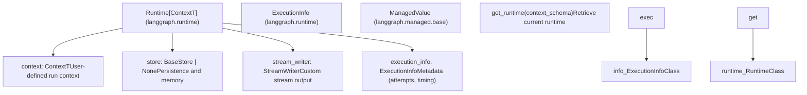
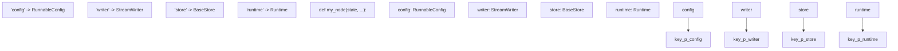
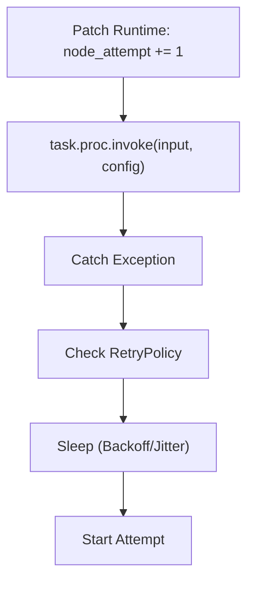

# Runtime and Dependency Injection

Relevant source files

-   [libs/langgraph/langgraph/\_internal/\_config.py](https://github.com/langchain-ai/langgraph/blob/1fd51e8f/libs/langgraph/langgraph/_internal/_config.py)
-   [libs/langgraph/langgraph/\_internal/\_runnable.py](https://github.com/langchain-ai/langgraph/blob/1fd51e8f/libs/langgraph/langgraph/_internal/_runnable.py)
-   [libs/langgraph/langgraph/\_internal/\_scratchpad.py](https://github.com/langchain-ai/langgraph/blob/1fd51e8f/libs/langgraph/langgraph/_internal/_scratchpad.py)
-   [libs/langgraph/langgraph/managed/base.py](https://github.com/langchain-ai/langgraph/blob/1fd51e8f/libs/langgraph/langgraph/managed/base.py)
-   [libs/langgraph/langgraph/managed/is\_last\_step.py](https://github.com/langchain-ai/langgraph/blob/1fd51e8f/libs/langgraph/langgraph/managed/is_last_step.py)
-   [libs/langgraph/langgraph/pregel/\_algo.py](https://github.com/langchain-ai/langgraph/blob/1fd51e8f/libs/langgraph/langgraph/pregel/_algo.py)
-   [libs/langgraph/langgraph/pregel/\_retry.py](https://github.com/langchain-ai/langgraph/blob/1fd51e8f/libs/langgraph/langgraph/pregel/_retry.py)
-   [libs/langgraph/langgraph/pregel/\_runner.py](https://github.com/langchain-ai/langgraph/blob/1fd51e8f/libs/langgraph/langgraph/pregel/_runner.py)
-   [libs/langgraph/langgraph/runtime.py](https://github.com/langchain-ai/langgraph/blob/1fd51e8f/libs/langgraph/langgraph/runtime.py)
-   [libs/langgraph/tests/test\_channels.py](https://github.com/langchain-ai/langgraph/blob/1fd51e8f/libs/langgraph/tests/test_channels.py)
-   [libs/langgraph/tests/test\_managed\_values.py](https://github.com/langchain-ai/langgraph/blob/1fd51e8f/libs/langgraph/tests/test_managed_values.py)
-   [libs/langgraph/tests/test\_parent\_command.py](https://github.com/langchain-ai/langgraph/blob/1fd51e8f/libs/langgraph/tests/test_parent_command.py)
-   [libs/langgraph/tests/test\_parent\_command\_async.py](https://github.com/langchain-ai/langgraph/blob/1fd51e8f/libs/langgraph/tests/test_parent_command_async.py)
-   [libs/langgraph/tests/test\_retry.py](https://github.com/langchain-ai/langgraph/blob/1fd51e8f/libs/langgraph/tests/test_retry.py)
-   [libs/langgraph/tests/test\_runnable.py](https://github.com/langchain-ai/langgraph/blob/1fd51e8f/libs/langgraph/tests/test_runnable.py)

## Purpose and Scope

This document explains LangGraph's runtime dependency injection system, introduced in v0.6.0. This system enables nodes and tools to receive execution-scoped dependencies (context, store, stream writer, and execution metadata) without manual parameter passing. The `Runtime` class bundles these dependencies and makes them available to node functions through automatic parameter injection based on type annotations.

For information about state management and channels, see [State Management and Channels](/langchain-ai/langgraph/3.4-state-management-and-channels). For details on the Store system itself, see [Store System](/langchain-ai/langgraph/4.3-store-system).

---

## Runtime Class Structure

The `Runtime` class is a generic dataclass that bundles run-scoped dependencies and utilities available to nodes during graph execution.

### Runtime and Execution Entities

The following diagram associates the natural language concepts of execution context with the specific code entities used in the LangGraph runtime.


**Sources:** [libs/langgraph/langgraph/runtime.py17-135](https://github.com/langchain-ai/langgraph/blob/1fd51e8f/libs/langgraph/langgraph/runtime.py#L17-L135) [libs/langgraph/langgraph/managed/base.py18-23](https://github.com/langchain-ai/langgraph/blob/1fd51e8f/libs/langgraph/langgraph/managed/base.py#L18-L23)

### Runtime Attributes and Execution Info

| Attribute | Type | Purpose |
| --- | --- | --- |
| `context` | `ContextT` | Static context for the graph run (e.g., `user_id`, `db_conn`), defined by `context_schema`. |
| `store` | `BaseStore | None` | Key-value store for persistence and long-term memory. |
| `stream_writer` | `StreamWriter` | Function for writing to the custom stream mode. |
| `execution_info` | `ExecutionInfo` | Read-only metadata about the current node execution. |
| `previous` | `Any` | Previous return value for the thread (functional API with checkpointer only). |

The `ExecutionInfo` class provides specific tracking data for the current execution:

-   `node_attempt`: Current node execution attempt number (1-indexed), used for retry logic. [libs/langgraph/langgraph/runtime.py20-21](https://github.com/langchain-ai/langgraph/blob/1fd51e8f/libs/langgraph/langgraph/runtime.py#L20-L21)
-   `node_first_attempt_time`: Unix timestamp for when the first attempt of this node started. [libs/langgraph/langgraph/runtime.py23-24](https://github.com/langchain-ai/langgraph/blob/1fd51e8f/libs/langgraph/langgraph/runtime.py#L23-L24)

**Sources:** [libs/langgraph/langgraph/runtime.py17-29](https://github.com/langchain-ai/langgraph/blob/1fd51e8f/libs/langgraph/langgraph/runtime.py#L17-L29) [libs/langgraph/langgraph/runtime.py116-134](https://github.com/langchain-ai/langgraph/blob/1fd51e8f/libs/langgraph/langgraph/runtime.py#L116-L134)

---

## Injectable Dependencies

LangGraph supports automatic injection of multiple dependencies into node functions, tools, and tasks based on their function signatures and type annotations. This is managed by the `RunnableCallable` class.

### Injection Association Diagram

This diagram maps the internal `KWARGS_CONFIG_KEYS` configuration to the parameters available in a user's node function.


**Sources:** [libs/langgraph/langgraph/\_internal/\_runnable.py132-184](https://github.com/langchain-ai/langgraph/blob/1fd51e8f/libs/langgraph/langgraph/_internal/_runnable.py#L132-L184)

### Supported Injectable Parameters

The injection system recognizes the following parameter names and types:

1.  **`config: RunnableConfig`**: The current runnable configuration. Always available. [libs/langgraph/langgraph/\_internal/\_runnable.py133-145](https://github.com/langchain-ai/langgraph/blob/1fd51e8f/libs/langgraph/langgraph/_internal/_runnable.py#L133-L145)
2.  **`writer: StreamWriter`**: Function for writing to custom stream. Retrieved from `runtime.stream_writer`. [libs/langgraph/langgraph/\_internal/\_runnable.py147-151](https://github.com/langchain-ai/langgraph/blob/1fd51e8f/libs/langgraph/langgraph/_internal/_runnable.py#L147-L151)
3.  **`store: BaseStore`**: Key-value store instance. Retrieved from `runtime.store`. [libs/langgraph/langgraph/\_internal/\_runnable.py153-170](https://github.com/langchain-ai/langgraph/blob/1fd51e8f/libs/langgraph/langgraph/_internal/_runnable.py#L153-L170)
4.  **`runtime: Runtime[Context]`**: Complete runtime object, providing access to `execution_info` and `context`. [libs/langgraph/langgraph/\_internal/\_runnable.py178-184](https://github.com/langchain-ai/langgraph/blob/1fd51e8f/libs/langgraph/langgraph/_internal/_runnable.py#L178-L184)
5.  **`previous: Any`**: Previous return value. Only available in functional API with checkpointer. [libs/langgraph/langgraph/\_internal/\_runnable.py172-176](https://github.com/langchain-ai/langgraph/blob/1fd51e8f/libs/langgraph/langgraph/_internal/_runnable.py#L172-L176)

**Sources:** [libs/langgraph/langgraph/\_internal/\_runnable.py132-184](https://github.com/langchain-ai/langgraph/blob/1fd51e8f/libs/langgraph/langgraph/_internal/_runnable.py#L132-L184)

---

## Injection Mechanism

The `RunnableCallable` class implements dependency injection by inspecting function signatures and automatically providing required parameters from the `Runtime` object stored in the runnable config under the `__pregel_runtime` key.

### Signature Inspection and Invocation

1.  **Inspection**: During initialization, `RunnableCallable` inspects the function signature using `inspect.signature`. It populates `self.func_accepts` with keys that match `KWARGS_CONFIG_KEYS`. [libs/langgraph/langgraph/\_internal/\_runnable.py293-320](https://github.com/langchain-ai/langgraph/blob/1fd51e8f/libs/langgraph/langgraph/_internal/_runnable.py#L293-L320)
2.  **Resolution**: At runtime, `invoke()` or `ainvoke()` retrieves the `Runtime` object from `config[CONF][CONFIG_KEY_RUNTIME]`. [libs/langgraph/langgraph/\_internal/\_runnable.py347-353](https://github.com/langchain-ai/langgraph/blob/1fd51e8f/libs/langgraph/langgraph/_internal/_runnable.py#L347-L353)
3.  **Injection**: It iterates through `func_accepts`. If a parameter is `runtime`, the whole object is injected. If it's `writer` or `store`, the corresponding attribute is extracted from the `Runtime` instance. [libs/langgraph/langgraph/\_internal/\_runnable.py355-403](https://github.com/langchain-ai/langgraph/blob/1fd51e8f/libs/langgraph/langgraph/_internal/_runnable.py#L355-L403)

**Sources:** [libs/langgraph/langgraph/\_internal/\_runnable.py293-403](https://github.com/langchain-ai/langgraph/blob/1fd51e8f/libs/langgraph/langgraph/_internal/_runnable.py#L293-L403) [libs/langgraph/langgraph/\_internal/\_constants.py44](https://github.com/langchain-ai/langgraph/blob/1fd51e8f/libs/langgraph/langgraph/_internal/_constants.py#L44-L44)

---

## Managed Values

Managed values provide a way to inject "calculated" or "derived" execution context into nodes. Unlike the `Runtime` object which is passed via config, `ManagedValue` implementations calculate values based on the `PregelScratchpad`.

| Class | Type | Purpose |
| --- | --- | --- |
| `IsLastStepManager` | `bool` | Injected as `IsLastStep`. Returns `True` if the current step is the final allowed step. |
| `RemainingStepsManager` | `int` | Injected as `RemainingSteps`. Returns the number of steps remaining before the recursion limit. |

**Sources:** [libs/langgraph/langgraph/managed/is\_last\_step.py9-25](https://github.com/langchain-ai/langgraph/blob/1fd51e8f/libs/langgraph/langgraph/managed/is_last_step.py#L9-L25) [libs/langgraph/langgraph/managed/base.py18-23](https://github.com/langchain-ai/langgraph/blob/1fd51e8f/libs/langgraph/langgraph/managed/base.py#L18-L23)

---

## Runtime and Retry Integration

The runtime system is deeply integrated with the graph's retry mechanism. During retries, the `Runtime` object is patched to update `ExecutionInfo`.

### Retry Loop and Runtime Patching


When a task fails and matches a `RetryPolicy`, the execution engine:

1.  Increments the `attempts` counter. [libs/langgraph/langgraph/pregel/\_retry.py131](https://github.com/langchain-ai/langgraph/blob/1fd51e8f/libs/langgraph/langgraph/pregel/_retry.py#L131-L131)
2.  Calls `runtime.patch_execution_info(node_attempt=attempts + 1)`. [libs/langgraph/langgraph/pregel/\_retry.py85-91](https://github.com/langchain-ai/langgraph/blob/1fd51e8f/libs/langgraph/langgraph/pregel/_retry.py#L85-L91)
3.  Updates the `RunnableConfig` with the new patched `Runtime` before the next invocation. [libs/langgraph/langgraph/pregel/\_retry.py82-91](https://github.com/langchain-ai/langgraph/blob/1fd51e8f/libs/langgraph/langgraph/pregel/_retry.py#L82-L91)

**Sources:** [libs/langgraph/langgraph/pregel/\_retry.py57-91](https://github.com/langchain-ai/langgraph/blob/1fd51e8f/libs/langgraph/langgraph/pregel/_retry.py#L57-L91) [libs/langgraph/langgraph/runtime.py157-162](https://github.com/langchain-ai/langgraph/blob/1fd51e8f/libs/langgraph/langgraph/runtime.py#L157-L162)

---

## Usage Examples

### Accessing Execution Info and Store

Nodes can use the `Runtime` object to make decisions based on how many times they have been retried or to access the cross-thread `BaseStore`.

```
from langgraph.runtime import Runtimefrom langgraph.store.base import BaseStore def my_node(state: dict, runtime: Runtime, store: BaseStore):    # Check attempt number    attempt = runtime.execution_info.node_attempt        # Access store (injected directly or via runtime)    user_id = runtime.context.get("user_id")    memory = store.get(("memories", user_id), "profile")        return {"attempt_logged": attempt}
```
**Sources:** [libs/langgraph/langgraph/runtime.py86-95](https://github.com/langchain-ai/langgraph/blob/1fd51e8f/libs/langgraph/langgraph/runtime.py#L86-L95) [libs/langgraph/tests/test\_retry.py175-183](https://github.com/langchain-ai/langgraph/blob/1fd51e8f/libs/langgraph/tests/test_retry.py#L175-L183)

### Using Managed Values

```
from langgraph.managed.is_last_step import IsLastStep def smart_node(state: dict, is_last_step: IsLastStep):    if is_last_step:        return {"response": "I'm running out of time, here is my best guess..."}    return {"response": "Let me think more about this."}
```
**Sources:** [libs/langgraph/langgraph/managed/is\_last\_step.py9-15](https://github.com/langchain-ai/langgraph/blob/1fd51e8f/libs/langgraph/langgraph/managed/is_last_step.py#L9-L15)

---

## Configuration Summary

The runtime system relies on internal configuration keys defined in `_constants.py` and managed via `_config.py`.

| Constant | Value | Description |
| --- | --- | --- |
| `CONFIG_KEY_RUNTIME` | `"__pregel_runtime"` | Key in `configurable` for the `Runtime` instance. |
| `CONFIG_KEY_SCRATCHPAD` | `"__pregel_scratchpad"` | Key for the `PregelScratchpad` used by managed values. |
| `CONFIG_KEY_READ` | `"__pregel_read"` | Key for the state reading function injected into conditional edges. |

**Sources:** [libs/langgraph/langgraph/\_internal/\_constants.py44-46](https://github.com/langchain-ai/langgraph/blob/1fd51e8f/libs/langgraph/langgraph/_internal/_constants.py#L44-L46) [libs/langgraph/langgraph/pregel/\_algo.py181-209](https://github.com/langchain-ai/langgraph/blob/1fd51e8f/libs/langgraph/langgraph/pregel/_algo.py#L181-L209)
