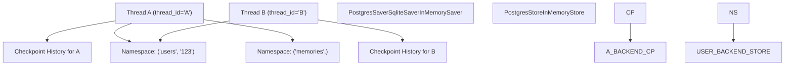

# Persistence and Memory

Relevant source files

-   [libs/checkpoint-postgres/langgraph/checkpoint/postgres/\_\_init\_\_.py](https://github.com/langchain-ai/langgraph/blob/1fd51e8f/libs/checkpoint-postgres/langgraph/checkpoint/postgres/__init__.py)
-   [libs/checkpoint-postgres/langgraph/checkpoint/postgres/aio.py](https://github.com/langchain-ai/langgraph/blob/1fd51e8f/libs/checkpoint-postgres/langgraph/checkpoint/postgres/aio.py)
-   [libs/checkpoint-postgres/langgraph/checkpoint/postgres/base.py](https://github.com/langchain-ai/langgraph/blob/1fd51e8f/libs/checkpoint-postgres/langgraph/checkpoint/postgres/base.py)
-   [libs/checkpoint-postgres/langgraph/checkpoint/postgres/shallow.py](https://github.com/langchain-ai/langgraph/blob/1fd51e8f/libs/checkpoint-postgres/langgraph/checkpoint/postgres/shallow.py)
-   [libs/checkpoint-postgres/langgraph/store/postgres/aio.py](https://github.com/langchain-ai/langgraph/blob/1fd51e8f/libs/checkpoint-postgres/langgraph/store/postgres/aio.py)
-   [libs/checkpoint-postgres/langgraph/store/postgres/base.py](https://github.com/langchain-ai/langgraph/blob/1fd51e8f/libs/checkpoint-postgres/langgraph/store/postgres/base.py)
-   [libs/checkpoint-postgres/tests/conftest.py](https://github.com/langchain-ai/langgraph/blob/1fd51e8f/libs/checkpoint-postgres/tests/conftest.py)
-   [libs/checkpoint-postgres/tests/test\_async.py](https://github.com/langchain-ai/langgraph/blob/1fd51e8f/libs/checkpoint-postgres/tests/test_async.py)
-   [libs/checkpoint-postgres/tests/test\_async\_store.py](https://github.com/langchain-ai/langgraph/blob/1fd51e8f/libs/checkpoint-postgres/tests/test_async_store.py)
-   [libs/checkpoint-postgres/tests/test\_store.py](https://github.com/langchain-ai/langgraph/blob/1fd51e8f/libs/checkpoint-postgres/tests/test_store.py)
-   [libs/checkpoint-postgres/tests/test\_sync.py](https://github.com/langchain-ai/langgraph/blob/1fd51e8f/libs/checkpoint-postgres/tests/test_sync.py)
-   [libs/checkpoint-postgres/uv.lock](https://github.com/langchain-ai/langgraph/blob/1fd51e8f/libs/checkpoint-postgres/uv.lock)
-   [libs/checkpoint-sqlite/langgraph/checkpoint/sqlite/\_\_init\_\_.py](https://github.com/langchain-ai/langgraph/blob/1fd51e8f/libs/checkpoint-sqlite/langgraph/checkpoint/sqlite/__init__.py)
-   [libs/checkpoint-sqlite/langgraph/checkpoint/sqlite/aio.py](https://github.com/langchain-ai/langgraph/blob/1fd51e8f/libs/checkpoint-sqlite/langgraph/checkpoint/sqlite/aio.py)
-   [libs/checkpoint-sqlite/langgraph/checkpoint/sqlite/utils.py](https://github.com/langchain-ai/langgraph/blob/1fd51e8f/libs/checkpoint-sqlite/langgraph/checkpoint/sqlite/utils.py)
-   [libs/checkpoint-sqlite/tests/test\_aiosqlite.py](https://github.com/langchain-ai/langgraph/blob/1fd51e8f/libs/checkpoint-sqlite/tests/test_aiosqlite.py)
-   [libs/checkpoint-sqlite/tests/test\_sqlite.py](https://github.com/langchain-ai/langgraph/blob/1fd51e8f/libs/checkpoint-sqlite/tests/test_sqlite.py)
-   [libs/checkpoint-sqlite/uv.lock](https://github.com/langchain-ai/langgraph/blob/1fd51e8f/libs/checkpoint-sqlite/uv.lock)
-   [libs/checkpoint/langgraph/checkpoint/base/\_\_init\_\_.py](https://github.com/langchain-ai/langgraph/blob/1fd51e8f/libs/checkpoint/langgraph/checkpoint/base/__init__.py)
-   [libs/checkpoint/langgraph/checkpoint/memory/\_\_init\_\_.py](https://github.com/langchain-ai/langgraph/blob/1fd51e8f/libs/checkpoint/langgraph/checkpoint/memory/__init__.py)
-   [libs/checkpoint/langgraph/checkpoint/serde/jsonplus.py](https://github.com/langchain-ai/langgraph/blob/1fd51e8f/libs/checkpoint/langgraph/checkpoint/serde/jsonplus.py)
-   [libs/checkpoint/langgraph/checkpoint/serde/types.py](https://github.com/langchain-ai/langgraph/blob/1fd51e8f/libs/checkpoint/langgraph/checkpoint/serde/types.py)
-   [libs/checkpoint/langgraph/store/base/\_\_init\_\_.py](https://github.com/langchain-ai/langgraph/blob/1fd51e8f/libs/checkpoint/langgraph/store/base/__init__.py)
-   [libs/checkpoint/langgraph/store/base/batch.py](https://github.com/langchain-ai/langgraph/blob/1fd51e8f/libs/checkpoint/langgraph/store/base/batch.py)
-   [libs/checkpoint/langgraph/store/base/embed.py](https://github.com/langchain-ai/langgraph/blob/1fd51e8f/libs/checkpoint/langgraph/store/base/embed.py)
-   [libs/checkpoint/langgraph/store/memory/\_\_init\_\_.py](https://github.com/langchain-ai/langgraph/blob/1fd51e8f/libs/checkpoint/langgraph/store/memory/__init__.py)
-   [libs/checkpoint/pyproject.toml](https://github.com/langchain-ai/langgraph/blob/1fd51e8f/libs/checkpoint/pyproject.toml)
-   [libs/checkpoint/tests/test\_jsonplus.py](https://github.com/langchain-ai/langgraph/blob/1fd51e8f/libs/checkpoint/tests/test_jsonplus.py)
-   [libs/checkpoint/tests/test\_memory.py](https://github.com/langchain-ai/langgraph/blob/1fd51e8f/libs/checkpoint/tests/test_memory.py)
-   [libs/checkpoint/tests/test\_store.py](https://github.com/langchain-ai/langgraph/blob/1fd51e8f/libs/checkpoint/tests/test_store.py)
-   [libs/checkpoint/uv.lock](https://github.com/langchain-ai/langgraph/blob/1fd51e8f/libs/checkpoint/uv.lock)
-   [libs/langgraph/pyproject.toml](https://github.com/langchain-ai/langgraph/blob/1fd51e8f/libs/langgraph/pyproject.toml)
-   [libs/langgraph/tests/\_\_snapshots\_\_/test\_pregel.ambr](https://github.com/langchain-ai/langgraph/blob/1fd51e8f/libs/langgraph/tests/__snapshots__/test_pregel.ambr)
-   [libs/langgraph/tests/\_\_snapshots\_\_/test\_pregel\_async.ambr](https://github.com/langchain-ai/langgraph/blob/1fd51e8f/libs/langgraph/tests/__snapshots__/test_pregel_async.ambr)
-   [libs/langgraph/tests/memory\_assert.py](https://github.com/langchain-ai/langgraph/blob/1fd51e8f/libs/langgraph/tests/memory_assert.py)
-   [libs/langgraph/uv.lock](https://github.com/langchain-ai/langgraph/blob/1fd51e8f/libs/langgraph/uv.lock)
-   [libs/prebuilt/pyproject.toml](https://github.com/langchain-ai/langgraph/blob/1fd51e8f/libs/prebuilt/pyproject.toml)
-   [libs/prebuilt/uv.lock](https://github.com/langchain-ai/langgraph/blob/1fd51e8f/libs/prebuilt/uv.lock)
-   [libs/sdk-py/uv.lock](https://github.com/langchain-ai/langgraph/blob/1fd51e8f/libs/sdk-py/uv.lock)

## Overview

LangGraph's persistence and memory system is divided into two distinct layers that serve complementary purposes for stateful applications.

| Layer | Interface | Scope | Primary Purpose |
| --- | --- | --- | --- |
| **Checkpointer** | `BaseCheckpointSaver` | Per-thread | Durable execution, error recovery, and "Time Travel" (state replay) |
| **Store** | `BaseStore` | Cross-thread | Long-term memory, shared knowledge, user profiles, and global state |

**Checkpointers** save a full snapshot of the graph state after every superstep. They are indexed by a `thread_id`, allowing a specific conversation or workflow to be paused and resumed. **Stores** provide a global, namespace-keyed document store that any thread can access, making them ideal for information that must persist across different conversations (e.g., remembering a user's name across multiple independent threads).

### System Architecture

The following diagram illustrates how these two systems interact with graph execution threads.

**Persistence Architecture Overview**

Sources: [libs/checkpoint/langgraph/checkpoint/base/\_\_init\_\_.py118-150](https://github.com/langchain-ai/langgraph/blob/1fd51e8f/libs/checkpoint/langgraph/checkpoint/base/__init__.py#L118-L150) [libs/checkpoint/langgraph/store/base/\_\_init\_\_.py51-100](https://github.com/langchain-ai/langgraph/blob/1fd51e8f/libs/checkpoint/langgraph/store/base/__init__.py#L51-L100)

---

## The Checkpointer Layer

The checkpointer is responsible for the durability of the graph's execution state. It captures the values of all channels (state variables) at the end of every superstep.

### Key Data Models

-   **`Checkpoint`**: A `TypedDict` containing the raw state, including `channel_values`, `channel_versions`, and `versions_seen`. [libs/checkpoint/langgraph/checkpoint/base/\_\_init\_\_.py61-92](https://github.com/langchain-ai/langgraph/blob/1fd51e8f/libs/checkpoint/langgraph/checkpoint/base/__init__.py#L61-L92)
-   **`CheckpointTuple`**: A container returned by the saver that bundles the `Checkpoint` with its `config`, `metadata`, and any `pending_writes`. [libs/checkpoint/langgraph/checkpoint/base/\_\_init\_\_.py95-116](https://github.com/langchain-ai/langgraph/blob/1fd51e8f/libs/checkpoint/langgraph/checkpoint/base/__init__.py#L95-L116)
-   **`CheckpointMetadata`**: Metadata about the step, such as the `source` (e.g., "loop", "input", "update") and `step` number. [libs/checkpoint/langgraph/checkpoint/base/\_\_init\_\_.py31-56](https://github.com/langchain-ai/langgraph/blob/1fd51e8f/libs/checkpoint/langgraph/checkpoint/base/__init__.py#L31-L56)

### Implementations

LangGraph provides several concrete implementations of `BaseCheckpointSaver`:

-   **`PostgresSaver` / `AsyncPostgresSaver`**: Recommended for production. Supports high-concurrency via `psycopg` connection pooling and pipeline mode. [libs/checkpoint-postgres/langgraph/checkpoint/postgres/aio.py32-80](https://github.com/langchain-ai/langgraph/blob/1fd51e8f/libs/checkpoint-postgres/langgraph/checkpoint/postgres/aio.py#L32-L80)
-   **`SqliteSaver` / `AsyncSqliteSaver`**: Ideal for local development and lightweight applications. [libs/checkpoint-sqlite/langgraph/checkpoint/sqlite/\_\_init\_\_.py38-70](https://github.com/langchain-ai/langgraph/blob/1fd51e8f/libs/checkpoint-sqlite/langgraph/checkpoint/sqlite/__init__.py#L38-L70)
-   **`InMemorySaver`**: Volatile storage used primarily for testing and ephemeral sessions. [libs/checkpoint/langgraph/checkpoint/memory/\_\_init\_\_.py31-64](https://github.com/langchain-ai/langgraph/blob/1fd51e8f/libs/checkpoint/langgraph/checkpoint/memory/__init__.py#L31-L64)

For more details on the architecture and lifecycle, see [Checkpointing Architecture](/langchain-ai/langgraph/4.1-checkpointing-architecture) and [Checkpoint Implementations](/langchain-ai/langgraph/4.2-checkpoint-implementations).

---

## The Store System

The `BaseStore` provides a hierarchical, document-style storage system. Unlike checkpointers, which are tied to a specific `thread_id`, the Store allows nodes to share data across different threads using **Namespaces**.

### Features

-   **Namespacing**: Data is organized by a tuple of strings (e.g., `("users", "user_1", "preferences")`). [libs/checkpoint/langgraph/store/base/\_\_init\_\_.py120-150](https://github.com/langchain-ai/langgraph/blob/1fd51e8f/libs/checkpoint/langgraph/store/base/__init__.py#L120-L150)
-   **Vector Search**: The `PostgresStore` supports semantic search via `pgvector`, allowing for Retrieval-Augmented Generation (RAG) patterns directly within the memory layer. [libs/checkpoint-postgres/langgraph/store/postgres/base.py177-233](https://github.com/langchain-ai/langgraph/blob/1fd51e8f/libs/checkpoint-postgres/langgraph/store/postgres/base.py#L177-L233)
-   **TTL (Time-to-Live)**: Items can be configured to expire automatically, which is useful for caching or temporary session data. [libs/checkpoint-postgres/langgraph/store/postgres/base.py62-89](https://github.com/langchain-ai/langgraph/blob/1fd51e8f/libs/checkpoint-postgres/langgraph/store/postgres/base.py#L62-L89)

For more details on cross-thread memory, see [Store System](/langchain-ai/langgraph/4.3-store-system).

---

## Serialization and Security

LangGraph uses a specialized serialization protocol to convert complex Python objects (like LangChain messages or Pydantic models) into storable formats.

-   **`JsonPlusSerializer`**: The default serializer. It uses `ormsgpack` for speed and handles extended types like `UUID`, `datetime`, and `Enum`. [libs/checkpoint/langgraph/checkpoint/serde/jsonplus.py50-88](https://github.com/langchain-ai/langgraph/blob/1fd51e8f/libs/checkpoint/langgraph/checkpoint/serde/jsonplus.py#L50-L88)
-   **Security**: The system includes an allowlist mechanism for classes during deserialization to prevent arbitrary code execution from untrusted database writes. [libs/checkpoint/langgraph/checkpoint/serde/jsonplus.py143-160](https://github.com/langchain-ai/langgraph/blob/1fd51e8f/libs/checkpoint/langgraph/checkpoint/serde/jsonplus.py#L143-L160)

For more details on how data is encoded, see [Serialization](/langchain-ai/langgraph/4.4-serialization).

---

## Time Travel and State Forking

Because every superstep is persisted as a unique checkpoint, LangGraph supports "Time Travel." This allows developers to:

1.  **View State History**: Re-examine what the graph looked like at any previous step.
2.  **Replay**: Resume execution from a past checkpoint.
3.  **Fork**: Create a new execution branch by updating the state of a past checkpoint and resuming from there.

This is managed via the `checkpoint_id` in the `RunnableConfig`. If a `checkpoint_id` is provided, the graph loads that specific state instead of the latest one. [libs/checkpoint/langgraph/checkpoint/base/\_\_init\_\_.py485-487](https://github.com/langchain-ai/langgraph/blob/1fd51e8f/libs/checkpoint/langgraph/checkpoint/base/__init__.py#L485-L487)

For more details on these capabilities, see [Time Travel and State Forking](/langchain-ai/langgraph/4.5-time-travel-and-state-forking).

---

## Summary of Core Entities

The following diagram maps the conceptual persistence entities to their specific code implementations.

**Entity to Code Mapping**

Sources: [libs/checkpoint/langgraph/checkpoint/base/\_\_init\_\_.py118-150](https://github.com/langchain-ai/langgraph/blob/1fd51e8f/libs/checkpoint/langgraph/checkpoint/base/__init__.py#L118-L150) [libs/checkpoint/langgraph/store/base/\_\_init\_\_.py51-100](https://github.com/langchain-ai/langgraph/blob/1fd51e8f/libs/checkpoint/langgraph/store/base/__init__.py#L51-L100) [libs/checkpoint/langgraph/checkpoint/serde/jsonplus.py50-60](https://github.com/langchain-ai/langgraph/blob/1fd51e8f/libs/checkpoint/langgraph/checkpoint/serde/jsonplus.py#L50-L60)

**Sources**:

-   [libs/checkpoint/langgraph/checkpoint/base/\_\_init\_\_.py](https://github.com/langchain-ai/langgraph/blob/1fd51e8f/libs/checkpoint/langgraph/checkpoint/base/__init__.py)
-   [libs/checkpoint/langgraph/store/base/\_\_init\_\_.py](https://github.com/langchain-ai/langgraph/blob/1fd51e8f/libs/checkpoint/langgraph/store/base/__init__.py)
-   [libs/checkpoint-postgres/langgraph/checkpoint/postgres/aio.py](https://github.com/langchain-ai/langgraph/blob/1fd51e8f/libs/checkpoint-postgres/langgraph/checkpoint/postgres/aio.py)
-   [libs/checkpoint/langgraph/checkpoint/serde/jsonplus.py](https://github.com/langchain-ai/langgraph/blob/1fd51e8f/libs/checkpoint/langgraph/checkpoint/serde/jsonplus.py)
-   [libs/langgraph/langgraph/types.py](https://github.com/langchain-ai/langgraph/blob/1fd51e8f/libs/langgraph/langgraph/types.py)
