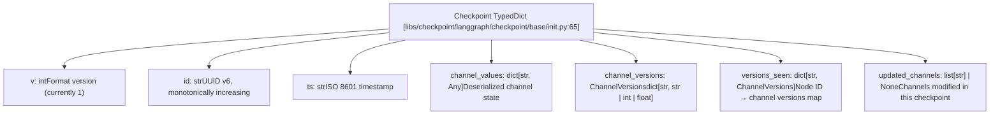
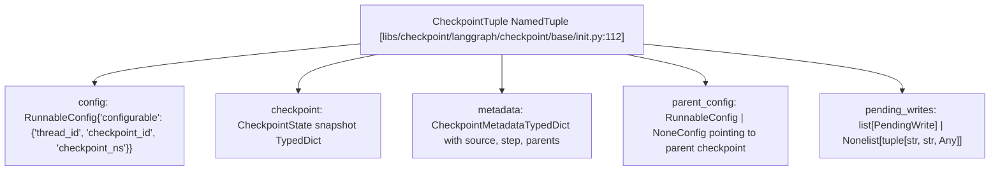
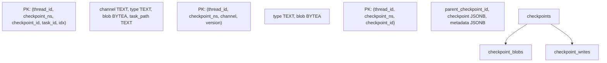

# Checkpointing Architecture

Relevant source files

-   [libs/checkpoint-postgres/langgraph/checkpoint/postgres/\_\_init\_\_.py](https://github.com/langchain-ai/langgraph/blob/1fd51e8f/libs/checkpoint-postgres/langgraph/checkpoint/postgres/__init__.py)
-   [libs/checkpoint-postgres/langgraph/checkpoint/postgres/aio.py](https://github.com/langchain-ai/langgraph/blob/1fd51e8f/libs/checkpoint-postgres/langgraph/checkpoint/postgres/aio.py)
-   [libs/checkpoint-postgres/langgraph/checkpoint/postgres/base.py](https://github.com/langchain-ai/langgraph/blob/1fd51e8f/libs/checkpoint-postgres/langgraph/checkpoint/postgres/base.py)
-   [libs/checkpoint-postgres/langgraph/checkpoint/postgres/shallow.py](https://github.com/langchain-ai/langgraph/blob/1fd51e8f/libs/checkpoint-postgres/langgraph/checkpoint/postgres/shallow.py)
-   [libs/checkpoint-postgres/tests/test\_async.py](https://github.com/langchain-ai/langgraph/blob/1fd51e8f/libs/checkpoint-postgres/tests/test_async.py)
-   [libs/checkpoint-postgres/tests/test\_sync.py](https://github.com/langchain-ai/langgraph/blob/1fd51e8f/libs/checkpoint-postgres/tests/test_sync.py)
-   [libs/checkpoint-sqlite/langgraph/checkpoint/sqlite/\_\_init\_\_.py](https://github.com/langchain-ai/langgraph/blob/1fd51e8f/libs/checkpoint-sqlite/langgraph/checkpoint/sqlite/__init__.py)
-   [libs/checkpoint-sqlite/langgraph/checkpoint/sqlite/aio.py](https://github.com/langchain-ai/langgraph/blob/1fd51e8f/libs/checkpoint-sqlite/langgraph/checkpoint/sqlite/aio.py)
-   [libs/checkpoint-sqlite/langgraph/checkpoint/sqlite/utils.py](https://github.com/langchain-ai/langgraph/blob/1fd51e8f/libs/checkpoint-sqlite/langgraph/checkpoint/sqlite/utils.py)
-   [libs/checkpoint-sqlite/tests/test\_aiosqlite.py](https://github.com/langchain-ai/langgraph/blob/1fd51e8f/libs/checkpoint-sqlite/tests/test_aiosqlite.py)
-   [libs/checkpoint-sqlite/tests/test\_sqlite.py](https://github.com/langchain-ai/langgraph/blob/1fd51e8f/libs/checkpoint-sqlite/tests/test_sqlite.py)
-   [libs/checkpoint/langgraph/checkpoint/base/\_\_init\_\_.py](https://github.com/langchain-ai/langgraph/blob/1fd51e8f/libs/checkpoint/langgraph/checkpoint/base/__init__.py)
-   [libs/checkpoint/langgraph/checkpoint/memory/\_\_init\_\_.py](https://github.com/langchain-ai/langgraph/blob/1fd51e8f/libs/checkpoint/langgraph/checkpoint/memory/__init__.py)
-   [libs/checkpoint/langgraph/checkpoint/serde/types.py](https://github.com/langchain-ai/langgraph/blob/1fd51e8f/libs/checkpoint/langgraph/checkpoint/serde/types.py)
-   [libs/checkpoint/tests/test\_memory.py](https://github.com/langchain-ai/langgraph/blob/1fd51e8f/libs/checkpoint/tests/test_memory.py)

## Purpose and Scope

This document describes the checkpointing architecture that enables LangGraph's durable, stateful execution. Checkpoints capture the complete state of a graph at specific points in time, enabling persistence, resumability, time-travel debugging, and human-in-the-loop workflows.

This page covers the checkpoint data model (`Checkpoint`, `CheckpointTuple`, `CheckpointMetadata`), the `BaseCheckpointSaver` abstract interface (`get_tuple`, `list`, `put`, `put_writes`, `delete_thread` and their async counterparts), and how the Pregel execution loop interacts with the checkpointer. For concrete implementations (InMemorySaver, SqliteSaver, PostgresSaver), see page 4.2. For serialization details, see page 4.4. For time-travel and state forking capabilities, see page 4.5.

---

## Core Data Structures

The checkpoint system is built around three primary data structures that work together to capture and restore graph state.

### Checkpoint TypedDict

The `Checkpoint` TypedDict ([libs/checkpoint/langgraph/checkpoint/base/\_\_init\_\_.py65-97](https://github.com/langchain-ai/langgraph/blob/1fd51e8f/libs/checkpoint/langgraph/checkpoint/base/__init__.py#L65-L97)) represents a complete snapshot of graph state at a specific point in time.

**Checkpoint Structure Diagram**:

Sources: [libs/checkpoint/langgraph/checkpoint/base/\_\_init\_\_.py65-97](https://github.com/langchain-ai/langgraph/blob/1fd51e8f/libs/checkpoint/langgraph/checkpoint/base/__init__.py#L65-L97)

**Checkpoint Structure Fields**:

| Field | Type | Description |
| --- | --- | --- |
| `v` | `int` | Checkpoint format version (currently `1`) |
| `id` | `str` | Unique identifier generated via `uuid6`, monotonically increasing |
| `ts` | `str` | Creation timestamp in ISO 8601 format |
| `channel_values` | `dict[str, Any]` | Deserialized state values indexed by channel name |
| `channel_versions` | `ChannelVersions` | Version identifier for each channel (str/int/float) |
| `versions_seen` | `dict[str, ChannelVersions]` | Maps node ID to channel versions that node has processed |
| `updated_channels` | `list[str] | None` | List of channel names modified in this checkpoint |

The `id` field uses UUID v6 ([libs/checkpoint/langgraph/checkpoint/base/\_\_init\_\_.py17](https://github.com/langchain-ai/langgraph/blob/1fd51e8f/libs/checkpoint/langgraph/checkpoint/base/__init__.py#L17-L17)) which is monotonically increasing, ensuring checkpoints can be sorted chronologically. The `versions_seen` mapping enables the Pregel algorithm to determine which nodes need execution by comparing against `channel_versions`.

Sources: [libs/checkpoint/langgraph/checkpoint/base/\_\_init\_\_.py65-97](https://github.com/langchain-ai/langgraph/blob/1fd51e8f/libs/checkpoint/langgraph/checkpoint/base/__init__.py#L65-L97) [libs/checkpoint/langgraph/checkpoint/base/\_\_init\_\_.py17](https://github.com/langchain-ai/langgraph/blob/1fd51e8f/libs/checkpoint/langgraph/checkpoint/base/__init__.py#L17-L17)

### CheckpointTuple NamedTuple

`CheckpointTuple` ([libs/checkpoint/langgraph/checkpoint/base/\_\_init\_\_.py112-119](https://github.com/langchain-ai/langgraph/blob/1fd51e8f/libs/checkpoint/langgraph/checkpoint/base/__init__.py#L112-L119)) wraps a `Checkpoint` with its associated metadata and configuration.

**CheckpointTuple Relationship Diagram**:

Sources: [libs/checkpoint/langgraph/checkpoint/base/\_\_init\_\_.py112-119](https://github.com/langchain-ai/langgraph/blob/1fd51e8f/libs/checkpoint/langgraph/checkpoint/base/__init__.py#L112-L119)

**CheckpointTuple Fields**:

| Field | Type | Description |
| --- | --- | --- |
| `config` | `RunnableConfig` | Contains `configurable` dict with `thread_id`, `checkpoint_id`, `checkpoint_ns` |
| `checkpoint` | `Checkpoint` | Complete state snapshot TypedDict |
| `metadata` | `CheckpointMetadata` | Metadata TypedDict with `source`, `step`, `parents`, and custom fields |
| `parent_config` | `RunnableConfig | None` | Config pointing to parent checkpoint (enables backward traversal) |
| `pending_writes` | `list[PendingWrite] | None` | List of `(task_id, channel, value)` tuples not yet applied |

The `parent_config` field creates a linked list structure through checkpoint history. The `pending_writes` field (type alias `PendingWrite = tuple[str, str, Any]` from [libs/checkpoint/langgraph/checkpoint/base/\_\_init\_\_.py30](https://github.com/langchain-ai/langgraph/blob/1fd51e8f/libs/checkpoint/langgraph/checkpoint/base/__init__.py#L30-L30)) contains writes recorded via `put_writes()` but not yet incorporated into `channel_values`.

Sources: [libs/checkpoint/langgraph/checkpoint/base/\_\_init\_\_.py112-119](https://github.com/langchain-ai/langgraph/blob/1fd51e8f/libs/checkpoint/langgraph/checkpoint/base/__init__.py#L112-L119) [libs/checkpoint/langgraph/checkpoint/base/\_\_init\_\_.py30](https://github.com/langchain-ai/langgraph/blob/1fd51e8f/libs/checkpoint/langgraph/checkpoint/base/__init__.py#L30-L30)

### CheckpointMetadata TypedDict

`CheckpointMetadata` ([libs/checkpoint/langgraph/checkpoint/base/\_\_init\_\_.py35-61](https://github.com/langchain-ai/langgraph/blob/1fd51e8f/libs/checkpoint/langgraph/checkpoint/base/__init__.py#L35-L61)) stores contextual information about how and why a checkpoint was created.

| Field | Type | Description |
| --- | --- | --- |
| `source` | `"input" | "loop" | "update" | "fork"` | How the checkpoint was created |
| `step` | `int` | Step number (-1 for initial input, 0+ for execution steps) |
| `parents` | `dict[str, str]` | Parent checkpoint IDs by namespace (for nested graphs) |
| `run_id` | `str` | The ID of the run that created this checkpoint |

Sources: [libs/checkpoint/langgraph/checkpoint/base/\_\_init\_\_.py35-61](https://github.com/langchain-ai/langgraph/blob/1fd51e8f/libs/checkpoint/langgraph/checkpoint/base/__init__.py#L35-L61)

The `source` field distinguishes checkpoints created from initial input (`"input"`), during execution loops (`"loop"`), from manual state updates (`"update"`), or from forking existing checkpoints (`"fork"`).

---

## BaseCheckpointSaver Interface

The `BaseCheckpointSaver` abstract class ([libs/checkpoint/langgraph/checkpoint/base/\_\_init\_\_.py122](https://github.com/langchain-ai/langgraph/blob/1fd51e8f/libs/checkpoint/langgraph/checkpoint/base/__init__.py#L122-L122)) defines the contract that all checkpoint implementations must fulfill. It provides both synchronous and asynchronous methods for checkpoint persistence and retrieval.

### Core Methods

**`BaseCheckpointSaver` Functional Map**:

```mermaid
flowchart TD
    get_next_version["get_next_version(current, channel)Generate next channel version ID"]
    serde["serde: SerializerProtocolSerialization (default: JsonPlusSerializer)"]
    put["put(config, checkpoint, metadata, new_versions)Save Checkpoint, returns updated RunnableConfig"]
    put_writes["put_writes(config, writes, task_id, task_path)Save PendingWrite list"]
    aput["aput(...)Async put"]
    aput_writes["aput_writes(...)Async put_writes"]
    get_tuple["get_tuple(config)Retrieve single CheckpointTuple"]
    list["list(config, filter, before, limit)Query CheckpointTuple iterator"]
    aget_tuple["aget_tuple(config)Async get_tuple"]
    alist["alist(config, filter, before, limit)Async list"]
```

Sources: [libs/checkpoint/langgraph/checkpoint/base/\_\_init\_\_.py122-396](https://github.com/langchain-ai/langgraph/blob/1fd51e8f/libs/checkpoint/langgraph/checkpoint/base/__init__.py#L122-L396)

#### Retrieval Pattern

`get_tuple(config)` resolves a checkpoint from a `RunnableConfig`. Two lookup modes are supported based on whether `checkpoint_id` is present in `config["configurable"]`:

-   **With `checkpoint_id`**: retrieves the exact checkpoint matching `(thread_id, checkpoint_ns, checkpoint_id)` via `get_checkpoint_id(config)` ([libs/checkpoint/langgraph/checkpoint/base/\_\_init\_\_.py185-186](https://github.com/langchain-ai/langgraph/blob/1fd51e8f/libs/checkpoint/langgraph/checkpoint/base/__init__.py#L185-L186)).
-   **Without `checkpoint_id`**: retrieves the latest checkpoint for the given `(thread_id, checkpoint_ns)`.

The convenience method `get(config)` ([libs/checkpoint/langgraph/checkpoint/base/\_\_init\_\_.py173](https://github.com/langchain-ai/langgraph/blob/1fd51e8f/libs/checkpoint/langgraph/checkpoint/base/__init__.py#L173-L173)) delegates to `get_tuple()` and returns just the `Checkpoint` dict.

`list(config, filter, before, limit)` ([libs/checkpoint/langgraph/checkpoint/base/\_\_init\_\_.py199](https://github.com/langchain-ai/langgraph/blob/1fd51e8f/libs/checkpoint/langgraph/checkpoint/base/__init__.py#L199-L199)) returns an iterator of `CheckpointTuple` objects, ordered newest-first. The `filter` parameter accepts a dict of metadata fields to match. The `before` parameter accepts a config with a `checkpoint_id` to return only older checkpoints.

Sources: [libs/checkpoint/langgraph/checkpoint/base/\_\_init\_\_.py173-215](https://github.com/langchain-ai/langgraph/blob/1fd51e8f/libs/checkpoint/langgraph/checkpoint/base/__init__.py#L173-L215)

#### Persistence Pattern

`put(config, checkpoint, metadata, new_versions)` ([libs/checkpoint/langgraph/checkpoint/base/\_\_init\_\_.py221](https://github.com/langchain-ai/langgraph/blob/1fd51e8f/libs/checkpoint/langgraph/checkpoint/base/__init__.py#L221-L221)) saves a `Checkpoint` snapshot and returns an updated `RunnableConfig`. The `new_versions` dict maps channel names to their new version identifiers.

`put_writes(config, writes, task_id, task_path)` ([libs/checkpoint/langgraph/checkpoint/base/\_\_init\_\_.py243](https://github.com/langchain-ai/langgraph/blob/1fd51e8f/libs/checkpoint/langgraph/checkpoint/base/__init__.py#L243-L243)) saves a list of `PendingWrite` tuples associated with a specific task execution. These writes are stored separately and surfaced as `pending_writes` on the next `get_tuple()` call.

Sources: [libs/checkpoint/langgraph/checkpoint/base/\_\_init\_\_.py221-259](https://github.com/langchain-ai/langgraph/blob/1fd51e8f/libs/checkpoint/langgraph/checkpoint/base/__init__.py#L221-L259)

---

## Storage Model and Database Schema

Checkpoint implementations typically use a multi-table schema to efficiently store both small primitive values and large complex objects.

### Three-Table Storage Pattern

Persistent checkpoint implementations (Postgres, SQLite) use a three-table logical model, defined in the SQL migrations (e.g., [libs/checkpoint-postgres/langgraph/checkpoint/postgres/base.py37-85](https://github.com/langchain-ai/langgraph/blob/1fd51e8f/libs/checkpoint-postgres/langgraph/checkpoint/postgres/base.py#L37-L85)).

**Database Entity Mapping**:

Sources: [libs/checkpoint-postgres/langgraph/checkpoint/postgres/base.py37-85](https://github.com/langchain-ai/langgraph/blob/1fd51e8f/libs/checkpoint-postgres/langgraph/checkpoint/postgres/base.py#L37-L85) [libs/checkpoint-sqlite/langgraph/checkpoint/sqlite/\_\_init\_\_.py132-157](https://github.com/langchain-ai/langgraph/blob/1fd51e8f/libs/checkpoint-sqlite/langgraph/checkpoint/sqlite/__init__.py#L132-L157)

**Table Roles**:

| Table | Primary Key | Purpose |
| --- | --- | --- |
| `checkpoints` | `(thread_id, checkpoint_ns, checkpoint_id)` | Main checkpoint record; primitive channel values inlined; metadata storage. |
| `checkpoint_blobs` | `(thread_id, checkpoint_ns, channel, version)` | Serialized complex channel values, keyed by channel name and version string. |
| `checkpoint_writes` | `(thread_id, checkpoint_ns, checkpoint_id, task_id, idx)` | Pending writes from `put_writes()`; accumulated per-task before next checkpoint. |

Sources: [libs/checkpoint-postgres/langgraph/checkpoint/postgres/base.py37-85](https://github.com/langchain-ai/langgraph/blob/1fd51e8f/libs/checkpoint-postgres/langgraph/checkpoint/postgres/base.py#L37-L85) [libs/checkpoint-sqlite/langgraph/checkpoint/sqlite/\_\_init\_\_.py132-157](https://github.com/langchain-ai/langgraph/blob/1fd51e8f/libs/checkpoint-sqlite/langgraph/checkpoint/sqlite/__init__.py#L132-L157)

### Value Storage Strategy

Channel values are split across tables based on type. Primitive values are inlined in the `checkpoint` JSON column. Complex objects are serialized via `serde.dumps_typed()` and stored in `checkpoint_blobs`. On retrieval, implementations use a single query with subqueries or joins to reconstruct the full `CheckpointTuple` ([libs/checkpoint-postgres/langgraph/checkpoint/postgres/base.py87-112](https://github.com/langchain-ai/langgraph/blob/1fd51e8f/libs/checkpoint-postgres/langgraph/checkpoint/postgres/base.py#L87-L112)).

**Special Write Index Values** (from `WRITES_IDX_MAP` in [libs/checkpoint/langgraph/checkpoint/base/\_\_init\_\_.py441-448](https://github.com/langchain-ai/langgraph/blob/1fd51e8f/libs/checkpoint/langgraph/checkpoint/base/__init__.py#L441-L448)):

| Constant | Index | Meaning |
| --- | --- | --- |
| `ERROR` | `-1` | Node error write |
| `SCHEDULED` | `-2` | Scheduled task write |
| `INTERRUPT` | `-3` | Interrupt write |
| `RESUME` | `-4` | Resume value write |

Sources: [libs/checkpoint-postgres/langgraph/checkpoint/postgres/base.py87-112](https://github.com/langchain-ai/langgraph/blob/1fd51e8f/libs/checkpoint-postgres/langgraph/checkpoint/postgres/base.py#L87-L112) [libs/checkpoint/langgraph/checkpoint/base/\_\_init\_\_.py441-448](https://github.com/langchain-ai/langgraph/blob/1fd51e8f/libs/checkpoint/langgraph/checkpoint/base/__init__.py#L441-L448)

---

## Checkpoint Lifecycle

Checkpoints flow through a lifecycle as graphs execute, with version tracking ensuring consistent state evolution.

### Creation and Versioning

**Checkpoint Creation Sequence**:

> **[Mermaid sequence]**
> *(图表结构无法解析)*

Sources: [libs/checkpoint-postgres/langgraph/checkpoint/postgres/base.py198-250](https://github.com/langchain-ai/langgraph/blob/1fd51e8f/libs/checkpoint-postgres/langgraph/checkpoint/postgres/base.py#L198-L250) [libs/checkpoint-postgres/langgraph/checkpoint/postgres/\_\_init\_\_.py224-334](https://github.com/langchain-ai/langgraph/blob/1fd51e8f/libs/checkpoint-postgres/langgraph/checkpoint/postgres/__init__.py#L224-L334)

Channel versions are generated by `get_next_version(current, channel)` defined on the checkpointer. The PostgreSQL implementation produces a string of the form `"{step:032}.{random:016}"` ([libs/checkpoint-postgres/langgraph/checkpoint/postgres/base.py262-271](https://github.com/langchain-ai/langgraph/blob/1fd51e8f/libs/checkpoint-postgres/langgraph/checkpoint/postgres/base.py#L262-L271)).

### Pending Writes Lifecycle

Pending writes flow through a two-phase process:

1.  **Phase 1 (Task Execution)**: Node tasks record outputs via `put_writes()`. These are stored in `checkpoint_writes` ([libs/checkpoint-postgres/langgraph/checkpoint/postgres/base.py140-147](https://github.com/langchain-ai/langgraph/blob/1fd51e8f/libs/checkpoint-postgres/langgraph/checkpoint/postgres/base.py#L140-L147)).
2.  **Phase 2 (Next Checkpoint)**: When the next checkpoint is loaded via `get_tuple()`, the `pending_writes` are retrieved ([libs/checkpoint-postgres/langgraph/checkpoint/postgres/base.py104-111](https://github.com/langchain-ai/langgraph/blob/1fd51e8f/libs/checkpoint-postgres/langgraph/checkpoint/postgres/base.py#L104-L111)). The Pregel loop applies these writes to the channels to move state forward.

Sources: [libs/checkpoint-postgres/langgraph/checkpoint/postgres/base.py104-147](https://github.com/langchain-ai/langgraph/blob/1fd51e8f/libs/checkpoint-postgres/langgraph/checkpoint/postgres/base.py#L104-L147)

---

## Implementation Variants

LangGraph provides multiple checkpoint implementations with different performance and durability characteristics.

**Checkpoint Implementation Summary**:

| Class | Module | Storage | Persistence | Concurrency |
| --- | --- | --- | --- | --- |
| `InMemorySaver` | `langgraph.checkpoint.memory` | `defaultdict` | None (process lifetime) | Sync + async |
| `SqliteSaver` | `langgraph.checkpoint.sqlite` | SQLite file | File-based | Sync only |
| `AsyncSqliteSaver` | `langgraph.checkpoint.sqlite.aio` | SQLite via `aiosqlite` | File-based | Async |
| `PostgresSaver` | `langgraph.checkpoint.postgres` | PostgreSQL | Durable | Sync + pipeline |
| `AsyncPostgresSaver` | `langgraph.checkpoint.postgres.aio` | PostgreSQL | Durable | Async + pipeline |

### Shallow Checkpointing

The `ShallowPostgresSaver` ([libs/checkpoint-postgres/langgraph/checkpoint/postgres/shallow.py169](https://github.com/langchain-ai/langgraph/blob/1fd51e8f/libs/checkpoint-postgres/langgraph/checkpoint/postgres/shallow.py#L169-L169)) is a specialized implementation that only stores the most recent checkpoint and does not retain history. It is deprecated in favor of using `PostgresSaver` with the `durability='exit'` invocation mode.

Sources: [libs/checkpoint/langgraph/checkpoint/memory/\_\_init\_\_.py31](https://github.com/langchain-ai/langgraph/blob/1fd51e8f/libs/checkpoint/langgraph/checkpoint/memory/__init__.py#L31-L31) [libs/checkpoint-sqlite/langgraph/checkpoint/sqlite/\_\_init\_\_.py38](https://github.com/langchain-ai/langgraph/blob/1fd51e8f/libs/checkpoint-sqlite/langgraph/checkpoint/sqlite/__init__.py#L38-L38) [libs/checkpoint-sqlite/langgraph/checkpoint/sqlite/aio.py31](https://github.com/langchain-ai/langgraph/blob/1fd51e8f/libs/checkpoint-sqlite/langgraph/checkpoint/sqlite/aio.py#L31-L31) [libs/checkpoint-postgres/langgraph/checkpoint/postgres/\_\_init\_\_.py32](https://github.com/langchain-ai/langgraph/blob/1fd51e8f/libs/checkpoint-postgres/langgraph/checkpoint/postgres/__init__.py#L32-L32) [libs/checkpoint-postgres/langgraph/checkpoint/postgres/aio.py32](https://github.com/langchain-ai/langgraph/blob/1fd51e8f/libs/checkpoint-postgres/langgraph/checkpoint/postgres/aio.py#L32-L32) [libs/checkpoint-postgres/langgraph/checkpoint/postgres/shallow.py169](https://github.com/langchain-ai/langgraph/blob/1fd51e8f/libs/checkpoint-postgres/langgraph/checkpoint/postgres/shallow.py#L169-L169)

---

## Summary

The checkpointing architecture provides the foundation for LangGraph's durability through:

-   **Structured Data Model**: `Checkpoint` and `CheckpointTuple` capture execution state precisely.
-   **Abstract Interface**: `BaseCheckpointSaver` allows swapping backends (Memory, SQLite, Postgres).
-   **Efficient Storage**: Separation of inlined primitives and blob-stored complex objects.
-   **Pending Writes**: Decoupling task output recording from state application to support interrupts.
-   **Monotonic Versioning**: Monotonically increasing checkpoint and channel IDs for sorting and conflict resolution.

This architecture enables advanced features like time-travel debugging, human-in-the-loop review, and fault-tolerant execution.
