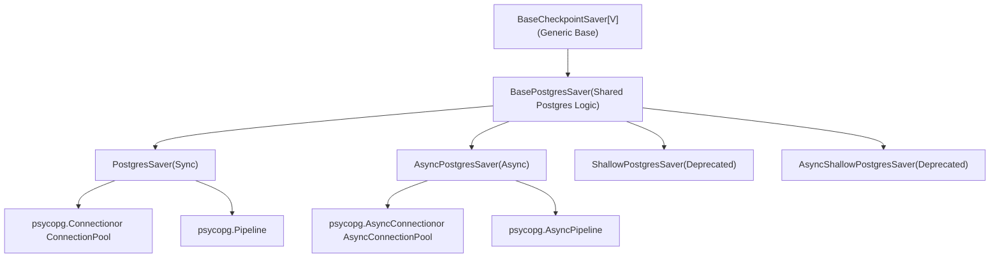
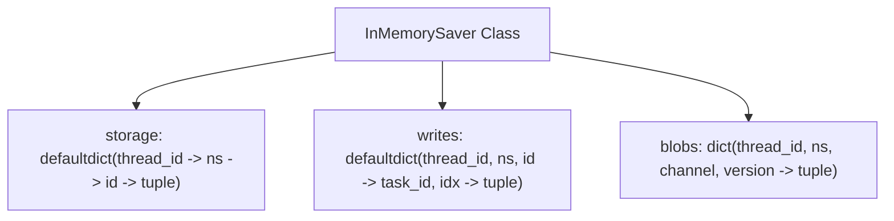
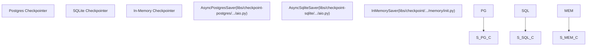

# Checkpoint Implementations

Relevant source files

-   [libs/checkpoint-postgres/langgraph/checkpoint/postgres/\_\_init\_\_.py](https://github.com/langchain-ai/langgraph/blob/1fd51e8f/libs/checkpoint-postgres/langgraph/checkpoint/postgres/__init__.py)
-   [libs/checkpoint-postgres/langgraph/checkpoint/postgres/aio.py](https://github.com/langchain-ai/langgraph/blob/1fd51e8f/libs/checkpoint-postgres/langgraph/checkpoint/postgres/aio.py)
-   [libs/checkpoint-postgres/langgraph/checkpoint/postgres/base.py](https://github.com/langchain-ai/langgraph/blob/1fd51e8f/libs/checkpoint-postgres/langgraph/checkpoint/postgres/base.py)
-   [libs/checkpoint-postgres/langgraph/checkpoint/postgres/shallow.py](https://github.com/langchain-ai/langgraph/blob/1fd51e8f/libs/checkpoint-postgres/langgraph/checkpoint/postgres/shallow.py)
-   [libs/checkpoint-postgres/tests/test\_async.py](https://github.com/langchain-ai/langgraph/blob/1fd51e8f/libs/checkpoint-postgres/tests/test_async.py)
-   [libs/checkpoint-postgres/tests/test\_sync.py](https://github.com/langchain-ai/langgraph/blob/1fd51e8f/libs/checkpoint-postgres/tests/test_sync.py)
-   [libs/checkpoint-sqlite/langgraph/checkpoint/sqlite/\_\_init\_\_.py](https://github.com/langchain-ai/langgraph/blob/1fd51e8f/libs/checkpoint-sqlite/langgraph/checkpoint/sqlite/__init__.py)
-   [libs/checkpoint-sqlite/langgraph/checkpoint/sqlite/aio.py](https://github.com/langchain-ai/langgraph/blob/1fd51e8f/libs/checkpoint-sqlite/langgraph/checkpoint/sqlite/aio.py)
-   [libs/checkpoint-sqlite/langgraph/checkpoint/sqlite/utils.py](https://github.com/langchain-ai/langgraph/blob/1fd51e8f/libs/checkpoint-sqlite/langgraph/checkpoint/sqlite/utils.py)
-   [libs/checkpoint-sqlite/tests/test\_aiosqlite.py](https://github.com/langchain-ai/langgraph/blob/1fd51e8f/libs/checkpoint-sqlite/tests/test_aiosqlite.py)
-   [libs/checkpoint-sqlite/tests/test\_sqlite.py](https://github.com/langchain-ai/langgraph/blob/1fd51e8f/libs/checkpoint-sqlite/tests/test_sqlite.py)
-   [libs/checkpoint/langgraph/checkpoint/base/\_\_init\_\_.py](https://github.com/langchain-ai/langgraph/blob/1fd51e8f/libs/checkpoint/langgraph/checkpoint/base/__init__.py)
-   [libs/checkpoint/langgraph/checkpoint/memory/\_\_init\_\_.py](https://github.com/langchain-ai/langgraph/blob/1fd51e8f/libs/checkpoint/langgraph/checkpoint/memory/__init__.py)
-   [libs/checkpoint/langgraph/checkpoint/serde/types.py](https://github.com/langchain-ai/langgraph/blob/1fd51e8f/libs/checkpoint/langgraph/checkpoint/serde/types.py)
-   [libs/checkpoint/tests/test\_memory.py](https://github.com/langchain-ai/langgraph/blob/1fd51e8f/libs/checkpoint/tests/test_memory.py)

This document describes the concrete implementations of the checkpoint persistence layer. These implementations provide different storage backends for saving and retrieving graph execution state, including PostgreSQL, SQLite, and in-memory options.

For the abstract checkpoint interface and base concepts, see page **4.1** (Checkpointing Architecture). For serialization of checkpoint data, see page **4.4** (Serialization).

---

## Overview

LangGraph provides multiple checkpoint saver implementations, each suited for different use cases:

| Implementation | Module | Async Support | Production Ready | Use Case |
| --- | --- | --- | --- | --- |
| `PostgresSaver` | `langgraph.checkpoint.postgres` | Yes (`AsyncPostgresSaver`) | ✓ | Production workloads, full history |
| `SqliteSaver` | `langgraph.checkpoint.sqlite` | Yes (`AsyncSqliteSaver`) | Limited | Local development, small projects |
| `InMemorySaver` | `langgraph.checkpoint.memory` | Yes (native async) | ✗ | Testing, debugging |
| `ShallowPostgresSaver` / `AsyncShallowPostgresSaver` | `langgraph.checkpoint.postgres.shallow` | Yes | Deprecated | Replaced by `durability='exit'` mode |

All implementations inherit from `BaseCheckpointSaver` [libs/checkpoint/langgraph/checkpoint/base/\_\_init\_\_.py122-155](https://github.com/langchain-ai/langgraph/blob/1fd51e8f/libs/checkpoint/langgraph/checkpoint/base/__init__.py#L122-L155) and must implement the following core methods:

-   `get_tuple()` / `aget_tuple()` - Retrieve a checkpoint [libs/checkpoint/langgraph/checkpoint/base/\_\_init\_\_.py185-197](https://github.com/langchain-ai/langgraph/blob/1fd51e8f/libs/checkpoint/langgraph/checkpoint/base/__init__.py#L185-L197)
-   `list()` / `alist()` - List checkpoints with filtering [libs/checkpoint/langgraph/checkpoint/base/\_\_init\_\_.py199-231](https://github.com/langchain-ai/langgraph/blob/1fd51e8f/libs/checkpoint/langgraph/checkpoint/base/__init__.py#L199-L231)
-   `put()` / `aput()` - Save a checkpoint [libs/checkpoint/langgraph/checkpoint/base/\_\_init\_\_.py233-261](https://github.com/langchain-ai/langgraph/blob/1fd51e8f/libs/checkpoint/langgraph/checkpoint/base/__init__.py#L233-L261)
-   `put_writes()` / `aput_writes()` - Save intermediate writes [libs/checkpoint/langgraph/checkpoint/base/\_\_init\_\_.py263-286](https://github.com/langchain-ai/langgraph/blob/1fd51e8f/libs/checkpoint/langgraph/checkpoint/base/__init__.py#L263-L286)

**Sources:** [libs/checkpoint/langgraph/checkpoint/base/\_\_init\_\_.py122-286](https://github.com/langchain-ai/langgraph/blob/1fd51e8f/libs/checkpoint/langgraph/checkpoint/base/__init__.py#L122-L286) [libs/checkpoint-postgres/langgraph/checkpoint/postgres/\_\_init\_\_.py32-35](https://github.com/langchain-ai/langgraph/blob/1fd51e8f/libs/checkpoint-postgres/langgraph/checkpoint/postgres/__init__.py#L32-L35) [libs/checkpoint-sqlite/langgraph/checkpoint/sqlite/\_\_init\_\_.py38-47](https://github.com/langchain-ai/langgraph/blob/1fd51e8f/libs/checkpoint-sqlite/langgraph/checkpoint/sqlite/__init__.py#L38-L47) [libs/checkpoint/langgraph/checkpoint/memory/\_\_init\_\_.py31-64](https://github.com/langchain-ai/langgraph/blob/1fd51e8f/libs/checkpoint/langgraph/checkpoint/memory/__init__.py#L31-L64)

---

## PostgreSQL Implementation

### Class Hierarchy


**Sources:** [libs/checkpoint-postgres/langgraph/checkpoint/postgres/base.py156-165](https://github.com/langchain-ai/langgraph/blob/1fd51e8f/libs/checkpoint-postgres/langgraph/checkpoint/postgres/base.py#L156-L165) [libs/checkpoint-postgres/langgraph/checkpoint/postgres/\_\_init\_\_.py32-53](https://github.com/langchain-ai/langgraph/blob/1fd51e8f/libs/checkpoint-postgres/langgraph/checkpoint/postgres/__init__.py#L32-L53) [libs/checkpoint-postgres/langgraph/checkpoint/postgres/aio.py32-54](https://github.com/langchain-ai/langgraph/blob/1fd51e8f/libs/checkpoint-postgres/langgraph/checkpoint/postgres/aio.py#L32-L54) [libs/checkpoint-postgres/langgraph/checkpoint/postgres/shallow.py169-183](https://github.com/langchain-ai/langgraph/blob/1fd51e8f/libs/checkpoint-postgres/langgraph/checkpoint/postgres/shallow.py#L169-L183)

### Database Schema

The PostgreSQL implementation uses several tables to store checkpoint data, optimized to handle both small primitive values and large binary objects:


The schema is designed with two key optimizations:

1.  **Blob Separation**: The `checkpoints` table stores the checkpoint structure as JSONB [libs/checkpoint-postgres/langgraph/checkpoint/postgres/base.py41-50](https://github.com/langchain-ai/langgraph/blob/1fd51e8f/libs/checkpoint-postgres/langgraph/checkpoint/postgres/base.py#L41-L50) but complex channel values are stored in the `checkpoint_blobs` table [libs/checkpoint-postgres/langgraph/checkpoint/postgres/base.py51-59](https://github.com/langchain-ai/langgraph/blob/1fd51e8f/libs/checkpoint-postgres/langgraph/checkpoint/postgres/base.py#L51-L59)
2.  **Write Separation**: The `checkpoint_writes` table stores intermediate task outputs separately, allowing the system to handle multi-step execution and pending writes [libs/checkpoint-postgres/langgraph/checkpoint/postgres/base.py60-70](https://github.com/langchain-ai/langgraph/blob/1fd51e8f/libs/checkpoint-postgres/langgraph/checkpoint/postgres/base.py#L60-L70)

**Sources:** [libs/checkpoint-postgres/langgraph/checkpoint/postgres/base.py37-85](https://github.com/langchain-ai/langgraph/blob/1fd51e8f/libs/checkpoint-postgres/langgraph/checkpoint/postgres/base.py#L37-L85)

### PostgresSaver

The synchronous `PostgresSaver` class provides checkpoint persistence using psycopg3's synchronous API.

#### Connection Modes

The implementation supports multiple connection modes [libs/checkpoint-postgres/langgraph/checkpoint/postgres/\_\_init\_\_.py37-53](https://github.com/langchain-ai/langgraph/blob/1fd51e8f/libs/checkpoint-postgres/langgraph/checkpoint/postgres/__init__.py#L37-L53):

| Mode | Connection Type | Use Case |
| --- | --- | --- |
| Single Connection | `psycopg.Connection` | Simple applications |
| Connection Pool | `psycopg_pool.ConnectionPool` | Multi-threaded apps |
| Pipeline Mode | `psycopg.Pipeline` | High throughput batching |

```
# Single connection with context managerwith PostgresSaver.from_conn_string(conn_string) as saver:    saver.setup()    # With pipelinewith PostgresSaver.from_conn_string(conn_string, pipeline=True) as saver:    saver.setup()
```
**Sources:** [libs/checkpoint-postgres/langgraph/checkpoint/postgres/\_\_init\_\_.py54-76](https://github.com/langchain-ai/langgraph/blob/1fd51e8f/libs/checkpoint-postgres/langgraph/checkpoint/postgres/__init__.py#L54-L76)

#### Migration System

The PostgreSQL implementation includes a versioned migration system [libs/checkpoint-postgres/langgraph/checkpoint/postgres/base.py37-85](https://github.com/langchain-ai/langgraph/blob/1fd51e8f/libs/checkpoint-postgres/langgraph/checkpoint/postgres/base.py#L37-L85) The `setup()` method automatically runs any pending migrations tracked in `checkpoint_migrations` [libs/checkpoint-postgres/langgraph/checkpoint/postgres/\_\_init\_\_.py77-102](https://github.com/langchain-ai/langgraph/blob/1fd51e8f/libs/checkpoint-postgres/langgraph/checkpoint/postgres/__init__.py#L77-L102)

#### Key Operations

**Checkpoint Retrieval (get\_tuple)** The `get_tuple()` method \[libs/checkpoint-postgres/langgraph/checkpoint/postgres/**init**.py:184-253\] queries the `checkpoints` table. It uses a complex `SELECT_SQL` query [libs/checkpoint-postgres/langgraph/checkpoint/postgres/base.py87-112](https://github.com/langchain-ai/langgraph/blob/1fd51e8f/libs/checkpoint-postgres/langgraph/checkpoint/postgres/base.py#L87-L112) that joins with `checkpoint_blobs` to reconstruct the full state.

**Checkpoint Storage (put)** The `put()` method [libs/checkpoint-postgres/langgraph/checkpoint/postgres/\_\_init\_\_.py255-334](https://github.com/langchain-ai/langgraph/blob/1fd51e8f/libs/checkpoint-postgres/langgraph/checkpoint/postgres/__init__.py#L255-L334) performs an upsert. It extracts channel values and stores them using `UPSERT_CHECKPOINT_BLOBS_SQL` [libs/checkpoint-postgres/langgraph/checkpoint/postgres/base.py125-129](https://github.com/langchain-ai/langgraph/blob/1fd51e8f/libs/checkpoint-postgres/langgraph/checkpoint/postgres/base.py#L125-L129) and `UPSERT_CHECKPOINTS_SQL` [libs/checkpoint-postgres/langgraph/checkpoint/postgres/base.py131-138](https://github.com/langchain-ai/langgraph/blob/1fd51e8f/libs/checkpoint-postgres/langgraph/checkpoint/postgres/base.py#L131-L138)

**Sources:** [libs/checkpoint-postgres/langgraph/checkpoint/postgres/base.py87-147](https://github.com/langchain-ai/langgraph/blob/1fd51e8f/libs/checkpoint-postgres/langgraph/checkpoint/postgres/base.py#L87-L147) [libs/checkpoint-postgres/langgraph/checkpoint/postgres/\_\_init\_\_.py184-334](https://github.com/langchain-ai/langgraph/blob/1fd51e8f/libs/checkpoint-postgres/langgraph/checkpoint/postgres/__init__.py#L184-L334)

---

## SQLite Implementation

### SqliteSaver

The `SqliteSaver` class provides a lightweight checkpoint implementation using SQLite [libs/checkpoint-sqlite/langgraph/checkpoint/sqlite/\_\_init\_\_.py38-73](https://github.com/langchain-ai/langgraph/blob/1fd51e8f/libs/checkpoint-sqlite/langgraph/checkpoint/sqlite/__init__.py#L38-L73)

#### Schema

The SQLite schema is simpler than Postgres, using two primary tables: `checkpoints` and `writes` [libs/checkpoint-sqlite/langgraph/checkpoint/sqlite/\_\_init\_\_.py135-157](https://github.com/langchain-ai/langgraph/blob/1fd51e8f/libs/checkpoint-sqlite/langgraph/checkpoint/sqlite/__init__.py#L135-L157)


#### Thread Safety

`SqliteSaver` uses a `threading.Lock` [libs/checkpoint-sqlite/langgraph/checkpoint/sqlite/\_\_init\_\_.py88](https://github.com/langchain-ai/langgraph/blob/1fd51e8f/libs/checkpoint-sqlite/langgraph/checkpoint/sqlite/__init__.py#L88-L88) to ensure thread-safe access to the database connection, as SQLite's write performance is limited in multi-threaded environments [libs/checkpoint-sqlite/langgraph/checkpoint/sqlite/\_\_init\_\_.py41-44](https://github.com/langchain-ai/langgraph/blob/1fd51e8f/libs/checkpoint-sqlite/langgraph/checkpoint/sqlite/__init__.py#L41-L44)

**Sources:** [libs/checkpoint-sqlite/langgraph/checkpoint/sqlite/\_\_init\_\_.py132-157](https://github.com/langchain-ai/langgraph/blob/1fd51e8f/libs/checkpoint-sqlite/langgraph/checkpoint/sqlite/__init__.py#L132-L157) [libs/checkpoint-sqlite/langgraph/checkpoint/sqlite/\_\_init\_\_.py161-182](https://github.com/langchain-ai/langgraph/blob/1fd51e8f/libs/checkpoint-sqlite/langgraph/checkpoint/sqlite/__init__.py#L161-L182)

### AsyncSqliteSaver

The `AsyncSqliteSaver` class provides async support using `aiosqlite` [libs/checkpoint-sqlite/langgraph/checkpoint/sqlite/aio.py31-44](https://github.com/langchain-ai/langgraph/blob/1fd51e8f/libs/checkpoint-sqlite/langgraph/checkpoint/sqlite/aio.py#L31-L44)

```
async with AsyncSqliteSaver.from_conn_string("checkpoints.db") as saver:    graph = builder.compile(checkpointer=saver)    # ... execution ...
```
**Sources:** [libs/checkpoint-sqlite/langgraph/checkpoint/sqlite/aio.py124-138](https://github.com/langchain-ai/langgraph/blob/1fd51e8f/libs/checkpoint-sqlite/langgraph/checkpoint/sqlite/aio.py#L124-L138)

---

## InMemory Implementation

### InMemorySaver

The `InMemorySaver` class stores checkpoints in memory using nested `defaultdict` structures [libs/checkpoint/langgraph/checkpoint/memory/\_\_init\_\_.py31-64](https://github.com/langchain-ai/langgraph/blob/1fd51e8f/libs/checkpoint/langgraph/checkpoint/memory/__init__.py#L31-L64)

#### Storage Structure


The internal storage [libs/checkpoint/langgraph/checkpoint/memory/\_\_init\_\_.py67-81](https://github.com/langchain-ai/langgraph/blob/1fd51e8f/libs/checkpoint/langgraph/checkpoint/memory/__init__.py#L67-L81) maps:

-   `storage`: Maps thread and namespace to checkpoint data.
-   `writes`: Maps checkpoint IDs to task writes.
-   `blobs`: Maps channel versions to serialized data.

**Sources:** [libs/checkpoint/langgraph/checkpoint/memory/\_\_init\_\_.py66-92](https://github.com/langchain-ai/langgraph/blob/1fd51e8f/libs/checkpoint/langgraph/checkpoint/memory/__init__.py#L66-L92)

#### Usage and Persistence

While primarily for testing, it can be made persistent using the `PersistentDict` factory [libs/checkpoint/langgraph/checkpoint/memory/\_\_init\_\_.py533-604](https://github.com/langchain-ai/langgraph/blob/1fd51e8f/libs/checkpoint/langgraph/checkpoint/memory/__init__.py#L533-L604) which pickles the data to disk.

---

## Implementation Comparison

### Feature Matrix

| Feature | PostgresSaver | SqliteSaver | InMemorySaver |
| --- | --- | --- | --- |
| **Backend** | PostgreSQL | SQLite | Memory (RAM) |
| **Async Support** | Native (`AsyncPostgresSaver`) | Native (`AsyncSqliteSaver`) | Native |
| **Durability** | High | Medium | Low (Process life) |
| **Blob Handling** | Separate Table | Inline BLOB | Dictionary |
| **Time Travel** | Supported | Supported | Supported |

### Code Entity Association


**Sources:** [libs/checkpoint-postgres/langgraph/checkpoint/postgres/aio.py32-33](https://github.com/langchain-ai/langgraph/blob/1fd51e8f/libs/checkpoint-postgres/langgraph/checkpoint/postgres/aio.py#L32-L33) [libs/checkpoint-sqlite/langgraph/checkpoint/sqlite/aio.py31-32](https://github.com/langchain-ai/langgraph/blob/1fd51e8f/libs/checkpoint-sqlite/langgraph/checkpoint/sqlite/aio.py#L31-L32) [libs/checkpoint/langgraph/checkpoint/memory/\_\_init\_\_.py31-34](https://github.com/langchain-ai/langgraph/blob/1fd51e8f/libs/checkpoint/langgraph/checkpoint/memory/__init__.py#L31-L34)

### Summary of Deprecations

`ShallowPostgresSaver` and `AsyncShallowPostgresSaver` are deprecated as of version 2.0.20 [libs/checkpoint-postgres/langgraph/checkpoint/postgres/shallow.py192-197](https://github.com/langchain-ai/langgraph/blob/1fd51e8f/libs/checkpoint-postgres/langgraph/checkpoint/postgres/shallow.py#L192-L197) Users are encouraged to use `PostgresSaver` with the `durability='exit'` configuration during graph invocation.

**Sources:** [libs/checkpoint-postgres/langgraph/checkpoint/postgres/shallow.py169-197](https://github.com/langchain-ai/langgraph/blob/1fd51e8f/libs/checkpoint-postgres/langgraph/checkpoint/postgres/shallow.py#L169-L197)
