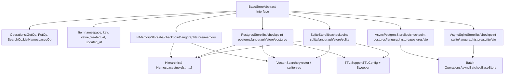
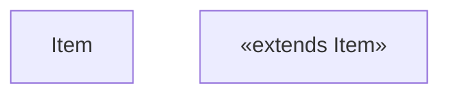
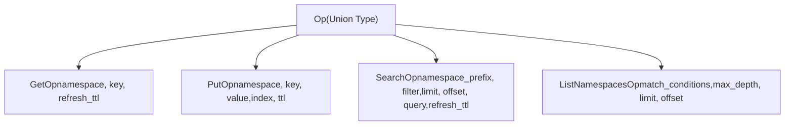
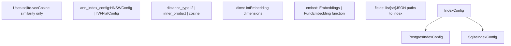

# Store System

Relevant source files

-   [libs/checkpoint-postgres/langgraph/store/postgres/aio.py](https://github.com/langchain-ai/langgraph/blob/1fd51e8f/libs/checkpoint-postgres/langgraph/store/postgres/aio.py)
-   [libs/checkpoint-postgres/langgraph/store/postgres/base.py](https://github.com/langchain-ai/langgraph/blob/1fd51e8f/libs/checkpoint-postgres/langgraph/store/postgres/base.py)
-   [libs/checkpoint-postgres/tests/conftest.py](https://github.com/langchain-ai/langgraph/blob/1fd51e8f/libs/checkpoint-postgres/tests/conftest.py)
-   [libs/checkpoint-postgres/tests/test\_async\_store.py](https://github.com/langchain-ai/langgraph/blob/1fd51e8f/libs/checkpoint-postgres/tests/test_async_store.py)
-   [libs/checkpoint-postgres/tests/test\_store.py](https://github.com/langchain-ai/langgraph/blob/1fd51e8f/libs/checkpoint-postgres/tests/test_store.py)
-   [libs/checkpoint-sqlite/langgraph/store/sqlite/\_\_init\_\_.py](https://github.com/langchain-ai/langgraph/blob/1fd51e8f/libs/checkpoint-sqlite/langgraph/store/sqlite/__init__.py)
-   [libs/checkpoint-sqlite/langgraph/store/sqlite/aio.py](https://github.com/langchain-ai/langgraph/blob/1fd51e8f/libs/checkpoint-sqlite/langgraph/store/sqlite/aio.py)
-   [libs/checkpoint-sqlite/langgraph/store/sqlite/base.py](https://github.com/langchain-ai/langgraph/blob/1fd51e8f/libs/checkpoint-sqlite/langgraph/store/sqlite/base.py)
-   [libs/checkpoint-sqlite/tests/test\_async\_store.py](https://github.com/langchain-ai/langgraph/blob/1fd51e8f/libs/checkpoint-sqlite/tests/test_async_store.py)
-   [libs/checkpoint-sqlite/tests/test\_store.py](https://github.com/langchain-ai/langgraph/blob/1fd51e8f/libs/checkpoint-sqlite/tests/test_store.py)
-   [libs/checkpoint-sqlite/tests/test\_ttl.py](https://github.com/langchain-ai/langgraph/blob/1fd51e8f/libs/checkpoint-sqlite/tests/test_ttl.py)
-   [libs/checkpoint/langgraph/store/base/\_\_init\_\_.py](https://github.com/langchain-ai/langgraph/blob/1fd51e8f/libs/checkpoint/langgraph/store/base/__init__.py)
-   [libs/checkpoint/langgraph/store/base/batch.py](https://github.com/langchain-ai/langgraph/blob/1fd51e8f/libs/checkpoint/langgraph/store/base/batch.py)
-   [libs/checkpoint/langgraph/store/base/embed.py](https://github.com/langchain-ai/langgraph/blob/1fd51e8f/libs/checkpoint/langgraph/store/base/embed.py)
-   [libs/checkpoint/langgraph/store/memory/\_\_init\_\_.py](https://github.com/langchain-ai/langgraph/blob/1fd51e8f/libs/checkpoint/langgraph/store/memory/__init__.py)
-   [libs/checkpoint/tests/test\_store.py](https://github.com/langchain-ai/langgraph/blob/1fd51e8f/libs/checkpoint/tests/test_store.py)
-   [libs/langgraph/tests/memory\_assert.py](https://github.com/langchain-ai/langgraph/blob/1fd51e8f/libs/langgraph/tests/memory_assert.py)

The Store System provides persistent key-value storage with hierarchical namespaces for LangGraph applications. It enables long-term memory that persists across threads and conversations, with optional vector search and TTL (time-to-live) capabilities.

**Scope**: This page covers the Store interface, operations, implementations, and data model. For graph state persistence via checkpointing, see [Checkpointing Architecture](/langchain-ai/langgraph/4.1-checkpointing-architecture). For checkpoint implementations, see [Checkpoint Implementations](/langchain-ai/langgraph/4.2-checkpoint-implementations). For serialization mechanisms, see [Serialization](/langchain-ai/langgraph/4.4-serialization).

---

## Core Architecture

The Store System is built around a base interface with pluggable implementations supporting different storage backends, including PostgreSQL, SQLite, and In-Memory variants.

### Store System Overview

**Code Entity Mapping**:

-   `BaseStore`: Abstract interface at [libs/checkpoint/langgraph/store/base/\_\_init\_\_.py700-721](https://github.com/langchain-ai/langgraph/blob/1fd51e8f/libs/checkpoint/langgraph/store/base/__init__.py#L700-L721)
-   `InMemoryStore`: In-memory implementation at [libs/checkpoint/langgraph/store/memory/\_\_init\_\_.py136-174](https://github.com/langchain-ai/langgraph/blob/1fd51e8f/libs/checkpoint/langgraph/store/memory/__init__.py#L136-L174)
-   `PostgresStore`: PostgreSQL sync implementation at [libs/checkpoint-postgres/langgraph/store/postgres/base.py640-716](https://github.com/langchain-ai/langgraph/blob/1fd51e8f/libs/checkpoint-postgres/langgraph/store/postgres/base.py#L640-L716)
-   `SqliteStore`: SQLite sync implementation at [libs/checkpoint-sqlite/langgraph/store/sqlite/base.py211-218](https://github.com/langchain-ai/langgraph/blob/1fd51e8f/libs/checkpoint-sqlite/langgraph/store/sqlite/base.py#L211-L218)
-   `AsyncPostgresStore`: PostgreSQL async implementation with batching at [libs/checkpoint-postgres/langgraph/store/postgres/aio.py42-118](https://github.com/langchain-ai/langgraph/blob/1fd51e8f/libs/checkpoint-postgres/langgraph/store/postgres/aio.py#L42-L118)
-   `AsyncSqliteStore`: SQLite async implementation with batching at [libs/checkpoint-sqlite/langgraph/store/sqlite/aio.py39-87](https://github.com/langchain-ai/langgraph/blob/1fd51e8f/libs/checkpoint-sqlite/langgraph/store/sqlite/aio.py#L39-L87)

**Sources**: [libs/checkpoint/langgraph/store/base/\_\_init\_\_.py700-721](https://github.com/langchain-ai/langgraph/blob/1fd51e8f/libs/checkpoint/langgraph/store/base/__init__.py#L700-L721) [libs/checkpoint-postgres/langgraph/store/postgres/base.py640-716](https://github.com/langchain-ai/langgraph/blob/1fd51e8f/libs/checkpoint-postgres/langgraph/store/postgres/base.py#L640-L716) [libs/checkpoint-sqlite/langgraph/store/sqlite/base.py211-218](https://github.com/langchain-ai/langgraph/blob/1fd51e8f/libs/checkpoint-sqlite/langgraph/store/sqlite/base.py#L211-L218) [libs/checkpoint/langgraph/store/memory/\_\_init\_\_.py136-174](https://github.com/langchain-ai/langgraph/blob/1fd51e8f/libs/checkpoint/langgraph/store/memory/__init__.py#L136-L174) [libs/checkpoint-postgres/langgraph/store/postgres/aio.py42-118](https://github.com/langchain-ai/langgraph/blob/1fd51e8f/libs/checkpoint-postgres/langgraph/store/postgres/aio.py#L42-L118) [libs/checkpoint-sqlite/langgraph/store/sqlite/aio.py39-87](https://github.com/langchain-ai/langgraph/blob/1fd51e8f/libs/checkpoint-sqlite/langgraph/store/sqlite/aio.py#L39-L87)

---

## Base Store Interface

### BaseStore Class

The `BaseStore` abstract class defines the storage interface with both synchronous and asynchronous methods.

| Method | Description | Returns |
| --- | --- | --- |
| `batch(ops)` | Execute multiple operations synchronously | `list[Result]` |
| `abatch(ops)` | Execute multiple operations asynchronously | `list[Result]` |
| `get(namespace, key)` | Retrieve a single item | `Item | None` |
| `put(namespace, key, value)` | Store or update an item | `None` |
| `search(namespace_prefix, ...)` | Search items with filters | `list[SearchItem]` |
| `delete(namespace, key)` | Delete an item | `None` |
| `list_namespaces(...)` | List namespaces with filters | `list[tuple[str, ...]]` |

**Sources**: [libs/checkpoint/langgraph/store/base/\_\_init\_\_.py700-995](https://github.com/langchain-ai/langgraph/blob/1fd51e8f/libs/checkpoint/langgraph/store/base/__init__.py#L700-L995)

### Item Data Model

The `Item` class represents a stored document with metadata.

**Sources**: [libs/checkpoint/langgraph/store/base/\_\_init\_\_.py51-116](https://github.com/langchain-ai/langgraph/blob/1fd51e8f/libs/checkpoint/langgraph/store/base/__init__.py#L51-L116) [libs/checkpoint/langgraph/store/base/\_\_init\_\_.py118-155](https://github.com/langchain-ai/langgraph/blob/1fd51e8f/libs/checkpoint/langgraph/store/base/__init__.py#L118-L155)

---

## Operations

### Operation Types

The Store System uses typed operations for batch processing:

**Sources**: [libs/checkpoint/langgraph/store/base/\_\_init\_\_.py157-201](https://github.com/langchain-ai/langgraph/blob/1fd51e8f/libs/checkpoint/langgraph/store/base/__init__.py#L157-L201) [libs/checkpoint/langgraph/store/base/\_\_init\_\_.py203-308](https://github.com/langchain-ai/langgraph/blob/1fd51e8f/libs/checkpoint/langgraph/store/base/__init__.py#L203-L308) [libs/checkpoint/langgraph/store/base/\_\_init\_\_.py431-535](https://github.com/langchain-ai/langgraph/blob/1fd51e8f/libs/checkpoint/langgraph/store/base/__init__.py#L431-L535) [libs/checkpoint/langgraph/store/base/\_\_init\_\_.py368-429](https://github.com/langchain-ai/langgraph/blob/1fd51e8f/libs/checkpoint/langgraph/store/base/__init__.py#L368-L429)

### PutOp - Store Items

Stores or updates an item. Setting `value=None` deletes the item.

**Parameters**:

-   `namespace`: Hierarchical path as tuple
-   `key`: Unique identifier
-   `value`: Dictionary data or `None` for deletion
-   `index`: Field paths to index for search (default: uses store config)
-   `ttl`: Time-to-live in minutes (optional)

**Sources**: [libs/checkpoint/langgraph/store/base/\_\_init\_\_.py431-535](https://github.com/langchain-ai/langgraph/blob/1fd51e8f/libs/checkpoint/langgraph/store/base/__init__.py#L431-L535)

---

## Hierarchical Namespaces

Namespaces organize data in a hierarchical structure similar to file system paths.

### Namespace Structure

**Namespace Rules**:

1.  Represented as tuples of strings [libs/checkpoint/langgraph/store/base/\_\_init\_\_.py57-59](https://github.com/langchain-ai/langgraph/blob/1fd51e8f/libs/checkpoint/langgraph/store/base/__init__.py#L57-L59)
2.  Cannot be empty tuple `()` [libs/checkpoint/langgraph/store/base/batch.py141](https://github.com/langchain-ai/langgraph/blob/1fd51e8f/libs/checkpoint/langgraph/store/base/batch.py#L141-L141)
3.  Individual components cannot contain dots (`.`) in certain implementations (Postgres/SQLite) [libs/checkpoint-postgres/langgraph/store/postgres/base.py1561-1590](https://github.com/langchain-ai/langgraph/blob/1fd51e8f/libs/checkpoint-postgres/langgraph/store/postgres/base.py#L1561-L1590) [libs/checkpoint-sqlite/langgraph/store/sqlite/base.py96-102](https://github.com/langchain-ai/langgraph/blob/1fd51e8f/libs/checkpoint-sqlite/langgraph/store/sqlite/base.py#L96-L102)

**Sources**: [libs/checkpoint/langgraph/store/base/\_\_init\_\_.py57-59](https://github.com/langchain-ai/langgraph/blob/1fd51e8f/libs/checkpoint/langgraph/store/base/__init__.py#L57-L59) [libs/checkpoint/langgraph/store/base/batch.py141](https://github.com/langchain-ai/langgraph/blob/1fd51e8f/libs/checkpoint/langgraph/store/base/batch.py#L141-L141)

---

## Vector Search

Vector search enables semantic similarity queries using embeddings.

### Vector Search Configuration

**Sources**: [libs/checkpoint/langgraph/store/base/\_\_init\_\_.py570-698](https://github.com/langchain-ai/langgraph/blob/1fd51e8f/libs/checkpoint/langgraph/store/base/__init__.py#L570-L698) [libs/checkpoint-postgres/langgraph/store/postgres/base.py177-233](https://github.com/langchain-ai/langgraph/blob/1fd51e8f/libs/checkpoint-postgres/langgraph/store/postgres/base.py#L177-L233) [libs/checkpoint-sqlite/langgraph/store/sqlite/base.py90-93](https://github.com/langchain-ai/langgraph/blob/1fd51e8f/libs/checkpoint-sqlite/langgraph/store/sqlite/base.py#L90-L93)

---

## TTL Support

Time-to-live (TTL) enables automatic expiration of store items.

### TTL Configuration

The `TTLConfig` controls expiration behavior [libs/checkpoint/langgraph/store/base/\_\_init\_\_.py545-568](https://github.com/langchain-ai/langgraph/blob/1fd51e8f/libs/checkpoint/langgraph/store/base/__init__.py#L545-L568)

| Field | Description |
| --- | --- |
| `default_ttl` | Default minutes until expiration |
| `refresh_on_read` | Whether to refresh TTL on get/search |
| `sweep_interval_minutes` | How often to delete expired items |

**Sources**: [libs/checkpoint/langgraph/store/base/\_\_init\_\_.py545-568](https://github.com/langchain-ai/langgraph/blob/1fd51e8f/libs/checkpoint/langgraph/store/base/__init__.py#L545-L568)

---

## Store Implementations

### InMemoryStore

Non-persistent dictionary-backed store for development and testing.

**Implementation Details**:

-   Data stored in: `_data: dict[tuple[str, ...], dict[str, Item]]` [libs/checkpoint/langgraph/store/memory/\_\_init\_\_.py186](https://github.com/langchain-ai/langgraph/blob/1fd51e8f/libs/checkpoint/langgraph/store/memory/__init__.py#L186-L186)
-   Vectors stored in: `_vectors: dict[tuple[str, ...], dict[str, dict[str, list[float]]]]` [libs/checkpoint/langgraph/store/memory/\_\_init\_\_.py188-190](https://github.com/langchain-ai/langgraph/blob/1fd51e8f/libs/checkpoint/langgraph/store/memory/__init__.py#L188-L190)

**Sources**: [libs/checkpoint/langgraph/store/memory/\_\_init\_\_.py136-190](https://github.com/langchain-ai/langgraph/blob/1fd51e8f/libs/checkpoint/langgraph/store/memory/__init__.py#L136-L190)

### PostgresStore & AsyncPostgresStore

Production-ready PostgreSQL-backed store using `pgvector`.

**Key Features**:

-   Sync version uses `psycopg` connection/pool [libs/checkpoint-postgres/langgraph/store/postgres/base.py640-650](https://github.com/langchain-ai/langgraph/blob/1fd51e8f/libs/checkpoint-postgres/langgraph/store/postgres/base.py#L640-L650)
-   Async version supports `AsyncPipeline` and `AsyncConnectionPool` [libs/checkpoint-postgres/langgraph/store/postgres/aio.py133-161](https://github.com/langchain-ai/langgraph/blob/1fd51e8f/libs/checkpoint-postgres/langgraph/store/postgres/aio.py#L133-L161)
-   Supports HNSW and IVFFlat index types [libs/checkpoint-postgres/langgraph/store/postgres/base.py177-218](https://github.com/langchain-ai/langgraph/blob/1fd51e8f/libs/checkpoint-postgres/langgraph/store/postgres/base.py#L177-L218)

**Sources**: [libs/checkpoint-postgres/langgraph/store/postgres/base.py640-650](https://github.com/langchain-ai/langgraph/blob/1fd51e8f/libs/checkpoint-postgres/langgraph/store/postgres/base.py#L640-L650) [libs/checkpoint-postgres/langgraph/store/postgres/aio.py42-161](https://github.com/langchain-ai/langgraph/blob/1fd51e8f/libs/checkpoint-postgres/langgraph/store/postgres/aio.py#L42-L161)

### SqliteStore & AsyncSqliteStore

SQLite-backed store using `sqlite-vec` for vector search.

**Key Features**:

-   Sync version uses `sqlite3` [libs/checkpoint-sqlite/langgraph/store/sqlite/base.py211-218](https://github.com/langchain-ai/langgraph/blob/1fd51e8f/libs/checkpoint-sqlite/langgraph/store/sqlite/base.py#L211-L218)
-   Async version uses `aiosqlite` [libs/checkpoint-sqlite/langgraph/store/sqlite/aio.py89-111](https://github.com/langchain-ai/langgraph/blob/1fd51e8f/libs/checkpoint-sqlite/langgraph/store/sqlite/aio.py#L89-L111)
-   Requires `sqlite-vec` extension for vector search [libs/checkpoint-sqlite/langgraph/store/sqlite/aio.py182-184](https://github.com/langchain-ai/langgraph/blob/1fd51e8f/libs/checkpoint-sqlite/langgraph/store/sqlite/aio.py#L182-L184)

**Sources**: [libs/checkpoint-sqlite/langgraph/store/sqlite/base.py211-218](https://github.com/langchain-ai/langgraph/blob/1fd51e8f/libs/checkpoint-sqlite/langgraph/store/sqlite/base.py#L211-L218) [libs/checkpoint-sqlite/langgraph/store/sqlite/aio.py39-111](https://github.com/langchain-ai/langgraph/blob/1fd51e8f/libs/checkpoint-sqlite/langgraph/store/sqlite/aio.py#L39-L111)

---

## Batching and Async Processing

The `AsyncBatchedBaseStore` class provides an efficient background task for batching store operations.

> **[Mermaid sequence]**
> *(图表结构无法解析)*

**Sources**: [libs/checkpoint/langgraph/store/base/batch.py58-101](https://github.com/langchain-ai/langgraph/blob/1fd51e8f/libs/checkpoint/langgraph/store/base/batch.py#L58-L101) [libs/checkpoint/langgraph/store/base/batch.py368-450](https://github.com/langchain-ai/langgraph/blob/1fd51e8f/libs/checkpoint/langgraph/store/base/batch.py#L368-L450)

---

## Database Schemas

### PostgreSQL Schema

-   `store` table: Primary storage for key-value pairs [libs/checkpoint-postgres/langgraph/store/postgres/base.py64-72](https://github.com/langchain-ai/langgraph/blob/1fd51e8f/libs/checkpoint-postgres/langgraph/store/postgres/base.py#L64-L72)
-   `store_vectors` table: Storage for vector embeddings [libs/checkpoint-postgres/langgraph/store/postgres/base.py104-114](https://github.com/langchain-ai/langgraph/blob/1fd51e8f/libs/checkpoint-postgres/langgraph/store/postgres/base.py#L104-L114)

### SQLite Schema

-   `store` table: Primary storage [libs/checkpoint-sqlite/langgraph/store/sqlite/base.py43-51](https://github.com/langchain-ai/langgraph/blob/1fd51e8f/libs/checkpoint-sqlite/langgraph/store/sqlite/base.py#L43-L51)
-   `store_vectors` table: Storage for vector embeddings [libs/checkpoint-sqlite/langgraph/store/sqlite/base.py76-85](https://github.com/langchain-ai/langgraph/blob/1fd51e8f/libs/checkpoint-sqlite/langgraph/store/sqlite/base.py#L76-L85)

**Sources**: [libs/checkpoint-postgres/langgraph/store/postgres/base.py64-114](https://github.com/langchain-ai/langgraph/blob/1fd51e8f/libs/checkpoint-postgres/langgraph/store/postgres/base.py#L64-L114) [libs/checkpoint-sqlite/langgraph/store/sqlite/base.py43-85](https://github.com/langchain-ai/langgraph/blob/1fd51e8f/libs/checkpoint-sqlite/langgraph/store/sqlite/base.py#L43-L85)
