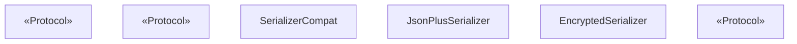
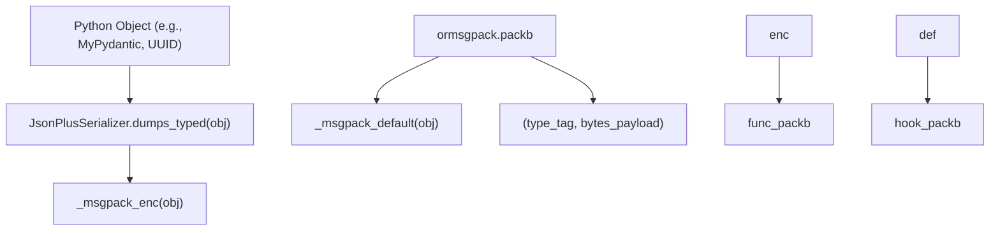
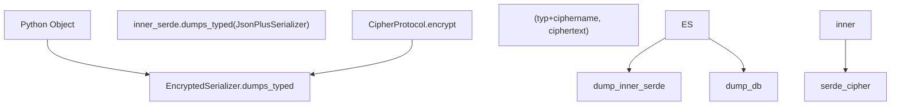

# Serialization

Relevant source files

-   [libs/checkpoint-postgres/uv.lock](https://github.com/langchain-ai/langgraph/blob/1fd51e8f/libs/checkpoint-postgres/uv.lock)
-   [libs/checkpoint-sqlite/uv.lock](https://github.com/langchain-ai/langgraph/blob/1fd51e8f/libs/checkpoint-sqlite/uv.lock)
-   [libs/checkpoint/langgraph/checkpoint/serde/base.py](https://github.com/langchain-ai/langgraph/blob/1fd51e8f/libs/checkpoint/langgraph/checkpoint/serde/base.py)
-   [libs/checkpoint/langgraph/checkpoint/serde/encrypted.py](https://github.com/langchain-ai/langgraph/blob/1fd51e8f/libs/checkpoint/langgraph/checkpoint/serde/encrypted.py)
-   [libs/checkpoint/langgraph/checkpoint/serde/jsonplus.py](https://github.com/langchain-ai/langgraph/blob/1fd51e8f/libs/checkpoint/langgraph/checkpoint/serde/jsonplus.py)
-   [libs/checkpoint/pyproject.toml](https://github.com/langchain-ai/langgraph/blob/1fd51e8f/libs/checkpoint/pyproject.toml)
-   [libs/checkpoint/tests/test\_jsonplus.py](https://github.com/langchain-ai/langgraph/blob/1fd51e8f/libs/checkpoint/tests/test_jsonplus.py)
-   [libs/checkpoint/uv.lock](https://github.com/langchain-ai/langgraph/blob/1fd51e8f/libs/checkpoint/uv.lock)
-   [libs/langgraph/pyproject.toml](https://github.com/langchain-ai/langgraph/blob/1fd51e8f/libs/langgraph/pyproject.toml)
-   [libs/langgraph/tests/\_\_snapshots\_\_/test\_pregel.ambr](https://github.com/langchain-ai/langgraph/blob/1fd51e8f/libs/langgraph/tests/__snapshots__/test_pregel.ambr)
-   [libs/langgraph/tests/\_\_snapshots\_\_/test\_pregel\_async.ambr](https://github.com/langchain-ai/langgraph/blob/1fd51e8f/libs/langgraph/tests/__snapshots__/test_pregel_async.ambr)
-   [libs/langgraph/tests/test\_interrupt\_migration.py](https://github.com/langchain-ai/langgraph/blob/1fd51e8f/libs/langgraph/tests/test_interrupt_migration.py)
-   [libs/langgraph/uv.lock](https://github.com/langchain-ai/langgraph/blob/1fd51e8f/libs/langgraph/uv.lock)
-   [libs/prebuilt/pyproject.toml](https://github.com/langchain-ai/langgraph/blob/1fd51e8f/libs/prebuilt/pyproject.toml)
-   [libs/prebuilt/uv.lock](https://github.com/langchain-ai/langgraph/blob/1fd51e8f/libs/prebuilt/uv.lock)
-   [libs/sdk-py/uv.lock](https://github.com/langchain-ai/langgraph/blob/1fd51e8f/libs/sdk-py/uv.lock)

This page covers the serialization layer used by checkpointers and stores to encode and decode Python objects to and from bytes. The primary implementation is `JsonPlusSerializer`, which lives in `libs/checkpoint/langgraph/checkpoint/serde/`. This layer is internal to the persistence subsystem — for how checkpointers use it during the execution loop, see [4.1 Checkpointing Architecture](https://github.com/langchain-ai/langgraph/blob/1fd51e8f/4.1 Checkpointing Architecture) For how stores persist items, see [4.3 Store System](https://github.com/langchain-ai/langgraph/blob/1fd51e8f/4.3 Store System)

---

## Overview

Checkpointers must serialize arbitrary Python objects (graph state, channel values, metadata) to bytes for storage in SQLite, Postgres, or other backends. The serialization layer provides:

-   A **protocol interface** (`SerializerProtocol`) that any serializer must implement \[libs/checkpoint/langgraph/checkpoint/serde/base.py:14-26\].
-   A **default implementation** (`JsonPlusSerializer`) backed by `ormsgpack` with a rich set of natively supported types \[libs/checkpoint/langgraph/checkpoint/serde/jsonplus.py:50-59\].
-   A **pickle fallback** for types not handled natively \[libs/checkpoint/langgraph/checkpoint/serde/jsonplus.py:64-64\].
-   An **allowlist mechanism** (`allowed_json_modules` and `allowed_msgpack_modules`) to control which classes may be deserialized \[libs/checkpoint/langgraph/checkpoint/serde/jsonplus.py:65-80\].
-   An **encryption wrapper** (`EncryptedSerializer`) that transparently encrypts serialized bytes \[libs/checkpoint/langgraph/checkpoint/serde/encrypted.py:8-10\].

---

## Serializer Interfaces

**Module:** `libs/checkpoint/langgraph/checkpoint/serde/base.py`

### `SerializerProtocol`

The central protocol that all serializers must satisfy. It uses typed pairs `(type_tag: str, payload: bytes)` rather than raw bytes so that the deserializer can dispatch on format \[libs/checkpoint/langgraph/checkpoint/serde/base.py:14-26\].

| Method | Signature | Description |
| --- | --- | --- |
| `dumps_typed` | `(obj: Any) → tuple[str, bytes]` | Serialize an object; returns `(type_tag, bytes)` |
| `loads_typed` | `(data: tuple[str, bytes]) → Any` | Deserialize from `(type_tag, bytes)` |

### `UntypedSerializerProtocol`

A simpler protocol for legacy serializers with only `dumps(obj) → bytes` / `loads(data) → Any` \[libs/checkpoint/langgraph/checkpoint/serde/base.py:6-11\]. The adapter `SerializerCompat` wraps these to satisfy `SerializerProtocol` \[libs/checkpoint/langgraph/checkpoint/serde/base.py:29-49\].

### `CipherProtocol`

Protocol for encryption backends used by `EncryptedSerializer` \[libs/checkpoint/langgraph/checkpoint/serde/base.py:51-64\].

| Method | Signature | Description |
| --- | --- | --- |
| `encrypt` | `(plaintext: bytes) → tuple[str, bytes]` | Returns `(cipher_name, ciphertext)` |
| `decrypt` | `(ciphername: str, ciphertext: bytes) → bytes` | Returns decrypted plaintext |

---

**Protocol hierarchy diagram:**

Sources: \[libs/checkpoint/langgraph/checkpoint/serde/base.py:1-64\], \[libs/checkpoint/langgraph/checkpoint/serde/jsonplus.py:50-87\], \[libs/checkpoint/langgraph/checkpoint/serde/encrypted.py:8-36\]

---

## `JsonPlusSerializer`

**File:** `libs/checkpoint/langgraph/checkpoint/serde/jsonplus.py`

`JsonPlusSerializer` is the default serializer used by all checkpointer implementations. It is constructed with parameters to control fallback behavior and security \[libs/checkpoint/langgraph/checkpoint/serde/jsonplus.py:61-70\]:

| Parameter | Type | Default | Description |
| --- | --- | --- | --- |
| `pickle_fallback` | `bool` | `False` | Enable `pickle` for types not otherwise supported |
| `allowed_json_modules` | `Iterable[tuple[str,...]] | True | None` | `None` | Allowlist for legacy JSON constructor deserialization |
| `allowed_msgpack_modules` | `AllowedMsgpackModules | True | None` | `STRICT_MSGPACK_ENABLED` | Allowlist for msgpack extension deserialization |
| `__unpack_ext_hook__` | `Callable[[int, bytes], Any] | None` | `None` | Override the msgpack extension hook |

### `dumps_typed` dispatch

`dumps_typed` inspects the object type and returns a tagged byte payload \[libs/checkpoint/langgraph/checkpoint/serde/jsonplus.py:221-240\]:

| Type tag | Condition | Payload |
| --- | --- | --- |
| `"null"` | `obj is None` | `b""` (empty) |
| `"bytes"` | `isinstance(obj, bytes)` | raw bytes |
| `"bytearray"` | `isinstance(obj, bytearray)` | raw bytearray |
| `"msgpack"` | all other types | `ormsgpack.packb(...)` result |
| `"pickle"` | msgpack fails and `pickle_fallback=True` | `pickle.dumps(obj)` |

### `loads_typed` dispatch

`loads_typed` dispatches on the type tag \[libs/checkpoint/langgraph/checkpoint/serde/jsonplus.py:242-263\]:

| Type tag | Deserialization |
| --- | --- |
| `"null"` | returns `None` |
| `"bytes"` | returns raw bytes |
| `"bytearray"` | returns `bytearray(data)` |
| `"json"` | `json.loads` with `_reviver` as the `object_hook` (legacy) |
| `"msgpack"` | `ormsgpack.unpackb` with the extension hook |
| `"pickle"` | `pickle.loads` (only if `pickle_fallback=True`) |

---

## msgpack Extension Type System

`JsonPlusSerializer` uses `ormsgpack` extension types to handle complex Python objects \[libs/checkpoint/langgraph/checkpoint/serde/jsonplus.py:266-311\].

### Extension Codes

Seven integer codes are defined \[libs/checkpoint/langgraph/checkpoint/serde/jsonplus.py:215-222\]:

| Constant | Value | Used for |
| --- | --- | --- |
| `EXT_CONSTRUCTOR_SINGLE_ARG` | `0` | Types reconstructed with a single argument (UUID, Decimal, Enum, set, deque, ZoneInfo, SecretStr) |
| `EXT_CONSTRUCTOR_POS_ARGS` | `1` | Types reconstructed with positional args (pathlib.Path, re.Pattern, timedelta, date, timezone, Send) |
| `EXT_CONSTRUCTOR_KW_ARGS` | `2` | Types reconstructed with keyword args (namedtuple, time, dataclass, Item) |
| `EXT_METHOD_SINGLE_ARG` | `3` | Types reconstructed via a class method (datetime → `fromisoformat`) |
| `EXT_PYDANTIC_V1` | `4` | Pydantic v1 `BaseModel` instances |
| `EXT_PYDANTIC_V2` | `5` | Pydantic v2 `BaseModel` instances |
| `EXT_NUMPY_ARRAY` | `6` | `numpy.ndarray` |

### Supported type summary

| Python type | Extension code | Encoding method |
| --- | --- | --- |
| `pydantic.BaseModel` (v2) | `EXT_PYDANTIC_V2` | `.model_dump()` \[libs/checkpoint/langgraph/checkpoint/serde/jsonplus.py:355-356\] |
| `pydantic.v1.BaseModel` | `EXT_PYDANTIC_V1` | `.dict()` \[libs/checkpoint/langgraph/checkpoint/serde/jsonplus.py:363-364\] |
| `uuid.UUID` | `EXT_CONSTRUCTOR_SINGLE_ARG` | `.hex` \[libs/checkpoint/langgraph/checkpoint/serde/jsonplus.py:377-378\] |
| `decimal.Decimal` | `EXT_CONSTRUCTOR_SINGLE_ARG` | `str(d)` \[libs/checkpoint/langgraph/checkpoint/serde/jsonplus.py:381-382\] |
| `set`, `frozenset`, `deque` | `EXT_CONSTRUCTOR_SINGLE_ARG` | `tuple(obj)` \[libs/checkpoint/langgraph/checkpoint/serde/jsonplus.py:385-391\] |
| `datetime.datetime` | `EXT_METHOD_SINGLE_ARG` | `.isoformat()` \[libs/checkpoint/langgraph/checkpoint/serde/jsonplus.py:416-417\] |
| `numpy.ndarray` | `EXT_NUMPY_ARRAY` | `(dtype, shape, order, buffer)` \[libs/checkpoint/langgraph/checkpoint/serde/jsonplus.py:440-448\] |

---

## Encoding / Decoding Flow

**Diagram: Data flow from Python Space to Serialized Space**

Sources: \[libs/checkpoint/langgraph/checkpoint/serde/jsonplus.py:224-240\], \[libs/checkpoint/langgraph/checkpoint/serde/jsonplus.py:314-448\], \[libs/checkpoint/langgraph/checkpoint/serde/jsonplus.py:639-650\]

---

## Security and Allowlists

`JsonPlusSerializer` implements strict allowlists for both legacy JSON and msgpack extension types to prevent arbitrary code execution \[libs/checkpoint/langgraph/checkpoint/serde/jsonplus.py:53-59\].

### `allowed_msgpack_modules`

During msgpack deserialization, `_msgpack_ext_hook` checks if the module/class being reconstructed is permitted \[libs/checkpoint/langgraph/checkpoint/serde/jsonplus.py:451-457\].

-   If `allowed_msgpack_modules` is `True`, all modules are allowed \[libs/checkpoint/langgraph/checkpoint/serde/jsonplus.py:516-517\].
-   If it is a list of tuples, only those specific classes are permitted \[libs/checkpoint/langgraph/checkpoint/serde/jsonplus.py:521-523\].
-   If the class is not allowed, it raises `InvalidModuleError` \[libs/checkpoint/langgraph/checkpoint/serde/jsonplus.py:531-536\].

### `allowed_json_modules`

For legacy `"json"` tagged data, the `_reviver` method uses `allowed_json_modules` to filter which `lc2` constructor payloads can be revived \[libs/checkpoint/langgraph/checkpoint/serde/jsonplus.py:142-157\].

---

## `EncryptedSerializer`

**File:** `libs/checkpoint/langgraph/checkpoint/serde/encrypted.py`

`EncryptedSerializer` wraps any `SerializerProtocol` with a `CipherProtocol` to provide transparent at-rest encryption \[libs/checkpoint/langgraph/checkpoint/serde/encrypted.py:8-10\].

**Diagram: Encrypted Data Flow**

Sources: \[libs/checkpoint/langgraph/checkpoint/serde/encrypted.py:12-36\], \[libs/checkpoint/langgraph/checkpoint/serde/base.py:51-64\]

### AES Implementation

The factory method `from_pycryptodome_aes` uses the `pycryptodome` library to provide AES encryption \[libs/checkpoint/langgraph/checkpoint/serde/encrypted.py:39-44\]. It reads the key from the `LANGGRAPH_AES_KEY` environment variable if not provided directly \[libs/checkpoint/langgraph/checkpoint/serde/encrypted.py:51-53\].

Sources: \[libs/checkpoint/langgraph/checkpoint/serde/encrypted.py:39-80\]
