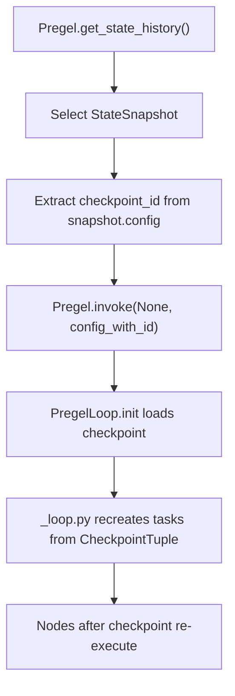
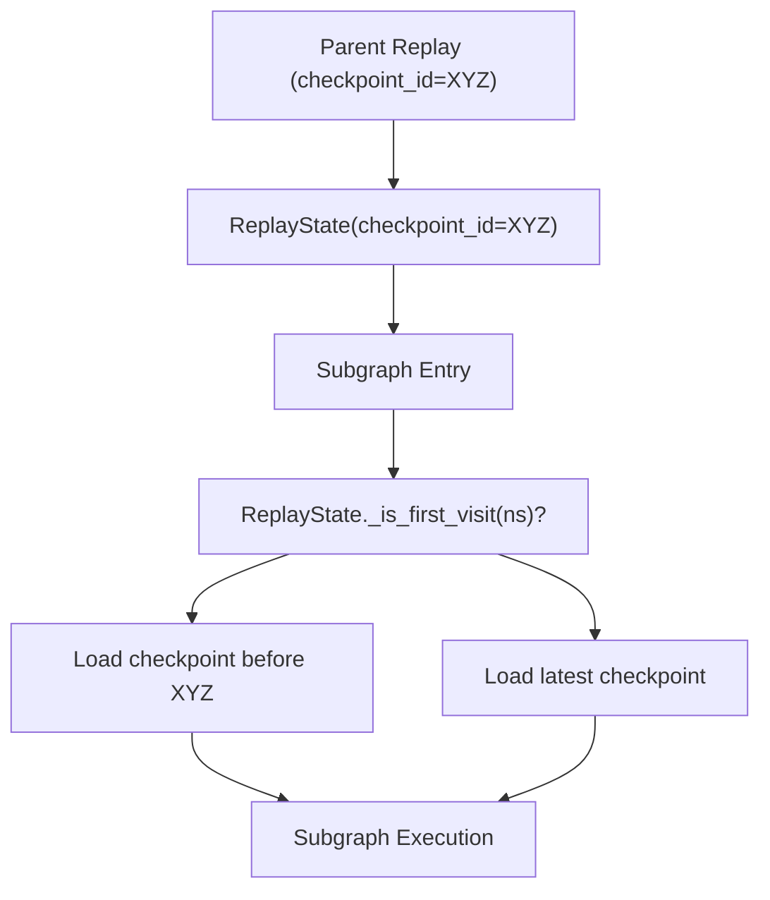

# Time Travel and State Forking

Relevant source files

-   [libs/langgraph/langgraph/\_internal/\_constants.py](https://github.com/langchain-ai/langgraph/blob/1fd51e8f/libs/langgraph/langgraph/_internal/_constants.py)
-   [libs/langgraph/langgraph/\_internal/\_replay.py](https://github.com/langchain-ai/langgraph/blob/1fd51e8f/libs/langgraph/langgraph/_internal/_replay.py)
-   [libs/langgraph/langgraph/pregel/\_loop.py](https://github.com/langchain-ai/langgraph/blob/1fd51e8f/libs/langgraph/langgraph/pregel/_loop.py)
-   [libs/langgraph/langgraph/pregel/main.py](https://github.com/langchain-ai/langgraph/blob/1fd51e8f/libs/langgraph/langgraph/pregel/main.py)
-   [libs/langgraph/langgraph/pregel/protocol.py](https://github.com/langchain-ai/langgraph/blob/1fd51e8f/libs/langgraph/langgraph/pregel/protocol.py)
-   [libs/langgraph/langgraph/pregel/remote.py](https://github.com/langchain-ai/langgraph/blob/1fd51e8f/libs/langgraph/langgraph/pregel/remote.py)
-   [libs/langgraph/langgraph/warnings.py](https://github.com/langchain-ai/langgraph/blob/1fd51e8f/libs/langgraph/langgraph/warnings.py)
-   [libs/langgraph/tests/test\_deprecation.py](https://github.com/langchain-ai/langgraph/blob/1fd51e8f/libs/langgraph/tests/test_deprecation.py)
-   [libs/langgraph/tests/test\_interruption.py](https://github.com/langchain-ai/langgraph/blob/1fd51e8f/libs/langgraph/tests/test_interruption.py)
-   [libs/langgraph/tests/test\_remote\_graph.py](https://github.com/langchain-ai/langgraph/blob/1fd51e8f/libs/langgraph/tests/test_remote_graph.py)
-   [libs/langgraph/tests/test\_stream\_v2.py](https://github.com/langchain-ai/langgraph/blob/1fd51e8f/libs/langgraph/tests/test_stream_v2.py)
-   [libs/langgraph/tests/test\_time\_travel.py](https://github.com/langchain-ai/langgraph/blob/1fd51e8f/libs/langgraph/tests/test_time_travel.py)
-   [libs/langgraph/tests/test\_time\_travel\_async.py](https://github.com/langchain-ai/langgraph/blob/1fd51e8f/libs/langgraph/tests/test_time_travel_async.py)

This document explains LangGraph's time travel and state forking capabilities, which enable replaying graph execution from historical checkpoints and creating alternate execution branches. These features allow you to navigate checkpoint history, re-execute nodes from any point in time, and explore alternative execution paths.

**Scope**: This page covers the mechanics of replaying from checkpoints and forking execution state. For information about the checkpoint data structures and persistence layer, see [Checkpointing Architecture](/langchain-ai/langgraph/4.1-checkpointing-architecture). For interrupt handling during execution, see [Human-in-the-Loop and Interrupts](/langchain-ai/langgraph/3.7-human-in-the-loop-and-interrupts).

## Core Concepts

### Checkpoints and State History

Every step in a LangGraph execution creates a checkpoint that captures channel values (state), pending tasks, and metadata. Checkpoints form a linked list through `parent_config`, creating an execution history. The `get_state_history` method in `Pregel` [libs/langgraph/langgraph/pregel/main.py1155-1244](https://github.com/langchain-ai/langgraph/blob/1fd51e8f/libs/langgraph/langgraph/pregel/main.py#L1155-L1244) traverses this chain in reverse chronological order.

Sources: [libs/langgraph/langgraph/pregel/main.py1155-1244](https://github.com/langchain-ai/langgraph/blob/1fd51e8f/libs/langgraph/langgraph/pregel/main.py#L1155-L1244) [libs/langgraph/tests/test\_time\_travel.py34-59](https://github.com/langchain-ai/langgraph/blob/1fd51e8f/libs/langgraph/tests/test_time_travel.py#L34-L59)

### Replay vs Fork

LangGraph supports two distinct time-travel operations defined by how they interact with the checkpointer:

| Operation | Mechanism | Checkpoint Lineage | Use Case |
| --- | --- | --- | --- |
| **Replay** | Invoke with `checkpoint_id` in config | Continues same lineage | Re-execute from a point, interrupts re-fire |
| **Fork** | `update_state()` then invoke | Creates new branch | Explore alternative execution paths |

**Replay**: Re-executes nodes that come after the specified checkpoint. Nodes before the checkpoint are not re-run. Interrupts encountered during the original execution will re-fire during replay because pending tasks are recreated [libs/langgraph/tests/test\_time\_travel.py1-17](https://github.com/langchain-ai/langgraph/blob/1fd51e8f/libs/langgraph/tests/test_time_travel.py#L1-L17)

**Fork**: Creates a new checkpoint via `update_state` [libs/langgraph/langgraph/pregel/main.py1462-1529](https://github.com/langchain-ai/langgraph/blob/1fd51e8f/libs/langgraph/langgraph/pregel/main.py#L1462-L1529) This new checkpoint does not contain the cached pending writes of the original, forcing nodes to re-execute and creating a separate execution branch.

Sources: [libs/langgraph/langgraph/pregel/main.py1462-1529](https://github.com/langchain-ai/langgraph/blob/1fd51e8f/libs/langgraph/langgraph/pregel/main.py#L1462-L1529) [libs/langgraph/tests/test\_time\_travel.py1-17](https://github.com/langchain-ai/langgraph/blob/1fd51e8f/libs/langgraph/tests/test_time_travel.py#L1-L17) [libs/langgraph/langgraph/pregel/\_loop.py248-305](https://github.com/langchain-ai/langgraph/blob/1fd51e8f/libs/langgraph/langgraph/pregel/_loop.py#L248-L305)

## Replay Mechanism

### Basic Replay Flow

The following diagram illustrates how the system transitions from a historical state to a replayed execution.

**Replay Execution Data Flow**


When replaying, the `PregelLoop` [libs/langgraph/langgraph/pregel/\_loop.py142-206](https://github.com/langchain-ai/langgraph/blob/1fd51e8f/libs/langgraph/langgraph/pregel/_loop.py#L142-L206) detects the `checkpoint_id` in the `RunnableConfig` [libs/langgraph/langgraph/\_internal/\_constants.py53-54](https://github.com/langchain-ai/langgraph/blob/1fd51e8f/libs/langgraph/langgraph/_internal/_constants.py#L53-L54) It uses the checkpointer to load the specific state at that point in time.

Sources: [libs/langgraph/langgraph/pregel/\_loop.py248-305](https://github.com/langchain-ai/langgraph/blob/1fd51e8f/libs/langgraph/langgraph/pregel/_loop.py#L248-L305) [libs/langgraph/tests/test\_time\_travel.py67-107](https://github.com/langchain-ai/langgraph/blob/1fd51e8f/libs/langgraph/tests/test_time_travel.py#L67-L107) [libs/langgraph/langgraph/\_internal/\_constants.py53-54](https://github.com/langchain-ai/langgraph/blob/1fd51e8f/libs/langgraph/langgraph/_internal/_constants.py#L53-L54)

### ReplayState for Subgraphs

When replaying a parent graph that contains subgraphs, the `ReplayState` class [libs/langgraph/langgraph/\_internal/\_replay.py16-18](https://github.com/langchain-ai/langgraph/blob/1fd51e8f/libs/langgraph/langgraph/_internal/_replay.py#L16-L18) ensures subgraphs load the correct checkpoints relative to the parent's replay point.

**Subgraph Checkpoint Resolution**


The `ReplayState` tracks visited namespaces in `_visited_ns` [libs/langgraph/langgraph/\_internal/\_replay.py25-26](https://github.com/langchain-ai/langgraph/blob/1fd51e8f/libs/langgraph/langgraph/_internal/_replay.py#L25-L26) On the first visit to a subgraph during a replay, it searches for the checkpoint immediately preceding the parent's replay point [libs/langgraph/langgraph/\_internal/\_replay.py53-65](https://github.com/langchain-ai/langgraph/blob/1fd51e8f/libs/langgraph/langgraph/_internal/_replay.py#L53-L65)

Sources: [libs/langgraph/langgraph/\_internal/\_replay.py16-91](https://github.com/langchain-ai/langgraph/blob/1fd51e8f/libs/langgraph/langgraph/_internal/_replay.py#L16-L91) [libs/langgraph/tests/test\_time\_travel.py387-461](https://github.com/langchain-ai/langgraph/blob/1fd51e8f/libs/langgraph/tests/test_time_travel.py#L387-L461)

## State Forking

### Fork Creation with update\_state

Forking creates a new checkpoint branch. Calling `update_state()` [libs/langgraph/langgraph/pregel/main.py1462-1529](https://github.com/langchain-ai/langgraph/blob/1fd51e8f/libs/langgraph/langgraph/pregel/main.py#L1462-L1529) followed by `invoke()` results in a fork:

```
# Fork by updating state at a specific checkpointfork_config = graph.update_state(before_node_b_config, {"value": ["modified"]}) # Then invoke - creates new branch starting from modified stategraph.invoke(None, fork_config)
```
The `update_state` call creates a new checkpoint whose `parent_checkpoint_id` points to the historical checkpoint [libs/langgraph/langgraph/pregel/main.py1462-1529](https://github.com/langchain-ai/langgraph/blob/1fd51e8f/libs/langgraph/langgraph/pregel/main.py#L1462-L1529) Crucially, it clears pending writes, forcing the graph to re-evaluate the next steps based on the new state values.

Sources: [libs/langgraph/langgraph/pregel/main.py1462-1529](https://github.com/langchain-ai/langgraph/blob/1fd51e8f/libs/langgraph/langgraph/pregel/main.py#L1462-L1529) [libs/langgraph/tests/test\_time\_travel.py109-153](https://github.com/langchain-ai/langgraph/blob/1fd51e8f/libs/langgraph/tests/test_time_travel.py#L109-L153)

### Fork as Copy Pattern

A "pure" fork can be created by calling `update_state(config, None)` [libs/langgraph/tests/test\_time\_travel.py564-606](https://github.com/langchain-ai/langgraph/blob/1fd51e8f/libs/langgraph/tests/test_time_travel.py#L564-L606) This creates a new checkpoint with the exact same values as the parent but without the original execution's pending tasks, allowing for a fresh execution from that state.

Sources: [libs/langgraph/tests/test\_time\_travel.py564-606](https://github.com/langchain-ai/langgraph/blob/1fd51e8f/libs/langgraph/tests/test_time_travel.py#L564-L606)

## State History API

### StateSnapshot Structure

The `get_state_history` method yields `StateSnapshot` objects [libs/langgraph/langgraph/types.py149](https://github.com/langchain-ai/langgraph/blob/1fd51e8f/libs/langgraph/langgraph/types.py#L149-L149)

| Field | Description |
| --- | --- |
| `values` | The state (channel values) at this checkpoint. |
| `next` | Tuple of node names that were scheduled to run next. |
| `config` | The `RunnableConfig` containing `checkpoint_id` for this snapshot. |
| `parent_config` | The config of the checkpoint that preceded this one. |
| `tasks` | The `PregelTask` objects representing pending work. |

Sources: [libs/langgraph/langgraph/pregel/main.py1155-1244](https://github.com/langchain-ai/langgraph/blob/1fd51e8f/libs/langgraph/langgraph/pregel/main.py#L1155-L1244) [libs/langgraph/langgraph/types.py149](https://github.com/langchain-ai/langgraph/blob/1fd51e8f/libs/langgraph/langgraph/types.py#L149-L149)

### Remote Time Travel

`RemoteGraph` [libs/langgraph/langgraph/pregel/remote.py112](https://github.com/langchain-ai/langgraph/blob/1fd51e8f/libs/langgraph/langgraph/pregel/remote.py#L112-L112) implements the `PregelProtocol` [libs/langgraph/langgraph/pregel/protocol.py25](https://github.com/langchain-ai/langgraph/blob/1fd51e8f/libs/langgraph/langgraph/pregel/protocol.py#L25-L25) providing `get_state_history` and `update_state` by proxying calls to a LangGraph API server.

```
# RemoteGraph proxies to the server's threads.get_state_historyhistory = remote_graph.get_state_history(config)
```
Sources: [libs/langgraph/langgraph/pregel/remote.py402-636](https://github.com/langchain-ai/langgraph/blob/1fd51e8f/libs/langgraph/langgraph/pregel/remote.py#L402-L636) [libs/langgraph/langgraph/pregel/protocol.py25-75](https://github.com/langchain-ai/langgraph/blob/1fd51e8f/libs/langgraph/langgraph/pregel/protocol.py#L25-L75)

## Implementation Details

### Configuration Keys for Time Travel

The following internal keys in `configurable` [libs/langgraph/langgraph/\_internal/\_constants.py79-80](https://github.com/langchain-ai/langgraph/blob/1fd51e8f/libs/langgraph/langgraph/_internal/_constants.py#L79-L80) drive the time travel logic:

-   `CONFIG_KEY_CHECKPOINT_ID` (`checkpoint_id`): The ID of the specific checkpoint to load [libs/langgraph/langgraph/\_internal/\_constants.py53-54](https://github.com/langchain-ai/langgraph/blob/1fd51e8f/libs/langgraph/langgraph/_internal/_constants.py#L53-L54)
-   `CONFIG_KEY_REPLAY_STATE` (`__pregel_replay_state`): Holds the `ReplayState` object used to coordinate subgraph checkpoint loading [libs/langgraph/langgraph/\_internal/\_constants.py44-46](https://github.com/langchain-ai/langgraph/blob/1fd51e8f/libs/langgraph/langgraph/_internal/_constants.py#L44-L46)
-   `CONFIG_KEY_CHECKPOINT_MAP` (`checkpoint_map`): A mapping of `checkpoint_ns` to `checkpoint_id` for nested graph replay [libs/langgraph/langgraph/\_internal/\_constants.py51-52](https://github.com/langchain-ai/langgraph/blob/1fd51e8f/libs/langgraph/langgraph/_internal/_constants.py#L51-L52)

Sources: [libs/langgraph/langgraph/\_internal/\_constants.py40-60](https://github.com/langchain-ai/langgraph/blob/1fd51e8f/libs/langgraph/langgraph/_internal/_constants.py#L40-L60)

### PregelLoop Initialization

During `PregelLoop.__init__` [libs/langgraph/langgraph/pregel/\_loop.py209-231](https://github.com/langchain-ai/langgraph/blob/1fd51e8f/libs/langgraph/langgraph/pregel/_loop.py#L209-L231) the engine checks if it should be in "resuming" mode. If a `checkpoint_id` is provided in the config, it sets `self.is_replaying = True` (if nested) or prepares to load that specific version from the checkpointer.

Sources: [libs/langgraph/langgraph/pregel/\_loop.py248-305](https://github.com/langchain-ai/langgraph/blob/1fd51e8f/libs/langgraph/langgraph/pregel/_loop.py#L248-L305) [libs/langgraph/langgraph/\_internal/\_config.py57-61](https://github.com/langchain-ai/langgraph/blob/1fd51e8f/libs/langgraph/langgraph/_internal/_config.py#L57-L61)
