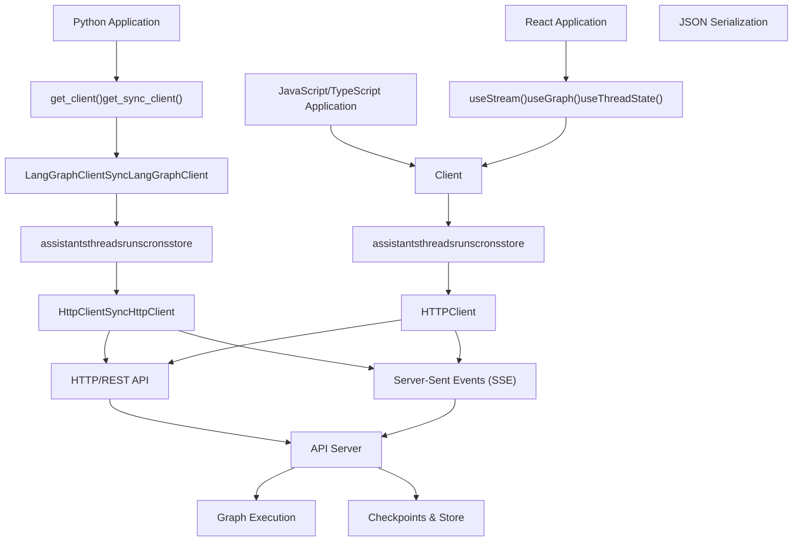
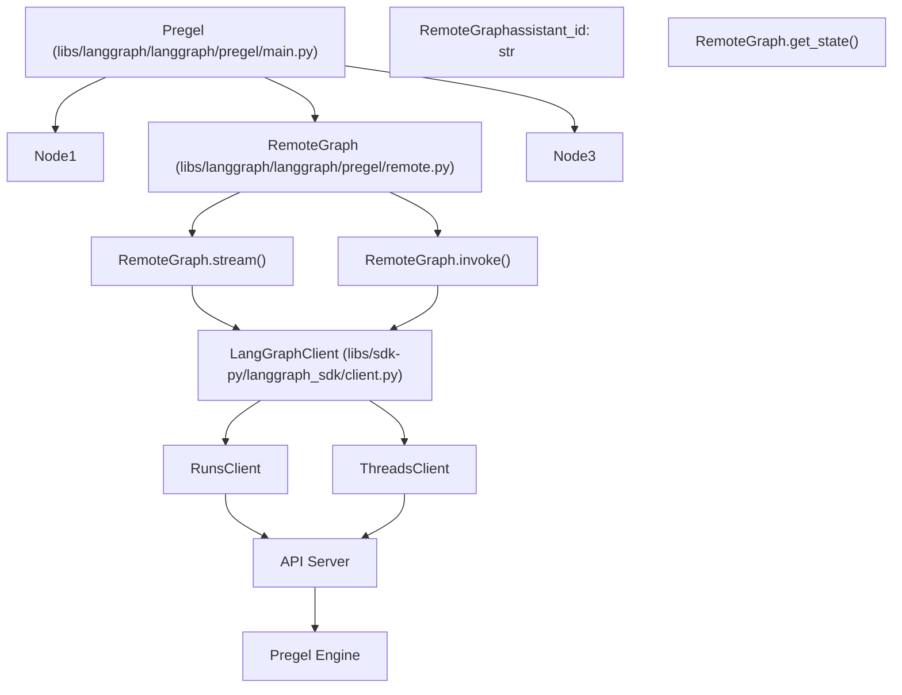

# Client SDKs and Remote Execution

Relevant source files

-   [libs/langgraph/langgraph/\_internal/\_constants.py](https://github.com/langchain-ai/langgraph/blob/1fd51e8f/libs/langgraph/langgraph/_internal/_constants.py)
-   [libs/langgraph/langgraph/\_internal/\_replay.py](https://github.com/langchain-ai/langgraph/blob/1fd51e8f/libs/langgraph/langgraph/_internal/_replay.py)
-   [libs/langgraph/langgraph/pregel/\_loop.py](https://github.com/langchain-ai/langgraph/blob/1fd51e8f/libs/langgraph/langgraph/pregel/_loop.py)
-   [libs/langgraph/langgraph/pregel/main.py](https://github.com/langchain-ai/langgraph/blob/1fd51e8f/libs/langgraph/langgraph/pregel/main.py)
-   [libs/langgraph/langgraph/pregel/protocol.py](https://github.com/langchain-ai/langgraph/blob/1fd51e8f/libs/langgraph/langgraph/pregel/protocol.py)
-   [libs/langgraph/langgraph/pregel/remote.py](https://github.com/langchain-ai/langgraph/blob/1fd51e8f/libs/langgraph/langgraph/pregel/remote.py)
-   [libs/langgraph/langgraph/warnings.py](https://github.com/langchain-ai/langgraph/blob/1fd51e8f/libs/langgraph/langgraph/warnings.py)
-   [libs/langgraph/tests/test\_deprecation.py](https://github.com/langchain-ai/langgraph/blob/1fd51e8f/libs/langgraph/tests/test_deprecation.py)
-   [libs/langgraph/tests/test\_interruption.py](https://github.com/langchain-ai/langgraph/blob/1fd51e8f/libs/langgraph/tests/test_interruption.py)
-   [libs/langgraph/tests/test\_remote\_graph.py](https://github.com/langchain-ai/langgraph/blob/1fd51e8f/libs/langgraph/tests/test_remote_graph.py)
-   [libs/langgraph/tests/test\_stream\_v2.py](https://github.com/langchain-ai/langgraph/blob/1fd51e8f/libs/langgraph/tests/test_stream_v2.py)
-   [libs/langgraph/tests/test\_time\_travel.py](https://github.com/langchain-ai/langgraph/blob/1fd51e8f/libs/langgraph/tests/test_time_travel.py)
-   [libs/langgraph/tests/test\_time\_travel\_async.py](https://github.com/langchain-ai/langgraph/blob/1fd51e8f/libs/langgraph/tests/test_time_travel_async.py)
-   [libs/sdk-py/langgraph\_sdk/\_\_init\_\_.py](https://github.com/langchain-ai/langgraph/blob/1fd51e8f/libs/sdk-py/langgraph_sdk/__init__.py)
-   [libs/sdk-py/langgraph\_sdk/cache.py](https://github.com/langchain-ai/langgraph/blob/1fd51e8f/libs/sdk-py/langgraph_sdk/cache.py)
-   [libs/sdk-py/langgraph\_sdk/client.py](https://github.com/langchain-ai/langgraph/blob/1fd51e8f/libs/sdk-py/langgraph_sdk/client.py)
-   [libs/sdk-py/langgraph\_sdk/schema.py](https://github.com/langchain-ai/langgraph/blob/1fd51e8f/libs/sdk-py/langgraph_sdk/schema.py)
-   [libs/sdk-py/pyproject.toml](https://github.com/langchain-ai/langgraph/blob/1fd51e8f/libs/sdk-py/pyproject.toml)
-   [libs/sdk-py/tests/test\_cache.py](https://github.com/langchain-ai/langgraph/blob/1fd51e8f/libs/sdk-py/tests/test_cache.py)
-   [libs/sdk-py/tests/test\_crons\_client.py](https://github.com/langchain-ai/langgraph/blob/1fd51e8f/libs/sdk-py/tests/test_crons_client.py)

## Purpose and Scope

This document provides an overview of the client libraries for interacting with deployed LangGraph applications via HTTP APIs. The SDKs enable programmatic access to remote graph deployments from both Python and JavaScript/TypeScript applications. Key capabilities include:

-   Creating and managing assistants, threads, runs, and cron jobs
-   Streaming execution results via Server-Sent Events (SSE)
-   Using remote graphs as nodes within local graphs via `RemoteGraph`
-   Custom authentication and authorization
-   Cross-thread persistent storage via the Store API

For deployment information, see [CLI and Deployment](/langchain-ai/langgraph/6-cli-and-deployment). For API endpoint details, see [LangGraph API Server](#7).

**Related Pages:**

-   [Python SDK](/langchain-ai/langgraph/5.1-python-sdk) - Python client implementation details
-   [JavaScript/TypeScript SDK](/langchain-ai/langgraph/5.2-javascripttypescript-sdk) - JavaScript client implementation
-   [HTTP Client and Streaming](/langchain-ai/langgraph/5.3-http-client-and-streaming) - HTTP layer and SSE streaming
-   [Authentication and Authorization](/langchain-ai/langgraph/5.4-authentication-and-authorization) - Custom auth handlers
-   [Data Models and Schemas](/langchain-ai/langgraph/5.5-data-models-and-schemas) - TypedDict schemas and types
-   [RemoteGraph](/langchain-ai/langgraph/5.6-remotegraph) - Using remote graphs as local nodes

**Sources:** [libs/sdk-py/langgraph\_sdk/client.py1-8](https://github.com/langchain-ai/langgraph/blob/1fd51e8f/libs/sdk-py/langgraph_sdk/client.py#L1-L8) [libs/langgraph/langgraph/pregel/remote.py112-121](https://github.com/langchain-ai/langgraph/blob/1fd51e8f/libs/langgraph/langgraph/pregel/remote.py#L112-L121)

---

## Architecture Overview

The LangGraph SDK architecture provides client libraries in multiple languages that communicate with deployed LangGraph applications via HTTP APIs. Each SDK provides typed interfaces for resource management, streaming execution, and authentication.

### Multi-Language Client Architecture


**Sources:** [libs/sdk-py/langgraph\_sdk/client.py1-55](https://github.com/langchain-ai/langgraph/blob/1fd51e8f/libs/sdk-py/langgraph_sdk/client.py#L1-L55) [libs/sdk-py/pyproject.toml5-14](https://github.com/langchain-ai/langgraph/blob/1fd51e8f/libs/sdk-py/pyproject.toml#L5-L14)

---

## Client Factory Functions

The SDK provides two factory functions that create configured client instances with automatic authentication, connection handling, and optional in-process communication.

### get\_client() - Async Client

```
def get_client(    *,    url: str | None = None,    api_key: str | None = NOT_PROVIDED,    headers: Mapping[str, str] | None = None,    timeout: TimeoutTypes | None = None,) -> LangGraphClient
```
Creates an async `LangGraphClient` instance. Key behaviors:

-   **API Key Resolution**: Resolves API keys from environment variables: `LANGGRAPH_API_KEY`, `LANGSMITH_API_KEY`, or `LANGCHAIN_API_KEY`.
-   **Transport**: Uses `httpx.AsyncClient` with specialized transport for remote URLs or loopback for in-process server instances.
-   **Serialization**: Uses `orjson` for high-performance JSON encoding and decoding.

**Sources:** [libs/sdk-py/langgraph\_sdk/client.py16](https://github.com/langchain-ai/langgraph/blob/1fd51e8f/libs/sdk-py/langgraph_sdk/client.py#L16-L16) [libs/sdk-py/langgraph\_sdk/\_\_init\_\_.py2](https://github.com/langchain-ai/langgraph/blob/1fd51e8f/libs/sdk-py/langgraph_sdk/__init__.py#L2-L2) [libs/sdk-py/pyproject.toml14](https://github.com/langchain-ai/langgraph/blob/1fd51e8f/libs/sdk-py/pyproject.toml#L14-L14)

### get\_sync\_client() - Synchronous Client

```
def get_sync_client(    *,    url: str | None = None,    api_key: str | None = NOT_PROVIDED,    headers: Mapping[str, str] | None = None,    timeout: TimeoutTypes | None = None,) -> SyncLangGraphClient
```
Creates a synchronous `SyncLangGraphClient` with identical configuration options as the async version. Uses `httpx.Client` instead of `httpx.AsyncClient`.

**Sources:** [libs/sdk-py/langgraph\_sdk/client.py26](https://github.com/langchain-ai/langgraph/blob/1fd51e8f/libs/sdk-py/langgraph_sdk/client.py#L26-L26) [libs/sdk-py/langgraph\_sdk/\_\_init\_\_.py2](https://github.com/langchain-ai/langgraph/blob/1fd51e8f/libs/sdk-py/langgraph_sdk/__init__.py#L2-L2)

---

## Top-Level Client Classes

### LangGraphClient

The async top-level client exposes five resource-specific sub-clients:

```
class LangGraphClient:    assistants: AssistantsClient    threads: ThreadsClient    runs: RunsClient    crons: CronClient    store: StoreClient
```
**Sources:** [libs/sdk-py/langgraph\_sdk/client.py16-21](https://github.com/langchain-ai/langgraph/blob/1fd51e8f/libs/sdk-py/langgraph_sdk/client.py#L16-L21)

### SyncLangGraphClient

The synchronous equivalent with identical structure:

```
class SyncLangGraphClient:    assistants: SyncAssistantsClient    threads: SyncThreadsClient    runs: SyncRunsClient    crons: SyncCronClient    store: SyncStoreClient
```
**Sources:** [libs/sdk-py/langgraph\_sdk/client.py26-31](https://github.com/langchain-ai/langgraph/blob/1fd51e8f/libs/sdk-py/langgraph_sdk/client.py#L26-L31)

### Sub-Client Mapping

Each resource-specific sub-client provides specialized operations:

| Sub-Client | Async Class | Sync Class |
| --- | --- | --- |
| Assistants | `AssistantsClient` | `SyncAssistantsClient` |
| Threads | `ThreadsClient` | `SyncThreadsClient` |
| Runs | `RunsClient` | `SyncRunsClient` |
| Crons | `CronClient` | `SyncCronClient` |
| Store | `StoreClient` | `SyncStoreClient` |

**Sources:** [libs/sdk-py/langgraph\_sdk/client.py12-31](https://github.com/langchain-ai/langgraph/blob/1fd51e8f/libs/sdk-py/langgraph_sdk/client.py#L12-L31)

---

## RemoteGraph - Remote Execution as Local Nodes

The `RemoteGraph` class implements the `PregelProtocol` interface, allowing remote graphs to be used as nodes within local graphs. This enables distributed graph architectures where subgraphs run on different servers.

### RemoteGraph Architecture


**Sources:** [libs/langgraph/langgraph/pregel/remote.py112-139](https://github.com/langchain-ai/langgraph/blob/1fd51e8f/libs/langgraph/langgraph/pregel/remote.py#L112-L139) [libs/langgraph/langgraph/pregel/protocol.py25-50](https://github.com/langchain-ai/langgraph/blob/1fd51e8f/libs/langgraph/langgraph/pregel/protocol.py#L25-L50)

### Key Methods

#### stream() and astream()

Stream execution results from a remote deployment. It handles the mapping of remote `StreamPart` objects back into local graph events.

**Sources:** [libs/langgraph/langgraph/pregel/remote.py685-700](https://github.com/langchain-ai/langgraph/blob/1fd51e8f/libs/langgraph/langgraph/pregel/remote.py#L685-L700) [libs/langgraph/langgraph/pregel/protocol.py108-149](https://github.com/langchain-ai/langgraph/blob/1fd51e8f/libs/langgraph/langgraph/pregel/protocol.py#L108-L149)

#### get\_state() and aget\_state()

Retrieve thread state from the remote server, returning a `StateSnapshot` that includes values, next nodes, and configuration.

**Sources:** [libs/langgraph/langgraph/pregel/remote.py398-410](https://github.com/langchain-ai/langgraph/blob/1fd51e8f/libs/langgraph/langgraph/pregel/remote.py#L398-L410) [libs/langgraph/langgraph/pregel/protocol.py48-55](https://github.com/langchain-ai/langgraph/blob/1fd51e8f/libs/langgraph/langgraph/pregel/protocol.py#L48-L55)

---

## Data Models and Schemas

The SDK uses `TypedDict` classes for type-safe data structures. All schemas are defined in `langgraph_sdk.schema`.

### Core Resource Models

-   **Assistant**: Represents a versioned configuration of a graph. [libs/sdk-py/langgraph\_sdk/schema.py236-240](https://github.com/langchain-ai/langgraph/blob/1fd51e8f/libs/sdk-py/langgraph_sdk/schema.py#L236-L240)
-   **Thread**: Represents a conversation thread with persistent state. [libs/sdk-py/langgraph\_sdk/schema.py34-41](https://github.com/langchain-ai/langgraph/blob/1fd51e8f/libs/sdk-py/langgraph_sdk/schema.py#L34-L41)
-   **Run**: Represents a single execution run of a graph on a thread. [libs/sdk-py/langgraph\_sdk/schema.py23-32](https://github.com/langchain-ai/langgraph/blob/1fd51e8f/libs/sdk-py/langgraph_sdk/schema.py#L23-L32)
-   **Cron**: Represents a scheduled task that creates runs at specified intervals. [libs/sdk-py/langgraph\_sdk/schema.py156-167](https://github.com/langchain-ai/langgraph/blob/1fd51e8f/libs/sdk-py/langgraph_sdk/schema.py#L156-L167)

### Streaming Models

Events are returned as `StreamPart` named tuples containing an `event` type and a `data` payload.

**Sources:** [libs/sdk-py/langgraph\_sdk/schema.py51-72](https://github.com/langchain-ai/langgraph/blob/1fd51e8f/libs/sdk-py/langgraph_sdk/schema.py#L51-L72)

---

## Authentication and Authorization

The SDK provides a framework for custom authentication and authorization via the `Auth` class.

-   **@auth.authenticate**: Decorator for defining a custom authenticator that resolves user identities from request headers or parameters.
-   **@auth.on**: Decorator for defining authorization handlers for specific resources (Assistants, Threads, Runs, etc.) and actions (create, read, update, delete).

**Sources:** [libs/sdk-py/langgraph\_sdk/\_\_init\_\_.py1](https://github.com/langchain-ai/langgraph/blob/1fd51e8f/libs/sdk-py/langgraph_sdk/__init__.py#L1-L1) [libs/sdk-py/langgraph\_sdk/client.py1-8](https://github.com/langchain-ai/langgraph/blob/1fd51e8f/libs/sdk-py/langgraph_sdk/client.py#L1-L8)

---

## Package Structure and Distribution

The SDK is distributed as the `langgraph-sdk` package.

### Package Metadata

From `libs/sdk-py/pyproject.toml`:

```
[project]name = "langgraph-sdk"dependencies = ["httpx>=0.25.2", "orjson>=3.11.5"]
```
**Sources:** [libs/sdk-py/pyproject.toml6-14](https://github.com/langchain-ai/langgraph/blob/1fd51e8f/libs/sdk-py/pyproject.toml#L6-L14)

### Public API Surface

The top-level `__init__.py` exports the primary factory functions and base classes:

```
from langgraph_sdk import Auth, Encryption, get_client, get_sync_client
```
**Sources:** [libs/sdk-py/langgraph\_sdk/\_\_init\_\_.py1-8](https://github.com/langchain-ai/langgraph/blob/1fd51e8f/libs/sdk-py/langgraph_sdk/__init__.py#L1-L8)
