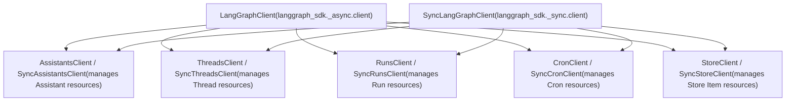
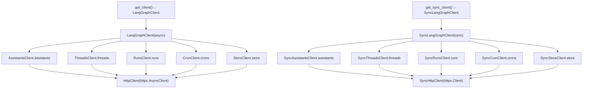
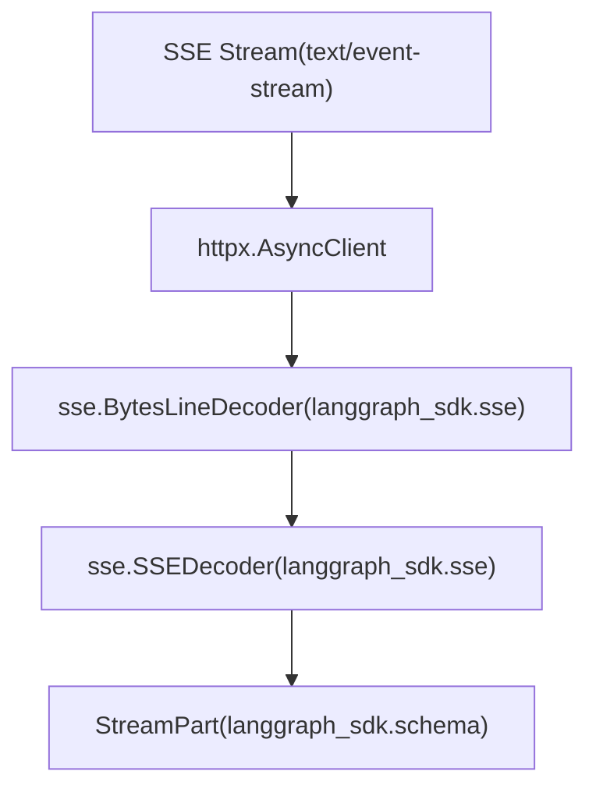

# Python SDK

Relevant source files

-   [libs/checkpoint-conformance/pyproject.toml](https://github.com/langchain-ai/langgraph/blob/1fd51e8f/libs/checkpoint-conformance/pyproject.toml)
-   [libs/sdk-py/langgraph\_sdk/\_\_init\_\_.py](https://github.com/langchain-ai/langgraph/blob/1fd51e8f/libs/sdk-py/langgraph_sdk/__init__.py)
-   [libs/sdk-py/langgraph\_sdk/\_async/assistants.py](https://github.com/langchain-ai/langgraph/blob/1fd51e8f/libs/sdk-py/langgraph_sdk/_async/assistants.py)
-   [libs/sdk-py/langgraph\_sdk/\_async/client.py](https://github.com/langchain-ai/langgraph/blob/1fd51e8f/libs/sdk-py/langgraph_sdk/_async/client.py)
-   [libs/sdk-py/langgraph\_sdk/\_async/cron.py](https://github.com/langchain-ai/langgraph/blob/1fd51e8f/libs/sdk-py/langgraph_sdk/_async/cron.py)
-   [libs/sdk-py/langgraph\_sdk/\_async/runs.py](https://github.com/langchain-ai/langgraph/blob/1fd51e8f/libs/sdk-py/langgraph_sdk/_async/runs.py)
-   [libs/sdk-py/langgraph\_sdk/\_async/store.py](https://github.com/langchain-ai/langgraph/blob/1fd51e8f/libs/sdk-py/langgraph_sdk/_async/store.py)
-   [libs/sdk-py/langgraph\_sdk/\_async/threads.py](https://github.com/langchain-ai/langgraph/blob/1fd51e8f/libs/sdk-py/langgraph_sdk/_async/threads.py)
-   [libs/sdk-py/langgraph\_sdk/\_shared/utilities.py](https://github.com/langchain-ai/langgraph/blob/1fd51e8f/libs/sdk-py/langgraph_sdk/_shared/utilities.py)
-   [libs/sdk-py/langgraph\_sdk/\_sync/assistants.py](https://github.com/langchain-ai/langgraph/blob/1fd51e8f/libs/sdk-py/langgraph_sdk/_sync/assistants.py)
-   [libs/sdk-py/langgraph\_sdk/\_sync/cron.py](https://github.com/langchain-ai/langgraph/blob/1fd51e8f/libs/sdk-py/langgraph_sdk/_sync/cron.py)
-   [libs/sdk-py/langgraph\_sdk/\_sync/runs.py](https://github.com/langchain-ai/langgraph/blob/1fd51e8f/libs/sdk-py/langgraph_sdk/_sync/runs.py)
-   [libs/sdk-py/langgraph\_sdk/\_sync/store.py](https://github.com/langchain-ai/langgraph/blob/1fd51e8f/libs/sdk-py/langgraph_sdk/_sync/store.py)
-   [libs/sdk-py/langgraph\_sdk/\_sync/threads.py](https://github.com/langchain-ai/langgraph/blob/1fd51e8f/libs/sdk-py/langgraph_sdk/_sync/threads.py)
-   [libs/sdk-py/langgraph\_sdk/cache.py](https://github.com/langchain-ai/langgraph/blob/1fd51e8f/libs/sdk-py/langgraph_sdk/cache.py)
-   [libs/sdk-py/langgraph\_sdk/client.py](https://github.com/langchain-ai/langgraph/blob/1fd51e8f/libs/sdk-py/langgraph_sdk/client.py)
-   [libs/sdk-py/langgraph\_sdk/schema.py](https://github.com/langchain-ai/langgraph/blob/1fd51e8f/libs/sdk-py/langgraph_sdk/schema.py)
-   [libs/sdk-py/pyproject.toml](https://github.com/langchain-ai/langgraph/blob/1fd51e8f/libs/sdk-py/pyproject.toml)
-   [libs/sdk-py/tests/test\_cache.py](https://github.com/langchain-ai/langgraph/blob/1fd51e8f/libs/sdk-py/tests/test_cache.py)
-   [libs/sdk-py/tests/test\_crons\_client.py](https://github.com/langchain-ai/langgraph/blob/1fd51e8f/libs/sdk-py/tests/test_crons_client.py)

The Python SDK provides client libraries for interacting with LangGraph API servers. It offers both asynchronous and synchronous clients for managing assistants, threads, runs, cron jobs, and persistent storage. The SDK handles HTTP communication, Server-Sent Events (SSE) streaming with automatic reconnection, and provides strongly-typed data models for all API resources.

For information about the JavaScript/TypeScript SDK, see [JavaScript/TypeScript SDK](/langchain-ai/langgraph/5.2-javascripttypescript-sdk). For details on authentication and authorization configuration (server-side), see [Authentication and Authorization](/langchain-ai/langgraph/5.4-authentication-and-authorization). For RemoteGraph usage (using deployed graphs as nodes), see [RemoteGraph](/langchain-ai/langgraph/5.6-remotegraph).

---

## Package Structure and Dependencies

The SDK is a standalone package located at `libs/sdk-py` with minimal dependencies. It uses `hatchling` as its build backend and `uv` for dependency management.

**Dependencies**:

-   `httpx>=0.25.2` - HTTP client with async support. [libs/sdk-py/pyproject.toml14](https://github.com/langchain-ai/langgraph/blob/1fd51e8f/libs/sdk-py/pyproject.toml#L14-L14)
-   `orjson>=3.11.5` - Fast JSON serialization. [libs/sdk-py/pyproject.toml14](https://github.com/langchain-ai/langgraph/blob/1fd51e8f/libs/sdk-py/pyproject.toml#L14-L14)
-   Python 3.10+ [libs/sdk-py/pyproject.toml10](https://github.com/langchain-ai/langgraph/blob/1fd51e8f/libs/sdk-py/pyproject.toml#L10-L10)

**Installation**:

```
pip install langgraph-sdk
```
Sources: [libs/sdk-py/pyproject.toml1-57](https://github.com/langchain-ai/langgraph/blob/1fd51e8f/libs/sdk-py/pyproject.toml#L1-L57)

---

## Client Architecture

The SDK is organized into resource-specific clients that wrap an underlying HTTP client.

### Code Entity Space to System Names

This diagram maps the Python classes to the logical resources they manage within the LangGraph ecosystem.


Sources: [libs/sdk-py/langgraph\_sdk/client.py12-31](https://github.com/langchain-ai/langgraph/blob/1fd51e8f/libs/sdk-py/langgraph_sdk/client.py#L12-L31) [libs/sdk-py/langgraph\_sdk/\_async/client.py1-20](https://github.com/langchain-ai/langgraph/blob/1fd51e8f/libs/sdk-py/langgraph_sdk/_async/client.py#L1-L20)

### Client Factory and Hierarchy

The main entry points are factory functions that instantiate the primary client classes.


**Main Client Structure**

The SDK provides two main client classes that serve as entry points:

| Client | Purpose | Import Path |
| --- | --- | --- |
| `LangGraphClient` | Async operations | `from langgraph_sdk import get_client` |
| `SyncLangGraphClient` | Synchronous operations | `from langgraph_sdk import get_sync_client` |

Each main client provides access to resource-specific sub-clients through properties (`.assistants`, `.threads`, `.runs`, `.crons`, `.store`). [libs/sdk-py/langgraph\_sdk/client.py12-31](https://github.com/langchain-ai/langgraph/blob/1fd51e8f/libs/sdk-py/langgraph_sdk/client.py#L12-L31)

Sources: [libs/sdk-py/langgraph\_sdk/client.py1-55](https://github.com/langchain-ai/langgraph/blob/1fd51e8f/libs/sdk-py/langgraph_sdk/client.py#L1-L55) [libs/sdk-py/langgraph\_sdk/\_\_init\_\_.py1-9](https://github.com/langchain-ai/langgraph/blob/1fd51e8f/libs/sdk-py/langgraph_sdk/__init__.py#L1-L9)

---

## Resource Client APIs

### AssistantsClient / SyncAssistantsClient

Manages `Assistant` resources, which are versioned configurations of a graph (linking a `graph_id` to specific `config`, `metadata`, and `context`). [libs/sdk-py/langgraph\_sdk/schema.py211-231](https://github.com/langchain-ai/langgraph/blob/1fd51e8f/libs/sdk-py/langgraph_sdk/schema.py#L211-L231)

**Key Methods**:

| Method | Description | Returns |
| --- | --- | --- |
| `create(graph_id, ...)` | Create new assistant. [libs/sdk-py/langgraph\_sdk/\_async/assistants.py246](https://github.com/langchain-ai/langgraph/blob/1fd51e8f/libs/sdk-py/langgraph_sdk/_async/assistants.py#L246-L246) | `Assistant` |
| `get(assistant_id)` | Retrieve assistant by ID. [libs/sdk-py/langgraph\_sdk/\_async/assistants.py45](https://github.com/langchain-ai/langgraph/blob/1fd51e8f/libs/sdk-py/langgraph_sdk/_async/assistants.py#L45-L45) | `Assistant` |
| `update(assistant_id, ...)` | Update assistant properties. [libs/sdk-py/langgraph\_sdk/\_async/assistants.py307](https://github.com/langchain-ai/langgraph/blob/1fd51e8f/libs/sdk-py/langgraph_sdk/_async/assistants.py#L307-L307) | `Assistant` |
| `delete(assistant_id)` | Delete assistant. [libs/sdk-py/langgraph\_sdk/\_async/assistants.py348](https://github.com/langchain-ai/langgraph/blob/1fd51e8f/libs/sdk-py/langgraph_sdk/_async/assistants.py#L348-L348) | `None` |
| `search(metadata=None, ...)` | Search assistants with filters. [libs/sdk-py/langgraph\_sdk/\_async/assistants.py365](https://github.com/langchain-ai/langgraph/blob/1fd51e8f/libs/sdk-py/langgraph_sdk/_async/assistants.py#L365-L365) | `list[Assistant]` |
| `get_graph(assistant_id)` | Get graph structure (nodes/edges). [libs/sdk-py/langgraph\_sdk/\_async/assistants.py90](https://github.com/langchain-ai/langgraph/blob/1fd51e8f/libs/sdk-py/langgraph_sdk/_async/assistants.py#L90-L90) | `dict` |
| `get_schemas(assistant_id)` | Get input/output/state schemas. [libs/sdk-py/langgraph\_sdk/\_async/assistants.py148](https://github.com/langchain-ai/langgraph/blob/1fd51e8f/libs/sdk-py/langgraph_sdk/_async/assistants.py#L148-L148) | `GraphSchema` |

Sources: [libs/sdk-py/langgraph\_sdk/\_async/assistants.py28-440](https://github.com/langchain-ai/langgraph/blob/1fd51e8f/libs/sdk-py/langgraph_sdk/_async/assistants.py#L28-L440) [libs/sdk-py/langgraph\_sdk/\_sync/assistants.py28-435](https://github.com/langchain-ai/langgraph/blob/1fd51e8f/libs/sdk-py/langgraph_sdk/_sync/assistants.py#L28-L435)

---

### ThreadsClient / SyncThreadsClient

Manages `Thread` resources, which maintain the state of a graph across multiple interactions. [libs/sdk-py/langgraph\_sdk/\_async/threads.py27-40](https://github.com/langchain-ai/langgraph/blob/1fd51e8f/libs/sdk-py/langgraph_sdk/_async/threads.py#L27-L40)

**Key Methods**:

| Method | Description | Returns |
| --- | --- | --- |
| `create(metadata=None, ...)` | Create new thread. [libs/sdk-py/langgraph\_sdk/\_async/threads.py98](https://github.com/langchain-ai/langgraph/blob/1fd51e8f/libs/sdk-py/langgraph_sdk/_async/threads.py#L98-L98) | `Thread` |
| `get(thread_id)` | Retrieve thread by ID. [libs/sdk-py/langgraph\_sdk/\_async/threads.py45](https://github.com/langchain-ai/langgraph/blob/1fd51e8f/libs/sdk-py/langgraph_sdk/_async/threads.py#L45-L45) | `Thread` |
| `update(thread_id, metadata)` | Update thread metadata or TTL. [libs/sdk-py/langgraph\_sdk/\_async/threads.py175](https://github.com/langchain-ai/langgraph/blob/1fd51e8f/libs/sdk-py/langgraph_sdk/_async/threads.py#L175-L175) | `Thread` |
| `get_state(thread_id, ...)` | Get current thread state. [libs/sdk-py/langgraph\_sdk/\_async/threads.py253](https://github.com/langchain-ai/langgraph/blob/1fd51e8f/libs/sdk-py/langgraph_sdk/_async/threads.py#L253-L253) | `ThreadState` |
| `update_state(thread_id, values, ...)` | Manually update thread state. [libs/sdk-py/langgraph\_sdk/\_async/threads.py322](https://github.com/langchain-ai/langgraph/blob/1fd51e8f/libs/sdk-py/langgraph_sdk/_async/threads.py#L322-L322) | `ThreadUpdateStateResponse` |
| `get_history(thread_id, ...)` | Get state history (checkpoints). [libs/sdk-py/langgraph\_sdk/\_async/threads.py410](https://github.com/langchain-ai/langgraph/blob/1fd51e8f/libs/sdk-py/langgraph_sdk/_async/threads.py#L410-L410) | `list[ThreadState]` |

Sources: [libs/sdk-py/langgraph\_sdk/\_async/threads.py1-450](https://github.com/langchain-ai/langgraph/blob/1fd51e8f/libs/sdk-py/langgraph_sdk/_async/threads.py#L1-L450) [libs/sdk-py/langgraph\_sdk/\_sync/threads.py1-445](https://github.com/langchain-ai/langgraph/blob/1fd51e8f/libs/sdk-py/langgraph_sdk/_sync/threads.py#L1-L445)

---

### RunsClient / SyncRunsClient

Manages the execution of an assistant on a thread. A `Run` represents a single invocation. [libs/sdk-py/langgraph\_sdk/\_async/runs.py54-66](https://github.com/langchain-ai/langgraph/blob/1fd51e8f/libs/sdk-py/langgraph_sdk/_async/runs.py#L54-L66)

**Key Methods**:

| Method | Description | Returns |
| --- | --- | --- |
| `stream(thread_id, assistant_id, ...)` | Stream execution events (SSE). [libs/sdk-py/langgraph\_sdk/\_async/runs.py72-187](https://github.com/langchain-ai/langgraph/blob/1fd51e8f/libs/sdk-py/langgraph_sdk/_async/runs.py#L72-L187) | `AsyncIterator[StreamPart]` |
| `create(thread_id, assistant_id, ...)` | Start a background run. [libs/sdk-py/langgraph\_sdk/\_async/runs.py317](https://github.com/langchain-ai/langgraph/blob/1fd51e8f/libs/sdk-py/langgraph_sdk/_async/runs.py#L317-L317) | `Run` |
| `wait(thread_id, assistant_id, ...)` | Start run and block for result. [libs/sdk-py/langgraph\_sdk/\_async/runs.py416](https://github.com/langchain-ai/langgraph/blob/1fd51e8f/libs/sdk-py/langgraph_sdk/_async/runs.py#L416-L416) | `dict` |
| `cancel(thread_id, run_id, action=None)` | Cancel a running execution. [libs/sdk-py/langgraph\_sdk/\_async/runs.py539](https://github.com/langchain-ai/langgraph/blob/1fd51e8f/libs/sdk-py/langgraph_sdk/_async/runs.py#L539-L539) | `None` |

**Streaming Modes**: The `stream_mode` parameter determines what data is yielded: `values`, `messages`, `updates`, `events`, `tasks`, `checkpoints`, `debug`. [libs/sdk-py/langgraph\_sdk/schema.py51-72](https://github.com/langchain-ai/langgraph/blob/1fd51e8f/libs/sdk-py/langgraph_sdk/schema.py#L51-L72)

Sources: [libs/sdk-py/langgraph\_sdk/\_async/runs.py1-600](https://github.com/langchain-ai/langgraph/blob/1fd51e8f/libs/sdk-py/langgraph_sdk/_async/runs.py#L1-L600) [libs/sdk-py/langgraph\_sdk/schema.py23-41](https://github.com/langchain-ai/langgraph/blob/1fd51e8f/libs/sdk-py/langgraph_sdk/schema.py#L23-L41)

---

### CronClient / SyncCronClient

Manages recurring runs scheduled via cron syntax. [libs/sdk-py/langgraph\_sdk/\_async/cron.py29-52](https://github.com/langchain-ai/langgraph/blob/1fd51e8f/libs/sdk-py/langgraph_sdk/_async/cron.py#L29-L52)

**Key Methods**:

| Method | Description | Returns |
| --- | --- | --- |
| `create_for_thread(thread_id, assistant_id, schedule, ...)` | Schedule recurring run on thread. [libs/sdk-py/langgraph\_sdk/\_async/cron.py57](https://github.com/langchain-ai/langgraph/blob/1fd51e8f/libs/sdk-py/langgraph_sdk/_async/cron.py#L57-L57) | `Run` |
| `create(assistant_id, schedule, ...)` | Schedule stateless recurring run. [libs/sdk-py/langgraph\_sdk/\_async/cron.py175](https://github.com/langchain-ai/langgraph/blob/1fd51e8f/libs/sdk-py/langgraph_sdk/_async/cron.py#L175-L175) | `Run` |
| `delete(cron_id)` | Remove a cron job. [libs/sdk-py/langgraph\_sdk/\_async/cron.py284](https://github.com/langchain-ai/langgraph/blob/1fd51e8f/libs/sdk-py/langgraph_sdk/_async/cron.py#L284-L284) | `None` |

Sources: [libs/sdk-py/langgraph\_sdk/\_async/cron.py1-350](https://github.com/langchain-ai/langgraph/blob/1fd51e8f/libs/sdk-py/langgraph_sdk/_async/cron.py#L1-L350) [libs/sdk-py/langgraph\_sdk/\_sync/cron.py1-340](https://github.com/langchain-ai/langgraph/blob/1fd51e8f/libs/sdk-py/langgraph_sdk/_sync/cron.py#L1-L340)

---

## HTTP Layer and Streaming

The SDK utilizes `httpx` for underlying transport and implements a custom SSE (Server-Sent Events) decoder.

### Streaming Data Flow

This diagram traces how raw bytes from the LangGraph API are transformed into typed Python objects.


**SSE Decoding**:

-   `BytesLineDecoder`: Splits incoming byte streams into lines, handling various line endings (`\n`, `\r`, `\r\n`). [libs/sdk-py/langgraph\_sdk/sse.py17-76](https://github.com/langchain-ai/langgraph/blob/1fd51e8f/libs/sdk-py/langgraph_sdk/sse.py#L17-L76)
-   `SSEDecoder`: Parses lines into SSE fields (`event`, `data`, `id`, `retry`) and yields `StreamPart` objects. [libs/sdk-py/langgraph\_sdk/sse.py78-140](https://github.com/langchain-ai/langgraph/blob/1fd51e8f/libs/sdk-py/langgraph_sdk/sse.py#L78-L140)

Sources: [libs/sdk-py/langgraph\_sdk/sse.py1-158](https://github.com/langchain-ai/langgraph/blob/1fd51e8f/libs/sdk-py/langgraph_sdk/sse.py#L1-L158) [libs/sdk-py/langgraph\_sdk/schema.py1-41](https://github.com/langchain-ai/langgraph/blob/1fd51e8f/libs/sdk-py/langgraph_sdk/schema.py#L1-L41)

---

## Data Models and Schemas

The SDK uses `TypedDict` and `Literal` types to provide static type checking for API resources.

**Common Enums**:

-   `RunStatus`: `pending`, `running`, `error`, `success`, `timeout`, `interrupted`. [libs/sdk-py/langgraph\_sdk/schema.py23-32](https://github.com/langchain-ai/langgraph/blob/1fd51e8f/libs/sdk-py/langgraph_sdk/schema.py#L23-L32)
-   `ThreadStatus`: `idle`, `busy`, `interrupted`, `error`. [libs/sdk-py/langgraph\_sdk/schema.py34-41](https://github.com/langchain-ai/langgraph/blob/1fd51e8f/libs/sdk-py/langgraph_sdk/schema.py#L34-L41)
-   `MultitaskStrategy`: `reject`, `interrupt`, `rollback`, `enqueue`. [libs/sdk-py/langgraph\_sdk/schema.py81-88](https://github.com/langchain-ai/langgraph/blob/1fd51e8f/libs/sdk-py/langgraph_sdk/schema.py#L81-L88)

**Resource Schemas**:

-   `Assistant`: Represents a configured graph instance. [libs/sdk-py/langgraph\_sdk/schema.py236-278](https://github.com/langchain-ai/langgraph/blob/1fd51e8f/libs/sdk-py/langgraph_sdk/schema.py#L236-L278)
-   `Thread`: Represents a stateful conversation. [libs/sdk-py/langgraph\_sdk/schema.py283-315](https://github.com/langchain-ai/langgraph/blob/1fd51e8f/libs/sdk-py/langgraph_sdk/schema.py#L283-L315)
-   `Checkpoint`: Represents a saved state snapshot. [libs/sdk-py/langgraph\_sdk/schema.py198-209](https://github.com/langchain-ai/langgraph/blob/1fd51e8f/libs/sdk-py/langgraph_sdk/schema.py#L198-L209)

Sources: [libs/sdk-py/langgraph\_sdk/schema.py1-200](https://github.com/langchain-ai/langgraph/blob/1fd51e8f/libs/sdk-py/langgraph_sdk/schema.py#L1-L200)

---

## Usage Examples

### Async Client Initialization

```
from langgraph_sdk import get_client async with get_client(url="http://localhost:2024") as client:    # Use client.assistants, client.threads, etc.    assistants = await client.assistants.search()
```
Sources: [libs/sdk-py/langgraph\_sdk/client.py16](https://github.com/langchain-ai/langgraph/blob/1fd51e8f/libs/sdk-py/langgraph_sdk/client.py#L16-L16) [libs/sdk-py/langgraph\_sdk/\_async/client.py1-20](https://github.com/langchain-ai/langgraph/blob/1fd51e8f/libs/sdk-py/langgraph_sdk/_async/client.py#L1-L20)

### Streaming a Run

```
async for chunk in client.runs.stream(    thread_id=None, # Stateless run    assistant_id="agent",    input={"messages": [{"role": "user", "content": "hello"}]},    stream_mode="values"):    if chunk.event == "values":        print(chunk.data)
```
Sources: [libs/sdk-py/langgraph\_sdk/\_async/runs.py189-210](https://github.com/langchain-ai/langgraph/blob/1fd51e8f/libs/sdk-py/langgraph_sdk/_async/runs.py#L189-L210)
