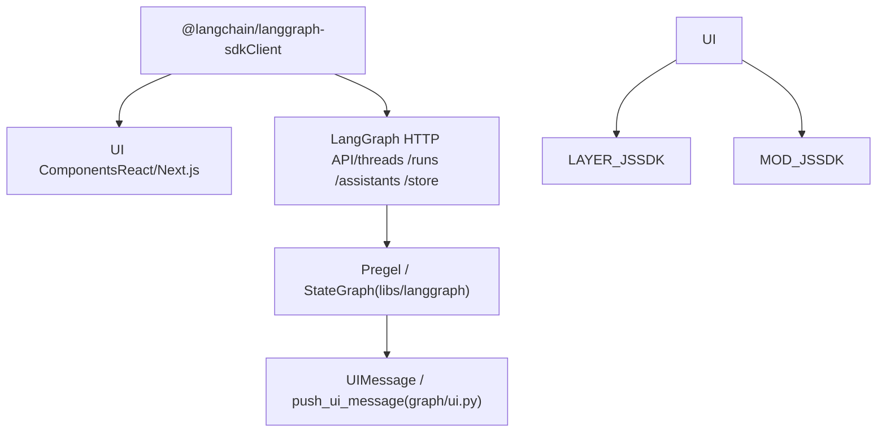
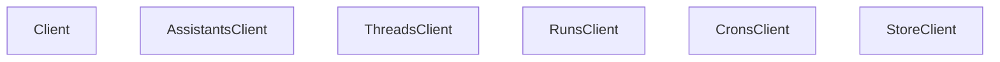

# JavaScript/TypeScript SDK

Relevant source files

-   [libs/langgraph/langgraph/graph/message.py](https://github.com/langchain-ai/langgraph/blob/1fd51e8f/libs/langgraph/langgraph/graph/message.py)
-   [libs/langgraph/langgraph/graph/ui.py](https://github.com/langchain-ai/langgraph/blob/1fd51e8f/libs/langgraph/langgraph/graph/ui.py)
-   [libs/langgraph/tests/test\_messages\_state.py](https://github.com/langchain-ai/langgraph/blob/1fd51e8f/libs/langgraph/tests/test_messages_state.py)
-   [libs/sdk-js/README.md](https://github.com/langchain-ai/langgraph/blob/1fd51e8f/libs/sdk-js/README.md?plain=1)
-   [libs/sdk-py/README.md](https://github.com/langchain-ai/langgraph/blob/1fd51e8f/libs/sdk-py/README.md?plain=1)

This page documents the JavaScript/TypeScript SDK for interacting with a deployed LangGraph API server. It covers the client class structure, available resource sub-clients, SSE-based streaming, and the UI integration patterns supported by the SDK.

For the Python counterpart to this SDK, see page [5.1](https://github.com/langchain-ai/langgraph/blob/1fd51e8f/5.1) For the HTTP transport and streaming internals shared across both SDKs, see page [5.3](https://github.com/langchain-ai/langgraph/blob/1fd51e8f/5.3) For the server-side data models that both SDKs operate on, see page [5.5](https://github.com/langchain-ai/langgraph/blob/1fd51e8f/5.5)

---

## Overview

The JS/TS SDK (formerly in `libs/sdk-js`, now moved to `langchain-ai/langgraphjs`) provides a `Client` class that communicates with the LangGraph API server over HTTP and SSE [libs/sdk-js/README.md1](https://github.com/langchain-ai/langgraph/blob/1fd51e8f/libs/sdk-js/README.md?plain=1#L1-L1) The SDK mirrors the Python SDK's resource sub-client model, providing a consistent interface for managing Assistants, Threads, Runs, and the Store.

**Diagram: JS/TS SDK Package Role in the Ecosystem**


Sources: [libs/sdk-js/README.md1](https://github.com/langchain-ai/langgraph/blob/1fd51e8f/libs/sdk-js/README.md?plain=1#L1-L1) [libs/langgraph/langgraph/graph/ui.py1-19](https://github.com/langchain-ai/langgraph/blob/1fd51e8f/libs/langgraph/langgraph/graph/ui.py#L1-L19)

---

## Client Structure

The JS/TS SDK exposes a top-level `Client` class. After construction, the client provides typed sub-clients for each API resource as properties. This architecture matches the Python SDK's `LangGraphClient` [libs/sdk-py/langgraph\_sdk/client.py12-55](https://github.com/langchain-ai/langgraph/blob/1fd51e8f/libs/sdk-py/langgraph_sdk/client.py#L12-L55)

**Diagram: JS Client Class Hierarchy**


Sources: [libs/sdk-py/langgraph\_sdk/client.py12-55](https://github.com/langchain-ai/langgraph/blob/1fd51e8f/libs/sdk-py/langgraph_sdk/client.py#L12-L55) [libs/sdk-py/README.md16-35](https://github.com/langchain-ai/langgraph/blob/1fd51e8f/libs/sdk-py/README.md?plain=1#L16-L35)

---

## UI Integration and Message Handling

The SDK facilitates "Generative UI" patterns by handling specific message types designed for frontend rendering.

### UI Message Types

The SDK supports `UIMessage` and `RemoveUIMessage` structures, which allow the graph execution to signal UI changes [libs/langgraph/langgraph/graph/ui.py22-58](https://github.com/langchain-ai/langgraph/blob/1fd51e8f/libs/langgraph/langgraph/graph/ui.py#L22-L58)

| Type | Attributes | Purpose |
| --- | --- | --- |
| `UIMessage` | `id`, `name`, `props`, `metadata` | Instructs the UI to render a specific component by name with provided props [libs/langgraph/langgraph/graph/ui.py22-41](https://github.com/langchain-ai/langgraph/blob/1fd51e8f/libs/langgraph/langgraph/graph/ui.py#L22-L41) |
| `RemoveUIMessage` | `id` | Instructs the UI to remove a previously rendered component [libs/langgraph/langgraph/graph/ui.py43-56](https://github.com/langchain-ai/langgraph/blob/1fd51e8f/libs/langgraph/langgraph/graph/ui.py#L43-L56) |

### State Reduction for UI

To manage the list of active UI components, the SDK logic (mirrored in `ui_message_reducer`) handles merging new messages and applying removals [libs/langgraph/langgraph/graph/ui.py165-227](https://github.com/langchain-ai/langgraph/blob/1fd51e8f/libs/langgraph/langgraph/graph/ui.py#L165-L227)

-   **Merging**: If a `UIMessage` arrives with an existing ID and `merge: true` in metadata, the SDK merges the new `props` with existing ones [libs/langgraph/langgraph/graph/ui.py211-216](https://github.com/langchain-ai/langgraph/blob/1fd51e8f/libs/langgraph/langgraph/graph/ui.py#L211-L216)
-   **Removal**: If a `RemoveUIMessage` arrives, the message with the corresponding ID is filtered out of the state [libs/langgraph/langgraph/graph/ui.py206-226](https://github.com/langchain-ai/langgraph/blob/1fd51e8f/libs/langgraph/langgraph/graph/ui.py#L206-L226)

### Helper Functions

-   `push_ui_message`: Used server-side to emit a UI event and update the graph state [libs/langgraph/langgraph/graph/ui.py61-130](https://github.com/langchain-ai/langgraph/blob/1fd51e8f/libs/langgraph/langgraph/graph/ui.py#L61-L130)
-   `delete_ui_message`: Used server-side to emit a removal event [libs/langgraph/langgraph/graph/ui.py133-162](https://github.com/langchain-ai/langgraph/blob/1fd51e8f/libs/langgraph/langgraph/graph/ui.py#L133-L162)

Sources: [libs/langgraph/langgraph/graph/ui.py22-227](https://github.com/langchain-ai/langgraph/blob/1fd51e8f/libs/langgraph/langgraph/graph/ui.py#L22-L227)

---

## Message State Management

The SDK handles complex message state updates using `add_messages`. This is critical for chat-based UIs where messages might be appended or updated (e.g., streaming LLM responses) [libs/langgraph/langgraph/graph/message.py61-90](https://github.com/langchain-ai/langgraph/blob/1fd51e8f/libs/langgraph/langgraph/graph/message.py#L61-L90)

### `add_messages` Logic

The `add_messages` function ensures that the message list remains consistent by:

1.  **Appending**: New messages are added to the end of the list [libs/langgraph/langgraph/graph/message.py69-70](https://github.com/langchain-ai/langgraph/blob/1fd51e8f/libs/langgraph/langgraph/graph/message.py#L69-L70)
2.  **Updating**: If a message in the update list has an ID matching an existing message, the old message is replaced [libs/langgraph/langgraph/graph/message.py88-89](https://github.com/langchain-ai/langgraph/blob/1fd51e8f/libs/langgraph/langgraph/graph/message.py#L88-L89)
3.  **Removing**: Supports `RemoveMessage` to delete specific entries from the state [libs/langgraph/tests/test\_messages\_state.py96-105](https://github.com/langchain-ai/langgraph/blob/1fd51e8f/libs/langgraph/tests/test_messages_state.py#L96-L105)

**Example: State Evolution**

```
// Initial stateconst left = [{ id: "1", content: "Hello" }];// Updateconst right = { id: "1", content: "Hello world" };// Resultconst result = add_messages(left, right); // [{ id: "1", content: "Hello world" }]
```
Sources: [libs/langgraph/langgraph/graph/message.py61-107](https://github.com/langchain-ai/langgraph/blob/1fd51e8f/libs/langgraph/langgraph/graph/message.py#L61-L107) [libs/langgraph/tests/test\_messages\_state.py29-61](https://github.com/langchain-ai/langgraph/blob/1fd51e8f/libs/langgraph/tests/test_messages_state.py#L29-L61)

---

## Streaming and Events

The JS/TS SDK utilizes the `RunsClient.stream()` method to consume Server-Sent Events (SSE).

**Diagram: Streaming Data Flow**

> **[Mermaid sequence]**
> *(图表结构无法解析)*

### Stream Modes

The SDK supports multiple stream modes that determine what data is pushed to the client:

-   `values`: Full state snapshots after each step.
-   `messages`: Incremental message updates (useful for chat).
-   `custom`: Used for UI-specific events like those generated by `push_ui_message` [libs/langgraph/langgraph/graph/ui.py126-128](https://github.com/langchain-ai/langgraph/blob/1fd51e8f/libs/langgraph/langgraph/graph/ui.py#L126-L128)

Sources: [libs/sdk-py/README.md31-35](https://github.com/langchain-ai/langgraph/blob/1fd51e8f/libs/sdk-py/README.md?plain=1#L31-L35) [libs/langgraph/langgraph/graph/ui.py126-130](https://github.com/langchain-ai/langgraph/blob/1fd51e8f/libs/langgraph/langgraph/graph/ui.py#L126-L130)
