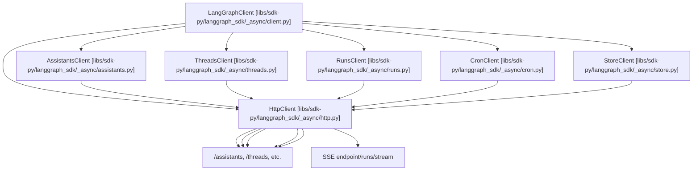
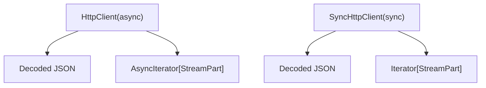
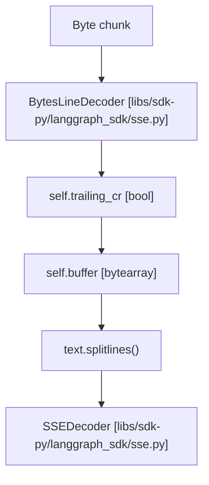

# HTTP Client and Streaming

Relevant source files

-   [libs/sdk-py/langgraph\_sdk/\_\_init\_\_.py](https://github.com/langchain-ai/langgraph/blob/1fd51e8f/libs/sdk-py/langgraph_sdk/__init__.py)
-   [libs/sdk-py/langgraph\_sdk/cache.py](https://github.com/langchain-ai/langgraph/blob/1fd51e8f/libs/sdk-py/langgraph_sdk/cache.py)
-   [libs/sdk-py/langgraph\_sdk/client.py](https://github.com/langchain-ai/langgraph/blob/1fd51e8f/libs/sdk-py/langgraph_sdk/client.py)
-   [libs/sdk-py/langgraph\_sdk/errors.py](https://github.com/langchain-ai/langgraph/blob/1fd51e8f/libs/sdk-py/langgraph_sdk/errors.py)
-   [libs/sdk-py/langgraph\_sdk/schema.py](https://github.com/langchain-ai/langgraph/blob/1fd51e8f/libs/sdk-py/langgraph_sdk/schema.py)
-   [libs/sdk-py/langgraph\_sdk/sse.py](https://github.com/langchain-ai/langgraph/blob/1fd51e8f/libs/sdk-py/langgraph_sdk/sse.py)
-   [libs/sdk-py/pyproject.toml](https://github.com/langchain-ai/langgraph/blob/1fd51e8f/libs/sdk-py/pyproject.toml)
-   [libs/sdk-py/tests/test\_api\_parity.py](https://github.com/langchain-ai/langgraph/blob/1fd51e8f/libs/sdk-py/tests/test_api_parity.py)
-   [libs/sdk-py/tests/test\_cache.py](https://github.com/langchain-ai/langgraph/blob/1fd51e8f/libs/sdk-py/tests/test_cache.py)
-   [libs/sdk-py/tests/test\_client\_stream.py](https://github.com/langchain-ai/langgraph/blob/1fd51e8f/libs/sdk-py/tests/test_client_stream.py)
-   [libs/sdk-py/tests/test\_crons\_client.py](https://github.com/langchain-ai/langgraph/blob/1fd51e8f/libs/sdk-py/tests/test_crons_client.py)
-   [libs/sdk-py/tests/test\_errors.py](https://github.com/langchain-ai/langgraph/blob/1fd51e8f/libs/sdk-py/tests/test_errors.py)

This document describes the HTTP client layer in the LangGraph Python SDK, which handles communication with the LangGraph API server. It covers JSON serialization with `orjson`, Server-Sent Events (SSE) streaming for real-time graph execution updates, and automatic reconnection logic for resilient streaming.

For information about the top-level SDK clients that use this HTTP layer, see [Python SDK](/langchain-ai/langgraph/5.1-python-sdk). For authentication and authorization, see [Authentication and Authorization](/langchain-ai/langgraph/5.4-authentication-and-authorization).

## HTTP Client Architecture

The SDK provides two HTTP client implementations: `HttpClient` for async operations and `SyncHttpClient` for synchronous operations. Both classes wrap `httpx.AsyncClient` and `httpx.Client` respectively, adding LangGraph-specific error handling and content processing.

### HttpClient Class

The `HttpClient` class handles all async HTTP operations to the LangGraph API. It is instantiated by `LangGraphClient` and shared across all sub-clients (assistants, threads, runs, crons, store).

**Code Entity Mapping: Async Client Architecture**

Sources: [libs/sdk-py/langgraph\_sdk/client.py12-21](https://github.com/langchain-ai/langgraph/blob/1fd51e8f/libs/sdk-py/langgraph_sdk/client.py#L12-L21) [libs/sdk-py/langgraph\_sdk/client.py33-55](https://github.com/langchain-ai/langgraph/blob/1fd51e8f/libs/sdk-py/langgraph_sdk/client.py#L33-L55)

### Request Methods

`HttpClient` provides standard HTTP methods with consistent error handling:

| Method | Purpose | Return Type |
| --- | --- | --- |
| `get(path, params, headers)` | GET requests | Decoded JSON |
| `post(path, json, params, headers)` | POST requests | Decoded JSON |
| `put(path, json, params, headers)` | PUT requests | Decoded JSON |
| `patch(path, json, params, headers)` | PATCH requests | Decoded JSON |
| `delete(path, json, params, headers)` | DELETE requests | None |
| `stream(path, method, json, params, headers)` | SSE streaming | `AsyncIterator[StreamPart]` |

All methods call `_araise_for_status_typed()` to raise typed exceptions on HTTP errors, and use `_aencode_json()` / `_adecode_json()` for JSON serialization.

Sources: [libs/sdk-py/langgraph\_sdk/errors.py213-221](https://github.com/langchain-ai/langgraph/blob/1fd51e8f/libs/sdk-py/langgraph_sdk/errors.py#L213-L221) [libs/sdk-py/langgraph\_sdk/client.py18](https://github.com/langchain-ai/langgraph/blob/1fd51e8f/libs/sdk-py/langgraph_sdk/client.py#L18-L18)

### SyncHttpClient Class

`SyncHttpClient` provides an identical interface to `HttpClient` but uses synchronous methods. It wraps `httpx.Client` and is used by `SyncLanggraphClient`.

The two implementations maintain API parity, with the only difference being async vs. sync execution. Tests verify this parity programmatically by comparing signatures and return annotations.

Sources: [libs/sdk-py/langgraph\_sdk/client.py26-31](https://github.com/langchain-ai/langgraph/blob/1fd51e8f/libs/sdk-py/langgraph_sdk/client.py#L26-L31) [libs/sdk-py/tests/test\_api\_parity.py51-61](https://github.com/langchain-ai/langgraph/blob/1fd51e8f/libs/sdk-py/tests/test_api_parity.py#L51-L61)

## JSON Serialization

The SDK uses `orjson` for fast, feature-rich JSON serialization. `orjson` is a required dependency as specified in the package configuration.

Sources: [libs/sdk-py/pyproject.toml14](https://github.com/langchain-ai/langgraph/blob/1fd51e8f/libs/sdk-py/pyproject.toml#L14-L14)

### Encoding and Decoding

Encoding and decoding functions are provided for both async and sync contexts:

-   **Async:** `_aencode_json` and `_adecode_json` [libs/sdk-py/langgraph\_sdk/client.py48-49](https://github.com/langchain-ai/langgraph/blob/1fd51e8f/libs/sdk-py/langgraph_sdk/client.py#L48-L49)
-   **Sync:** `_encode_json` and `_decode_json` [libs/sdk-py/langgraph\_sdk/client.py50-51](https://github.com/langchain-ai/langgraph/blob/1fd51e8f/libs/sdk-py/langgraph_sdk/client.py#L50-L51)

The SDK handles complex types by converting them to JSON-serializable formats. If `orjson` cannot serialize an object natively, the SDK provides fallback logic for Pydantic models (v1 and v2) and sets.

Sources: [libs/sdk-py/langgraph\_sdk/client.py48-51](https://github.com/langchain-ai/langgraph/blob/1fd51e8f/libs/sdk-py/langgraph_sdk/client.py#L48-L51)

## Server-Sent Events (SSE) Streaming

The SDK implements full Server-Sent Events (SSE) support for streaming graph execution updates. SSE is a text-based protocol where the server sends events as newline-delimited text.

### StreamPart Structure

Events are parsed into `StreamPart` structures. The SDK defines several specialized stream part types for different stream modes, such as `ValuesStreamPart`, `UpdatesStreamPart`, and `DebugStreamPart`.

Sources: [libs/sdk-py/langgraph\_sdk/schema.py51-72](https://github.com/langchain-ai/langgraph/blob/1fd51e8f/libs/sdk-py/langgraph_sdk/schema.py#L51-L72) [libs/sdk-py/tests/test\_client\_stream.py13-28](https://github.com/langchain-ai/langgraph/blob/1fd51e8f/libs/sdk-py/tests/test_client_stream.py#L13-L28)

### BytesLineDecoder

`BytesLineDecoder` handles incremental line splitting from chunked byte streams. It correctly handles universal newlines (`\n`, `\r`, and `\r\n`) per the SSE specification.

**Code Entity Mapping: SSE Decoding Flow**

The decoder maintains a buffer for incomplete lines and handles edge cases like trailing `\r` characters by pushing them to the next iteration.

Sources: [libs/sdk-py/langgraph\_sdk/sse.py17-66](https://github.com/langchain-ai/langgraph/blob/1fd51e8f/libs/sdk-py/langgraph_sdk/sse.py#L17-L66)

### SSEDecoder

`SSEDecoder` implements the logic for parsing field-value pairs from the line-delimited stream.

1.  **Field Parsing:** It splits lines on the `:` character to extract `event`, `data`, `id`, and `retry` fields. [libs/sdk-py/langgraph\_sdk/sse.py119-137](https://github.com/langchain-ai/langgraph/blob/1fd51e8f/libs/sdk-py/langgraph_sdk/sse.py#L119-L137)
2.  **Data Accumulation:** Multiple `data:` lines for a single event are concatenated into a buffer. [libs/sdk-py/langgraph\_sdk/sse.py127-128](https://github.com/langchain-ai/langgraph/blob/1fd51e8f/libs/sdk-py/langgraph_sdk/sse.py#L127-L128)
3.  **Event Flushing:** An empty line signals the completion of an event, at which point the accumulated data is parsed as JSON and yielded as a `StreamPart`. [libs/sdk-py/langgraph\_sdk/sse.py103-114](https://github.com/langchain-ai/langgraph/blob/1fd51e8f/libs/sdk-py/langgraph_sdk/sse.py#L103-L114)

Sources: [libs/sdk-py/langgraph\_sdk/sse.py78-139](https://github.com/langchain-ai/langgraph/blob/1fd51e8f/libs/sdk-py/langgraph_sdk/sse.py#L78-L139)

## Error Handling

The SDK maps HTTP status codes to specific exception classes for precise error handling.

### APIStatusError Hierarchy

All HTTP error responses (status code >= 400) are converted into typed exceptions:

| Status Code | Exception Class |
| --- | --- |
| 400 | `BadRequestError` |
| 401 | `AuthenticationError` |
| 403 | `PermissionDeniedError` |
| 404 | `NotFoundError` |
| 409 | `ConflictError` |
| 422 | `UnprocessableEntityError` |
| 429 | `RateLimitError` |
| 5xx | `InternalServerError` |

Sources: [libs/sdk-py/langgraph\_sdk/errors.py108-137](https://github.com/langchain-ai/langgraph/blob/1fd51e8f/libs/sdk-py/langgraph_sdk/errors.py#L108-L137) [libs/sdk-py/langgraph\_sdk/errors.py190-210](https://github.com/langchain-ai/langgraph/blob/1fd51e8f/libs/sdk-py/langgraph_sdk/errors.py#L190-L210)

### Error Decoding

When an error occurs, the SDK attempts to decode the error body to extract a descriptive message. It looks for `message`, `detail`, or `error` keys in the JSON response.

Sources: [libs/sdk-py/langgraph\_sdk/errors.py140-155](https://github.com/langchain-ai/langgraph/blob/1fd51e8f/libs/sdk-py/langgraph_sdk/errors.py#L140-L155) [libs/sdk-py/langgraph\_sdk/errors.py174-188](https://github.com/langchain-ai/langgraph/blob/1fd51e8f/libs/sdk-py/langgraph_sdk/errors.py#L174-L188)

## Testing Infrastructure

The SDK includes comprehensive tests for streaming and error mapping:

-   **Streaming Tests:** `test_client_stream.py` verifies SSE parsing, trailing event flushing, and reconnection logic. [libs/sdk-py/tests/test\_client\_stream.py92-156](https://github.com/langchain-ai/langgraph/blob/1fd51e8f/libs/sdk-py/tests/test_client_stream.py#L92-L156)
-   **Error Mapping Tests:** `test_errors.py` ensures that HTTP status codes are correctly mapped to the corresponding `APIStatusError` subclasses and that error messages are properly extracted. [libs/sdk-py/tests/test\_errors.py43-56](https://github.com/langchain-ai/langgraph/blob/1fd51e8f/libs/sdk-py/tests/test_errors.py#L43-L56)
-   **API Parity:** Programmatic checks ensure that the synchronous client mirrors the asynchronous client's API surface exactly. [libs/sdk-py/tests/test\_api\_parity.py51-61](https://github.com/langchain-ai/langgraph/blob/1fd51e8f/libs/sdk-py/tests/test_api_parity.py#L51-L61)

Sources: [libs/sdk-py/tests/test\_client\_stream.py1-249](https://github.com/langchain-ai/langgraph/blob/1fd51e8f/libs/sdk-py/tests/test_client_stream.py#L1-L249) [libs/sdk-py/tests/test\_errors.py1-145](https://github.com/langchain-ai/langgraph/blob/1fd51e8f/libs/sdk-py/tests/test_errors.py#L1-L145)
