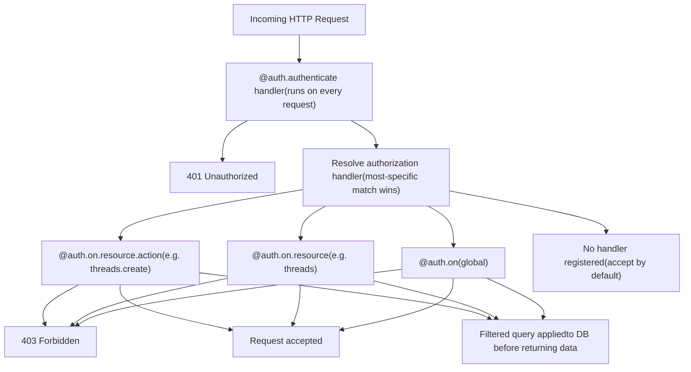
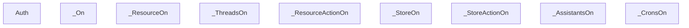
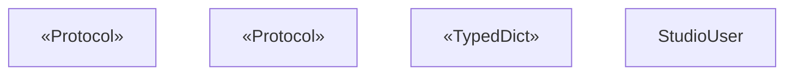
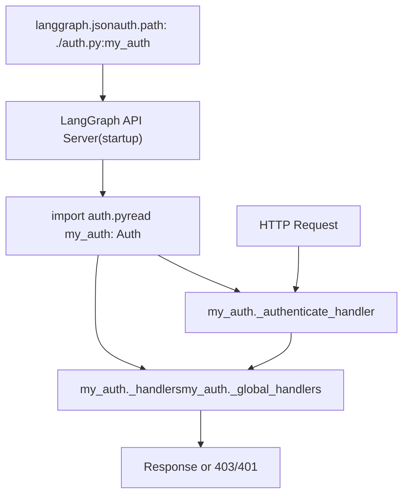

# Authentication and Authorization

Relevant source files

-   [libs/sdk-py/langgraph\_sdk/auth/\_\_init\_\_.py](https://github.com/langchain-ai/langgraph/blob/1fd51e8f/libs/sdk-py/langgraph_sdk/auth/__init__.py)
-   [libs/sdk-py/langgraph\_sdk/auth/exceptions.py](https://github.com/langchain-ai/langgraph/blob/1fd51e8f/libs/sdk-py/langgraph_sdk/auth/exceptions.py)
-   [libs/sdk-py/langgraph\_sdk/auth/types.py](https://github.com/langchain-ai/langgraph/blob/1fd51e8f/libs/sdk-py/langgraph_sdk/auth/types.py)

This page documents the authentication and authorization system available in the `langgraph-sdk` Python package. It covers the `Auth` class, how to register authentication and authorization handlers, the `FilterType` for server-side query filtering, all relevant user and context types, and how to wire everything together through `langgraph.json`.

For information about the HTTP client layer and error types (including `AuthenticationError`, `PermissionDeniedError`) raised when auth fails on the client side, see [HTTP Client and Streaming](/langchain-ai/langgraph/5.3-http-client-and-streaming). For the `langgraph.json` `auth` configuration block, see [Configuration System (langgraph.json)](/langchain-ai/langgraph/6.2-configuration-system-(langgraph.json)).

---

## Overview

The auth system has two distinct stages that run server-side on every incoming request to the LangGraph API server:

1.  **Authentication** — verifies the caller's identity and produces a user object.
2.  **Authorization** — decides whether the authenticated user may perform the requested action on the requested resource, and optionally injects filters to limit what data is returned.

Both stages are configured by creating an `Auth` instance in a Python module, registering handlers on it with decorators, and pointing `langgraph.json` at that module.

**Request processing flow:**


Sources: [libs/sdk-py/langgraph\_sdk/auth/\_\_init\_\_.py96-107](https://github.com/langchain-ai/langgraph/blob/1fd51e8f/libs/sdk-py/langgraph_sdk/auth/__init__.py#L96-L107)

---

## The `Auth` Class

`Auth` is defined in [libs/sdk-py/langgraph\_sdk/auth/\_\_init\_\_.py13-301](https://github.com/langchain-ai/langgraph/blob/1fd51e8f/libs/sdk-py/langgraph_sdk/auth/__init__.py#L13-L301) and exported from `langgraph_sdk` directly.

```
from langgraph_sdk import Auth
```
Instantiate once per module; then use its decorators to register handlers.

| Attribute / Method | Type | Purpose |
| --- | --- | --- |
| `authenticate` | decorator | Registers the single authentication handler |
| `on` | `_On` instance | Entry point for all authorization handler registration |
| `types` | module reference | Shortcut to `langgraph_sdk.auth.types` |
| `exceptions` | module reference | Shortcut to `langgraph_sdk.auth.exceptions` |

**Internal state** (accessed by the API server at runtime):

| Slot | Type | Purpose |
| --- | --- | --- |
| `_authenticate_handler` | `Authenticator | None` | The single registered auth function |
| `_handlers` | `dict[tuple[str,str], list[Handler]]` | Per `(resource, action)` handler lists |
| `_global_handlers` | `list[Handler]` | Handlers registered on `@auth.on` with no resource/action |
| `_handler_cache` | `dict[tuple[str,str], Handler]` | Resolved handler cache |

Sources: [libs/sdk-py/langgraph\_sdk/auth/\_\_init\_\_.py109-224](https://github.com/langchain-ai/langgraph/blob/1fd51e8f/libs/sdk-py/langgraph_sdk/auth/__init__.py#L109-L224)

---

## Authentication — `@auth.authenticate`

Registers one async function as the credential verifier. Only one authenticator may be registered per `Auth` instance [libs/sdk-py/langgraph\_sdk/auth/\_\_init\_\_.py225-231](https://github.com/langchain-ai/langgraph/blob/1fd51e8f/libs/sdk-py/langgraph_sdk/auth/__init__.py#L225-L231)

The server injects the following parameters by name into the handler (any subset can be declared):

| Parameter | Type | Description |
| --- | --- | --- |
| `request` | `Request` | Raw ASGI request object |
| `body` | `dict` | Parsed request body |
| `path` | `str` | URL path, e.g. `/threads/…/runs/…/stream` |
| `method` | `str` | HTTP method, e.g. `GET` |
| `path_params` | `dict[str, str] | None` | URL path parameters |
| `query_params` | `dict[str, str] | None` | URL query parameters |
| `headers` | `dict[bytes, bytes] | None` | Request headers |
| `authorization` | `str | None` | Value of the `Authorization` header |

The handler must return one of:

-   A `str` (treated as `identity`)
-   A `MinimalUserDict` (TypedDict with `identity` required)
-   Any object implementing `MinimalUser` or `BaseUser`
-   Any `Mapping[str, Any]` with at least an `"identity"` key

If authentication fails, raise `Auth.exceptions.HTTPException(status_code=401, ...)` [libs/sdk-py/langgraph\_sdk/auth/exceptions.py9-44](https://github.com/langchain-ai/langgraph/blob/1fd51e8f/libs/sdk-py/langgraph_sdk/auth/exceptions.py#L9-L44)

**Usage example:**

```
@auth.authenticateasync def authenticate(authorization: str) -> Auth.types.MinimalUserDict:    user = await verify_token(authorization)    if not user:        raise Auth.exceptions.HTTPException(status_code=401, detail="Unauthorized")    return {"identity": user["id"], "permissions": user.get("permissions", [])}
```
Sources: [libs/sdk-py/langgraph\_sdk/auth/\_\_init\_\_.py225-301](https://github.com/langchain-ai/langgraph/blob/1fd51e8f/libs/sdk-py/langgraph_sdk/auth/__init__.py#L225-L301) [libs/sdk-py/langgraph\_sdk/auth/types.py277-370](https://github.com/langchain-ai/langgraph/blob/1fd51e8f/libs/sdk-py/langgraph_sdk/auth/types.py#L277-L370)

---

## Authorization — `auth.on`

`auth.on` is an instance of `_On` [libs/sdk-py/langgraph\_sdk/auth/\_\_init\_\_.py130](https://github.com/langchain-ai/langgraph/blob/1fd51e8f/libs/sdk-py/langgraph_sdk/auth/__init__.py#L130-L130) It serves as the root for registering authorization handlers at three levels of specificity.

**Authorization handler class structure:**


Sources: [libs/sdk-py/langgraph\_sdk/auth/\_\_init\_\_.py318-744](https://github.com/langchain-ai/langgraph/blob/1fd51e8f/libs/sdk-py/langgraph_sdk/auth/__init__.py#L318-L744)

### Handler Levels

**Global handler** — runs for all resources and actions not matched by a more specific handler:

```
@auth.onasync def deny_all(ctx: Auth.types.AuthContext, value: Any) -> bool:    return False
```
**Resource-level handler** — runs for all actions on the specified resource:

```
@auth.on.threadsasync def allow_threads(ctx: Auth.types.AuthContext, value: Any) -> Auth.types.FilterType:    return {"owner": ctx.user.identity}
```
**Resource + action handler** — most specific; overrides both of the above:

```
@auth.on.threads.createasync def on_thread_create(ctx: Auth.types.AuthContext, value: Auth.types.ThreadsCreate):    value.setdefault("metadata", {})["owner"] = ctx.user.identity
```
**Multi-resource / multi-action** — parameterized form:

```
@auth.on(resources=["threads", "assistants"], actions=["read", "search"])async def allow_reads(ctx: Auth.types.AuthContext, value: Any) -> Auth.types.FilterType:    return {"owner": ctx.user.identity}
```
### Handler Precedence

When a request arrives, the server selects the most specific registered handler:

```
(resource, action)  →  (resource, "*")  →  global  →  accept (no handler)
```
Only one handler is invoked per request. The first matching level wins [libs/sdk-py/langgraph\_sdk/auth/\_\_init\_\_.py96-107](https://github.com/langchain-ai/langgraph/blob/1fd51e8f/libs/sdk-py/langgraph_sdk/auth/__init__.py#L96-L107)

### Handler Signature

Every authorization handler must be `async` and accept exactly two parameters (by name) [libs/sdk-py/langgraph\_sdk/auth/\_\_init\_\_.py140-142](https://github.com/langchain-ai/langgraph/blob/1fd51e8f/libs/sdk-py/langgraph_sdk/auth/__init__.py#L140-L142):

| Parameter | Type | Description |
| --- | --- | --- |
| `ctx` | `AuthContext` | Authenticated user, permissions, resource, action |
| `value` | resource-specific TypedDict | The operation payload (see resource value types below) |

---

## Handler Return Values

| Return value | Meaning |
| --- | --- |
| `None` or `True` | Accept the request |
| `False` | Reject with HTTP 403 |
| `FilterType` | Apply the filter to the database query before returning data |

`HandlerResult` is defined as `None | bool | FilterType` in [libs/sdk-py/langgraph\_sdk/auth/types.py138-143](https://github.com/langchain-ai/langgraph/blob/1fd51e8f/libs/sdk-py/langgraph_sdk/auth/types.py#L138-L143)

---

## `FilterType`

`FilterType` [libs/sdk-py/langgraph\_sdk/auth/types.py58-109](https://github.com/langchain-ai/langgraph/blob/1fd51e8f/libs/sdk-py/langgraph_sdk/auth/types.py#L58-L109) is a `dict` returned by authorization handlers to restrict which records the server returns. The server applies it as a WHERE-clause equivalent.

**Supported operators:**

| Syntax | Meaning |
| --- | --- |
| `{"field": "value"}` | Exact match (shorthand) |
| `{"field": {"$eq": "value"}}` | Exact match (explicit) |
| `{"field": {"$contains": "value"}}` | Field list/set contains `value` |
| `{"field": {"$contains": ["v1", "v2"]}}` | Field list/set contains all of `v1`, `v2` |
| Multiple keys | Logical AND of all conditions |

**Examples:**

```
# Exact match{"owner": ctx.user.identity} # Membership check{"participants": {"$contains": ctx.user.identity}} # AND combination{"owner": ctx.user.identity, "participants": {"$contains": "user-efgh456"}}
```
> Subset containment (`$contains` with a list) requires `langgraph-runtime-inmem >= 0.14.1` [libs/sdk-py/langgraph\_sdk/auth/types.py75-76](https://github.com/langchain-ai/langgraph/blob/1fd51e8f/libs/sdk-py/langgraph_sdk/auth/types.py#L75-L76)

Sources: [libs/sdk-py/langgraph\_sdk/auth/types.py58-109](https://github.com/langchain-ai/langgraph/blob/1fd51e8f/libs/sdk-py/langgraph_sdk/auth/types.py#L58-L109)

---

## User Types

**Class / type hierarchy for user objects:**


| Type | Location | Purpose |
| --- | --- | --- |
| `MinimalUser` | [libs/sdk-py/langgraph\_sdk/auth/types.py150-161](https://github.com/langchain-ai/langgraph/blob/1fd51e8f/libs/sdk-py/langgraph_sdk/auth/types.py#L150-L161) | Protocol: only requires `identity` property |
| `MinimalUserDict` | [libs/sdk-py/langgraph\_sdk/auth/types.py164-178](https://github.com/langchain-ai/langgraph/blob/1fd51e8f/libs/sdk-py/langgraph_sdk/auth/types.py#L164-L178) | TypedDict returned by most authenticators |
| `BaseUser` | [libs/sdk-py/langgraph\_sdk/auth/types.py181-215](https://github.com/langchain-ai/langgraph/blob/1fd51e8f/libs/sdk-py/langgraph_sdk/auth/types.py#L181-L215) | Full ASGI user protocol |
| `StudioUser` | [libs/sdk-py/langgraph\_sdk/auth/types.py218-275](https://github.com/langchain-ai/langgraph/blob/1fd51e8f/libs/sdk-py/langgraph_sdk/auth/types.py#L218-L275) | Populated for requests from LangGraph Studio UI |
| `Authenticator` | [libs/sdk-py/langgraph\_sdk/auth/types.py277-370](https://github.com/langchain-ai/langgraph/blob/1fd51e8f/libs/sdk-py/langgraph_sdk/auth/types.py#L277-L370) | `Callable` type alias for authenticate functions |

### `StudioUser`

`StudioUser` is set as `ctx.user` when a request originates from the LangGraph Studio frontend. Studio auth can be disabled in `langgraph.json` [libs/sdk-py/langgraph\_sdk/auth/types.py223-229](https://github.com/langchain-ai/langgraph/blob/1fd51e8f/libs/sdk-py/langgraph_sdk/auth/types.py#L223-L229):

```
{  "auth": {    "disable_studio_auth": true  }}
```
Use `isinstance(ctx.user, Auth.types.StudioUser)` inside `@auth.on` handlers to grant developers pass-through access while applying normal rules to end users [libs/sdk-py/langgraph\_sdk/auth/types.py231-245](https://github.com/langchain-ai/langgraph/blob/1fd51e8f/libs/sdk-py/langgraph_sdk/auth/types.py#L231-L245)

Sources: [libs/sdk-py/langgraph\_sdk/auth/types.py150-275](https://github.com/langchain-ai/langgraph/blob/1fd51e8f/libs/sdk-py/langgraph_sdk/auth/types.py#L150-L275)

---

## `AuthContext`

`AuthContext` [libs/sdk-py/langgraph\_sdk/auth/types.py388-426](https://github.com/langchain-ai/langgraph/blob/1fd51e8f/libs/sdk-py/langgraph_sdk/auth/types.py#L388-L426) is the `ctx` object injected into every authorization handler.

| Field | Type | Description |
| --- | --- | --- |
| `user` | `BaseUser` | The authenticated user object |
| `permissions` | `Sequence[str]` | The user's permissions list |
| `resource` | `Literal["runs","threads","crons","assistants","store"]` | The resource being accessed |
| `action` | `Literal[...]` | The action being performed |

**Actions by resource:**

| Resource | Actions |
| --- | --- |
| `threads` | `create`, `read`, `update`, `delete`, `search`, `create_run` |
| `assistants` | `create`, `read`, `update`, `delete`, `search` |
| `crons` | `create`, `read`, `update`, `delete`, `search` |
| `store` | `put`, `get`, `search`, `delete`, `list_namespaces` |

Sources: [libs/sdk-py/langgraph\_sdk/auth/types.py373-426](https://github.com/langchain-ai/langgraph/blob/1fd51e8f/libs/sdk-py/langgraph_sdk/auth/types.py#L373-L426)

---

## Resource Value TypedDicts

The `value` parameter in authorization handlers is a TypedDict specific to the resource and action. All are defined in [libs/sdk-py/langgraph\_sdk/auth/types.py](https://github.com/langchain-ai/langgraph/blob/1fd51e8f/libs/sdk-py/langgraph_sdk/auth/types.py)

**Threads:**

| Action | TypedDict | Key fields |
| --- | --- | --- |
| `create` | `ThreadsCreate` | `thread_id`, `metadata`, `if_exists`, `ttl` |
| `read` | `ThreadsRead` | `thread_id`, `run_id` |
| `update` | `ThreadsUpdate` | `thread_id`, `metadata`, `action` |
| `delete` | `ThreadsDelete` | `thread_id`, `run_id` |
| `search` | `ThreadsSearch` | `metadata`, `values`, `status`, `limit`, `offset` |
| `create_run` | `RunsCreate` | `thread_id`, `assistant_id`, `run_id`, `metadata`, `kwargs` |

**Store** [libs/sdk-py/langgraph\_sdk/auth/types.py844-934](https://github.com/langchain-ai/langgraph/blob/1fd51e8f/libs/sdk-py/langgraph_sdk/auth/types.py#L844-L934):

| Action | TypedDict | Key fields |
| --- | --- | --- |
| `put` | `StorePut` | `namespace`, `key`, `value`, `ttl` |
| `get` | `StoreGet` | `namespace`, `key` |
| `search` | `StoreSearch` | `namespace`, `query`, `filter`, `limit`, `offset` |
| `delete` | `StoreDelete` | `namespace`, `key` |
| `list_namespaces` | `StoreListNamespaces` | `prefix`, `suffix`, `max_depth`, `limit`, `offset` |

> For the store resource, `value` is mutable. Modifying `value["namespace"]` rewrites the namespace used for the actual operation — this is the standard pattern for scoping store access per user [libs/sdk-py/langgraph\_sdk/auth/\_\_init\_\_.py88-94](https://github.com/langchain-ai/langgraph/blob/1fd51e8f/libs/sdk-py/langgraph_sdk/auth/__init__.py#L88-L94)

Sources: [libs/sdk-py/langgraph\_sdk/auth/types.py443](https://github.com/langchain-ai/langgraph/blob/1fd51e8f/libs/sdk-py/langgraph_sdk/auth/types.py#L443-LNaN)

---

## Wiring into `langgraph.json`

The `Auth` instance is loaded by the LangGraph API server at startup. Point to it via the `auth.path` key in `langgraph.json` [libs/sdk-py/langgraph\_sdk/auth/\_\_init\_\_.py26-38](https://github.com/langchain-ai/langgraph/blob/1fd51e8f/libs/sdk-py/langgraph_sdk/auth/__init__.py#L26-L38):

```
{  "dependencies": ["."],  "graphs": {    "agent": "./my_agent/agent.py:graph"  },  "env": ".env",  "auth": {    "path": "./auth.py:my_auth"  }}
```
The value of `path` follows the format `<module_path>:<variable_name>`.

**Auth flow from configuration to request handling:**


Sources: [libs/sdk-py/langgraph\_sdk/auth/\_\_init\_\_.py26-40](https://github.com/langchain-ai/langgraph/blob/1fd51e8f/libs/sdk-py/langgraph_sdk/auth/__init__.py#L26-L40)

---

## Exceptions

`Auth.exceptions` is a module reference to `langgraph_sdk.auth.exceptions`. Use `Auth.exceptions.HTTPException` inside authentication handlers to return structured error responses [libs/sdk-py/langgraph\_sdk/auth/exceptions.py9-57](https://github.com/langchain-ai/langgraph/blob/1fd51e8f/libs/sdk-py/langgraph_sdk/auth/exceptions.py#L9-L57):

```
raise Auth.exceptions.HTTPException(status_code=401, detail="Invalid token")
```
Sources: [libs/sdk-py/langgraph\_sdk/auth/exceptions.py1-60](https://github.com/langchain-ai/langgraph/blob/1fd51e8f/libs/sdk-py/langgraph_sdk/auth/exceptions.py#L1-L60) [libs/sdk-py/langgraph\_sdk/auth/\_\_init\_\_.py121-127](https://github.com/langchain-ai/langgraph/blob/1fd51e8f/libs/sdk-py/langgraph_sdk/auth/__init__.py#L121-L127)

---

## Complete Handler Pattern Reference

The following diagram summarizes which decorator to use for each combination of resource and action.

```mermaid
flowchart TD
    ON["auth.on"]
    GLOBAL["_global_handlerskey: ('','')"]
    TH["auth.on.threads_ThreadsOn"]
    AS["auth.on.assistants_AssistantsOn"]
    CR["auth.on.crons_CronsOn"]
    ST["auth.on.store_StoreOn"]
    TH_ALL["('threads','*')"]
    TH_C["auth.on.threads.create('threads','create')"]
    TH_R["auth.on.threads.read('threads','read')"]
    TH_U["auth.on.threads.update('threads','update')"]
    TH_D["auth.on.threads.delete('threads','delete')"]
    TH_S["auth.on.threads.search('threads','search')"]
    TH_CR["auth.on.threads.create_run('threads','create_run')"]
    AS_ALL["('assistants','*')"]
    AS_C["auth.on.assistants.create"]
    AS_R["auth.on.assistants.read"]
    AS_D["auth.on.assistants.delete"]
    AS_S["auth.on.assistants.search"]
    ST_ALL["('store','*')"]
    ST_P["auth.on.store.put('store','put')"]
    ST_G["auth.on.store.get('store','get')"]
    ST_S["auth.on.store.search('store','search')"]
    ST_D["auth.on.store.delete('store','delete')"]
    ST_L["auth.on.store.list_namespaces('store','list_namespaces')"]

    ON --> GLOBAL
    ON --> TH
    ON --> AS
    ON --> CR
    ON --> ST
    TH --> TH_ALL
    TH --> TH_C
    TH --> TH_R
    TH --> TH_U
    TH --> TH_D
    TH --> TH_S
    TH --> TH_CR
    AS --> AS_ALL
    AS --> AS_C
    AS --> AS_R
    AS --> AS_D
    AS --> AS_S
    ST --> ST_ALL
    ST --> ST_P
    ST --> ST_G
    ST --> ST_S
    ST --> ST_D
    ST --> ST_L
```


Sources: [libs/sdk-py/langgraph\_sdk/auth/\_\_init\_\_.py440-744](https://github.com/langchain-ai/langgraph/blob/1fd51e8f/libs/sdk-py/langgraph_sdk/auth/__init__.py#L440-L744)
