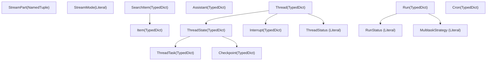
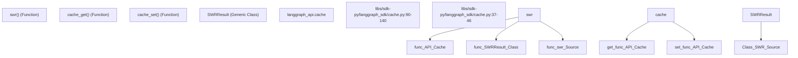

# Data Models and Schemas

Relevant source files

-   [libs/sdk-py/langgraph\_sdk/\_\_init\_\_.py](https://github.com/langchain-ai/langgraph/blob/1fd51e8f/libs/sdk-py/langgraph_sdk/__init__.py)
-   [libs/sdk-py/langgraph\_sdk/cache.py](https://github.com/langchain-ai/langgraph/blob/1fd51e8f/libs/sdk-py/langgraph_sdk/cache.py)
-   [libs/sdk-py/langgraph\_sdk/client.py](https://github.com/langchain-ai/langgraph/blob/1fd51e8f/libs/sdk-py/langgraph_sdk/client.py)
-   [libs/sdk-py/langgraph\_sdk/schema.py](https://github.com/langchain-ai/langgraph/blob/1fd51e8f/libs/sdk-py/langgraph_sdk/schema.py)
-   [libs/sdk-py/pyproject.toml](https://github.com/langchain-ai/langgraph/blob/1fd51e8f/libs/sdk-py/pyproject.toml)
-   [libs/sdk-py/tests/test\_cache.py](https://github.com/langchain-ai/langgraph/blob/1fd51e8f/libs/sdk-py/tests/test_cache.py)
-   [libs/sdk-py/tests/test\_crons\_client.py](https://github.com/langchain-ai/langgraph/blob/1fd51e8f/libs/sdk-py/tests/test_crons_client.py)

This document describes the data models and type definitions in the LangGraph SDK's schema module. These types define the contract between client and server, providing structured representations of resources (Assistants, Threads, Runs, Crons), execution state, requests/responses, and streaming events.

For information about how these schemas are used in client operations, see [Python SDK](/langchain-ai/langgraph/5.1-python-sdk). For authentication-related type definitions, see [Authentication and Authorization](/langchain-ai/langgraph/5.4-authentication-and-authorization).

---

## Overview

The schema module ([libs/sdk-py/langgraph\_sdk/schema.py1-659](https://github.com/langchain-ai/langgraph/blob/1fd51e8f/libs/sdk-py/langgraph_sdk/schema.py#L1-L659)) serves as the single source of truth for all data structures exchanged between the LangGraph SDK client and the LangGraph API server. It defines:

-   **Resource types**: Persistent entities like `Assistant`, `Thread`, `Run`, `Cron`
-   **Graph schema types**: Graph structure definitions like `GraphSchema`, `Subgraphs`
-   **State types**: Execution state representations like `ThreadState`, `Checkpoint`, `ThreadTask`
-   **Request/response types**: Payloads for API operations like `RunCreate`, `ThreadUpdateStateResponse`, `RunCreateMetadata`
-   **Store types**: Cross-thread memory structures like `Item`, `SearchItem`
-   **Streaming types**: Real-time event representations like `StreamPart`
-   **Control flow types**: Graph execution control like `Command`, `Send`
-   **Type aliases**: Constrained values like `RunStatus`, `StreamMode`, `MultitaskStrategy`, `PruneStrategy`, `BulkCancelRunsStatus`

All types are defined using Python's `TypedDict`, `NamedTuple`, or type aliases, providing static type checking while maintaining JSON serialization compatibility.

**Sources**: [libs/sdk-py/langgraph\_sdk/schema.py1-21](https://github.com/langchain-ai/langgraph/blob/1fd51e8f/libs/sdk-py/langgraph_sdk/schema.py#L1-L21)

---

## Type System Architecture

### Natural Language to Code Entity Mapping

This diagram maps abstract system concepts to their specific `TypedDict` or `Literal` implementations in the codebase.

```mermaid
flowchart TD
    Concept_Agent["Agent Definition"]
    Concept_Conversation["Conversation Context"]
    Concept_Execution["Active Execution"]
    Concept_Schedule["Recurring Task"]
    Concept_Memory["Long-term Memory"]
    Assistant["Assistant (TypedDict)"]
    Thread["Thread (TypedDict)"]
    Run["Run (TypedDict)"]
    Cron["Cron (TypedDict)"]
    Item["Item (TypedDict)"]
    Assistant_Source["libs/sdk-py/langgraph_sdk/schema.py:236-247"]
    Thread_Source["libs/sdk-py/langgraph_sdk/schema.py:267-284"]
    Run_Source["libs/sdk-py/langgraph_sdk/schema.py:327-346"]
    Cron_Source["libs/sdk-py/langgraph_sdk/schema.py:373-401"]
    Item_Source["libs/sdk-py/langgraph_sdk/schema.py:501-520"]

    Concept --> Agent_Assistant
    Concept --> Conversation_Thread
    Concept --> Execution_Run
    Concept --> Schedule_Cron
    Concept --> Memory_Item
    Assistant --> Assistant_Source
    Thread --> Thread_Source
    Run --> Run_Source
    Cron --> Cron_Source
    Item --> Item_Source
```


**Sources**: [libs/sdk-py/langgraph\_sdk/schema.py236-520](https://github.com/langchain-ai/langgraph/blob/1fd51e8f/libs/sdk-py/langgraph_sdk/schema.py#L236-L520)

### Internal Data Flow

The following diagram illustrates how core data structures relate to one another during graph execution.


**Sources**: [libs/sdk-py/langgraph\_sdk/schema.py23-545](https://github.com/langchain-ai/langgraph/blob/1fd51e8f/libs/sdk-py/langgraph_sdk/schema.py#L23-L545)

---

## Core Resource Models

### Assistant

The `Assistant` type represents a versioned configuration for a graph. It encapsulates the graph to execute, runtime configuration, static context, and metadata.

| Field | Type | Description |
| --- | --- | --- |
| `assistant_id` | `str` | Unique identifier |
| `graph_id` | `str` | Reference to the graph definition |
| `config` | `Config` | Runtime configuration including tags and recursion limits |
| `context` | `Context` | Static context passed to the graph |
| `metadata` | `Json` | Arbitrary metadata dictionary |
| `version` | `int` | Auto-incrementing version number |

**Sources**: [libs/sdk-py/langgraph\_sdk/schema.py213-247](https://github.com/langchain-ai/langgraph/blob/1fd51e8f/libs/sdk-py/langgraph_sdk/schema.py#L213-L247)

### Thread

The `Thread` type represents a conversation or execution context. It maintains current state, status, and any pending interrupts.

| Field | Type | Description |
| --- | --- | --- |
| `thread_id` | `str` | Unique identifier |
| `status` | `ThreadStatus` | Current status: `"idle"`, `"busy"`, `"interrupted"`, or `"error"` |
| `values` | `Json` | Current state values |
| `interrupts` | `dict[str, list[Interrupt]]` | Map of task IDs to interrupts |

**Sources**: [libs/sdk-py/langgraph\_sdk/schema.py267-284](https://github.com/langchain-ai/langgraph/blob/1fd51e8f/libs/sdk-py/langgraph_sdk/schema.py#L267-L284) [libs/sdk-py/langgraph\_sdk/schema.py34-41](https://github.com/langchain-ai/langgraph/blob/1fd51e8f/libs/sdk-py/langgraph_sdk/schema.py#L34-L41)

### Run

The `Run` type represents a single execution of a graph on a thread. It tracks execution status and defines behavior for concurrent runs.

| Field | Type | Description |
| --- | --- | --- |
| `run_id` | `str` | Unique identifier |
| `status` | `RunStatus` | `"pending"`, `"running"`, `"error"`, `"success"`, `"timeout"`, `"interrupted"` |
| `multitask_strategy` | `MultitaskStrategy` | `"reject"`, `"interrupt"`, `"rollback"`, `"enqueue"` |

**Sources**: [libs/sdk-py/langgraph\_sdk/schema.py327-346](https://github.com/langchain-ai/langgraph/blob/1fd51e8f/libs/sdk-py/langgraph_sdk/schema.py#L327-L346) [libs/sdk-py/langgraph\_sdk/schema.py23-32](https://github.com/langchain-ai/langgraph/blob/1fd51e8f/libs/sdk-py/langgraph_sdk/schema.py#L23-L32) [libs/sdk-py/langgraph\_sdk/schema.py81-88](https://github.com/langchain-ai/langgraph/blob/1fd51e8f/libs/sdk-py/langgraph_sdk/schema.py#L81-L88)

### Cron

The `Cron` type represents a scheduled task that creates runs at specified intervals.

| Field | Type | Description |
| --- | --- | --- |
| `cron_id` | `str` | Unique identifier |
| `schedule` | `str` | Cron schedule expression (e.g., "0 0 \* \* \*") |
| `next_run_date` | `datetime | None` | Next scheduled execution time |
| `enabled` | `bool` | Whether the cron job is active |

**Sources**: [libs/sdk-py/langgraph\_sdk/schema.py373-401](https://github.com/langchain-ai/langgraph/blob/1fd51e8f/libs/sdk-py/langgraph_sdk/schema.py#L373-L401)

---

## State and Execution Models

### ThreadState

The `ThreadState` type represents a snapshot of graph execution state at a specific point in time.

| Field | Type | Description |
| --- | --- | --- |
| `values` | `list[dict] | dict[str, Any]` | Current state values |
| `next` | `Sequence[str]` | Node names to execute next |
| `checkpoint` | `Checkpoint` | Checkpoint identifier |
| `tasks` | `Sequence[ThreadTask]` | Tasks scheduled for this step |

**Sources**: [libs/sdk-py/langgraph\_sdk/schema.py298-318](https://github.com/langchain-ai/langgraph/blob/1fd51e8f/libs/sdk-py/langgraph_sdk/schema.py#L298-L318)

---

## Store Models

### Item and SearchItem

The `Item` type represents a document stored in the cross-thread memory store.

| Field | Type | Description |
| --- | --- | --- |
| `namespace` | `list[str]` | Hierarchical namespace (e.g., `["user_1", "prefs"]`) |
| `key` | `str` | Unique identifier within namespace |
| `value` | `dict[str, Any]` | Document content |

`SearchItem` extends `Item` with a `score: float | None` field for vector search results.

**Sources**: [libs/sdk-py/langgraph\_sdk/schema.py501-538](https://github.com/langchain-ai/langgraph/blob/1fd51e8f/libs/sdk-py/langgraph_sdk/schema.py#L501-L538)

---

## Streaming Models

### StreamPart

The `StreamPart` type represents a single Server-Sent Event (SSE) from a streaming run.

```
class StreamPart(NamedTuple):    event: str    data: dict    id: str | None = None
```
Common event types include `"values"`, `"messages"`, `"updates"`, and `"debug"`.

**Sources**: [libs/sdk-py/langgraph\_sdk/schema.py547-556](https://github.com/langchain-ai/langgraph/blob/1fd51e8f/libs/sdk-py/langgraph_sdk/schema.py#L547-L556)

### StreamMode

The `StreamMode` literal type defines available streaming granularities.

| Mode | Description |
| --- | --- |
| `"values"` | Stream complete state values after each node |
| `"updates"` | Stream incremental state updates |
| `"events"` | Stream execution events (node start/end) |
| `"debug"` | Stream detailed debug information |

**Sources**: [libs/sdk-py/langgraph\_sdk/schema.py51-72](https://github.com/langchain-ai/langgraph/blob/1fd51e8f/libs/sdk-py/langgraph_sdk/schema.py#L51-L72)

---

## Server-Side Caching

The SDK provides a server-side caching mechanism for use within LangGraph deployments.


**Key Cache Functions**:

-   `cache_get(key: str)`: Retrieves a JSON-serializable value from the cache ([libs/sdk-py/langgraph\_sdk/cache.py56-68](https://github.com/langchain-ai/langgraph/blob/1fd51e8f/libs/sdk-py/langgraph_sdk/cache.py#L56-L68)).
-   `cache_set(key: str, value: Any, ttl: timedelta)`: Stores a value with an optional TTL ([libs/sdk-py/langgraph\_sdk/cache.py71-87](https://github.com/langchain-ai/langgraph/blob/1fd51e8f/libs/sdk-py/langgraph_sdk/cache.py#L71-L87)).
-   `swr(key, loader, ...)`: Implements "stale-while-revalidate" semantics for background refreshing of cached data ([libs/sdk-py/langgraph\_sdk/cache.py90-140](https://github.com/langchain-ai/langgraph/blob/1fd51e8f/libs/sdk-py/langgraph_sdk/cache.py#L90-L140)).

**Sources**: [libs/sdk-py/langgraph\_sdk/cache.py1-141](https://github.com/langchain-ai/langgraph/blob/1fd51e8f/libs/sdk-py/langgraph_sdk/cache.py#L1-L141)

---

## Summary of Schema Types

| Category | Key Types |
| --- | --- |
| **Resources** | `Assistant`, `Thread`, `Run`, `Cron` |
| **State** | `ThreadState`, `Checkpoint`, `ThreadTask` |
| **Store** | `Item`, `SearchItem`, `ListNamespaceResponse` |
| **Streaming** | `StreamPart`, `StreamMode` |
| **Control Flow** | `Command`, `Send` |
| **Literals** | `RunStatus`, `ThreadStatus`, `MultitaskStrategy` |

**Sources**: [libs/sdk-py/langgraph\_sdk/schema.py1-659](https://github.com/langchain-ai/langgraph/blob/1fd51e8f/libs/sdk-py/langgraph_sdk/schema.py#L1-L659)
