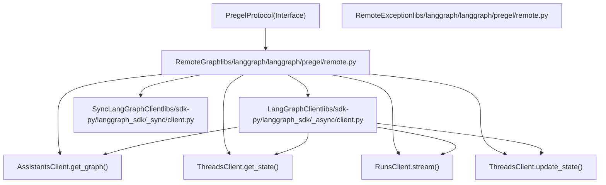

# RemoteGraph

Relevant source files

-   [libs/langgraph/langgraph/\_internal/\_constants.py](https://github.com/langchain-ai/langgraph/blob/1fd51e8f/libs/langgraph/langgraph/_internal/_constants.py)
-   [libs/langgraph/langgraph/\_internal/\_replay.py](https://github.com/langchain-ai/langgraph/blob/1fd51e8f/libs/langgraph/langgraph/_internal/_replay.py)
-   [libs/langgraph/langgraph/pregel/\_loop.py](https://github.com/langchain-ai/langgraph/blob/1fd51e8f/libs/langgraph/langgraph/pregel/_loop.py)
-   [libs/langgraph/langgraph/pregel/main.py](https://github.com/langchain-ai/langgraph/blob/1fd51e8f/libs/langgraph/langgraph/pregel/main.py)
-   [libs/langgraph/langgraph/pregel/protocol.py](https://github.com/langchain-ai/langgraph/blob/1fd51e8f/libs/langgraph/langgraph/pregel/protocol.py)
-   [libs/langgraph/langgraph/pregel/remote.py](https://github.com/langchain-ai/langgraph/blob/1fd51e8f/libs/langgraph/langgraph/pregel/remote.py)
-   [libs/langgraph/langgraph/warnings.py](https://github.com/langchain-ai/langgraph/blob/1fd51e8f/libs/langgraph/langgraph/warnings.py)
-   [libs/langgraph/tests/test\_deprecation.py](https://github.com/langchain-ai/langgraph/blob/1fd51e8f/libs/langgraph/tests/test_deprecation.py)
-   [libs/langgraph/tests/test\_interruption.py](https://github.com/langchain-ai/langgraph/blob/1fd51e8f/libs/langgraph/tests/test_interruption.py)
-   [libs/langgraph/tests/test\_remote\_graph.py](https://github.com/langchain-ai/langgraph/blob/1fd51e8f/libs/langgraph/tests/test_remote_graph.py)
-   [libs/langgraph/tests/test\_stream\_v2.py](https://github.com/langchain-ai/langgraph/blob/1fd51e8f/libs/langgraph/tests/test_stream_v2.py)
-   [libs/langgraph/tests/test\_time\_travel.py](https://github.com/langchain-ai/langgraph/blob/1fd51e8f/libs/langgraph/tests/test_time_travel.py)
-   [libs/langgraph/tests/test\_time\_travel\_async.py](https://github.com/langchain-ai/langgraph/blob/1fd51e8f/libs/langgraph/tests/test_time_travel_async.py)
-   [libs/sdk-py/langgraph\_sdk/\_\_init\_\_.py](https://github.com/langchain-ai/langgraph/blob/1fd51e8f/libs/sdk-py/langgraph_sdk/__init__.py)
-   [libs/sdk-py/langgraph\_sdk/cache.py](https://github.com/langchain-ai/langgraph/blob/1fd51e8f/libs/sdk-py/langgraph_sdk/cache.py)
-   [libs/sdk-py/langgraph\_sdk/client.py](https://github.com/langchain-ai/langgraph/blob/1fd51e8f/libs/sdk-py/langgraph_sdk/client.py)
-   [libs/sdk-py/langgraph\_sdk/schema.py](https://github.com/langchain-ai/langgraph/blob/1fd51e8f/libs/sdk-py/langgraph_sdk/schema.py)
-   [libs/sdk-py/pyproject.toml](https://github.com/langchain-ai/langgraph/blob/1fd51e8f/libs/sdk-py/pyproject.toml)
-   [libs/sdk-py/tests/test\_cache.py](https://github.com/langchain-ai/langgraph/blob/1fd51e8f/libs/sdk-py/tests/test_cache.py)
-   [libs/sdk-py/tests/test\_crons\_client.py](https://github.com/langchain-ai/langgraph/blob/1fd51e8f/libs/sdk-py/tests/test_crons_client.py)

`RemoteGraph` is a client implementation for calling remote LangGraph APIs that conform to the LangGraph Server API specification. It implements the `PregelProtocol` interface [libs/langgraph/langgraph/pregel/protocol.py25-224](https://github.com/langchain-ai/langgraph/blob/1fd51e8f/libs/langgraph/langgraph/pregel/protocol.py#L25-L224) and behaves identically to a local `Graph`, enabling it to be used as a node in another graph for building distributed, multi-tier LangGraph applications.

For information about the LangGraph Server API endpoints, see [LangGraph Platform API](#7). For details on the Python SDK client classes used internally, see [Python SDK](/langchain-ai/langgraph/5.1-python-sdk). For information on using graphs as subgraphs locally, see [Graph Composition and Nested Graphs](/langchain-ai/langgraph/3.6-graph-composition-and-nested-graphs).

## Class Structure

The `RemoteGraph` class is located in [libs/langgraph/langgraph/pregel/remote.py112-1002](https://github.com/langchain-ai/langgraph/blob/1fd51e8f/libs/langgraph/langgraph/pregel/remote.py#L112-L1002) and implements the `PregelProtocol` interface. This enables it to be used interchangeably with locally-compiled `Pregel` instances.

### Entity Relationship Diagram

Sources: [libs/langgraph/langgraph/pregel/remote.py112-121](https://github.com/langchain-ai/langgraph/blob/1fd51e8f/libs/langgraph/langgraph/pregel/remote.py#L112-L121) [libs/langgraph/langgraph/pregel/protocol.py25-224](https://github.com/langchain-ai/langgraph/blob/1fd51e8f/libs/langgraph/langgraph/pregel/protocol.py#L25-L224) [libs/sdk-py/langgraph\_sdk/client.py12-31](https://github.com/langchain-ai/langgraph/blob/1fd51e8f/libs/sdk-py/langgraph_sdk/client.py#L12-L31)

## Initialization and Configuration

The `RemoteGraph` constructor [libs/langgraph/langgraph/pregel/remote.py126-174](https://github.com/langchain-ai/langgraph/blob/1fd51e8f/libs/langgraph/langgraph/pregel/remote.py#L126-L174) accepts either client instances or connection parameters to create default clients.

### Constructor Parameters

| Parameter | Type | Description |
| --- | --- | --- |
| `assistant_id` | `str` | The assistant ID or graph name of the remote graph (positional) [libs/langgraph/langgraph/pregel/remote.py159](https://github.com/langchain-ai/langgraph/blob/1fd51e8f/libs/langgraph/langgraph/pregel/remote.py#L159-L159) |
| `url` | `str | None` | The URL of the remote API server [libs/langgraph/langgraph/pregel/remote.py131](https://github.com/langchain-ai/langgraph/blob/1fd51e8f/libs/langgraph/langgraph/pregel/remote.py#L131-L131) |
| `api_key` | `str | None` | Authentication API key [libs/langgraph/langgraph/pregel/remote.py132](https://github.com/langchain-ai/langgraph/blob/1fd51e8f/libs/langgraph/langgraph/pregel/remote.py#L132-L132) |
| `headers` | `dict[str, str] | None` | Additional HTTP headers [libs/langgraph/langgraph/pregel/remote.py133](https://github.com/langchain-ai/langgraph/blob/1fd51e8f/libs/langgraph/langgraph/pregel/remote.py#L133-L133) |
| `client` | `LangGraphClient | None` | Pre-configured async client [libs/langgraph/langgraph/pregel/remote.py134](https://github.com/langchain-ai/langgraph/blob/1fd51e8f/libs/langgraph/langgraph/pregel/remote.py#L134-L134) |
| `sync_client` | `SyncLangGraphClient | None` | Pre-configured sync client [libs/langgraph/langgraph/pregel/remote.py135](https://github.com/langchain-ai/langgraph/blob/1fd51e8f/libs/langgraph/langgraph/pregel/remote.py#L135-L135) |
| `config` | `RunnableConfig | None` | Default configuration [libs/langgraph/langgraph/pregel/remote.py136](https://github.com/langchain-ai/langgraph/blob/1fd51e8f/libs/langgraph/langgraph/pregel/remote.py#L136-L136) |
| `name` | `str | None` | Human-readable name (defaults to `assistant_id`) [libs/langgraph/langgraph/pregel/remote.py137](https://github.com/langchain-ai/langgraph/blob/1fd51e8f/libs/langgraph/langgraph/pregel/remote.py#L137-L137) |
| `distributed_tracing` | `bool` | Enable LangSmith distributed tracing headers [libs/langgraph/langgraph/pregel/remote.py138](https://github.com/langchain-ai/langgraph/blob/1fd51e8f/libs/langgraph/langgraph/pregel/remote.py#L138-L138) |

At least one of `url`, `client`, or `sync_client` must be provided. If `url` is provided, default clients are created using `get_client()` and `get_sync_client()` from `langgraph_sdk` [libs/langgraph/langgraph/pregel/remote.py167-174](https://github.com/langchain-ai/langgraph/blob/1fd51e8f/libs/langgraph/langgraph/pregel/remote.py#L167-L174)

Sources: [libs/langgraph/langgraph/pregel/remote.py126-174](https://github.com/langchain-ai/langgraph/blob/1fd51e8f/libs/langgraph/langgraph/pregel/remote.py#L126-L174)

## Configuration Sanitization

Before sending configuration to the remote API, `RemoteGraph` sanitizes it to remove non-serializable fields and internal checkpoint state.

### Configuration Droplist

The constant `_CONF_DROPLIST` [libs/langgraph/langgraph/pregel/remote.py74-81](https://github.com/langchain-ai/langgraph/blob/1fd51e8f/libs/langgraph/langgraph/pregel/remote.py#L74-L81) defines fields removed from `config["configurable"]`:

-   `CONFIG_KEY_CHECKPOINT_MAP`
-   `CONFIG_KEY_CHECKPOINT_ID`
-   `CONFIG_KEY_CHECKPOINT_NS`
-   `CONFIG_KEY_TASK_ID`

### Implementation

The `_sanitize_config()` method [libs/langgraph/langgraph/pregel/remote.py369-396](https://github.com/langchain-ai/langgraph/blob/1fd51e8f/libs/langgraph/langgraph/pregel/remote.py#L369-L396) processes:

1.  **recursion\_limit**: Copied directly if present.
2.  **tags**: Filters to include only string values.
3.  **metadata**: Recursively sanitizes values using `_sanitize_config_value()`.
4.  **configurable**: Filters droplist keys and recursively sanitizes values.

The `_sanitize_config_value()` helper [libs/langgraph/langgraph/pregel/remote.py84-103](https://github.com/langchain-ai/langgraph/blob/1fd51e8f/libs/langgraph/langgraph/pregel/remote.py#L84-L103) ensures only primitives (str, int, float, bool, UUID), dicts, and lists/tuples containing primitives are passed.

Sources: [libs/langgraph/langgraph/pregel/remote.py74-103](https://github.com/langchain-ai/langgraph/blob/1fd51e8f/libs/langgraph/langgraph/pregel/remote.py#L74-L103) [libs/langgraph/langgraph/pregel/remote.py369-396](https://github.com/langchain-ai/langgraph/blob/1fd51e8f/libs/langgraph/langgraph/pregel/remote.py#L369-L396)

## State Management

`RemoteGraph` provides methods to read and write thread state on the remote graph by wrapping SDK calls.

### get\_state() / aget\_state()

[libs/langgraph/langgraph/pregel/remote.py398-468](https://github.com/langchain-ai/langgraph/blob/1fd51e8f/libs/langgraph/langgraph/pregel/remote.py#L398-L468) Retrieves the current or historical state of a thread. It calls `ThreadsClient.get_state()` or `ThreadsClient.get_state_checkpoint()` depending on whether a specific checkpoint ID is provided in the config.

### update\_state() / aupdate\_state()

[libs/langgraph/langgraph/pregel/remote.py564-632](https://github.com/langchain-ai/langgraph/blob/1fd51e8f/libs/langgraph/langgraph/pregel/remote.py#L564-L632) Updates thread state on the remote graph. It calls `ThreadsClient.update_state()` and returns a `RunnableConfig` representing the new checkpoint.

### Data Model Mapping

| SDK Schema (`ThreadState`) | Pregel Model (`StateSnapshot`) | Source |
| --- | --- | --- |
| `values` | `values` | [libs/langgraph/langgraph/pregel/remote.py304](https://github.com/langchain-ai/langgraph/blob/1fd51e8f/libs/langgraph/langgraph/pregel/remote.py#L304-L304) |
| `next` | `next` (as tuple) | [libs/langgraph/langgraph/pregel/remote.py305](https://github.com/langchain-ai/langgraph/blob/1fd51e8f/libs/langgraph/langgraph/pregel/remote.py#L305-L305) |
| `checkpoint` | `config["configurable"]` | [libs/langgraph/langgraph/pregel/remote.py308-315](https://github.com/langchain-ai/langgraph/blob/1fd51e8f/libs/langgraph/langgraph/pregel/remote.py#L308-L315) |
| `tasks` | `tasks` (as `PregelTask`) | [libs/langgraph/langgraph/pregel/remote.py321-337](https://github.com/langchain-ai/langgraph/blob/1fd51e8f/libs/langgraph/langgraph/pregel/remote.py#L321-L337) |

Sources: [libs/langgraph/langgraph/pregel/remote.py284-340](https://github.com/langchain-ai/langgraph/blob/1fd51e8f/libs/langgraph/langgraph/pregel/remote.py#L284-L340) [libs/sdk-py/langgraph\_sdk/schema.py198-210](https://github.com/langchain-ai/langgraph/blob/1fd51e8f/libs/sdk-py/langgraph_sdk/schema.py#L198-L210)

## Execution and Streaming

The core of `RemoteGraph` is the implementation of `stream()` and `astream()` which translate local Pregel stream requests into LangGraph Server API requests.

### Stream Mode Mapping

The `_get_stream_modes()` method [libs/langgraph/langgraph/pregel/remote.py634-683](https://github.com/langchain-ai/langgraph/blob/1fd51e8f/libs/langgraph/langgraph/pregel/remote.py#L634-L683) handles conversion:

-   Maps local `"messages"` to remote `"messages-tuple"` [libs/langgraph/langgraph/pregel/remote.py657](https://github.com/langchain-ai/langgraph/blob/1fd51e8f/libs/langgraph/langgraph/pregel/remote.py#L657-L657)
-   Always adds `"updates"` mode internally to detect interrupts [libs/langgraph/langgraph/pregel/remote.py662](https://github.com/langchain-ai/langgraph/blob/1fd51e8f/libs/langgraph/langgraph/pregel/remote.py#L662-L662)
-   Filters out `"events"` as it is not supported in remote execution [libs/langgraph/langgraph/pregel/remote.py666](https://github.com/langchain-ai/langgraph/blob/1fd51e8f/libs/langgraph/langgraph/pregel/remote.py#L666-L666)

### Subgraph Execution Data Flow

> **[Mermaid sequence]**
> *(图表结构无法解析)*

Sources: [libs/langgraph/langgraph/pregel/remote.py685-903](https://github.com/langchain-ai/langgraph/blob/1fd51e8f/libs/langgraph/langgraph/pregel/remote.py#L685-L903) [libs/langgraph/langgraph/pregel/remote.py764-769](https://github.com/langchain-ai/langgraph/blob/1fd51e8f/libs/langgraph/langgraph/pregel/remote.py#L764-L769)

## Integration Features

### Interrupt Propagation

When `RemoteGraph` is used as a node in a local graph, it monitors the remote stream for the `__interrupt__` key [libs/langgraph/langgraph/pregel/remote.py764-769](https://github.com/langchain-ai/langgraph/blob/1fd51e8f/libs/langgraph/langgraph/pregel/remote.py#L764-L769) If found, it raises a `GraphInterrupt` [libs/langgraph/errors.py70](https://github.com/langchain-ai/langgraph/blob/1fd51e8f/libs/langgraph/errors.py#L70-L70) locally, effectively pausing the local graph execution at that node.

### Parent Command Support

Remote graphs can issue commands to the local parent graph. If a stream event has mode `"command"` and the target is `Command.PARENT`, `RemoteGraph` raises a `ParentCommand` exception [libs/langgraph/langgraph/pregel/remote.py754-755](https://github.com/langchain-ai/langgraph/blob/1fd51e8f/libs/langgraph/langgraph/pregel/remote.py#L754-L755)

### Distributed Tracing

If `distributed_tracing=True` is set, `RemoteGraph` uses `langsmith.get_current_run_tree()` to extract tracing headers and injects them into the remote API request [libs/langgraph/langgraph/pregel/remote.py1004-1015](https://github.com/langchain-ai/langgraph/blob/1fd51e8f/libs/langgraph/langgraph/pregel/remote.py#L1004-L1015) This ensures trace continuity between the local orchestrator and remote executors.

Sources: [libs/langgraph/langgraph/pregel/remote.py138](https://github.com/langchain-ai/langgraph/blob/1fd51e8f/libs/langgraph/langgraph/pregel/remote.py#L138-L138) [libs/langgraph/langgraph/pregel/remote.py754-769](https://github.com/langchain-ai/langgraph/blob/1fd51e8f/libs/langgraph/langgraph/pregel/remote.py#L754-L769) [libs/langgraph/langgraph/pregel/remote.py1004-1015](https://github.com/langchain-ai/langgraph/blob/1fd51e8f/libs/langgraph/langgraph/pregel/remote.py#L1004-L1015)
