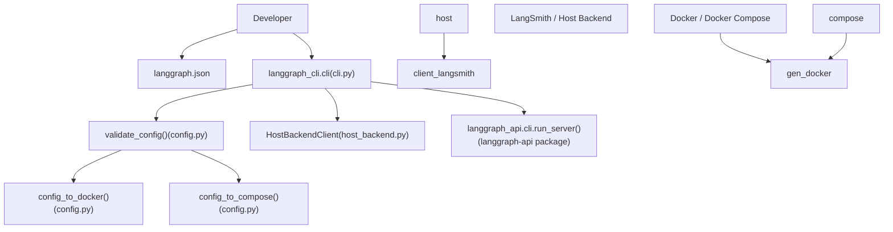
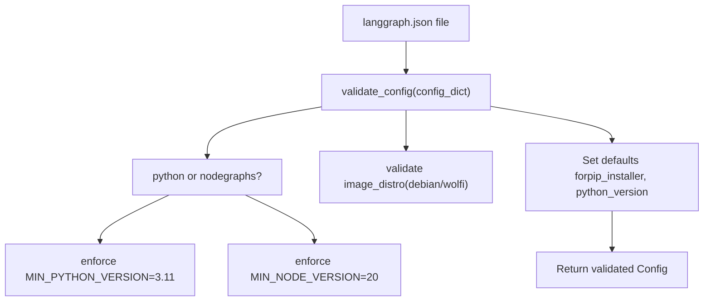
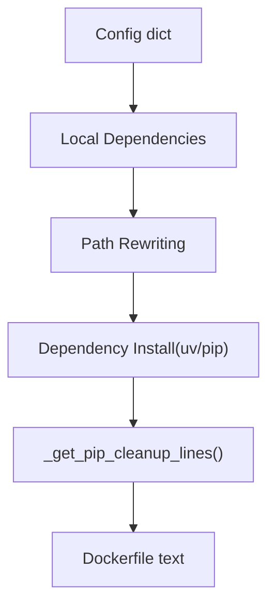

# CLI and Deployment

Relevant source files

-   [libs/cli/README.md](https://github.com/langchain-ai/langgraph/blob/1fd51e8f/libs/cli/README.md?plain=1)
-   [libs/cli/langgraph\_cli/\_\_init\_\_.py](https://github.com/langchain-ai/langgraph/blob/1fd51e8f/libs/cli/langgraph_cli/__init__.py)
-   [libs/cli/langgraph\_cli/cli.py](https://github.com/langchain-ai/langgraph/blob/1fd51e8f/libs/cli/langgraph_cli/cli.py)
-   [libs/cli/langgraph\_cli/config.py](https://github.com/langchain-ai/langgraph/blob/1fd51e8f/libs/cli/langgraph_cli/config.py)
-   [libs/cli/langgraph\_cli/helpers.py](https://github.com/langchain-ai/langgraph/blob/1fd51e8f/libs/cli/langgraph_cli/helpers.py)
-   [libs/cli/langgraph\_cli/host\_backend.py](https://github.com/langchain-ai/langgraph/blob/1fd51e8f/libs/cli/langgraph_cli/host_backend.py)
-   [libs/cli/langgraph\_cli/progress.py](https://github.com/langchain-ai/langgraph/blob/1fd51e8f/libs/cli/langgraph_cli/progress.py)
-   [libs/cli/langgraph\_cli/util.py](https://github.com/langchain-ai/langgraph/blob/1fd51e8f/libs/cli/langgraph_cli/util.py)
-   [libs/cli/pyproject.toml](https://github.com/langchain-ai/langgraph/blob/1fd51e8f/libs/cli/pyproject.toml)
-   [libs/cli/tests/unit\_tests/cli/test\_cli.py](https://github.com/langchain-ai/langgraph/blob/1fd51e8f/libs/cli/tests/unit_tests/cli/test_cli.py)
-   [libs/cli/tests/unit\_tests/test\_config.py](https://github.com/langchain-ai/langgraph/blob/1fd51e8f/libs/cli/tests/unit_tests/test_config.py)
-   [libs/cli/tests/unit\_tests/test\_deploy\_helpers.py](https://github.com/langchain-ai/langgraph/blob/1fd51e8f/libs/cli/tests/unit_tests/test_deploy_helpers.py)
-   [libs/cli/tests/unit\_tests/test\_host\_backend.py](https://github.com/langchain-ai/langgraph/blob/1fd51e8f/libs/cli/tests/unit_tests/test_host_backend.py)
-   [libs/cli/tests/unit\_tests/test\_logs\_helpers.py](https://github.com/langchain-ai/langgraph/blob/1fd51e8f/libs/cli/tests/unit_tests/test_logs_helpers.py)
-   [libs/cli/tests/unit\_tests/test\_util.py](https://github.com/langchain-ai/langgraph/blob/1fd51e8f/libs/cli/tests/unit_tests/test_util.py)
-   [libs/cli/uv.lock](https://github.com/langchain-ai/langgraph/blob/1fd51e8f/libs/cli/uv.lock)

This page covers the `langgraph-cli` package: its purpose, the commands it exposes, how it reads a `langgraph.json` configuration file, and how it translates that configuration into Docker-based deployments or a local in-memory development server.

-   For detailed documentation of each CLI command and its flags, see [CLI Commands](/langchain-ai/langgraph/6.1-cli-commands).
-   For the full `langgraph.json` schema reference, see [Configuration System (langgraph.json)](/langchain-ai/langgraph/6.2-configuration-system-(langgraph.json)).
-   For Dockerfile generation internals, see [Docker Image Generation](/langchain-ai/langgraph/6.3-docker-image-generation).
-   For Docker Compose orchestration, see [Multi-Service Orchestration](/langchain-ai/langgraph/6.4-multi-service-orchestration).
-   For the `langgraph dev` in-memory server, see [Local Development Server](/langchain-ai/langgraph/6.5-local-development-server).
-   For the Kafka-based distributed executor, see [Distributed Execution with Kafka](/langchain-ai/langgraph/6.6-distributed-execution-with-kafka).
-   For programmatic access to a deployed server, see [Client SDKs and Remote Execution](/langchain-ai/langgraph/5-client-sdks-and-remote-execution).

---

## Package Overview

The `langgraph-cli` package lives at `libs/cli/` and is installed as the `langgraph` command-line tool. Its entry point is declared in `libs/cli/pyproject.toml` [libs/cli/pyproject.toml34-35](https://github.com/langchain-ai/langgraph/blob/1fd51e8f/libs/cli/pyproject.toml#L34-L35)

It depends on `click>=8.1.7`, `httpx>=0.24.0`, and `langgraph-sdk>=0.1.0` (for Python ≥ 3.11) [libs/cli/pyproject.toml14-19](https://github.com/langchain-ai/langgraph/blob/1fd51e8f/libs/cli/pyproject.toml#L14-L19) For the in-memory development server, it requires the `[inmem]` extras group which pulls in `langgraph-api` and `langgraph-runtime-inmem` [libs/cli/pyproject.toml22-26](https://github.com/langchain-ai/langgraph/blob/1fd51e8f/libs/cli/pyproject.toml#L22-L26)

| Extra group | Additional dependencies |
| --- | --- |
| *(none)* | `click`, `httpx`, `langgraph-sdk` |
| `[inmem]` | `langgraph-api`, `langgraph-runtime-inmem` |

Sources: [libs/cli/pyproject.toml1-35](https://github.com/langchain-ai/langgraph/blob/1fd51e8f/libs/cli/pyproject.toml#L1-L35)

---

## Architectural Position

The CLI bridges local development and production deployment. It reads a `langgraph.json` file, validates it, and either launches a Docker Compose stack (for `up`/`build`/`dockerfile`) or starts an in-process server (for `dev`). It also facilitates deployments to LangSmith via the `deploy` command which interacts with a `HostBackendClient` [libs/cli/langgraph\_cli/host\_backend.py19-21](https://github.com/langchain-ai/langgraph/blob/1fd51e8f/libs/cli/langgraph_cli/host_backend.py#L19-L21)

**CLI System Relationships**

Sources: [libs/cli/langgraph\_cli/cli.py1-40](https://github.com/langchain-ai/langgraph/blob/1fd51e8f/libs/cli/langgraph_cli/cli.py#L1-L40) [libs/cli/langgraph\_cli/config.py142-196](https://github.com/langchain-ai/langgraph/blob/1fd51e8f/libs/cli/langgraph_cli/config.py#L142-L196) [libs/cli/langgraph\_cli/host\_backend.py19-43](https://github.com/langchain-ai/langgraph/blob/1fd51e8f/libs/cli/langgraph_cli/host_backend.py#L19-L43)

---

## Commands at a Glance

The `cli` group is the root Click group defined in `langgraph_cli/cli.py` [libs/cli/langgraph\_cli/cli.py35](https://github.com/langchain-ai/langgraph/blob/1fd51e8f/libs/cli/langgraph_cli/cli.py#L35-L35) All commands are registered on it.

| Command | Function | What it does |
| --- | --- | --- |
| `langgraph new` | `new()` | Scaffold a new project from a template [libs/cli/langgraph\_cli/cli.py1008-1018](https://github.com/langchain-ai/langgraph/blob/1fd51e8f/libs/cli/langgraph_cli/cli.py#L1008-L1018) |
| `langgraph dev` | `dev()` | Start an in-memory dev server with hot reload [libs/cli/langgraph\_cli/cli.py609-613](https://github.com/langchain-ai/langgraph/blob/1fd51e8f/libs/cli/langgraph_cli/cli.py#L609-L613) |
| `langgraph up` | `up()` | Build and launch full Docker Compose stack [libs/cli/langgraph\_cli/cli.py784-788](https://github.com/langchain-ai/langgraph/blob/1fd51e8f/libs/cli/langgraph_cli/cli.py#L784-L788) |
| `langgraph build` | `build()` | Build a tagged Docker image [libs/cli/langgraph\_cli/cli.py295-300](https://github.com/langchain-ai/langgraph/blob/1fd51e8f/libs/cli/langgraph_cli/cli.py#L295-L300) |
| `langgraph dockerfile` | `dockerfile()` | Emit a Dockerfile and optionally a compose file [libs/cli/langgraph\_cli/cli.py487-492](https://github.com/langchain-ai/langgraph/blob/1fd51e8f/libs/cli/langgraph_cli/cli.py#L487-L492) |
| `langgraph deploy` | `deploy()` | Deploy the project to LangSmith [libs/cli/langgraph\_cli/cli.py1021-1025](https://github.com/langchain-ai/langgraph/blob/1fd51e8f/libs/cli/langgraph_cli/cli.py#L1021-L1025) |

Sources: [libs/cli/langgraph\_cli/cli.py295-1025](https://github.com/langchain-ai/langgraph/blob/1fd51e8f/libs/cli/langgraph_cli/cli.py#L295-L1025)

---

## Configuration File (`langgraph.json`)

Every command requires a configuration file (default: `./langgraph.json`). The file is loaded and validated by `validate_config()` in `config.py` [libs/cli/langgraph\_cli/config.py142](https://github.com/langchain-ai/langgraph/blob/1fd51e8f/libs/cli/langgraph_cli/config.py#L142-L142)

The validated result is a `Config` object (defined in `langgraph_cli/schemas.py`).

### Key Top-Level Fields

| Field | Type | Required | Description |
| --- | --- | --- | --- |
| `graphs` | `dict` | **Yes** | Mapping from graph ID to implementation path [libs/cli/langgraph\_cli/config.py184](https://github.com/langchain-ai/langgraph/blob/1fd51e8f/libs/cli/langgraph_cli/config.py#L184-L184) |
| `dependencies` | `list[str]` | Yes | Array of dependencies for the server [libs/cli/langgraph\_cli/config.py182](https://github.com/langchain-ai/langgraph/blob/1fd51e8f/libs/cli/langgraph_cli/config.py#L182-L182) |
| `python_version` | `str` | No | Defaults to `3.11` [libs/cli/langgraph\_cli/config.py48](https://github.com/langchain-ai/langgraph/blob/1fd51e8f/libs/cli/langgraph_cli/config.py#L48-L48) |
| `node_version` | `str` | No | Required for JS/TS graphs; defaults to `20` [libs/cli/langgraph\_cli/config.py15](https://github.com/langchain-ai/langgraph/blob/1fd51e8f/libs/cli/langgraph_cli/config.py#L15-L15) |
| `image_distro` | `str` | No | Distro for the base image (e.g., `debian`, `wolfi`) [libs/cli/langgraph\_cli/config.py157](https://github.com/langchain-ai/langgraph/blob/1fd51e8f/libs/cli/langgraph_cli/config.py#L157-L157) |
| `env` | `str | dict` | No | Path to `.env` file or inline key-value mapping [libs/cli/langgraph\_cli/config.py185](https://github.com/langchain-ai/langgraph/blob/1fd51e8f/libs/cli/langgraph_cli/config.py#L185-L185) |
| `dockerfile_lines` | `list[str]` | No | Additional lines to append to the generated Dockerfile [libs/cli/langgraph\_cli/config.py183](https://github.com/langchain-ai/langgraph/blob/1fd51e8f/libs/cli/langgraph_cli/config.py#L183-L183) |
| `pip_installer` | `str` | No | One of `auto`, `pip`, or `uv` [libs/cli/langgraph\_cli/config.py179](https://github.com/langchain-ai/langgraph/blob/1fd51e8f/libs/cli/langgraph_cli/config.py#L179-L179) |

Sources: [libs/cli/langgraph\_cli/config.py14-196](https://github.com/langchain-ai/langgraph/blob/1fd51e8f/libs/cli/langgraph_cli/config.py#L14-L196) [libs/cli/langgraph\_cli/cli.py183-200](https://github.com/langchain-ai/langgraph/blob/1fd51e8f/libs/cli/langgraph_cli/cli.py#L183-L200)

---

## Config Validation Flow

The validation logic ensures that the specified Python or Node versions meet minimum requirements and that mandatory fields like `graphs` and `dependencies` are present.

**Config Validation Pipeline**

Sources: [libs/cli/langgraph\_cli/config.py142-208](https://github.com/langchain-ai/langgraph/blob/1fd51e8f/libs/cli/langgraph_cli/config.py#L142-L208)

---

## Docker Image Generation

`config_to_docker()` translates the `langgraph.json` configuration into a multi-stage Dockerfile. It handles dependency installation using either `pip` or `uv` [libs/cli/langgraph\_cli/config.py90-99](https://github.com/langchain-ai/langgraph/blob/1fd51e8f/libs/cli/langgraph_cli/config.py#L90-L99)

The CLI selects a base image based on the project type and version. For security, it recommends using the `wolfi` distribution [libs/cli/langgraph\_cli/util.py10-27](https://github.com/langchain-ai/langgraph/blob/1fd51e8f/libs/cli/langgraph_cli/util.py#L10-L27)

**Dockerfile Generation Data Flow**

Sources: [libs/cli/langgraph\_cli/config.py56-99](https://github.com/langchain-ai/langgraph/blob/1fd51e8f/libs/cli/langgraph_cli/config.py#L56-L99) [libs/cli/langgraph\_cli/util.py10-27](https://github.com/langchain-ai/langgraph/blob/1fd51e8f/libs/cli/langgraph_cli/util.py#L10-L27)

---

## Docker Compose Orchestration

`langgraph up` uses Docker Compose to launch the API server along with its required infrastructure, such as Redis and Postgres [libs/cli/tests/unit\_tests/cli/test\_cli.py80-132](https://github.com/langchain-ai/langgraph/blob/1fd51e8f/libs/cli/tests/unit_tests/cli/test_cli.py#L80-L132)

| Service | Image | Purpose |
| --- | --- | --- |
| `langgraph-redis` | `redis:6` | Task queue and transient state [libs/cli/tests/unit\_tests/cli/test\_cli.py84-85](https://github.com/langchain-ai/langgraph/blob/1fd51e8f/libs/cli/tests/unit_tests/cli/test_cli.py#L84-L85) |
| `langgraph-postgres` | `pgvector/pgvector:pg16` | Checkpointing and Store persistence [libs/cli/tests/unit\_tests/cli/test\_cli.py91-92](https://github.com/langchain-ai/langgraph/blob/1fd51e8f/libs/cli/tests/unit_tests/cli/test_cli.py#L91-L92) |
| `langgraph-api` | Built locally | The core graph execution server [libs/cli/tests/unit\_tests/cli/test\_cli.py122](https://github.com/langchain-ai/langgraph/blob/1fd51e8f/libs/cli/tests/unit_tests/cli/test_cli.py#L122-L122) |
| `langgraph-debugger` | `langchain/langgraph-debugger` | Local UI for graph inspection [libs/cli/tests/unit\_tests/cli/test\_cli.py112-113](https://github.com/langchain-ai/langgraph/blob/1fd51e8f/libs/cli/tests/unit_tests/cli/test_cli.py#L112-L113) |

Sources: [libs/cli/tests/unit\_tests/cli/test\_cli.py80-132](https://github.com/langchain-ai/langgraph/blob/1fd51e8f/libs/cli/tests/unit_tests/cli/test_cli.py#L80-L132)

---

## Deployment to LangSmith

The `langgraph deploy` command automates the process of pushing an image to the LangGraph Cloud registry and updating a deployment. It uses the `HostBackendClient` to interact with the LangGraph deployment API [libs/cli/langgraph\_cli/host\_backend.py73-100](https://github.com/langchain-ai/langgraph/blob/1fd51e8f/libs/cli/langgraph_cli/host_backend.py#L73-L100)

The deployment workflow includes:

1.  Resolving the deployment ID [libs/cli/langgraph\_cli/cli.py1034](https://github.com/langchain-ai/langgraph/blob/1fd51e8f/libs/cli/langgraph_cli/cli.py#L1034-L1034)
2.  Requesting a push token for the registry [libs/cli/langgraph\_cli/host\_backend.py89-93](https://github.com/langchain-ai/langgraph/blob/1fd51e8f/libs/cli/langgraph_cli/host_backend.py#L89-L93)
3.  Building and pushing the Docker image.
4.  Updating the deployment with the new image URI and secrets [libs/cli/langgraph\_cli/host\_backend.py95-110](https://github.com/langchain-ai/langgraph/blob/1fd51e8f/libs/cli/langgraph_cli/host_backend.py#L95-L110)

Sources: [libs/cli/langgraph\_cli/cli.py1021-1050](https://github.com/langchain-ai/langgraph/blob/1fd51e8f/libs/cli/langgraph_cli/cli.py#L1021-L1050) [libs/cli/langgraph\_cli/host\_backend.py19-110](https://github.com/langchain-ai/langgraph/blob/1fd51e8f/libs/cli/langgraph_cli/host_backend.py#L19-L110)
