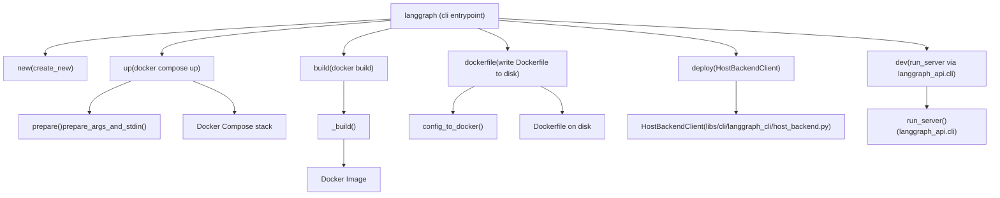

# CLI Commands

Relevant source files

-   [libs/cli/README.md](https://github.com/langchain-ai/langgraph/blob/1fd51e8f/libs/cli/README.md?plain=1)
-   [libs/cli/langgraph\_cli/\_\_init\_\_.py](https://github.com/langchain-ai/langgraph/blob/1fd51e8f/libs/cli/langgraph_cli/__init__.py)
-   [libs/cli/langgraph\_cli/cli.py](https://github.com/langchain-ai/langgraph/blob/1fd51e8f/libs/cli/langgraph_cli/cli.py)
-   [libs/cli/langgraph\_cli/config.py](https://github.com/langchain-ai/langgraph/blob/1fd51e8f/libs/cli/langgraph_cli/config.py)
-   [libs/cli/langgraph\_cli/helpers.py](https://github.com/langchain-ai/langgraph/blob/1fd51e8f/libs/cli/langgraph_cli/helpers.py)
-   [libs/cli/langgraph\_cli/host\_backend.py](https://github.com/langchain-ai/langgraph/blob/1fd51e8f/libs/cli/langgraph_cli/host_backend.py)
-   [libs/cli/langgraph\_cli/progress.py](https://github.com/langchain-ai/langgraph/blob/1fd51e8f/libs/cli/langgraph_cli/progress.py)
-   [libs/cli/langgraph\_cli/util.py](https://github.com/langchain-ai/langgraph/blob/1fd51e8f/libs/cli/langgraph_cli/util.py)
-   [libs/cli/pyproject.toml](https://github.com/langchain-ai/langgraph/blob/1fd51e8f/libs/cli/pyproject.toml)
-   [libs/cli/tests/unit\_tests/cli/test\_cli.py](https://github.com/langchain-ai/langgraph/blob/1fd51e8f/libs/cli/tests/unit_tests/cli/test_cli.py)
-   [libs/cli/tests/unit\_tests/test\_config.py](https://github.com/langchain-ai/langgraph/blob/1fd51e8f/libs/cli/tests/unit_tests/test_config.py)
-   [libs/cli/tests/unit\_tests/test\_deploy\_helpers.py](https://github.com/langchain-ai/langgraph/blob/1fd51e8f/libs/cli/tests/unit_tests/test_deploy_helpers.py)
-   [libs/cli/tests/unit\_tests/test\_host\_backend.py](https://github.com/langchain-ai/langgraph/blob/1fd51e8f/libs/cli/tests/unit_tests/test_host_backend.py)
-   [libs/cli/tests/unit\_tests/test\_logs\_helpers.py](https://github.com/langchain-ai/langgraph/blob/1fd51e8f/libs/cli/tests/unit_tests/test_logs_helpers.py)
-   [libs/cli/tests/unit\_tests/test\_util.py](https://github.com/langchain-ai/langgraph/blob/1fd51e8f/libs/cli/tests/unit_tests/test_util.py)
-   [libs/cli/uv.lock](https://github.com/langchain-ai/langgraph/blob/1fd51e8f/libs/cli/uv.lock)

This page documents all commands provided by the `langgraph-cli` package, covering their options, arguments, and typical usage. The CLI is the primary interface for running, building, and scaffolding LangGraph deployments.

For the `langgraph.json` configuration format consumed by these commands, see page [6.2](https://github.com/langchain-ai/langgraph/blob/1fd51e8f/6.2) For how the Dockerfile is generated from configuration, see page [6.3](https://github.com/langchain-ai/langgraph/blob/1fd51e8f/6.3) For the Docker Compose multi-service orchestration behavior, see page [6.4](https://github.com/langchain-ai/langgraph/blob/1fd51e8f/6.4) For the in-memory development server internals, see page [6.5](https://github.com/langchain-ai/langgraph/blob/1fd51e8f/6.5)

---

## Overview

The `langgraph` CLI is installed as a script entry point from the `langgraph-cli` package [libs/cli/pyproject.toml34-35](https://github.com/langchain-ai/langgraph/blob/1fd51e8f/libs/cli/pyproject.toml#L34-L35) It is implemented as a Click group defined in `langgraph_cli.cli:cli` [libs/cli/langgraph\_cli/cli.py162-165](https://github.com/langchain-ai/langgraph/blob/1fd51e8f/libs/cli/langgraph_cli/cli.py#L162-L165)

The CLI supports the following primary commands:

| Command | Purpose |
| --- | --- |
| `langgraph new` | Scaffold a new project from a template |
| `langgraph dev` | Run API server locally with hot reloading (no Docker) |
| `langgraph up` | Launch full Docker Compose stack |
| `langgraph build` | Build a Docker image for deployment |
| `langgraph dockerfile` | Write a Dockerfile (and optionally docker-compose.yml) to disk |
| `langgraph deploy` | Deploy a project to LangGraph Cloud/Host Backend |

**Installation:**

```
pip install langgraph-cli          # up/build/dockerfile/new onlypip install "langgraph-cli[inmem]" # also enables: langgraph dev
```
The `inmem` extras group adds `langgraph-api` and `langgraph-runtime-inmem` as dependencies [libs/cli/pyproject.toml22-26](https://github.com/langchain-ai/langgraph/blob/1fd51e8f/libs/cli/pyproject.toml#L22-L26)

---

## Command Flow Diagram

**CLI Command Dispatch and Data Flow**


Sources: [libs/cli/langgraph\_cli/cli.py162-1500](https://github.com/langchain-ai/langgraph/blob/1fd51e8f/libs/cli/langgraph_cli/cli.py#L162-L1500) [libs/cli/langgraph\_cli/host\_backend.py19-43](https://github.com/langchain-ai/langgraph/blob/1fd51e8f/libs/cli/langgraph_cli/host_backend.py#L19-L43)

---

## `langgraph new`

Creates a new project directory from a template.

```
langgraph new [PATH] [--template TEMPLATE]
```
**Arguments and Options:**

| Parameter | Type | Description |
| --- | --- | --- |
| `PATH` | argument (optional) | Target directory for the new project |
| `--template` | string option | Template name (see `TEMPLATE_HELP_STRING`) |

Implemented by the `new` function [libs/cli/langgraph\_cli/cli.py1489-1499](https://github.com/langchain-ai/langgraph/blob/1fd51e8f/libs/cli/langgraph_cli/cli.py#L1489-L1499) which delegates to `create_new` from `langgraph_cli.templates` [libs/cli/langgraph\_cli/cli.py33](https://github.com/langchain-ai/langgraph/blob/1fd51e8f/libs/cli/langgraph_cli/cli.py#L33-L33)

Sources: [libs/cli/langgraph\_cli/cli.py1489-1499](https://github.com/langchain-ai/langgraph/blob/1fd51e8f/libs/cli/langgraph_cli/cli.py#L1489-L1499)

---

## `langgraph dev`

Runs the LangGraph API server in-process (no Docker) with hot reloading. Requires the `inmem` extras.

```
langgraph dev [OPTIONS]
```
**Behavior:**

1.  Validates the config file via `validate_config_file` [libs/cli/langgraph\_cli/cli.py1450](https://github.com/langchain-ai/langgraph/blob/1fd51e8f/libs/cli/langgraph_cli/cli.py#L1450-L1450)
2.  Raises an error if the config specifies a `node_version` as JS graphs are not supported in the in-memory server [libs/cli/langgraph\_cli/cli.py1451-1454](https://github.com/langchain-ai/langgraph/blob/1fd51e8f/libs/cli/langgraph_cli/cli.py#L1451-L1454)
3.  Adds the current working directory and local dependency paths to `sys.path` to ensure graph code is importable [libs/cli/langgraph\_cli/cli.py1456-1462](https://github.com/langchain-ai/langgraph/blob/1fd51e8f/libs/cli/langgraph_cli/cli.py#L1456-L1462)
4.  Calls `run_server` imported from `langgraph_api.cli` [libs/cli/langgraph\_cli/cli.py1419-1486](https://github.com/langchain-ai/langgraph/blob/1fd51e8f/libs/cli/langgraph_cli/cli.py#L1419-L1486)

Sources: [libs/cli/langgraph\_cli/cli.py1327-1486](https://github.com/langchain-ai/langgraph/blob/1fd51e8f/libs/cli/langgraph_cli/cli.py#L1327-L1486)

---

## `langgraph deploy`

Deploys the project to a remote LangGraph host backend.

```
langgraph deploy [DEPLOYMENT_NAME] [OPTIONS]
```
**Key Features:**

-   **Deployment Resolution:** Resolves existing deployments by name or ID [libs/cli/langgraph\_cli/cli.py1141-1153](https://github.com/langchain-ai/langgraph/blob/1fd51e8f/libs/cli/langgraph_cli/cli.py#L1141-L1153)
-   **Environment Management:** Resolves secrets from `.env` or `langgraph.json` [libs/cli/langgraph\_cli/cli.py1161-1167](https://github.com/langchain-ai/langgraph/blob/1fd51e8f/libs/cli/langgraph_cli/cli.py#L1161-L1167) filtering out reserved variables [libs/cli/langgraph\_cli/cli.py41-86](https://github.com/langchain-ai/langgraph/blob/1fd51e8f/libs/cli/langgraph_cli/cli.py#L41-L86)
-   **Push Token Auth:** Requests a temporary push token to authenticate with the registry [libs/cli/langgraph\_cli/cli.py1222-1224](https://github.com/langchain-ai/langgraph/blob/1fd51e8f/libs/cli/langgraph_cli/cli.py#L1222-L1224)
-   **Log Streaming:** Monitors build and deployment logs in real-time [libs/cli/langgraph\_cli/cli.py1260-1285](https://github.com/langchain-ai/langgraph/blob/1fd51e8f/libs/cli/langgraph_cli/cli.py#L1260-L1285)

**Host Backend Interaction**

> **[Mermaid sequence]**
> *(图表结构无法解析)*

Sources: [libs/cli/langgraph\_cli/cli.py1102-1325](https://github.com/langchain-ai/langgraph/blob/1fd51e8f/libs/cli/langgraph_cli/cli.py#L1102-L1325) [libs/cli/langgraph\_cli/host\_backend.py73-144](https://github.com/langchain-ai/langgraph/blob/1fd51e8f/libs/cli/langgraph_cli/host_backend.py#L73-L144)

---

## `langgraph up`

Launches the full production-like Docker Compose stack: the LangGraph API service, a PostgreSQL database (with `pgvector`), and Redis.

**Behavior:**

1.  Calls `prepare()` [libs/cli/langgraph\_cli/cli.py1551-1596](https://github.com/langchain-ai/langgraph/blob/1fd51e8f/libs/cli/langgraph_cli/cli.py#L1551-L1596) which validates the config and generates Docker Compose YAML via `prepare_args_and_stdin()`.
2.  Generates an inline Dockerfile if no image is provided, including automatic installation of local dependencies [libs/cli/langgraph\_cli/cli.py1551-1596](https://github.com/langchain-ai/langgraph/blob/1fd51e8f/libs/cli/langgraph_cli/cli.py#L1551-L1596)
3.  Monitors the startup sequence and prints the ready URL once the API reports "Application startup complete" [libs/cli/langgraph\_cli/cli.py246-261](https://github.com/langchain-ai/langgraph/blob/1fd51e8f/libs/cli/langgraph_cli/cli.py#L246-L261)

Sources: [libs/cli/langgraph\_cli/cli.py168-293](https://github.com/langchain-ai/langgraph/blob/1fd51e8f/libs/cli/langgraph_cli/cli.py#L168-L293)

---

## Config File Validation

All commands that accept `--config` call `validate_config()` from `langgraph_cli.config`. This function enforces strict schema rules:

-   **Python Version:** Must be `>=3.11`. Defaults to `3.11` if Python graphs are detected [libs/cli/langgraph\_cli/config.py47-48](https://github.com/langchain-ai/langgraph/blob/1fd51e8f/libs/cli/langgraph_cli/config.py#L47-L48)
-   **Node Version:** Must be `>=20` (major version only). Defaults to `20` if Node.js graphs are detected [libs/cli/langgraph\_cli/config.py14-15](https://github.com/langchain-ai/langgraph/blob/1fd51e8f/libs/cli/langgraph_cli/config.py#L14-L15)
-   **Distro:** Supports `debian` (default) and `wolfi` [libs/cli/langgraph\_cli/config.py50](https://github.com/langchain-ai/langgraph/blob/1fd51e8f/libs/cli/langgraph_cli/config.py#L50-L50)
-   **Security Warning:** If `image_distro` is not `wolfi`, the CLI issues a security recommendation to switch to Wolfi Linux for enhanced security [libs/cli/langgraph\_cli/util.py10-27](https://github.com/langchain-ai/langgraph/blob/1fd51e8f/libs/cli/langgraph_cli/util.py#L10-L27)

Sources: [libs/cli/langgraph\_cli/config.py142-255](https://github.com/langchain-ai/langgraph/blob/1fd51e8f/libs/cli/langgraph_cli/config.py#L142-L255) [libs/cli/langgraph\_cli/util.py10-27](https://github.com/langchain-ai/langgraph/blob/1fd51e8f/libs/cli/langgraph_cli/util.py#L10-L27)

---

## Internal Helper Functions

### `prepare_args_and_stdin()`

This function is the core of the `up` command. It constructs the Docker Compose arguments and the dynamic YAML configuration passed via stdin [libs/cli/langgraph\_cli/cli.py1502-1548](https://github.com/langchain-ai/langgraph/blob/1fd51e8f/libs/cli/langgraph_cli/cli.py#L1502-L1548)

-   **Service Mapping:** Configures `langgraph-api`, `langgraph-postgres`, and `langgraph-redis` [libs/cli/langgraph\_cli/cli.py1502-1548](https://github.com/langchain-ai/langgraph/blob/1fd51e8f/libs/cli/langgraph_cli/cli.py#L1502-L1548)
-   **Volume Management:** Sets up `langgraph-data` for persistent PostgreSQL storage.
-   **Debugger Integration:** Optionally injects the `langgraph-debugger` service if a port is provided.

Sources: [libs/cli/langgraph\_cli/cli.py1502-1548](https://github.com/langchain-ai/langgraph/blob/1fd51e8f/libs/cli/langgraph_cli/cli.py#L1502-L1548)

### `HostBackendClient`

A minimal JSON HTTP client used for remote deployment operations.

-   **Authentication:** Uses `X-Api-Key` and optional `X-Tenant-ID` headers [libs/cli/langgraph\_cli/host\_backend.py31-36](https://github.com/langchain-ai/langgraph/blob/1fd51e8f/libs/cli/langgraph_cli/host_backend.py#L31-L36)
-   **Retries:** Implements automatic retries via `httpx.HTTPTransport(retries=3)` [libs/cli/langgraph\_cli/host\_backend.py30](https://github.com/langchain-ai/langgraph/blob/1fd51e8f/libs/cli/langgraph_cli/host_backend.py#L30-L30)

Sources: [libs/cli/langgraph\_cli/host\_backend.py19-43](https://github.com/langchain-ai/langgraph/blob/1fd51e8f/libs/cli/langgraph_cli/host_backend.py#L19-L43)
