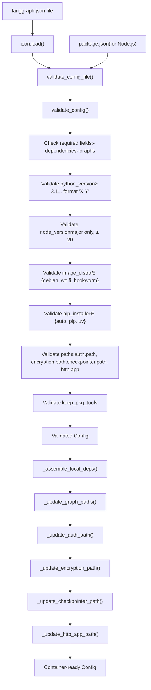
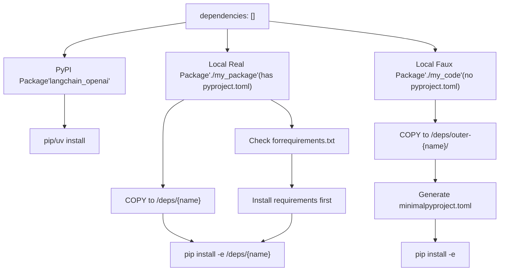
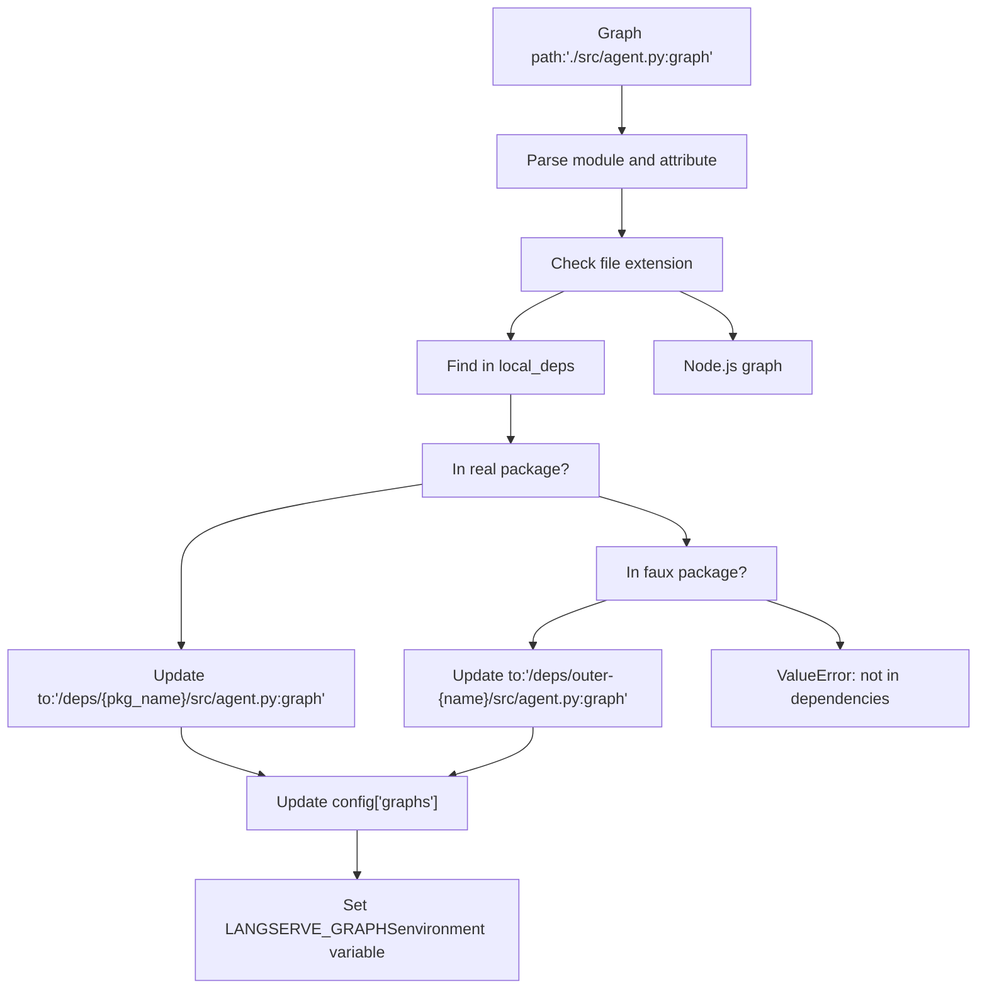
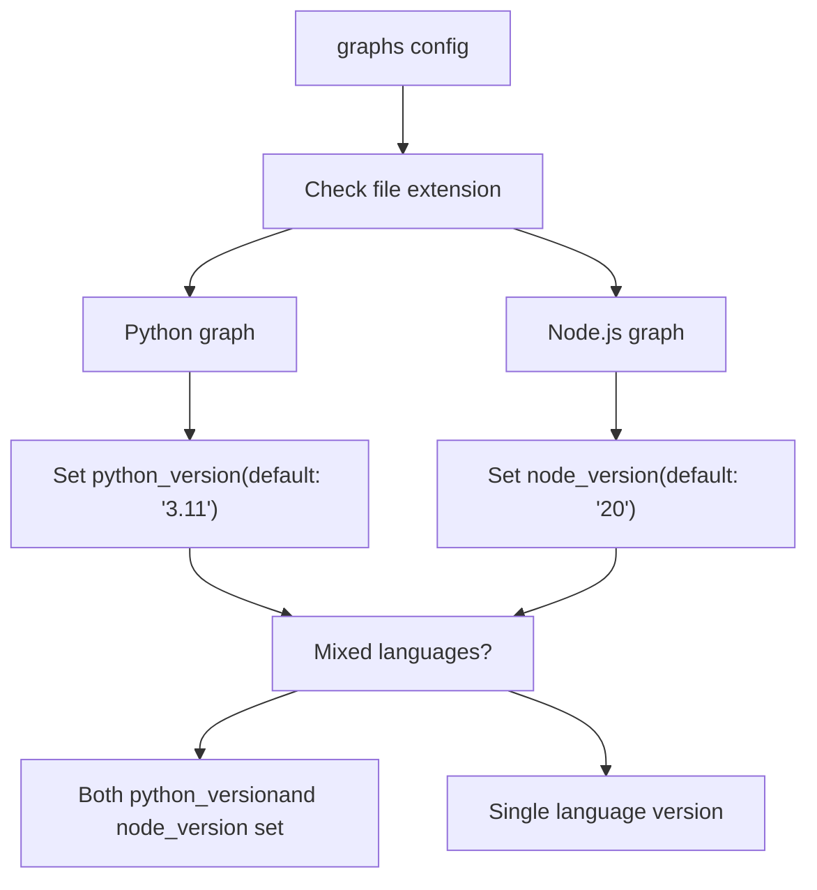

# Configuration System (langgraph.json)

Relevant source files

-   [.github/scripts/run\_langgraph\_cli\_test.py](https://github.com/langchain-ai/langgraph/blob/1fd51e8f/.github/scripts/run_langgraph_cli_test.py)
-   [libs/cli/README.md](https://github.com/langchain-ai/langgraph/blob/1fd51e8f/libs/cli/README.md?plain=1)
-   [libs/cli/examples/graph\_prerelease\_reqs/agent.py](https://github.com/langchain-ai/langgraph/blob/1fd51e8f/libs/cli/examples/graph_prerelease_reqs/agent.py)
-   [libs/cli/examples/graph\_prerelease\_reqs/deps/additional\_deps/pyproject.toml](https://github.com/langchain-ai/langgraph/blob/1fd51e8f/libs/cli/examples/graph_prerelease_reqs/deps/additional_deps/pyproject.toml)
-   [libs/cli/examples/graph\_prerelease\_reqs/deps/zuper\_deps/pyproject.toml](https://github.com/langchain-ai/langgraph/blob/1fd51e8f/libs/cli/examples/graph_prerelease_reqs/deps/zuper_deps/pyproject.toml)
-   [libs/cli/examples/graph\_prerelease\_reqs/langgraph.json](https://github.com/langchain-ai/langgraph/blob/1fd51e8f/libs/cli/examples/graph_prerelease_reqs/langgraph.json)
-   [libs/cli/examples/graph\_prerelease\_reqs/pyproject.toml](https://github.com/langchain-ai/langgraph/blob/1fd51e8f/libs/cli/examples/graph_prerelease_reqs/pyproject.toml)
-   [libs/cli/examples/graph\_prerelease\_reqs\_fail/agent.py](https://github.com/langchain-ai/langgraph/blob/1fd51e8f/libs/cli/examples/graph_prerelease_reqs_fail/agent.py)
-   [libs/cli/examples/graph\_prerelease\_reqs\_fail/langgraph.json](https://github.com/langchain-ai/langgraph/blob/1fd51e8f/libs/cli/examples/graph_prerelease_reqs_fail/langgraph.json)
-   [libs/cli/examples/graph\_prerelease\_reqs\_fail/pyproject.toml](https://github.com/langchain-ai/langgraph/blob/1fd51e8f/libs/cli/examples/graph_prerelease_reqs_fail/pyproject.toml)
-   [libs/cli/generate\_schema.py](https://github.com/langchain-ai/langgraph/blob/1fd51e8f/libs/cli/generate_schema.py)
-   [libs/cli/langgraph\_cli/\_\_init\_\_.py](https://github.com/langchain-ai/langgraph/blob/1fd51e8f/libs/cli/langgraph_cli/__init__.py)
-   [libs/cli/langgraph\_cli/cli.py](https://github.com/langchain-ai/langgraph/blob/1fd51e8f/libs/cli/langgraph_cli/cli.py)
-   [libs/cli/langgraph\_cli/config.py](https://github.com/langchain-ai/langgraph/blob/1fd51e8f/libs/cli/langgraph_cli/config.py)
-   [libs/cli/langgraph\_cli/helpers.py](https://github.com/langchain-ai/langgraph/blob/1fd51e8f/libs/cli/langgraph_cli/helpers.py)
-   [libs/cli/langgraph\_cli/host\_backend.py](https://github.com/langchain-ai/langgraph/blob/1fd51e8f/libs/cli/langgraph_cli/host_backend.py)
-   [libs/cli/langgraph\_cli/progress.py](https://github.com/langchain-ai/langgraph/blob/1fd51e8f/libs/cli/langgraph_cli/progress.py)
-   [libs/cli/langgraph\_cli/schemas.py](https://github.com/langchain-ai/langgraph/blob/1fd51e8f/libs/cli/langgraph_cli/schemas.py)
-   [libs/cli/langgraph\_cli/util.py](https://github.com/langchain-ai/langgraph/blob/1fd51e8f/libs/cli/langgraph_cli/util.py)
-   [libs/cli/pyproject.toml](https://github.com/langchain-ai/langgraph/blob/1fd51e8f/libs/cli/pyproject.toml)
-   [libs/cli/python-monorepo-example/pyproject.toml](https://github.com/langchain-ai/langgraph/blob/1fd51e8f/libs/cli/python-monorepo-example/pyproject.toml)
-   [libs/cli/schemas/schema.json](https://github.com/langchain-ai/langgraph/blob/1fd51e8f/libs/cli/schemas/schema.json)
-   [libs/cli/schemas/schema.v0.json](https://github.com/langchain-ai/langgraph/blob/1fd51e8f/libs/cli/schemas/schema.v0.json)
-   [libs/cli/tests/unit\_tests/cli/test\_cli.py](https://github.com/langchain-ai/langgraph/blob/1fd51e8f/libs/cli/tests/unit_tests/cli/test_cli.py)
-   [libs/cli/tests/unit\_tests/test\_config.py](https://github.com/langchain-ai/langgraph/blob/1fd51e8f/libs/cli/tests/unit_tests/test_config.py)
-   [libs/cli/tests/unit\_tests/test\_deploy\_helpers.py](https://github.com/langchain-ai/langgraph/blob/1fd51e8f/libs/cli/tests/unit_tests/test_deploy_helpers.py)
-   [libs/cli/tests/unit\_tests/test\_host\_backend.py](https://github.com/langchain-ai/langgraph/blob/1fd51e8f/libs/cli/tests/unit_tests/test_host_backend.py)
-   [libs/cli/tests/unit\_tests/test\_logs\_helpers.py](https://github.com/langchain-ai/langgraph/blob/1fd51e8f/libs/cli/tests/unit_tests/test_logs_helpers.py)
-   [libs/cli/tests/unit\_tests/test\_util.py](https://github.com/langchain-ai/langgraph/blob/1fd51e8f/libs/cli/tests/unit_tests/test_util.py)
-   [libs/cli/uv.lock](https://github.com/langchain-ai/langgraph/blob/1fd51e8f/libs/cli/uv.lock)

The `langgraph.json` configuration file is the central control mechanism for LangGraph CLI commands. It declares dependencies, graph definitions, runtime settings, and deployment parameters that are used by `langgraph build`, `langgraph up`, `langgraph dev`, and `langgraph deploy` commands to construct Docker images and configure the LangGraph API server.

For information about CLI commands that consume this configuration, see [6.1](https://github.com/langchain-ai/langgraph/blob/1fd51e8f/6.1) For information about the Dockerfile generation process, see [6.3](https://github.com/langchain-ai/langgraph/blob/1fd51e8f/6.3)

---

## Configuration File Structure

The `langgraph.json` file uses a JSON structure with required and optional fields. The configuration is loaded and validated by `validate_config_file()` and `validate_config()` functions.

### Required Fields

| Field | Type | Description |
| --- | --- | --- |
| `dependencies` | `array[string]` | Package dependencies. Can be PyPI package names (e.g., `"langchain_openai"`) or local paths starting with `"."` (e.g., `"./my_package"`) |
| `graphs` | `object` | Mapping from graph ID to graph location. Values can be strings in format `"./path/to/file.py:attribute"` or objects with a `path` key |

### Optional Fields

| Field | Type | Default | Description |
| --- | --- | --- | --- |
| `python_version` | `string` | `"3.11"` | Python version: `"3.11"`, `"3.12"`, or `"3.13"`. Format must be `major.minor` |
| `node_version` | `string` | `"20"` (if Node.js graphs detected) | Node.js major version: `"20"`, `"22"`, etc. Must be major version only |
| `pip_installer` | `string` | `"auto"` | Package installer: `"auto"`, `"pip"`, or `"uv"` |
| `pip_config_file` | `string` | `null` | Path to pip configuration file |
| `base_image` | `string` | `null` | Custom base Docker image to override defaults |
| `image_distro` | `string` | `"debian"` | Base image distribution: `"debian"`, `"wolfi"`, or `"bookworm"` |
| `dockerfile_lines` | `array[string]` | `[]` | Additional Dockerfile commands to insert after base image |
| `env` | `string | object` | `{}` | Path to `.env` file or object mapping environment variable names to values |
| `auth` | `object` | `null` | Authentication configuration. May contain `path` field in format `"./file.py:attribute"` |
| `encryption` | `object` | `null` | Encryption configuration. May contain `path` field in format `"./file.py:attribute"` |
| `checkpointer` | `string | object` | `null` | Checkpointer configuration. Object may contain `path` field in format `"./file.py:attribute"` |
| `http` | `object` | `null` | HTTP app configuration. May contain `app` field in format `"./file.py:attribute"` |
| `store` | `object` | `null` | Store configuration |
| `webhooks` | `object` | `null` | Webhooks configuration |
| `ui` | `string` | `null` | UI configuration |
| `ui_config` | `object` | `null` | UI config object |
| `keep_pkg_tools` | `bool | array[string]` | `null` | Keep build tools in final image. `true` keeps all, array specifies which (`"pip"`, `"setuptools"`, `"wheel"`) |
| `api_version` | `string` | `null` | Specific API server version to use for base image |

**Sources:** [libs/cli/langgraph\_cli/config.py142-214](https://github.com/langchain-ai/langgraph/blob/1fd51e8f/libs/cli/langgraph_cli/config.py#L142-L214) [libs/cli/tests/unit\_tests/test\_config.py33-151](https://github.com/langchain-ai/langgraph/blob/1fd51e8f/libs/cli/tests/unit_tests/test_config.py#L33-L151) [libs/cli/schemas/schema.json12-195](https://github.com/langchain-ai/langgraph/blob/1fd51e8f/libs/cli/schemas/schema.json#L12-L195)

---

## Configuration Loading and Validation Flow


**Validation Process:**

1.  **`validate_config_file()`** loads the JSON file and calls **`validate_config()`** [libs/cli/langgraph\_cli/config.py309-349](https://github.com/langchain-ai/langgraph/blob/1fd51e8f/libs/cli/langgraph_cli/config.py#L309-L349)
2.  For Node.js projects, **`package.json`** is checked to ensure `engines.node` is compatible [libs/cli/langgraph\_cli/config.py317-328](https://github.com/langchain-ai/langgraph/blob/1fd51e8f/libs/cli/langgraph_cli/config.py#L317-L328)
3.  Required fields (`dependencies`, `graphs`) are enforced [libs/cli/langgraph\_cli/config.py237-243](https://github.com/langchain-ai/langgraph/blob/1fd51e8f/libs/cli/langgraph_cli/config.py#L237-L243)
4.  Version strings are parsed and validated against minimum requirements [libs/cli/langgraph\_cli/config.py202-235](https://github.com/langchain-ai/langgraph/blob/1fd51e8f/libs/cli/langgraph_cli/config.py#L202-L235)
5.  Path fields (auth, encryption, etc.) are validated to use `"./path:attribute"` format [libs/cli/langgraph\_cli/config.py268-306](https://github.com/langchain-ai/langgraph/blob/1fd51e8f/libs/cli/langgraph_cli/config.py#L268-L306)
6.  The config is normalized with default values filled in [libs/cli/langgraph\_cli/config.py175-201](https://github.com/langchain-ai/langgraph/blob/1fd51e8f/libs/cli/langgraph_cli/config.py#L175-L201)

**Sources:** [libs/cli/langgraph\_cli/config.py142-307](https://github.com/langchain-ai/langgraph/blob/1fd51e8f/libs/cli/langgraph_cli/config.py#L142-L307) [libs/cli/langgraph\_cli/config.py309-349](https://github.com/langchain-ai/langgraph/blob/1fd51e8f/libs/cli/langgraph_cli/config.py#L309-L349)

---

## Dependency Management

The `dependencies` array supports three types of dependencies:

### Dependency Types


### LocalDeps Data Structure

The `_assemble_local_deps()` function processes local dependencies and returns a `LocalDeps` named tuple [libs/cli/langgraph\_cli/config.py352-525](https://github.com/langchain-ai/langgraph/blob/1fd51e8f/libs/cli/langgraph_cli/config.py#L352-L525):

| Field | Type | Description |
| --- | --- | --- |
| `pip_reqs` | `list[tuple[Path, str]]` | Requirements files: `(host_path, container_path)` tuples |
| `real_pkgs` | `dict[Path, tuple[str, str]]` | Real packages: `host_path -> (dependency_string, container_name)` |
| `faux_pkgs` | `dict[Path, tuple[str, str]]` | Faux packages: `host_path -> (dependency_string, container_path)` |
| `working_dir` | `str | None` | Container working directory if `"."` is in dependencies |
| `additional_contexts` | `list[Path]` | Paths outside config directory needed as build contexts |

**Real Packages:** Directories containing `pyproject.toml` or `setup.py`. These are copied to `/deps/{name}` and installed with `pip install -e`.

**Faux Packages:** Directories without packaging metadata. The CLI generates a minimal `pyproject.toml` to make them pip-installable [libs/cli/langgraph\_cli/config.py469-495](https://github.com/langchain-ai/langgraph/blob/1fd51e8f/libs/cli/langgraph_cli/config.py#L469-L495)

**Sources:** [libs/cli/langgraph\_cli/config.py352-525](https://github.com/langchain-ai/langgraph/blob/1fd51e8f/libs/cli/langgraph_cli/config.py#L352-L525) [libs/cli/tests/unit\_tests/test\_config.py425-690](https://github.com/langchain-ai/langgraph/blob/1fd51e8f/libs/cli/tests/unit_tests/test_config.py#L425-L690)

---

## Graph Specification

Graphs are defined in the `graphs` object with graph IDs as keys. Values specify where the compiled graph object is located.

### Graph Path Format

**String format:**

```
{  "graphs": {    "my_agent": "./src/agent.py:graph"  }}
```
**Object format:**

```
{  "graphs": {    "my_agent": {      "path": "./src/agent.py:graph",      "description": "My custom agent"    }  }}
```
The path format is `<module>:<attribute>`:

-   **Module:** File path (`.py`, `.js`, `.ts`, etc.) or Python module name [libs/cli/langgraph\_cli/config.py124-140](https://github.com/langchain-ai/langgraph/blob/1fd51e8f/libs/cli/langgraph_cli/config.py#L124-L140)
-   **Attribute:** Name of the graph variable/function in that module.

### Path Resolution for Container


The `_update_graph_paths()` function rewrites local file paths to container paths [libs/cli/langgraph\_cli/config.py528-626](https://github.com/langchain-ai/langgraph/blob/1fd51e8f/libs/cli/langgraph_cli/config.py#L528-L626)

**Sources:** [libs/cli/langgraph\_cli/config.py528-626](https://github.com/langchain-ai/langgraph/blob/1fd51e8f/libs/cli/langgraph_cli/config.py#L528-L626) [libs/cli/tests/unit\_tests/test\_config.py614-650](https://github.com/langchain-ai/langgraph/blob/1fd51e8f/libs/cli/tests/unit_tests/test_config.py#L614-L650)

---

## Environment Variables

The `env` field supports two formats for specifying environment variables:

### Direct Object Format

```
{  "env": {    "OPENAI_API_KEY": "sk-...",    "LANGCHAIN_TRACING_V2": "true"  }}
```
### .env File Reference

```
{  "env": "./.env"}
```
### Environment Variable Resolution

The `_parse_env_from_config()` function in the CLI resolves environment variables with the following precedence [libs/cli/langgraph\_cli/cli.py116-127](https://github.com/langchain-ai/langgraph/blob/1fd51e8f/libs/cli/langgraph_cli/cli.py#L116-L127):

1.  If `env` is an object with values → use directly.
2.  If `env` is a string → load from that `.env` file.
3.  If `env` is missing or empty `{}` → load from `./.env` in current directory (if exists).

**Reserved Environment Variables:** The CLI filters reserved environment variables (e.g., `LANGCHAIN_API_KEY`, `POSTGRES_URI`) during deployment to avoid conflicts with system-managed values [libs/cli/langgraph\_cli/cli.py41-86](https://github.com/langchain-ai/langgraph/blob/1fd51e8f/libs/cli/langgraph_cli/cli.py#L41-L86)

**Sources:** [libs/cli/langgraph\_cli/cli.py37-127](https://github.com/langchain-ai/langgraph/blob/1fd51e8f/libs/cli/langgraph_cli/cli.py#L37-L127) [libs/cli/langgraph\_cli/config.py185](https://github.com/langchain-ai/langgraph/blob/1fd51e8f/libs/cli/langgraph_cli/config.py#L185-L185)

---

## Python and Node.js Support

LangGraph supports both Python and Node.js graphs. The CLI auto-detects the language based on file extensions [libs/cli/langgraph\_cli/config.py147-148](https://github.com/langchain-ai/langgraph/blob/1fd51e8f/libs/cli/langgraph_cli/config.py#L147-L148)

### Language Detection


**Sources:** [libs/cli/langgraph\_cli/config.py14-16](https://github.com/langchain-ai/langgraph/blob/1fd51e8f/libs/cli/langgraph_cli/config.py#L14-L16) [libs/cli/langgraph\_cli/config.py47-49](https://github.com/langchain-ai/langgraph/blob/1fd51e8f/libs/cli/langgraph_cli/config.py#L47-L49) [libs/cli/langgraph\_cli/config.py124-140](https://github.com/langchain-ai/langgraph/blob/1fd51e8f/libs/cli/langgraph_cli/config.py#L124-L140) [libs/cli/langgraph\_cli/config.py142-174](https://github.com/langchain-ai/langgraph/blob/1fd51e8f/libs/cli/langgraph_cli/config.py#L142-L174)

---

## Docker Image Configuration

The configuration controls Docker image generation through several fields.

### Base Image Selection

The `base_image` field overrides the default base image [libs/cli/langgraph\_cli/config.py180](https://github.com/langchain-ai/langgraph/blob/1fd51e8f/libs/cli/langgraph_cli/config.py#L180-L180) If not specified, defaults are selected based on detected languages [libs/cli/langgraph\_cli/config.py870-884](https://github.com/langchain-ai/langgraph/blob/1fd51e8f/libs/cli/langgraph_cli/config.py#L870-L884)

### Image Distribution

The `image_distro` field selects the base Linux distribution [libs/cli/langgraph\_cli/config.py181](https://github.com/langchain-ai/langgraph/blob/1fd51e8f/libs/cli/langgraph_cli/config.py#L181-L181)

-   `"debian"`: Default.
-   `"wolfi"`: Security-oriented minimal distribution [libs/cli/langgraph\_cli/util.py35-54](https://github.com/langchain-ai/langgraph/blob/1fd51e8f/libs/cli/langgraph_cli/util.py#L35-L54)
-   `"bookworm"`: Debian Bookworm release.

### Package Installer Selection

The `pip_installer` field controls which tool installs Python packages [libs/cli/langgraph\_cli/config.py179](https://github.com/langchain-ai/langgraph/blob/1fd51e8f/libs/cli/langgraph_cli/config.py#L179-L179) Options are `"auto"`, `"pip"`, or `"uv"`. The `uv` installer is used by default on supported base images for performance [libs/cli/langgraph\_cli/config.py902-906](https://github.com/langchain-ai/langgraph/blob/1fd51e8f/libs/cli/langgraph_cli/config.py#L902-L906)

### Build Tool Cleanup

The `keep_pkg_tools` field controls which packaging tools (pip, setuptools, wheel) remain in the final image [libs/cli/langgraph\_cli/config.py195](https://github.com/langchain-ai/langgraph/blob/1fd51e8f/libs/cli/langgraph_cli/config.py#L195-L195) By default, build tools are removed to reduce image size [libs/cli/langgraph\_cli/config.py56-99](https://github.com/langchain-ai/langgraph/blob/1fd51e8f/libs/cli/langgraph_cli/config.py#L56-L99)

**Sources:** [libs/cli/langgraph\_cli/config.py47-99](https://github.com/langchain-ai/langgraph/blob/1fd51e8f/libs/cli/langgraph_cli/config.py#L47-L99) [libs/cli/langgraph\_cli/config.py175-201](https://github.com/langchain-ai/langgraph/blob/1fd51e8f/libs/cli/langgraph_cli/config.py#L175-L201) [libs/cli/langgraph\_cli/util.py35-54](https://github.com/langchain-ai/langgraph/blob/1fd51e8f/libs/cli/langgraph_cli/util.py#L35-L54)

---

## Path Resolution for Container Deployment

When building Docker images, local file paths are translated to container paths.

### Path Update Functions

Each configuration field with local file references gets its paths updated via dedicated functions:

-   `_update_graph_paths()` [libs/cli/langgraph\_cli/config.py528-626](https://github.com/langchain-ai/langgraph/blob/1fd51e8f/libs/cli/langgraph_cli/config.py#L528-L626)
-   `_update_auth_path()` [libs/cli/langgraph\_cli/config.py628-666](https://github.com/langchain-ai/langgraph/blob/1fd51e8f/libs/cli/langgraph_cli/config.py#L628-L666)
-   `_update_encryption_path()` [libs/cli/langgraph\_cli/config.py669-709](https://github.com/langchain-ai/langgraph/blob/1fd51e8f/libs/cli/langgraph_cli/config.py#L669-L709)
-   `_update_checkpointer_path()` [libs/cli/langgraph\_cli/config.py712-754](https://github.com/langchain-ai/langgraph/blob/1fd51e8f/libs/cli/langgraph_cli/config.py#L712-L754)
-   `_update_http_app_path()` [libs/cli/langgraph\_cli/config.py757-808](https://github.com/langchain-ai/langgraph/blob/1fd51e8f/libs/cli/langgraph_cli/config.py#L757-L808)

**Example Path Translation:**

-   Host: `./src/agent.py:graph`
-   Container: `/deps/outer-my_pkg/src/agent.py:graph`

**Sources:** [libs/cli/langgraph\_cli/config.py528-808](https://github.com/langchain-ai/langgraph/blob/1fd51e8f/libs/cli/langgraph_cli/config.py#L528-L808)

---

## Configuration Validation Error Handling

The validation functions raise `click.UsageError` for invalid configurations [libs/cli/langgraph\_cli/config.py142-307](https://github.com/langchain-ai/langgraph/blob/1fd51e8f/libs/cli/langgraph_cli/config.py#L142-L307):

| Error Condition | Error Message |
| --- | --- |
| Python version < 3.11 | `"Minimum required version is 3.11"` |
| Python version wrong format | `"Invalid Python version format"` |
| Node.js version < 20 | `"Node.js version ... is not supported"` |
| Invalid image\_distro | `"Invalid image_distro: '{distro}'"` |
| Bullseye deprecated | `"Bullseye images were deprecated"` |

**Sources:** [libs/cli/langgraph\_cli/config.py142-307](https://github.com/langchain-ai/langgraph/blob/1fd51e8f/libs/cli/langgraph_cli/config.py#L142-L307) [libs/cli/tests/unit\_tests/test\_config.py96-123](https://github.com/langchain-ai/langgraph/blob/1fd51e8f/libs/cli/tests/unit_tests/test_config.py#L96-L123)
