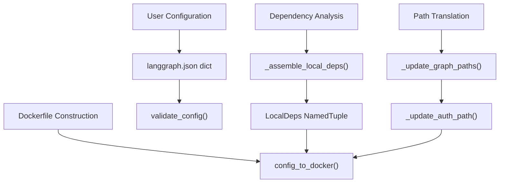
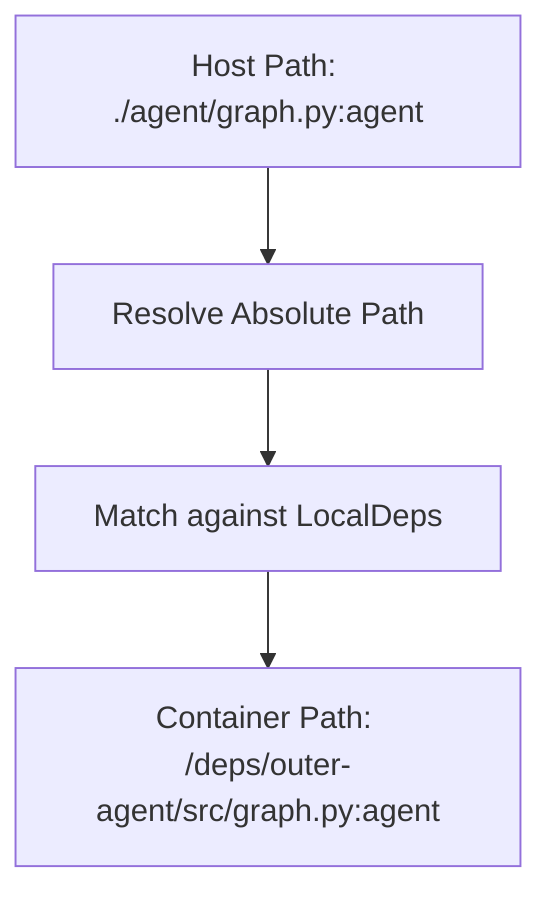

# Docker Image Generation

Relevant source files

-   [libs/cli/README.md](https://github.com/langchain-ai/langgraph/blob/1fd51e8f/libs/cli/README.md?plain=1)
-   [libs/cli/examples/my\_app.py](https://github.com/langchain-ai/langgraph/blob/1fd51e8f/libs/cli/examples/my_app.py)
-   [libs/cli/langgraph\_cli/\_\_init\_\_.py](https://github.com/langchain-ai/langgraph/blob/1fd51e8f/libs/cli/langgraph_cli/__init__.py)
-   [libs/cli/langgraph\_cli/cli.py](https://github.com/langchain-ai/langgraph/blob/1fd51e8f/libs/cli/langgraph_cli/cli.py)
-   [libs/cli/langgraph\_cli/config.py](https://github.com/langchain-ai/langgraph/blob/1fd51e8f/libs/cli/langgraph_cli/config.py)
-   [libs/cli/langgraph\_cli/docker.py](https://github.com/langchain-ai/langgraph/blob/1fd51e8f/libs/cli/langgraph_cli/docker.py)
-   [libs/cli/langgraph\_cli/exec.py](https://github.com/langchain-ai/langgraph/blob/1fd51e8f/libs/cli/langgraph_cli/exec.py)
-   [libs/cli/langgraph\_cli/helpers.py](https://github.com/langchain-ai/langgraph/blob/1fd51e8f/libs/cli/langgraph_cli/helpers.py)
-   [libs/cli/langgraph\_cli/host\_backend.py](https://github.com/langchain-ai/langgraph/blob/1fd51e8f/libs/cli/langgraph_cli/host_backend.py)
-   [libs/cli/langgraph\_cli/progress.py](https://github.com/langchain-ai/langgraph/blob/1fd51e8f/libs/cli/langgraph_cli/progress.py)
-   [libs/cli/langgraph\_cli/util.py](https://github.com/langchain-ai/langgraph/blob/1fd51e8f/libs/cli/langgraph_cli/util.py)
-   [libs/cli/pyproject.toml](https://github.com/langchain-ai/langgraph/blob/1fd51e8f/libs/cli/pyproject.toml)
-   [libs/cli/tests/unit\_tests/agent.py](https://github.com/langchain-ai/langgraph/blob/1fd51e8f/libs/cli/tests/unit_tests/agent.py)
-   [libs/cli/tests/unit\_tests/cli/test\_cli.py](https://github.com/langchain-ai/langgraph/blob/1fd51e8f/libs/cli/tests/unit_tests/cli/test_cli.py)
-   [libs/cli/tests/unit\_tests/graphs/agent.py](https://github.com/langchain-ai/langgraph/blob/1fd51e8f/libs/cli/tests/unit_tests/graphs/agent.py)
-   [libs/cli/tests/unit\_tests/pipconfig.txt](https://github.com/langchain-ai/langgraph/blob/1fd51e8f/libs/cli/tests/unit_tests/pipconfig.txt)
-   [libs/cli/tests/unit\_tests/test\_config.json](https://github.com/langchain-ai/langgraph/blob/1fd51e8f/libs/cli/tests/unit_tests/test_config.json)
-   [libs/cli/tests/unit\_tests/test\_config.py](https://github.com/langchain-ai/langgraph/blob/1fd51e8f/libs/cli/tests/unit_tests/test_config.py)
-   [libs/cli/tests/unit\_tests/test\_deploy\_helpers.py](https://github.com/langchain-ai/langgraph/blob/1fd51e8f/libs/cli/tests/unit_tests/test_deploy_helpers.py)
-   [libs/cli/tests/unit\_tests/test\_docker.py](https://github.com/langchain-ai/langgraph/blob/1fd51e8f/libs/cli/tests/unit_tests/test_docker.py)
-   [libs/cli/tests/unit\_tests/test\_host\_backend.py](https://github.com/langchain-ai/langgraph/blob/1fd51e8f/libs/cli/tests/unit_tests/test_host_backend.py)
-   [libs/cli/tests/unit\_tests/test\_logs\_helpers.py](https://github.com/langchain-ai/langgraph/blob/1fd51e8f/libs/cli/tests/unit_tests/test_logs_helpers.py)
-   [libs/cli/tests/unit\_tests/test\_util.py](https://github.com/langchain-ai/langgraph/blob/1fd51e8f/libs/cli/tests/unit_tests/test_util.py)
-   [libs/cli/uv.lock](https://github.com/langchain-ai/langgraph/blob/1fd51e8f/libs/cli/uv.lock)

This document covers the Dockerfile generation system in the LangGraph CLI, which transforms a `langgraph.json` configuration into a deployable Docker image. The system analyzes local dependencies, generates appropriate build instructions, and produces a Dockerfile that can be used with `langgraph build` or `langgraph dockerfile` commands.

For information about the overall CLI command structure, see [CLI Commands (6.1)](https://github.com/langchain-ai/langgraph/blob/1fd51e8f/CLI Commands (6.1)) For configuration schema and validation, see [Configuration System (6.2)](https://github.com/langchain-ai/langgraph/blob/1fd51e8f/Configuration System (6.2)) For local development workflows, see [Local Development Server (6.5)](https://github.com/langchain-ai/langgraph/blob/1fd51e8f/Local Development Server (6.5))

## Overview

The Docker image generation system converts declarative configuration into imperative Docker build instructions. It handles several complex scenarios:

-   **Local dependency packaging**: Distinguishes between Python packages with metadata (`pyproject.toml`/`setup.py`) and directories without, generating minimal packaging metadata for the latter.
-   **Path rewriting**: Transforms host filesystem paths to container paths for graph definitions, authentication modules, and encryption handlers.
-   **Multi-context builds**: Manages Docker build contexts when dependencies exist outside the configuration directory.
-   **Package installer selection**: Chooses between `pip` and `uv` based on base image capabilities.
-   **Cleanup optimization**: Removes build tools from final images to reduce size.

The primary entry point is `config_to_docker()` which orchestrates the entire generation process.

**Sources**: [libs/cli/langgraph\_cli/config.py822](https://github.com/langchain-ai/langgraph/blob/1fd51e8f/libs/cli/langgraph_cli/config.py#L822-L822) [libs/cli/langgraph\_cli/config.py1077](https://github.com/langchain-ai/langgraph/blob/1fd51e8f/libs/cli/langgraph_cli/config.py#L1077-L1077)

## Configuration-to-Dockerfile Flow

The following diagram maps the natural language requirements of a build process to the specific code entities responsible for execution.

### Logic Flow: Natural Language to Code Entity Space


**Sources**: [libs/cli/langgraph\_cli/config.py142](https://github.com/langchain-ai/langgraph/blob/1fd51e8f/libs/cli/langgraph_cli/config.py#L142-L142) [libs/cli/langgraph\_cli/config.py311](https://github.com/langchain-ai/langgraph/blob/1fd51e8f/libs/cli/langgraph_cli/config.py#L311-L311) [libs/cli/langgraph\_cli/config.py487](https://github.com/langchain-ai/langgraph/blob/1fd51e8f/libs/cli/langgraph_cli/config.py#L487-L487) [libs/cli/langgraph\_cli/config.py822](https://github.com/langchain-ai/langgraph/blob/1fd51e8f/libs/cli/langgraph_cli/config.py#L822-L822)

## Local Dependency Classification

The system categorizes local dependencies (those starting with `.`) into three types:

| Type | Detection | Treatment | Container Path |
| --- | --- | --- | --- |
| **Real Package** | Contains `pyproject.toml` or `setup.py` | Direct pip install | `/deps/<name>` |
| **Faux Package** | No metadata files, has Python files | Generate minimal `pyproject.toml` | `/deps/outer-<name>/<name>` or `/deps/outer-<name>/src` |
| **Requirements File** | `requirements.txt` in faux package | Install before package | Copied alongside package |

### LocalDeps Structure

The `LocalDeps` NamedTuple encapsulates dependency analysis results:

```
class LocalDeps(NamedTuple):    pip_reqs: list[tuple[pathlib.Path, str]]  # (host_path, container_path)    real_pkgs: dict[pathlib.Path, tuple[str, str]]  # host_path -> (dep_string, container_name)    faux_pkgs: dict[pathlib.Path, tuple[str, str]]  # host_path -> (dep_string, container_path)    working_dir: str | None  # If "." in dependencies    additional_contexts: list[pathlib.Path]  # Dirs in parent directories
```
**Sources**: [libs/cli/langgraph\_cli/config.py311-317](https://github.com/langchain-ai/langgraph/blob/1fd51e8f/libs/cli/langgraph_cli/config.py#L311-L317)

### Real Package Handling

Real packages are copied directly and installed with pip/uv in editable mode:

```
# Example generated instructionADD ./my_package /deps/my_packageRUN for dep in /deps/*; do \    (cd "$dep" && PYTHONDONTWRITEBYTECODE=1 uv pip install --system --no-cache-dir -c /api/constraints.txt -e .); \done
```
**Sources**: [libs/cli/langgraph\_cli/config.py424-440](https://github.com/langchain-ai/langgraph/blob/1fd51e8f/libs/cli/langgraph_cli/config.py#L424-L440) [libs/cli/langgraph\_cli/config.py913-922](https://github.com/langchain-ai/langgraph/blob/1fd51e8f/libs/cli/langgraph_cli/config.py#L913-L922)

### Faux Package Handling

Faux packages require synthetic packaging metadata. The system generates a minimal `pyproject.toml` using `setuptools` as the backend.

**Flat vs Src Layout**: If `__init__.py` exists at the root, flat layout is used (`/deps/outer-<name>/<name>`). Otherwise, src layout is assumed (`/deps/outer-<name>/src`).

**Sources**: [libs/cli/langgraph\_cli/config.py441-483](https://github.com/langchain-ai/langgraph/blob/1fd51e8f/libs/cli/langgraph_cli/config.py#L441-L483) [libs/cli/langgraph\_cli/config.py893-913](https://github.com/langchain-ai/langgraph/blob/1fd51e8f/libs/cli/langgraph_cli/config.py#L893-L913)

## Path Rewriting System

Host filesystem paths in `langgraph.json` must be translated to container paths. The system rewrites four categories of paths to ensure the API server can locate code inside the image.

### Path Translation Mapping

| Source Config Key | Transformation Function | Code Pointer |
| --- | --- | --- |
| `graphs` | `_update_graph_paths()` | [libs/cli/langgraph\_cli/config.py487](https://github.com/langchain-ai/langgraph/blob/1fd51e8f/libs/cli/langgraph_cli/config.py#L487-L487) |
| `auth` | `_update_auth_path()` | [libs/cli/langgraph\_cli/config.py587](https://github.com/langchain-ai/langgraph/blob/1fd51e8f/libs/cli/langgraph_cli/config.py#L587-L587) |
| `encryption` | `_update_encryption_path()` | [libs/cli/langgraph\_cli/config.py628](https://github.com/langchain-ai/langgraph/blob/1fd51e8f/libs/cli/langgraph_cli/config.py#L628-L628) |
| `http.app` | `_update_http_app_path()` | [libs/cli/langgraph\_cli/config.py671](https://github.com/langchain-ai/langgraph/blob/1fd51e8f/libs/cli/langgraph_cli/config.py#L671-L671) |

### Path Resolution Logic


**Sources**: [libs/cli/langgraph\_cli/config.py487-722](https://github.com/langchain-ai/langgraph/blob/1fd51e8f/libs/cli/langgraph_cli/config.py#L487-L722)

## Package Installer Selection

The system supports `pip` and `uv` with automatic selection based on the base image version.

| Mode | Behavior |
| --- | --- |
| `auto` | Use `uv` if base image version ≥ `0.2.47`, else `pip`. |
| `pip` | Force traditional `pip` installer. |
| `uv` | Force `uv` installer. |

The `_image_supports_uv` function performs regex matching on the base image tag to determine version compatibility.

**Sources**: [libs/cli/langgraph\_cli/config.py787-799](https://github.com/langchain-ai/langgraph/blob/1fd51e8f/libs/cli/langgraph_cli/config.py#L787-L799) [libs/cli/langgraph\_cli/config.py829-841](https://github.com/langchain-ai/langgraph/blob/1fd51e8f/libs/cli/langgraph_cli/config.py#L829-L841)

## Build Context Management

When local dependencies exist outside the configuration directory (e.g., `../shared_lib`), Docker cannot access them with a standard build context. The system uses Docker's `additional_contexts` feature.

The CLI identifies directories in parent paths and assigns them a context name (e.g., `cli_1`). In the generated Dockerfile, these are accessed via `COPY --from=<context_name>`.

**Sources**: [libs/cli/langgraph\_cli/config.py419-423](https://github.com/langchain-ai/langgraph/blob/1fd51e8f/libs/cli/langgraph_cli/config.py#L419-L423) [libs/cli/tests/unit\_tests/cli/test\_cli.py142-143](https://github.com/langchain-ai/langgraph/blob/1fd51e8f/libs/cli/tests/unit_tests/cli/test_cli.py#L142-L143)

## Build Tool Cleanup

To minimize image size, the system removes build dependencies (pip, setuptools, wheel) unless explicitly kept via `keep_pkg_tools`.

### Cleanup Implementation

The `_get_pip_cleanup_lines` function generates the `RUN` commands for uninstallation. It specifically targets both standard Python site-packages and Wolfi-specific paths (`/usr/lib/python*/site-packages/`).

```
def _get_pip_cleanup_lines(    install_cmd: str,    to_uninstall: tuple[str] | None,    pip_installer: Literal["uv", "pip"],) -> str:    # ... logic to generate RUN pip uninstall and rm -rf ...
```
**Sources**: [libs/cli/langgraph\_cli/config.py56-99](https://github.com/langchain-ai/langgraph/blob/1fd51e8f/libs/cli/langgraph_cli/config.py#L56-L99)

## Multi-Platform and Distro Selection

The CLI supports generating images for different Linux distributions, with a strong recommendation for **Wolfi Linux** due to its security posture.

-   **Default Distro**: `debian` [libs/cli/langgraph\_cli/config.py50](https://github.com/langchain-ai/langgraph/blob/1fd51e8f/libs/cli/langgraph_cli/config.py#L50-L50)
-   **Security Recommendation**: If `image_distro` is not `wolfi`, the CLI issues a warning via `warn_non_wolfi_distro()` [libs/cli/langgraph\_cli/util.py10-27](https://github.com/langchain-ai/langgraph/blob/1fd51e8f/libs/cli/langgraph_cli/util.py#L10-L27)
-   **Python Versions**: Supports `3.11`, `3.12`, and `3.13` [libs/cli/langgraph\_cli/config.py47-48](https://github.com/langchain-ai/langgraph/blob/1fd51e8f/libs/cli/langgraph_cli/config.py#L47-L48)

### Tag Generation Logic

The `docker_tag()` function constructs the final image tag based on the language runtime (Python vs Node.js), version, and distribution.

**Sources**: [libs/cli/langgraph\_cli/config.py1443-1480](https://github.com/langchain-ai/langgraph/blob/1fd51e8f/libs/cli/langgraph_cli/config.py#L1443-L1480)

## Node.js Support

If the `graphs` configuration points to `.js` or `.ts` files, the CLI switches to Node.js image generation.

-   **Base Image**: `langchain/langgraphjs-api` [libs/cli/langgraph\_cli/config.py1127](https://github.com/langchain-ai/langgraph/blob/1fd51e8f/libs/cli/langgraph_cli/config.py#L1127-L1127)
-   **Package Managers**: Supports `npm`, `yarn`, `pnpm`, and `bun` by detecting corresponding lock files [libs/cli/langgraph\_cli/config.py724-782](https://github.com/langchain-ai/langgraph/blob/1fd51e8f/libs/cli/langgraph_cli/config.py#L724-L782)

**Sources**: [libs/cli/langgraph\_cli/config.py124-141](https://github.com/langchain-ai/langgraph/blob/1fd51e8f/libs/cli/langgraph_cli/config.py#L124-L141) [libs/cli/langgraph\_cli/config.py1079-1257](https://github.com/langchain-ai/langgraph/blob/1fd51e8f/libs/cli/langgraph_cli/config.py#L1079-L1257)
