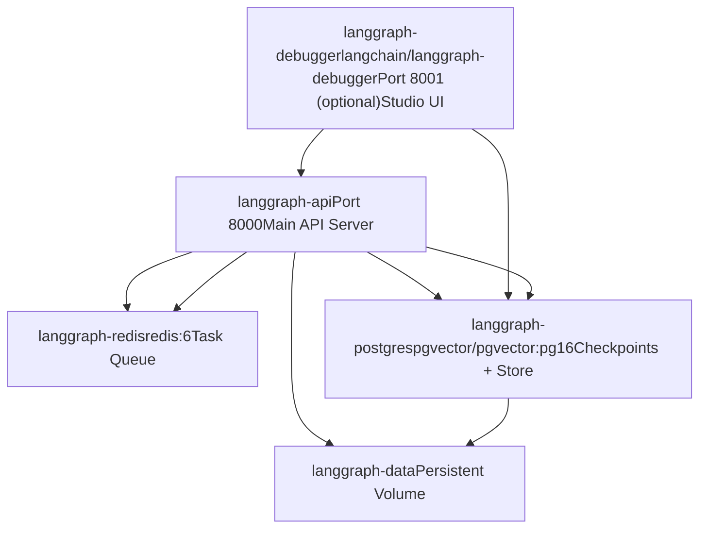
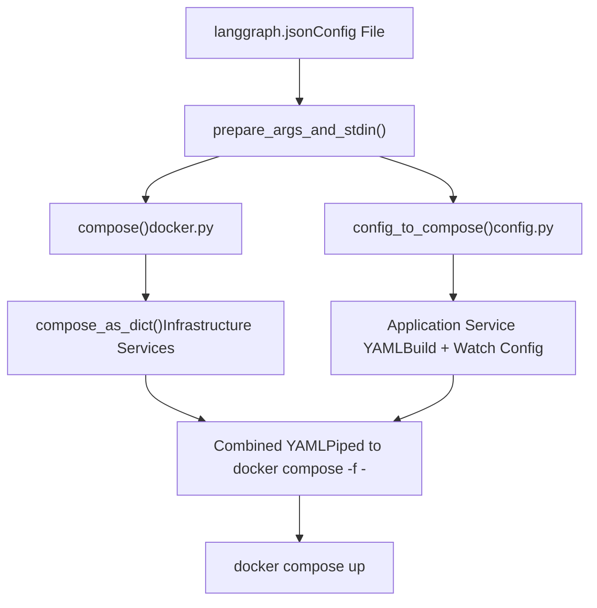
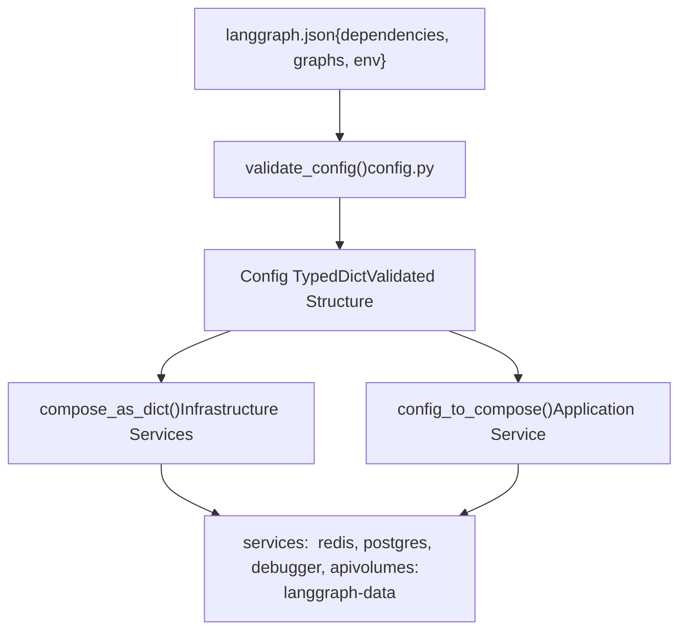

# Multi-Service Orchestration

Relevant source files

-   [libs/cli/README.md](https://github.com/langchain-ai/langgraph/blob/1fd51e8f/libs/cli/README.md?plain=1)
-   [libs/cli/examples/my\_app.py](https://github.com/langchain-ai/langgraph/blob/1fd51e8f/libs/cli/examples/my_app.py)
-   [libs/cli/langgraph\_cli/\_\_init\_\_.py](https://github.com/langchain-ai/langgraph/blob/1fd51e8f/libs/cli/langgraph_cli/__init__.py)
-   [libs/cli/langgraph\_cli/cli.py](https://github.com/langchain-ai/langgraph/blob/1fd51e8f/libs/cli/langgraph_cli/cli.py)
-   [libs/cli/langgraph\_cli/config.py](https://github.com/langchain-ai/langgraph/blob/1fd51e8f/libs/cli/langgraph_cli/config.py)
-   [libs/cli/langgraph\_cli/docker.py](https://github.com/langchain-ai/langgraph/blob/1fd51e8f/libs/cli/langgraph_cli/docker.py)
-   [libs/cli/langgraph\_cli/exec.py](https://github.com/langchain-ai/langgraph/blob/1fd51e8f/libs/cli/langgraph_cli/exec.py)
-   [libs/cli/langgraph\_cli/helpers.py](https://github.com/langchain-ai/langgraph/blob/1fd51e8f/libs/cli/langgraph_cli/helpers.py)
-   [libs/cli/langgraph\_cli/host\_backend.py](https://github.com/langchain-ai/langgraph/blob/1fd51e8f/libs/cli/langgraph_cli/host_backend.py)
-   [libs/cli/langgraph\_cli/progress.py](https://github.com/langchain-ai/langgraph/blob/1fd51e8f/libs/cli/langgraph_cli/progress.py)
-   [libs/cli/langgraph\_cli/util.py](https://github.com/langchain-ai/langgraph/blob/1fd51e8f/libs/cli/langgraph_cli/util.py)
-   [libs/cli/pyproject.toml](https://github.com/langchain-ai/langgraph/blob/1fd51e8f/libs/cli/pyproject.toml)
-   [libs/cli/tests/unit\_tests/agent.py](https://github.com/langchain-ai/langgraph/blob/1fd51e8f/libs/cli/tests/unit_tests/agent.py)
-   [libs/cli/tests/unit\_tests/cli/test\_cli.py](https://github.com/langchain-ai/langgraph/blob/1fd51e8f/libs/cli/tests/unit_tests/cli/test_cli.py)
-   [libs/cli/tests/unit\_tests/graphs/agent.py](https://github.com/langchain-ai/langgraph/blob/1fd51e8f/libs/cli/tests/unit_tests/graphs/agent.py)
-   [libs/cli/tests/unit\_tests/pipconfig.txt](https://github.com/langchain-ai/langgraph/blob/1fd51e8f/libs/cli/tests/unit_tests/pipconfig.txt)
-   [libs/cli/tests/unit\_tests/test\_config.json](https://github.com/langchain-ai/langgraph/blob/1fd51e8f/libs/cli/tests/unit_tests/test_config.json)
-   [libs/cli/tests/unit\_tests/test\_config.py](https://github.com/langchain-ai/langgraph/blob/1fd51e8f/libs/cli/tests/unit_tests/test_config.py)
-   [libs/cli/tests/unit\_tests/test\_deploy\_helpers.py](https://github.com/langchain-ai/langgraph/blob/1fd51e8f/libs/cli/tests/unit_tests/test_deploy_helpers.py)
-   [libs/cli/tests/unit\_tests/test\_docker.py](https://github.com/langchain-ai/langgraph/blob/1fd51e8f/libs/cli/tests/unit_tests/test_docker.py)
-   [libs/cli/tests/unit\_tests/test\_host\_backend.py](https://github.com/langchain-ai/langgraph/blob/1fd51e8f/libs/cli/tests/unit_tests/test_host_backend.py)
-   [libs/cli/tests/unit\_tests/test\_logs\_helpers.py](https://github.com/langchain-ai/langgraph/blob/1fd51e8f/libs/cli/tests/unit_tests/test_logs_helpers.py)
-   [libs/cli/tests/unit\_tests/test\_util.py](https://github.com/langchain-ai/langgraph/blob/1fd51e8f/libs/cli/tests/unit_tests/test_util.py)
-   [libs/cli/uv.lock](https://github.com/langchain-ai/langgraph/blob/1fd51e8f/libs/cli/uv.lock)

## Purpose and Scope

This document describes how the LangGraph CLI generates and orchestrates multi-service Docker Compose configurations for local development and deployment. The system automatically provisions dependent services (Redis, PostgreSQL, debugger UI) alongside the LangGraph API server, handling service dependencies, health checks, networking, and hot-reloading in watch mode.

For building single Docker images (without orchestration), see [6.3 Docker Image Generation](https://github.com/langchain-ai/langgraph/blob/1fd51e8f/6.3 Docker Image Generation) For the development server that runs without Docker, see [6.5 Local Development Server](https://github.com/langchain-ai/langgraph/blob/1fd51e8f/6.5 Local Development Server)

## Service Architecture

The CLI generates a multi-service stack with four primary components, each running in its own container with defined health checks and dependencies.


**Service Architecture**

Sources: [libs/cli/langgraph\_cli/docker.py167-220](https://github.com/langchain-ai/langgraph/blob/1fd51e8f/libs/cli/langgraph_cli/docker.py#L167-L220) [libs/cli/tests/unit\_tests/cli/test\_cli.py80-137](https://github.com/langchain-ai/langgraph/blob/1fd51e8f/libs/cli/tests/unit_tests/cli/test_cli.py#L80-L137)

## Docker Compose Generation Flow

The CLI generates Docker Compose configurations through two main code paths: infrastructure services and application services.


**Compose Generation Pipeline**

The `prepare_args_and_stdin` function in `cli.py` orchestrates the generation by calling infrastructure helpers in `docker.py` and application-specific builders in `config.py`, then combining them into a single YAML document passed via stdin to the Docker subprocess [libs/cli/tests/unit\_tests/cli/test\_cli.py61-71](https://github.com/langchain-ai/langgraph/blob/1fd51e8f/libs/cli/tests/unit_tests/cli/test_cli.py#L61-L71)

Sources: [libs/cli/langgraph\_cli/docker.py138-154](https://github.com/langchain-ai/langgraph/blob/1fd51e8f/libs/cli/langgraph_cli/docker.py#L138-L154) [libs/cli/tests/unit\_tests/cli/test\_cli.py51-171](https://github.com/langchain-ai/langgraph/blob/1fd51e8f/libs/cli/tests/unit_tests/cli/test_cli.py#L51-L171)

## Infrastructure Services

### Redis Service

The Redis service provides task queue and caching functionality with automatic health checking.

| Property | Value |
| --- | --- |
| Image | `redis:6` |
| Healthcheck | `redis-cli ping` |
| Interval | 5s |
| Timeout | 1s |
| Retries | 5 |
| Network Access | Internal only (no exposed ports) |

The API server connects via `REDIS_URI=redis://langgraph-redis:6379` [libs/cli/langgraph\_cli/docker.py212](https://github.com/langchain-ai/langgraph/blob/1fd51e8f/libs/cli/langgraph_cli/docker.py#L212-L212)

Sources: [libs/cli/langgraph\_cli/docker.py168-177](https://github.com/langchain-ai/langgraph/blob/1fd51e8f/libs/cli/langgraph_cli/docker.py#L168-L177) [libs/cli/tests/unit\_tests/cli/test\_cli.py84-90](https://github.com/langchain-ai/langgraph/blob/1fd51e8f/libs/cli/tests/unit_tests/cli/test_cli.py#L84-L90)

### PostgreSQL Service

PostgreSQL with pgvector extension stores checkpoints and provides the Store backend.

| Property | Value |
| --- | --- |
| Image | `pgvector/pgvector:pg16` |
| Port | 5433:5432 (host:container) |
| Environment | `POSTGRES_DB=postgres`
`POSTGRES_USER=postgres`
`POSTGRES_PASSWORD=postgres` |
| Command | `postgres -c shared_preload_libraries=vector` |
| Volume | `langgraph-data:/var/lib/postgresql/data` |
| Healthcheck | `pg_isready -U postgres` |
| Start Period | 10s |
| Start Interval | 1s |

The default connection string is defined as `DEFAULT_POSTGRES_URI` [libs/cli/langgraph\_cli/docker.py11-13](https://github.com/langchain-ai/langgraph/blob/1fd51e8f/libs/cli/langgraph_cli/docker.py#L11-L13) and is configurable via the `postgres_uri` parameter in `compose_as_dict` [libs/cli/langgraph\_cli/docker.py145](https://github.com/langchain-ai/langgraph/blob/1fd51e8f/libs/cli/langgraph_cli/docker.py#L145-L145)

Sources: [libs/cli/langgraph\_cli/docker.py181-203](https://github.com/langchain-ai/langgraph/blob/1fd51e8f/libs/cli/langgraph_cli/docker.py#L181-L203) [libs/cli/tests/unit\_tests/cli/test\_cli.py91-111](https://github.com/langchain-ai/langgraph/blob/1fd51e8f/libs/cli/tests/unit_tests/cli/test_cli.py#L91-L111)

### Debugger Service (Optional)

When a debugger port is specified, the CLI includes the LangGraph Studio debugger UI via `debugger_compose` [libs/cli/langgraph\_cli/docker.py93-113](https://github.com/langchain-ai/langgraph/blob/1fd51e8f/libs/cli/langgraph_cli/docker.py#L93-L113)

| Property | Value |
| --- | --- |
| Image | `langchain/langgraph-debugger` |
| Port | User-specified (mapped to 3968) |
| Restart Policy | `on-failure` |
| Environment | `VITE_STUDIO_LOCAL_GRAPH_URL` set to API URL |
| Dependencies | Waits for `langgraph-postgres` to be healthy |

Sources: [libs/cli/langgraph\_cli/docker.py98-111](https://github.com/langchain-ai/langgraph/blob/1fd51e8f/libs/cli/langgraph_cli/docker.py#L98-L111) [libs/cli/tests/unit\_tests/cli/test\_cli.py112-121](https://github.com/langchain-ai/langgraph/blob/1fd51e8f/libs/cli/tests/unit_tests/cli/test_cli.py#L112-L121)

## Application Service Configuration

### Build Mode vs Image Mode

The `langgraph-api` service can operate in two modes:

**Build Mode** (default): Generates inline Dockerfile and builds image on-demand. It uses `dockerfile_inline` with the `FROM` instruction targeting the appropriate Python version [libs/cli/tests/unit\_tests/cli/test\_cli.py144-146](https://github.com/langchain-ai/langgraph/blob/1fd51e8f/libs/cli/tests/unit_tests/cli/test_cli.py#L144-L146)

**Image Mode**: When an `image` string is provided to `compose_as_dict`, it uses that pre-built image instead of a build context [libs/cli/langgraph\_cli/docker.py147](https://github.com/langchain-ai/langgraph/blob/1fd51e8f/libs/cli/langgraph_cli/docker.py#L147-L147)

Sources: [libs/cli/langgraph\_cli/docker.py138-154](https://github.com/langchain-ai/langgraph/blob/1fd51e8f/libs/cli/langgraph_cli/docker.py#L138-L154) [libs/cli/tests/unit\_tests/cli/test\_cli.py173-193](https://github.com/langchain-ai/langgraph/blob/1fd51e8f/libs/cli/tests/unit_tests/cli/test_cli.py#L173-L193)

### Service Dependencies and Health

The API service declares dependencies with health conditions to ensure a stable startup sequence.

```
langgraph-api:  depends_on:    langgraph-redis:      condition: service_healthy    langgraph-postgres:      condition: service_healthy  healthcheck:    test: python /api/healthcheck.py    interval: 60s    start_interval: 1s    start_period: 10s
```
The `start_interval` feature is conditionally enabled based on `DockerCapabilities.healthcheck_start_interval` [libs/cli/langgraph\_cli/docker.py198-200](https://github.com/langchain-ai/langgraph/blob/1fd51e8f/libs/cli/langgraph_cli/docker.py#L198-L200)

Sources: [libs/cli/langgraph\_cli/docker.py198-203](https://github.com/langchain-ai/langgraph/blob/1fd51e8f/libs/cli/langgraph_cli/docker.py#L198-L203) [libs/cli/tests/unit\_tests/cli/test\_cli.py122-138](https://github.com/langchain-ai/langgraph/blob/1fd51e8f/libs/cli/tests/unit_tests/cli/test_cli.py#L122-L138)

## Watch Mode and Hot Reloading

When `watch=True` is passed to the generation logic, the CLI configures Docker Compose's `develop` watch mode for automatic rebuilds on file changes [libs/cli/tests/unit\_tests/cli/test\_cli.py160-168](https://github.com/langchain-ai/langgraph/blob/1fd51e8f/libs/cli/tests/unit_tests/cli/test_cli.py#L160-L168)

The watch configuration monitors:

1.  **Configuration file** (`langgraph.json`): Triggers `rebuild`.
2.  **Local dependencies**: Each dependency in the `dependencies` array gets a watch entry.
3.  **Working directory**: Monitors the project context for changes.

Sources: [libs/cli/tests/unit\_tests/cli/test\_cli.py160-168](https://github.com/langchain-ai/langgraph/blob/1fd51e8f/libs/cli/tests/unit_tests/cli/test_cli.py#L160-L168)

## Configuration Transformation

The transformation from `langgraph.json` to compose services involves multiple validation and mapping steps.


**Configuration to Compose Transformation**

### Key Transformations

1.  **Dependency Resolution**: Local dependencies are analyzed to determine installation order and mount points [libs/cli/tests/unit\_tests/cli/test\_cli.py153-155](https://github.com/langchain-ai/langgraph/blob/1fd51e8f/libs/cli/tests/unit_tests/cli/test_cli.py#L153-L155)
2.  **Environment Injection**: Configuration values like `graphs` are serialized into `LANGSERVE_GRAPHS` [libs/cli/tests/unit\_tests/cli/test\_cli.py156](https://github.com/langchain-ai/langgraph/blob/1fd51e8f/libs/cli/tests/unit_tests/cli/test_cli.py#L156-L156)
3.  **Security Hardening**: The CLI checks for disallowed characters in build commands to prevent injection [libs/cli/langgraph\_cli/config.py38-44](https://github.com/langchain-ai/langgraph/blob/1fd51e8f/libs/cli/langgraph_cli/config.py#L38-L44)
4.  **Distro Validation**: Recommends Wolfi Linux for enhanced security [libs/cli/langgraph\_cli/util.py10-27](https://github.com/langchain-ai/langgraph/blob/1fd51e8f/libs/cli/langgraph_cli/util.py#L10-L27)

Sources: [libs/cli/langgraph\_cli/config.py142-196](https://github.com/langchain-ai/langgraph/blob/1fd51e8f/libs/cli/langgraph_cli/config.py#L142-L196) [libs/cli/langgraph\_cli/util.py10-27](https://github.com/langchain-ai/langgraph/blob/1fd51e8f/libs/cli/langgraph_cli/util.py#L10-L27)

## Service Communication

Services communicate through Docker's internal network using service names as hostnames:

| From | To | Connection String / Variable |
| --- | --- | --- |
| `langgraph-api` | `langgraph-redis` | `REDIS_URI: redis://langgraph-redis:6379` [libs/cli/langgraph\_cli/docker.py212](https://github.com/langchain-ai/langgraph/blob/1fd51e8f/libs/cli/langgraph_cli/docker.py#L212-L212) |
| `langgraph-api` | `langgraph-postgres` | `POSTGRES_URI: ...` [libs/cli/langgraph\_cli/docker.py213](https://github.com/langchain-ai/langgraph/blob/1fd51e8f/libs/cli/langgraph_cli/docker.py#L213-L213) |
| `langgraph-debugger` | `langgraph-api` | `VITE_STUDIO_LOCAL_GRAPH_URL` [libs/cli/langgraph\_cli/docker.py109-111](https://github.com/langchain-ai/langgraph/blob/1fd51e8f/libs/cli/langgraph_cli/docker.py#L109-L111) |

Sources: [libs/cli/langgraph\_cli/docker.py11-13](https://github.com/langchain-ai/langgraph/blob/1fd51e8f/libs/cli/langgraph_cli/docker.py#L11-L13) [libs/cli/langgraph\_cli/docker.py211-214](https://github.com/langchain-ai/langgraph/blob/1fd51e8f/libs/cli/langgraph_cli/docker.py#L211-L214)

## Volume Management

The `langgraph-data` volume provides persistent storage for the database:

```
volumes:  langgraph-data:    driver: local
```
This volume is mounted at `/var/lib/postgresql/data` in the `langgraph-postgres` container [libs/cli/langgraph\_cli/docker.py190](https://github.com/langchain-ai/langgraph/blob/1fd51e8f/libs/cli/langgraph_cli/docker.py#L190-L190)

Sources: [libs/cli/langgraph\_cli/docker.py190](https://github.com/langchain-ai/langgraph/blob/1fd51e8f/libs/cli/langgraph_cli/docker.py#L190-L190) [libs/cli/tests/unit\_tests/cli/test\_cli.py80-82](https://github.com/langchain-ai/langgraph/blob/1fd51e8f/libs/cli/tests/unit_tests/cli/test_cli.py#L80-L82)

## Docker Compose CLI Detection

The `check_capabilities` function detects the environment's Docker setup [libs/cli/langgraph\_cli/docker.py48-90](https://github.com/langchain-ai/langgraph/blob/1fd51e8f/libs/cli/langgraph_cli/docker.py#L48-L90)

-   **plugin**: Uses `docker compose` (v2+ plugin).
-   **standalone**: Uses `docker-compose` (v1 standalone).
-   **Healthcheck support**: Detects if `start_interval` is supported (Docker 25.0.0+) [libs/cli/langgraph\_cli/docker.py88](https://github.com/langchain-ai/langgraph/blob/1fd51e8f/libs/cli/langgraph_cli/docker.py#L88-L88)

Sources: [libs/cli/langgraph\_cli/docker.py25-29](https://github.com/langchain-ai/langgraph/blob/1fd51e8f/libs/cli/langgraph_cli/docker.py#L25-L29) [libs/cli/langgraph\_cli/docker.py48-90](https://github.com/langchain-ai/langgraph/blob/1fd51e8f/libs/cli/langgraph_cli/docker.py#L48-L90)
