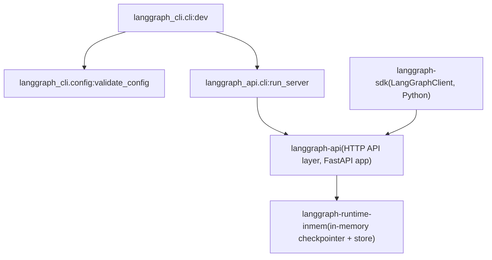

# Local Development Server

Relevant source files

-   [libs/cli/README.md](https://github.com/langchain-ai/langgraph/blob/1fd51e8f/libs/cli/README.md?plain=1)
-   [libs/cli/langgraph\_cli/\_\_init\_\_.py](https://github.com/langchain-ai/langgraph/blob/1fd51e8f/libs/cli/langgraph_cli/__init__.py)
-   [libs/cli/langgraph\_cli/cli.py](https://github.com/langchain-ai/langgraph/blob/1fd51e8f/libs/cli/langgraph_cli/cli.py)
-   [libs/cli/langgraph\_cli/config.py](https://github.com/langchain-ai/langgraph/blob/1fd51e8f/libs/cli/langgraph_cli/config.py)
-   [libs/cli/langgraph\_cli/helpers.py](https://github.com/langchain-ai/langgraph/blob/1fd51e8f/libs/cli/langgraph_cli/helpers.py)
-   [libs/cli/langgraph\_cli/host\_backend.py](https://github.com/langchain-ai/langgraph/blob/1fd51e8f/libs/cli/langgraph_cli/host_backend.py)
-   [libs/cli/langgraph\_cli/progress.py](https://github.com/langchain-ai/langgraph/blob/1fd51e8f/libs/cli/langgraph_cli/progress.py)
-   [libs/cli/langgraph\_cli/util.py](https://github.com/langchain-ai/langgraph/blob/1fd51e8f/libs/cli/langgraph_cli/util.py)
-   [libs/cli/pyproject.toml](https://github.com/langchain-ai/langgraph/blob/1fd51e8f/libs/cli/pyproject.toml)
-   [libs/cli/tests/unit\_tests/cli/test\_cli.py](https://github.com/langchain-ai/langgraph/blob/1fd51e8f/libs/cli/tests/unit_tests/cli/test_cli.py)
-   [libs/cli/tests/unit\_tests/test\_config.py](https://github.com/langchain-ai/langgraph/blob/1fd51e8f/libs/cli/tests/unit_tests/test_config.py)
-   [libs/cli/tests/unit\_tests/test\_deploy\_helpers.py](https://github.com/langchain-ai/langgraph/blob/1fd51e8f/libs/cli/tests/unit_tests/test_deploy_helpers.py)
-   [libs/cli/tests/unit\_tests/test\_host\_backend.py](https://github.com/langchain-ai/langgraph/blob/1fd51e8f/libs/cli/tests/unit_tests/test_host_backend.py)
-   [libs/cli/tests/unit\_tests/test\_logs\_helpers.py](https://github.com/langchain-ai/langgraph/blob/1fd51e8f/libs/cli/tests/unit_tests/test_logs_helpers.py)
-   [libs/cli/tests/unit\_tests/test\_util.py](https://github.com/langchain-ai/langgraph/blob/1fd51e8f/libs/cli/tests/unit_tests/test_util.py)
-   [libs/cli/uv.lock](https://github.com/langchain-ai/langgraph/blob/1fd51e8f/libs/cli/uv.lock)

This page covers `langgraph dev`, the in-memory development server mode provided by `langgraph-cli`. It is intended for rapid local iteration without Docker. For the Docker-based production-oriented server (using Postgres and Redis), see [Multi-Service Orchestration](/langchain-ai/langgraph/6.4-multi-service-orchestration). For all CLI commands at a summary level, see [CLI Commands](/langchain-ai/langgraph/6.1-cli-commands). For the `langgraph.json` configuration file, see [Configuration System (langgraph.json)](/langchain-ai/langgraph/6.2-configuration-system-(langgraph.json)).

---

## Overview

`langgraph dev` starts the LangGraph API server as a native Python process in the current shell, loading graphs directly from source. It does not require Docker. The server uses an in-memory SQLite-backed checkpointer and store rather than Postgres, which makes it unsuitable for production but fast to start.

The command is implemented in `langgraph_cli/cli.py` as the `dev` Click command [libs/cli/langgraph\_cli/cli.py609-768](https://github.com/langchain-ai/langgraph/blob/1fd51e8f/libs/cli/langgraph_cli/cli.py#L609-L768)

---

## Installation Requirements

`langgraph dev` depends on two optional packages that are not installed by default. They are available via the `inmem` extras group declared in `pyproject.toml` [libs/cli/pyproject.toml22-26](https://github.com/langchain-ai/langgraph/blob/1fd51e8f/libs/cli/pyproject.toml#L22-L26):

| Package | Minimum Version | Python Constraint | Role |
| --- | --- | --- | --- |
| `langgraph-api` | `>=0.5.35,<0.8.0` | `>= 3.11` | Provides `run_server` function and HTTP API layer |
| `langgraph-runtime-inmem` | `>=0.7` | `>= 3.11` | Provides in-memory checkpointer and store |
| `python-dotenv` | `>=0.8.0` | `>= 3.11` | `.env` file loading support |

Install with:

```
pip install -U "langgraph-cli[inmem]"
```
**Python version requirement:** The `inmem` extras are only installed for Python 3.11 or higher [libs/cli/pyproject.toml24-25](https://github.com/langchain-ai/langgraph/blob/1fd51e8f/libs/cli/pyproject.toml#L24-L25) The `dev` command will emit a descriptive error if Python < 3.11 is detected [libs/cli/langgraph\_cli/cli.py703-710](https://github.com/langchain-ai/langgraph/blob/1fd51e8f/libs/cli/langgraph_cli/cli.py#L703-L710)

**JS graphs are not supported.** If the validated config includes `node_version`, the command immediately raises a `UsageError` [libs/cli/langgraph\_cli/cli.py733-736](https://github.com/langchain-ai/langgraph/blob/1fd51e8f/libs/cli/langgraph_cli/cli.py#L733-L736)

Sources: [libs/cli/pyproject.toml22-26](https://github.com/langchain-ai/langgraph/blob/1fd51e8f/libs/cli/pyproject.toml#L22-L26) [libs/cli/langgraph\_cli/cli.py703-736](https://github.com/langchain-ai/langgraph/blob/1fd51e8f/libs/cli/langgraph_cli/cli.py#L703-L736)

---

## Architecture

The following diagram shows how `langgraph dev` relates to the packages it depends on.

**Dependency and call flow for `langgraph dev`**


Sources: [libs/cli/langgraph\_cli/cli.py700-768](https://github.com/langchain-ai/langgraph/blob/1fd51e8f/libs/cli/langgraph_cli/cli.py#L700-L768) [libs/cli/pyproject.toml22-26](https://github.com/langchain-ai/langgraph/blob/1fd51e8f/libs/cli/pyproject.toml#L22-L26)

---

## Command Options

The `dev` command is registered as `langgraph dev` via the Click group [libs/cli/langgraph\_cli/cli.py609-679](https://github.com/langchain-ai/langgraph/blob/1fd51e8f/libs/cli/langgraph_cli/cli.py#L609-L679)

| Option | Type | Default | Description |
| --- | --- | --- | --- |
| `--host` | `str` | `127.0.0.1` | Network interface to bind |
| `--port` | `int` | `2024` | Port to listen on |
| `--no-reload` | flag | off | Disables hot reloading |
| `--config` | path | `langgraph.json` | Config file path |
| `--n-jobs-per-worker` | `int` | `None` | Max concurrent jobs per worker |
| `--no-browser` | flag | off | Skips auto-opening LangGraph Studio |
| `--debug-port` | `int` | `None` | Enables `debugpy` remote debugging on this port |
| `--wait-for-client` | flag | off | Blocks startup until a debugger connects |
| `--studio-url` | `str` | `None` | Override Studio URL (default: `https://smith.langchain.com`) |
| `--allow-blocking` | flag | off | Suppresses errors for synchronous blocking I/O |
| `--tunnel` | flag | off | Expose server via Cloudflare tunnel |

Sources: [libs/cli/langgraph\_cli/cli.py609-679](https://github.com/langchain-ai/langgraph/blob/1fd51e8f/libs/cli/langgraph_cli/cli.py#L609-L679)

---

## Execution Flow

The following diagram maps the `dev` function's internal execution sequence to the actual code constructs involved.

**`dev` function execution sequence**

> **[Mermaid sequence]**
> *(图表结构无法解析)*

Sources: [libs/cli/langgraph\_cli/cli.py698-768](https://github.com/langchain-ai/langgraph/blob/1fd51e8f/libs/cli/langgraph_cli/cli.py#L698-L768) [libs/cli/langgraph\_cli/config.py142-230](https://github.com/langchain-ai/langgraph/blob/1fd51e8f/libs/cli/langgraph_cli/config.py#L142-L230)

---

## Config Propagation

After validation via `validate_config` [libs/cli/langgraph\_cli/config.py142-230](https://github.com/langchain-ai/langgraph/blob/1fd51e8f/libs/cli/langgraph_cli/config.py#L142-L230) config fields are extracted and forwarded directly to `run_server`. The mapping includes:

| `langgraph.json` field | Forwarded as `run_server` argument |
| --- | --- |
| `graphs` | `graphs` |
| `env` | `env` |
| `store` | `store` |
| `auth` | `auth` |
| `http` | `http` |
| `ui` | `ui` |
| `ui_config` | `ui_config` |
| `webhooks` | `webhooks` |

The `dependencies` list is used locally to extend `sys.path` before calling `run_server` [libs/cli/langgraph\_cli/cli.py740-744](https://github.com/langchain-ai/langgraph/blob/1fd51e8f/libs/cli/langgraph_cli/cli.py#L740-L744) This ensures that relative local packages declared as `"."` or `"./some_dir"` are importable when the graph modules are loaded.

Sources: [libs/cli/langgraph\_cli/cli.py738-768](https://github.com/langchain-ai/langgraph/blob/1fd51e8f/libs/cli/langgraph_cli/cli.py#L738-L768) [libs/cli/langgraph\_cli/config.py175-196](https://github.com/langchain-ai/langgraph/blob/1fd51e8f/libs/cli/langgraph_cli/config.py#L175-L196)

---

## Hot Reloading

Hot reloading is enabled by default (the `--no-reload` flag disables it). When enabled, `run_server` is called with `reload=True` [libs/cli/langgraph\_cli/cli.py748-752](https://github.com/langchain-ai/langgraph/blob/1fd51e8f/libs/cli/langgraph_cli/cli.py#L748-L752):

```
run_server(    host,    port,    not no_reload,   # reload=True unless --no-reload    graphs,    ...)
```
The actual file-watching and process restarting is implemented inside `langgraph-api` (not in `langgraph-cli`). The `langgraph-cli` side only passes the boolean flag.

Unlike `langgraph up --watch`, which uses Docker Compose `develop.watch` to trigger image rebuilds [libs/cli/tests/unit\_tests/cli/test\_cli.py160-167](https://github.com/langchain-ai/langgraph/blob/1fd51e8f/libs/cli/tests/unit_tests/cli/test_cli.py#L160-L167) `langgraph dev` reloads Python modules directly in-process.

Sources: [libs/cli/langgraph\_cli/cli.py748-768](https://github.com/langchain-ai/langgraph/blob/1fd51e8f/libs/cli/langgraph_cli/cli.py#L748-L768) [libs/cli/tests/unit\_tests/cli/test\_cli.py160-167](https://github.com/langchain-ai/langgraph/blob/1fd51e8f/libs/cli/tests/unit_tests/cli/test_cli.py#L160-L167)

---

## Remote Debugging

When `--debug-port` is specified, the `run_server` function is expected to call `debugpy.listen()` on the given port. The `--wait-for-client` flag causes the server to block until a debugger IDE (e.g., VS Code) attaches before beginning graph execution.

Both `debug_port` and `wait_for_client` are passed directly to `run_server` [libs/cli/langgraph\_cli/cli.py754-755](https://github.com/langchain-ai/langgraph/blob/1fd51e8f/libs/cli/langgraph_cli/cli.py#L754-L755)

Sources: [libs/cli/langgraph\_cli/cli.py643-655](https://github.com/langchain-ai/langgraph/blob/1fd51e8f/libs/cli/langgraph_cli/cli.py#L643-L655) [libs/cli/langgraph\_cli/cli.py754-755](https://github.com/langchain-ai/langgraph/blob/1fd51e8f/libs/cli/langgraph_cli/cli.py#L754-L755)

---

## LangGraph Studio Integration

When the server starts (and `--no-browser` is not set), `run_server` opens a browser to connect LangGraph Studio to the local server. The Studio URL defaults to `https://smith.langchain.com` but can be overridden with `--studio-url` [libs/cli/langgraph\_cli/cli.py656-664](https://github.com/langchain-ai/langgraph/blob/1fd51e8f/libs/cli/langgraph_cli/cli.py#L656-L664)

When using `--tunnel`, the server is additionally exposed via a Cloudflare tunnel so that remote Studio instances or browsers that block `localhost` can reach the local API [libs/cli/langgraph\_cli/cli.py665-673](https://github.com/langchain-ai/langgraph/blob/1fd51e8f/libs/cli/langgraph_cli/cli.py#L665-L673)

Sources: [libs/cli/langgraph\_cli/cli.py656-673](https://github.com/langchain-ai/langgraph/blob/1fd51e8f/libs/cli/langgraph_cli/cli.py#L656-L673) [libs/cli/langgraph\_cli/cli.py762-763](https://github.com/langchain-ai/langgraph/blob/1fd51e8f/libs/cli/langgraph_cli/cli.py#L762-L763)

---

## Error Handling for Missing Dependencies

If `langgraph-api` is not installed (i.e., `langgraph-cli` was installed without the `inmem` extra), the `dev` command produces a structured error message rather than a raw `ImportError`. The check also detects whether Python is below 3.11 and appends a version-specific note to the error [libs/cli/langgraph\_cli/cli.py703-730](https://github.com/langchain-ai/langgraph/blob/1fd51e8f/libs/cli/langgraph_cli/cli.py#L703-L730)

Sources: [libs/cli/langgraph\_cli/cli.py700-730](https://github.com/langchain-ai/langgraph/blob/1fd51e8f/libs/cli/langgraph_cli/cli.py#L700-L730)

---

## Comparison: `langgraph dev` vs `langgraph up`

| Aspect | `langgraph dev` | `langgraph up` |
| --- | --- | --- |
| Requires Docker | No | Yes |
| Persistence backend | In-memory (SQLite) | Postgres [libs/cli/tests/unit\_tests/cli/test\_cli.py91-104](https://github.com/langchain-ai/langgraph/blob/1fd51e8f/libs/cli/tests/unit_tests/cli/test_cli.py#L91-L104) |
| Hot reload mechanism | In-process Python reload | Docker Compose `watch` [libs/cli/tests/unit\_tests/cli/test\_cli.py160-167](https://github.com/langchain-ai/langgraph/blob/1fd51e8f/libs/cli/tests/unit_tests/cli/test_cli.py#L160-L167) |
| JS graph support | No [libs/cli/langgraph\_cli/cli.py733](https://github.com/langchain-ai/langgraph/blob/1fd51e8f/libs/cli/langgraph_cli/cli.py#L733-L733) | Yes |
| Config validated by | `validate_config` | `validate_config` |
| Runtime packages | `langgraph-api` [libs/cli/pyproject.toml24](https://github.com/langchain-ai/langgraph/blob/1fd51e8f/libs/cli/pyproject.toml#L24-L24) | `langchain/langgraph-api` image |
| Default port | `2024` | `8123` |

Sources: [libs/cli/langgraph\_cli/cli.py609-768](https://github.com/langchain-ai/langgraph/blob/1fd51e8f/libs/cli/langgraph_cli/cli.py#L609-L768) [libs/cli/tests/unit\_tests/cli/test\_cli.py91-167](https://github.com/langchain-ai/langgraph/blob/1fd51e8f/libs/cli/tests/unit_tests/cli/test_cli.py#L91-L167) [libs/cli/pyproject.toml22-26](https://github.com/langchain-ai/langgraph/blob/1fd51e8f/libs/cli/pyproject.toml#L22-L26)
