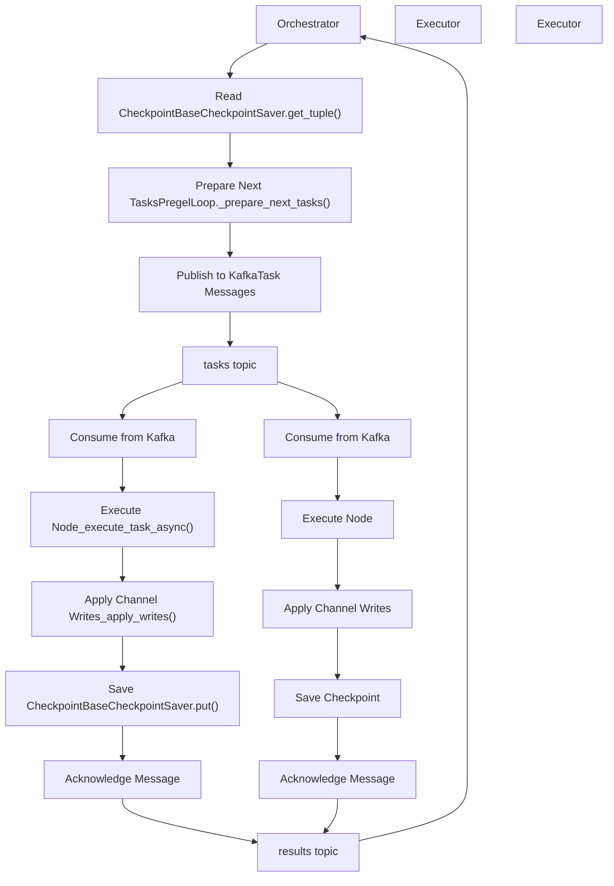
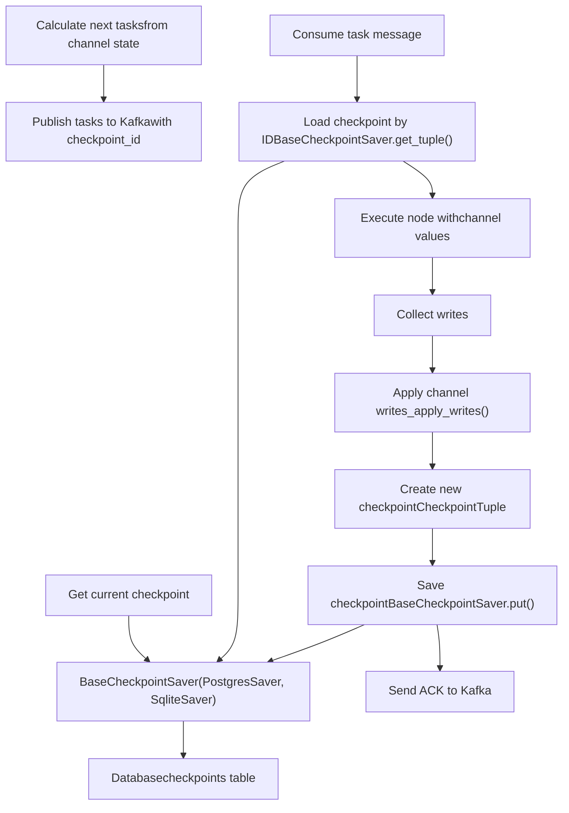
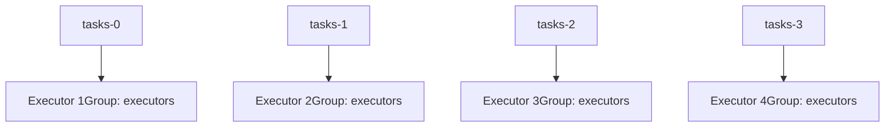
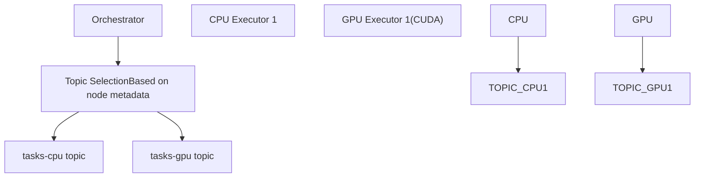

# Distributed Execution with Kafka

Relevant source files

-   [libs/langgraph/tests/compose-postgres.yml](https://github.com/langchain-ai/langgraph/blob/1fd51e8f/libs/langgraph/tests/compose-postgres.yml)

## Purpose and Scope

This document describes the Kafka-based distributed execution system for LangGraph graphs. This system enables horizontal scaling of graph execution across multiple worker processes or machines, allowing workloads to be distributed beyond a single process.

The distributed execution system builds on top of the checkpoint persistence layer to orchestrate work across multiple executors. While the core logic of graph traversal resides in the Pregel engine, the Kafka scheduler provides the transport and coordination layer required for multi-node deployments.

**Note**: The distributed execution system is distinct from parallel node execution within a single graph step (which uses `Send` commands) - this system distributes complete graph execution steps across multiple worker processes.

## Architecture Overview

The Kafka scheduler implements an orchestrator-executor pattern. In this architecture, the **Orchestrator** manages the state machine and graph topology, while **Executors** handle the actual execution of node functions.


**Orchestrator-Executor Pattern for Distributed Graph Execution**

The separation of concerns allows:

-   **Orchestrators** to remain lightweight and handle coordination for many graphs.
-   **Executors** to scale independently based on compute workload.
-   **Work distribution** across heterogeneous machines (e.g., GPU executors for ML nodes).

Sources: This architecture abstracts the internal Pregel loop logic found in `libs/langgraph/langgraph/pregel/_loop.py` and maps it to a distributed message-passing interface.

## Integration with Checkpointing

The distributed execution system relies heavily on the checkpoint persistence layer to maintain consistency across distributed workers. Each step in the execution lifecycle involves checkpoint operations to ensure that state is never lost if a worker fails.


**Checkpoint Lifecycle in Distributed Execution**

Key aspects of checkpoint integration:

1.  **Checkpoint ID in Messages**: Each task message includes the `checkpoint_id` of the state from which it was derived, ensuring executors load the correct state.
2.  **Atomic Checkpoint Writes**: Executors must write both channel updates and the new checkpoint. The `BaseCheckpointSaver.put()` operation is transactional for database-backed implementations.
3.  **Version Conflict Resolution**: If multiple executors attempt to process the same task (due to retries or consumer rebalancing), the checkpoint system's version tracking detects conflicts. Only the first checkpoint write succeeds.

Sources: The checkpoint persistence requirements are defined by the `BaseCheckpointSaver` interface and implemented by `PostgresSaver` in `libs/langgraph-checkpoint-postgres/langgraph/checkpoint/postgres/__init__.py`.

## Scaling and Deployment Patterns

### Horizontal Scaling

Executors can be scaled horizontally by increasing consumer instances within a Kafka consumer group. Kafka's partition assignment ensures that work is distributed evenly while maintaining ordering guarantees for specific threads.


**Kafka Partition Assignment for Parallel Execution**

### Resource-Specific Executors

Nodes can be annotated with resource requirements, allowing orchestrators to route tasks to appropriate executor pools via specialized Kafka topics.


**Resource-Aware Task Routing**

## Comparison with Local Execution

The distributed execution system differs from local execution in its handling of the `Pregel` loop.

| Aspect | Local Execution | Distributed Execution |
| --- | --- | --- |
| **Orchestration** | Single `PregelLoop` in-process | Orchestrator process + Kafka |
| **Task Execution** | Direct function calls in `_execute_task_async` | Executors consume from Kafka |
| **State Persistence** | Optional (can use `InMemorySaver`) | Required (PostgreSQL/SQLite) |
| **Latency** | Microseconds between steps | Milliseconds (network + Kafka) |
| **Fault Tolerance** | Process crash loses in-flight work | Kafka retries + checkpoint recovery |

### Execution Flow Comparison

**Local Execution:** The loop is managed entirely within the `Pregel` class. `Pregel.stream()` → `PregelLoop` → `_execute_task_async()` → `_apply_writes()` → `BaseCheckpointSaver.put()`

**Distributed Execution:** The loop is broken across the network. `Orchestrator` → `_prepare_next_tasks()` → Kafka Publish → `Executor` → `_execute_task_async()` → `_apply_writes()` → `BaseCheckpointSaver.put()` → Kafka ACK → `Orchestrator`

Sources: The local execution logic is defined in `libs/langgraph/langgraph/pregel/__init__.py` and `libs/langgraph/langgraph/pregel/_loop.py`.

## Error Handling and Recovery

The distributed system must handle failures at multiple levels:

1.  **Executor Failures**: If an executor crashes mid-execution, the Kafka consumer group rebalances. Unacknowledged messages are redelivered to another executor.
2.  **Orchestrator Failures**: If an orchestrator crashes, new instances pick up from the last committed offset in the results topic.
3.  **Poison Messages**: If a task consistently fails, the `RetryPolicy` (configured via `RetryPolicy` class) determines the backoff. After max retries, the task is moved to a dead letter queue or the thread is marked as errored.

Sources: Retry logic is governed by `RetryPolicy` defined in `libs/langgraph/langgraph/pregel/retry.py`.

## Infrastructure Requirements

To run the distributed system, a persistent backend is required. For testing and development, a PostgreSQL instance is typically used.

```
# Example service configuration for distributed testingservices:  postgres-test:    image: postgres:16    ports:      - "5442:5432"    environment:      POSTGRES_DB: postgres      POSTGRES_USER: postgres      POSTGRES_PASSWORD: postgres
```
Sources: [libs/langgraph/tests/compose-postgres.yml1-17](https://github.com/langchain-ai/langgraph/blob/1fd51e8f/libs/langgraph/tests/compose-postgres.yml#L1-L17)
