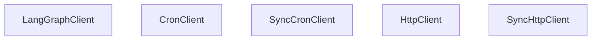

# Cron Jobs

Relevant source files

-   [libs/sdk-py/langgraph\_sdk/\_\_init\_\_.py](https://github.com/langchain-ai/langgraph/blob/1fd51e8f/libs/sdk-py/langgraph_sdk/__init__.py)
-   [libs/sdk-py/langgraph\_sdk/cache.py](https://github.com/langchain-ai/langgraph/blob/1fd51e8f/libs/sdk-py/langgraph_sdk/cache.py)
-   [libs/sdk-py/langgraph\_sdk/client.py](https://github.com/langchain-ai/langgraph/blob/1fd51e8f/libs/sdk-py/langgraph_sdk/client.py)
-   [libs/sdk-py/langgraph\_sdk/schema.py](https://github.com/langchain-ai/langgraph/blob/1fd51e8f/libs/sdk-py/langgraph_sdk/schema.py)
-   [libs/sdk-py/pyproject.toml](https://github.com/langchain-ai/langgraph/blob/1fd51e8f/libs/sdk-py/pyproject.toml)
-   [libs/sdk-py/tests/test\_cache.py](https://github.com/langchain-ai/langgraph/blob/1fd51e8f/libs/sdk-py/tests/test_cache.py)
-   [libs/sdk-py/tests/test\_crons\_client.py](https://github.com/langchain-ai/langgraph/blob/1fd51e8f/libs/sdk-py/tests/test_crons_client.py)

## Purpose and Scope

Cron jobs in LangGraph provide scheduled, recurring execution of assistants. This page documents the cron job data model, API operations, and SDK client methods for managing scheduled tasks via the `CronClient` and `SyncCronClient`. Cron jobs allow for both stateful execution (within a persistent thread) and stateless execution (creating a new thread per run).

**Sources**: [libs/sdk-py/langgraph\_sdk/client.py1-32](https://github.com/langchain-ai/langgraph/blob/1fd51e8f/libs/sdk-py/langgraph_sdk/client.py#L1-L32) [libs/sdk-py/langgraph\_sdk/schema.py156-167](https://github.com/langchain-ai/langgraph/blob/1fd51e8f/libs/sdk-py/langgraph_sdk/schema.py#L156-L167) [libs/sdk-py/langgraph\_sdk/schema.py373-401](https://github.com/langchain-ai/langgraph/blob/1fd51e8f/libs/sdk-py/langgraph_sdk/schema.py#L373-L401)

---

## Cron Data Model

The `Cron` resource represents a scheduled task. Key fields include:

| Field | Type | Description |
| --- | --- | --- |
| `cron_id` | `str` | Unique identifier for the cron job. |
| `assistant_id` | `str` | ID of the assistant to execute. |
| `thread_id` | `str | None` | Optional thread ID for stateful execution. |
| `schedule` | `str` | Cron expression (e.g., `0 0 * * *`) defining the schedule. |
| `payload` | `dict` | Run parameters (input, config, etc.) passed to each execution. |
| `on_run_completed` | `OnCompletionBehavior | None` | Action after completion (stateless only): `"delete"` or `"keep"`. |
| `end_time` | `datetime | None` | Optional date to stop the recurring execution. |
| `next_run_date` | `datetime | None` | The next scheduled execution timestamp. |
| `enabled` | `bool` | Whether the cron job is currently active. |

**Sources**: [libs/sdk-py/langgraph\_sdk/schema.py373-401](https://github.com/langchain-ai/langgraph/blob/1fd51e8f/libs/sdk-py/langgraph_sdk/schema.py#L373-L401) [libs/sdk-py/langgraph\_sdk/schema.py97-102](https://github.com/langchain-ai/langgraph/blob/1fd51e8f/libs/sdk-py/langgraph_sdk/schema.py#L97-L102)

---

## Cron Job Execution Model

The following diagram illustrates how the `CronClient` interacts with the LangGraph API to manage the lifecycle of scheduled runs.

### Natural Language to Code Entity Space: Execution Flow

**Sources**: [libs/sdk-py/langgraph\_sdk/client.py12-31](https://github.com/langchain-ai/langgraph/blob/1fd51e8f/libs/sdk-py/langgraph_sdk/client.py#L12-L31) [libs/sdk-py/tests/test\_crons\_client.py34-62](https://github.com/langchain-ai/langgraph/blob/1fd51e8f/libs/sdk-py/tests/test_crons_client.py#L34-L62) [libs/sdk-py/tests/test\_crons\_client.py100-128](https://github.com/langchain-ai/langgraph/blob/1fd51e8f/libs/sdk-py/tests/test_crons_client.py#L100-L128)

---

## Stateful vs Stateless Crons

### Stateful Crons

Stateful crons execute within a persistent thread. This is useful for periodic check-ins or tasks that require historical context.

-   **`thread_id`**: Must be provided during creation.
-   **API Route**: `POST /threads/{thread_id}/runs/crons`
-   **Method**: `CronClient.create_for_thread`

### Stateless Crons

Stateless crons trigger a run that is independent of a specific persistent thread (though a thread is created for the duration of the run).

-   **`thread_id`**: Omitted.
-   **`on_run_completed`**: Determines if the temporary thread is kept or deleted.
-   **API Route**: `POST /runs/crons`
-   **Method**: `CronClient.create`

**Sources**: [libs/sdk-py/tests/test\_crons\_client.py34-62](https://github.com/langchain-ai/langgraph/blob/1fd51e8f/libs/sdk-py/tests/test_crons_client.py#L34-L62) [libs/sdk-py/tests/test\_crons\_client.py100-128](https://github.com/langchain-ai/langgraph/blob/1fd51e8f/libs/sdk-py/tests/test_crons_client.py#L100-L128) [libs/sdk-py/langgraph\_sdk/schema.py380-381](https://github.com/langchain-ai/langgraph/blob/1fd51e8f/libs/sdk-py/langgraph_sdk/schema.py#L380-L381)

---

## Schedule Format

The `schedule` string follows standard cron syntax: `minute hour day-of-month month day-of-week`

| Example | Meaning |
| --- | --- |
| `0 0 * * *` | Every day at midnight |
| `0 9 * * 1-5` | Every weekday at 9:00 AM |
| `*/15 * * * *` | Every 15 minutes |

**Sources**: [libs/sdk-py/langgraph\_sdk/schema.py386-387](https://github.com/langchain-ai/langgraph/blob/1fd51e8f/libs/sdk-py/langgraph_sdk/schema.py#L386-L387)

---

## CronClient SDK Interface

The `CronClient` (async) and `SyncCronClient` (sync) provide the primary interface for managing these resources.

### Class Association Diagram


**Sources**: [libs/sdk-py/langgraph\_sdk/client.py12-31](https://github.com/langchain-ai/langgraph/blob/1fd51e8f/libs/sdk-py/langgraph_sdk/client.py#L12-L31) [libs/sdk-py/langgraph\_sdk/client.py33-55](https://github.com/langchain-ai/langgraph/blob/1fd51e8f/libs/sdk-py/langgraph_sdk/client.py#L33-L55)

### Key Methods

#### Create Cron

Creates a cron job for an assistant.

```
# Asynccron = await client.crons.create(    assistant_id="asst_123",    schedule="0 12 * * *",    input={"query": "Daily summary"},    end_time=datetime(2025, 1, 1, tzinfo=timezone.utc))
```
**Sources**: [libs/sdk-py/tests/test\_crons\_client.py100-128](https://github.com/langchain-ai/langgraph/blob/1fd51e8f/libs/sdk-py/tests/test_crons_client.py#L100-L128) [libs/sdk-py/tests/test\_crons\_client.py131-161](https://github.com/langchain-ai/langgraph/blob/1fd51e8f/libs/sdk-py/tests/test_crons_client.py#L131-L161)

#### Create Cron for Thread

Creates a cron job specifically for a thread (stateful).

```
# Synccron = client.crons.create_for_thread(    thread_id="thread_123",    assistant_id="asst_123",    schedule="0 0 * * *")
```
**Sources**: [libs/sdk-py/tests/test\_crons\_client.py163-190](https://github.com/langchain-ai/langgraph/blob/1fd51e8f/libs/sdk-py/tests/test_crons_client.py#L163-L190) [libs/sdk-py/tests/test\_crons\_client.py34-62](https://github.com/langchain-ai/langgraph/blob/1fd51e8f/libs/sdk-py/tests/test_crons_client.py#L34-L62)

#### Search and List

Filter and sort existing cron jobs.

-   **`order_by`**: Field to sort by (e.g., `"next_run_date"`, `"created_at"`).
-   **`order`**: `"asc"` or `"desc"`.

**Sources**: [libs/sdk-py/langgraph\_sdk/schema.py156-172](https://github.com/langchain-ai/langgraph/blob/1fd51e8f/libs/sdk-py/langgraph_sdk/schema.py#L156-L172) [libs/sdk-py/langgraph\_sdk/schema.py479-494](https://github.com/langchain-ai/langgraph/blob/1fd51e8f/libs/sdk-py/langgraph_sdk/schema.py#L479-L494)

---

## Payload Management

The `payload` of a cron job contains the execution parameters that will be used for every triggered run. This typically includes:

-   **`input`**: The initial state or message for the graph.
-   **`config`**: `recursion_limit`, `tags`, and `configurable` parameters.
-   **`metadata`**: Key-value pairs for tracking.

The `end_time` parameter ensures that the cron job automatically stops triggering after a certain date, preventing orphaned scheduled tasks.

**Sources**: [libs/sdk-py/langgraph\_sdk/schema.py175-196](https://github.com/langchain-ai/langgraph/blob/1fd51e8f/libs/sdk-py/langgraph_sdk/schema.py#L175-L196) [libs/sdk-py/tests/test\_crons\_client.py66-96](https://github.com/langchain-ai/langgraph/blob/1fd51e8f/libs/sdk-py/tests/test_crons_client.py#L66-L96)

---

## Server-Side Caching for Crons

In high-frequency cron environments, developers may use the `langgraph_sdk.cache` module (server-side only) to store intermediate results between cron runs.

-   **`cache_get(key)`**: Retrieve a JSON-serializable value.
-   **`cache_set(key, value, ttl)`**: Store a value with a TTL (max 1 day).
-   **`swr(key, loader, ...)`**: Stale-while-revalidate pattern for efficient data fetching within graph nodes triggered by crons.

**Sources**: [libs/sdk-py/langgraph\_sdk/cache.py56-141](https://github.com/langchain-ai/langgraph/blob/1fd51e8f/libs/sdk-py/langgraph_sdk/cache.py#L56-L141) [libs/sdk-py/tests/test\_cache.py10-38](https://github.com/langchain-ai/langgraph/blob/1fd51e8f/libs/sdk-py/tests/test_cache.py#L10-L38)
