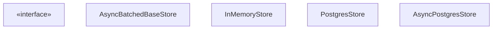

# Store API

Relevant source files

-   [libs/checkpoint-postgres/langgraph/store/postgres/aio.py](https://github.com/langchain-ai/langgraph/blob/1fd51e8f/libs/checkpoint-postgres/langgraph/store/postgres/aio.py)
-   [libs/checkpoint-postgres/langgraph/store/postgres/base.py](https://github.com/langchain-ai/langgraph/blob/1fd51e8f/libs/checkpoint-postgres/langgraph/store/postgres/base.py)
-   [libs/checkpoint-postgres/tests/conftest.py](https://github.com/langchain-ai/langgraph/blob/1fd51e8f/libs/checkpoint-postgres/tests/conftest.py)
-   [libs/checkpoint-postgres/tests/test\_async\_store.py](https://github.com/langchain-ai/langgraph/blob/1fd51e8f/libs/checkpoint-postgres/tests/test_async_store.py)
-   [libs/checkpoint-postgres/tests/test\_store.py](https://github.com/langchain-ai/langgraph/blob/1fd51e8f/libs/checkpoint-postgres/tests/test_store.py)
-   [libs/checkpoint/langgraph/store/base/\_\_init\_\_.py](https://github.com/langchain-ai/langgraph/blob/1fd51e8f/libs/checkpoint/langgraph/store/base/__init__.py)
-   [libs/checkpoint/langgraph/store/base/batch.py](https://github.com/langchain-ai/langgraph/blob/1fd51e8f/libs/checkpoint/langgraph/store/base/batch.py)
-   [libs/checkpoint/langgraph/store/base/embed.py](https://github.com/langchain-ai/langgraph/blob/1fd51e8f/libs/checkpoint/langgraph/store/base/embed.py)
-   [libs/checkpoint/langgraph/store/memory/\_\_init\_\_.py](https://github.com/langchain-ai/langgraph/blob/1fd51e8f/libs/checkpoint/langgraph/store/memory/__init__.py)
-   [libs/checkpoint/tests/test\_store.py](https://github.com/langchain-ai/langgraph/blob/1fd51e8f/libs/checkpoint/tests/test_store.py)
-   [libs/langgraph/tests/memory\_assert.py](https://github.com/langchain-ai/langgraph/blob/1fd51e8f/libs/langgraph/tests/memory_assert.py)

This page documents the Store API for cross-thread persistent storage. It covers the namespace model, core operations (`put`, `get`, `search`, `delete`, `list_namespaces`), data types, and implementation details for both synchronous and asynchronous backends.

---

## Architecture Overview

The Store system provides a unified interface for long-term memory that persists across different threads and conversations [libs/checkpoint/langgraph/store/base/\_\_init\_\_.py1-10](https://github.com/langchain-ai/langgraph/blob/1fd51e8f/libs/checkpoint/langgraph/store/base/__init__.py#L1-L10) It supports hierarchical namespaces, key-value storage, and optional vector search [libs/checkpoint/langgraph/store/base/\_\_init\_\_.py1-10](https://github.com/langchain-ai/langgraph/blob/1fd51e8f/libs/checkpoint/langgraph/store/base/__init__.py#L1-L10)

**Store Entity Relationship Diagram**

Sources: [libs/checkpoint/langgraph/store/base/\_\_init\_\_.py1-50](https://github.com/langchain-ai/langgraph/blob/1fd51e8f/libs/checkpoint/langgraph/store/base/__init__.py#L1-L50) [libs/checkpoint/langgraph/store/base/batch.py58-68](https://github.com/langchain-ai/langgraph/blob/1fd51e8f/libs/checkpoint/langgraph/store/base/batch.py#L58-L68) [libs/checkpoint/langgraph/store/memory/\_\_init\_\_.py136-183](https://github.com/langchain-ai/langgraph/blob/1fd51e8f/libs/checkpoint/langgraph/store/memory/__init__.py#L136-L183) [libs/checkpoint-postgres/langgraph/store/postgres/aio.py42-141](https://github.com/langchain-ai/langgraph/blob/1fd51e8f/libs/checkpoint-postgres/langgraph/store/postgres/aio.py#L42-L141)

---

## Namespace Model

Items are organized into **namespaces**: ordered tuples of strings forming a hierarchical path [libs/checkpoint/langgraph/store/base/\_\_init\_\_.py57-59](https://github.com/langchain-ai/langgraph/blob/1fd51e8f/libs/checkpoint/langgraph/store/base/__init__.py#L57-L59)

| Concept | Representation | Example |
| --- | --- | --- |
| **Namespace** | `tuple[str, ...]` | `("documents", "user123")` |
| **Key** | `str` | `"profile_prefs"` |
| **Item** | `Item` object | Contains `value` (dict), `key`, and `namespace` |

Namespaces allow for nested categorization. For example, `("users", "123", "settings")` is distinct from `("users", "456", "settings")` [libs/checkpoint/langgraph/store/base/\_\_init\_\_.py57-60](https://github.com/langchain-ai/langgraph/blob/1fd51e8f/libs/checkpoint/langgraph/store/base/__init__.py#L57-L60)

Sources: [libs/checkpoint/langgraph/store/base/\_\_init\_\_.py51-115](https://github.com/langchain-ai/langgraph/blob/1fd51e8f/libs/checkpoint/langgraph/store/base/__init__.py#L51-L115) [libs/checkpoint/langgraph/store/base/batch.py141-151](https://github.com/langchain-ai/langgraph/blob/1fd51e8f/libs/checkpoint/langgraph/store/base/batch.py#L141-L151)

---

## Data Models

### Item and SearchItem

The `Item` class represents a stored document with its metadata [libs/checkpoint/langgraph/store/base/\_\_init\_\_.py51-52](https://github.com/langchain-ai/langgraph/blob/1fd51e8f/libs/checkpoint/langgraph/store/base/__init__.py#L51-L52)

| Field | Type | Description |
| --- | --- | --- |
| `value` | `dict[str, Any]` | The actual stored data. Keys are filterable [libs/checkpoint/langgraph/store/base/\_\_init\_\_.py55](https://github.com/langchain-ai/langgraph/blob/1fd51e8f/libs/checkpoint/langgraph/store/base/__init__.py#L55-L55) |
| `key` | `str` | Unique identifier within the namespace [libs/checkpoint/langgraph/store/base/\_\_init\_\_.py56](https://github.com/langchain-ai/langgraph/blob/1fd51e8f/libs/checkpoint/langgraph/store/base/__init__.py#L56-L56) |
| `namespace` | `tuple[str, ...]` | Hierarchical path [libs/checkpoint/langgraph/store/base/\_\_init\_\_.py57](https://github.com/langchain-ai/langgraph/blob/1fd51e8f/libs/checkpoint/langgraph/store/base/__init__.py#L57-L57) |
| `created_at` | `datetime` | Timestamp of creation [libs/checkpoint/langgraph/store/base/\_\_init\_\_.py60](https://github.com/langchain-ai/langgraph/blob/1fd51e8f/libs/checkpoint/langgraph/store/base/__init__.py#L60-L60) |
| `updated_at` | `datetime` | Timestamp of last update [libs/checkpoint/langgraph/store/base/\_\_init\_\_.py61](https://github.com/langchain-ai/langgraph/blob/1fd51e8f/libs/checkpoint/langgraph/store/base/__init__.py#L61-L61) |

`SearchItem` extends `Item` by adding a `score` field for relevance/similarity in vector searches [libs/checkpoint/langgraph/store/base/\_\_init\_\_.py118-121](https://github.com/langchain-ai/langgraph/blob/1fd51e8f/libs/checkpoint/langgraph/store/base/__init__.py#L118-L121)

Sources: [libs/checkpoint/langgraph/store/base/\_\_init\_\_.py51-155](https://github.com/langchain-ai/langgraph/blob/1fd51e8f/libs/checkpoint/langgraph/store/base/__init__.py#L51-L155)

---

## Core Operations

The API utilizes a batching pattern where operations are encapsulated as `Op` objects and processed together [libs/checkpoint/langgraph/store/base/\_\_init\_\_.py9](https://github.com/langchain-ai/langgraph/blob/1fd51e8f/libs/checkpoint/langgraph/store/base/__init__.py#L9-L9)

### Operation Types

| Operation | Code Entity | Description |
| --- | --- | --- |
| **Get** | `GetOp` | Retrieve an item by namespace and key [libs/checkpoint/langgraph/store/base/\_\_init\_\_.py157-161](https://github.com/langchain-ai/langgraph/blob/1fd51e8f/libs/checkpoint/langgraph/store/base/__init__.py#L157-L161) |
| **Put** | `PutOp` | Create or update an item; `value=None` performs a delete [libs/checkpoint/langgraph/store/base/\_\_init\_\_.py431-435](https://github.com/langchain-ai/langgraph/blob/1fd51e8f/libs/checkpoint/langgraph/store/base/__init__.py#L431-L435) |
| **Search** | `SearchOp` | Query items using filters or natural language (vector search) [libs/checkpoint/langgraph/store/base/\_\_init\_\_.py203-208](https://github.com/langchain-ai/langgraph/blob/1fd51e8f/libs/checkpoint/langgraph/store/base/__init__.py#L203-L208) |
| **List** | `ListNamespacesOp` | List available namespaces with prefix/suffix matching [libs/checkpoint/langgraph/store/base/\_\_init\_\_.py310-315](https://github.com/langchain-ai/langgraph/blob/1fd51e8f/libs/checkpoint/langgraph/store/base/__init__.py#L310-L315) |

**Data Flow: Async Batched Operations**

> **[Mermaid sequence]**
> *(图表结构无法解析)*

Sources: [libs/checkpoint/langgraph/store/base/batch.py58-101](https://github.com/langchain-ai/langgraph/blob/1fd51e8f/libs/checkpoint/langgraph/store/base/batch.py#L58-L101) [libs/checkpoint/langgraph/store/base/batch.py131-151](https://github.com/langchain-ai/langgraph/blob/1fd51e8f/libs/checkpoint/langgraph/store/base/batch.py#L131-L151)

---

## Vector Search and Indexing

Store implementations can optionally support semantic search using embeddings [libs/checkpoint/langgraph/store/base/embed.py1-7](https://github.com/langchain-ai/langgraph/blob/1fd51e8f/libs/checkpoint/langgraph/store/base/embed.py#L1-L7)

### Configuration

The `IndexConfig` (or `PostgresIndexConfig` for pgvector) defines how fields are embedded [libs/checkpoint-postgres/langgraph/store/postgres/base.py219-230](https://github.com/langchain-ai/langgraph/blob/1fd51e8f/libs/checkpoint-postgres/langgraph/store/postgres/base.py#L219-L230)

-   **`dims`**: Dimensionality of the vector [libs/checkpoint-postgres/langgraph/store/postgres/base.py224](https://github.com/langchain-ai/langgraph/blob/1fd51e8f/libs/checkpoint-postgres/langgraph/store/postgres/base.py#L224-L224)
-   **`embed`**: Embedding function (sync or async) [libs/checkpoint/langgraph/store/base/embed.py34-40](https://github.com/langchain-ai/langgraph/blob/1fd51e8f/libs/checkpoint/langgraph/store/base/embed.py#L34-L40)
-   **`fields`**: List of JSON paths in the `value` dict to index. Defaults to `["$"]` (the entire document) [libs/checkpoint-postgres/langgraph/store/postgres/base.py228](https://github.com/langchain-ai/langgraph/blob/1fd51e8f/libs/checkpoint-postgres/langgraph/store/postgres/base.py#L228-L228)

### Field Extraction

The `get_text_at_path` utility extracts strings from nested dictionaries for embedding [libs/checkpoint/langgraph/store/base/embed.py32](https://github.com/langchain-ai/langgraph/blob/1fd51e8f/libs/checkpoint/langgraph/store/base/embed.py#L32-L32) It supports dot notation (`info.age`) and wildcards (`items[*].value`) [libs/checkpoint/tests/test\_store.py73-110](https://github.com/langchain-ai/langgraph/blob/1fd51e8f/libs/checkpoint/tests/test_store.py#L73-L110)

Sources: [libs/checkpoint-postgres/langgraph/store/postgres/base.py177-230](https://github.com/langchain-ai/langgraph/blob/1fd51e8f/libs/checkpoint-postgres/langgraph/store/postgres/base.py#L177-L230) [libs/checkpoint/langgraph/store/base/embed.py34-106](https://github.com/langchain-ai/langgraph/blob/1fd51e8f/libs/checkpoint/langgraph/store/base/embed.py#L34-L106) [libs/checkpoint/tests/test\_store.py73-140](https://github.com/langchain-ai/langgraph/blob/1fd51e8f/libs/checkpoint/tests/test_store.py#L73-L140)

---

## Persistence Implementations

### PostgreSQL (`PostgresStore` / `AsyncPostgresStore`)

Uses two primary tables: `store` for key-value data and `store_vectors` for embeddings [libs/checkpoint-postgres/langgraph/store/postgres/base.py64-113](https://github.com/langchain-ai/langgraph/blob/1fd51e8f/libs/checkpoint-postgres/langgraph/store/postgres/base.py#L64-L113)

-   **Schema**: `store` table uses `(prefix, key)` as the primary key [libs/checkpoint-postgres/langgraph/store/postgres/base.py71](https://github.com/langchain-ai/langgraph/blob/1fd51e8f/libs/checkpoint-postgres/langgraph/store/postgres/base.py#L71-L71)
-   **pgvector**: Supports `hnsw`, `ivfflat`, and `flat` index types [libs/checkpoint-postgres/langgraph/store/postgres/base.py180-181](https://github.com/langchain-ai/langgraph/blob/1fd51e8f/libs/checkpoint-postgres/langgraph/store/postgres/base.py#L180-L181)
-   **TTL Support**: Includes `expires_at` and `ttl_minutes` columns for automatic cleanup [libs/checkpoint-postgres/langgraph/store/postgres/base.py79-83](https://github.com/langchain-ai/langgraph/blob/1fd51e8f/libs/checkpoint-postgres/langgraph/store/postgres/base.py#L79-L83)

### In-Memory (`InMemoryStore`)

Uses Python dictionaries for storage. It is suitable for testing or ephemeral data [libs/checkpoint/langgraph/store/memory/\_\_init\_\_.py1-10](https://github.com/langchain-ai/langgraph/blob/1fd51e8f/libs/checkpoint/langgraph/store/memory/__init__.py#L1-L10)

-   **`_data`**: Maps `tuple[str, ...]` to a sub-dict of keys to `Item` objects [libs/checkpoint/langgraph/store/memory/\_\_init\_\_.py186](https://github.com/langchain-ai/langgraph/blob/1fd51e8f/libs/checkpoint/langgraph/store/memory/__init__.py#L186-L186)
-   **`_vectors`**: Stores embeddings for in-memory similarity search [libs/checkpoint/langgraph/store/memory/\_\_init\_\_.py188-190](https://github.com/langchain-ai/langgraph/blob/1fd51e8f/libs/checkpoint/langgraph/store/memory/__init__.py#L188-L190)

Sources: [libs/checkpoint-postgres/langgraph/store/postgres/base.py62-144](https://github.com/langchain-ai/langgraph/blob/1fd51e8f/libs/checkpoint-postgres/langgraph/store/postgres/base.py#L62-L144) [libs/checkpoint/langgraph/store/memory/\_\_init\_\_.py136-205](https://github.com/langchain-ai/langgraph/blob/1fd51e8f/libs/checkpoint/langgraph/store/memory/__init__.py#L136-L205)

---

## TTL (Time-to-Live) Management

The Store API supports expiring items after a specific duration [libs/checkpoint/langgraph/store/base/\_\_init\_\_.py545](https://github.com/langchain-ai/langgraph/blob/1fd51e8f/libs/checkpoint/langgraph/store/base/__init__.py#L545-L545)

1.  **Configuration**: `TTLConfig` sets `default_ttl`, `refresh_on_read`, and `sweep_interval_minutes` [libs/checkpoint/langgraph/store/base/\_\_init\_\_.py545-565](https://github.com/langchain-ai/langgraph/blob/1fd51e8f/libs/checkpoint/langgraph/store/base/__init__.py#L545-L565)
2.  **Sweeper**: `AsyncPostgresStore` runs a background task (`_ttl_sweeper_loop`) that deletes expired items periodically [libs/checkpoint-postgres/langgraph/store/postgres/aio.py296-330](https://github.com/langchain-ai/langgraph/blob/1fd51e8f/libs/checkpoint-postgres/langgraph/store/postgres/aio.py#L296-L330)
3.  **Refresh**: If `refresh_ttl` is enabled in a `GetOp` or `SearchOp`, the `expires_at` timestamp is updated on access [libs/checkpoint/langgraph/store/base/\_\_init\_\_.py194-200](https://github.com/langchain-ai/langgraph/blob/1fd51e8f/libs/checkpoint/langgraph/store/base/__init__.py#L194-L200)

Sources: [libs/checkpoint/langgraph/store/base/\_\_init\_\_.py545-565](https://github.com/langchain-ai/langgraph/blob/1fd51e8f/libs/checkpoint/langgraph/store/base/__init__.py#L545-L565) [libs/checkpoint-postgres/langgraph/store/postgres/base.py79-89](https://github.com/langchain-ai/langgraph/blob/1fd51e8f/libs/checkpoint-postgres/langgraph/store/postgres/base.py#L79-L89) [libs/checkpoint-postgres/langgraph/store/postgres/aio.py296-350](https://github.com/langchain-ai/langgraph/blob/1fd51e8f/libs/checkpoint-postgres/langgraph/store/postgres/aio.py#L296-L350)
